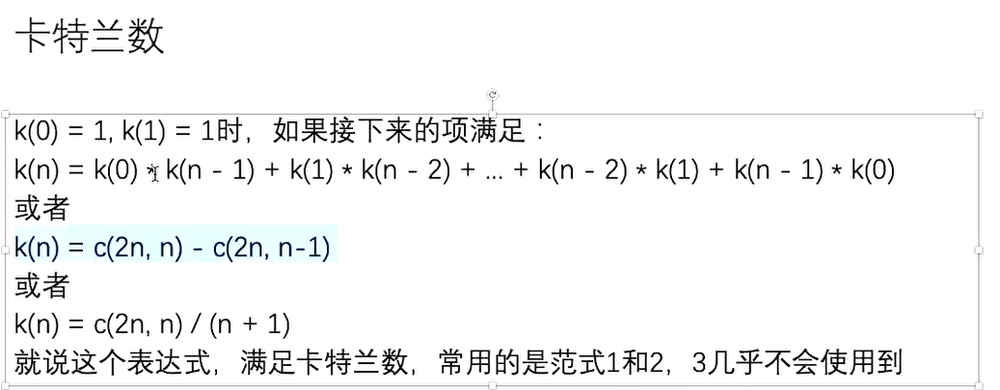

## 第一节 

```text
笔记

常见的子串，子数组，子xx 都可以用下面的思路
以每个位置开头
以每个位置结尾。
这样的好处是可以动态规划，
如果以每个结束位置分类， dp表应该是从左往右填
如果以每个开始位置分类， db表应该是从右往左填

单调性
如果发现存在单调性，证明一定有优雅解法。

滑动窗口使用条件 : 可以维持住单调性
如果维持不住窗口或者 单调性没有继承性的话无法使用。

在 N * N 的矩阵中
所有长方形的个数 ： O(N ^ 4)
所有正方形的个数 ： O(N ^ 3)
因此如果主流程可以确定算法复杂度至少是一个量级，比如是N ^ 3，可以在细节方面看一下是否可以优化
比如通过预处理数组，和打表，但是注意这里的处理方法复杂度不会影响之前的复杂度。
总体思路 ： 大流程 + 加速查询。

```


#### 题目一  绳子最多覆盖的点

给定一个有序数组arr,从左到右依次表示X轴上从左往右点的位置
给定一个正整数K,返回如果有一根长度为K的绳子，最多能盖住几个点
绳子的边缘点碰到X轴上的点，也算盖住


```text
知识点 滑动窗口

这里有一个小贪心边缘一定要压住一个点

可以使用二分，枚举每个位置i结尾，然后通过二分求i - K的最左位置即可 但不是最优解

滑动过程 
如果长度满足，把求一下结果。
然后L ++，看R 最多扩充多少，有可能不扩充
L,R至少有一个点，因为一个点一定满足。
这玩意好难写，看一下代码就懂了。
```


```java
public class Code01CordCoverMaxPoint {
    public static int maxPoint(int[] arr, int k) {
        int l = 0;
        int r = 0;
        int ans = 0;
        //范围是 [L, R)
        //于是判断越界是 R < arr.length即可
        while (r < arr.length) {
            if (arr[r] - arr[l] <= k) {
                r++;
                ans = Math.max(ans, r - l);
            } else {
                l++;
            }
        }
        return ans;
    }
}
```


#### 题目二 括号匹配

括号有效配对是指：
1)任何一个左括号都能找到和其正确配对的右括号
2)任何一个右括号都能找到和其正确配对的左括号
有效的：(())  ()()  (()())等
无效的：(()  )(  等
问题一：怎么判断一个括号字符串有效？
问题二：如果一个括号字符串无效，返回至少填几个字符能让其整体有效


```text
知识点 简单个数统计

这里的非常简单，不需要使用栈
遇到 （ 就 ++
遇到 ） 就 --
注意如果某一步，count 已经小于0 就返回false因为无论如何多的一个）不可能通过后面的（连接成功
最后返回 count == 0即可

问题二就是 把上面的返回 取消 need ++ ,然后 把count重新置0，
最后 count + need的值就是结果。
```


```java
public class Code02NeedParentheses {
    public static boolean isValid(String s) {
        char[] chs = s.toCharArray();
        int count = 0;
        for (char ch : chs) {
            if (count < 0) {
                return false;
            } else if (ch == ')') {
                count--;
            } else {
                count++;
            }
        }
        return count == 0;
    }

    public static int needParentheses(String s) {
        char[] chs = s.toCharArray();
        int count = 0;
        int need = 0;
        for (char ch : chs) {
            if (ch == '(') {
                count++;
            } else {
                if (count == 0) {
                    need++;
                } else {
                    count--;
                }
            }
        }
        return count + need;
    }


    public static void main(String[] args) {
        String canCanNeed = "(())";
        System.out.println(isValid(canCanNeed));
        System.out.println(needParentheses(canCanNeed));
    }
}
```


#### 题目三 最长有效括号长度

---

> 括号有效配对是指：
> 1)任何一个左括号都能找到和其正确配对的右括号
> 2)任何一个右括号都能找到和其正确配对的左括号
> 返回一个括号字符串中，最长的括号有效子串的长度

---


```text
动态规划


这里以每个位置结尾讨论，因为可以正方向使用动态规划

下面来看如何通过 来到i位置，利用i - 1以及之前的值求出 i位置的值

首先 0位置 一定是 0 因为一个字符不可能成对
然后如果 i位置 的值 是 （ 也不可能， 因为成对的不可能以 （ 开头

然后如果 i- 1位置是 4， 我们就看 i- 5位置的值，如果是 ） 那么这里的值就是 0（自己取证明，举个例子一想就会了）
如果 i - 5位置是 （ 我们知道这里的值至少是 dp[i - 1] + 2，
然后 + dp[i - 6]的结果才是最终结果（因为 我们连成更大的值比如 （）（） 求这个的过程，自己写一下就会了然）
为什么不用再向前看了 ？ 因为再向前的值 dp[i - 6] 已经求过。

下面的deep方法是值给我们一个合法的串。求串的深度（最多有多少括号包着）。
求解思路也很简单，求count的最大值即可，因为count会 ++ 或 --

```


```java
package com.lihd.part01;

/**
 * @author ：葬花吟留别1851053336@qq.com
 * @description：TODO
 * @date ：2022/6/9 21:21
 */
public class Code03ParenthesesDeep {


    public static int deep(String valid) {
        char[] chs = valid.toCharArray();
        int count = 0;
        int ans = 0;

        for (int i = 0; i < chs.length; i++) {
            if (chs[i] == '(') {
                count++;
            } else {
                count--;
            }
            ans = Math.max(ans, count);
        }
        return ans;
    }


    public static int maxLength(String s) {
        char[] chs = s.toCharArray();
        int[] dp = new int[chs.length];
        //dp[0] = 0不用填入，因为默认就是0
        int max = 0;
        for (int i = 1; i < chs.length; i++) {
            if (chs[i] == ')') {
                int leftIndex = i - dp[i - 1] - 1;
                if (leftIndex >= 0 && chs[leftIndex] == '(') {
                    dp[i] = dp[i - 1] + 2 + (leftIndex > 0 ? dp[leftIndex - 1] : 0);
                }
                max = Math.max(max, dp[i]);
            }
        }
        return max;
    }

    public static void main(String[] args) {
        String canCanNeed = "((()()(())()))";
        System.out.println(maxLength(canCanNeed));
        System.out.println(deep(canCanNeed));
    }
}

```


#### 题目四 红绿染色

有一些排成一行的正方形。每个正方形已经被染成红色或者绿色。现在可以
选择任意一个正方形然后用这两种颜色的任意一种进行染色，这个正方形的颜
色将会被覆盖。目标是在完成染色之后，每个红色R都比每个绿色G距离最左侧
近。返回最少需要涂染几个正方形。
如样例所示：s=RGRGR我们涂染之后变成RRRGG满足要求了，涂染的个数为2，
没有比这个更好的涂染方案。


```text
知识点 枚举分割线


我们枚举每个分界线
包括左边和右边什么都没有的情况
把左边所有的绿色染成红色， 把右边所有的红色染成绿色 就可以实现
因此结果是 redCount + greenCount
我们枚举所有位置，最小值就是答案。时间复杂度 O （N)

看似需要两个预处理数组，实际上一个也不用。
首先由于 greenCount 是从左到右统计的，必定可以省略（因为我们的流程就是从左到右枚举，顺手就能更新）
那为什么从右到左也可以省略呢 ？ 因为 原数组只有两个值，我们求出总数，可以通过 -- 的方式，不断更新。
我猜测如果数组只有两种值，是有可能省略 从右到左的预处理数组。
空间复杂度 O(1)

一定是最优解。
```


```java
public class Code04ColorLeftRight {


    public static int colorMin(String s) {

        char[] chs = s.toCharArray();
        int redCount = 0;
        for (char ch : chs) {
            if (ch == 'R') {
                redCount++;
            }
        }
        int greenCount = 0;
        int ans = redCount;
        for (char ch : chs) {
            if (ch == 'G') {
                greenCount++;
            } else {
                redCount--;
            }
            ans = Math.min(ans, redCount + greenCount);
        }
//        ans = Math.min(ans, greenCount);
        return ans;
    }

    public static void main(String[] args) {
        String canCanNeed = "GGGGGR";
        System.out.println(colorMin(canCanNeed));

    }

}

```


#### 题目五 边缘是1的最大正方形边长

---

给定一个N*N的矩阵 matrix , 只有0 和 1两种值，返回边框全是1的最大正方形的边长长度

例如：
01111
01001
01001
01111
01011
其中边框全是1的最大正方形的大小为4*4，所以返回4。


```text
知识点 预处理矩阵

思路 ： 首先复杂度是 O(N^3) 通过预处理矩阵控制复杂度不比这个大

先枚举每个点，然后枚举边长，
i 位置连续向右的1 比边长大
i 位置连续向下的1 比边长大
i 右边的点位置连续向下的1 比边长大
i 下面的点位置连续向下的1 比边长大
就可以证明这是正方形。

然后生成这个预处理数组即可

下面的break 合理吗，会不会少掉情况 ？
不会，小范围越界，大范围一定越界。早break优化常数时间。已经通过测试，不过自己感觉代码玄玄的。

```


```java
public class Code05MaxOneBorderSize {

    public static int getMaxSquare(int[][] matrix) {
        int n = matrix.length;
        int r = matrix[0].length;

        int[][] rightMaxOne = new int[n][r];
        int[][] downMaxOne = new int[n][r];

        //填好边界
        for (int i = 0; i < n; i++) {
            rightMaxOne[i][r - 1] = matrix[i][r - 1];
        }
        for (int i = 0; i < r; i++) {
            downMaxOne[n - 1][i] = matrix[n - 1][i];
        }

        //填好其他

        //行 -》  列 《-
        for (int i = 0; i < n; i++) {
            for (int j = r - 2; j >= 0; j--) {
                rightMaxOne[i][j] = matrix[i][j] == 0 ? 0 : 1 + rightMaxOne[i][j + 1];
            }
        }

        //i 代表 row, j 代表 col
        //行倒着填，列正向填
        for (int i = n - 2; i >= 0; i--) {
            for (int j = 0; j < r; j++) {
                downMaxOne[i][j] = matrix[i][j] == 0 ? 0 : 1 + downMaxOne[i + 1][j];
            }
        }
        int ans = 0;
        //枚举所有点
        for (int i = 0; i < n; i++) {
            for (int j = 0; j < r; j++) {
                for (int sl = 1; sl < n + r; sl++) {
                    if (i + sl <= n && j + sl <= r) {
                        if (downMaxOne[i][j] >= sl && rightMaxOne[i][j] >= sl && downMaxOne[i][j + sl - 1] >= sl && rightMaxOne[i + sl - 1][j] >= sl) {
                            ans = Math.max(ans, sl);
                        }
                    } else {
                        break;
                    }
                }
            }
        }
        return ans;
    }
}
```


#### 题目六 构造奇怪的数组

给定一个正整数M,请构造出一个长度为M的数组arr,要求
对任意的i、j、k三个位置，如果i<j<k,都有arr[i]+arr[k] != 2*arr[j]
返回构造出的arr


```text
知识点 分治法 + 数学原理

假设 [a, b, c] 满足 a + c 不能与 2b
那么[2a,2b,2c]也满足
[2a - 1, 2b - 1, 2c - 1]也满足

下面证明[2a - 1, 2b - 1, 2c - 1,2a,2b,2c]
因为
如果 i 和 k都在左边（全是奇数的一边），必定不满足。
如果 i 和 k都在右边（全是偶数的一边），必定不满足。
如果 i 在左边，k在右边。那么i + k一定是奇数。而 j 在任何位置 * 2一定是偶数。 因此也满足

因此一个小范围满足，我们可以加工出双倍的范围。

下面使用迭代实现，已经测试过，老师用的是递归。可以去看一下代码。

```


```java
public class Code06MakeNo {


    public static int[] createNoArr(int m) {
        int[] arr = new int[m];
        int half = 1;
        while (half < arr.length) {
            int right = Math.min(half * 2, arr.length);
            for (int i = half; i < right; i++) {
                arr[i] = arr[i - half] * 2;
            }
            for (int i = 0; i < half; i++) {
               arr[i] = arr[i] * 2 - 1;
            }
            half = half * 2;
        }
        return arr;
    }

    // 检验函数
    public static boolean isValid(int[] arr) {
        int N = arr.length;
        for (int i = 0; i < N; i++) {
            for (int k = i + 1; k < N; k++) {
                for (int j = k + 1; j < N; j++) {
                    if (arr[i] + arr[j] == 2 * arr[k]) {
                        return false;
                    }
                }
            }
        }
        return true;
    }

    public static void main(String[] args) {
        System.out.println("test begin");
        for (int N = 1; N < 1000; N++) {
            int[] arr = createNoArr(N);
            if (!isValid(arr)) {
                System.out.println("Oops!");
                System.out.println(Arrays.toString(arr));
                break;
            }
        }
        System.out.println("test end");

        System.out.println(isValid(createNoArr(1042)));
        System.out.println(isValid(createNoArr(2981)));


    }


}
```


#### 题目七 二叉树最大路径和 

给定一个二叉树的头节点head,路径的规定有以下三种不同的规定：
1)路径必须是头节点出发，到叶节点为止，返回最大路径和
2)路径可以从任何节点出发，但必须往下走到达任何节点，返回最大路径和
3)路径可以从任何节点出发，到任何节点，返回最大路径和


```text
知识点 二叉树DP, 全部变量

就是 树型dp套路
注意使用全局变量的方法也可以做出某些题目，注意求结果前先把全局变量置为零

然后最重要的就是分类讨论，下面第三题分类是六种情况。每一种都不能少。
注意最后一种情况不用求 maxHeadNum, 因为当前节点已经向左向右，其子节点必定是只去一个方向的。
```


```java
public class Code07MaxSumInTree {
    //定义节点
    public static class Node {
        int val;
        Node left;
        Node right;
        public Node(int val) {
            this.val = val;
        }
    }

    //=================================
    // 问题一解决方案
    //=================================
    public static int a;

    public static int getMaxPathSum1(Node head) {
        a = 0;
        getMaxPathSum1(head,0);
        return a;
    }

    public static void getMaxPathSum1(Node head, int preSum) {
        if (head.left == null && head.right == null) {
            a = Math.max(a, head.val + preSum);
        } else {
            if (head.left != null) {
                getMaxPathSum1(head.left, preSum + head.val);
            }
            if (head.right != null) {
                getMaxPathSum1(head.right, preSum + head.val);
            }
        }
    }

    //=================================
    // 问题二解决方案
    //=================================
    public static class Info {
        int maxNum;
        int maxHeadNum;
        public Info(int maxNum, int maxHeadNum) {
            this.maxNum = maxNum;
            this.maxHeadNum = maxHeadNum;
        }
    }

    public static int getMaxPathSum2(Node head) {
        if (head == null) {
            return -1;
        }
        return getMaxPathInfo(head).maxNum;
    }

    public static Info getMaxPathInfo(Node head) {
        if (head == null) {
            return null;
        }
        Info leftInfo = getMaxPathInfo(head.left);
        Info rightInfo = getMaxPathInfo(head.right);
        int p1 = leftInfo != null ? leftInfo.maxNum : head.val;
        int p2 = rightInfo != null ? rightInfo.maxHeadNum : head.val;
        int p3 = head.val;
        int p4 = leftInfo != null ? head.val + leftInfo.maxHeadNum : head.val;
        int p5 = rightInfo != null ? head.val + rightInfo.maxHeadNum : head.val;
        int maxNum = Math.max(Math.max(Math.max(p1, p2), p3), Math.max(p4, p5));
        int maxHeadNum = Math.max(Math.max(p3, p4), p5);
        return new Info(maxNum, maxHeadNum);
    }
    //=================================
    // 问题三 解决方案
    //=================================

    public static int getMaxPathSum3(Node head) {
        if (head == null) {
            return -1;
        }
        return getMaxPathUpInfo(head).maxNum;
    }


    public static Info getMaxPathUpInfo(Node head) {
        if (head == null) {
            return null;
        }
        Info leftInfo = getMaxPathUpInfo(head.left);
        Info rightInfo = getMaxPathUpInfo(head.right);
        int p1 = leftInfo != null ? leftInfo.maxNum : head.val;
        int p2 = rightInfo != null ? rightInfo.maxNum : head.val;
        int p3 = head.val;
        int p4 = leftInfo != null ? head.val + leftInfo.maxHeadNum : head.val;
        int p5 = rightInfo != null ? head.val + rightInfo.maxHeadNum : head.val;
        int p6 = leftInfo != null && rightInfo != null ? head.val + leftInfo.maxHeadNum + rightInfo.maxHeadNum : head.val;
        int maxNum = Math.max(Math.max(Math.max(p1, p2), p3), Math.max(Math.max(p4, p5), p6));
        int maxHeadNum = Math.max(Math.max(p3, p4), p5);
        return new Info(maxNum, maxHeadNum);
    }

    //=================================
    // 问题四 解决方案
    //=================================

    public static int b;

    public static int getMaxPathSum4(Node head) {
        if (head.left == null && head.right == null) {
            b = Math.max(b, head.val);
            return head.val;
        }

        int max = Integer.MIN_VALUE;
        //下面两个循环至少会进入一个
        if (head.left != null) {
            max = Math.max(getMaxPathSum4(head.left), max);
        }
        if (head.right != null) {
            max = Math.max(getMaxPathSum4(head.right), max);
        }

        max += head.val;
        b = Math.max(b, max);
        return max;

    }

}
```


## 第二节


```text
猜算法复杂度

C/C++ 1-2s测试时间
Java/Python/Ruby/Php 3-4s测试时间
无论是那种语言，在对应的时间段内，一般可以有 10^8 - 10^9 运算次数。
比如数据N = 10 ^ 6,我们可以知道 复杂度为 O (N ^ 2)的算法是指定不行的，
通过对数据规模的分析，我们可以排除一些尝试。

贪心算法有的时候会很难。
可能需要记忆一些比较牛的贪心算法。

如何优化一个代码 ？ 
1 通过数据状况优化
2 通过问题本身 
1 可能是具有单调性，可以通过滑动窗口左右指针之类的解决
2 可能是把问题逐步简化，发现其实问题本身大大被简化（题目三）
```


#### 题目一 有序性质

在行也有序、列也有序的二维数组中，找num,找到返回true,否则false


```text
由于是有序的 所以i位置 上面和左边的值比他小， 下面和右边的值比他大
我们有两种方式
1 从左下角不断向右向上找答案（向右变大，向上变小）
2 从右上角不断向下向左找答案（向下变大，向左变小）

这样的好处是向一个方向值会变大，向另一方向移动值会变小，因此结果必在其中。
```


```java
public class Code01FindNumInSortedMatrix {
    public static boolean contains(int[][] matrix, int k) {

        int row = matrix.length - 1;
        int col = matrix[0].length - 1;
        int r = row;
        int c = 0;
        while (row >= 0 && c <= col) {
            if (matrix[r][c] == k) {
                return true;
            } else if (k < matrix[r][c]) {
                r--;
            } else {
                c++;
            }
        }
        return false;
    }

    public static void main(String[] args) {
        int[][] matrix = new int[][] { { 0, 1, 2, 3, 4, 5, 6 },// 0
                { 10, 12, 13, 15, 16, 17, 18 },// 1
                { 23, 24, 25, 26, 27, 28, 29 },// 2
                { 44, 45, 46, 47, 48, 49, 50 },// 3
                { 65, 66, 67, 68, 69, 70, 71 },// 4
                { 96, 97, 98, 99, 100, 111, 122 },// 5
                { 166, 176, 186, 187, 190, 195, 200 },// 6
                { 233, 243, 321, 341, 356, 370, 380 } // 7
        };
        int K = 233;
        System.out.println(contains(matrix, K));
    }
}
```


#### 题目二 贪心算法 聚焦单位置

---

\517. Super Washing Machines

Hard

552183Add to ListShare

You have `n` super washing machines on a line. Initially, each washing machine has some dresses or is empty.

For each move, you could choose any `m` (`1 <= m <= n`) washing machines, and pass one dress of each washing machine to one of its adjacent washing machines at the same time.

Given an integer array `machines` representing the number of dresses in each washing machine from left to right on the line, return *the minimum number of moves to make all the washing machines have the same number of dresses*. If it is not possible to do it, return `-1`.

 

**Example 1:**

```
Input: machines = [1,0,5]
Output: 3
Explanation:
1st move:    1     0 <-- 5    =>    1     1     4
2nd move:    1 <-- 1 <-- 4    =>    2     1     3
3rd move:    2     1 <-- 3    =>    2     2     2
```

**Example 2:**

```
Input: machines = [0,3,0]
Output: 2
Explanation:
1st move:    0 <-- 3     0    =>    1     2     0
2nd move:    1     2 --> 0    =>    1     1     1
```

**Example 3:**

```
Input: machines = [0,2,0]
Output: -1
Explanation:
It's impossible to make all three washing machines have the same number of dresses.
```


---


```text
Runtime: 1 ms, faster than 88.07% of Java online submissions for Super Washing Machines.
Memory Usage: 43 MB, less than 88.07% of Java online submissions for Super Washing Machines.
```


```text
贪心算法 
下面的代码比较难以描述 是在忘了就看视频

就是看任意i位置的左边和右边，大于0代表多，小于0代表少
如果两个值都小于0 ，那么i位置至少需要移动 ：|L| + |R|的值
其他情况都是 取两个的最大值即可

最难受的值（最大的值）就是 结果
```


```java
public class Code02SuperWashingMachines {

    // 1 <= n <= 10 ^ 4
    public static int findMinMoves(int[] machines) {

        int sum = 0;
        for (int machine : machines) {
            sum += machine;
        }

        if (sum % machines.length != 0) {
            return -1;
        }
        //每个机器的平均个数
        int avg = sum / machines.length;
        int preSum = 0;
        int ans = 0;
        for (int i = 0; i < machines.length; i++) {
            int left = preSum - avg * i;
            int right = (sum - preSum - machines[i]) - avg * (machines.length - i - 1);
            if (left < 0 && right < 0) {
                ans = Math.max(ans, Math.abs(left) + Math.abs(right));
            } else {
                ans = Math.max(ans, Math.max(Math.abs(left), Math.abs(right)));
            }
            preSum += machines[i];
        }
        return ans;
    }
}

```


#### 题目三 贪心算法

---

> 给定一个数组arr长度为N,你可以把任意长度大于0且小于N的前缀作为左部
> 分，剩下的作为右部分。
> 但是每种划分下都有左部分的最大值和右部分的最大值，请返回最大的，左
> 部分最大值减去右部分最大值的绝对值。

---


```text
最强的贪心
1 首先 arr[0] 一定会被包含在左边， arr[arr.length - 1] 一定会被包含在右边
2 范围增加，范围的最大值不会变小
3 找到最大值 - （最左边 和 最右边的最小值） 就是答案

因为 范围越大 最大值不可能变小，于是 左边的最小最大值就是 arr[0]
右边的最小最大值就是 arr[arr.length - 1]
```


```java
public class Code03MaxABSBetweenLeftAndRight {

    //很厉害的贪心 简直了
    public static int maxABSBetweenLeftAndRight(int[] arr) {
        int max = arr[0];
        for (int i = 1; i < arr.length; i++) {
            max = Math.max(arr[i], max);
        }
        return Math.max(max - arr[0], max - arr[arr.length - 1]);
    }

    //我想的一个简单贪心 时间复杂度 O(N) 空间复杂度 O(n)比较差
    public static int maxABSBetweenLeftAndRight2(int[] arr) {

        int[] rightMaxArr = new int[arr.length];
        rightMaxArr[arr.length - 1] = arr[arr.length - 1];
        for (int i = arr.length - 2; i >= 0; i--) {
            arr[i] = Math.max(arr[i], arr[i + 1]);
        }

        int preMax = arr[0];
        int ans = 0;
        for (int i = 1; i < arr.length; i++) {
            ans = Math.max(ans, Math.abs(preMax - rightMaxArr[i]));
            preMax = Math.max(preMax, arr[i]);
        }
        return ans;
    }

    public static int[] generateRandomArray(int length) {
        int[] arr = new int[length];
        for (int i = 0; i != arr.length; i++) {
            arr[i] = (int) (Math.random() * 1000) - 499;
        }
        return arr;
    }

    public static void main(String[] args) {
        int[] arr = generateRandomArray(1000);
        int maxABSBetweenLeftAndRight = maxABSBetweenLeftAndRight(arr);
        int maxABSBetweenLeftAndRight2 = maxABSBetweenLeftAndRight2(arr);
        System.out.println("maxABSBetweenLeftAndRight = " + maxABSBetweenLeftAndRight);
        System.out.println("maxABSBetweenLeftAndRight2 = " + maxABSBetweenLeftAndRight2);
    }

}
```


```text
单位置聚焦方法
有的问题如果考虑全局会变得非常麻烦，但是如果只考虑当前位置就会简化问题

题目二 考虑每个位置的瓶颈，然后取最大瓶颈
题目四 考虑每个位置的水量，然后取总和。
题目五 考虑每个位置的水量，然后取总和。

考虑之前的矩阵轨迹问题 处理方式却是
1 不要考虑每个位置的 细节问题
2 从宏观调度，分解问题，会使代码更加简洁，容易理解，也容易修改

全局难以考虑 ： 考虑局部 ：分析单个位置，然后汇总结果。
局部难以考虑 ： 考虑全局 ：宏观调度。

```


#### 题目四 聚焦单位置

---

> 给定一个数组arr,已知其中所有的值都是非负的，将这个数组看作一个容器
> 请返回容器能装多少水
> 比如，arr={3,1,2,5,2,4},根据值画出的直方图就是容器形状，该容
> 器可以装下5格水
> 再比如，arr={4,5,1,3,2},该容器可以装下2格水

---


```text
聚焦于单个位置

i位置的水量应该是 其左边最高的 ， 和右边最高的，取一个最小值，这个值 - arr[i]的值，就是存储量
表达式 max(0, min(maxL, maxR) - arr[i])
于是两个预处理数组解决问题（没写这个）
但是由于我们是从左到右不断求的，于是可以省略maxL[]
t O(N)
s O(N)


更好的方法 ：
左右指针，刚开始左边的maxL = arr[0] 右边的maxR = arr[len - 1]
如果 maxL < maxR 结算左边
如果 maxR < maxL 结算右边
如果相等可以一起结算，或结算任意一边。

注意过程中不要忘了更新对应的max值
这利用单调性 ： 一个子数组范围变大 其最大值不可能变小
比如 maxL < maxR我们结算左边，因为右边范围虽然没有看完，但是 其最大值 realMax >= maxR
而我们的表达式求的是 两边最大值中的最小值，于是没有必要看完。这便是最巧妙的地方。

t O(N)
s O(1)
```


```java
public class Code04TrappingRainWater {

    public static int water1(int[] arr) {
        int ans = 0;
        int[] endMax = new int[arr.length];
        endMax[arr.length - 1] = arr[arr.length - 1];
        for (int i = arr.length - 2; i >= 0; i--) {
            endMax[i] = Math.max(arr[i], endMax[i + 1]);
        }
        int startMax = arr[0];
        for (int i = 1; i < arr.length - 1; i++) {
            int min = Math.min(endMax[i + 1], startMax);
            ans += Math.max(0, min - arr[i]);
            startMax = Math.max(startMax, arr[i]);
        }
        return ans;
    }


    public static int water2(int[] arr) {
        int ans = 0;
        int startMax = arr[0];
        int endMax = arr[arr.length - 1];
        int L = 1;
        int R = arr.length - 2;
        //必须是 <= 否则会少结算一个 L，R指的是没有结算的位置 要开始结算，
        //L == R的意思是 就剩下一个没有结算，于是 不要少等号。
        while (L <= R) {
            if (startMax < endMax) {
                ans += Math.max(0, startMax - arr[L]);
                startMax = Math.max(startMax, arr[L]);
                L ++;
            } else {
                ans += Math.max(0, endMax - arr[R]);
                endMax = Math.max(endMax, arr[R]);
                R--;
            }
        }
        return ans;
    }

    // for test
    public static int[] generateRandomArray(int len, int value) {
        int[] ans = new int[(int) (Math.random() * len) + 1];
        for (int i = 0; i < ans.length; i++) {
            ans[i] = (int) (Math.random() * value) + 1;
        }
        return ans;
    }

    public static void main(String[] args) {
        int len = 100;
        int value = 200;
        int testTimes = 100000;
        System.out.println("test begin");
        for (int i = 0; i < testTimes; i++) {
            int[] arr = generateRandomArray(len, value);
            int ans1 = water1(arr);
            int ans2 = water2(arr);
            if (ans1 != ans2 ) {
                System.out.println("Oops!");
                System.out.println(Arrays.toString(arr));
                System.out.println(ans1);
                System.out.println(ans2);
                break;
            }
        }
        System.out.println("test finish");
    }
}
```


#### 题目五 堆的应用 聚焦单位置

---

> 如果给你一个二维数组，每一个值表示这一块地形的高度，
> 求整块地形能装下多少水。

---


```text
这个问题思路如此的美妙


先把所有的边缘放进小根堆
然后不断弹出直到结束 ：假设弹出为p
利用p更新max
把p的周围没有放进去的放入堆,放入前结算水量。
重复过程
上面的过程完成后结果就求出来了。

过程的含义是不断求一个一个湖泊的储水量。
max更新就是换了湖泊。由于第一被弹出的是 边缘的最矮的位置，这个位置便是突破口，我们不断结算这个突破口，就能得到正确结果。

这个过程不能放入重复的，因此使用boolean[r][c]记录那个位置进去过，和没有进去过。

可以对照单位置的思路，由于是二维平面，比较难以理解。
如果实在理解不了，就自己画几个例子理解一下即可。
```


结果未验证

```java
/**
 * 思路如此的巧妙 令人感慨万千。
 * @author ：葬花吟留别1851053336@qq.com
 * @description：TODO
 * @date ：2022/6/15 22:09
 */
public class Code05TrappingRainWaterII {

    public static class Water{
        int val;
        int row;
        int col;
        public Water(int val, int row, int col) {
            this.val = val;
            this.row = row;
            this.col = col;
        }
    }

    public static int water(int[][] matrix) {
        int R = matrix.length;
        int C = matrix[0].length;
        PriorityQueue<Water> heap = new PriorityQueue<>((a, b) -> a.val - b.val);
        boolean[][] enterMap = new boolean[R][C];

        //把四周放进去
        // 0 行 和 最后一行 放进去
        for (int i = 0; i < C; i++) {
            heap.add(new Water(matrix[0][i], 0, i));
            enterMap[0][i] = true;

            heap.add(new Water(matrix[R - 1][i], R - 1, i));
            enterMap[R - 1][i] = true;
        }

        for (int i = 1; i < R - 1; i++) {
            heap.add(new Water(matrix[i][0], i, 0));
            enterMap[i][0] = true;

            heap.add(new Water(matrix[i][C - 1], i, C - 1));
            enterMap[i][C - 1] = true;
        }

        //初始化完成 开始计算工作
        int max = Integer.MIN_VALUE;
        int ans = 0;
        while (!heap.isEmpty()) {

            Water water = heap.poll();
            int val = water.val;
            int row = water.row;
            int col = water.col;
            max = Math.max(val, max);

            //上
            if (row > 0 && !enterMap[row - 1][col]) {
                ans += Math.max(0, max - matrix[row][col]);
                enterMap[row - 1][col] = true;
                heap.add(new Water(matrix[row - 1][col], row - 1, col));
            }

            //下
            if (row < R - 1 && !enterMap[row + 1][col]) {
                ans += Math.max(0, max - matrix[row][col]);
                enterMap[row + 1][col] = true;
                heap.add(new Water(matrix[row + 1][col], row + 1, col));
            }
            //左
            if (col > 0 && !enterMap[row][col - 1]) {
                ans += Math.max(0, max - matrix[row][col]);
                enterMap[row][col - 1] = true;
                heap.add(new Water(matrix[row][col - 1], row, col - 1));
            }

            //右
            if (col < C - 1 && !enterMap[row][col + 1]) {
                ans += Math.max(0, max - matrix[row][col]);
                enterMap[row][col + 1] = true;
                heap.add(new Water(matrix[row][col + 1], row, col + 1));
            }


        }
        return ans;
    }
}

```


#### 题目六 首位指针 

---

> 给定一个有序数组arr,给定一个正数aim
> 1)返回累加和为aim的，所有不同二元组
> 2)返回累加和为aim的，所有不同三元组

---


```text
这个问题比较简单

一个L从左边开始 一个R从右边开始
如果 两者的和 > aim R--;
如果 两者的和 < aim L ++;
如果相等 结算，然后 R --, L ++,注意结算不要重复。

这就利用了单调性，因为有序，于是 arr[L] > arr[L - 1], arr[R] < arr[R + 1]

三维问题就是 固定住一个位置，然后在剩下（右边的位置）中 找到合适的二元组即可，注意开始位置也不要重复。


有一个小问题 是  1，1,1,2,2,2。。。会不会出现 倒数第二个1求出的答案和 倒数第一个1求出的答案可能不一样。
这个是确实的，因为三元组 可能是 1,1,5，倒数第一个1 不会求出这个三元组。
但是前面的1 求出的结果 一定不会比 倒数第一个1求出的结果少。我们要的结果是最多的，因此没有任何问题。
```


```java
/**
 * @author ：葬花吟留别1851053336@qq.com
 * @description：TODO
 * @date ：2022/6/15 22:10
 */
public class Code06PrintUniquePairAndTriad {
    public static void printUniquePair(int[] arr, int aim) {

        int L = 0;
        int R = arr.length - 1;
        int sum;
        while (L < R) {
            sum = arr[L] + arr[R];
            if (sum > aim) {
                R --;
            } else if (sum < aim) {
                L ++;
            } else {
                if (L == 0 || arr[L - 1] != arr[L]) {
                    System.out.println(arr[L] + " " + arr[R]);
                }
                L++;
            }
        }

    }

    public static void printUniquePair(int[] arr, int aim, int l, int r, int index) {

        int L = l;
        int R = r;
        int sum;
        while (L < R) {
            sum = arr[L] + arr[R];
            if (sum > aim) {
                R--;
            } else if (sum < aim) {
                L++;
            } else {
                if (L == l || arr[L - 1] != arr[L]) {
                    System.out.println(arr[index] + " " + arr[L] + " " + arr[R]);
                }
                L++;
//                R--;
            }
        }

    }

    public static void printUniqueTriad(int[] arr, int aim) {
        for (int i = 0; i < arr.length - 2; i++) {
            if (i == 0 || arr[i - 1] != arr[i]) {
                printUniquePair(arr, aim - arr[i], i + 1, arr.length - 1, i);
            }
        }
    }

    public static void main(String[] args) {
        int sum = 10;
        int[] arr1 = { -8, -4, -3, 0, 1, 2, 4, 5, 8, 9 };
        System.out.println(Arrays.toString(arr1));
        System.out.println("====");
        printUniquePair(arr1, sum);
        System.out.println("====");
        printUniqueTriad(arr1, sum);

    }
}
```


#### 题目七 第K小 + 索引处理

---

> 长度为N的数组arr,一定可以组成N*N个数值对。
> 例如arr=[3,1,2],
> 数值对有(3.3) (3,1) (3,2) (1,3) (1,1) (1,2) (2,3) (2,1) (2,2)
> 也就是任意两个数都有数值对，而且自己和自己也算数值对。
> 数值对怎么排序？规定，第一维数据从小到大，第一维数据一样的，第二维数组也
> 从小到大。所以上面的数值对排序的结果为：
> (1,1)(1,2)(1,3)(2,1)(2,2)(2,3)(3,1)(3,2)(3,3)
> 给定一个数组arr,和整数k,返回第k小的数值对。

---


```text
这个问题本质还是第K小数的问题

唯一不同的是 千万不要 形成所有的数值对，因为这样复杂度已经是 O(N * N)

思路是 ： 通过角标关系 构造出最终的结果。然后时间复杂度 O(N) 空间复杂度 O(1)

第一个位置非常好找，直接找第 （k - 1)/N的数字，
一定要-1，因为k是从1，开始的，而索引是从0开始的，比如N的时候，如果不减去一 的话 N /N = 1，而（N - 1)/N = 0这导致该在一组的没有被分到一组。

第二个位置相对麻烦，因为可能重复值，这些重复值导致第二个值不太好找。
假设数组是 [1,1,2,2,3,3,3,4,5,5] 求第 56小
（56 - 1）/ 10 = 5, arr[5] = 3
比3小的数 less = 4
和3相等的数 equal = 3

于是问题变成了 在 【3,3,3】范围上寻找 第 （56 - 10 * less) = 16的数
由于相等的数= 3，因此每个1对应了三个3，每个2也对应了3个三
最终求 （16 - 1）/ 3 = 5的值即可 这个位置的值是 3,于是结果是 【3,3】

下面的代码就是这一段过程。
```


```java
public class Code07KthMinPair {

    public static int[] kthMinPair(int[] arr, int k) {
        int N = arr.length;
        int val = findArrLessKth(arr, (k - 1) / N);
        int lessCount = 0;
        int equalCount = 0;
        for (int j : arr) {
            if (j < val) {
                lessCount++;
            }
            if (j == val) {
                equalCount++;
            }
        }
        k = k - lessCount * N;
        int secondVal = findArrLessKth(arr, (k - 1) / equalCount);
        return new int[]{val, secondVal};
    }

    // k 从0开始 是实际的索引。
    public static int findArrLessKth(int[] arr, int k) {
        int L = 0;
        int R = arr.length - 1;
        int[] pairs;
        int random = 0;
        while (L < R) {
            random = (int) (Math.random() * (R - L + 1) + L);
            pairs = partition(arr, L, R, arr[random]);
            if (pairs[0] > k) {
                R = pairs[0] - 1;
            } else if (pairs[1] < k) {
                L = pairs[1] + 1;
            } else {
                return arr[pairs[0]];
            }
        }
        //跳出循环 L == R 此时的位置就应该被返回
        return arr[L];
    }


    public static int[] partition(int[] arr,int L, int R, int k) {
        int less = L - 1;
        int more = R + 1;
        int i = L;
        while (i < more) {
            if (arr[i] == k) {
                i ++;
            } else if (arr[i] < k) {
                swap(arr, ++less, i++);
            } else {
                swap(arr, --more, i);
            }
        }
        return new int[]{ less + 1, more - 1};
    }

    public static void swap(int[] arr, int i, int j) {
        int temp = arr[i];
        arr[i] = arr[j];
        arr[j] = temp;
    }


    public static void main(String[] args) {
        int[] arr = {3,9, 2, 4, 5, 8, 9, 6, 1, 2};
        int[] partition = partition(arr, 0, arr.length - 1, 1);
        System.out.println(Arrays.toString(partition));
        System.out.println(Arrays.toString(arr));
        System.out.println(findArrLessKth(arr,6));
    }

}

```

## 第三节


#### 题目一

---

>  每种工作有难度和报酬，规定如下
> class Job{
> 	public int money;//该工作的报酬
> 	public int hard;//该工作的难度
>
> }
>
> 给定一个Job类型的数组jobarr,表示所有岗位，每个岗位都可以提供任意份工作
> 选工作的标准是在难度不超过自身能力值的情况下，选择报酬最高的岗位
> 给定一个int类型的数组arr,表示所有人的能力
> 返回int类型的数组，表示每个人按照标准选工作后所能获得的最高报酬

---


#### 题目二

---

>  背包容量为w
> 一共有n袋零食，第i袋零食体积为v[i] > 0
> 总体积不超过背包容量的情况下，
> 一共有多少种零食放法？（总体积为0也算一种放法）。

---


#### 题目三

---

> 给定一个二维数组matrix，其中每个数都是正数，要求从左上到右下
> 每一步只能向右或者向下，沿途经过的数字要累加起来
> 最后请返回最小的路径和
> 动态规划的空间压缩技巧！

---


#### 题目四

---

> 请注意区分子串和子序列的不同，给定两个字符串str1和str2,
> 求两个字符的最长公共子序列
> 动态规划的空间压缩技巧！

---


#### 题目五

---

> 请注意区分子串和子序列的不同，
> 给定两个字符串str1和str2,求两个字符串的最长公共子串
> 动态规划的空间压缩技巧！

---


#### 题目六

---

>  给定一个由字符串组成的数组String[] strs,给定一个正数K
> 返回词频最大的前K个字符串，假设结果是唯一的

---


#### 题目七

---

>  请实现如下结构：
> TopRecord{
> public TopRecord(int):构造时事先指定好K的大小，构造后就固定不变了
> public void add(String str):向该结构中加入一个字符串，可以重复加入
> public List<String> top():返回之前加入的所有字符串中，词频最大的K个
>
> }
>
> 要求
> add方法，复杂度O(logK);
> top方法，复杂度O(K);

---


## 第四节


#### 题目一 前缀树

---

>  给你一个字符串类型的数组arr,譬如：
> String arr ={"b\st","d","a\d\e","a\b\c");
> 把这些路径中蕴含的目录结构给打印出来，子目录直接列在父目录下面，并比父目录向右进两格，就像这样：
> a
> 	b
> 		c
>
> ​	d
> ​		e
> b
> ​	st
> d
> 同一级的需要按字母顺序排列不能乱。

---


```text
前缀树
没什么可说的
注意 java中的 \比较特殊，
spilt("\\\\") 四个才能分开 目录，比较神奇
```


```java
/**
 * @author ：葬花吟留别1851053336@qq.com
 * @description：TODO
 * @date ：2022/6/16 22:51
 */
public class Code01GetFolderTree {


    public static class Node {
        String path;
        TreeMap<String, Node> map = new TreeMap<>();
        public Node(String path) {
            this.path = path;
        }
    }

    public static Node generateFolderTree(String[] folderPaths) {
        Node root = new Node("");
        for (String folderPath : folderPaths) {
            String[] paths = folderPath.split("\\\\");
            Node cur = root;
            for (String path : paths) {
                if (!cur.map.containsKey(path)) {
                    cur.map.put(path, new Node(path));
                }
                cur = cur.map.get(path);
            }
        }
        return root;
    }

    public static void printFolder(String[] folderPaths) {
        Node node = generateFolderTree(folderPaths);
        printFolderTree(node, 0);
    }

    public static void printFolderTree(Node node, int level) {
        if (level != 0) {
            System.out.println(getBlank((level - 1) * 2) + node.path);
        }
        for (Map.Entry<String, Node> entry : node.map.entrySet()) {
            printFolderTree(entry.getValue(),level + 1);
        }
    }

    public static String getBlank(int size) {
        StringBuilder sb = new StringBuilder();
        for (int i = 0; i < size; i++) {
            sb.append(" ");
        }
        return sb.toString();
    }

    public static void main(String[] args) {
        String[] arr ={"b\\st","d","a\\d\\e","a\\b\\c"};
        printFolder(arr);
    }
}

```


#### 题目二 unknown

---

>  双向链表节点结构和二叉树节点结构是一样的，如果你把last认为是left,next
> 认为是right的话。
> 给定一个搜索二叉树的头节点head,请转化成一条有序的双向链表，并返回
> 链表的头节点。

---


二叉树递归套路 

中序遍历 （morris遍历）


#### 题目三 递归 + 二叉树遍历

---

>  已知一棵二叉树中没有重复节点，并且给定了这棵树的中序遍历数组和先序
> 遍历数组，返回后序遍历数组。
> 比如给定：
> int[] pre={1,2,4,5,3,6,7;
> int[] in={4,2,5,1,6,3,7;
>
> 返回：{4,5,2,6,7,3,1};

---


```text
不要生成树，因为就会很麻烦，这个类还不存在，总之会增加题目的难度。

本题目其实就是考查递归 和 对树的三种遍历的熟悉


根据先序和中序 可以得到树的左边 和 右边的规模。
然后 后序数组中的最后一个节点 一定等于 先序的第一个节点 （后序 ： 左右头， 先序 头左右，因此两者一定相等）


找到中序位置不要遍历  ， 使用hashMap节约时间。


注意索引变换即可， 使用一个很简单的例子就能直观感受出索引的联系。下面的例子就是用题目给出例子写出来的。
```


```java
/**
 * @author ：葬花吟留别1851053336@qq.com
 * @description：TODO
 * @date ：2022/6/16 22:51
 */
public class Code03PreAndInArrayToPosArray {


    public static int[] getPostArr(int[] preArr, int[] inArr) {
        int[] postArr = new int[preArr.length];
        int l = preArr.length - 1;
        generatePostArr(preArr, 0, l, inArr, 0, l, postArr, 0, l);
        return postArr;
    }

    public static int[] getPostArr2(int[] preArr, int[] inArr) {
        int[] postArr = new int[preArr.length];
        int l = preArr.length - 1;
        HashMap<Integer, Integer> map = new HashMap<>();
        for (int i = 0; i < inArr.length; i++) {
            map.put(inArr[i], i);
        }
        generatePostArr(preArr, 0, l, inArr, 0, l, postArr, 0, l, map);
        return postArr;
    }


    public static void generatePostArr(int[] preArr, int preL, int preR,
                                       int[] inArr, int inL, int inR,
                                       int[] postArr,int postL, int postR) {


        if (preL > preR) {
            return;
        }
        if (preL == preR) {
            postArr[postR] = preArr[preL];
        }
        postArr[postR] = preArr[preL];
        int leftLen = 0;
        for (int i = inL; i <= inR; i++) {
            if (inArr[i] == preArr[preL]) {
                leftLen = i - inL;
                break;
            }
        }
        generatePostArr(preArr, preL + 1, preL + leftLen, inArr, inL , inL + leftLen - 1, postArr, postL, postL + leftLen - 1);
        generatePostArr(preArr, preL + leftLen + 1, preR, inArr , inL + leftLen + 1, inR, postArr, postL + leftLen, postR - 1);
    }

    public static void generatePostArr(int[] preArr, int preL, int preR,
                                       int[] inArr, int inL, int inR,
                                       int[] postArr, int postL, int postR,
                                       HashMap<Integer,Integer> map) {


        if (preL > preR) {
            return;
        }
        if (preL == preR) {
            postArr[postR] = preArr[preL];
        }
        postArr[postR] = preArr[preL];
        Integer integer = map.get(preArr[preL]);
        int leftLen = integer - inL;
        generatePostArr(preArr, preL + 1, preL + leftLen, inArr, inL , inL + leftLen - 1, postArr, postL, postL + leftLen - 1, map);
        generatePostArr(preArr, preL + leftLen + 1, preR, inArr , inL + leftLen + 1, inR, postArr, postL + leftLen, postR - 1, map);
    }


    public static void main(String[] args) {

    }


}

```


#### 题目四 LIS

---

> 最长递增子序列问题的O(N*logN)的解法

---


```text
n * n的解法比较简单
这里先说明ends数组的含义 

ends[i] -> 找到的所有长度为 i + 1的递增子序列中最小的结尾是什么

填入dp时，先在ends中二分找到位置，然后更新ends[l], 然后l + 1就是dp[i] 的值， l为二分找到的位置，可能会扩容ends
每个位置都这么做，于是复杂度是 O（N * logN)

左边的值不用更新，右边的值没法更新，只能更新ends[l] 的值

这个题目非常重要，有很多原型，比BFPRT算法重要
```


```java
/**
 * @author ：葬花吟留别1851053336@qq.com
 * @description：TODO
 * @date ：2022/6/16 22:51
 */
public class Code04LIS {

    public static int[] lis(int[] arr) {
        int[] dp = getDp(arr);
        //遍历找到最大值
        int max = dp[0];
        int maxIndex = 0;
        for (int i = 1; i < dp.length; i++) {
            if (dp[i] > max) {
                maxIndex = i;
                max = dp[i];
            }
        }
        //根据最大值生成长度，并且填入内容
        int[] ans = new int[max];
        int ansIndex = ans.length - 1;
        ans[ansIndex --] = arr[maxIndex];
        for (int i = maxIndex - 1; i >= 0; i--) {
            if (arr[i] < arr[i + 1] && dp[i] == dp[i + 1] - 1) {
                ans[ansIndex--] = arr[i];
            }
        }
        return ans;
    }


    //生成dp表的策略
    public static int[] getDp(int[] arr) {

        int[] dp = new int[arr.length];
        int[] ends = new int[arr.length];

        //填好第一个值，无论如何，这个值都是没有问题的。
        dp[0] = 1;
        ends[0] = arr[0];
        //ends的有效范围 [0,right]闭区间。
        int right = 0;
        // 二分所需要的变量。
        int l;
        int r;
        int m;

        for (int i = 1; i < arr.length; i++) {
            //二分代码
            l = 0;
            r = right;
            //找到 大于等于 arr[i] 的第一个数的位置
            while (l <= r) {//为什么有 equal
                m = l + (r - l)/2;
                if (ends[m] < arr[i]) {
                    l = m + 1;
                } else {
                    r = m - 1;
                }
            }
            //跳出循环 一定是 l == r + 1;
            //如果 r没有改变过  那么 l == r + 1 == right + 1
            right = Math.max(l, right);
            ends[l] = arr[i];
            dp[i] = l + 1;
        }
        return dp;
    }

    public static void main(String[] args) {
        int[] arr = { 2, 1, 5, 3, 6, 4, 8, 9, 7 };
        int[] lis = lis(arr);
        System.out.println("lis = " + Arrays.toString(lis));
    }


}
```


#### 题目五 LIS经典问题

---

>  每个信封都有长和宽两个维度的数据，A信封如果想套在B信封里面，A信封必
> 须在长和宽上都小于B信封才行。
> 如果给你一批信封，返回最大的嵌套层数

---


```text
这个题目就是 最长递增子序列的经典问题
还有一个问题，是在坐标系中给一些点，找到点连成的曲线要求 是单调递增的，和信封问题本质上是一道题

做法 第一个维度 从小到大排序 第二个维度 从大到小排序
然后第二个维度使用 lis 问题去解就可以了


分析，由于长和宽必须同时小于才能装进去，和我一维长度相等的，二维长度必须从大到小排，防止这些数据干扰我，因为这些数据无法装进信封。

于是任意位置i前面 都是可以装进信封的（要二维数据小于我），因为前面的任意位置一维数据肯定小于我，（如果等于我 的话，等于我的部分二维数据一定大于我，于是不用考虑），小于我的所有位置中找到 二维数据小于我的就 可以装进信封。
于是 可以认为 前面的数据一维数据一定小于我（等于我的会被排除），我在二维数据上找到严格小于我的最长序列就是答案（最长递增子序列）
于是该问题瞬间被化解。


好好欣赏这个题目，感觉很不错 。
```


```java
/**
 * @author ：葬花吟留别1851053336@qq.com
 * @description：TODO
 * @date ：2022/6/16 22:52
 */
public class Code05EnvelopesProblem {


    public static class Envelope{
        int length;
        int width;

        public Envelope(int length, int width) {
            this.length = length;
            this.width = width;
        }
    }

    public static Envelope[] generateSortedEnvelopesArr(int[][] matrix) {
        Envelope[] envelopes = new Envelope[matrix.length];
        for (int i = 0; i < matrix.length; i++) {
            envelopes[i] = new Envelope(matrix[i][0], matrix[i][1]);
        }
        Arrays.sort(envelopes, (a, b) -> a.length == b.length ? Integer.compare(b.width, a.width) : Integer.compare(a.length, b.length));
        return envelopes;
    }


    public static int maxEnvelopes(int[][] matrix) {
        Envelope[] envelopes = generateSortedEnvelopesArr(matrix);
        //只看第二维数字，即只看width 来一个最长公共子序列问题即可。

        int[] ends = new int[envelopes.length];
        int[] dp = new int[envelopes.length];
        ends[0] = envelopes[0].width;
        dp[0] = 1;
        int right = 0;
        int l;
        int r;
        int m;
        for (int i = 1; i < envelopes.length; i++) {
            l = 0;
            r = right;
            while (l <= r) {
                m = l + (r - l) / 2;
                if (ends[m] < envelopes[i].width) {
                    l = m + 1;
                } else {
                    r = m - 1;
                }
            }
            right = Math.max(right, l);
            ends[l] = envelopes[i].width;
            dp[i] = l + 1;
        }

        int ans = dp[0];
        for (int i = 1; i < dp.length; i++) {
            ans = Math.max(ans, dp[i]);
        }
        return ans;
    }

    public static void main(String[] args) {
        int[][] test = { { 3, 4 }, { 2, 3 }, { 4, 5 }, { 1, 3 }, { 2, 2 }, { 3, 6 }, { 1, 2 }, { 3, 2 }, { 2, 4 } };
        int envelopes = maxEnvelopes(test);
        System.out.println("envelopes = " + envelopes);
    }


}

```


####  题目六 

---

>  给定一个数组arr.返回子数组的最大累加和。

---


```tex
根据答案证明结论

讨论 ：一定不含有正数 和 一定含有正数两种情况 

```


#### 题目七

---

> 给定一个整型矩阵，返回子矩阵的最大累加和。

---

压缩数组 + 、子数组最大累加和

```tex
```


## 第五节


```tex
编辑距离 

边界讨论，只含有某种操作的编辑距离问题怎么改动。

LRU 

HashMap 和 双向链表

关于 HashSet/Map中的 O(1), 

由于 两个字符串有一点不一样，可以导致哈希值的巨大差别。

可以看出 哈希算法会 遍历所有值，因此复杂和 字符串的长度是有关系的。

如果长度非常小 那么确实没有关系 可以认为是O(1) 

但如果 算法和字符串是有关系的，一般不能忽略这个复杂度 ，认为是O(k)比较合理，并且常数项比较大。
```


#### 题目― s删除t最小删除个数

---

> 给定两个字符串s1和s2，问s2最少删除多少字符可以成为s1的子串？
> 比如s1="abcde", s2 = "axbc"
> 返回1。s2删掉x就是s1的子串了。

---

#### 题目二 编辑距离

---

> 给定两个字符串str1和str2，再给定三个整数ic、dc和rc，分别代表插入、删 除和替换
> 一个字符的代价，返回将str1编辑成str2的最小代价。
> 【举例】
> str1="abc", str2="adc", ic=5, dc=3, rc=2 从"abc"编辑成"adc"，把"b'替换成'd"是代
> 价最小的，所以返回2
> str1="abc", str2="adc", ic=5, dc=3, rc=100 从"abc"编辑成"adc"，先删除"b’，然后
> 插入d"是代价最小的，所以返回8
> str1= abc , str2= abc", IC=5, dc=3, rc=2个用编辑，本来是一样的子串，
> 所以返回0

---


#### 题目三 完全二叉树节点个数

---

> 求完全二叉树节点的个数
> 要求时间复杂度低于O(N) I

---


#### 题目四 LRU

---

> LRU内存替换算法的实现

---


```tex
双向链表 + 哈希表 
```


#### 题目五 打印字符变换路径

---

> 给定两个字符串，记为start和to，再给定一个字符串列表list, list中一定包含tolist中没有重复字符
> 串，所有的字符串都是小写的。
> 规定：start每次只能改变一个字符，最终的目标是彻底变成to，但是每次变成的新字符串必须在Iist
> 中存在。
> 请返回所有最短的变换路径。
> 【举例】
> start="abc",end="cab"list={"cab","acc","cbc","ccc","cac","cbb","aab","abb"}
> 转换路径的方法有很多种,但所有最短的转换路径如下:
> abc -> abb -> aab -> cab
> abc -> abb -> cbb - > cab
> abc -> cbc -> cac -> cab
> abc -> cbc -> cbb -> cab

---


```tex 
bfs dfs + 构造next集


这道题可以练习深度优先遍历和广度优先遍历 ，非常不错。

获取一个字符串的next集
	遍历next,每个位置的字符 从'a'-'z'变化，如果 候选中有，就放到next集（是一个list集合）中，注意不要放自己
	复杂度 26 * O（str.len)
构造nextsMap<str,List<str>>
	对于每个str,调用 getNext获取next,然后 放到map中

构造distanceMap ,传入 strat 和 nexts map集合
	BFS (一般使用 queue + set实现 )
	先把自己放到queue中， 把自己到自己的距离放到map中
	queue中不断弹出，弹出的为poll
	然后遍历poll的 next集
		把遍历的元素s放到队列中，map.put(s, map.get(poll) + 1) ，这个过程注意不要重复放（set)
	这样我们就获取了start 到每个候选串的距离
	
DFS生成所有结果
	dfs要注意 现场恢复工作，path代表Dfs的路径
	
	path.add(start) start为当前遍历到的字符串
	如果当前字符start == end，我们把他放到结果中，然后退出
	否则 遍历 start的所有 候选集 遍历的元素是 s
		只有 开始字符 到 start的距离 + 1 == 开始字符到 s的距离
			dfs(s, end,path, next,distanceMap，res)
	path.remove(start) 现场恢复
	

	


```


```java
package com.lihd.part05;

import java.util.*;

/**
 * 这道题还是很有难度的
 * 深度优先 广度优先 构造nexts集 确实很有意思
 *
 * @author : 葬花吟留别1851053336@qq.com
 * &#064;description : TODO
 * &#064;date : 2022/8/4 19:45
 */
public class Code05WordMinPaths {


    public static List<List<String>> getMinPaths(String start, String end, List<String> list) {
        HashMap<String, List<String>> nexts = getNexts(start, list);
        HashMap<String, Integer> distanceMap = getDistanceMap(start, nexts);
        List<String> path = new ArrayList<>();
        List<List<String>> res = new ArrayList<>();
        DFS(start, end, path, nexts, distanceMap, res);
        return res;
    }


    public static void  DFS(String start,
                            String end,
                            List<String> path,
                            HashMap<String, List<String>> nexts,
                            HashMap<String, Integer> distanceMap,
                            List<List<String>> res) {
        path.add(start);
        if (end.equals(start)) {
            res.add(new ArrayList<>(path));
        } else {
            for (String s : nexts.get(start)) {
                if (distanceMap.get(s) == distanceMap.get(start) + 1) {
                    DFS(s, end, path, nexts, distanceMap, res);
                }
            }
        }
        path.remove(start);
    }


    //宽度优先遍历
    public static HashMap<String, Integer> getDistanceMap(String start, HashMap<String, List<String>> nexts) {

        HashSet<String> set = new HashSet<>();
        HashMap<String, Integer> distance = new HashMap<>();
        //初始化队列
        Queue<String> queue = new LinkedList<>();
        queue.add(start);
        distance.put(start, 0);
        while (!queue.isEmpty()) {
            String poll = queue.poll();
            int dis = distance.get(poll);
            for (String s : nexts.get(poll)) {
                if (!set.contains(s)) {
                    set.add(s);
                    distance.put(s, dis + 1);
                    queue.add(s);
                }
            }
        }
        return distance;
    }

    public static HashMap<String, List<String>> getNexts(String start, List<String> list) {
        HashMap<String, List<String>> map = new HashMap<>();
        map.put(start, getNext(start, list));
        for (String s : list) {
            map.put(s, getNext(s, list));
        }
        return map;

    }

    public static List<String> getNext(String start, List<String> list) {
        List<String> ans = new ArrayList<>();
        char[] chs = start.toCharArray();
        for (int i = 0; i < chs.length; i++) {
            for (char ch = 'a'; ch <= 'z'; ch++) {
                if (ch != chs[i]) {
                    char temp = chs[i];
                    chs[i] = ch;
                    String str = String.valueOf(chs);
                    if (list.contains(str)) {
                        ans.add(str);
                    }
                    chs[i] = temp;
                }
            }
        }
        return ans;
    }

    public static void printMinPaths(List<List<String>> paths) {
        for (List<String> path : paths) {
            printPath(path);
        }
    }

    private static void printPath(List<String> path) {
        int size = path.size();
        for (int i = 0; i < size; i++) {
            if (i == size - 1) {
                System.out.println(path.get(i));
            } else {
                System.out.print(path.get(i) + " -> ");
            }
        }
    }

    public static void main(String[] args) {
        List<String> list = Arrays.asList("cab", "acc", "cbc", "ccc", "cac", "cbb", "aab", "abb");
        List<List<String>> minPaths = getMinPaths("abc", "cab", list);
        printMinPaths(minPaths);
    }


}
```


## 课时六

```tex
总结 

关于 动态规划
其实动态规划的种类不止四种，可能是四种互相

```

#### 题目一 最大子数组异或和
---
> 一个数组的异或和是指数组中所有的数异或在一起的结果
> 给定一个数组arr, 求最大子数组异或和。
---


```tex
知识点 ：异或，二进制，子数组划分技巧，前缀树。

如果要处理子数组问题，常见的划分方式为 必须以某个元素开头 ，或者必须以某个元素结尾。
如果涉及到有关于 以xxx开头的贪心，则可以考虑前缀树。


复习一下异或的性质 
A ^ B = B ^ A
A ^ 0 = A
A ^ A = 0

这道题目的恶心之处就是 异或的特性很特殊，没有什么单调性，甚至可以说没有什么道理

但是 我们依然可以按照必须以某个位置为结尾划分子数组。

0... j....i
假设有如上的三个关系
那没 如果从 0到i的异或和是a， 从0...j的异或和是b，那么有 a ^ b = 从 j + 1异或到 i

于是 如果我们可以非常轻松的获取 必须以0开头的异或和，那个可以和 当前值异或出最大结果，这个问题就很简单
然后从0到一个位置的异或和可以不断由一个变量变化表示，然后不断放到前缀树中即可


注意前缀树一开始要添加0这个树
和大部分都相同，你会发现，如果我们使用了Map加速，也会放一个 0，-1

前缀树加速 真的很神奇
```


```java
package com.lihd.part06;

/**
 * @author : 葬花吟留别1851053336@qq.com
 * &#064;description : TODO
 * &#064;date : 2022/8/7 21:18
 */
public class Code01MaxEOR {


    public static class Node{
       Node[] next = new Node[2];
    }

    public static class Tire{

        private Node head = new Node();
        public void add(int num) {
            //将num转换为二进制
            Node node = head;
            for (int i = 31; i >= 0; i--) {
                int bitIndex = (num >> i) & 1 ;
                if (node.next[bitIndex] == null) {
                    node.next[bitIndex] = new Node();
                }
                node = node.next[bitIndex];
            }
        }

        public int getMaxEOR(int num) {
            int ans = 0;
            Node node = head;
            for (int i = 31; i >= 0; i--) {
                int bit = (num >> i) & 1 ;
                //expect是期望的值
                int expect = i == 31 ? bit : bit ^ 1;
                //real是实际要走的值
                int real = node.next[expect] != null ? expect : expect ^ 1;
                ans |= (real ^ bit) << i;
                node = node.next[real];
            }
            return ans;
        }

    }
    public static int maxEOR(int[] arr) {
        if (arr == null || arr.length == 0) {
            return 0;
        }
        Tire tire = new Tire();
        int eor = 0;
        tire.add(eor);
        int max = Integer.MIN_VALUE;
        for (int i = 0; i < arr.length; i++) {
            eor ^= arr[i];
            max = Math.max(tire.getMaxEOR(eor), max);
            tire.add(eor);
        }
        return max;

    }
}

```


#### 题目一 子数组为异或和为0的最多划分

---
>将一个数组切分成任意的份数，任何一种切分，都会产生（1 - n)个片段，如果一个片段的异或和为0，则计一分。
>
>请找到一种切分，可以获取最多的分数，返回这个分数。
---


```tex
这道题 使用了动态规划， 根据结果反推过程

1 这里的dp[i] 并不是以arr[i]结尾切分 可以获取的最大的分数
2 这里的dp[i] 指的是以0 ... i这一段上 任意切分 ，所获取的最大分数。


dp[i] = 
情况一 ：最好划分和我没有关系 ：dp[i - 1]
情况二 ：最好划分和我又关系，那么从一个位置到我异或一定得是0 
	找到这个位置的方式是使用map 假设 0到i的位置异或和是 a， map找到 0到j位置的异或和也是 a
	那么 从 j + 1 位置到i位置异或和就是0
	于是情况二 dp[j] + 1
	
那个map记得put(0, -1) 上面一题也是这样
```

```java
package com.lihd.part06;

import java.util.HashMap;

/**
 * @author : 葬花吟留别1851053336@qq.com
 * &#064;description : TODO
 * &#064;date : 2022/8/7 22:16
 */
public class Code02MostEOR {

    public static int mostEOR(int[] arr) {

        if (arr == null || arr.length == 0) {
            return 0;
        }
        int eor = 0;
        HashMap<Integer, Integer> map = new HashMap<>();
        map.put(0, -1);
        int[] dp = new int[arr.length];
        for (int i = 0; i < arr.length; i++) {
            eor ^= arr[i];
            if (map.containsKey(eor)) {
                Integer lastIndex = map.get(eor);
                if (lastIndex != -1) {
                    dp[i] = dp[lastIndex] + 1;
                }else{
                    dp[i] = 1;
                }
            }
            if (i != 0) {
                dp[i] = Math.max(dp[i], dp[i - 1]);
            }
            map.put(eor, i);
        }
        return dp[arr.length - 1];

    }
}
```


#### 题目二 布尔值的个数

---

> 给定一个只由 0(假)、1(真)、&(逻辑与)、(逻辑或)和^(异或)五种字符组成的
> 字符串express，再给定一个布尔值desired。返回express能有多少种组合 方
> 式，可以达到desired的结果。
> 【举例】
> express="1^0|0|1", desired=false
> 只有1 ^ ((0|0)|1)和1^(0|(0|1))的组合可以得到 false, 返回2。
>
> express="1",desired=false
> 无组合则可以得到false，返回0


```tex

范围上 动态规划
由于还有一个参数是 boolean类型，这证明我们需要两张表

而 这个括号可以从开头，也可以从结尾，也可以画在中间，所以是 范围上的尝试


一个位置确定了
在这个位置上有很多 画括号 的方式 是一个枚举行为

trueDP 和 falseDp互相交错，互相应用，构成答案。


于是 复杂度是 O(N * N * N)


```


```java
package com.lihd.part06;

import java.util.Queue;

/**
 * @author : 葬花吟留别1851053336@qq.com
 * &#064;description : TODO
 * &#064;date : 2022/8/7 13:03
 */
public class Code02ExpressionNumber {

    public static int expressionNumber(String express, boolean desired) {
        if (!isValid(express)) {
            return 0;
        }
        int n = express.length();
        int[][] trueDp = new int[n][n];
        int[][] falseDp = new int[n][n];
        char[] chs = express.toCharArray();

        for (int i = 0; i < n; i++) {
            trueDp[i][i] = chs[i] == '1' ? 1 : 0;
            falseDp[i][i] = chs[i] == '0' ? 1 : 0;
        }

        for (int l = n - 3; l >= 0; l -= 2) {
            for (int r = l + 2; r < n; r += 2) {
                for (int i = l + 1; i < r; i+= 2) {
                    //枚举每个分割符
                    if (chs[i] == '&') {
                        trueDp[l][r] += trueDp[l][i - 1] * trueDp[i + 1][r];

                        falseDp[l][r] += trueDp[l][i - 1] * falseDp[i + 1][r];
                        falseDp[l][r] += falseDp[l][i - 1] * trueDp[i + 1][r];
                        falseDp[l][r] += falseDp[l][i - 1] * falseDp[i + 1][r];

                    } else if (chs[i] == '|') {
                        trueDp[l][r] += trueDp[l][i - 1] * trueDp[i + 1][r];
                        trueDp[l][r] += falseDp[l][i - 1] * trueDp[i + 1][r];
                        trueDp[l][r] += trueDp[l][i - 1] * falseDp[i + 1][r];

                        falseDp[l][r] += falseDp[l][i - 1] * falseDp[i + 1][r];
                    } else {
                        trueDp[l][r] += trueDp[l][i - 1] * falseDp[i + 1][r];
                        trueDp[l][r] += falseDp[l][i - 1] * trueDp[i + 1][r];

                        falseDp[l][r] += trueDp[l][i - 1] * trueDp[i + 1][r];
                        falseDp[l][r] += falseDp[l][i - 1] * falseDp[i + 1][r];
                    }

                }
            }


        }
        return desired ? trueDp[0][n - 1] : falseDp[0][n - 1];

    }

    public static boolean isValid(String express) {
        if (express == null || express.length() % 2 == 0) {
            //是偶数个是不行的
            return false;
        }
        char[] chs = express.toCharArray();
        for (int i = 0; i < chs.length; i += 2) {
            if (chs[i] != '1' && chs[i] != '0') {
                return false;
            }
        }
        for (int i = 1; i < chs.length; i += 2) {
            if (chs[i] != '^' && chs[i] != '|' && chs[i] != '&') {
                return false;
            }
        }
        return true;
    }

    public static void main(String[] args) {
        String express = "1^0&0|1&1^0&0^1|0|1&1";
        boolean desired = true;
        System.out.println(expressionNumber(express, desired));
    }

}

```


#### 题目三 最少跳跃次数

---
>给出一组正整数arr，你从第0个数向最后一个数,
>每个数的值表示你从这个位置可以向右跳跃的最大长度
>计算如何以最少的跳跃次数跳到最后一个数。
---


```tex
这道题目似乎没有什么技巧

设定了border 和nextBorder两个概念
1  i > border 说明已经越界 border = nextBorder, step++
2  i < border 什么也不用做
每个 i 更新 step

```

```java
package com.lihd.part06;

/**
 * @author : 葬花吟留别1851053336@qq.com
 * &#064;description : TODO
 * &#064;date : 2022/8/5 13:34
 */
public class Code03JumpGame {

    public static int jump2(int[] arr) {
        if (arr == null || arr.length == 0) {
            return 0;
        }

        int step = 0;
        int border = 0;
        int nextBorder = -1;
        for (int i = 0; i < arr.length; i++) {
            if (i > border) {
                step++;
                border = nextBorder;
            }
            nextBorder = Math.max(nextBorder, i + arr[i]);
        }
        return step;
    }


    public static int minJumpNum(int[] jump) {

        int times = 0;
        int curRange = 0;
        int maxRange = -1;
        for (int i = 0; i < jump.length; i++) {
            if (i > curRange) {
                times ++;
                curRange = maxRange;
                maxRange = -1;
            }
            maxRange = Math.max(maxRange, jump[i] + i);
        }
        return times;
    }

    public static int[] randomArr() {
        return null;
    }

    public static void main(String[] args) {
        int[] arr = { 3, 2, 3, 1, 1, 4 };
        arr = new int[]{3, 3, 2, 1, 2, 5, 8, 1};
        int minJumpNum = minJumpNum(arr);
        System.out.println("minJumpNum = " + minJumpNum);
        System.out.println(jump2(arr));
    }

}


```

#### 题目四 最大前K个两个数组和
---
>给定两个有序数组arr1和arr2， 再给定一个正数K
>求两个数累加和最大的前K个,两个数必须分别来自arr1和arr2
---


```tex
堆 + map[][]

注意这里的前k个是不重复的，这里的不重复说的也不是 数组中的值只能用一次，而是说
对于 arr1中的a，和arr2中b，
a和b这一对最多使用一次 


我们构建一个二维表 即可，先把右下角的值放到 大根heap中
然后heap不断弹出，弹出后放入上面的左边的值（不越界）
使用map保证不重复

使用堆 
```

```java
 public static class Node{
        int r;
        int c;
        int val;

        public Node(int r, int c, int val) {
            this.r = r;
            this.c = c;
            this.val = val;
        }
    }


    public static int[] topKSum(int[] arrA, int[] arrB, int topK) {


        //大根堆。
        PriorityQueue<Node> heap = new PriorityQueue<>((a,b)->b.val - a.val);

        int lenA = arrA.length;
        int lenB = arrB.length;

        //访问过的表
        boolean[][] map = new boolean[lenA][lenB];

        int[] ans = new int[topK];
        int ansIndex = 0;

        //初始化
        heap.add(new Node(lenA - 1, lenB - 1, arrA[lenA - 1] + arrB[lenB - 1]));
        map[lenA - 1][lenB - 1] = true;

        for (int i = 0; i < topK; i++) {
            Node node = heap.poll();
            ans[i] = node.val;
            int r = node.r;
            int c = node.c;
            if (r > 0 && !map[r - 1][c]) {
                heap.add(new Node(r - 1, c, arrA[r - 1] + arrB[c]));
                map[r - 1][c] = true;
            }
            if (c > 0 && !map[r][c - 1]) {
                heap.add(new Node(r, c - 1, arrA[r] + arrB[c - 1]));
                map[r][c - 1] = true;
            }
        }
        return ans;

    }
```

#### 题目五 切分为4
---
>给定一个正数数组arr，返回该数组能不能分成4个部分，并且每个部分的累加
>和相等，切分位置的数不要。
>例如:
>arr=[3,2,4,1,4,9,5,10,1,2,2]返回true
>三个切割点下标为2,5,7.切出的四个子数组为[3,2],[1,4],[5],[1,2,2],
>累加和都是5
---


```tex

这个题目也不是很难，注意第一刀的取值范围，要保证后面的三刀都可以 正确的切分


我们枚举第一刀 i 的位置，然后获取这个位置的前缀和a

如果后面的前缀和 有 a * 2 + arr[i] 这个值说明 ：这是第二刀的位置 j (j - 1前缀和是 那个)

然后 a * 3 + arr[i] + arr[j]
最后如果剩余的部分 满足 arr[k] + arr[i] + arr[j] + a * 4 = sum说明划分成功

注意越界位置

怎么快速找到 前缀和对应的位置哪 ？ 使用map


```

```java
package com.lihd.part06;

import javax.xml.ws.EndpointReference;
import java.util.HashMap;

/**
 * @author : 葬花吟留别1851053336@qq.com
 * &#064;description : TODO
 * &#064;date : 2022/8/7 10:50
 */
public class Code05Split4Parts {

    public static boolean isSplit4PartsEqual(int[] arr) {

        if (arr == null || arr.length < 7) {
            return false;
        }
        HashMap<Integer, Integer> sumToIndexMap = new HashMap<>();
        int sum = arr[0];
        for (int i = 1; i < arr.length; i++) {
            sumToIndexMap.put(sum, i);
            sum += arr[i];
        }
        sumToIndexMap.put(sum, arr.length);
        int n = arr.length;
        //第一刀的位置
        int preSum = arr[0];
        for (int i = 1; i < n - 5; i++) {
            Integer a = sumToIndexMap.get(preSum * 2 + arr[i]);
            if (a != null && a != n) {
                Integer b = sumToIndexMap.get(preSum * 3 + arr[i] + arr[a]);
                if (b != null && b!= n) {
                    if (preSum * 4 + arr[i] + arr[a] + arr[b] == sum) {
                        return true;
                    }
                }
            }
            preSum += arr[i];
        }
        return false;

    }

    public static void main(String[] args) {

    }

}
```

#### 题目六 交错字符
---
>给定三个字符串str1、str2和aim，如果aim包含且仅包含来自str1和str2的所有
>字符，而且在aim中属于str1的字符之间保持原来在str1中的顺序，属于str2的
>字符之间保持原来在str2中的顺序, 那么称aim是str1和str2的交错组成。实现
>一个函数，判断aim是否是str1和str2交错组成
>【举例】 str1="AB", str2="12"。那么"AB12"、"A1B2"、"A12B"、"1A2B"和
>"1AB2"等都是 str1 和 str2 的 交错组成
---


```tex
行列对应的模型

直接构建 dp[str1.len][str2.len] 的二维表，以结尾位置讨论

dp[i][j] 代表 使用str1[0-i] 和 str2[0-j] 能拼接出 aim的[0 - i +j - 1]

情况一 使用 str1[i] 作为拼接的最后一个字符 即 str1[i] == aim[i + j - 1] && dp[i - 1][j]
情况二 使用 str2[j] 作为拼接的最后一个字符 即 str2[j] == aim[i + j - 1] && dp[i][j - 1]

满足任何一种情况 dp[i][j] = true,否则就是false

这里道题就是上面的反例了 如果我们这么定义会发现第一行和第一列非常难填
如果出现这种情况，就扩充dp表的范围

构建 dp[str1.len + 1][str2.len + 1]
dp[i][j] 代表 使用str1使用长度 i  和 str2 使用长度 j 能拼接出 aim的长度 i + j
情况一 使用 str1[i - 1] 作为拼接的最后一个字符 即 str1[i - 1] == aim[i + j - 1] && dp[i - 1][j]
情况二 使用 str2[j - 1] 作为拼接的最后一个字符 即 str2[j - 1] == aim[i + j - 1] && dp[i][j - 1]

满足任何一种情况 dp[i][j] = true,否则就是false 
```

```java
package com.lihd.part06;

/**
 * @author : 葬花吟留别1851053336@qq.com
 * &#064;description : TODO
 * &#064;date : 2022/8/7 10:34
 */
public class Code06StringCross {

    public static boolean isStringCross(String s1, String s2, String target) {

        char[] chs1 = s1.toCharArray();
        char[] chs2 = s2.toCharArray();
        char[] chs3 = target.toCharArray();
        int row = chs1.length + 1;
        int col = chs2.length + 1;

        boolean[][] dp = new boolean[row][col];
        dp[0][0] = true;
        for (int i = 1; i < row; i++) {
            dp[i][0] = (dp[i - 1][0] && chs1[i - 1] == chs3[i - 1]);
        }
        for (int i = 1; i < col; i++) {
            dp[0][i] = (dp[0][i - 1] && chs2[i - 1] == chs3[i - 1]);
        }

        for (int r = 1; r < row; r++) {
            for (int c = 1; c < col; c++) {
                if(dp[r - 1][c] && chs1[r - 1] == chs3[r + c - 1]){
                    dp[r][c] = true;
                }
                if (dp[r][c - 1] && chs2[c - 1] == chs3[r + c - 1]) {
                    dp[r][c] = true;
                }

            }
        }

        return dp[col - 1][row - 1];


    }

    public static void main(String[] args) {
        String str1 = "1234";
        String str2 = "abcd";
        String aim = "1a23bcd4";
        boolean cross = isStringCross(str1, str2, aim);
        System.out.println(cross);
    }

}
```


#### 题目七 ※回文串的最少划分

---

> 将一个字符串分割成， 使每个子串都是 回文串，返回最小划分数量

---


```tex
范围上的尝试模型

反例 ：
dp[i][j] 代表从 i ... j 的最小划分数量
dp[i][j]
情况一 str[i]  == str[j] -> dp[i - 1][j - 1]
情况二 把 str[i] 单独划分成1个子串 -> dp[i + 1][j] + 1
情况二 把 str[j] 单独划分成1个子串 -> dp[i][j - 1] + 1

这样是错误的因为情况一有问题，我们还有保证 str[i - 1][j - 1]是回文串这个判断才有意义

因此把上面的表修改成 boolean类型的，代表是不是回文串


然后在原数组上进行从右到左的尝试

dp = int[n + 1]
dp[n] = 0;

dp[i] 代表 i...n - 1最少划分数量

然后从 i...n遍历 假设是j

dp[i] = n
if(dpBoolean[i][j]){
	dp[i] = max(1 + dp[j + 1], max)
}


```


```java
package com.lihd.part06;

import com.sun.istack.internal.NotNull;

import javax.sound.midi.Soundbank;
import java.util.Arrays;
import java.util.Random;
import java.util.UUID;

/**
 * @author : 葬花吟留别1851053336@qq.com
 * &#064;description : TODO
 * &#064;date : 2022/8/5 13:04
 */
public class Code07PMinParts {

	//错误写法
    public static int getMinPartsDp(String s) {

        char[] chs = s.toCharArray();
        int n = chs.length;

        int[][] dp = new int[n][n];
        //第一个对角线
        for (int i = 0; i < n; i++) {
            dp[i][i] = 1;
        }
        //第二个对角线
        for (int i = 0; i < n - 1; i++) {
            dp[i][i + 1] = chs[i] == chs[i + 1] ? 1 : 2;
        }

        //普遍位置
        for (int i = n - 3; i >= 0; i--) {
            for (int j = i + 2; j < n; j++) {
                if (chs[i] == chs[j]) {
                    dp[i][j] = dp[i + 1][j - 1];
                } else {
                    dp[i][j] = 1 + Math.min(dp[i + 1][j], dp[i][j - 1]);
                }

            }
        }
        return dp[0][n - 1];

    }


    public static int getMinParts(@NotNull String s) {
        if (s.length() <= 1) {
            return s.length();
        }
        //一般情况
        char[] chs = s.toCharArray();
        int n = chs.length;
        boolean[][] dpMap = getDpMap(chs);
        int[] dp = new int[n + 1];
        for (int begin = n - 1; begin >= 0; begin--) {
            dp[begin] = n;
            for (int end = begin; end < n; end++) {
                //从 begin - end
                if(dpMap[begin][end]){
                    dp[begin] = Math.min(dp[begin], dp[end + 1] + 1);
                }
            }
        }
        return dp[0];
    }


    public static boolean[][] getDpMap(char[] chs) {
        int n = chs.length;
        boolean[][] dp = new boolean[n][n];
        for (int i = 0; i < n; i++) {
            dp[i][i] = true;
        }
        for (int i = 0; i < n - 1; i++) {
            dp[i][i + 1] = chs[i] == chs[i + 1];
        }
        for (int row = n - 3; row >= 0; row--) {
            for (int col = row + 2; col < n; col++) {
                dp[row][col] = dp[row + 1][col - 1] && chs[row] == chs[col];
            }
        }
        return dp;
    }

    public static void main(String[] args) {
        Random random = new Random();
        String test = "aba12321412321TabaKFK";
        System.out.println(getMinParts(test));
        System.out.println(getMinParts(test));

        for (int i = 0; i < 1000; i++) {
            String s = UUID.randomUUID().toString();
            int minPartsDp = getMinPartsDp(s);
            int minParts = getMinParts(s);
            if (minParts != minPartsDp) {
                System.out.println(s);
                System.out.println("minParts = " + minParts);
                System.out.println("minPartsDp = " + minPartsDp);
                System.out.println(ans.class06.Code07_PMinParts.minParts(s));
                break;
            }
        }


    }

}

```


##  课时七


#### 题目一 最短排序子数组

---
>给定一个无序数组arr, 如果只能再一个子数组上排序
>返回如果让arr整体有序，需要排序的最短子数组长度
---


```tex
我也不知道这算什么

就是一个值从左到右遍历，
如果 arr[i] >= leftMax 说明leftMax应该被更新
如果 arr[i] < leftMax 说明这个位置是不满足的，记录这个位置的索引 leftIndex。

于是leftIndex 是所有不满足 arr[i] >= leftMax中最靠右的，因此leftIndex右边就不用排序了
因为leftIndex是最靠右不满足的，而再靠右就是满足的了，不用排序

同理一个值从右到左遍历 
如果 arr[i] <= rightMin 说明rightMin应该被更新
如果 arr[i] > rightMin 说明这个位置是不满足的，记录这个位置的索引 rightIndex

于是rightIndex 是所有不满足 arr[i] <= rightMin 中最靠左的， 因此rightMin左边就不用排序了
因为rightIndex是最靠左不满足的，而再靠左就是满足的了，不用排序

由于 leftIndex 跑到了右边 ，rightIndex跑到了左边
因此答案是 leftIndex - rightIndex + 1;

```

```java
package com.lihd.part07;

import com.sun.istack.internal.NotNull;

/**
 * @author : 葬花吟留别1851053336@qq.com
 * &#064;description : TODO
 * &#064;date : 2022/8/5 20:33
 */
public class Code01MinLengthForSort {


    public static int minlengthForSort(@NotNull int[] arr) {
        int n = arr.length;
        int leftIndex = 0;
        int leftMax = arr[0];
        int rightIndex = n - 1;
        int rightMin = arr[n - 1];
        for (int i = 1; i < n; i++) {
            if (arr[i] >= leftMax) {
                leftMax = arr[i];
            } else {
                leftIndex = i;
            }
        }

        for (int i = n - 2; i >= 0; i--) {
            if (arr[i] <= rightMin) {
                rightMin = arr[i];
            } else {
                rightIndex = i;
            }
        }
        //没有看错 就是 left - right因为一般情况下left就跑到了右边 right跑到了左边
        return leftIndex - rightIndex + 1;

    }

    public static void main(String[] args) {
        int[] arr = { 1, 2, 4, 7, 10, 11, 7, 12, 6, 7, 16, 18, 19 };
        System.out.println(minlengthForSort(arr));
    }

}
```

#### 题目二 最小不可组成和
---
>给定一个正数数组arr，其中所有的值都为整数下是最小不可组成和的概念:
>把arr 每个子集内的所有元素加起来会出现很多值，其中最小的记为 min 最大的记为max 在区间[min.max]上,
>如果有数不可以被arr某一个子集相加得到，那么其中最小的那个数是arr 的最小不可组成和 在区间[min.max]
>上 如果所有的数都可以被arr的某一个子集相加得到，那么max+1是arr的最小不可组成和
>请写函数返回正数组 arr 的最小不可组成和。
>【举例】
>arr=[3,2.5]。子集(2}相加产生2为min，子集{3,2.5}相加产生 10 为 max。在区间[2,10]上，4、6和9不能被
>任何子集相加得到，其中4是arr 的最小不可组成和。arr={1,2，4} 。子集{1}相加产生1为min,子集{1,2,4}
>相加产生 7 为max。在区间[1,7]上，任何数都可以被子集相加得到，所以8是arr的最小不可组成和
>【进阶】
>如果已知正数数组 arr 中肯定有 1这个数,是否能更快地得到最小不可组成和?
---


```tex

这种问题定义非常复杂，我们要改变最小不可组成和的定义
其实就是 min - sum这个区间上 第一个不能拼出的字符（每个字符最多使用一次），如果没有 则 返回 sum + 1


显然 每个字符只能使用一次，有一个范围限制，可以使用动态规划

下面的动态规划有详细的解释 
dp[i][j] 0...i的数字最多使用一次 ，是否可以 刚好拼出 val


对于提升问题，如果我们一定有1的话，可以大大加速这个过程 
如果数组无序一定要先排序，range初始值是1，arr从1开始遍历，因为arr 0一定是1
现在我们能拼出的范围是range  

如果arr[i] <= range + 1,
比如 100< 99 +1,这样的话， range += arr[i]
因此我们 [1,99] 的数字随便拼， 而arr[i] = 100 说明0-100随便拼
于是 101-199随便拼，因为我们可以得到1-99的任意数，于是 1-99 统一 + 100即可

如果arr[i] > range 
因为arr有序，从此之后不可能拼出range +1,返回range + 1即可。

到最后都没有违规，返回 range  + 1即可
```

```java

package com.lihd.part07;

import java.util.Arrays;

/**
 * @author : 葬花吟留别1851053336@qq.com
 * &#064;description : TODO
 * &#064;date : 2022/8/5 20:42
 */
public class Code02SmallestUnFormedSum {

    //背包问题 忘了 我去
    //我又回来补上了
    public static int unformedSumDp(int[] arr) {

        int min = arr[0];
        int max = arr[0];
        for (int i = 1; i < arr.length; i++) {
            max += arr[i];
            min = Math.min(min, arr[i]);
        }

        return unformedSumDp(arr, max, min);
    }


    //不要为了节省空间 导致计算很复杂
    public static int unformedSumDp(int[] arr, int sum, int min) {
        //动态规划
        int n = arr.length;

        boolean[][] dp = new boolean[n][sum + 1];

        //第一列初始化 随便使用0...i 恰好拼出 0
        for (int i = 0; i < n; i++) {
            dp[i][0] = true;
        }
        //第一行初始化
        dp[0][ arr[0] ] = true;


        //dp[i][j] 0...i的数字最多使用一次 ，是否可以 刚好拼出 val
        for (int i = 1; i < n; i++) {
            for (int j = 1; j <= sum; j++) {
                //情况一 我不使用这个字符 这种情况一定存在
                dp[i][j] = dp[i - 1][j];
                //情况二 我使用这个字符，
                //j - arr[i] 代表 刚好拼出 j - arr[i]
                //dp[i - 1][j - arr[i]] 代表使用 0...i - 1 刚好拼出 j - arr[i]
                //如果dp[i - 1][j - arr[i]]是真，那么就返回true
                if (j - arr[i] >= 0 && dp[i - 1][j - arr[i]]) {
                    dp[i][j] = true;
                }
            }
        }
        for (int i = min; i <= sum; i++) {
            if (!dp[n - 1][i]) {
                //上面的意思是 dp最后一行第一个为假的
                return i;
            }
        }
        return sum + 1;
    }


    public static int unFormedSumImprove(int[] arr) {
        int range = 1;
        Arrays.sort(arr);
        for (int i = 1; i < arr.length; i++) {
            if (arr[i] <= range + 1) {
                range += arr[i];
            } else {
                return range + 1;
            }
        }
        return range + 1;
    }

    public static void main(String[] args) {
        int[] arr = {1,3,7};
        System.out.println(unFormedSumImprove(arr));
        System.out.println(unformedSumDp(arr));
    }


}
```


#### 题目三 arr缺的数

---

>给定一个有序的正数数组arr和一个正数aim) 如果可以自由选择arr中的数字，
>想累加得到1～aim 范围上所有的数，返回arr最少还缺几个数。
>【举例】
>arr = {1,2,3,7}, aim = 15
>想累加得到 1-15 范围上所有的数,arr 还缺14 这个数，所以返回1 arr =
>{1,5,7}, aim = 15
>想累加得到 1~15 范围上所有的数, arr还缺2和4，所以返回2

---


```tex

策略 和问题二中 一定包含一的方法类似。

定义一个range = 0;因为我们不一定有1

然后因为arr有序，于是开始遍历数组


首先理解 如果 range = a,如果要最省的拼出下一个范围，那么下一个值最好是 a +1,
这样range = a * 2 +1

如果 arr[i] > range + 1,说明 range 和 arr[i]存在缝隙，无法结合 比如（5,3）
如果 arr[i] <= range + 1，则 range += arr[i]

存在缝隙时，我们就添加一个数 range + 1这个数，此时 range += range +1, 
一个变量记录我们增加了多少个数 addNums ++

到最后如果都不满足，我们就按照有缝隙的策略更新，注意溢出问题


注意每一次更新值，都要 判断 range 是否已经满足了目标。
```

```java
package com.lihd.part07;

import java.util.Arrays;

/**
 * @author : 葬花吟留别1851053336@qq.com
 * &#064;description : TODO
 * &#064;date : 2022/8/7 9:53
 */
public class Code03MinPatches {


    public static int minPatches(int[] arr, int aim) {
        int range = 0;
        int addNums = 0;
        Arrays.sort(arr);
        for (int j : arr) {
            while (j > range + 1) {
                // range 加上一个range + 1
                range += range + 1;
                addNums++;
                if (range >= aim) {
                    return addNums;
                }
            }
            //此时已经非常节省
            range += j;
            if (range >= aim) {
                return addNums;
            }
        }

        //如果还是没达到要求，继续变
        while (range < aim) {
            range += range + 1;
            addNums ++;
            if (range < 0) {
                return addNums;
            }
        }

        return addNums;
    }

    public static void main(String[] args) {
        int[] test = { 1, 2, 31, 33 };
        int n = 2147483647;
        System.out.println(minPatches(test, n));
    }

}
```


#### 题目四 独立域的最大个数

---

>一个数组中，如果两个数的最小公共因子大于1，则认为这两个数之间有通路
>返回数组中，独立域的最大个数

---


```tex
知识点 ：并查集 + gcd

这种题目很明显是并查集

但是还是需要优化。
如果不优化 ，只是遍历所有数字对，就是O(N* N)的复杂度

而判断一个数是不是质数，需要 O(V½) 如果要求出所有的 则是 O(V)

不优化过不去，
优化的策略就是 我们准备所有的数字，求出其代表因子，
代表因子就是 只遍历V½次
把所有非1的因此放入到map中，如果下一次在map中存在，就合并。

如果优化 可以看看视频，很难描述。复杂度可以是 O(N * V½) 其中V是样本数字的最大值
```

```java
package com.lihd.part07;

import java.util.HashMap;
import java.util.Optional;
import java.util.Stack;

/**
 * https://leetcode.com/problems/largest-component-size-by-common-factor/submissions/
 * Runtime: 1064 ms, faster than 5.02% of Java online submissions for Largest Component Size by Common Factor.
 * Memory Usage: 149.6 MB, less than 5.44% of Java online submissions for Largest Component Size by Common Factor.
 *
 * @author : 葬花吟留别1851053336@qq.com
 * &#064;description : TODO
 * &#064;date : 2022/8/8 22:14
 */

public class Code04LargestComponentSizeByCommonFactor {


    public static class Node{
        int val;
        public Node(int val) {
            this.val = val;
        }

        public int getVal() {
            return val;
        }

        public void setVal(int val) {
            this.val = val;
        }
    }


    public static class UnionFind {
        private final HashMap<Integer, Node> nodesMap = new HashMap<>();
        private final HashMap<Node, Node> parentMap = new HashMap<>();
        private final HashMap<Node, Integer> sizeMap = new HashMap<>();

        private int size;

        public UnionFind(int[] nums){
            //初始化
            for (int num : nums) {
                Node node = new Node(num);
                nodesMap.put(num, node);
                parentMap.put(node, node);
                sizeMap.put(node, 1);
            }
            size = nums.length;
        }


        private Node findParent(Node node) {
            Stack<Node> stack = new Stack<>();
            while (node != parentMap.get(node)) {
                //从父亲map获取的不是自己，说明有父亲
                stack.push(node);
                node = parentMap.get(node);
            }

            //此时 node 是父节点

            //扁平化处理，这样才能保证最终复杂度都是O(1)
            while (!stack.isEmpty()) {
                parentMap.put(stack.pop(), node);
            }
            return node;
        }

        private boolean checked(int x, int y) {
            return nodesMap.containsKey(x) && nodesMap.containsKey(y);
        }

        public boolean isSameSet(int x, int y) {
            if (!checked(x, y)) {
                return false;
            }
            Node nodeX = nodesMap.get(x);
            Node nodeY = nodesMap.get(y);
            return findParent(nodeX) == findParent(nodeY);
        }

        public void union(int x, int y) {
            if (!checked(x, y)) {
                return;
            }
            Node parentX = findParent(nodesMap.get(x));
            Node parentY = findParent(nodesMap.get(y));
            if (parentX != parentY) {
                Integer sizeX = sizeMap.get(parentX);
                Integer sizeY = sizeMap.get(parentY);
                Node large = sizeX >= sizeY ? parentX : parentY;
                Node small = large == parentX ? parentY : parentX;
                parentMap.put(small, large);
                sizeMap.put(large, sizeX + sizeY);
                sizeMap.remove(small);
                size --;
            }

        }

        public int size() {
//            Optional<Integer> max = sizeMap.values().stream().max(Integer::compareTo);
//            return max.orElse(-1);

            int max = 0;
            for (Integer value : sizeMap.values()) {
                max = Math.max(max, value);
            }
            return max;
//            return sizeMap.size();

        }

    }

    public static int gcd(int m, int n) {
        return n == 0 ? m : gcd(n, m % n);
    }

    public static int largestComponentSize(int[] nums) {
        UnionFind unionFind = new UnionFind(nums);
        HashMap<Integer, Integer> map = new HashMap<>();

        for (int num : nums) {

        }

        for (int i = 0; i < nums.length; i++) {
            int range = (int) Math.sqrt(nums[i]);
            for (int factor = 1; factor <= range; factor++) {
                if (nums[i] % factor == 0) {
                    if (factor != 1) {
                        if (map.containsKey(factor)) {
                            Integer index = map.get(factor);
                            unionFind.union(nums[index], nums[i]);
                        } else {
                            map.put(factor, i );
                        }
                    }
                    int factorII = nums[i] / factor;
                    if (factorII != 1) {
                        if (map.containsKey(factorII)) {
                            Integer index = map.get(factorII);
                            unionFind.union(nums[index], nums[i]);
                        } else {
                            map.put(factorII, i );
                        }
                    }
                }
            }
        }

        return unionFind.size();
    }
    //备份的答案，时间过不了
//    public static int largestComponentSize(int[] nums) {
//        UnionFind unionFind = new UnionFind(nums);
//        for (int i = 0; i < nums.length; i++) {
//            for (int j = i + 1; j < nums.length; j++) {
//                if (gcd(nums[i], nums[j]) != 1) {
//                    unionFind.union(nums[i], nums[j]);
//                }
//            }
//        }
//        return unionFind.size();
//    }

    public static void main(String[] args) {
        int[] nums = {4,6,15,35};
        int i = largestComponentSize(nums);
        System.out.println("i = " + i);
    }
}

```


#### 题目五 最小str子序列

---

> 给定一个全是小写字母的字符串str 删除多余字符，使得每种字符只保留一
> 个,并让最终结果字符串的字典序最小
> 【举例】
> str = "acbc" 删掉第一个'c' 得到"abc" 是所有结果中字典序最小的
> str = "dbcacbca". 删掉第一个'b' 第一个'c'第二个'c'第二个'a’得到
> "dabc",是所有结果字符串中字典序最小的。

---


```tex
字符串处理技巧 

就是找到一个位置，把字符串分割成两个部分 ，满足这个位置之前可以任意选取一个字符作为开头。如果这个位置再向后一点，我们就不能在前面这一段任意选取字符。因为会导致字符缺失。
在第一部分中找到第一个最小的字符，然后获取这个字符向后的子串，删除掉所有的这个最小字符，然后递归上面的过程。
把每次得到的最小字符不断拼接，就是最后结果。

复杂度 O(N * N) n为字符串的长度 
```

```java
package com.lihd.part07;

/**
 * @author : 葬花吟留别1851053336@qq.com
 * &#064;description : TODO
 * &#064;date : 2022/8/9 13:33
 */
public class Code05RemoveDuplicateLettersLessLexi {

    public static String removeDuplicateLetters(String s) {
        if (s.length() < 2) {
            return s;
        }
        char[] chs = s.toCharArray();
        int[] map = new int[256];
        //map初始化
        for (char ch : chs) {
            map[ch]++;
        }
        int smallIndex = 0;
        for (int i = 0; i < chs.length; i++) {
            map[chs[i]] --;
            if (chs[smallIndex] > chs[i]) {
                smallIndex = i;
            } 
            if (map[chs[i]] == 0) {
                break;
            }
        }

        String ans = s.substring(smallIndex).replaceAll(String.valueOf(chs[smallIndex]), "");
        return chs[smallIndex] + removeDuplicateLetters(ans);
    }

    public static void main(String[] args) {
        String s = "dbcacabca";
        System.out.println(removeDuplicateLetters(s));
    }

}

```


#### 题目六 最长无重复字符

---

> 在一个字符串中找到没有重复字符子串中最长的长度。
> 例如:
> abcabcbb没有重复字符的最长子串是abc，长度为3
> bbbbb，答案是b，长度为1
> pwwkew, 答案是wke，长度是3
> 要求:答案必须是子串,“pwke”是一个子字符序列但不是一个子字符串。

---


```tex
从左到右的动态规划

dp[0] = 1;

dp[i] 的值取决于两个位置 
假设这个位置是 a
1位置 ：距离当前a位置最近a的索引  （通过map加速）
2位置 ：dp[i - 1]决定的范围 

答案是 1 和 2位置中较大的索引，因此dp[i] 会取两个结果的最小值
因此1和2更多代表的是一种限制，而不是一种策略。
这里是转移方程

dp[i] = Math.min(dp[i - 1] + 1, i -  map.get(a))
思路有了 实现看下面即可 思考一下为什么get不到返回-1,
get不到说明之前没有出现过，0到i的长度就是 i- （-1）。其实get不到说明2位置一定是更限制我的发挥的、
```

```java
package com.lihd.part07;

import com.sun.istack.internal.NotNull;

import java.util.HashMap;

/**
 * @author : 葬花吟留别1851053336@qq.com
 * &#064;description : TODO
 * &#064;date : 2022/8/7 9:28
 */
public class Code06LongestNoRepeatSubstring {
    public static int getLongestNoRepeatSubString(@NotNull String s) {
        HashMap<Character, Integer> map = new HashMap<>();
        char[] chs = s.toCharArray();
        int[] dp = new int[chs.length];
        //下面这两行一定不能少，尤其是 map.put()这个。
        dp[0] = 1;
        map.put(chs[0], 0);
        for (int i = 1; i < chs.length; i++) {
            Integer lastIndex = map.getOrDefault(chs[i], -1);
            int choice1 = i - lastIndex;
            int choice2 = dp[i - 1] + 1;
            dp[i] = Math.min(choice1, choice2);
            map.put(chs[i], i);
        }
        int ans = 0;
        for (int j : dp) {
            ans = Math.max(ans, j);
        }
        return ans;
    }

}

```


#### 题目七 直线最多穿过的点
> 给定两个数组arrx和arry，长度都为N。代表二维平面上有N个点，第i个点的x
> 坐标和y坐标分别为arrx[i]和arry[i] 返回求一条直线最多能穿过多少个点？
---


```tex


比较麻烦一点而已 并不是很难

从左到右依次遍历即可
每个位置不用考虑前面的值 因为如果最大值真的是 i和前面的值j 两个点组成的 ， 那么在j向后遍历时一定可以发现这个i
于是不用考虑

分成四种情况
1 共点
2 斜率为0
3 斜率不存在
4 斜率存在且非0 （map）

注意最重要的是斜率的表示 千万不要用浮点数 ， 或许可以使用BigDecimal 不过考虑到除不尽啥的，用的不熟练可能也不简单

表示斜率时 分子和分母都是最简的整数 比较好，可以自定义一个类（下面的做法就是）
由于要放到map中，因此记得重写hashMap 和 equals方法

```

```java
package com.lihd.part07;


import java.util.HashMap;
import java.util.Map;
import java.util.Optional;

/**
 * @author : 葬花吟留别1851053336@qq.com
 * &#064;description : TODO
 * &#064;date : 2022/8/9 21:57
 */
public class Code07MaxPointsOneLine {
    public static class Point {
        public int x;
        public int y;

        Point() {
            x = 0;
            y = 0;
        }

        Point(int a, int b) {
            x = a;
            y = b;
        }
    }


    public static int maxPoints(Point[] points) {
        int ans = 1;
        int n = points.length;
        for (int i = 0; i < n - 1; i++) {
            int repeat = 1;//这里的重复包括自己
            int sameX = 0;//x 相同 即 斜率不存在
            int sameY = 0;//y 相同 说明斜率是0
            HashMap<Slope, Integer> map = new HashMap<>();//斜率存在且不为0
            for (int j = i + 1; j < n; j++) {
                //i 和 i + 1 ... j 所有的点
                if (points[i].x == points[j].x && points[i].y == points[j].y) {
                    repeat++;
                } else if (points[i].x == points[j].x) {
                    sameX++;
                } else if (points[i].y == points[j].y) {
                    sameY++;
                } else {
                    Slope slope = getSlope(points[i], points[j]);
                    map.put(slope, map.getOrDefault(slope, 0) + 1);
                }
            }
            Optional<Integer> optional = map.values().stream().max(Integer::compareTo);
            int max = repeat + Math.max(Math.max(sameX, sameY), optional.orElse(0));
            ans = Math.max(ans, max);
        }
        return ans;
    }

    public static class Slope{
        int m;
        int d;
        public Slope(int m, int d) {
            this.m = m;
            this.d = d;
        }

        @Override
        public boolean equals(Object o) {
            if (this == o) return true;
            if (o == null || getClass() != o.getClass()) return false;
            Slope slope = (Slope) o;
            if (m != slope.m) return false;
            return d == slope.d;
        }

        @Override
        public int hashCode() {
            int result = m;
            result = 31 * result + d;
            return result;
        }
    }

    // a,b 为不同的点 a, b斜率一定存在且不为0
    public static Slope getSlope(Point a, Point b) {
        int y = a.y - b.y;
        int x = a.x - b.x;
        int gcd = gcd(y, x);
        return new Slope(y / gcd, x / gcd);
    }

    public static int gcd(int m, int n) {
        return n == 0 ? m : gcd(n, m % n);
    }

    public static void main(String[] args) {
        for (int j = 0; j < 50; j++) {
            Point[] points = new Point[1001];
            for (int i = 0; i <= 1000; i++) {
                points[i] = new Point((int) (Math.random() * 100), (int) (Math.random() * 100));
            }
            int maxPoints = maxPoints(points);
            int maxPointsTea = maxPointsTea(points);
            if (maxPoints != maxPointsTea) {
                System.out.println(maxPoints);
                System.out.println(maxPointsTea);
            }
//            System.out.println(" : " + maxPoints);


        }

    }

    //for test
    public static int maxPointsTea(Point[] points) {
        if (points == null) {
            return 0;
        }
        if (points.length <= 2) {
            return points.length;
        }
        // key : 分子  value : 分母表
        Map<Integer, Map<Integer, Integer>> map = new HashMap<Integer, Map<Integer, Integer>>();
        int result = 0;
        for (int i = 0; i < points.length; i++) {
            map.clear();
            int samePosition = 1;
            int sameX = 0;
            int sameY = 0;
            int line = 0;
            for (int j = i + 1; j < points.length; j++) {
                int x = points[j].x - points[i].x;
                int y = points[j].y - points[i].y;
                if (x == 0 && y == 0) {
                    samePosition++;
                } else if (x == 0) {
                    sameX++;
                } else if (y == 0) {
                    sameY++;
                } else {
                    int gcd = gcd(x, y);
                    x /= gcd;
                    y /= gcd;
                    if (!map.containsKey(x)) {
                        map.put(x, new HashMap<Integer, Integer>());
                    }
                    if (!map.get(x).containsKey(y)) {
                        map.get(x).put(y, 0);
                    }
                    map.get(x).put(y, map.get(x).get(y) + 1);
                    line = Math.max(line, map.get(x).get(y));
                }
            }
            result = Math.max(result, Math.max(Math.max(sameX, sameY), line) + samePosition);
        }
        return result;
    }

}
```


## 课时八


```tex
今日笔记 2022年8月8日23:24:27
1 一个样本做行，一个样本做列的对应模型 vs 范围上的尝试模型。
如果以 xxx为结尾可以讨论完成 那么就是前者 并且前者 
如果要以xxx为开头 和xxx为结尾进行讨论 那么就是后者


2 记忆化搜索 的命中率
和数据状况有关，难以准确判断命中率。

3 如果动态规划问的不是一个值，还是具体值对应的答案怎么办
详见题目六
其实有了动态规划表这个问题并不复杂（不要空间压缩）
动态规划的路径就是答案产生的过程，
我们可以根据dp表倒推出，具体答案的产生过程，然后根据动态规划的转移方程来逆向实现
如果要求出所有答案，就dfs

4 背包模型 消除枚举行为
题目二 中可以使用任意张面额数，涉及到了枚举行为，可以通过观察优化，这就是斜率优化。

可以尝试反推。

5 补充 ： 数位dp 见题目三
四种模型之外的动态规划，在比赛中常见，在面试中不常见。
不过这道题目在面试中出现的比较多，因此作为补充题目，其他的数位dp几乎不出现。

一次剥掉一个数字，用递归 +非递归实现
非递归两种 情况，最高位是1 和最高位不是1

时间复杂度 (log10 N * 1)


6 从数据状况入手， 从问的问题入手

有时候不要被问题定义的概念迷惑， 寻找该概念的等效替换方案， 简化判断概念的复杂程度，从而达到
```


```tex

面试上的动态规划（95%）

1 二叉树递归套路 树形dp

2 斐波那契数列 矩阵乘法模型 F模型

3 从左往右的尝试模型 背包问题

4 范围上的尝试模型 

5 一个样本做行，一个样本做列的对应模型

6 业务限制模型 

------------------------
学术上的动态规划（5%）
1 数位dp  经典问题

```


#### 题目一 网络传输

---

> 一种消息接收并打印的结构设计
> 已知一个消息流会不断地吐出整数 1~N，但不一定按照顺序吐出。如果上次
> 打印的数为 1, 那么当i+1出现时，请打印i+1及其之后接收过的并且连续的
> 所有数，直到 1~N全部接收并打印完，请设计这种接收并打印的结构。
> 初始时默认i==1

---


```tex

可以想象成网络传输时的数据包问题
两个HashMap + 单链表搞定。

```

```java
/**
 * @author : 葬花吟留别1851053336@qq.com
 * &#064;description : TODO
 * &#064;date : 2022/8/9 13:03
 */
public class Code01ReceiveAndPrintOrderLine {

    public static class Node{
        String val;
        Node next;
        public Node(String val) {
            this.val = val;
        }
    }

    public static class MessageBox {

        HashMap<Integer, Node> headMap = new HashMap<>();
        HashMap<Integer, Node> tailMap = new HashMap<>();
        int expect = 1;

        public void receive(int num, String val) {

            if (num < 1) {
                return;
            }
            Node node = new Node(val);
            headMap.put(num, node);
            tailMap.put(num, node);

            if (tailMap.containsKey(num - 1)) {
                tailMap.get(num - 1).next = node;
                tailMap.remove(num - 1);
                headMap.remove(num);
            }
            if (headMap.containsKey(num + 1)) {
                node.next = headMap.get(num + 1);
                headMap.remove(num + 1);
                tailMap.remove(num);
            }

            if (num == expect) {
                print();
            }

        }
        private void print() {
            Node head = headMap.get(expect);
            headMap.remove(expect);
            while (head != null) {
                System.out.print(head.val + " ");
                head = head.next;
                expect ++;
            }
            System.out.println();
            tailMap.remove(expect - 1);
        }

    }

    public static void main(String[] args) {
        MessageBox box = new MessageBox();
        box.receive(2,"B"); // - 2"
        box.receive(1,"A"); // 1 2 -> print, trigger is 1

        box.receive(4,"D"); // - 4
        box.receive(5,"E"); // - 4 5
        box.receive(7,"G"); // - 4 5 - 7
        box.receive(8,"H"); // - 4 5 - 7 8
        box.receive(6,"F"); // - 4 5 6 7 8
        box.receive(3,"C"); // 3 4 5 6 7 8 -> print, trigger is 3

        box.receive(9,"I"); // 9 -> print, trigger is 9

        box.receive(10,"J"); // 10 -> print, trigger is 10

        box.receive(12,"L"); // - 12
        box.receive(13,"M"); // - 12 13
        box.receive(11,"K"); // 11 12 13 -> print, trigger is 11
    }

}

```

 

#### 题目二 纪念币和普通币

---

> 现有n1+n2种面值的硬币，其中前n1种为普通币，可以取任意枚，后n2种为
> 纪念币，每种最多只能取一枚，每种硬币有一个面值，问能用多少种方法拼
> 出m的面值?

---


```tex
两种格式的背包问题
其中一种 使用到了 斜率优化  将枚举行为优化

这种问题最多属于中等问题
注意边界的讨论，两个数组可能存在长度为0的情况。
```

```java
/**
 * @author : 葬花吟留别1851053336@qq.com
 * &#064;description : TODO
 * &#064;date : 2022/8/9 12:40
 */
public class Code02MoneyWays {

    public static int moneyWaysDp(@NotNull int[] prototype, @NotNull int[] single, int aim) {
        int[][] prototypeMoneyDpArr = prototypeMoneyDpArr(prototype, aim);
        int[][] singleMoneyDpArr = singleMoneyDpArr(single, aim);
        int ans = 0;
        if (prototypeMoneyDpArr == null && singleMoneyDpArr == null) {
            return 0;
        }
        if (prototypeMoneyDpArr == null) {
            return singleMoneyDpArr[singleMoneyDpArr.length - 1][aim];
        }
        if (singleMoneyDpArr == null) {
            return prototypeMoneyDpArr[prototypeMoneyDpArr.length - 1][aim];
        }
        for (int money = 0; money <= aim; money++) {
            ans += prototypeMoneyDpArr[prototype.length - 1][money]
                    * singleMoneyDpArr[singleMoneyDpArr.length - 1][aim - money];
        }
        return ans;

    }

    public static int[][] prototypeMoneyDpArr(int[] prototype, int aim) {
        if (prototype.length == 0) {
            return null;
        }
        int n = prototype.length;
        int[][] dp = new int[n][aim + 1];
        //初始化第一行
        for (int index = 0; index < n; index++) {
            dp[index][0] = 1;
        }

//        for (int money = 0; money <= aim; money++) {
//            dp[0][money] = money % prototype[0] == 0 ? 1 : 0;
//        }
        //初始化第一列
        for (int index = 0; prototype[0] * index <= aim; index++) {
            dp[0][prototype[0] * index] = 1;
        }

        for (int index = 1; index < n; index++) {
            for (int money = 1; money <= aim; money++) {
                //不使用当前的任何一张
                dp[index][money] = dp[index - 1][money];
                //使用当前的硬币，有前提条件
                if (money - prototype[index] >= 0) {
                    dp[index][money] += dp[index][money - prototype[index]];
                }
            }
        }
        return dp;
    }

    public static int[][] singleMoneyDpArr(int[] single, int aim) {
        if (single.length == 0) {
            return null;
        }
        int n = single.length;
        int[][] dp = new int[n][aim + 1];
        //初始化第一列
        for (int index = 0; index < n; index++) {
            dp[index][0] = 1;
        }
        //初始化第一列
        if (single[0] <= aim) {
            dp[0][single[0]] = 1;
        }
        for (int index = 1; index < n; index++) {
            for (int money = 1; money <= aim; money++) {
                //不使用当前的硬币
                dp[index][money] = dp[index - 1][money];
                //使用当前的硬币，有前提条件
                if (money - single[index] >= 0) {
                    dp[index][money] += dp[index - 1][money - single[index]];
                }
            }
        }
        return dp;
    }

    public static void main(String[] args) {
        int[] prototype = {7, 6, 3, 4};
        int[] single = {1000, 3, 2, 4, 9, 8};
        int aim = 100;
        int moneyWaysDp = moneyWaysDp(prototype, single, aim);
        int moneyWays = Code02_MoneyWays.moneyWays(prototype, single, aim);
        System.out.println(moneyWaysDp);
        System.out.println(moneyWays);
    }
}

```


#### 题目三 写下多少个1

---

> 给定一个正数N, 表示你在纸上写下1~N所有的数字
> 返回在书写的过程中，一共写下了多少个1

---


```tex
数位dp 
这道题要掌握
```

```java
/**
 * @author : 葬花吟留别1851053336@qq.com
 * &#064;description : TODO
 * &#064;date : 2022/8/9 12:16
 */
public class Code03OneNumber {


    public static int getOneNumber(int num) {
        //这一行不能少 但是为什么 因为num == 10 | num == 20 ...
        if (num < 1) {
            return 0;
        }


        //排除不合理情况
        int bitNum = getBitNum(num);
        if (bitNum == 1) {
            return 1;
        }
        
        // 原来的数是 89654 的话 这个值就是 10000
        int unitNum = (int) Math.pow(10, bitNum - 1);
        //最高位的值
        int high = num / unitNum;
        //最高位一的数量
        int highOneNum = high == 1 ? num % unitNum + 1 : unitNum;
        //其他位的一数量
        //int otherOneNum = high * (bitNum - 1) * (int) Math.pow(10, bitNum - 2);
        int otherOneNum = high * (bitNum - 1) * unitNum / 10;
        return highOneNum + otherOneNum + getOneNumber(num % unitNum);
    }


    public static int getBitNum(int num) {
        int ans = 0;
        while (num != 0) {
            num /= 10;
            ans ++;
        }
        return ans;
    }

    public static void main(String[] args) {
        int num = 109000;
        int solution1 = Code03_OneNumber.solution1(num);
        int oneNumber = getOneNumber(num);
        System.out.println(solution1);
        System.out.println(oneNumber);
    }


}
```


#### 题目四 打怪兽

---

> int[] d, d[] : i号怪兽的能力
> int[] p, p[] : i号怪兽要求的钱
> 开始时你的能力是0，你的目标是从0号怪兽开始，通过所有的怪兽。
> 如果你当前的能力，小于i号怪兽的能力，你必须付出p[i]的钱，贿赂这个怪兽，然后
> 怪兽就会加入你，他的能力直接累加到你的能力上，如果你当前的能力，大于等于i
> 号怪兽的能力， 你可以选择直接通过，你的能力并不会下降 你也可以选择贿赂这
> 个怪兽，然后怪兽就会加入你，他的能力直接累加到你的能力上。
> 返回通过所有的怪兽，需要花的最小钱数。
---


```tex
两种动态规划 非常类似于背包问题
一旦涉及到背包问题就考虑一下dp表怎么能小一点和越界问题。
一种是根据能力构造表
一种是根据钱构造表

根据钱构造产生了一个问题，似乎并不是所有的暴力递归都能产生动态规划
因为根据钱的动态规划是在是很抽象，并不符合自然智慧，想的费劲。
不过这道题就是根据钱来构造的 

具体采用那种，需要根据数据状况。
```

```java
package com.lihd.part08;

import java.util.Arrays;

/**
 * @author : 葬花吟留别1851053336@qq.com
 * &#064;description : TODO
 * &#064;date : 2022/8/8 20:31
 */
public class Code04MoneyProblem {
    //暴力尝试
    public static long minAbilityForce(int[] d, int[] p, int ability, int index) {
        if (index == d.length) {
            return 0;
        }
        //还有怪兽
        if (ability < d[index]) {
            //干不过，只能买
            return p[index] + minAbilityForce(d, p, ability + d[index], index + 1);
        } else {
            //干得过，两种选择
            return Math.min(
                    //买
                    p[index] + minAbilityForce(d, p, ability + d[index], index + 1),
                    //不买
                    minAbilityForce(d, p, ability, index + 1)
            );
        }
    }

    //根据上面的动态规划改出来的
    public static long minnAbilityDp(int[] d, int[] p) {
        int sum = 0;
        for (int i : d) {
            sum += i;
        }
        int n = d.length;
        long[][] dp = new long[n + 1][sum + 1];

        for (int index = n - 1; index >= 0; index--) {
            for (int ability = sum; ability >= 0; ability--) {
                if (ability + d[index] > sum) {
                    continue;
                }
                if (ability < d[index]) {
                    dp[index][ability] = p[index] + dp[index + 1][ability + d[index]];
                } else {
                    dp[index][ability] = Math.min(
                            p[index] + dp[index + 1][ability + d[index]],
                            dp[index + 1][ability]
                    );

                }
            }
        }
        return dp[0][0];
    }

    //必须刚好使用完 money , 返回获取能力的最大值 算了 这个暴力递归感觉难写
    public static long minMoneyForce(int[] d, int[] p,int index, int money) {
        return 0;
    }

    public static long minMoneyDp(int[] d, int[] p) {

        int sum = 0;
        for (int i : p) {
            sum += i;
        }
        int n = d.length;
        int[][] dp = new int[n][sum + 1];

        for (int i = 0; i < n; i++) {
            for (int j = 0; j <= sum; j++) {
                dp[i][j] = -1;
            }
        }

        dp[0][p[0]] = d[0];
        for (int index = 1; index < n; index++) {
            for (int money = 0; money <= sum; money++) {
                //花费
                if (money - p[index] >= 0 && dp[index - 1][money - p[index]] > 0) {
                    dp[index][money] = dp[index - 1][money - p[index]] + d[index];
                }
                if (dp[index - 1][money] >= d[index]) {
                    dp[index][money] = Math.max(dp[index - 1][money], dp[index][money]);
                }
            }
        }

        for (int i = 0; i <= sum; i++) {
            if (dp[n - 1][i] != -1) {
                return i;
            }
        }
        return -1;
    }


    public static int[][] generateTwoRandomArray(int len, int value) {
        int size = (int) (Math.random() * len) + 1;
        int[][] arrs = new int[2][size];
        for (int i = 0; i < size; i++) {
            arrs[0][i] = (int) (Math.random() * value) + 1;
            arrs[1][i] = (int) (Math.random() * value) + 1;
        }
        return arrs;
    }

    public static void main(String[] args) {
        int len = 10;
        int value = 20;
        int testTimes = 1000000;
        for (int i = 0; i < testTimes; i++) {
            int[][] arrs = generateTwoRandomArray(len, value);
            int[] d = arrs[0];
            int[] p = arrs[1];
            long ans1 = minAbilityForce(d, p, 0, 0);
            long ans2 = minnAbilityDp(d, p);
            long ans3 = minMoneyDp(d, p);
            if (ans1 != ans2 || ans2 != ans3) {
                System.out.println("oops!");
                System.out.println("d = " + Arrays.toString(d));
                System.out.println("p = " + Arrays.toString(p));
                System.out.println("ans1 = " + ans1);
                System.out.println("ans2 = " + ans2);
                System.out.println("ans3 = " + ans3);
                break;
            }
        }

    }
}

```


#### 题目五 可整合数组
> 先给出可整合数组的定义:如果一个数组在排序之后，每相邻两个数差的绝对值 都为 1，则该数组为可整合数组。
>
> 例如, [5,3,4,6,2]排序之后为[2,3,4,5,6]，
> 符合每相邻两个数差的绝对值 都为 1，所以这个数组为可整合数组。给定一
> 个整型数组arr,请返回其中最大可整合子数组的长度。例如, [5,5,3,2,6,4,3]
> 的最大 可整合子数组为[5,3,2,6,4]，所以返回 5。
---


```tex
有时候不要被问题定义的概念迷惑， 寻找该概念的等效替换方案。

比如这道题 我们只需要把可整合数组重新定义为
一个数组没有重复数值 ：并且最大值 - 最小值 = 长度 - 1
原本暴力求解 ： 子数组 n* n + 排序 n * logN  
优化后 ：子数组 n * n  * o(1)  大大简化了问题
```

```java
/**
 * @author : 葬花吟留别1851053336@qq.com
 * &#064;description : TODO
 * &#064;date : 2022/8/9 21:22
 */
public class Code05LongestIntegratedLength {

    public static int maxLength(int[] arr) {
        int ans = 1;
        for (int begin = 0; begin < arr.length; begin++) {
            HashSet<Integer> set = new HashSet<>();
            int max = arr[begin];
            int min = arr[begin];
            //从begin + 1开始是因为 begin的值在上面已经被包括
            for (int end = begin + 1; end < arr.length; end++) {
                //[begin - end]为子数组
                if (set.contains(arr[end])) {
                    break;
                }
                set.add(arr[end]);
                max = Math.max(max, arr[end]);
                min = Math.min(min, arr[end]);
                if (max - min == end - begin) {
                    ans = Math.max(ans, max - min + 1);
                }
            }
        }
        return ans;
    }

    public static void main(String[] args) {
        int[] arr = { 5, 5, 3, 2, 6, 4, 3 };
        System.out.println(maxLength(arr));
    }

}

```


#### 题目六 变成回文串最少添加字符

---

> 给定一个字符串,如果可以在字符串任意位置添加字符，最少添加几个能让
> 字符串整体都是回文串。
---


```tex
动态规划 
范围上的尝试模型
f(str, l, r) 很明显可以处理完所有

dp[i][j] 代表 在 str[i - j]范围上 最少添加几个字符可以让 字符串整体是回文


情况一 ：我决定不管str[i] 让str[i+1 - j]是一个回文串，然后结尾添加一个字符 str[i]
情况二 ：我决定不管str[j] 让str[i - j-1]是一个回文串，然后开头添加一个字符 str[j]

情况三 ：如果 str[i] == str[j] 我不管str[i] 和 str[j] ，让str[i + 1, j- 1]是一个回文串

于是转移方程是 
if ：str[i] != str[j]
dp[i][j] = 1 + Math.min(dp[i + 1][j], dp[i][j- 1])

if ：str[i] == str[j]
dp[i][j] = dp[i+ 1][j - 1]

为什么str[i] == str[j]的情况下，dp[i][j] = dp[i + 1][j - 1] 
不用考虑 左边和右边的值吗

假设 有表格
a b e
c d f
其中 b = Math.min(a + 1, d + 1, c)
而   e = Math.min(b + 1, f + 1, d)
可以看出 要使用左边和下边的值时需要 + 1,因此如果左下角存在的话一定是最省的。严格数学证明估计不好写。
```

```java
package com.lihd.part08;

import java.util.Arrays;

/**
 * @author : 葬花吟留别1851053336@qq.com
 * &#064;description : TODO
 * &#064;date : 2022/8/8 19:44
 */
public class Code06PalindromeMinAdd {


    public static String minP(String s) {
        int[][] dp = getDp(s);
        char[] chs = s.toCharArray();
        int n = chs.length;

        char[] ans = new char[n + dp[0][n - 1]];
        int ansL = 0;
        int ansR = ans.length - 1;
        int row = 0;
        int col = n - 1;
        while (row <= col) {
            if (chs[row] == chs[col]) {
                ans[ansL++] = chs[row++];
                ans[ansR--] = chs[col--];
            } else if (dp[row][col - 1] < dp[row + 1][col]) {
                ans[ansL++] = chs[col];
                ans[ansR--] = chs[col];
                col --;
            } else {
                ans[ansL++] = chs[row];
                ans[ansR--] = chs[row];
                row ++;
            }
        }
        return String.valueOf(ans);
    }


    public static int[][] getDp(String s) {
        char[] chs = s.toCharArray();
        int n = chs.length;
        int[][] dp = new int[n][n];
        for (int i = 0; i < n - 1; i++) {
            dp[i][i + 1] = chs[i] == chs[i + 1] ? 0 : 1;
        }
        for (int row = n - 3; row >= 0; row --) {
            for (int col = row + 2; col < n; col++) {
                dp[row][col] = Math.min(dp[row + 1][col] + 1, dp[row][col - 1] + 1);
                if (chs[row] == chs[col]) {
                    dp[row][col] = Math.min(dp[row][col], dp[row + 1][col - 1]);
                }

            }
        }
        return dp;
    }

    public static void main(String[] args) {
        String str = "AB1CD2EFG3H43IJK2L1MN";
        String minP = minP(str);
        System.out.println( minP);
    }


}
```


## 补充 卡特兰数





#### 引入 ：恐怖的陵墓


> 残缺 史料记载 在我国黄河以北有一个神秘的 陵墓 ，这个陵墓并不是很豪华，似乎是唐代的陵墓。
>
>  这个陵墓的特殊之处，神道两边的青砖上刻着诡异的花纹。每一个花纹虽然简单，却截然不同，不符合古人的对称之美。
>
> 考察队记录下来了所有的花纹，这些含有花纹的每一个青砖上刻着一个姓氏，似乎是这个花纹青砖的作者。
>
> 后来这个考察队，


#### 集合论的一个概念

首先了解集合论的一些概念

下面的定义是自己写的 

假设有集合 a 和集合 b

如果集合a 中的每个元素都可以通过某种方式找到 唯一对应的b，f(m) = n  (m ∈ a, n ∈ b )

并且集合b 中的每个元素都可以通过某种方式找到 唯一对应的a，g(n) = m (n ∈ b, m ∈ a)

那么 集合a的数量 和 集合 b的数量 一定一样多。


#### 补充 ： 一些奇怪的概念

1 偶数和整数一样多，因为每个偶数 除以2可以得到唯一的整数，每个整数 * 2可以得到唯一对应的偶数

2 长度为1的线段 和 长度为0.5的线段上的数可能一样多。

3 长度为0的线段 可能有无穷多个点


#### 卡特兰数的经典问题

由n个0和n个1 组成的序列 ， 任意长度的前缀串上 0的数量 不小于 1的数量 为满足条件的，求满足条件的序列个数。


假设  : 

集合 a  : 包含 n 个 0 和 n个 1组成所有的不满足题意的序列

集合 b : 包含 n - 1个 0 和 n + 1个1组成的所有序列。

现在证明 集合a和集合b数量相同。

先证明a中每个 m 都能在b中找到不同的值n

每个a中的m都是不满足题意的序列，比如 00111100。这样的序列有一个最短不满足前缀 00111 

对于每个m都可以产生这样的切分  【最短不满足前缀 + 0比1多1个的后缀 】

 比如 00111100 可以拆分为 00111 + 100

把后面的100每一位取反，得到 00111 + 011

由于每个m都是不同的，经过这样的变化 得到的结果必然不同


那么我们得到的结果


证毕


先证明b中每个 n 都能在a中找到不同的值m

由于 1的个数比0的个数多2 ，因此在任何情况下都可以找到最短不满足的前缀 

在极端情况下 比如 000 111 11 也成立，可以切分为 0001111 + 1

将每一位取反 有  00011110 这个值 满足a集合中的定义条件。于是证毕


结论 ： 答案是 c(2n, n) - c(2n , n - 1)


#### 代码

```java
package com.lihd;

import java.math.BigInteger;
import java.util.ArrayList;
import java.util.List;
import java.util.Map;

/**
 * @author : 葬花吟留别1851053336@qq.com
 * &#064;description : TODO
 * &#064;date : 2022/8/9 23:33
 */
public class Catalan {


    public static List<BigInteger> getCatalanList(int val) {
        List<BigInteger> list = new ArrayList<>(val + 1);
        list.add(BigInteger.valueOf(1));
        list.add(BigInteger.valueOf(1));
        for (int i = 2; i <= val; i++) {
            //通项公式 f(n) = f(n - 1) * (4n - 2) / (n + 1)
            BigInteger ans = list.get(i - 1).multiply(BigInteger.valueOf(4 * i - 2)).divide(BigInteger.valueOf(i + 1));
            list.add(ans);
        }
        return list;
    }

    public static void main(String[] args) {
        List<BigInteger> list = getCatalanList(10000);
        for (int i = 0; i < list.size(); i++) {
            System.out.println(i + " : " + list.get(i));
        }
    }

}
```


#### 卡特兰数扩展问题


节点完全相同的二叉树 不同结构个数

完全相同小球的进栈出栈顺序


