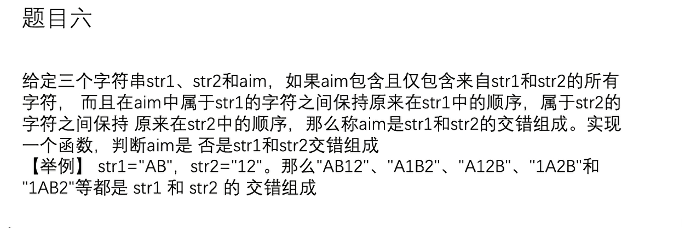

## 1 训练营一

```text
笔记

常见的子串，子数组，子xx 都可以用下面的思路
以每个位置开头
以每个位置结尾。
这样的好处是可以动态规划，
如果以每个结束位置分类， dp表应该是从左往右填
如果以每个开始位置分类， db表应该是从右往左填

单调性
如果发现存在单调性，证明一定有优雅解法。

滑动窗口使用条件 : 可以维持住单调性
如果维持不住窗口或者 单调性没有继承性的话无法使用。

在 N * N 的矩阵中
所有长方形的个数 ： O(N ^ 4)
所有正方形的个数 ： O(N ^ 3)
因此如果主流程可以确定算法复杂度至少是一个量级，比如是N ^ 3，可以在细节方面看一下是否可以优化
比如通过预处理数组，和打表，但是注意这里的处理方法复杂度不会影响之前的复杂度。
总体思路 ： 大流程 + 加速查询。

```


#### 题目一 滑动窗口

给定一个有序数组arr,从左到右依次表示X轴上从左往右点的位置
给定一个正整数K,返回如果有一根长度为K的绳子，最多能盖住几个点
绳子的边缘点碰到X轴上的点，也算盖住


```text
这里有一个小贪心边缘一定要压住一个点

可以使用二分，枚举每个位置i结尾，然后通过二分求i - K的最左位置即可 但不是最优解

滑动过程 
如果长度满足，把求一下结果。
然后L ++，看R 最多扩充多少，有可能不扩充
L,R至少有一个点，因为一个点一定满足。
这玩意好难写，看一下代码就懂了。
```


```java
public class Code01CordCoverMaxPoint {
    public static int maxPoint(int[] arr, int k) {
        int l = 0;
        int r = 0;
        int ans = 0;
        //范围是 [L, R)
        //于是判断越界是 R < arr.length即可
        while (r < arr.length) {
            if (arr[r] - arr[l] <= k) {
                r++;
                ans = Math.max(ans, r - l);
            } else {
                l++;
            }
        }
        return ans;
    }
}
```


#### 题目二 简单个数统计

括号有效配对是指：
1)任何一个左括号都能找到和其正确配对的右括号
2)任何一个右括号都能找到和其正确配对的左括号
有效的：(())  ()()  (()())等
无效的：(()  )(  等
问题一：怎么判断一个括号字符串有效？
问题二：如果一个括号字符串无效，返回至少填几个字符能让其整体有效


```text
这里的非常简单，不需要使用栈
遇到 （ 就 ++
遇到 ） 就 --
注意如果某一步，count 已经小于0 就返回false因为无论如何多的一个）不可能通过后面的（连接成功
最后返回 count == 0即可

问题二就是 把上面的返回 取消 need ++ ,然后 把count重新置0，
最后 count + need的值就是结果。
```


```java
public class Code02NeedParentheses {
    public static boolean isValid(String s) {
        char[] chs = s.toCharArray();
        int count = 0;
        for (char ch : chs) {
            if (count < 0) {
                return false;
            } else if (ch == ')') {
                count--;
            } else {
                count++;
            }
        }
        return count == 0;
    }

    public static int needParentheses(String s) {
        char[] chs = s.toCharArray();
        int count = 0;
        int need = 0;
        for (char ch : chs) {
            if (ch == '(') {
                count++;
            } else {
                if (count == 0) {
                    need++;
                } else {
                    count--;
                }
            }
        }
        return count + need;
    }


    public static void main(String[] args) {
        String canCanNeed = "(())";
        System.out.println(isValid(canCanNeed));
        System.out.println(needParentheses(canCanNeed));
    }
}
```


#### 题目三 动态规划

括号有效配对是指：
1)任何一个左括号都能找到和其正确配对的右括号
2)任何一个右括号都能找到和其正确配对的左括号
返回一个括号字符串中，最长的括号有效子串的长度


```text
这里以每个位置结尾讨论，因为可以正方向使用动态规划

下面来看如何通过 来到i位置，利用i - 1以及之前的值求出 i位置的值

首先 0位置 一定是 0 因为一个字符不可能成对
然后如果 i位置 的值 是 （ 也不可能， 因为成对的不可能以 （ 开头

然后如果 i- 1位置是 4， 我们就看 i- 5位置的值，如果是 ） 那么这里的值就是 0（自己取证明，举个例子一想就会了）
如果 i - 5位置是 （ 我们知道这里的值至少是 dp[i - 1] + 2，
然后 + dp[i - 6]的结果才是最终结果（因为 我们连成更大的值比如 （）（） 求这个的过程，自己写一下就会了然）
为什么不用再向前看了 ？ 因为再向前的值 dp[i - 6] 已经求过。

下面的deep方法是值给我们一个合法的串。求串的深度（最多有多少括号包着）。
求解思路也很简单，求count的最大值即可，因为count会 ++ 或 --

```


```java
package com.lihd.part01;

/**
 * @author ：葬花吟留别1851053336@qq.com
 * @description：TODO
 * @date ：2022/6/9 21:21
 */
public class Code03ParenthesesDeep {


    public static int deep(String valid) {
        char[] chs = valid.toCharArray();
        int count = 0;
        int ans = 0;

        for (int i = 0; i < chs.length; i++) {
            if (chs[i] == '(') {
                count++;
            } else {
                count--;
            }
            ans = Math.max(ans, count);
        }
        return ans;
    }


    public static int maxLength(String s) {
        char[] chs = s.toCharArray();
        int[] dp = new int[chs.length];
        //dp[0] = 0不用填入，因为默认就是0
        int max = 0;
        for (int i = 1; i < chs.length; i++) {
            if (chs[i] == ')') {
                int leftIndex = i - dp[i - 1] - 1;
                if (leftIndex >= 0 && chs[leftIndex] == '(') {
                    dp[i] = dp[i - 1] + 2 + (leftIndex > 0 ? dp[leftIndex - 1] : 0);
                }
                max = Math.max(max, dp[i]);
            }
        }
        return max;
    }

    public static void main(String[] args) {
        String canCanNeed = "((()()(())()))";
        System.out.println(maxLength(canCanNeed));
        System.out.println(deep(canCanNeed));
    }
}

```


#### 题目四 枚举分割线

有一些排成一行的正方形。每个正方形已经被染成红色或者绿色。现在可以
选择任意一个正方形然后用这两种颜色的任意一种进行染色，这个正方形的颜
色将会被覆盖。目标是在完成染色之后，每个红色R都比每个绿色G距离最左侧
近。返回最少需要涂染几个正方形。
如样例所示：s=RGRGR我们涂染之后变成RRRGG满足要求了，涂染的个数为2，
没有比这个更好的涂染方案。


```text
我们枚举每个分界线
包括左边和右边什么都没有的情况
把左边所有的绿色染成红色， 把右边所有的红色染成绿色 就可以实现
因此结果是 redCount + greenCount
我们枚举所有位置，最小值就是答案。时间复杂度 O （N)

看似需要两个预处理数组，实际上一个也不用。
首先由于 greenCount 是从左到右统计的，必定可以省略（因为我们的流程就是从左到右枚举，顺手就能更新）
那为什么从右到左也可以省略呢 ？ 因为 原数组只有两个值，我们求出总数，可以通过 -- 的方式，不断更新。
我猜测如果数组只有两种值，是有可能省略 从右到左的预处理数组。
空间复杂度 O(1)

一定是最优解。
```


```java
public class Code04ColorLeftRight {


    public static int colorMin(String s) {

        char[] chs = s.toCharArray();
        int redCount = 0;
        for (char ch : chs) {
            if (ch == 'R') {
                redCount++;
            }
        }
        int greenCount = 0;
        int ans = redCount;
        for (char ch : chs) {
            if (ch == 'G') {
                greenCount++;
            } else {
                redCount--;
            }
            ans = Math.min(ans, redCount + greenCount);
        }
//        ans = Math.min(ans, greenCount);
        return ans;
    }

    public static void main(String[] args) {
        String canCanNeed = "GGGGGR";
        System.out.println(colorMin(canCanNeed));

    }

}

```


#### 题目五 预处理矩阵

---

给定一个N*N的矩阵 matrix , 只有0 和 1两种值，返回边框全是1的最大正方形的边长长度

例如：
01111
01001
01001
01111
01011
其中边框全是1的最大正方形的大小为4*4，所以返回4。


```text
思路 ： 首先复杂度是 O(N^3) 通过预处理矩阵控制复杂度不比这个大

先枚举每个点，然后枚举边长，
i 位置连续向右的1 比边长大
i 位置连续向下的1 比边长大
i 右边的点位置连续向下的1 比边长大
i 下面的点位置连续向下的1 比边长大
就可以证明这是正方形。

然后生成这个预处理数组即可

下面的break 合理吗，会不会少掉情况 ？
不会，小范围越界，大范围一定越界。早break优化常数时间。已经通过测试，不过自己感觉代码玄玄的。

```


```java
public class Code05MaxOneBorderSize {

    public static int getMaxSquare(int[][] matrix) {
        int n = matrix.length;
        int r = matrix[0].length;

        int[][] rightMaxOne = new int[n][r];
        int[][] downMaxOne = new int[n][r];

        //填好边界
        for (int i = 0; i < n; i++) {
            rightMaxOne[i][r - 1] = matrix[i][r - 1];
        }
        for (int i = 0; i < r; i++) {
            downMaxOne[n - 1][i] = matrix[n - 1][i];
        }

        //填好其他

        //行 -》  列 《-
        for (int i = 0; i < n; i++) {
            for (int j = r - 2; j >= 0; j--) {
                rightMaxOne[i][j] = matrix[i][j] == 0 ? 0 : 1 + rightMaxOne[i][j + 1];
            }
        }

        //i 代表 row, j 代表 col
        //行倒着填，列正向填
        for (int i = n - 2; i >= 0; i--) {
            for (int j = 0; j < r; j++) {
                downMaxOne[i][j] = matrix[i][j] == 0 ? 0 : 1 + downMaxOne[i + 1][j];
            }
        }
        int ans = 0;
        //枚举所有点
        for (int i = 0; i < n; i++) {
            for (int j = 0; j < r; j++) {
                for (int sl = 1; sl < n + r; sl++) {
                    if (i + sl <= n && j + sl <= r) {
                        if (downMaxOne[i][j] >= sl && rightMaxOne[i][j] >= sl && downMaxOne[i][j + sl - 1] >= sl && rightMaxOne[i + sl - 1][j] >= sl) {
                            ans = Math.max(ans, sl);
                        }
                    } else {
                        break;
                    }
                }
            }
        }
        return ans;
    }
}
```


#### 题目六 分治法 + 数学原理

给定一个正整数M,请构造出一个长度为M的数组arr,要求
对任意的i、j、k三个位置，如果i<j<k,都有arr[i]+arr[k] != 2*arr[j]
返回构造出的arr


```text
假设 [a, b, c] 满足 a + c 不能与 2b
那么[2a,2b,2c]也满足
[2a - 1, 2b - 1, 2c - 1]也满足

下面证明[2a - 1, 2b - 1, 2c - 1,2a,2b,2c]
因为
如果 i 和 k都在左边（全是奇数的一边），必定不满足。
如果 i 和 k都在右边（全是偶数的一边），必定不满足。
如果 i 在左边，k在右边。那么i + k一定是奇数。而 j 在任何位置 * 2一定是偶数。 因此也满足

因此一个小范围满足，我们可以加工出双倍的范围。

下面使用迭代实现，已经测试过，老师用的是递归。可以去看一下代码。

```


```java
public class Code06MakeNo {


    public static int[] createNoArr(int m) {
        int[] arr = new int[m];
        int half = 1;
        while (half < arr.length) {
            int right = Math.min(half * 2, arr.length);
            for (int i = half; i < right; i++) {
                arr[i] = arr[i - half] * 2;
            }
            for (int i = 0; i < half; i++) {
               arr[i] = arr[i] * 2 - 1;
            }
            half = half * 2;
        }
        return arr;
    }

    // 检验函数
    public static boolean isValid(int[] arr) {
        int N = arr.length;
        for (int i = 0; i < N; i++) {
            for (int k = i + 1; k < N; k++) {
                for (int j = k + 1; j < N; j++) {
                    if (arr[i] + arr[j] == 2 * arr[k]) {
                        return false;
                    }
                }
            }
        }
        return true;
    }

    public static void main(String[] args) {
        System.out.println("test begin");
        for (int N = 1; N < 1000; N++) {
            int[] arr = createNoArr(N);
            if (!isValid(arr)) {
                System.out.println("Oops!");
                System.out.println(Arrays.toString(arr));
                break;
            }
        }
        System.out.println("test end");

        System.out.println(isValid(createNoArr(1042)));
        System.out.println(isValid(createNoArr(2981)));


    }


}
```


#### 题目七 二叉树DP, 全部变量

给定一个二叉树的头节点head,路径的规定有以下三种不同的规定：
1)路径必须是头节点出发，到叶节点为止，返回最大路径和
2)路径可以从任何节点出发，但必须往下走到达任何节点，返回最大路径和
3)路径可以从任何节点出发，到任何节点，返回最大路径和


```text

就是 树型dp套路
注意使用全局变量的方法也可以做出某些题目，注意求结果前先把全局变量置为零

然后最重要的就是分类讨论，下面第三题分类是六种情况。每一种都不能少。
注意最后一种情况不用求 maxHeadNum, 因为当前节点已经向左向右，其子节点必定是只去一个方向的。
```


```java
public class Code07MaxSumInTree {
    //定义节点
    public static class Node {
        int val;
        Node left;
        Node right;
        public Node(int val) {
            this.val = val;
        }
    }

    //=================================
    // 问题一解决方案
    //=================================
    public static int a;

    public static int getMaxPathSum1(Node head) {
        a = 0;
        getMaxPathSum1(head,0);
        return a;
    }

    public static void getMaxPathSum1(Node head, int preSum) {
        if (head.left == null && head.right == null) {
            a = Math.max(a, head.val + preSum);
        } else {
            if (head.left != null) {
                getMaxPathSum1(head.left, preSum + head.val);
            }
            if (head.right != null) {
                getMaxPathSum1(head.right, preSum + head.val);
            }
        }
    }

    //=================================
    // 问题二解决方案
    //=================================
    public static class Info {
        int maxNum;
        int maxHeadNum;
        public Info(int maxNum, int maxHeadNum) {
            this.maxNum = maxNum;
            this.maxHeadNum = maxHeadNum;
        }
    }

    public static int getMaxPathSum2(Node head) {
        if (head == null) {
            return -1;
        }
        return getMaxPathInfo(head).maxNum;
    }

    public static Info getMaxPathInfo(Node head) {
        if (head == null) {
            return null;
        }
        Info leftInfo = getMaxPathInfo(head.left);
        Info rightInfo = getMaxPathInfo(head.right);
        int p1 = leftInfo != null ? leftInfo.maxNum : head.val;
        int p2 = rightInfo != null ? rightInfo.maxHeadNum : head.val;
        int p3 = head.val;
        int p4 = leftInfo != null ? head.val + leftInfo.maxHeadNum : head.val;
        int p5 = rightInfo != null ? head.val + rightInfo.maxHeadNum : head.val;
        int maxNum = Math.max(Math.max(Math.max(p1, p2), p3), Math.max(p4, p5));
        int maxHeadNum = Math.max(Math.max(p3, p4), p5);
        return new Info(maxNum, maxHeadNum);
    }
    //=================================
    // 问题三 解决方案
    //=================================

    public static int getMaxPathSum3(Node head) {
        if (head == null) {
            return -1;
        }
        return getMaxPathUpInfo(head).maxNum;
    }


    public static Info getMaxPathUpInfo(Node head) {
        if (head == null) {
            return null;
        }
        Info leftInfo = getMaxPathUpInfo(head.left);
        Info rightInfo = getMaxPathUpInfo(head.right);
        int p1 = leftInfo != null ? leftInfo.maxNum : head.val;
        int p2 = rightInfo != null ? rightInfo.maxNum : head.val;
        int p3 = head.val;
        int p4 = leftInfo != null ? head.val + leftInfo.maxHeadNum : head.val;
        int p5 = rightInfo != null ? head.val + rightInfo.maxHeadNum : head.val;
        int p6 = leftInfo != null && rightInfo != null ? head.val + leftInfo.maxHeadNum + rightInfo.maxHeadNum : head.val;
        int maxNum = Math.max(Math.max(Math.max(p1, p2), p3), Math.max(Math.max(p4, p5), p6));
        int maxHeadNum = Math.max(Math.max(p3, p4), p5);
        return new Info(maxNum, maxHeadNum);
    }

    //=================================
    // 问题四 解决方案
    //=================================

    public static int b;

    public static int getMaxPathSum4(Node head) {
        if (head.left == null && head.right == null) {
            b = Math.max(b, head.val);
            return head.val;
        }

        int max = Integer.MIN_VALUE;
        //下面两个循环至少会进入一个
        if (head.left != null) {
            max = Math.max(getMaxPathSum4(head.left), max);
        }
        if (head.right != null) {
            max = Math.max(getMaxPathSum4(head.right), max);
        }

        max += head.val;
        b = Math.max(b, max);
        return max;

    }

}
```


## 2 训练营一


```text
猜算法复杂度

C/C++ 1-2s测试时间
Java/Python/Ruby/Php 3-4s测试时间
无论是那种语言，在对应的时间段内，一般可以有 10^8 - 10^9 运算次数。
比如数据N = 10 ^ 6,我们可以知道 复杂度为 O (N ^ 2)的算法是指定不行的，
通过对数据规模的分析，我们可以排除一些尝试。

贪心算法有的时候会很难。
可能需要记忆一些比较牛的贪心算法。

如何优化一个代码 ？ 
1 通过数据状况优化
2 通过问题本身 
1 可能是具有单调性，可以通过滑动窗口左右指针之类的解决
2 可能是把问题逐步简化，发现其实问题本身大大被简化（题目三）
```


#### 题目一 有序性质

在行也有序、列也有序的二维数组中，找num,找到返回true,否则false


```text
由于是有序的 所以i位置 上面和左边的值比他小， 下面和右边的值比他大
我们有两种方式
1 从左下角不断向右向上找答案（向右变大，向上变小）
2 从右上角不断向下向左找答案（向下变大，向左变小）

这样的好处是向一个方向值会变大，向另一方向移动值会变小，因此结果必在其中。
```


```java
public class Code01FindNumInSortedMatrix {
    public static boolean contains(int[][] matrix, int k) {

        int row = matrix.length - 1;
        int col = matrix[0].length - 1;
        int r = row;
        int c = 0;
        while (row >= 0 && c <= col) {
            if (matrix[r][c] == k) {
                return true;
            } else if (k < matrix[r][c]) {
                r--;
            } else {
                c++;
            }
        }
        return false;
    }

    public static void main(String[] args) {
        int[][] matrix = new int[][] { { 0, 1, 2, 3, 4, 5, 6 },// 0
                { 10, 12, 13, 15, 16, 17, 18 },// 1
                { 23, 24, 25, 26, 27, 28, 29 },// 2
                { 44, 45, 46, 47, 48, 49, 50 },// 3
                { 65, 66, 67, 68, 69, 70, 71 },// 4
                { 96, 97, 98, 99, 100, 111, 122 },// 5
                { 166, 176, 186, 187, 190, 195, 200 },// 6
                { 233, 243, 321, 341, 356, 370, 380 } // 7
        };
        int K = 233;
        System.out.println(contains(matrix, K));
    }
}
```


#### 题目二 贪心算法 聚焦单位置

---

\517. Super Washing Machines

Hard

552183Add to ListShare

You have `n` super washing machines on a line. Initially, each washing machine has some dresses or is empty.

For each move, you could choose any `m` (`1 <= m <= n`) washing machines, and pass one dress of each washing machine to one of its adjacent washing machines at the same time.

Given an integer array `machines` representing the number of dresses in each washing machine from left to right on the line, return *the minimum number of moves to make all the washing machines have the same number of dresses*. If it is not possible to do it, return `-1`.

 

**Example 1:**

```
Input: machines = [1,0,5]
Output: 3
Explanation:
1st move:    1     0 <-- 5    =>    1     1     4
2nd move:    1 <-- 1 <-- 4    =>    2     1     3
3rd move:    2     1 <-- 3    =>    2     2     2
```

**Example 2:**

```
Input: machines = [0,3,0]
Output: 2
Explanation:
1st move:    0 <-- 3     0    =>    1     2     0
2nd move:    1     2 --> 0    =>    1     1     1
```

**Example 3:**

```
Input: machines = [0,2,0]
Output: -1
Explanation:
It's impossible to make all three washing machines have the same number of dresses.
```


---


```text
Runtime: 1 ms, faster than 88.07% of Java online submissions for Super Washing Machines.
Memory Usage: 43 MB, less than 88.07% of Java online submissions for Super Washing Machines.
```


```text
贪心算法 
下面的代码比较难以描述 是在忘了就看视频

就是看任意i位置的左边和右边，大于0代表多，小于0代表少
如果两个值都小于0 ，那么i位置至少需要移动 ：|L| + |R|的值
其他情况都是 取两个的最大值即可

最难受的值（最大的值）就是 结果
```


```java
public class Code02SuperWashingMachines {

    // 1 <= n <= 10 ^ 4
    public static int findMinMoves(int[] machines) {

        int sum = 0;
        for (int machine : machines) {
            sum += machine;
        }

        if (sum % machines.length != 0) {
            return -1;
        }
        //每个机器的平均个数
        int avg = sum / machines.length;
        int preSum = 0;
        int ans = 0;
        for (int i = 0; i < machines.length; i++) {
            int left = preSum - avg * i;
            int right = (sum - preSum - machines[i]) - avg * (machines.length - i - 1);
            if (left < 0 && right < 0) {
                ans = Math.max(ans, Math.abs(left) + Math.abs(right));
            } else {
                ans = Math.max(ans, Math.max(Math.abs(left), Math.abs(right)));
            }
            preSum += machines[i];
        }
        return ans;
    }
}

```


#### 题目三 贪心算法

---

> 给定一个数组arr长度为N,你可以把任意长度大于0且小于N的前缀作为左部
> 分，剩下的作为右部分。
> 但是每种划分下都有左部分的最大值和右部分的最大值，请返回最大的，左
> 部分最大值减去右部分最大值的绝对值。

---


```text
最强的贪心
1 首先 arr[0] 一定会被包含在左边， arr[arr.length - 1] 一定会被包含在右边
2 范围增加，范围的最大值不会变小
3 找到最大值 - （最左边 和 最右边的最小值） 就是答案

因为 范围越大 最大值不可能变小，于是 左边的最小最大值就是 arr[0]
右边的最小最大值就是 arr[arr.length - 1]
```


```java
public class Code03MaxABSBetweenLeftAndRight {

    //很厉害的贪心 简直了
    public static int maxABSBetweenLeftAndRight(int[] arr) {
        int max = arr[0];
        for (int i = 1; i < arr.length; i++) {
            max = Math.max(arr[i], max);
        }
        return Math.max(max - arr[0], max - arr[arr.length - 1]);
    }

    //我想的一个简单贪心 时间复杂度 O(N) 空间复杂度 O(n)比较差
    public static int maxABSBetweenLeftAndRight2(int[] arr) {

        int[] rightMaxArr = new int[arr.length];
        rightMaxArr[arr.length - 1] = arr[arr.length - 1];
        for (int i = arr.length - 2; i >= 0; i--) {
            arr[i] = Math.max(arr[i], arr[i + 1]);
        }

        int preMax = arr[0];
        int ans = 0;
        for (int i = 1; i < arr.length; i++) {
            ans = Math.max(ans, Math.abs(preMax - rightMaxArr[i]));
            preMax = Math.max(preMax, arr[i]);
        }
        return ans;
    }

    public static int[] generateRandomArray(int length) {
        int[] arr = new int[length];
        for (int i = 0; i != arr.length; i++) {
            arr[i] = (int) (Math.random() * 1000) - 499;
        }
        return arr;
    }

    public static void main(String[] args) {
        int[] arr = generateRandomArray(1000);
        int maxABSBetweenLeftAndRight = maxABSBetweenLeftAndRight(arr);
        int maxABSBetweenLeftAndRight2 = maxABSBetweenLeftAndRight2(arr);
        System.out.println("maxABSBetweenLeftAndRight = " + maxABSBetweenLeftAndRight);
        System.out.println("maxABSBetweenLeftAndRight2 = " + maxABSBetweenLeftAndRight2);
    }

}
```

## 3 训练营一

```text
单位置聚焦方法
有的问题如果考虑全局会变得非常麻烦，但是如果只考虑当前位置就会简化问题

题目二 考虑每个位置的瓶颈，然后取最大瓶颈
题目四 考虑每个位置的水量，然后取总和。
题目五 考虑每个位置的水量，然后取总和。

考虑之前的矩阵轨迹问题 处理方式却是
1 不要考虑每个位置的 细节问题
2 从宏观调度，分解问题，会使代码更加简洁，容易理解，也容易修改

全局难以考虑 ： 考虑局部 ：分析单个位置，然后汇总结果。
局部难以考虑 ： 考虑全局 ：宏观调度。

```


#### 题目四 聚焦单位置

---

> 给定一个数组arr,已知其中所有的值都是非负的，将这个数组看作一个容器
> 请返回容器能装多少水
> 比如，arr={3,1,2,5,2,4},根据值画出的直方图就是容器形状，该容
> 器可以装下5格水
> 再比如，arr={4,5,1,3,2},该容器可以装下2格水

---


```text
聚焦于单个位置

i位置的水量应该是 其左边最高的 ， 和右边最高的，取一个最小值，这个值 - arr[i]的值，就是存储量
表达式 max(0, min(maxL, maxR) - arr[i])
于是两个预处理数组解决问题（没写这个）
但是由于我们是从左到右不断求的，于是可以省略maxL[]
t O(N)
s O(N)


更好的方法 ：
左右指针，刚开始左边的maxL = arr[0] 右边的maxR = arr[len - 1]
如果 maxL < maxR 结算左边
如果 maxR < maxL 结算右边
如果相等可以一起结算，或结算任意一边。

注意过程中不要忘了更新对应的max值
这利用单调性 ： 一个子数组范围变大 其最大值不可能变小
比如 maxL < maxR我们结算左边，因为右边范围虽然没有看完，但是 其最大值 realMax >= maxR
而我们的表达式求的是 两边最大值中的最小值，于是没有必要看完。这便是最巧妙的地方。

t O(N)
s O(1)
```


```java
public class Code04TrappingRainWater {

    public static int water1(int[] arr) {
        int ans = 0;
        int[] endMax = new int[arr.length];
        endMax[arr.length - 1] = arr[arr.length - 1];
        for (int i = arr.length - 2; i >= 0; i--) {
            endMax[i] = Math.max(arr[i], endMax[i + 1]);
        }
        int startMax = arr[0];
        for (int i = 1; i < arr.length - 1; i++) {
            int min = Math.min(endMax[i + 1], startMax);
            ans += Math.max(0, min - arr[i]);
            startMax = Math.max(startMax, arr[i]);
        }
        return ans;
    }


    public static int water2(int[] arr) {
        int ans = 0;
        int startMax = arr[0];
        int endMax = arr[arr.length - 1];
        int L = 1;
        int R = arr.length - 2;
        //必须是 <= 否则会少结算一个 L，R指的是没有结算的位置 要开始结算，
        //L == R的意思是 就剩下一个没有结算，于是 不要少等号。
        while (L <= R) {
            if (startMax < endMax) {
                ans += Math.max(0, startMax - arr[L]);
                startMax = Math.max(startMax, arr[L]);
                L ++;
            } else {
                ans += Math.max(0, endMax - arr[R]);
                endMax = Math.max(endMax, arr[R]);
                R--;
            }
        }
        return ans;
    }

    // for test
    public static int[] generateRandomArray(int len, int value) {
        int[] ans = new int[(int) (Math.random() * len) + 1];
        for (int i = 0; i < ans.length; i++) {
            ans[i] = (int) (Math.random() * value) + 1;
        }
        return ans;
    }

    public static void main(String[] args) {
        int len = 100;
        int value = 200;
        int testTimes = 100000;
        System.out.println("test begin");
        for (int i = 0; i < testTimes; i++) {
            int[] arr = generateRandomArray(len, value);
            int ans1 = water1(arr);
            int ans2 = water2(arr);
            if (ans1 != ans2 ) {
                System.out.println("Oops!");
                System.out.println(Arrays.toString(arr));
                System.out.println(ans1);
                System.out.println(ans2);
                break;
            }
        }
        System.out.println("test finish");
    }
}
```


#### 题目五 堆的应用 聚焦单位置

---

> 如果给你一个二维数组，每一个值表示这一块地形的高度，
> 求整块地形能装下多少水。

---


```text
这个问题思路如此的美妙


先把所有的边缘放进小根堆
然后不断弹出直到结束 ：假设弹出为p
利用p更新max
把p的周围没有放进去的放入堆,放入前结算水量。
重复过程
上面的过程完成后结果就求出来了。

过程的含义是不断求一个一个湖泊的储水量。
max更新就是换了湖泊。由于第一被弹出的是 边缘的最矮的位置，这个位置便是突破口，我们不断结算这个突破口，就能得到正确结果。

这个过程不能放入重复的，因此使用boolean[r][c]记录那个位置进去过，和没有进去过。

可以对照单位置的思路，由于是二维平面，比较难以理解。
如果实在理解不了，就自己画几个例子理解一下即可。
```


结果未验证

```java
/**
 * 思路如此的巧妙 令人感慨万千。
 * @author ：葬花吟留别1851053336@qq.com
 * @description：TODO
 * @date ：2022/6/15 22:09
 */
public class Code05TrappingRainWaterII {

    public static class Water{
        int val;
        int row;
        int col;
        public Water(int val, int row, int col) {
            this.val = val;
            this.row = row;
            this.col = col;
        }
    }

    public static int water(int[][] matrix) {
        int R = matrix.length;
        int C = matrix[0].length;
        PriorityQueue<Water> heap = new PriorityQueue<>((a, b) -> a.val - b.val);
        boolean[][] enterMap = new boolean[R][C];

        //把四周放进去
        // 0 行 和 最后一行 放进去
        for (int i = 0; i < C; i++) {
            heap.add(new Water(matrix[0][i], 0, i));
            enterMap[0][i] = true;

            heap.add(new Water(matrix[R - 1][i], R - 1, i));
            enterMap[R - 1][i] = true;
        }

        for (int i = 1; i < R - 1; i++) {
            heap.add(new Water(matrix[i][0], i, 0));
            enterMap[i][0] = true;

            heap.add(new Water(matrix[i][C - 1], i, C - 1));
            enterMap[i][C - 1] = true;
        }

        //初始化完成 开始计算工作
        int max = Integer.MIN_VALUE;
        int ans = 0;
        while (!heap.isEmpty()) {

            Water water = heap.poll();
            int val = water.val;
            int row = water.row;
            int col = water.col;
            max = Math.max(val, max);

            //上
            if (row > 0 && !enterMap[row - 1][col]) {
                ans += Math.max(0, max - matrix[row][col]);
                enterMap[row - 1][col] = true;
                heap.add(new Water(matrix[row - 1][col], row - 1, col));
            }

            //下
            if (row < R - 1 && !enterMap[row + 1][col]) {
                ans += Math.max(0, max - matrix[row][col]);
                enterMap[row + 1][col] = true;
                heap.add(new Water(matrix[row + 1][col], row + 1, col));
            }
            //左
            if (col > 0 && !enterMap[row][col - 1]) {
                ans += Math.max(0, max - matrix[row][col]);
                enterMap[row][col - 1] = true;
                heap.add(new Water(matrix[row][col - 1], row, col - 1));
            }

            //右
            if (col < C - 1 && !enterMap[row][col + 1]) {
                ans += Math.max(0, max - matrix[row][col]);
                enterMap[row][col + 1] = true;
                heap.add(new Water(matrix[row][col + 1], row, col + 1));
            }


        }
        return ans;
    }
}

```


#### 题目六 首位指针 

---

> 给定一个有序数组arr,给定一个正数aim
> 1)返回累加和为aim的，所有不同二元组
> 2)返回累加和为aim的，所有不同三元组

---


```text
这个问题比较简单

一个L从左边开始 一个R从右边开始
如果 两者的和 > aim R--;
如果 两者的和 < aim L ++;
如果相等 结算，然后 R --, L ++,注意结算不要重复。

这就利用了单调性，因为有序，于是 arr[L] > arr[L - 1], arr[R] < arr[R + 1]

三维问题就是 固定住一个位置，然后在剩下（右边的位置）中 找到合适的二元组即可，注意开始位置也不要重复。


有一个小问题 是  1，1,1,2,2,2。。。会不会出现 倒数第二个1求出的答案和 倒数第一个1求出的答案可能不一样。
这个是确实的，因为三元组 可能是 1,1,5，倒数第一个1 不会求出这个三元组。
但是前面的1 求出的结果 一定不会比 倒数第一个1求出的结果少。我们要的结果是最多的，因此没有任何问题。
```


```java
/**
 * @author ：葬花吟留别1851053336@qq.com
 * @description：TODO
 * @date ：2022/6/15 22:10
 */
public class Code06PrintUniquePairAndTriad {
    public static void printUniquePair(int[] arr, int aim) {

        int L = 0;
        int R = arr.length - 1;
        int sum;
        while (L < R) {
            sum = arr[L] + arr[R];
            if (sum > aim) {
                R --;
            } else if (sum < aim) {
                L ++;
            } else {
                if (L == 0 || arr[L - 1] != arr[L]) {
                    System.out.println(arr[L] + " " + arr[R]);
                }
                L++;
            }
        }

    }

    public static void printUniquePair(int[] arr, int aim, int l, int r, int index) {

        int L = l;
        int R = r;
        int sum;
        while (L < R) {
            sum = arr[L] + arr[R];
            if (sum > aim) {
                R--;
            } else if (sum < aim) {
                L++;
            } else {
                if (L == l || arr[L - 1] != arr[L]) {
                    System.out.println(arr[index] + " " + arr[L] + " " + arr[R]);
                }
                L++;
//                R--;
            }
        }

    }

    public static void printUniqueTriad(int[] arr, int aim) {
        for (int i = 0; i < arr.length - 2; i++) {
            if (i == 0 || arr[i - 1] != arr[i]) {
                printUniquePair(arr, aim - arr[i], i + 1, arr.length - 1, i);
            }
        }
    }

    public static void main(String[] args) {
        int sum = 10;
        int[] arr1 = { -8, -4, -3, 0, 1, 2, 4, 5, 8, 9 };
        System.out.println(Arrays.toString(arr1));
        System.out.println("====");
        printUniquePair(arr1, sum);
        System.out.println("====");
        printUniqueTriad(arr1, sum);

    }
}
```


#### 题目七 第K小 + 索引处理

---

> 长度为N的数组arr,一定可以组成N*N个数值对。
> 例如arr=[3,1,2],
> 数值对有(3.3) (3,1) (3,2) (1,3) (1,1) (1,2) (2,3) (2,1) (2,2)
> 也就是任意两个数都有数值对，而且自己和自己也算数值对。
> 数值对怎么排序？规定，第一维数据从小到大，第一维数据一样的，第二维数组也
> 从小到大。所以上面的数值对排序的结果为：
> (1,1)(1,2)(1,3)(2,1)(2,2)(2,3)(3,1)(3,2)(3,3)
> 给定一个数组arr,和整数k,返回第k小的数值对。

---


```text
这个问题本质还是第K小数的问题

唯一不同的是 千万不要 形成所有的数值对，因为这样复杂度已经是 O(N * N)

思路是 ： 通过角标关系 构造出最终的结果。然后时间复杂度 O(N) 空间复杂度 O(1)

第一个位置非常好找，直接找第 （k - 1)/N的数字，
一定要-1，因为k是从1，开始的，而索引是从0开始的，比如N的时候，如果不减去一 的话 N /N = 1，而（N - 1)/N = 0这导致该在一组的没有被分到一组。

第二个位置相对麻烦，因为可能重复值，这些重复值导致第二个值不太好找。
假设数组是 [1,1,2,2,3,3,3,4,5,5] 求第 56小
（56 - 1）/ 10 = 5, arr[5] = 3
比3小的数 less = 4
和3相等的数 equal = 3

于是问题变成了 在 【3,3,3】范围上寻找 第 （56 - 10 * less) = 16的数
由于相等的数= 3，因此每个1对应了三个3，每个2也对应了3个三
最终求 （16 - 1）/ 3 = 5的值即可 这个位置的值是 3,于是结果是 【3,3】

下面的代码就是这一段过程。
```


```java
public class Code07KthMinPair {

    public static int[] kthMinPair(int[] arr, int k) {
        int N = arr.length;
        int val = findArrLessKth(arr, (k - 1) / N);
        int lessCount = 0;
        int equalCount = 0;
        for (int j : arr) {
            if (j < val) {
                lessCount++;
            }
            if (j == val) {
                equalCount++;
            }
        }
        k = k - lessCount * N;
        int secondVal = findArrLessKth(arr, (k - 1) / equalCount);
        return new int[]{val, secondVal};
    }

    // k 从0开始 是实际的索引。
    public static int findArrLessKth(int[] arr, int k) {
        int L = 0;
        int R = arr.length - 1;
        int[] pairs;
        int random = 0;
        while (L < R) {
            random = (int) (Math.random() * (R - L + 1) + L);
            pairs = partition(arr, L, R, arr[random]);
            if (pairs[0] > k) {
                R = pairs[0] - 1;
            } else if (pairs[1] < k) {
                L = pairs[1] + 1;
            } else {
                return arr[pairs[0]];
            }
        }
        //跳出循环 L == R 此时的位置就应该被返回
        return arr[L];
    }


    public static int[] partition(int[] arr,int L, int R, int k) {
        int less = L - 1;
        int more = R + 1;
        int i = L;
        while (i < more) {
            if (arr[i] == k) {
                i ++;
            } else if (arr[i] < k) {
                swap(arr, ++less, i++);
            } else {
                swap(arr, --more, i);
            }
        }
        return new int[]{ less + 1, more - 1};
    }

    public static void swap(int[] arr, int i, int j) {
        int temp = arr[i];
        arr[i] = arr[j];
        arr[j] = temp;
    }


    public static void main(String[] args) {
        int[] arr = {3,9, 2, 4, 5, 8, 9, 6, 1, 2};
        int[] partition = partition(arr, 0, arr.length - 1, 1);
        System.out.println(Arrays.toString(partition));
        System.out.println(Arrays.toString(arr));
        System.out.println(findArrLessKth(arr,6));
    }

}

```

## 4 训练营一


#### 题目一

---

>  每种工作有难度和报酬，规定如下
> class Job{
> 	public int money;//该工作的报酬
> 	public int hard;//该工作的难度
>
> }
>
> 给定一个Job类型的数组jobarr,表示所有岗位，每个岗位都可以提供任意份工作
> 选工作的标准是在难度不超过自身能力值的情况下，选择报酬最高的岗位
> 给定一个int类型的数组arr,表示所有人的能力
> 返回int类型的数组，表示每个人按照标准选工作后所能获得的最高报酬

---


#### 题目二

---

>  背包容量为w
> 一共有n袋零食，第i袋零食体积为v[i] > 0
> 总体积不超过背包容量的情况下，
> 一共有多少种零食放法？（总体积为0也算一种放法）。

---


#### 题目三

---

> 给定一个二维数组matrix，其中每个数都是正数，要求从左上到右下
> 每一步只能向右或者向下，沿途经过的数字要累加起来
> 最后请返回最小的路径和
> 动态规划的空间压缩技巧！

---


#### 题目四

---

> 请注意区分子串和子序列的不同，给定两个字符串str1和str2,
> 求两个字符的最长公共子序列
> 动态规划的空间压缩技巧！

---


#### 题目五

---

> 请注意区分子串和子序列的不同，
> 给定两个字符串str1和str2,求两个字符串的最长公共子串
> 动态规划的空间压缩技巧！

---


#### 题目六

---

>  给定一个由字符串组成的数组String[] strs,给定一个正数K
> 返回词频最大的前K个字符串，假设结果是唯一的

---


#### 题目七

---

>  请实现如下结构：
> TopRecord{
> public TopRecord(int):构造时事先指定好K的大小，构造后就固定不变了
> public void add(String str):向该结构中加入一个字符串，可以重复加入
> public List<String> top():返回之前加入的所有字符串中，词频最大的K个
>
> }
>
> 要求
> add方法，复杂度O(logK);
> top方法，复杂度O(K);

---


## 5 训练营一


#### 题目一 前缀树

---

>  给你一个字符串类型的数组arr,譬如：
> String arr ={"b\st","d","a\d\e","a\b\c");
> 把这些路径中蕴含的目录结构给打印出来，子目录直接列在父目录下面，并比父目录向右进两格，就像这样：
> a
> 	b
> 		c
>
> ​	d
> ​		e
> b
> ​	st
> d
> 同一级的需要按字母顺序排列不能乱。

---


```text
前缀树
没什么可说的
注意 java中的 \比较特殊，
spilt("\\\\") 四个才能分开 目录，比较神奇
```


```java
/**
 * @author ：葬花吟留别1851053336@qq.com
 * @description：TODO
 * @date ：2022/6/16 22:51
 */
public class Code01GetFolderTree {


    public static class Node {
        String path;
        TreeMap<String, Node> map = new TreeMap<>();
        public Node(String path) {
            this.path = path;
        }
    }

    public static Node generateFolderTree(String[] folderPaths) {
        Node root = new Node("");
        for (String folderPath : folderPaths) {
            String[] paths = folderPath.split("\\\\");
            Node cur = root;
            for (String path : paths) {
                if (!cur.map.containsKey(path)) {
                    cur.map.put(path, new Node(path));
                }
                cur = cur.map.get(path);
            }
        }
        return root;
    }

    public static void printFolder(String[] folderPaths) {
        Node node = generateFolderTree(folderPaths);
        printFolderTree(node, 0);
    }

    public static void printFolderTree(Node node, int level) {
        if (level != 0) {
            System.out.println(getBlank((level - 1) * 2) + node.path);
        }
        for (Map.Entry<String, Node> entry : node.map.entrySet()) {
            printFolderTree(entry.getValue(),level + 1);
        }
    }

    public static String getBlank(int size) {
        StringBuilder sb = new StringBuilder();
        for (int i = 0; i < size; i++) {
            sb.append(" ");
        }
        return sb.toString();
    }

    public static void main(String[] args) {
        String[] arr ={"b\\st","d","a\\d\\e","a\\b\\c"};
        printFolder(arr);
    }
}

```


#### 题目二 unknown

---

>  双向链表节点结构和二叉树节点结构是一样的，如果你把last认为是left,next
> 认为是right的话。
> 给定一个搜索二叉树的头节点head,请转化成一条有序的双向链表，并返回
> 链表的头节点。

---


二叉树递归套路 

中序遍历 （morris遍历）


#### 题目三 递归 + 二叉树遍历

---

>  已知一棵二叉树中没有重复节点，并且给定了这棵树的中序遍历数组和先序
> 遍历数组，返回后序遍历数组。
> 比如给定：
> int[] pre={1,2,4,5,3,6,7;
> int[] in={4,2,5,1,6,3,7;
>
> 返回：{4,5,2,6,7,3,1};

---


```text
不要生成树，因为就会很麻烦，这个类还不存在，总之会增加题目的难度。

本题目其实就是考查递归 和 对树的三种遍历的熟悉


根据先序和中序 可以得到树的左边 和 右边的规模。
然后 后序数组中的最后一个节点 一定等于 先序的第一个节点 （后序 ： 左右头， 先序 头左右，因此两者一定相等）


找到中序位置不要遍历  ， 使用hashMap节约时间。


注意索引变换即可， 使用一个很简单的例子就能直观感受出索引的联系。下面的例子就是用题目给出例子写出来的。
```


```java
/**
 * @author ：葬花吟留别1851053336@qq.com
 * @description：TODO
 * @date ：2022/6/16 22:51
 */
public class Code03PreAndInArrayToPosArray {


    public static int[] getPostArr(int[] preArr, int[] inArr) {
        int[] postArr = new int[preArr.length];
        int l = preArr.length - 1;
        generatePostArr(preArr, 0, l, inArr, 0, l, postArr, 0, l);
        return postArr;
    }

    public static int[] getPostArr2(int[] preArr, int[] inArr) {
        int[] postArr = new int[preArr.length];
        int l = preArr.length - 1;
        HashMap<Integer, Integer> map = new HashMap<>();
        for (int i = 0; i < inArr.length; i++) {
            map.put(inArr[i], i);
        }
        generatePostArr(preArr, 0, l, inArr, 0, l, postArr, 0, l, map);
        return postArr;
    }


    public static void generatePostArr(int[] preArr, int preL, int preR,
                                       int[] inArr, int inL, int inR,
                                       int[] postArr,int postL, int postR) {


        if (preL > preR) {
            return;
        }
        if (preL == preR) {
            postArr[postR] = preArr[preL];
        }
        postArr[postR] = preArr[preL];
        int leftLen = 0;
        for (int i = inL; i <= inR; i++) {
            if (inArr[i] == preArr[preL]) {
                leftLen = i - inL;
                break;
            }
        }
        generatePostArr(preArr, preL + 1, preL + leftLen, inArr, inL , inL + leftLen - 1, postArr, postL, postL + leftLen - 1);
        generatePostArr(preArr, preL + leftLen + 1, preR, inArr , inL + leftLen + 1, inR, postArr, postL + leftLen, postR - 1);
    }

    public static void generatePostArr(int[] preArr, int preL, int preR,
                                       int[] inArr, int inL, int inR,
                                       int[] postArr, int postL, int postR,
                                       HashMap<Integer,Integer> map) {


        if (preL > preR) {
            return;
        }
        if (preL == preR) {
            postArr[postR] = preArr[preL];
        }
        postArr[postR] = preArr[preL];
        Integer integer = map.get(preArr[preL]);
        int leftLen = integer - inL;
        generatePostArr(preArr, preL + 1, preL + leftLen, inArr, inL , inL + leftLen - 1, postArr, postL, postL + leftLen - 1, map);
        generatePostArr(preArr, preL + leftLen + 1, preR, inArr , inL + leftLen + 1, inR, postArr, postL + leftLen, postR - 1, map);
    }


    public static void main(String[] args) {

    }


}

```


#### 题目四 LIS

---

> 最长递增子序列问题的O(N*logN)的解法

---


```text
n * n的解法比较简单
这里先说明ends数组的含义 

ends[i] -> 找到的所有长度为 i + 1的递增子序列中最小的结尾是什么

填入dp时，先在ends中二分找到位置，然后更新ends[l], 然后l + 1就是dp[i] 的值， l为二分找到的位置，可能会扩容ends
每个位置都这么做，于是复杂度是 O（N * logN)

左边的值不用更新，右边的值没法更新，只能更新ends[l] 的值

这个题目非常重要，有很多原型，比BFPRT算法重要
```


```java
/**
 * @author ：葬花吟留别1851053336@qq.com
 * @description：TODO
 * @date ：2022/6/16 22:51
 */
public class Code04LIS {

    public static int[] lis(int[] arr) {
        int[] dp = getDp(arr);
        //遍历找到最大值
        int max = dp[0];
        int maxIndex = 0;
        for (int i = 1; i < dp.length; i++) {
            if (dp[i] > max) {
                maxIndex = i;
                max = dp[i];
            }
        }
        //根据最大值生成长度，并且填入内容
        int[] ans = new int[max];
        int ansIndex = ans.length - 1;
        ans[ansIndex --] = arr[maxIndex];
        for (int i = maxIndex - 1; i >= 0; i--) {
            if (arr[i] < arr[i + 1] && dp[i] == dp[i + 1] - 1) {
                ans[ansIndex--] = arr[i];
            }
        }
        return ans;
    }


    //生成dp表的策略
    public static int[] getDp(int[] arr) {

        int[] dp = new int[arr.length];
        int[] ends = new int[arr.length];

        //填好第一个值，无论如何，这个值都是没有问题的。
        dp[0] = 1;
        ends[0] = arr[0];
        //ends的有效范围 [0,right]闭区间。
        int right = 0;
        // 二分所需要的变量。
        int l;
        int r;
        int m;

        for (int i = 1; i < arr.length; i++) {
            //二分代码
            l = 0;
            r = right;
            //找到 大于等于 arr[i] 的第一个数的位置
            while (l <= r) {//为什么有 equal
                m = l + (r - l)/2;
                if (ends[m] < arr[i]) {
                    l = m + 1;
                } else {
                    r = m - 1;
                }
            }
            //跳出循环 一定是 l == r + 1;
            //如果 r没有改变过  那么 l == r + 1 == right + 1
            right = Math.max(l, right);
            ends[l] = arr[i];
            dp[i] = l + 1;
        }
        return dp;
    }

    public static void main(String[] args) {
        int[] arr = { 2, 1, 5, 3, 6, 4, 8, 9, 7 };
        int[] lis = lis(arr);
        System.out.println("lis = " + Arrays.toString(lis));
    }


}
```


#### 题目五 LIS经典问题

---

>  每个信封都有长和宽两个维度的数据，A信封如果想套在B信封里面，A信封必
> 须在长和宽上都小于B信封才行。
> 如果给你一批信封，返回最大的嵌套层数

---


```text
这个题目就是 最长递增子序列的经典问题
还有一个问题，是在坐标系中给一些点，找到点连成的曲线要求 是单调递增的，和信封问题本质上是一道题

做法 第一个维度 从小到大排序 第二个维度 从大到小排序
然后第二个维度使用 lis 问题去解就可以了


分析，由于长和宽必须同时小于才能装进去，和我一维长度相等的，二维长度必须从大到小排，防止这些数据干扰我，因为这些数据无法装进信封。

于是任意位置i前面 都是可以装进信封的（要二维数据小于我），因为前面的任意位置一维数据肯定小于我，（如果等于我 的话，等于我的部分二维数据一定大于我，于是不用考虑），小于我的所有位置中找到 二维数据小于我的就 可以装进信封。
于是 可以认为 前面的数据一维数据一定小于我（等于我的会被排除），我在二维数据上找到严格小于我的最长序列就是答案（最长递增子序列）
于是该问题瞬间被化解。


好好欣赏这个题目，感觉很不错 。
```


```java
/**
 * @author ：葬花吟留别1851053336@qq.com
 * @description：TODO
 * @date ：2022/6/16 22:52
 */
public class Code05EnvelopesProblem {


    public static class Envelope{
        int length;
        int width;

        public Envelope(int length, int width) {
            this.length = length;
            this.width = width;
        }
    }

    public static Envelope[] generateSortedEnvelopesArr(int[][] matrix) {
        Envelope[] envelopes = new Envelope[matrix.length];
        for (int i = 0; i < matrix.length; i++) {
            envelopes[i] = new Envelope(matrix[i][0], matrix[i][1]);
        }
        Arrays.sort(envelopes, (a, b) -> a.length == b.length ? Integer.compare(b.width, a.width) : Integer.compare(a.length, b.length));
        return envelopes;
    }


    public static int maxEnvelopes(int[][] matrix) {
        Envelope[] envelopes = generateSortedEnvelopesArr(matrix);
        //只看第二维数字，即只看width 来一个最长公共子序列问题即可。

        int[] ends = new int[envelopes.length];
        int[] dp = new int[envelopes.length];
        ends[0] = envelopes[0].width;
        dp[0] = 1;
        int right = 0;
        int l;
        int r;
        int m;
        for (int i = 1; i < envelopes.length; i++) {
            l = 0;
            r = right;
            while (l <= r) {
                m = l + (r - l) / 2;
                if (ends[m] < envelopes[i].width) {
                    l = m + 1;
                } else {
                    r = m - 1;
                }
            }
            right = Math.max(right, l);
            ends[l] = envelopes[i].width;
            dp[i] = l + 1;
        }

        int ans = dp[0];
        for (int i = 1; i < dp.length; i++) {
            ans = Math.max(ans, dp[i]);
        }
        return ans;
    }

    public static void main(String[] args) {
        int[][] test = { { 3, 4 }, { 2, 3 }, { 4, 5 }, { 1, 3 }, { 2, 2 }, { 3, 6 }, { 1, 2 }, { 3, 2 }, { 2, 4 } };
        int envelopes = maxEnvelopes(test);
        System.out.println("envelopes = " + envelopes);
    }


}

```


####  题目六 

---

>  给定一个数组arr.返回子数组的最大累加和。

---

根据答案证明结论

讨论 ：一定不含有正数 和 一定含有正数两种情况 

```tex
根据答案 证明

```


#### 题目七

---

> 给定一个整型矩阵，返回子矩阵的最大累加和。

---

压缩数组 + 、子数组最大累加和

```tex
```


## 6 训练营一


#### 题目―

---

> 给定两个字符串s1和s2，问s2最少删除多少字符可以成为s1的子串？
> 比如s1="abcde", s2 = "axbc"
> 返回1。s2删掉x就是s1的子串了。

---

#### 题目二

---

> 给定两个字符串str1和str2，再给定三个整数ic、dc和rc，分别代表插入、删 除和替换
> 一个字符的代价，返回将str1编辑成str2的最小代价。
> 【举例】
> str1="abc", str2="adc", ic=5, dc=3, rc=2 从"abc"编辑成"adc"，把"b'替换成'd"是代
> 价最小的，所以返回2
> str1="abc", str2="adc", ic=5, dc=3, rc=100 从"abc"编辑成"adc"，先删除"b’，然后
> 插入d"是代价最小的，所以返回8
> str1= abc , str2= abc", IC=5, dc=3, rc=2个用编辑，本来是一样的子串，
> 所以返回0

---


#### 题目三

---

> 求完全二叉树节点的个数
> 要求时间复杂度低于O(N) I

---


#### 题目四

---

> LRU内存替换算法的实现

---


#### 题目五

---

> 给定两个字符串，记为start和to，再给定一个字符串列表list, list中一定包含tolist中没有重复字符
> 串，所有的字符串都是小写的。
> 规定：start每次只能改变一个字符，最终的目标是彻底变成to，但是每次变成的新字符串必须在Iist
> 中存在。
> 请返回所有最短的变换路径。
> 【举例】
> start="abc",end="cab"list={"cab","acc","cbc","ccc","cac","cbb","aab","abb"}
> 转换路径的方法有很多种,但所有最短的转换路径如下:
> abc -> abb -> aab -> cab
> abc -> abb -> cbb - > cab
> abc -> cbc -> cac -> cab
> abc -> cbc -> cbb -> cab

---


编辑距离 

边界讨论，只含有某种操作的编辑距离问题怎么改动。


LRU 

HashMap 和 双向链表


变换路径

关于 HashSet/Map中的 O(1), 

由于 两个字符串有一点不一样，可以导致哈希值的巨大差别。

可以看出 哈希算法会 遍历所有值，因此复杂和 字符串的长度是有关系的。

如果长度非常小 那么确实没有关系 可以认为是O(1) 

但如果 算法和字符串是有关系的，一般不能忽略这个复杂度 ，认为是O(k)比较合理，并且常数项比较大。


## 6 训练营三 


```tex
总结 

```





#### 1 MaxEOR
---
> 一个数组的异或和是指数组中所有的数异或在一起的结果
> 给定一个数组arr, 求最大子数组异或和。
---


```tex
知识点 ：异或，二进制，子数组划分技巧，前缀树。

如果要处理子数组问题，常见的划分方式为 必须以某个元素开头 ，或者必须以某个元素结尾。
如果涉及到有关于 以xxx开头的贪心，则可以考虑前缀树。


```

```java

```

#### 2 MostEOR
---
>将一个数组切分成任意的份数，任何一种切分，都会产生（1 - n)个片段，如果一个片段的异或和为0，则计一分。
>
>请找到一种切分，可以获取最多的分数，返回这个分数。
---


```tex

```

```java

```


#### 题目二

---

> 给定一个只由 0(假)、1(真)、&(逻辑与)、(逻辑或)和^(异或)五种字符组成的
> 字符串express，再给定一个布尔值desired。返回express能有多少种组合 方
> 式，可以达到desired的结果。
> 【举例】
> express="1^0|0|1", desired=false
> 只有1 ^ ((0|0)|1)和1^(0|(0|1))的组合可以得到 false, 返回2。
>
> express="1",desired=false
> 无组合则可以得到false，返回0


#### 题目三

---
>给出一组正整数arr，你从第0个数向最后一个数,
>每个数的值表示你从这个位置可以向右跳跃的最大长度
>计算如何以最少的跳跃次数跳到最后一个数。
---


```tex

```

```java

```

#### 题目四
---
>给定两个有序数组arr1和arr2， 再给定一个正数K
>求两个数累加和最大的前K个,两个数必须分别来自arr1和arr2
---


```tex

```

```java

```

#### 题目五
---
>给定一个正数数组arr，返回该数组能不能分成4个部分，并且每个部分的累加
>和相等，切分位置的数不要。
>例如:
>arr=[3,2,4,1,4,9,5,10,1,2,2]返回true
>三个切割点下标为2,5,7.切出的四个子数组为[3,2],[1,4],[5],[1,2,2],
>累加和都是5
---


```tex

```

```java

```

#### 题目六
---
>给定三个字符串str1、str2和aim，如果aim包含且仅包含来自str1和str2的所有
>字符，而且在aim中属于str1的字符之间保持原来在str1中的顺序，属于str2的
>字符之间保持原来在str2中的顺序, 那么称aim是str1和str2的交错组成。实现
>一个函数，判断aim是否是str1和str2交错组成
>【举例】 str1="AB", str2="12"。那么"AB12"、"A1B2"、"A12B"、"1A2B"和
>"1AB2"等都是 str1 和 str2 的 交错组成
---


```tex

```

```java

```


## 7 第七节

####  Code01MinLengthForSort

---
>给定一个无序数组arr, 如果只能再一个子数组上排序
>返回如果让arr整体有序，需要排序的最短子数组长度
---


```tex

```

```java

```

#### 题目二
---
>给定一个正数数组arr，其中所有的值都为整数下是最小不可组成和的概念:
>把arr 每个子集内的所有元素加起来会出现很多值，其中最小的记为 min 最大的记为max 在区间[min.max]上,
>如果有数不可以被arr某一个子集相加得到，那么其中最小的那个数是arr 的最小不可组成和 在区间[min.max]
>上 如果所有的数都可以被arr的某一个子集相加得到，那么max+1是arr的最小不可组成和
>请写函数返回正数组 arr 的最小不可组成和。
>【举例】
>arr=[3,2.5]。子集(2}相加产生2为min，子集{3,2.5}相加产生 10 为 max。在区间[2,10]上，4、6和9不能被
>任何子集相加得到，其中4是arr 的最小不可组成和。arr={1,2，4} 。子集{1}相加产生1为min,子集{1,2,4}
>相加产生 7 为max。在区间[1,7]上，任何数都可以被子集相加得到，所以8是arr的最小不可组成和
>【进阶】
>如果已知正数数组 arr 中肯定有 1这个数,是否能更快地得到最小不可组成和?
---


```tex

```

```java

```


#### 题目三

---

>给定一个有序的正数数组arr和一个正数aim) 如果可以自由选择arr中的数字，
>想累加得到1～aim 范围上所有的数，返回arr最少还缺几个数。
>【举例】
>arr = {1,2,3,7}, aim = 15
>想累加得到 1-15 范围上所有的数,arr 还缺14 这个数，所以返回1 arr =
>{1,5,7}, aim = 15
>想累加得到 1~15 范围上所有的数, arr还缺2和4，所以返回2

---


```tex

```

```java

```


#### 题目六

---

> 在一个字符串中找到没有重复字符子串中最长的长度。
> 例如:
> abcabcbb没有重复字符的最长子串是abc，长度为3
> bbbbb，答案是b，长度为1
> pwwkew, 答案是wke，长度是3
> 要求:答案必须是子串,“pwke”是一个子字符序列但不是一个子字符串。

---


```tex

```

```java

```


