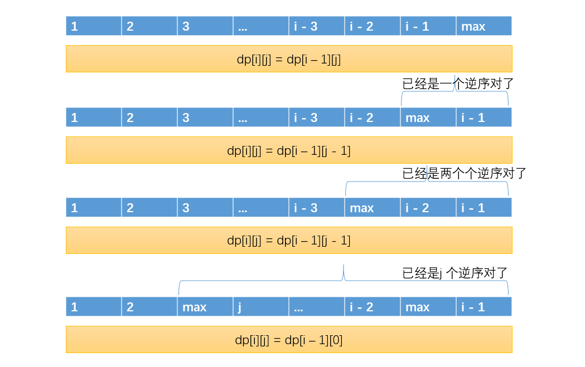

## 课时一

```tex
1 记忆化搜索 vs 递推动态规划


什么时候使用记忆化搜索（自顶向下的动态规划）
1依赖关系比较复杂，比如依赖上下左右的值，而上面的值又依赖于自己的值
2有限次递归调用，比如经典的矩阵问题，调用f(i,j) 可能是主函数调用，也可能是递归过程的上下左右四个位置调用
	因此最多调用次数也就是5，这种情况下使用记忆化搜索。即使可以改成严格递推式的动态规划，也可能只是常数的优化。
	
什么时候使用递归动态规划 
1 有枚举行为 ，严格递推式可能产生优化，而记忆化搜索不能
2 很容易编码，如果很容易改成这种动态规划 ，则直接改。因为函数调用复杂度比较高，而且花费系统栈。

结论 矩阵问题 ，依赖关系复杂 使用记忆化搜索就可以了。其他情况一般是严格递推的动态规划。


```

```tex

```

#### 题目一 最长递增链

---

> 给定一个二维数组matrix，可以从任何位置出发，每一步可以走向上、下、左、右,
> 四个方向。返回最大递增链的长度。
> 例子：
> matrix =
> 5 4 3
> 3 1 2
> 2 1 3
> 从最中心的1出发,是可以走出123 4 5的链的，而且这是最长的递增链。所以返回
> 长度5
---


```tex
知识点 记忆化搜索

首先枚举每一个位置 ，因为每一个位置都可能是开头
然后 对每个位置 使用递归寻求最长递增链的长度
因为是递增子链，我们调用子过程时，注意判断，就不会产生重复到某一个各自的情况（a>b时， b不可能大于 a)

这个方法改不成递推动态规划，因为 每个位置依赖上下左右四个位置

虽然每个位置都是递归，可能很暴力

我们只需要带上一个缓存玩，就能极大的减少复杂度，
因为每个位置只会被主函数，或上下左右四个格子调用，最多调用五次。
每个位置求出结果后会放在缓存中， 每个位置最多求一次结果，并且求解的过程中没有递归和枚举。
因此填完所有表的复杂度为 O(N * M) 
而遍历每个位置的复杂度是 O(N * M)
因为我们填好表之后 的遍历时一个查询 复杂度为O（1）因此最终复杂度是 O(N * M)
已经是最优解，不可能出现 连矩阵都没有看完就可以得到答案的方法。
```

```java
package com.lihd.part01;
/**
 * @author : 葬花吟留别1851053336@qq.com
 * &#064;description : TODO
 * &#064;date : 2022/8/11 9:23
 */
public class Code01LongestIncreasingPath {

    public static int all;
    public static int hit;

    /**
     * 暴力递归调度函数
     * 注意每一个位置的调度，因为每个位置都可能是递增链的开始
     * @param map 二维数组
     * @return int 最长递增链的长度
     * @author lihd
     * @date 2022/8/11 9:44
     */
    public static int maxIncreasingPath(int[][] map) {
        int R = map.length;
        int C = map[0].length;

        int ans = 0;

        for (int row = 0; row < R; row++) {
            for (int col = 0; col < C; col++) {
                int val = maxIncreasingPath(map, row, col);
                ans = Math.max(ans, val);
            }
        }
        return ans;

    }
    
    /**
     * 暴力递归   
     * 注意 这个暴力递归 最少返回1
     * @param map 二维数组
	 * @param row 当前所在行
	 * @param col 当前所在列
     * @return int 返回这个位置出发的最长递增链
     * @author lihd
     * @date 2022/8/11 9:45
     */
    public static int maxIncreasingPath(int[][] map, int row, int col) {
        int R = map.length;
        int C = map[0].length;
        int p1 = 0;
        int p2 = 0;
        int p3 = 0;
        int p4 = 0;
        if (row + 1 < R && map[row][col] < map[row + 1][col]) {
            p1 = maxIncreasingPath(map, row + 1, col);
        }
        if (row - 1 >= 0 && map[row][col] < map[row - 1][col]) {
            p2 = maxIncreasingPath(map, row - 1, col);
        }
        if (col + 1 < C && map[row][col] < map[row][col + 1]) {
            p3 = maxIncreasingPath(map, row, col + 1);
        }
        if (col - 1 >= 0 && map[row][col] < map[row][col - 1]) {
            p4 = maxIncreasingPath(map, row, col - 1);
        }
        return 1 + Math.max(Math.max(p1, p2), Math.max(p3, p4));
    }
    
    
    /**
     * 动态规划 调度函数 
     * 注意每一个位置的调度
     * @param map 二维数组 最长递增链的长度
     * @return int 
     * @author lihd
     * @date 2022/8/11 9:47
     */
    public static int maxIncreasingPathDp(int[][] map) {
        int R = map.length;
        int C = map[0].length;
        int[][] dp = new int[R][C];
        int ans = 0;

        for (int row = 0; row < R; row++) {
            for (int col = 0; col < C; col++) {
                int val = maxIncreasingPathDp(map,dp, row, col);
                ans = Math.max(ans, val);
            }
        }


        return maxIncreasingPathDp(map, dp, 0, 0);
    }
    
    
    /**
     * 暴力递归 + 记忆化搜索
     * 命中后记得把 结果加到缓存
     * @param map 二维数组
	 * @param dp dp表
	 * @param row 当前所在行
	 * @param col 当前所在列
     * @return int 
     * @author lihd
     * @date 2022/8/11 9:46
     */
    public static int maxIncreasingPathDp(int[][] map, int[][] dp, int row, int col) {
        int R = map.length;
        int C = map[0].length;

        all++;
        if (dp[row][col] != 0) {
            hit++;
            return dp[row][col];
        }

        int p1 = 0;
        int p2 = 0;
        int p3 = 0;
        int p4 = 0;
        if (row + 1 < R && map[row][col] < map[row + 1][col]) {
            p1 = maxIncreasingPathDp(map, dp, row + 1, col);
        }
        if (row - 1 >= 0 && map[row][col] < map[row - 1][col]) {
            p2 = maxIncreasingPathDp(map, dp, row - 1, col);
        }
        if (col + 1 < C && map[row][col] < map[row][col + 1]) {
            p3 = maxIncreasingPathDp(map, dp, row, col + 1);
        }
        if (col - 1 >= 0 && map[row][col] < map[row][col - 1]) {
            p4 = maxIncreasingPathDp(map, dp, row, col - 1);
        }
        dp[row][col] = 1 + Math.max(Math.max(p1, p2), Math.max(p3, p4));
        return dp[row][col];
    }


    public static void main(String[] args) {
        int[][] map = {
                {5, 4, 3,},
                {3, 1, 2,},
                {2, 1, 3,},
        };

        System.out.println(maxIncreasingPath(map));
        System.out.println(maxIncreasingPathDp(map));

        System.out.println("hit = " + hit);
        System.out.println("all = " + all);
    }


}
```

#### 题目二 <=K最大子数组累加和

---

>给定一个数组arr，再给定一个k值
>返回累加和小于等于k，但是离k最近的子数组累加和。
---


```tex
本题目提供了两种方法

1  利用了有序表

2  利用了预处理数组 + 二分

先构造累加和数组 ，再让这个累加和数组 变成单调递增的（防止二分收到影响）
当我们来到i位置 累加和 是 sum  此时我们向获取sum - k中的最小的，因此可以通过二分找到 《= k的最左位置。
假设这个位置 是index
sum - sums[index] 这样就得到了 <= k中一个解。
全部处理完后，结果就出来了
```

```java
package com.lihd.part01;
import java.util.Arrays;
import java.util.TreeSet;

/**
 * @author : 葬花吟留别1851053336@qq.com
 * &#064;description : TODO
 * &#064;date : 2022/8/11 12:49
 */
public class Code02MaxSubArraySumLessOrEqualK {


    public static int sumLessOrEqualK(int[] arr, int K) {

        TreeSet<Integer> set = new TreeSet<>();
        set.add(0);
        int ans = 0;
        int sum = 0;
        for (int i = 0; i < arr.length; i++) {
            sum += arr[i];
            Integer ceiling = set.ceiling(sum - K);
            if (ceiling != null) {
                ans = Math.max(ans, sum - ceiling);
            }
        }
        return ans;
    }


    public static int sumLessOrEqualK2(int[] arr, int K) {

        int[] sum = new int[arr.length];
        sum[0] = arr[0];
        for (int i = 1; i < arr.length; i++) {
            sum[i] = sum[i - 1] + arr[i];
        }
        for (int i = 1; i < sum.length; i++) {
            sum[i] = Math.max(sum[i], sum[i - 1]);
        }
        int ans = 0;
        int s = 0;
        for (int i = 0; i < arr.length; i++) {
            s += arr[i];
            int index = binarySearch(sum, s - K);
            if (index != -1) {
                ans = Math.max(ans, s - sum[index]);
            }
        }
        return ans;
    }

    /**
     * 二分法 寻找 >= k的最左位置
     * @param arr 有序数组
	 * @param K 要寻找的值
     * @return int
     * @author lihd
     * @date 2022/8/11 13:18
     */
    public static int binarySearch(int[] arr, int K) {
        int l = 0;
        int r = arr.length - 1;
        int ans = -1;
        while (l <= r) {
            int m = l + (r - l) / 2;
            if (K > arr[m]) {
                l = m + 1;
            }else{
                ans = m;
                r = m - 1;
            }
        }
        return ans;
    }

    public static void main(String[] args) {
        int[] arr = {2, 3, 6, 9, 7, 6, 3, 4, 2, 5, 9};
        System.out.println(sumLessOrEqualK(arr, 21));
        System.out.println(sumLessOrEqualK2(arr, 21));

        arr = new int[]{1, 1, 1, 1, 1, 2, 2, 2, 3, 3, 3,};
        System.out.println(binarySearch(arr,-1));
    }


}
```


#### 题目三 <=K最大子矩阵累加和

---

>给定一个二维数组matrix，再给定一个k值
>返回累加和小于等于k，但是离k最近的子矩阵累加和
---


```tex

知识点 ： 压缩数组技巧

我们可以求出一个数组的该问题，只需要通过某种调度 ，就可以将所有的矩阵，不断压缩成数组
遍历 压缩数组代价 O(M * M)[M为行的个数] 
处理每个数组的代价 O(N * logN) [N为列的个数]
```

```java
package com.lihd.part01;

/**
 * @author : 葬花吟留别1851053336@qq.com
 * &#064;description : TODO
 * &#064;date : 2022/8/11 13:19
 */
public class Code03MaxSumOfRectangleNoLargerThanK {


    public static int maxSumSubMatrix(int[][] matrix, int K) {


        int R = matrix.length;
        int C = matrix[0].length;
        int ans = 0;
        for (int begin = 0; begin < R; begin++) {
            int[] arr = new int[C];
            for (int end = begin; end < R; end++) {
                //子数组 [begin ... end]
                //子数组先累加上
                for (int i = 0; i < C; i++) {
                    arr[i] += matrix[end][i];
                }
                //寻找arr[i]的子数组问题即可
                int val = sumLessOrEqualK2(arr, K);
                ans = Math.max(ans, val);
            }
        }
        return ans;
    }


    //下面的代码是从  上一节粘过来的

    public static int sumLessOrEqualK2(int[] arr, int K) {

        int[] sum = new int[arr.length];
        sum[0] = arr[0];
        for (int i = 1; i < arr.length; i++) {
            sum[i] = sum[i - 1] + arr[i];
        }
        for (int i = 1; i < sum.length; i++) {
            sum[i] = Math.max(sum[i], sum[i - 1]);
        }
        int ans = 0;
        int s = 0;
        for (int i = 0; i < arr.length; i++) {
            s += arr[i];
            int index = binarySearch(sum, s - K);
            if (index != -1) {
                ans = Math.max(ans, s - sum[index]);
            }
        }
        return ans;
    }

    public static int binarySearch(int[] arr, int K) {
        int l = 0;
        int r = arr.length - 1;
        int ans = -1;
        while (l <= r) {
            int m = l + (r - l) / 2;
            if (K > arr[m]) {
                l = m + 1;
            }else{
                ans = m;
                r = m - 1;
            }
        }
        return ans;
    }

    public static void main(String[] args) {

    }


}

```


#### 题目四 单词查找II (leetcode)

---

>给定一个字符类型的二维数组board_和一个字符串组成的列表words。
>可以从board任何位置出发，每一步可以走向上、下、左、右，四个方向，但是一条路径已经走过的位置，不
>能重复走。
>返回words哪些单词可以被走出来。
>例子
>board =[
>[o, a, a, n]
>
>[e, t,  a, e]
>
>[i,  h,  k, r]
>
>[i,  f,  l,   v]
>
>words = ["oath","pea","eat" "rain"]
>输出：[”eat”，“oath”]
---


```tex

知识点 ： 前缀树 + 递归 + 剪枝

这道题主要考查递归，还是很难的 是leetcode上的原题

递归进行了大量的剪枝

优化1 前缀树 大大加快了判读速度，这个结构必须有
优化2 有返回的递归，可以很快的确定那个答案已经添加过，这是比leetcode代码快的原因。
老师代码下面是leetcode上一个代码
```

```java
package com.lihd.part01;

import java.util.ArrayList;
import java.util.LinkedList;
import java.util.List;

/**
 * Runtime: 49 ms, faster than 97.96% of Java online submissions for Word Search II.
 * Memory Usage: 54.9 MB, less than 35.34% of Java online submissions for Word Search II.
 * 真的很难了
 * @author : 葬花吟留别1851053336@qq.com
 * &#064;description : TODO
 * &#064;date : 2022/8/11 9:56
 */
public class Code04WordSearch {


    public static List<String> findWords(char[][] board, String[] words) {
        List<String> ans = new ArrayList<>();
        LinkedList<Character> path = new LinkedList<>();
        Tire tire = new Tire();
        tire.buildBatch(words);
        for (int i = 0; i < board.length; i++) {
            for (int j = 0; j < board[0].length; j++) {
                findWords(i, j, board, tire.root, path, ans);
            }
        }
        return ans;

    }

    /**
     * 递归过程，比较恶心。
     * 注意 把答案加上后记得 让node.e --
     * @param row 当前来的row
	 * @param col 当前来到的col
	 * @param board 字符棋盘 固定参数
	 * @param node 前缀树的某个节点，我们来到这个节点
	 * @param path 之前的路径
	 * @param ans 答案返回的集合
     * @return int 把多少条数据放到了ans中 这个返回值可以加速我们的寻找
     * @author lihd
     * @date 2022/8/11 10:55
     */
    public static int findWords(int row, int col, char[][] board,
                                Node node, LinkedList<Character> path,
                                List<String> ans
    ) {

        if (row < 0 || row >= board.length || col < 0 || col >= board[0].length) {
            //不合法的情况。
            return 0;
        }

        if (board[row][col] == 0) {
            //走了重复的方法数，返回 0 没有合法的方法数
            return 0;
        }
        int res = 0;
        char before = board[row][col];
        int next = before - 'a';
        if (node.nexts[next] == null || node.nexts[next].p == 0) {
            //没有后面的路
            return 0;
        }
        //记录当前的字符是什么 用于数据恢复
        board[row][col] = 0;
        //路径加上当前的字符
        path.add(before);
        node = node.nexts[next];

        if (node.e != 0) {
            //是结尾
            res++;
            node.e--;
            ans.add(getString(path));
        }
        int p1 = findWords(row + 1, col, board, node, path, ans);
        int p2 = findWords(row - 1, col, board, node, path, ans);
        int p3 = findWords(row, col + 1, board, node, path, ans);
        int p4 = findWords(row, col - 1, board, node, path, ans);
        res = res + p1 + p2 + p3 + p4;
        //数据恢复
        board[row][col] = before;
        path.pollLast();
        node.p -= res;
        return res;
    }

    public static String getString(LinkedList<Character> list) {
        StringBuilder sb = new StringBuilder();
        for (Character character : list) {
            sb.append(character);
        }
        return sb.toString();
    }


    public static class Node{
        int p;
        int e;
        Node[] nexts = new Node[26];
    }

    public static class Tire{
        Node root = new Node();

        public void build(String s) {
            Node cur = root;
            char[] chs = s.toCharArray();
            for (int i = 0; i < chs.length; i++) {
                int next = chs[i] - 'a';
                cur.p++;
                if (cur.nexts[next] == null) {
                    cur.nexts[next] = new Node();
                }
                cur = cur.nexts[next];
            }
            cur.p++;
            cur.e++;
        }

        public void buildBatch(String[] words) {
            for (String word : words) {
                build(word);
            }
        }

    }

    public static void main(String[] args) {
        char[][] board = {{'o', 'a', 'a', 'n'}, {'e', 't', 'a', 'e'}, {'i', 'h', 'k', 'r'}, {'i', 'f', 'l', 'v'}};
        String [] words = {"oath", "pea", "eat", "rain"};
        List<String> list = findWords(board, words);
        for (String s : list) {
            System.out.println(s);
        }
    }

}

```


```java
package com.lihd.part01;

import java.util.ArrayList;
import java.util.List;

/**
 * @author : 葬花吟留别1851053336@qq.com
 * &#064;description : TODO
 * &#064;date : 2022/8/11 11:09
 */
public class LeetCode212WordSearchII {

    public  List<String> findWords(char[][] board, String[] words) {
        List<String> ans = new ArrayList<>();
        TireNode root = buildTree(words);
        for (int i = 0; i < board.length; i++) {
            for (int j = 0; j < board[0].length; j++) {
                dfs(i, j, board, root, ans);
            }
        }
        return ans;
    }


    public  void dfs(int row, int col, char[][] board, TireNode node, List<String> ans) {

        char before = board[row][col];
        int next = before - 'a';
        if (before == 0 || node.nexts[next] == null) {
            return;
        }
        node = node.nexts[next];
        if (node.word != null) {
            ans.add(node.word);
            node.word = null;
        }
        board[row][col] = 0;
        if(row > 0) dfs(row - 1, col, board, node, ans);
        if(col > 0) dfs(row, col -1 , board, node, ans);
        if(row + 1 < board.length) dfs(row + 1, col, board, node, ans);
        if(col + 1 < board[0].length) dfs(row, col + 1, board, node, ans);
        board[row][col] = before;
    }


    static class TireNode{
        String word;
        TireNode[] nexts = new TireNode[26];
    }

    public  TireNode buildTree(String[] words) {
        TireNode root = new TireNode();
        for (String word : words) {
            TireNode node = root;
            char[] chs = word.toCharArray();
            for (char ch : chs) {
                int next = ch - 'a';
                if (node.nexts[next] == null) {
                    node.nexts[next] = new TireNode();
                }
                node = node.nexts[next];
            }
            node.word = word;
        }
        return root;
    }
}
```


#### 题目五 MISSING

---

>题目五
>给定一个只由"0"～"9" 字符组成的字符串num，和整数target。可以用+、- 和*连接，返回num得到target的所有
>不同方法。
>Example 1:
>Input: num = "123", target Output: ["1+2+3","1x2x3"]
>Example 2:
>Input: num = "232", target Output: ["2*3+2","2+3*2"]
>Example 3:
>Input: num = "105", target Output: ["1*0+5","10-5"]
>= 6 = 8 = 5
>Example 4:
>Input: num = "00",target = 0 Output: ["0+0","0-0","0*0"]
>Example 5:
>Input: num = "3456237490", target = 9191 Output: []
---


```tex

```

```java

```


## 课时二

```tex
一个样本做行 一个样本做列 的对应模型

分类的依据就是 结尾的归属问题
讨论结尾位置如何归属 去想可能性 ， 每一种尝试方案就那么多东西。


题目一到题目三 为 股票三连问题 


动态规划约束
1 参数不超过int的复杂程度
2 和记忆化搜索有关
3 可变参数个数能省就省
```

```tex

```

#### 题目一 股票一

---

>给定一个数组arr，从左到右表示昨天从早到晚股票的价格。作为一个事后诸
>葛亮，你想知道如果只做一次交易，且每次交易只买卖一股，返回能挣到的
>最大钱数
---


```tex

记录一个值 代表 arr[0...i] 的最小值 min。
每次使用 arr[i] - min，然后把结果和ans比较大小即可

如此之后，每个位置必须卖出的最好情况我们都放到过ans里面
因此答案必在其中
```

```java
public class Code01BestTimeToBuyAndSellStock1 {

    public static int maxProfit(int[] arr) {
        int min = arr[0];
        int max = 0;
        for (int profit : arr) {
            min = Math.min(min, profit);
            max = Math.max(max, profit - min);
        }
        return max;
    }

    public static void main(String[] args) {
        int[] arr = {3, 4, 8, 6, 5, 6, 2, 3, 4, 7, 3};
        System.out.println(maxProfit(arr));
    }
}

```

#### 题目二 股票二

---

>给定一个数组arr，从左到右表示昨天从早到晚股票的价格
>作为一个事后诸葛亮，你想知道如果随便交易，
>且每次交易只买卖一股，返回能挣到的最大钱数
---


```tex


很简单，如果arr[i + 1] 的值大于 arr[i]的值的话，我们就加上这个差值，
所有位置都来一遍，答案必在其中。
因此这种方式我们可以获取所有的“上坡”

```

```java
public class Code02BestTimeToBuyAndSellStock2 {

    public static int maxProfitNoLimit(int[] arr) {

        int pre = arr[0];
        int ans = 0;
        for (int i = 1; i < arr.length; i++) {
            if (arr[i] > arr[i - 1]) {
                ans += arr[i] - arr[i - 1];
            }
        }
        return ans;
    }

    public static void main(String[] args) {
        int[] arr = {3, 4, 8, 6, 5, 6, 2, 3, 4, 7, 3};
        System.out.println(maxProfitNoLimit(arr));
    }
}
```


#### 题目三 股票三

---

>给定一个数组arr，从左到右表示昨天从早到晚股票的价格
>作为一个事后诸葛亮, 你想知 道如果交易次数不超过K次,
>且每次交易只买卖一股，返回能挣到的最大钱数
---


```tex
知识点 ：动态规划， 斜率优化

注意 由于 股票上升最多的段数是 arr.length/2
因此如果 K >= arr.length 这个问题的答案就是第二题的答案
```

```java
package com.lihd.part02;

/**
 * @author : 葬花吟留别1851053336@qq.com
 * &#064;description : TODO
 * &#064;date : 2022/8/9 20:00
 */
public class Code03BestTimeToBuyAndSellStockFollow {

    //这个k指的是买了再卖了的次数 同一时刻，可以一直买卖，不过都算次数。
    public static int maxProfit(int[] arr, int k) {
        int n = arr.length;
        int[][] dp = new int[n][k + 1];
        int max = 0;
        for (int times = 1; times <= k; times++) {
            int sum = dp[0][times - 1] - arr[0];
            for (int index = 1; index < n; index++) {
                sum = Math.max(dp[index][times - 1] - arr[index], sum);
                dp[index][times] = Math.max(dp[index - 1][times], sum + arr[index]);
                max = Math.max(max, dp[index][times]);
            }
        }
        return max;
    }

    public static void main(String[] args) {
        int[] test = { 4, 1, 231, 21, 12, 312, 312, 3, 5, 2, 423, 43, 146 };
        int K = 3;
        int i = maxProfit(test, K);
        System.out.println(i);
    }


}
```


#### 题目四 s删成t

---

>给定两个字符串S和T，返回S子序列等于T的不同子序列个数有多少个？如果得到子序列A删除的位置与得到子
>序列B删除的位置不同，那么认为A和B就是不同的。
>【例子】
>S = "rabbbit", T = "rabbit"
>返回: 3
>是以下三个S的不同子序列，被[]包围的位置表示删除的位置，因为删除的位置不同，所以这三个子序列是不一样的
>ra[b]bbit rab[b]bit  rabb[b]it 
---


```tex

一个样本做行，一个样本做列。
对于这种模型，我们直接建立 dp[s.len][t.len]的二维表
dp[i][j] 的值 代表 s[0...i]经过xxx 变成 t[0...j] 
以每个位置结尾作为分类讨论的情况即可。
```

```java
package com.lihd.part02;

/**
 * @author : 葬花吟留别1851053336@qq.com
 * &#064;description : TODO
 * &#064;date : 2022/8/10 20:58
 */
public class Code04DistinctSubsequences {

    /**
     * 动态规划
     * dp[i][j]的含义 ：可以在s[0...i]上任意删除，删除出 t[0...j]的方法数
     * 行列对应模型，直接二维表，二维表讨论直接根据以 某个位置作为结尾考虑情况
     * @param s 可以删除的字符串
	 * @param t 目标字符串
     * @return int
     * @author lihd
     * @date 2022/8/10 21:13
     */
    public static int getNumDp(String s, String t) {
        char[] chs1 = s.toCharArray();
        char[] chs2 = t.toCharArray();
        int r = chs1.length;
        int c = chs2.length;
        int[][] dp = new int[r][c];
        //左上角
        dp[0][0] = chs1[0] == chs2[0] ? 1 : 0;
        //第一行 一个字符怎么也不可能删除出 一个比它还长的字符 因此都是0(不包括第一个）, 不用填

        //填好第一列的值
        for (int row = 1; row < r; row++) {
            dp[row][0] = chs1[row] == chs2[0] ? dp[row - 1][0] + 1 : dp[row - 1][0];
        }

        //朴素位置
        for (int row = 1; row < r; row++) {
            for (int col = 1; col < c; col++) {
                //这种情况是 我直接删除s的最后一个字符
                dp[row][col] = dp[row - 1][col];
                //这种情况是不删除，不删除要满足条件 ：s中的最后一个字符 == t中的最后一个字符
                if (chs1[row] == chs2[col]) {
                    //既然最后一个字符都相同，就退化为子问题。
                    dp[row][col] += dp[row - 1][col - 1];
                }
            }
        }
        return dp[r - 1][c - 1];
    }

    public static void main(String[] args) {
        String s = "rabbbit";
        String t = "rabbit";
        System.out.println(getNumDp(s, t));
    }


}
```


#### 题目五 骑士拯救公主

---

>给定一个二维数组 map， 含义是一张地图，例如，如下矩阵:
>-2  -3  3
>-5 -10 1
>0    30 -5
>游戏的规则如下:
>骑士从左上角出发次只能向右或向下走，最后到达右下角见到公主。
>地图中每个位置的值代表骑士要遭遇的事情。
>如果是负数，说明此处有怪兽，要让骑士损失血量。
>如果是非负数，代表此处有血瓶，能让骑士回血。
>骑士从左上角到右下角的过程中，走到任何一个位置时，血量都不能少于1。
>为了保证骑士能见到公主，初始血量至少是多少?根据map，返回至少的初始血量。
---


```tex

动态规划
每个格子依赖右边的格子和下边的格子，
可以先写出暴力递归，后改成动态规划

```

```java
package com.lihd.part02;

/**
 * 骑士拯救公主的故事
 * @author : 葬花吟留别1851053336@qq.com
 * &#064;description : TODO
 * &#064;date : 2022/8/10 21:18
 */
public class Code05DungeonGame {

    /**
     * 暴力递归的调度函数
     * @param map 地图
     * @return int
     * @author lihd
     * @date 2022/8/10 22:05
     */
    public static int minHpForce(int[][] map) {
        return minHpForce(map, 0, 0);
    }

    /**
     * 暴力递归
     * 这里骑士所处的位置 是还没有真正踩上去时的情况，意思是在当前位置，骑士还没有吃血包或者打怪兽
     * 因此这个递归要处理好当前骑士所有的位置。
     * @param map 地图
	 * @param row 骑士当前行
	 * @param col 骑士当前列
     * @return int 从row,col走到最后至少需要的血量
     * @author lihd
     * @date 2022/8/10 22:03
     */
    public static int minHpForce(int[][] map, int row, int col) {
        int R = map.length;
        int C = map[0].length;
        if (row == R - 1 && col == C - 1) {
            //最后一个位置 如果是负数 要减去这个负数的值，无论如何最少保证1血量
            return map[row][col] < 0 ? 1 - map[row][col] : 1;
        }
        int next = 0;
        if (row == R - 1) {
            //最后一行，只能向右走 next是下一个需要的最少血量
            next = minHpForce(map, row, col + 1);
        } else if (col == C - 1) {
            next = minHpForce(map, row + 1, col);
        } else {
            //普遍位置
            next = Math.min(minHpForce(map, row + 1, col), minHpForce(map, row, col + 1));
        }

        if (map[row][col] >= next) {
            //我所处的位置 >= next >= 1，是个正数
            return 1;
        } else {
            //我所处的位置 比next小，我满足我自己的情况下要满足下一个条件
            //比如我的值是3， next的值是 5 我需要再加两个血
            return next - map[row][col];
        }

    }

    /**
     * 由上面的暴力递归修改为动态规划
     * dp[i][j] 代表从当前位置走到最后位置最少需要的血量
     * @param map 地图
     * @return int
     * @author lihd
     * @date 2022/8/10 21:58
     */
    public static int minHpDp(int[][] map) {
        int R = map.length;
        int C = map[0].length;
        int[][] dp = new int[R][C];
        dp[R - 1][C - 1]  = map[R - 1][C - 1] < 0 ? 1 - map[R - 1][C - 1] : 1;
        for (int row = R - 2; row >= 0; row--) {
            int next = dp[row + 1][C - 1];
            dp[row][C - 1] = map[row][C - 1] >= next ? 1 : next - map[row][C - 1];
        }
        for (int col = C - 2; col >= 0; col--) {
            int next = dp[R - 1][col + 1];
            dp[R - 1][col] = map[R - 1][col] >= next ? 1 : next - map[R - 1][col];
        }
        for (int row = R - 2; row >= 0; row--) {
            for (int col = C - 2; col >= 0; col--) {
                int next = Math.min(dp[row + 1][col], dp[row][col + 1]);
                dp[row][col] = map[row][col] >= next ? 1 : next - map[row][col];
            }
        }
        return dp[0][0];
    }

    public static void main(String[] args) {
        int[][] map = { { -2, -3, 3 }, { -5, -10, 1 }, { 10, 30, -5 }, };
        System.out.println(minHpForce(map));
        System.out.println(minHpDp(map));
    }
}
```


#### 题目六 捡荔枝

---

>给定一个矩阵matrix，先从左上角开始, 一步只能往右或者往下走，走到右
>下角。然后从右下角出发，每一步只能往上或者往左走，再回到左上角。任
>何一个位置的数字，只能获得一遍。返回最大路径和。
---


```tex

注意本来是4个可变参数，但是由于他们两个小人一定是同步数移动的，因此 一定有 aR +aC == bR + bC 
因此可以省略一个参数。

下面的代码包括 暴力递归 -》 记忆化搜索 -》三维动态规划 没有错误，可以好好看一下。

```

```java
package com.lihd.part02;

import java.util.Random;

/**
 * @author : 葬花吟留别1851053336@qq.com
 * &#064;description : TODO
 * &#064;date : 2022/8/10 22:23
 */
public class Code06CherryPickup {


    public static int all;
    public static int hit;

    /**
     * 暴力递归 调度函数
     * @param map 地图
     * @return int
     * @author lihd
     * @date 2022/8/10 23:15
     */
    public static int maxPickUpForce(int[][] map) {
        return maxPickUpForce(map, 0, 0, 0);
    }

    /**
     * 暴力递归
     * @param map 地图
	 * @param aR 人物a当前来到的 row
	 * @param aC 人物a当前来到的 col
	 * @param bR 人物b当前来到的 row
     * @return int
     * @author lihd
     * @date 2022/8/10 23:15
     */
    public static int maxPickUpForce(int[][] map, int aR, int aC, int bR) {
        int R = map.length;
        int C = map[0].length;
        int bC = aR + aC - bR;
        if (aR >= R || aC >= C || bR >= R || bC >= C) {
            //检验位置是否有效，无效返回最小值。
            return 0;
        }
        if (aR == R - 1 && aC == C - 1) {
            //说明两个点都来到了最后的位置
            return map[aR][aC];
        }
        int ans = 0;
        if (aR == bR) {
            //代表着两点重合。
            ans += map[aR][aC];
        } else {
            //两个点不重合
            ans += map[aR][aC] + map[bR][bC];
        }
        //所有可能的情况
        //p1 : a 向左 ，b 向左
        //p2 : a 向左 ，b 向下
        //p3 : a 向下 ，b 向左
        //p4 : a 向下 ，b 向下
        int p1 = maxPickUpForce(map, aR + 1, aC, bR);
        int p2 = maxPickUpForce(map, aR + 1, aC, bR + 1);
        int p3 = maxPickUpForce(map, aR, aC + 1, bR);
        int p4 = maxPickUpForce(map, aR, aC + 1, bR + 1);
        int best = Math.max(Math.max(p1, p2), Math.max(p3, p4));
        return ans + best;
    }

    public static int maxPickUpMemory(int[][] map) {
        int[][][] dp = new int[map.length][map[0].length][map.length];
        return maxPickUpMemory(map, 0, 0, 0, dp);
    }
    public static int maxPickUpMemory(int[][] map, int aR, int aC, int bR, int[][][] dp) {
        int R = map.length;
        int C = map[0].length;
        int bC = aR + aC - bR;
        if (aR >= R || aC >= C || bR >= R || bC >= C) {
            //检验位置是否有效，无效返回最小值。
            return 0;
        }
        all++;
        //先去缓存中查看
        if (dp[aR][aC][bR] != 0) {
            hit++;
            return dp[aR][aC][bR];
        }

        if (aR == R - 1 && aC == C - 1 ) {
            //说明两个点都来到了最后的位置
            dp[aR][aC][bR] = map[aR][aC];
            return map[aR][aC];
        }
        int ans = 0;
        if (aR == bR) {
            //代表着两点重合。
            ans += map[aR][aC];
        } else {
            //两个点不重合
            ans += map[aR][aC] + map[bR][bC];
        }
        //所有可能的情况
        //p1 : a 向左 ，b 向左
        //p2 : a 向左 ，b 向下
        //p3 : a 向下 ，b 向左
        //p4 : a 向下 ，b 向下
        int p1 = maxPickUpMemory(map, aR + 1, aC, bR, dp);
        int p2 = maxPickUpMemory(map, aR + 1, aC, bR + 1, dp);
        int p3 = maxPickUpMemory(map, aR, aC + 1, bR, dp);
        int p4 = maxPickUpMemory(map, aR, aC + 1, bR + 1, dp);
        int best = Math.max(Math.max(p1, p2), Math.max(p3, p4));
        dp[aR][aC][bR] = ans + best;
        return ans + best;
    }


    public static int maxPickUpDp(int[][] map) {
        int R = map.length;
        int C = map[0].length;

        int[][][] dp = new int[R + 1][C + 1][R + 1];
        dp[R - 1][C - 1][R - 1] = map[R - 1][C - 1];

        for (int aR = R - 1; aR >= 0; aR--) {
            for (int aC = C - 1; aC >= 0; aC--) {
                for (int bR = R - 1; bR >= 0; bR--) {
                    int bC = aR + aC - bR;
                    if (bC >= C || bC < 0) {
                        continue;
                    }
                    int p1 = dp[aR + 1][aC][bR];
                    int p2 = dp[aR + 1][aC][bR + 1];
                    int p3 = dp[aR][aC + 1][bR];
                    int p4 = dp[aR][aC + 1][bR + 1];
                    int best = Math.max(Math.max(p1, p2), Math.max(p3, p4));

                    int ans = 0;
                    if (aR == bR) {
                        //代表着两点重合。
                        ans += map[aR][aC];
                    } else {
                        //两个点不重合
                        ans += map[aR][aC] + map[bR][bC];
                    }
                    dp[aR][aC][bR] = ans + best;
                }
            }
        }
        return dp[0][0][0];

    }

    public static int[][] randomMap(int m, int n) {
        Random random= new Random();
        int r = random.nextInt(m) + 3;
        int c = random.nextInt(n) + 3;
        int[][] map = new int[r][c];
        for (int[] one : map) {
            for (int i = 0; i < one.length; i++) {
                one[i] = random.nextInt(10);
            }
        }
        return map;
    }

    public static void main(String[] args) {
//        int[][] map = {
//                {1, 1, 1, 1, 1, 0, 0, 0, 0, 0},
//                {0, 0, 0, 0, 1, 0, 0, 0, 0, 0},
//                {0, 0, 0, 0, 1, 0, 0, 0, 0, 1},
//                {1, 0, 0, 0, 1, 0, 0, 0, 0, 0},
//                {0, 0, 0, 0, 1, 1, 1, 1, 1, 1}};
        int[][] map = randomMap(10, 10);
        int maxPickUpForce = maxPickUpForce(map);
        int maxPickUpMemory = maxPickUpMemory(map);
        int maxPickUpDp = maxPickUpDp(map);
        System.out.println("maxPickUpForce = " + maxPickUpForce);
        System.out.println("maxPickUpMemory = " + maxPickUpMemory);
        System.out.println("maxPickUpDp = " + maxPickUpDp);
        System.out.println("hit = " + hit);
        System.out.println("all = " + all);
    }
}
```


## 课时三

```tex

```

```tex

```

#### 题目一 无序数组最大相邻差值

---

>给定一个无序数组arr，返回如果排序之后，相邻数之间的最大差值
>{3,1,7,9}，如果排序后{1,3,7,9}，相邻数之间的最大差值来自3和7, 返回4
>要求：不能真的进行排序, 并且要求在时间复杂度O(N)内解决
---


```tex
知识点 ：凭空创建一个概念

很多问题都是根据问题的定义出发，理解后，
或许可以找到问题等效的定义，然后简化求解，
或许是一个动态规划
或许是一个滑动窗口
总而言之，无论是那种情况，都是在问题的定义上寻求答案

这道题的厉害之处在于 我们抽象出了一个概念，这个概念独立于问题的存在。并且这个概念帮助我们获取平凡解
尽管最终答案不一定在平凡解中，但是这些平凡解由帮助我们排除了很多情况。

```

```java
package com.lihd.part03;

/**
 * @author : 葬花吟留别1851053336@qq.com
 * &#064;description : TODO
 * &#064;date : 2022/8/10 16:51
 */
public class Code01MaxGap {

    public static int maxGap(int[] arr) {
        if (arr == null || arr.length == 0) {
            return 0;
        }

        int max = arr[0];
        int min = arr[0];
        for (int i = 1; i < arr.length; i++) {
            max = Math.max(max, arr[i]);
            min = Math.min(min, arr[i]);
        }

        //提前过滤 ，因为子过程有 除以（max - min)
        if (max == min) {
            return 0;
        }

        //桶的数量
        int bucket = arr.length + 1;

        boolean[] isEnter = new boolean[bucket];
        int[] maxArr = new int[bucket];
        int[] minArr = new int[bucket];

        for (int j : arr) {
            int index = getBucketIndex(j, max, min, bucket - 1);
            maxArr[index] = isEnter[index] ? Math.max(maxArr[index], j) : j;
            minArr[index] = isEnter[index] ? Math.min(minArr[index], j) : j;
            isEnter[index] = true;
        }

        int ans = 0;
        int lastMax = maxArr[0];
        for (int i = 1; i < bucket; i++) {
            if (isEnter[i]) {
                ans = Math.max(minArr[i] - lastMax, ans);
                lastMax = maxArr[i];
            }
        }
        return ans;
    }

    public static int getBucketIndex(int num,int max, int min, int bucketMaxIndex) {
        return (num - min) * bucketMaxIndex / (max - min);
    }

    public static void main(String[] args) {
        int[] arr = {3, 1, 7, 9};
        System.out.println(maxGap(arr));

    }

}

```

#### 题目二 拼接成str的方法数

---

>假设所有字符都是小写字母.目标字符串是str
>arr是去重的单词表,每个单词都不是空字符串且可以使用任意次
>使用arr中的单词有多少种拼接str的方式，返回方法数.
---


```tex
知识点 ：从左到右的尝试模型 + 前缀树

从左到右的尝试模型。

这个过程中我们要不断的寻找 以xxx开头的字符串是否存在 

而加速 xxx开头的结构有前缀树 


```

```java
package com.lihd.part03;

/**
 * @author : 葬花吟留别1851053336@qq.com
 * &#064;description : TODO
 * &#064;date : 2022/8/10 19:57
 */


public class Code02WorldBreak {


    public static class Node{
        int end;
        Node[] nexts = new Node[26];
    }

    public static class Tire{
        Node head = new Node();

        public void build(String s) {
            char[] chs = s.toCharArray();
            Node cur = head;
            for (char ch : chs) {
                int next = ch - 'a';
                if (cur.nexts[next] == null) {
                    cur.nexts[next] = new Node();
                }
                cur = cur.nexts[next];
            }
            cur.end ++;
        }

        public void buildBatch(String[] strings) {
            for (String s : strings) {
                build(s);
            }
        }
    }
    /**
     * 递归的调度函数
     * @param str 目标字符串
	 * @param arr 可以选用的数组
     * @return int  总方法数
     * @author lihd
     * @date 2022/8/10 20:20
     */
    public static int getMethodForce(String str, String[] arr) {
        Tire tire = new Tire();
        tire.buildBatch(arr);
        return getMethodForce(0, str.toCharArray(), tire.head);
    }

    /**
     * 最优解的实际暴力递归过程
     * @param index 当前来到的位置
	 * @param chs 目标字符串的char[]数组格式
	 * @param head 必须是前缀树的头结点
     * @return int 返回从index 到最后的方法数
     * @author lihd
     * @date 2022/8/10 20:22
     */
    public static int getMethodForce(int index, char[] chs, Node head) {
        if (index == chs.length) {
            return 1;//这种方法叫做 我什么也不做。
        }
        //cur 永远不会是null
        Node cur = head;
        int ans = 0;
        for (int i = index; i < chs.length; i++) {
            //[i ... chs.length) 遍历即可
            int next = chs[i] - 'a';
            if (cur.nexts[next] == null) {
                //没有后面的路了，证明这个前缀完全失效，跳出循环
                break;
            }
            cur = cur.nexts[next];
            if (cur.end != 0) {
                //说明当前位置 是某个字符串的结尾
                ans += getMethodForce(i + 1, chs, head);
//                ans += getMethodForce(index + 1, chs, head);
            }
        }
        return ans;
    }

    /**
     * 动态规划的方法。
     * @param str 目标字符串
	 * @param arr 可用的字符串
     * @return int
     * @author lihd
     * @date 2022/8/10 20:26
     */
    public static int getMethodDp(String str, String[] arr) {
        Tire tire = new Tire();
        tire.buildBatch(arr);
        char[] chs = str.toCharArray();
        int n = chs.length;
        int[] dp = new int[n + 1];
        dp[n] = 1;

        for (int index = n - 1; index >= 0; index--) {
            Node cur = tire.head;
            for (int i = index; i < n; i++) {
                int next = chs[i] - 'a';
                if (cur.nexts[next] == null) {
                    break;
                }
                cur = cur.nexts[next];
                if (cur.end != 0) {
                    dp[index] += dp[i + 1];
                }
            }
        }
        return dp[0];

    }


    public static void main(String[] args) {
        String str = "aaabbbccc";
        String[] arr = {"a", "aa", "aab","b", "bc", "cc", "c"};
        System.out.println(getMethodDp(str, arr));
        System.out.println(getMethodForce(str,arr));
    }

}
```


#### 题目三 树路径为K的最长长度

---

>给定一棵二叉树的头节点head, 和一个数K
>路径的定义:
>可以从任何一个点开始,但是只能往下走，往下可以走到任何节点停止
>返回路径累加和为K的所有路径中，最长的路径最多有几个节点？
---


```tex
知识点 累加和为K的最长子数组（数组三连）， 二叉树

和数组三连问题很相似
下面注释写的很清楚了 看一看即可，一位理解全写注释里了
```

```java
package com.lihd.part03;

import java.util.HashMap;

/**
 * @author : 葬花吟留别1851053336@qq.com
 * &#064;description : TODO
 * &#064;date : 2022/8/12 20:45
 */
public class Code03LongestSumEqualK {

    public static int ans;


    public static int maxNodes(Node head, int K) {
        if (head == null) {
            return -1;
        }
        //注意调节全局变量的值
        ans = 0;
        HashMap<Integer, Integer> map = new HashMap<>();
        //这里的map.put应该不用强调了 
        map.put(0, -1);
        maxNodes(head, 0, 0, K, map);
        return ans;
    }
    /**
     * 动态更新静态变量 ans ,最后答案就在其中
     * @param node 当前来到的节点
	 * @param level 当前节点的层数
	 * @param preSum 来到这个节点前 的前缀和
	 * @param K 目标值 K
	 * @param map map 维持好map的定义，key 代表累加和，value代表 第一次 出现的level
     * @author lihd
     * @date 2022/8/12 22:38
     */
    public static void maxNodes(Node node, int level, int preSum, int K, HashMap<Integer, Integer> map) {
        if (node == null) {
            return;
        }
        int sum = preSum + node.val;
        if (!map.containsKey(sum)) {
            //只有第一次才放入 
            map.put(sum, level);
        }
        if (map.containsKey(sum - K)) {
            // 注意这里是正确的，因为 0...lastLevel 累加和包括了 lastLevel这一层
            // 我们所在的层是 level 层 ，因此结果就是 level - lastLevel
            // 千万不要 + 1，因为范围就是 (lastLevel,level] 左开右闭 
            int lastLevel = map.get(sum - K);
            ans = Math.max(ans,level -  lastLevel);
        }
        maxNodes(node.left, level + 1, sum, K, map);
        maxNodes(node.right, level + 1, sum, K, map);
        //恢复现场
        map.remove(sum);
    }


    public static class Node {
        int val;
        Node left;
        Node right;

        public Node(int val) {
            this.val = val;
        }
    }


}

```


#### 题目四 只出现一次的数

---

>给定一个数组int[] arr, 已知除了一种数只出现1次之外，剩下所有的数都出现了k
>次，如何使用O(1)的额外空间，找到这个数。
---


```tex
知识点 异或 + K进制转换

可以看题目七 ，这里的代码作者说没用了，不过还是有 很大参考价值。

ans = int[32]
我们把每个数都转化为k进制，把所有结果 加到 ans数组上 （固定32长度，因此复杂度是O(1)）

最后把ans数组中的每个元素 都 %k 
最后ans所代表的十进制数 就是结果 

因为 转化成 k进制后 
出现k次的数 ： 相加 结果 一定是k的整数倍
出现一次的数 ： %k 不一定是 0 
```

```java
package com.lihd.part03;

/** 
 * 这个代码有局限性，不过容易理解
 * @author : 葬花吟留别1851053336@qq.com
 * &#064;description : TODO
 * &#064;date : 2022/8/12 12:49
 */
public class Code04KTimesOneTime {

    /**
     * 一个数组中，只有一个数字出现了1次，其余数字出现了k 次 （k > 1）
     * 请使用O(1)的空间找出这个数。
     * @param arr 数组
	 * @param k 其他数字出现的次数 > 1
     * @return int 返回唯一出现一次的数字
     * @author lihd
     * @date 2022/8/12 12:50
     */
    public static int selectOneNumInKTimes(int[] arr, int k) {
        int[] eor = new int[32];
        for (int num : arr) {
            arrAdd(eor, convertBase10ToK(num, k), k);
        }
        return convertBaseKTo10(eor, k);
    }


    /**
     * 数组相加，把后一个结果加到前一个上面去
     * @param res 结果存到的数组，也是加数
	 * @param other 加数
	 * @param k k进制，这里是为了防止溢出。
     * @author lihd
     * @date 2022/8/12 13:13
     */
    public static void arrAdd(int[] res, int[] other, int k) {
        for (int i = 0; i < res.length; i++) {
            res[i] += other[i];
            //这一步是为了防止溢出，最后一步统一%k和每一步都 %k效果是一样的。
            res[i] %= k;
        }
    }

    /**
     * 10进制转，k进制
     * @param num 要转换的数字
     * @param k 机制数 > 1
     * @return int[] 返回32长度的数字，arr[0]代表k进制的最低位，此次类推。
     * @author lihd
     * @date 2022/8/12 12:54
     */
    public static int[] convertBase10ToK(int num,int k) {
        int[] ans = new int[32];
        int index = 0;
        while (num != 0) {
            ans[index++] = num % k;
            num /= k;
        }
        return ans;
    }
    /**
     * k进制数组转 10进制
     * @param num 代表k进制
	 * @param k k进制的k
     * @return int 返回对应的10进制
     * @author lihd
     * @date 2022/8/12 13:08
     */
    public static int convertBaseKTo10(int[] num, int k) {
        int ans = 0;
        int exp = 1;
        for (int i = 0; i < 32; i++) {
            ans += exp * num[i];
            exp *= k;
        }
        return ans;
    }

    public static void main(String[] args) {
        int[] test1 = { 1, 1, 1, 2, 6, 6, 2, 2, 10, 10, 10, 12, 12, 12, 6, 9 };
        System.out.println(selectOneNumInKTimes(test1, 3));

        int[] test2 = { -1, -1, -1, -1, -1, 2, 2, 2, 4, 2, 2 };
        System.out.println(selectOneNumInKTimes(test2, 5));
    }


}
```


#### 题目五 最水的评论者

---

>给定一个数组arr，如果有某个数出现次数超过了数组长度的一半，打印这个数, 如果没有不打印
>要求空间复杂度O(1)
>
>给定一个数组arr和整数k, arr长度为N，如果有某些数出现次数超过了N/K,打印这些数，如果没有不打印
>要求的是空间复杂度尽量低，而不是时间复杂度
---


```tex
知识点 ：摩尔投票法 

之所以名字是 最水的评论者，说的是一个评论中有1个人的评论数大于评论数的一半，请找出这个人，和上面的问题是一样的。

```

```java
package com.lihd.part03;

import java.util.HashMap;
import java.util.Map;
import java.util.Set;

/**
 * @author : 葬花吟留别1851053336@qq.com
 * &#064;description : TODO
 * &#064;date : 2022/8/12 13:30
 */
public class Code05FindKMajority {

    /**
     * 打印 次数超过 数组长度一半的数，如果没有可以打印其他信息
     * @param arr 传入的数组
     * @author lihd
     * @date 2022/8/12 13:35
     */
    public static void printMoreThanHalf(int[] arr) {
        int curVal = 0;
        int hp = 0;
        for (int j : arr) {
            if (hp == 0) {
                curVal = j;
                hp = 1;
            } else if (curVal == j) {
                //值相同
                hp++;
            } else {
                hp--;
            }
        }

        //判断这个数字是不是 超过了半次
        //超过半次的数字 一定会是 curVal
        //curVal 不一定是超过半次的数字 比如【1,2,3,4,5】
        int time = 0;
        for (int i : arr) {
            if (curVal == i) {
                time++;
            }
        }
        if (time > arr.length / 2) {
            System.out.println(curVal);
        } else {
            System.out.println("没人比较水");
        }
    }

    public static void printMoreThanNDivK(int[] arr, int k) {
        HashMap<Integer, Integer> map = new HashMap<>();
        int size = k - 1;
        for (int i : arr) {
            if (map.containsKey(i)) {
                map.put(i, map.get(i) + 1);
            } else if (map.size() != size) {
                //没满
                map.put(i, 1);
            } else {
                //满了，也不包含，说明都要删除一个
                for (Integer key : map.keySet()) {
                    Integer val = map.get(key);
                    if (val == 1) {
                        map.remove(key);
                    } else {
                        map.put(key, map.get(key) - 1);
                    }
                }
                //下面是每个值 - 1 的lambda表达式
//                map.replaceAll((k1, v) -> map.get(k1) - 1);
            }

        }
        //map中所有的 val 清 0
        map.replaceAll((k1,v) -> map.get(k1) - v);
        //重新统计所有个数 这样map的值就非常正确。
        for (int j : arr) {
            if (map.containsKey(j)) {
                map.put(j, 1 + map.get(j));
            }
        }

        for (Map.Entry<Integer, Integer> entry : map.entrySet()) {
            if (entry.getValue() > arr.length / k) {
                System.out.print(entry.getKey() + " ");
            }
        }
    }

    public static void main(String[] args) {
        int[] arr = { 1, 2, 3, 1, 1, 2, 1 };
        printMoreThanHalf(arr);
        int K = 4;
        printMoreThanNDivK(arr, K);
    }
}
```


#### 题目六 京东咖啡机排队

---

>有N台咖啡机，数组中每个数字代表聊
>啡机生产1杯咖啡的时间，咖啡只能串行
>生产。
>有M个人 (无差别)，求每个人最早获
>取咖啡的时间（或者每台咖啡机能够搞
>定多少个人) ?
>目标是所有人获取咖啡的时间都尽量的
>早，得出的数组是每个人获得咖啡的时
>间（等待的时间长度）。
---


```tex
知识点 堆 （更重要的是我怎么想到应该用堆）

问题解决的 关键在于 发现使用堆结构很难。这或许需要一定的经验吧。
似乎所有 关于堆的结构我们都自定义了一个结构，然后对这个结构整合。


思路 构造一个类machine ,属性 begin ,cost
表示这个咖啡机的开始时间， 和 冲泡一次咖啡所需要的时间

然后构造小根堆，根据 begin + cost属性一起构建这个堆。

然后把所有的咖啡机放进堆中。

之后遍历 0...person 遍历的元素为i

每一次从 从堆中获取一个机器，然后令 begin = begin + cost
然后 ans[i] = begin
最后把这个机器放进去。

如此反复，得到的一定是最优解。

没有必要讨论动态规划了，因为 复杂度是 person * log(arr.lenth)
除非构造出的是一维dp，否则应该是比这个方法复杂的。
```

```java
package com.lihd.part03;

import ans.class04.Code06_Coffee;

import java.util.Arrays;
import java.util.PriorityQueue;

/**
 * @author : 葬花吟留别1851053336@qq.com
 * &#064;description : TODO
 * &#064;date : 2022/8/12 12:35
 */
public class Code06Coffee {


    public static class Machine{
        int begin;
        int cost;

        public Machine(int begin, int cost) {
            this.begin = begin;
            this.cost = cost;
        }
    }


    public static int[] fastGetCoffeeTime(int[] arr, int person) {

        PriorityQueue<Machine> heap = new PriorityQueue<>((a, b) -> a.begin + a.cost - b.begin - b.cost);

        for (int machine : arr) {
            heap.add(new Machine(0, machine));
        }

        int[] ans = new int[person];

        for (int i = 0; i < person; i++) {
            Machine machine = heap.poll();
            machine.begin = machine.cost + machine.begin;
            ans[i] = machine.begin;
            heap.add(machine);
        }
        return ans;
    }

    public static void main(String[] args) {
        int[] arr = {3, 1, 7};
        int[] coffeeTime = fastGetCoffeeTime(arr, 100);
        int[] bestChoices = Code06_Coffee.bestChoices(arr, 100);
        System.out.println(Arrays.toString(coffeeTime));
        System.out.println(Arrays.toString(bestChoices));

    }
}
```


## 课时四

```tex

```

```tex

```

#### 题目一 大楼轮廓问题

---

>给定一个N×3的矩阵 matrix，对于每一个长度为3的小数组 arr，都表示一
>个大楼的三个数 据。arr[0]表示大楼的左边界, arr[1]表示大楼的右边界, arr[2]
>表示大楼的高度(一定大于0)。每座大楼的地基都在×轴上，大楼之间可能会
>有重叠，请返回整体的轮廓线数组。
>【举例】 matrix ={{2,5,6},{1,7,4},{4,6,7}, {3,6,5},{10,13,2},{9,11,3},
>{12,14,4},{10,12,5}}
>返回:{{1,2,4],{2,4,6}, {4,6,7},{6,7,4},{9,10,3},{10,12,5},{12,14,4}}
>
>https://www.lintcode.com/problem/131/
---


```tex
这道题的难点在与 怎么知道每个位置楼的最高高度 ?

使用有限个遍历可以做到吗 ?
不能 !
因为每个位置的最高高度下面可能积压了许多高度,一旦这个最高高度被删除, 我们就不知道下一个最高高度是什么了

因此应该使用map表示, 把每个高度出现的次数记录下来, 一旦那个高度不存在,就把他删了
因此每个位置的最大高度就是 map中最大的键 因此这个map是TreeMap 使用map.lastKey 即可!

然后知道了当前状况下的最大高度, 每个位置的最大高度就比较好求了 放在map中
由于需要保证 index的有序, 因此 这个map也是TreeMap index作为key

知道每个位置的高度, 那么 这个轮廓就很简单了,并且下面的代码也有一个小优化, 很有意思.


自己的思路不行后才发现 老师的思路确实没有问题, 很强.
```

```java
package com.lihd.part04;

import java.util.*;

/** 
 * 4514 ms
 * 时间消耗
 * 118.43 MB
 * 空间消耗
 * 您的提交打败了
 * 52.20 %
 * 的提交
 * @author : 葬花吟留别1851053336@qq.com
 * &#064;description : TODO
 * &#064;date : 2022/8/16 10:07
 */
public class Code01BuildingOutline {

    public static class Op{
        int index;
        int val;

        public Op(int index, int val) {
            this.index = index;
            this.val = val;
        }
    }

    public static List<List<Integer>> buildingOutline(int[][] matrix) {

        Op[] ops = new Op[matrix.length * 2];
        for (int i = 0; i < matrix.length; i++) {
            ops[2 * i] = new Op(matrix[i][0], matrix[i][2]);
            ops[2 * i + 1] = new Op(matrix[i][1], -matrix[i][2]);
        }
        Arrays.sort(ops, new Comparator<Op>() {
            @Override
            public int compare(Op o1, Op o2) {
                if (o1.index == o2.index && o1.val * o2.val < 0) {
                    //符号不同
                    return o1.val > 0 ? 1 : -1;
                }
                return o1.index - o2.index;
            }
        });

        TreeMap<Integer, Integer> timesMap = new TreeMap<>();
        TreeMap<Integer, Integer> heightMap = new TreeMap<>();

        for (Op op : ops) {
            if (op.val > 0) {
                timesMap.put(op.val, 1 + timesMap.getOrDefault(op.val, 0));
            } else {
                int val = - op.val;
                if (timesMap.get(val) == 1) {
                    timesMap.remove(val);
                } else {
                    timesMap.put(val, timesMap.get(val) - 1);
                }
            }
            if (timesMap.isEmpty()) {
                heightMap.put(op.index, 0);
            } else {
                heightMap.put(op.index, timesMap.lastKey());
            }

        }
        int height = 0;
        int startIndex = 0;
        List<List<Integer>> ans = new ArrayList<>();
        Set<Map.Entry<Integer, Integer>> entries = heightMap.entrySet();
        for (Map.Entry<Integer, Integer> entry : entries) {
            Integer index = entry.getKey();
            Integer val = entry.getValue();
            if (height != val) {
                if (height != 0) {
                    ans.add(Arrays.asList(startIndex, index, height));
                }
                startIndex = index;
                height = val;
            }
        }

        return ans;

    }


}

```

#### 题目二 第k小的数

---

>给定两个整数数组A和B
>A是长度为m、元素从小到大排好序了
>B是长度为n、元素从小到大排好序了
>希望从A和B数组中，找出第k小的数字是什么 1 <= k <= m + n
---


```tex
知识点 ：有序数组， 上中点

非常经典 ，最好复杂度是  log( min(m, n))

引入问题 ： 如何求 两个等长有序数组的 上中点值 ？
如果是偶数，假设A的上中点是 i, B的上中点是 j


本来想好好写写的，发现太难了


```

```java
package com.lihd.part04;

import java.util.Arrays;

/**
 * @author : 葬花吟留别1851053336@qq.com
 * &#064;description : TODO
 * &#064;date : 2022/8/12 19:55
 */
public class Code02FindKthMinNumber {

    /**
     * 返回第 k 小的数
     * @param aArr 第一个有序数组
	 * @param bArr 第二个有序数组
	 * @param k 第k小的数
     * @return int 返回第 k 小的数
     * @author lihd
     * @date 2022/8/12 22:14
     */
    public static int findKthMinNumber(int[] aArr, int[] bArr, int k) {

        int[] large = aArr.length > bArr.length ? aArr : bArr;
        int[] small = large == aArr ? bArr : aArr;
        int s = small.length;
        int l = large.length;

        if (k <= s) {
            return getMiddle(small, 0, k - 1, large, 0, k - 1);
        } else if (k > l) {

            if (small[k - l - 1] >= large[l - 1]) {
                return small[k - l - 1];
            }
            if (large[k - s - 1] >= small[s - 1]) {
                return large[k - s - 1];
            }


            return getMiddle(small, k - l, s - 1, large, k - s, l - 1);
        } else {
            int index = k - s - 1;
            if (large[index] >= small[s - 1]) {
                return large[index];
            }

            //一般情况
            return getMiddle(small, 0, s - 1, large, index + 1, k - 1);
        }


    }

    /** 
     * 获取两个有序数组 如果排序后 的上中点的值 
     * 始终保证 ar - al == br - al 即两者长度相等，且范围有效即可
     * @param aArr 第一个有序数组
	 * @param al 数组aArr开始索引
	 * @param ar 数组aArr结束索引
	 * @param bArr 第二个有序数组
	 * @param bl 数组bArr开始索引
	 * @param br 数组bArr结束索引
     * @return int 两个数组 如果排序后 的上中点的值
     * @author lihd
     * @date 2022/8/12 22:11
     */
    public static int getMiddle(int[] aArr, int al, int ar, int[] bArr, int bl, int br) {

        int am = 0;
        int bm = 0;
        while (al < ar) {
            //找到两个的中点
            am = al + (ar - al) >> 1;
            bm = bl + (br - bl) >> 1;
            if (aArr[am] == bArr[bm]) {
                return aArr[am];
            }
            //下面的情况一定是不相等的
            if (((ar - al + 1) & 1) == 0) {
                //说明是偶数
                if (aArr[am] > bArr[bm]) {
                    ar = am;
                    bl = bm + 1;
                } else {
                    br = bm;
                    al = am + 1;
                }
            } else {
                //说明是奇数
                if (aArr[am] > bArr[bm]) {
                    if (bArr[bm] >= aArr[am - 1]) {
                        return bArr[bm];
                    }
                    ar = am - 1;
                    bl = bm + 1;
                } else {
                    if (aArr[am] >= bArr[bm - 1]) {
                        return aArr[am];
                    }
                    br = bm - 1;
                    al = am + 1;
                }

            }
        }
        return Math.min(aArr[al], bArr[bl]);
    }


    //测试代码没有贴 影响阅读
}

```


#### 题目四 Nim博弈

---

>Nim博弈问题
>给定一个非负数组，每一个值代表该位置上有几个铜板。a和b玩游戏，a先手,
>b后手，轮到某个人的时候，只能在一个位置上拿任意数量的铜板，但是不能
>不拿。谁最先把铜 板拿完谁赢。假设a和b都极度聪明, 请返回获胜者的名字
---


```tex
结论就是 
这几个数 异或为0, 先手输, 否则后手输

因为 面对 一个异或不为0的状态,一定存在一种变化使 这个异或重新为0
第二个人,无论怎么变都 不可能维持异或和为0

于是第二个人 最终无铜板可拿 , 异或和依旧为0,
```

```java
/**
 * @author : 葬花吟留别1851053336@qq.com
 * &#064;description : TODO
 * &#064;date : 2022/8/14 9:22
 */
public class Code03Nim {


    public static boolean firstWin(int[] arr) {
        int xor = 0;
        for (int x : arr) {
            xor ^= x;
        }
        return xor != 0;
    }

}
```


#### 题目四 约瑟夫问题

---

>约瑟夫问题
---


```tex
知识点 数学分析 
下面是手写的分析

虽然很丑，不过含义应该清楚了，
要想写一遍不出错 还挺难，有平板就好了

补充问题，如果k不断变化怎么办 ？
我们已经有了公式 old = (new + k - 1) % len + 1
因此如果k是变化的，我们仅需要知道k怎么变，问题就很容易解决了。
```


```java
package com.lihd.part04;

/**
 * @author : 葬花吟留别1851053336@qq.com
 * &#064;description : TODO
 * &#064;date : 2022/8/12 19:35
 */
public class Code04JosephusProblem {


    public static class Node {
        int val;
        Node next;
        public Node(int val) {
            this.val = val;
        }
    }
    
    /**
     * 约瑟夫问题 
     * @param head 约瑟夫问题的开始位置。
	 * @param k 每数到k淘汰一个人 
     * @return com.lihd.part04.Code04JosephusProblem.Node 最终存活的节点 
     * @author lihd
     * @date 2022/8/12 22:05
     */
    public static Node josephus(Node head, int k) {
        if (head == null) {
            return null;
        }
        int len = getLen(head);
        int josephusNum = josephusNum(len, k);

        Node ans = head;
        
        //这里注意 循环终止条件
        // 因为 josephusNum == 1时。我们无需移动。
        for (int i = 0; i < josephusNum - 1; i++) {
            ans = head.next;
        }
        return ans;
    }
    
    /**
     * 约瑟夫获取最终存活人的编号，注意结果是 1...len 上游调用时一定注意。
     * 可在有需要时，自行 - 1
     * @param len 总共参与的人数
	 * @param k 每几次淘汰的人数 
     * @return int 返回最终存活的人的编号[1, len]
     * @author lihd
     * @date 2022/8/12 22:02
     */
    public static int josephusNum(int len, int k) {
        //一个人的时候 结果是1
        int ans = 1;
        for (int i = 2; i <= len; i++) {
            ans = (ans + k - 1) % i + 1;
        }
        return ans;
    }
    
    /**
     * 获取循环单链表的长度，不会进行判空，注意传参的有效性
     * @param head 循环单链表 头节点（任意节点也行）
     * @return int 循环单链表的长度
     * @author lihd
     * @date 2022/8/12 22:01
     */
    private static int getLen(Node head) {
        int ans = 1;
        Node end = head;
        while (head.next != end) {
            head = head.next;
            ans++;
        }
        return ans;
    }

    public static void main(String[] args) {
        Node head1 = new Node(1);
		head1.next = new Node(2);
		head1.next.next = new Node(3);
		head1.next.next.next = new Node(4);
		head1.next.next.next.next = new Node(5);
		head1.next.next.next.next.next = new Node(6);
        head1.next.next.next.next.next.next = head1;
        System.out.println(josephus(head1, 3).val);
    }

}

```


#### 题目五 双人浪漫渡河

---

>给定一个数组arr，长度为N且每个值都是正数，代表N个人的体重。再给定一个正数 limit，代表一艘船的载重。
>以下是坐船规则,
>1)每艘船最多只能做两人;
>2)乘客 的体重和不能超过limit
>返回如果同时让这N个人过河最少需要几条船。
---


```tex
贪心 + 双指针
注意这个指针不是 从两边向中间靠拢，而是从中间向两边
```


```java
package com.lihd.part04;

import ans.class04.Code05_MinBoat;
import com.lihd.utils.ArrayUtils;
import static org.junit.Assert.*;

import java.util.Arrays;


/**
 * @author : 葬花吟留别1851053336@qq.com
 * &#064;description : TODO
 * &#064;date : 2022/8/13 12:46
 */
public class Code05MinBoat {


    public static int minBoat(int[] arr, int limit) {

        if (arr == null || arr.length == 0) {
            return 0;
        }
        //如果外界可以保证有序，则不用排序
        Arrays.sort(arr);

        int N = arr.length;
        if (arr[N - 1] > limit) {
            //最后一个位置的数 > limit 无法完成
            return -1;
        }

        int split = -1;

        for (int i = N - 1; i >= 0; i--) {
            if (arr[i] <= limit / 2) {
                split = i;
                break;
            }
        }

        if (split == -1) {
            //说明 每个数 都 大于 limit/2
            return N;
        }

        //有讨论的必要
        int l = split;
        int r = split + 1;

        int used = 0;
        int unused = 0;

        while (l >= 0) {
            //下面的步骤记得保证 r不越界
            if (r < N && arr[l] + arr[r] <= limit) {
                //情况一
                r++;
                l--;
                used++;
            } else {
                //情况二
                l--;
                unused++;
            }
        }
        //l 一定 == -1 ，r 不一定 在那个位置
        int rightNum = N - r;
        return used + (unused + 1)/2 + rightNum;
    }

    public static void main(String[] args) {
        int minLen = 3;
        int maxLen = 50;
        int minVal = 1;
        int maxVal = 20;
        int limitBegin = 15;
        int limitEnd = 50;
        for (int i = 0; i < 10000; i++) {
            int limit = ArrayUtils.randomVal(limitBegin, limitEnd);
            int[] arr = ArrayUtils.randomNotNullArr(minLen, maxLen, minVal, maxVal);
            Arrays.sort(arr);
            int minBoat = minBoat(arr, limit);
            int minBoat1 = Code05_MinBoat.minBoat(arr, limit);
            assertEquals(minBoat1, minBoat);
        }
        System.out.println("测试成功");

    }

}
```


## 课时五

```tex
范围dp : 开头结尾讨论
行列dp : 结尾讨论
```

```tex

```

#### 题目一 最长回文子串的长度

---

>给定一个字符串str，求最长回文子序列长度
---


```tex
两种动态规划

1 范围上的动态规划 ,直接讨论就行了
2 可以转换为最长公共子序列问题
	将字符反转,与之前的自己求一个最长公共子序列即可
	因此属于 一个样本做行, 一个样本做列的动态规划
	
```


```java
package com.lihd.part05;

import com.lihd.utils.ArrayUtils;
import static org.junit.Assert.*;

/**
 * @author : 葬花吟留别1851053336@qq.com
 * &#064;description : TODO
 * &#064;date : 2022/8/13 20:32
 */
public class Code01PalindromeSubsequence {


    public static int maxPSubSeqLen(String str) {
        char[] chs = str.toCharArray();
        int n = chs.length;
        int[][] dp = new int[n][n];
        for (int i = 0; i < n; i++) {
            dp[i][i] = 1;
        }
        for (int i = 0; i < n - 1; i++) {
            dp[i][i + 1] = chs[i] == chs[i + 1] ? 2 : 1;
        }
        for (int l = n - 3; l >= 0; l--) {
            for (int r = l + 2; r < n; r++) {
                if (chs[l] != chs[r]) {
                    dp[l][r] = Math.max(dp[l + 1][r], dp[l][r - 1]);
                } else {
                    dp[l][r] = dp[l + 1][r - 1] + 2;
                }
            }
        }
        return dp[0][n - 1];
    }

    public static int maxPSubSeqLenByOtherDp(String s) {
        char[] chs1 = s.toCharArray();
        int n = chs1.length;
        char[] chs2 = new char[n];
        for (int i = 0; i < n; i++) {
            chs2[i] = chs1[n - i - 1];
        }
        int[][] dp = new int[n][n];
        //玩一下最长公共子序列问题
        dp[0][0] = chs1[0] == chs2[0] ? 1 : 0;
        for (int i = 1; i < n; i++) {
            dp[i][0] = chs1[i] == chs2[0] || dp[i - 1][0] == 1 ? 1 : 0;
        }
        for (int i = 1; i < n; i++) {
            dp[0][i] = chs1[0] == chs2[i] || dp[0][i - 1] == 1 ? 1 : 0;
        }

        for (int r = 1; r < n; r++) {
            for (int c = 1; c < n; c++) {
                if (chs1[r] != chs2[c]) {
                    dp[r][c] = Math.max(dp[r - 1][c], dp[r][c - 1]);
                } else {
                    dp[r][c] = dp[r - 1][c - 1] + 1;
                }
            }
        }
        return dp[n - 1][ n - 1];
    }


    public static void main(String[] args) {
        int testTimes = 10000;
        int minLen = 5;
        int maxLen = 10;
        for (int i = 0; i < testTimes; i++) {
            String s = ArrayUtils.randomASKString(minLen, maxLen);
            int ans1 = maxPSubSeqLen(s);
            int ans2 = maxPSubSeqLenByOtherDp(s);
            int ans3 = ans.class05.Code01_PalindromeSubsequence.maxLen1(s);
            assertEquals(ans1, ans2);
            assertEquals(ans1, ans3);
        }
    }

}
```

#### 题目二 蛇蛇的生存问题

---

>给定一个二维数线matrix 每个单元都是一个整数 有正有负, 最开始的时候小Q操纵一条长度大小为0的蛇蛇从矩阵最左侧任选一个单元格进入地图，蛇每次只能够到达当前位置的右上相邻, 右侧相邻和右下相邻的单元格。蛇蛇到达一个格后，自身的长度会时瞬间加上单元格的数值、任何
>情况下长度为负则游戏结束。小Q是个天才, 他拥有一个超能力 可以在游戏开始的时候把地图
>中的某一个节点的值变为其相反数(注:最多只能改变一个节点）。问在小Q游戏过程中，他的蛇蛇最长长度可以到多少?
>比如:
>1 -4 10
>3 -2 -1
>2 -1  0
>0 5  -2
>最优路径为从最左侧的3开始, 3 -> -4(利用能力变成4)->10。所以返回17。
---


```tex
知识点 : 业务Dp

这种dp都比较难
建议先写暴力递归, 后改成动态规划

以后会遇到多次, 就不画图了,因为不好画

```

```java
package com.lihd.part05;

import ans.class05.Code02_SnakeGame;
import com.lihd.utils.ArrayUtils;
import static org.junit.Assert.*;

import java.lang.reflect.Array;

/**
 * 代码通过断言验证通过
 * @author : 葬花吟留别1851053336@qq.com
 * &#064;description : TODO
 * &#064;date : 2022/8/13 19:48
 */
public class Code02SnakeGame {


    public static int maxLenForce(int[][] map) {
        int R = map.length;
        int C = map[0].length;
        int ans = 0;
        //一定要枚举每个位置 
        //因为递归的含义就是 在那个位置结束的含义
        //蛇蛇的长度最的位置 可能是任意位置,因此务必要枚举
        for (int i = 0; i < R; i++) {
            for (int j = 0; j < C; j++) {
                int[] ints = maxLenForce(map, i, j);
                ans = Math.max(ans, Math.max(ints[0], ints[1]));
            }
        }
        return ans;
    }

    /**
     * 从 第一列某个位置 出发, 必须到达 row, col 这里的row, col是终点
     * 一定不要认为是从 row,col出发到 终点的最好情况
     * @param map 地图
	 * @param row 目标行
	 * @param col 目标列
     * @return int[] 只有两个值,第一个代表没使用, 第二个代表之前使用过
     * @author lihd
     * @date 2022/8/13 20:27
     */
    public static int[] maxLenForce(int[][] map, int row, int col) {
        if (col == 0) {
            //刚开始 第一个位置
            return new int[]{map[row][col], -map[row][col]};
        }
        int R = map.length;
        int C = map[0].length;
        int[] before = maxLenForce(map, row, col - 1);
        int unused = before[0];
        int used = before[1];
        if (row > 0) {
            before = maxLenForce(map, row - 1, col - 1);
            unused = Math.max(unused, before[0]);
            used = Math.max(used, before[1]);
        }
        if (row + 1 < R) {
            before = maxLenForce(map, row + 1, col - 1);
            unused = Math.max(unused, before[0]);
            used = Math.max(used, before[1]);
        }

        //至此 unused 和 used的最大值更新正确

        int no = -1;
        int yes = -1;
        if (unused >= 0) {
            //有讨论的必要
            no = map[row][col] + unused;
            yes = - map[row][col] + unused;
        }
        if (used >= 0) {
            //有讨论的必要
            yes = Math.max(yes, map[row][col] + used);
        }
        return new int[]{no, yes};
    }
    //修改成动态规划
    public static int maxLenDp(int[][] map) {
        int R = map.length;
        int C = map[0].length;
        int[][] noDp = new int[R][C];
        int[][] yesDp = new int[R][C];
        for (int row = 0; row < R; row++) {
            noDp[row][0] = map[row][0];
            yesDp[row][0] = -map[row][0];
        }
        for (int col = 1; col < C; col++) {
            for (int row = 0; row < R; row++) {

                int unused = noDp[row][col - 1];
                int used = yesDp[row][col - 1];
                if (row > 0) {
                    unused = Math.max(unused, noDp[row - 1][col - 1]);
                    used = Math.max(used, yesDp[row - 1][col - 1]);
                }
                if (row + 1 < R) {
                    unused = Math.max(unused, noDp[row + 1][col - 1]);
                    used = Math.max(used, yesDp[row + 1][col - 1]);
                }
                int no = -1;
                int yes = -1;
                if (unused >= 0) {
                    //有讨论的必要
                    no = map[row][col] + unused;
                    yes = - map[row][col] + unused;
                }
                if (used >= 0) {
                    //有讨论的必要
                    yes = Math.max(yes, map[row][col] + used);
                }
                noDp[row][col] = no;
                yesDp[row][col] = yes;
            }
        }
        int ans = Integer.MIN_VALUE;
        for (int i = 0; i < R; i++) {
            for (int j = 0; j < C; j++) {
                ans = Math.max(ans, Math.max(noDp[i][j], yesDp[i][j]));
            }
        }
        return ans;
    }

    public static void main(String[] args) {


        int testTimes = 10000;
        int rb = 5;
        int re = 10;
        int numB = -20;
        int numE = 40;

        for (int i = 0; i < testTimes; i++) {
            int[][] map = ArrayUtils.randomNotNullMatrix(rb, re, rb, re, numB, numE);
            int ansMe = maxLenDp(map);
            int ansTea = Code02_SnakeGame.walk2(map);
            assertEquals(ansMe, ansTea);
        }


    }
}

```


#### 题目三 算数表达式的值

---

>给定一个字符串str , str表示一个公式，公式里可能有整数、加减乘除符号和左右括号，返回公式的计算结果。
>[举例]
>str="48*((70-65)-43)+8*1"，返回-1816。
>str="3+1*4"，返回7。
>str="3+(1*4)", 返回7。
>(说明) 1.可以认为给定的字符串一定是正确的公式，即不需要对str做公式有效性检查。
>2如果是负数，就需要用括号括起来，比如"4*(-3)”。但如果负数作为公式的开头或括号部分的开头，则可以没有括号，比如"-3*4"和"(-3*4)"都是合法的。
>3.不用考虑计算过程中会发生溢出的情况。
---


```tex

这道题 定义一个递归即可

f(i) 代表 从 0...i 遇到 ) 或者到结尾 的结果
于是我们调用 f(0) 就可以得到结果
当f(i) 处理时 来到j位置,j位置是 ( ,就调用 f(j +1) ,返回一对括号内的值, 
如此往复, 一定可以处理完成..

注意没有括号的表达式的值一定不要做错, 这里面细节还是挺多的.
```


```java
package com.lihd.part05;

import java.util.LinkedList;

/**
 * @author : 葬花吟留别1851053336@qq.com
 * &#064;description : TODO
 * &#064;date : 2022/8/13 22:24
 */
public class Code03ExpressionCompute {

    public static int getValue(String s) {
        return value(s.toCharArray(), 0)[1];
    }

    /**
     * 递归过程,返回最终的结果 
     * @param chs 表达式 
	 * @param i 表达式所处的位置 
     * @return int[] 
     * @author lihd
     * @date 2022/8/13 23:47
     */
    public static int[] value(char[] chs, int i) {
        LinkedList<NumAndOP> list = new LinkedList<>();
        int num = 0;
        while(i < chs.length && chs[i] != ')'){
            if (chs[i] >= '0' && chs[i] <= '9') {
                num = num * 10 + chs[i] - '0';
                i ++;
            } else if (chs[i] != '(') {
                //说明是 运算符
                handleExp(list, new NumAndOP(num, chs[i]));
                num = 0;
                i ++;
            } else {
                //左括号,需要递归
                int[] value = value(chs, i + 1);
                i = value[0] + 1;
                num = value[1];
            }
        }
        handleExp(list,new NumAndOP(num , '+'));
        int val = getExpVal(list);
        return new int[]{i, val};
    }

    /**
     * 使用双端队列处理表达式, 会正确的处理
     * @param list 双端队列
	 * @param numAndOP 自定义对象
     * @author lihd
     * @date 2022/8/13 23:46
     */
    public static void handleExp(LinkedList<NumAndOP> list, NumAndOP numAndOP) {
        if (list.size() == 0) {
            list.add(numAndOP);
        }else{
            NumAndOP lastNP = list.peekLast();
            if (lastNP.op == '*') {
                list.pollLast();
                //乘
                numAndOP.val = lastNP.val * numAndOP.val;
                list.addLast(numAndOP);
            } else if (lastNP.op == '/') {
                list.pollLast();
                //除
                numAndOP.val = lastNP.val / numAndOP.val;
                list.addLast(numAndOP);
            } else {
                //加或者减
                list.addLast(numAndOP);
            }
        }
    }
    /** 
     * 返回最终的结果,从 list的头部向后面算才正确
     * list其中一定只含有 +, - 操作,不会存在 * /
     * @param list 表达式链表
     * @return int  返回最终的结果
     * @author lihd
     * @date 2022/8/13 23:45
     */
    public static int getExpVal(LinkedList<NumAndOP> list) {
        //list里面肯定有
        int ans = 0;
        char nextOp = '+';
        while (!list.isEmpty()) {
            NumAndOP first = list.pollFirst();
            switch (nextOp) {
                case '+': ans = ans + first.val; break;
                case '-': ans = ans - first.val; break;
            }
            nextOp = first.op;
        }
        return ans;
    }

    public static class NumAndOP{
        int val;
        char op;
        public NumAndOP(int val, char op) {
            this.val = val;
            this.op = op;
        }
        
    }


    public static void main(String[] args) {
        String exp = null;
        exp = "48*((70-65)-43)+8*1";
        System.out.println(getValue(exp));

        exp = "4*(6+78)+53-9/2+45*8";
        System.out.println(getValue(exp));

        exp = "10-5*3";
        System.out.println(getValue(exp));

        exp = "-3*4";
        System.out.println(getValue(exp));

        exp = "3+1*4";
        System.out.println(getValue(exp));
    }
}
```


#### 题目四 牛牛的回文串

---

>对于一个字付串,从前开始读和从后开始读是一样的,我们就称这个字符串是回文串 例如"ABCBA" "AA" "A"是回文串,而"ABCD","AAB"不是回文串, 牛牛特别喜欢回文串,他手中有一个字符串s, 牛牛在思考能否从字符串中移除部分(0或多个)字符使其变成回文串, 并且牛牛认为空串不是回文串, 牛牛发现移除方案可能有多种, 希望你来帮他计算一下一共有多少种移除方案可以使s变成回文串, 对于两种移除方案,如果移除的字符依次构成的序列不一样就是不同的方案。
>例如，XXY 4种 ABA 5种
>说明】 这是今年的原颖 提 供的说明和例子都很计人费解。现在根据当时题目的所有测试用例 重新解释当时的顾目
>含义:
>1)"1AB23CD21", 你可以选择删除A、B、C、D，然后剩下子序列(1.2,3,2,1}，只要剩下的子序列是同一个,
>那么就只算1种方法，和A、B、C、D选择什么样的删除顺序没有关系。
>个子序列被认为是不同的子序列。也就是说在本题中，认为字面值一样 但是位置不同的字符就是不同的。
>3)其实这首相求 str中有多少个不同的子序列，每一种一序列只对应一除方法.那就是把多余的东掉 布掉的顺序无关。
>4)也许你觉得我的解释很荒谬，但真的是这样，不然解释不了为什么，XXY 4种 ABA 5种，而且其他的测 试用例都印证了这一点。
---


```tex
知识点 范围动态规划 

这个动态规划算比较难的 , 主要这玩意理解题意还有点难.
```


```java

/**
 * @author : 葬花吟留别1851053336@qq.com
 * &#064;description : TODO
 * &#064;date : 2022/8/13 19:28
 */
public class Code04PalindromeWays {

    /**
     * 获取切割字符串得到的最多的回文串方案,注意空串不算回文串,单个字符算
     * @param str 要求的字符串
     * @return int 切割字符串得到的最多的回文串方案
     * @author lihd
     * @date 2022/8/13 19:33
     */
    public static int pWays(String str) {
        char[] chs = str.toCharArray();
        int n = chs.length;
        int[][] dp = new int[n][n];

        for (int i = 0; i < n; i++) {
            dp[i][i] = 1;
        }
        //第二个对角线, AA 答案是3, AB答案是2 ,因此这么填
        for (int i = 0; i < n - 1; i++) {
            dp[i][i + 1] = chs[i] == chs[i + 1] ? 3 : 2;
        }

        for (int l = n - 3; l >= 0; l--) {
            for (int r = l + 2; r < n; r++) {
                dp[l][r] = dp[l + 1][r] + dp[l][r - 1] - dp[l + 1][r - 1];
                if (chs[l] == chs[r]) {
                    //这个 1代表我比你多一个空串的情况
                    dp[l][r] += dp[l + 1][r - 1] + 1;
                }
            }
        }
        return dp[0][n - 1];
    }

    public static void main(String[] args) {
        int testTimes = 100;
        for (int i = 0; i < testTimes; i++) {
            String s = UUID.randomUUID().toString();
            int ways = pWays(s);
            int way2 = Code04_PalindromeWays.way2(s);
            assertEquals(way2,ways);
        }
    }

}
```


## 课时六

```tex

```

```tex

```

#### 题目一 正数裂开的数量

---

>给定一个正数1， 裂开的方法有一种，(1)
>给定一个正数2, 裂开的方法有两种,(1和1)、(2)
>给定一个正数3，裂开的方法有三种,(1、1、1)、(1、2)、(3)
>给定一个正数4，裂开的方法有五种,(1、1、1、1)、(1、1、2)、(1、3)、(2、2)、(4)
>给定一个正数n裂开的方法数。动态规划优化状态依赖的技巧
---


```tex
知识点 : 从左到右动态规划 + 斜率优化


代码有 暴力递归 -> 动态规划 -> 优化后的动态规划

可以好好看看这道题

```


```java
package com.lihd.part06;

/**
 * @author : 葬花吟留别1851053336@qq.com
 * &#064;description : TODO
 * &#064;date : 2022/8/14 12:37
 */
public class Code01SplitNumber {

    public static int splitNumsForce(int N) {
        return splitNumsForce(1, N);
    }


    public static int splitNumsForce(int pre, int rest) {
        if (rest == 0) {
            return 1;
        }
        if (pre > rest) {
            return 0;
        }
        int ans = 0;
        for (int i = pre; i <= rest; i++) {
            ans += splitNumsForce(i, rest - i);
        }
        return ans;
    }


    public static int splitNumsDp(int N) {
        int[][] dp = new int[N + 1][N + 1];

        for (int i = 0; i <= N; i++) {
            dp[i][0] = 1;
        }

        for (int pre = N; pre >= 1; pre--) {
            for (int rest = pre; rest <= N; rest++) {
                int ans = 0;
                for (int i = pre; i <= rest; i++) {
                    ans += dp[i][rest - i];
                }
                dp[pre][rest] = ans;
            }
        }
        return dp[1][N];
    }

    public static int splitNumsDpImprove(int N) {
        int[][] dp = new int[N + 1][N + 1];

        for (int i = 0; i <= N; i++) {
            dp[i][0] = 1;
        }
        dp[N][N] = dp[N][0] ;//dp[N][0] = 1;
        for (int pre = N - 1; pre >= 1; pre--) {
            for (int rest = pre; rest <= N; rest++) {
                dp[pre][rest] = dp[pre][rest - pre] + dp[pre + 1][rest];
            }
        }
        return dp[1][N];
    }


    public static void main(String[] args) {
        int N = 20;
        System.out.println(splitNumsForce(N));
        System.out.println(splitNumsDp(N));
        System.out.println(splitNumsDpImprove(N));
    }


}
```

#### 题目二 N的逆序对的个数

---

>给定一个整数N，代表你有1~N这些数字。在给定一个整数K。你可以随意排列这些数字，但是每一种排列都有若干个逆序对。返回有多少种排列，正好有K个逆序对
>例子1:
>Input: n = 3,k = 0
>Output: 1
>解释：
>只有[1,2.3]这一个排列有0个逆序对。
>例子2:
>lnput: n = 3,k = 1
>Output: 2
>解释
>[3,2.1]有(3.2)、(3,1)、(2.1)三个逆序对，所以不达标。
>达标的只有：
>[1,3.2]只有(3.2)这一个逆序对，所以达标。
>[2,1.3]只有(2.1)这一个逆序对，所以达标。
---


```tex
知识点 行列动态规划 + 斜率优化

两个参数 直接 行列模型, 行列模型直接讨论结尾位置, 结果就有了

下面有四幅图,解释了原因
图一 是 i > j 的情况
图二 是 i <= j的情况
图三 是 转移方程图例
图四 是 斜率优化 
```




```java
package com.lihd.part06;

/**
 * @author : 葬花吟留别1851053336@qq.com
 * &#064;description : TODO
 * &#064;date : 2022/8/14 12:38
 */
public class Code02KInversePairs {

    public static int maxPairs(int N, int K) {
        int[][] dp = new int[N + 1][K + 1];
        //填好第一列 不包含第一个位置
        for (int i = 1; i <= N; i++) {
            dp[i][0] = 1;
        }
        //从第三行开始填 前两行除了第一列都是0
        for (int i = 2; i <= N; i++) {
            for (int j = 1; j <= K; j++) {
                //简写后代码
                for (int begin = j; begin >= Math.max(0, j - i + 1); begin--) {
                    dp[i][j] += dp[i - 1][begin];
                }
            }
        }
        return dp[N][K];
    }

    public static int maxPairsImprove(int N, int K) {


        int[][] dp = new int[N + 1][K + 1];
        //填好第一列 不包含第一个位置
        for (int i = 1; i <= N; i++) {
            dp[i][0] = 1;
        }
        //从第三行开始填 前两行除了第一列都是0
        for (int i = 2; i <= N; i++) {
            for (int j = 1; j <= K; j++) {
                //自己画图推一下 很简单的.
                dp[i][j] = dp[i - 1][j] + dp[i][j - 1] - (j - i >= 0 ? dp[i - 1][j - i] : 0);
            }
        }
        return dp[N][K];
    }


    public static void main(String[] args) {
        int N = 9;
        int K = 15;
        System.out.println(maxPairs(N, K));
        System.out.println(maxPairsImprove(N, K));
    }

}
```


#### 题目三 最大搜索拓扑结构

---

>给定一棵二叉树的头节点head，已知所有节点的值都不一样，返回其中最大
>的且符 合搜索二叉树条件的最大拓扑结构的大小。
>拓扑结构：不是子树，只要能连起来的结构都算。
---


```tex
似乎很难
```

```java

```


#### 题目四 完美洗牌问题

---

>给定一个长度为偶数的数组arr, 长度记为2*N。前N个为左部分 后N个为右
>部分。arr就可以表示为{L1,L2,,Ln,R1,R2,.,Rn}, 请将数组调整成
>{R1,L1,R2,L2,.Rn,Ln}的样子。
---


```tex
好TM难写 这个是真的难 写出来有很多错的, 感觉需要重写一下,于是代码没贴
```

```java

```


## 课时七

```tex

```

```tex

```

#### 题目一 网易的一群堆

---

>项目有四个信息:
>1)哪个项目经理提的
>2)被项目经理润色出来的时间点
>3)项目优先级
>4)项目花费的时间
>项目经理们可以提交项目给程序员们，程序员可以做这些项目。
>比如长度为4的数组[1.3.2.2] 表示1号项目经理提的，被项目经理润色出来的时间点是3, 优先级2, 花 费程序员2个时间。
>所以给一个N*4的矩阵，就可以代表N个项目
>给定一个正数pm、表示项目经理的数量。每个项目经理只负责自己的那些项目，并且一次只能提交一个项目 给程序员们，这个提交的项目做完了，才能再次提交。经理
>一
>个正数sde，表示程序员的数量，所有经理提交了的项目，程序员会选自己喜欢的项目做，每个人做完了一个项目，然后才会再来挑选。当程序员在挑选项目时，有自的喜欢标准。一个项目花费时间越少越被喜欢:如果花费时间一样，该项目的负责人编号越被喜欢。
>返回一个长度为N的数组，表示N个项目的结束时间。
>比如:
>int pms = 2;
>int sde = 2;
>intup programs = { { 1,1,2},{1,2,1,1},{1,3,2,2},{2,1,2},{2,3,5,5}};
>返回：4,4,5,3,9}
---


```tex
这个题目真的是精彩 
简直是无敌


使用了四种堆, 每种堆的组件方式都不同

需要手写堆 
```

```java
package com.lihd.part07;

import java.util.*;

/**
 * @author : 葬花吟留别1851053336@qq.com
 * &#064;description : TODO
 * &#064;date : 2022/8/18 12:36
 */
public class Code01SDEAndPM {


    public static int[] workFinish(int pms, int sde, int[][] programs) {

        MPHeap mpHeap = new MPHeap(pms);
        PriorityQueue<Integer> programmerHeaps = new PriorityQueue<>();
        PriorityQueue<Project> projectHeap = new PriorityQueue<>((a, b) -> a.mtime - b.mtime);
        for (int i = 0; i < programs.length; i++) {
            projectHeap.add(new Project(i,programs[i][0],programs[i][1], programs[i][2], programs[i][3]));
        }
        for (int i = 0; i < sde; i++) {
            programmerHeaps.add(1);
        }
        int[] ans = new int[programs.length];
        int finish = 0;
        while (finish < ans.length) {
            Integer programmerFreeTime = programmerHeaps.poll();
            // 把这个时间内所有的项目都加入
            while (!projectHeap.isEmpty()) {
                if (projectHeap.peek().mtime <= programmerFreeTime) {
                    mpHeap.add(projectHeap.poll());
                } else {
                    break;
                }
            }
            if (mpHeap.isEmpty()) {
                // 一个项目也没有
                programmerHeaps.add(projectHeap.peek().mtime);
            } else {
                Project project = mpHeap.poll();
                int finishTime = project.cost + programmerFreeTime;
                ans[project.index] = finishTime;
                programmerHeaps.add(finishTime);
                finish++;
            }
        }
        return ans;
    }


    private static class MPHeap{
        List<PriorityQueue<Project>> mHeaps;
        Project[] arr;
        int[] indexArr;
        int size;

        public MPHeap(int managerNums) {
            mHeaps = new ArrayList<>();
            for (int i = 0; i < managerNums; i++) {
                mHeaps.add(new PriorityQueue<>(new ManagerComparator()));
            }
            arr = new Project[managerNums];
            indexArr = new int[managerNums];
            Arrays.fill(indexArr, -1);
            size = 0;
        }

        public void add(Project project) {
            int mIndex = project.mid - 1;
            mHeaps.get(mIndex).add(project);
            // 这个 maxProject 就是堆中 最大的
            Project maxProject = mHeaps.get(mIndex).peek();
            // 在数组上的位置
            int arrIndex = indexArr[mIndex];
            if (arrIndex == -1) {
                //说明没有进去过
                arr[size] = maxProject;
                indexArr[mIndex] = size;
                heapInsert(size);
                size++;
            } else {
                //说明进去过
                arr[arrIndex] = maxProject;
                heapfiy(arrIndex);
                heapInsert(arrIndex);
            }
        }

        public Project poll() {
            Project ret = arr[0];
            // 调整好经理堆
            int mIndex = ret.mid - 1;
            PriorityQueue<Project> heap = mHeaps.get(mIndex);
            heap.poll();
            if (heap.isEmpty()) {
                // 调整好堆
                size --;
                swap(0, size);
                arr[size] = null;
                heapfiy(0);
                // 调整好 索引表
                indexArr[mIndex] = -1;
            } else {
                arr[0] = heap.peek();
                heapfiy(0);
            }
            // 返回
            return ret;
        }


        public boolean isEmpty() {
            return size == 0;
        }

        private void heapInsert(int index) {
            int fatherIndex = (index - 1) / 2;
            while (arr[index].compareTo(arr[fatherIndex]) > 0) {
                swap(index, fatherIndex);
                index = fatherIndex;
                fatherIndex = (index - 1) / 2;
            }
        }

        private void heapfiy(int index) {
            int leftIndex = index * 2 + 1;
            while (leftIndex < size) {
                int maxIndex = leftIndex + 1 < size && arr[leftIndex + 1].compareTo(arr[leftIndex]) > 0 ? leftIndex + 1 : leftIndex;
                if (arr[maxIndex].compareTo(arr[index]) <= 0) {
                    //最大的孩子比不过父亲
                    break;
                }
                swap(index, leftIndex);
                index = leftIndex;
                leftIndex = index * 2 + 1;
            }
        }

        private void swap(int i, int j) {
            Project projectI = arr[i];
            Project projectJ = arr[j];
            indexArr[projectI.mid - 1] = j;
            indexArr[projectJ.mid - 1] = i;
            arr[i] = projectJ;
            arr[j] = projectI;
        }
    }

    private static class ManagerComparator implements Comparator<Project> {
        @Override
        public int compare(Project o1, Project o2) {
            if (o1.priority == o2.priority) {
                if (o1.cost == o2.cost) {
                    return (o1.mtime - o2.mtime);
                }
                return (o1.cost - o2.cost);
            }
            return -(o1.priority - o2.priority);
        }
    }

    private static class Project implements Comparable<Project>{
        int index;
        int mid;
        int mtime;
        int priority;
        int cost;

        public Project(int index, int mid, int mtime, int priority, int cost) {
            this.index = index;
            this.mid = mid;
            this.mtime = mtime;
            this.priority = priority;
            this.cost = cost;
        }


        @Override
        public int compareTo(Project o) {
            if (this.cost == o.cost) {
                return -(this.mid - o.mid);
            }
            return -(this.cost - o.cost);
        }
    }

    public static void main(String[] args) {
        int pms = 2;
        int sde = 2;
        int[][] programs = { { 1, 1, 1, 2 }, { 1, 2, 1, 1 }, { 1, 3, 2, 2 }, { 2, 1, 1, 2 }, { 2, 3, 5, 5 } };
        int[] ans = workFinish(pms, sde, programs);
        System.out.println(Arrays.toString(ans));
    }
}
```

#### 题目二 树中错误的两个位置

---

>一棵二叉树原本是搜索二叉树是其中有两个节点调换了位置，使得这棵
>二叉树不再是搜索二叉树，请找到这两个错误节点并返回。已知二叉树中所
>有节点的值都不一样，给定二叉树的头节点head，返回一个长度为2的二叉
>树节点类型的数组errs, errs[0]表示一个错误节点， errs[1]表示另一个错误节
>点。
>进阶:如果在原问题中得到了这两个错误节点，我们当然可以通过交换两个节
>点的节点值的方 式让整棵二叉树重新成为搜索二叉树。但现在要求你不能这
>么做，而是在结构上完全交换两个节点的位置，请实现调整的函数
---


```tex
普通问题很简单, 中序遍历即可(非递归) , 但是进阶问题非常难, 似乎有14中情况
没写进阶问题, 感觉难啊 
```

```java
package com.lihd.part07;

import java.util.HashMap;
import java.util.Stack;
import java.util.TreeSet;

/**
 * @author : 葬花吟留别1851053336@qq.com
 * &#064;description : TODO
 * &#064;date : 2022/8/19 19:15
 */
public class Code02RecoverBST {


    public static void recoverTree(TreeNode root) {
        TreeNode err1 = null;
        TreeNode err2 = null;

        Stack<TreeNode> stack = new Stack<>();
        TreeNode pre = null;
        TreeNode node = root;
        while (!stack.isEmpty() || node != null) {
            if (node != null) {
                stack.push(node);
                node = node.left;
            } else {
                node = stack.pop();
                if (pre != null && pre.val > node.val) {
                    err1 = err1 == null ? pre : err1;
                    err2 = node;
                }
                pre = node;
                node = node.right;
            }
        }

        int t = err1.val;
        err1.val = err2.val ;
        err2.val = t;

    }
}
```


#### 题目三 可见山峰

---

>一个不含有负数的数组可以代表一圈环形山，每个位置的值代表山的高度。比如, {3,1,2,4,5}、
>[4,5,3,1,2}或{1,2,4,5,3|都代表同样结构的环形山。山峰A和山峰B能够相互看见的条件为: 1.如
>里Δ和R皇同一区1 1 扫占I I A和不 11 日 布环口扫今(
>以相互看见。3.如果A和B是不同的山，并且在环中不相邻，假设两座山高度的最小值为min。
>1)如果A通过顺时针方向到B的途中没有高度比min大的山峰为A和B可以相互 看见
>2)如果A通过逆时针方向到B的途中没有高度比min大的山峰，认为A和B可以相互 看见
>3)两个方向只要有一个能看算A和B可以相互看见 给定一个不含有负数且没有重复值的
>数组 arr, 请返回有多少对山峰能够相互看见。
>进阶:给定一个不含有负数但可能含有重复值的数组arr，返回有多少对山峰能够相互看见。
---


```tex
什么时候使用单调栈
想求 数组中 离我最左/右 的比我大/小 的 位置. 可以在O(N) 内完成

我们计算时, 使用小山峰 找 大山峰 , 这样可以去重, 也可以使我们的计算明朗
```

```java
package com.lihd.part07;

import java.util.HashSet;
import java.util.Stack;

/**
 * @author : 葬花吟留别1851053336@qq.com
 * &#064;description : TODO
 * &#064;date : 2022/8/16 21:54
 */
public class Code03VisibleMountains {

    public static int getValueSimple(int[] arr) {
        int n = arr.length;
        return (n - 2) * 2 + 1;
    }

    public static int getValue(int[] arr) {
        if (arr == null || arr.length < 2) {
            return 0;
        }
        class Record{
            int height;
            int times;
            public Record(int height, int times) {
                this.height = height;
                this.times = times;
            }
        }


        int maxIndex = 0;
        for (int i = 1; i < arr.length; i++) {
            if (arr[i] > arr[maxIndex]) {
                maxIndex = i;
            }
        }

        //先定义好一个类
        Stack<Record> stack = new Stack<>();
        stack.push(new Record(arr[maxIndex], 1));
        int ans = 0;
        int index = nextIndex(maxIndex, arr.length);
        while (index != maxIndex) {
            while (stack.peek().height < arr[index]) {
                //结算
                int times = stack.pop().times;
                ans += getInternalSum(times) + 2 * times;
            }
            if (stack.peek().height == arr[index]) {
                stack.peek().times++;
            } else {
                stack.push(new Record(arr[index], 1));
            }

            index = nextIndex(index, arr.length);
        }

        while (stack.size() > 2) {
            int times = stack.pop().times;
            ans += getInternalSum(times) + 2 * times;
        }

        if (stack.size() == 2) {
            int times = stack.pop().times;
            int maxTimes = stack.peek().times;
            ans += getInternalSum(times) + (maxTimes > 1 ? 2 * times : times);
        }
        ans += getInternalSum(stack.pop().times);
        return ans;

    }


    private static int nextIndex(int index, int n) {
        if (index == n - 1) {
            return 0;
        } else {
            return index + 1;
        }
    }

    private static int getInternalSum(int k) {
        if (k == 1) {
            return 0;
        } else {
            return k * (k - 1) / 2;
        }
    }

    public static int lastIndex(int i, int size) {
        return i > 0 ? (i - 1) : (size - 1);
    }
    //没贴 测试代码, 影响阅读.
}
```


#### 题目四 累加和逼近%m的最大子序列

---

>给定一个非负数组arr, 和一个正数m
>返回arr的所有子序列中累加和%m之后的最大值。
---


```tex
这道题有三种思路, 简直是精彩


max1 背包问题 复杂度 O(arr.len * sum(arr))
max2 动态规划 复杂度 O(arr.len * m)
max3 np问题  复杂度 O(arr.len + 2 ^ (n - 1))

```


```java
package com.lihd.part07;


import com.lihd.utils.ArrayUtils;

import java.util.TreeSet;

import static org.junit.Assert.*;

/**
 * @author : 葬花吟留别1851053336@qq.com
 * &#064;description : TODO
 * &#064;date : 2022/8/19 19:15
 */
public class Code04SubsequenceMaxModM {
    // 背包问题, 不过我好像把方向写的很奇怪
    public static int max1(int[] arr, int m) {
        int sum = 0;
        for (int i : arr) {
            sum += i;
        }
        //sum 为累加和
        int n = arr.length;
        boolean[][] dp = new boolean[n][sum + 1];
        // 填好最后一行
        dp[n - 1][0] = true;
        dp[n - 1][arr[n - 1]] = true;
        // 填好第一行
        for (int i = 0; i < n; i++) {
            dp[i][0] = true;
        }
        //普遍位置
        for (int r = n - 2; r >= 0; r--) {
            for (int c = 1; c <= sum; c++) {
                //不用
                dp[r][c] = dp[r + 1][c];
                //用
                if (c - arr[r] >= 0 && !dp[r][c]) {
                    dp[r][c] = dp[r + 1][c - arr[r]];
                }
            }
        }
        int ans = 0;
        for (int i = 0; i <= sum; i++) {
            if (dp[0][i]) {
                ans = Math.max(ans, i % m);
            }
        }
        return ans;
    }

    public static int max2(int[] arr, int m) {
        int n = arr.length;
        boolean[][] dp = new boolean[n][m];

        // 填好最后一行
        dp[n - 1][arr[n - 1] % m] = true;
        // 填好第一列
        for (int i = 0; i < n; i++) {
            dp[i][0] = true;
        }

        //普遍位置
        for (int r = n - 2; r >= 0; r--) {
            for (int c = 1; c < m; c++) {
                //不使用当前位置的数
                dp[r][c] = dp[r + 1][c];
                if (dp[r][c]) {
                    continue;
                }
                // 使用当前的数 一定要先 % m
                int mod = arr[r] % m;
                if (c > mod) {
                    dp[r][c] = dp[r + 1][m + mod - c];
                } else {
                    dp[r][c] = dp[r + 1][mod  - c];
                }
            }
        }

        for (int c = m - 1; c >= 0; c--) {
            if (dp[0][c]) {
                return c;
            }
        }
        return 0;
    }


    public static int max3(int[] arr, int m) {

        int n = arr.length;
        int mid = n / 2;
        TreeSet<Integer> left = new TreeSet<>();
        TreeSet<Integer> right = new TreeSet<>();
        generateSubSequence(arr, 0, mid, 0, m, left);
        generateSubSequence(arr, mid, n, 0, m, right);
        int ans = 0;
        for (Integer l : left) {
            Integer f = right.floor(m - 1 - l);
            f = f == null ? 0 : f;
            ans = Math.max(ans, f + l);
        }
        return ans;
    }


    public static void generateSubSequence(int[] arr, int index, int end, int preSum, int m, TreeSet<Integer> set) {
        if (index == end) {
            // 这里不要忘了 % m
            set.add(preSum % m);
        } else {
            generateSubSequence(arr, index + 1, end, preSum + arr[index], m, set);
            generateSubSequence(arr, index + 1, end, preSum, m, set);
        }
    }


    public static void main(String[] args) {
        int testTimes = 1000;
        int arrLenBegin = 10;
        int arrLenEnd = 20;
        int arrNumBegin = 1;
        int arrNumEnd = 20;
        int kBegin = 10;
        int kEnd = 20;
        for (int i = 0; i < testTimes; i++) {
            int[] arr = ArrayUtils.randomNotNullArr(arrLenBegin, arrLenEnd, arrNumBegin, arrNumEnd);
            int k = ArrayUtils.randomVal(kBegin, kEnd);
            int ans1 = max1(arr, k);
            int ans2 = max2(arr, k);
            int ans3 = max3(arr, k);
            assertEquals(ans1, ans2);
            assertEquals(ans1, ans3);
        }
    }

}
```


## 课时八

```tex

```

```tex

```

#### 题目一 通配符匹配

---

>判定一个由[a-z]字符构成的字符串和一个包含' * '和 ' . '通配符的字符串是否匹配。
>通配符 ' . ' 匹配任意单一字符,* 匹配任意多个字符包括0个字符。字符串长度不
>会超过100，字符串不为空。
>输入描述:
>字符串 str 和包含通配符的字符串 pattern。1 <=字符串长度 <= 100输出描述:
>true 表示匹配, false表示不匹配
---


```tex

```

```java
package com.lihd.part08;

/**
 * @author : 葬花吟留别1851053336@qq.com
 * &#064;description : TODO
 * &#064;date : 2022/8/18 22:46
 */
public class Code01RegularExpressionMatch {


    public static boolean match(String str, String exp) {
        return process(0, 0, str.toCharArray(), exp.toCharArray());
    }

    public static boolean process(int si, int ei, char[] str, char[] exp) {
        if (ei == exp.length) {
            return si == str.length;
        }

        //下一个字符不是 *
        if (ei == exp.length - 1 || exp[ei + 1] != '*') {
            return si < str.length
                    && (str[si] == exp[ei] || exp[ei] == '.')
                    && process(si + 1, ei + 1, str, exp);
        }

        //下一个字符是 *
        while (si < str.length && (str[si] == exp[ei] || exp[ei] == '.')) {
            if (process(si, ei + 2, str, exp)) {
                return true;
            }
            si++;
        }
        return process(si, ei + 2, str, exp);

    }

    public static boolean matchDp(String str, String exp) {
        char[] s = str.toCharArray();
        char[] e = exp.toCharArray();

        boolean[][] dp = new boolean[s.length + 1][e.length + 1];

        // 最后一列
        dp[s.length][e.length] = true;

        // 倒数第二列
        dp[s.length - 1][e.length - 1] = e[e.length - 1] == '.' || e[e.length - 1] == s[s.length - 1];

        //倒数第一行
        for (int i = e.length - 1; i >= 1; i-= 2) {
            if (e[i] == '*') {
                dp[s.length][i - 1] = true;
            } else {
                break;
            }
        }

        for (int si = s.length - 1; si >= 0; si--) {
            for (int ei = e.length - 2; ei >= 0; ei--) {
                if (e[ei + 1] != '*') {
                    dp[si][ei] = si < s.length && (s[si] == e[ei] || e[ei] == '.') && dp[si + 1][ ei + 1];
                    continue;
                }
                //下一个字符是 *
                int i = si;
                while (i < s.length && (s[i] == e[ei] || e[ei] == '.')) {
                    if (dp[i][ei + 2]) {
                        dp[si][ei] = true;
                        break;
                    }
                    i++;
                }
                dp[si][ei] = dp[si][ei] || dp[i][ei + 2];
            }
        }
        return dp[0][0];
        
    }
    
   
    public static void main(String[] args) {
        String str = "abcccdefg";
        String exp = "ab.*d.*e.*";
        System.out.println(match(str, exp));
        System.out.println(matchDp(str,exp));
    }
}

```

#### 题目二 自由之路

---

>https://leetcode.com/problems/freedom-trail/
---


```tex
知识点 深度优先遍历 + 记忆化搜索 + map的使用 -> 动态规划
```

```java

```


#### 题目三 打爆气球的方法数 

---

>给定一个数组 arr_ 代表一排有分数的气球。每打爆一个气球都能获得分数__假设打爆气球的分数为×，获得分数的规则女
>下:1)如果被打爆气球的左边有没被打爆的气球，找到离被打爆气球最近的气球，假设分数为 L;如果被打爆气球的右边有没
>被打爆的气球，找到离被打爆气球最近的气球，假设分数为R。获得分数为 L*X*R。2)如果被打爆气球的左边有没被打爆的
>气球，找到离被打爆气球最近的气球，假设分数为[ 如果被打爆气球的右边所有气球都已经被打爆。获得分数为LX。3)如
>集被打送的下有的都打烊如果被打球的右边有送的气球 找球最气球
>假设分数为R:如果被打爆气球的右边所有气球都 已经 被打爆。获得分数为 X*R。4)如果被打爆气球的左边和右边所有的气
>球都已经被打爆。获得分数为×。
>目标是打爆所有气球，获得每次打爆的分数。通过选择打爆气球的顺序，可以得到不同的总分，请返回能获得的最大分数。
>【举例】
>arr = (3,2.5] 如果先打爆3，获得3*2;再打爆2,获得2*5;最后打爆5，获得5;最后总分21 如果先打爆3，获得3*2;再打爆5，获得
>后总分18 如果先打爆5，获得2*5;再打爆2，获得3*2;最后打爆3，获得3;最后总分19返回能获得的最大分数为50
>
>https://leetcode.com/problems/burst-balloons/
---


```tex
知识点 : 暴力递归 -> 动态规划

```


```java
package com.lihd.part08;


/**
 * @author : 葬花吟留别1851053336@qq.com
 * &#064;description : TODO
 * &#064;date : 2022/8/18 20:36
 */
public class Code03BurstBalloons {


    public static int maxScoreForce(int[] arr) {
        int[] pre = new int[arr.length + 2];
        pre[0] = 1;
        pre[pre.length - 1] = 1;
        System.arraycopy(arr, 0, pre, 1, arr.length);
        return maxScoreForce(pre, 1, arr.length);
    }

    /**
     * 这个范围两边的气球(l - 1, r + 1) 还没有破的情况下, 返回这个范围内最大的分数
     * @param arr 处理过后的气球数组
	 * @param l 开始位置
	 * @param r 结束位置
     * @return int
     * @author lihd
     * @date 2022/8/18 20:39
     */
    public static int maxScoreForce(int[] arr, int l, int r) {
        // 这是由于下面的for循环 两端造成的
        // i == l时,  调用了 f(arr, l , l - 1) 此时 l > r
        // i == r时,  调用了 f(arr, r + 1, r ) 此时 l > r
        // 这两种情况都 应该返回0, 不会影响原结果
        // 如果单独处理了边界条件, 像老师写的那样, 就不用这个判断.
        if (l > r) {
            return 0;
        }
        if (l == r) {
            return arr[l] * arr[l - 1] * arr[r + 1];
        }
        int ans = 0;
        // 枚举 l 到 r的所有位置
        for (int i = l; i <= r; i++) {
            int val = arr[i] * arr[l - 1] * arr[r + 1] + maxScoreForce(arr, l, i - 1) + maxScoreForce(arr, i + 1, r);
            ans = Math.max(val, ans);
        }
        return ans;
    }

    public static int maxCoins(int[] arr) {
        int[] pre = new int[arr.length + 2];
        pre[0] = 1;
        pre[pre.length - 1] = 1;
        System.arraycopy(arr, 0, pre, 1, arr.length);


        // 也可以写成 end = pre.length - 2;
        int end = arr.length;
        int[][] dp = new int[pre.length][pre.length];
        
        //下面的操作都是 在pre[i]中进行的

        for (int i = 1; i <= end; i++) {
            dp[i][i] = pre[i] * pre[i - 1] * pre[i + 1];
        }

        for (int l = end - 1; l >= 1; l--) {
            for (int r = l + 1; r <= end; r++) {
                // 枚举 l 到 r的所有位置
                for (int i = l; i <= r; i++) {
                    int val = pre[i] * pre[l - 1] * pre[r + 1] + dp[l][i - 1] + dp[i + 1][r];
                    dp[l][r] = Math.max(val, dp[l][r]);
                }
            }
        }
        return dp[1][end];
    }
    // 好像无法斜率有优化, 难过 用函数验证了， 果然感觉不行， 可恶
    public static int maxScoreDpSlope(int[] arr) {
        int[] pre = new int[arr.length + 2];
        pre[0] = 1;
        pre[pre.length - 1] = 1;
        System.arraycopy(arr, 0, pre, 1, arr.length);

        // 也可以写成 end = pre.length - 2;
        int end = arr.length;
        int[][] dp = new int[pre.length][pre.length];

        //下面的操作都是 在pre[i]中进行的
        for (int i = 1; i <= end; i++) {
            dp[i][i] = pre[i] * pre[i - 1] * pre[i + 1];
        }

        for (int i = 1; i <= end - 1; i++) {

            int lVal = pre[i] * pre[i - 1] * pre[i + 1] + pre[i + 1] * pre[i - 1] * pre[i + 2];
            int rVal = pre[i + 1] * pre[i] * pre[i + 2] + pre[i] * pre[i - 1] * pre[i + 2];

            dp[i][i + 1] = Math.max(lVal, rVal);
//            dp[i][i + 1] = dp[i][i] + dp[i + 1][i + 1];
        }

        for (int i = 1; i <= end - 2; i++) {
            dp[i][i + 2] = 2 * (dp[i][i + 1] + dp[i + 1][i + 2] - dp[i + 1][i + 1]);
        }

        for (int l = end - 3; l >= 1; l--) {
            for (int r = l + 3; r <= end; r++) {
                dp[l][r] = 2 * dp[l + 1][r] + 2 * dp[l][r - 1] - 3 * dp[l + 1][r - 1];
            }
        }

        return dp[1][end];
    }


    public static void main(String[] args) {
        int[] arr = { 4, 2, 3, 5, 1, 6 };
        int maxScoreForce = maxScoreForce(arr);
        int maxCoins = maxCoins(arr);
        int maxScoreDpSlope = maxScoreDpSlope(arr);
        System.out.println("maxScoreForce = " + maxScoreForce);
        System.out.println("maxCoins = " + maxCoins);
        System.out.println("maxScoreDpSlope = " + maxScoreDpSlope);
    }

}
```


#### 题目四 汉诺塔问题

---

>汉诺塔游戏的要求把所有的圆盘从左边都移到右边的柱子上 .给定一个整型
>数组arr, 其中只含有1、2和3，代表所有圆盘目前的状态，1代表左柱, 2代
>表中柱，3代表右柱, arr[]的值代表第i+1个圆盘的位置。比如, arr=[3,3,2,1]，
>代表第1个圆盘在右柱上、第2个圆盘在右柱上、第3个圆盘在中 柱上、第4个
>圆盘在左柱上 如果arr代表的状态是最优移动轨迹过程中出现的状态，返回arr
>这种状态是最优移动轨 迹中的第几个状态;如果arr代表的状态不是最优移动轨
>迹过程中出现的状态，则返回-1。
---


```tex
知识点 递归 汉诺塔本身

为什么不用改动态规划 : 因为递归只会进入一侧, 于是这个问题没有必要改
怎么提高性能 : 改成迭代, 可以提高常数时间, 因为函数调用常数项比较大
```

```java
package com.lihd.part08;

/**
 * @author : 葬花吟留别1851053336@qq.com
 * &#064;description : TODO
 * &#064;date : 2022/8/18 20:24
 */
public class Code04HanoiProblem {


    public static int step(int[] arr) {
        if (arr == null || arr.length == 0) {
            return -1;
        }
        return process(arr, arr.length - 1, 1, 2, 3);
    }

    /**
     * 
     * @param arr 汉诺塔数组
	 * @param index 第几层
	 * @param from 开始位置
	 * @param help 借助位置
	 * @param to 目标位置
     * @return int 是最优解中的第几步, -1代表不是最优解
     * @author lihd
     * @date 2022/8/19 22:41
     */
    public static int process(int[] arr, int index, int from, int help, int to) {

        if (index == -1) {
            return 0;
        }
        // from to help
        // from -> to
        // help from to
        if (arr[index] == help) {
            // 不可能出现
            return -1;
        }

        if (arr[index] == from) {
            //说明在 第二步 没有执行
            return process(arr, index - 1, from, to, help);
        } else {
            //说明前两步执行完毕
            int otherStep = process(arr, index - 1, help, from, to);
            if (otherStep == -1) {
                return otherStep;
            }
            return otherStep + (1 << index);
        }
    }

    public static void main(String[] args) {
        int[] arr = { 3, 3, 2, 1 };
        System.out.println(step(arr));
    }


}

```


#### 题目五 合并k个数的最小代价

---

>给定一个数组arr，和一个整数k。
>这代表你可以把相邻的k个数字合成一个数字，每一次合并的代价是这些数字的累加和。
>最终你的目标是把arr中所有数字合成一个，返回最小代价。
>Input:stones=[3,2,4,1],K = 2
>Output: 20
>解释:
>一开始是[3,2,4,1]，只能相邻的2个数字合成一个数字。
>先合并[3,2]变成5，代价是5。那么就得到了[5,4,1]。
>先合并[4,1]变成5，代价是5。那么就得到了5,5]。
>先合并[5,5]变成10，代价是10。那么就得到了一个数字10。
>总代价是20，而且这种方案是最省的。
>Input: stones = [3,2,4,1],K = 3
>Output: -1
>解释：
>只能相邻的3个数字合成一个数字，那么合并一次，数字就不够了。所以返回-1。
>Input:stones=[3,5,1,2,6],K = 3
>Output: 25
>解释
>开始是[3,5,1,2,6]，只能相邻的3个数字合成一个数字。
>先合并[5,1,2]变成8，代价是8,就变成了[3,8,6]
>再合并[3,8,6]变成17. 代价17，就变成了[17]
>
>总代价是25, 而且是所有方案中最小的。
>
>https://leetcode.com/problems/minimum-cost-to-merge-stones/
---


```tex
知识点 暴力递归 - 记忆化搜索


尝试模型 : 范围上的尝试, 业务限制, 从左到右的尝试

范围上的尝试 是指 : 我们的递归 ,尝试 l,r 上的最小代价

业务限制 是指 : 每k个可以合并成一个, 于是 这个k就是一个限制, 甚至k的值不合理会导致结果只能是-1

从左到右的尝试, 我们在一个 范围上, 从左到右枚举mid的位置, 然后调用子过程


注意暴力递归中的 n 一定能是 <= k的
因为 父过程 中 n == 1
进入递归后, 如果n == 1,可能返回, 也可能调用 process(l, r, k, k, stones, preSum),此时n == k

如果 n != 1
最多调用 n - 1, 因此 n的最大值就是 n + 1;


是否改成严格的动态规划 : 不能, 因为n的值比较奇怪, 会依赖 比自己大的和比自己小的
```

```java
package com.lihd.part08;

/**
 * Runtime: 2 ms, faster than 92.43% of Java online submissions for Minimum Cost to Merge Stones.
 * Memory Usage: 41.6 MB, less than 81.35% of Java online submissions for Minimum Cost to Merge Stones.
 * @author : 葬花吟留别1851053336@qq.com
 * &#064;description : TODO
 * &#064;date : 2022/8/19 10:32
 */
public class Code05MinimumCostToMergeStones {

    public static int mergeStones(int[] stones, int k) {

        int[] preSum = new int[stones.length + 1];
        preSum[0] = 0;
        for (int i = 0; i < stones.length; i++) {
            preSum[i + 1] += preSum[i] + stones[i];
        }

        int[][][] dp = new int[stones.length][stones.length][k + 1];
        return processDp(0, stones.length - 1, 1, k, stones, preSum, dp);
    }


    public static int processDp(int l, int r, int n, int k, int[] stones, int[] preSum, int[][][] dp) {
        if (l == r) {
            return n == 1 ? 0 : -1;
        }
        if (dp[l][r][n] != 0) {
            return dp[l][r][n];
        }
        if (n == 1) {
            //要分割成一份
            int next = processDp(l, r, k, k, stones, preSum, dp);
            if (next == -1) {
                dp[l][r][n] = -1;
                return -1;
            } else {
                dp[l][r][n] = next + preSum[r + 1] - preSum[l];
                return dp[l][r][n];
            }
        }
        // n > 1
        int ans = Integer.MAX_VALUE;
        for (int i = l; i < r; i += k - 1) {
            int next1 = processDp(l, i, 1, k, stones, preSum,dp);
            int next2 = processDp(i + 1, r, n - 1, k, stones, preSum, dp);
            if (next1 != -1 && next2 != -1) {
                ans = Math.min(ans, next1 + next2);
            }
        }
        dp[l][r][n] = ans == Integer.MAX_VALUE ? -1 : ans;
        return dp[l][r][n];
    }

    /**
     * 暴力递归
     * 返回从l,到r,合并成n个数所需要的最小代价
     * 范围上的尝试(l,r) + 业务限制(k) + 从左到右的尝试(for循环 i = l)
     * @param l 开始位置
	 * @param r 结束位置
	 * @param n 合成分数的目标
	 * @param k 要合并的k
	 * @param stones 要合并的数组
	 * @param preSum 前缀和数组 加速查询
     * @return int 返回从l,到r,合并成n个数所需要的最小代价
     * @author lihd
     * @date 2022/8/19 19:06
     */
    public static int process(int l, int r, int n, int k, int[] stones, int[] preSum) {
        if (l == r) {
            return n == 1 ? 0 : -1;
        }
        if (n == 1) {
            //要分割成一份
            int next = process(l, r, k, k, stones, preSum);
            if (next == -1) {
                return -1;
            } else {
                return next + preSum[r + 1] - preSum[l];
            }
        }
        // n > 1
        int ans = Integer.MAX_VALUE;
        for (int i = l; i < r; i += k - 1) {
            int next1 = process(l, i, 1, k, stones, preSum);
            int next2 = process(i + 1, r, n - 1, k, stones, preSum);
            if (next1 != -1 && next2 != -1) {
                ans = Math.min(ans, next1 + next2);
            }
        }
        return ans == Integer.MAX_VALUE ? -1 : ans;
    }
}
```


