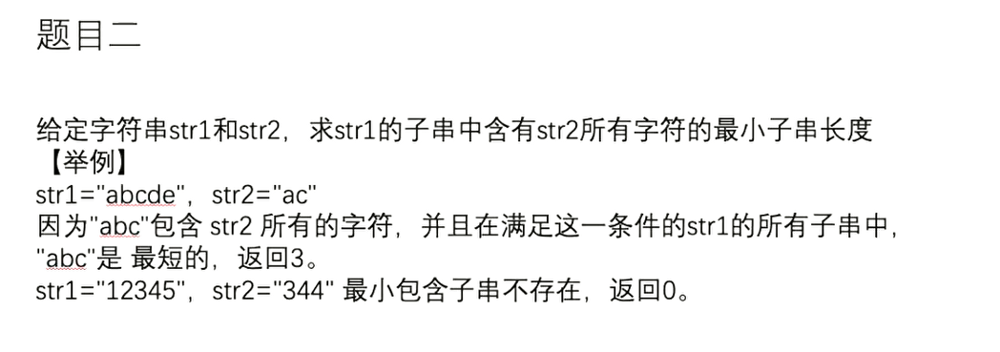

## 图片




## 课时一

```tex

```

```tex

```

#### 题目

---

>
---


```tex

```

```java

```

#### 题目

---

>
---


```tex

```

```java

```


#### 题目

---

>
---


```tex

```

```java

```


#### 题目

---

>
---


```tex

```

```java

```


#### 题目

---

>
---


```tex

```

```java

```


#### 题目

---

>
---


```tex

```

```java

```


#### 题目

---

>
---


```tex

```

```java

```


## 课时二

```tex

```

```tex

```

#### 题目

---

>
---


```tex

```

```java

```

#### 题目

---

>
---


```tex

```

```java

```


#### 题目

---

>
---


```tex

```

```java

```


#### 题目

---

>
---


```tex

```

```java

```


#### 题目

---

>
---


```tex

```

```java

```


#### 题目

---

>
---


```tex

```

```java

```


#### 题目

---

>
---


```tex

```

```java

```


## 课时三

```tex

```

```tex

```

#### 题目

---

>
---


```tex

```

```java

```

#### 题目

---

>
---


```tex

```

```java

```


#### 题目

---

>
---


```tex

```

```java

```


#### 题目

---

>
---


```tex

```

```java

```


#### 题目

---

>
---


```tex

```

```java

```


#### 题目

---

>
---


```tex

```

```java

```


#### 题目

---

>
---


```tex

```

```java

```


## 课时四

```tex

```

```tex

```

#### 题目

---

>
---


```tex

```

```java

```

#### 题目

---

>
---


```tex

```

```java

```


#### 题目

---

>
---


```tex

```

```java

```


#### 题目

---

>
---


```tex

```

```java

```


#### 题目

---

>
---


```tex

```

```java

```


#### 题目

---

>
---


```tex

```

```java

```


#### 题目

---

>
---


```tex

```

```java

```


## 课时五

```tex

```

```tex

```

#### 题目

---

>
---


```tex

```

```java

```

#### 题目

---

>
---


```tex

```

```java

```


#### 题目

---

>
---


```tex

```

```java

```


#### 题目

---

>
---


```tex

```

```java

```


#### 题目

---

>
---


```tex

```

```java

```


#### 题目

---

>
---


```tex

```

```java

```


#### 题目

---

>
---


```tex

```

```java

```


## 课时六

```tex

```

```tex

```

#### 题目

---

>
---


```tex

```

```java

```

#### 题目

---

>
---


```tex

```

```java

```


#### 题目

---

>
---


```tex

```

```java

```


#### 题目

---

>
---


```tex

```

```java

```


#### 题目

---

>
---


```tex

```

```java

```


#### 题目

---

>
---


```tex

```

```java

```


#### 题目

---

>
---


```tex

```

```java

```


## 课时七

```tex

```

```tex

```

#### 题目

---

>
---


```tex

```

```java

```

#### 题目

---

>
---


```tex

```

```java

```


#### 题目

---

>
---


```tex

```

```java

```


#### 题目

---

>
---


```tex

```

```java

```


#### 题目

---

>
---


```tex

```

```java

```


#### 题目

---

>
---


```tex

```

```java

```


#### 题目

---

>
---


```tex

```

```java

```


## 课时八

```tex

```

```tex

```

#### 题目

---

>
---


```tex

```

```java

```

#### 题目

---

>
---


```tex

```

```java

```


#### 题目

---

>
---


```tex

```

```java

```


#### 题目

---

>
---


```tex

```

```java

```


#### 题目

---

>
---


```tex

```

```java

```


#### 题目

---

>
---


```tex

```

```java

```


#### 题目

---

>
---


```tex

```

```java

```
