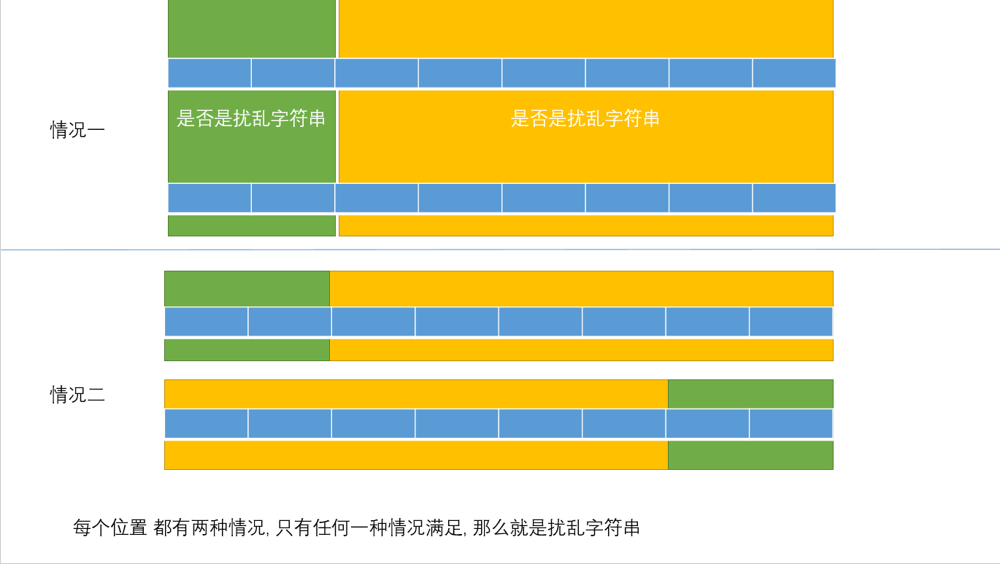
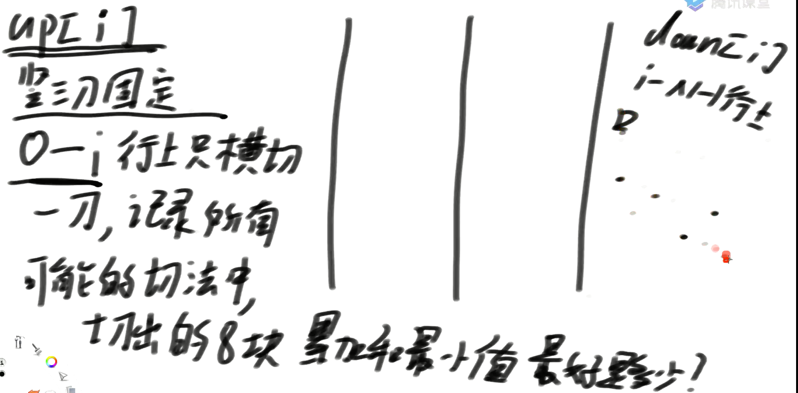
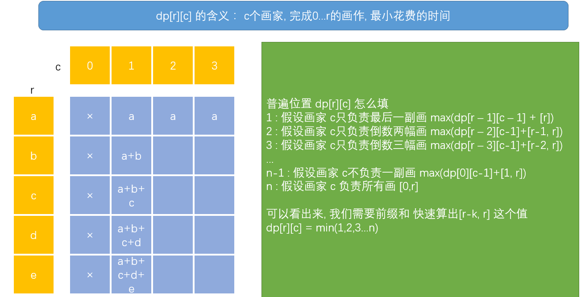
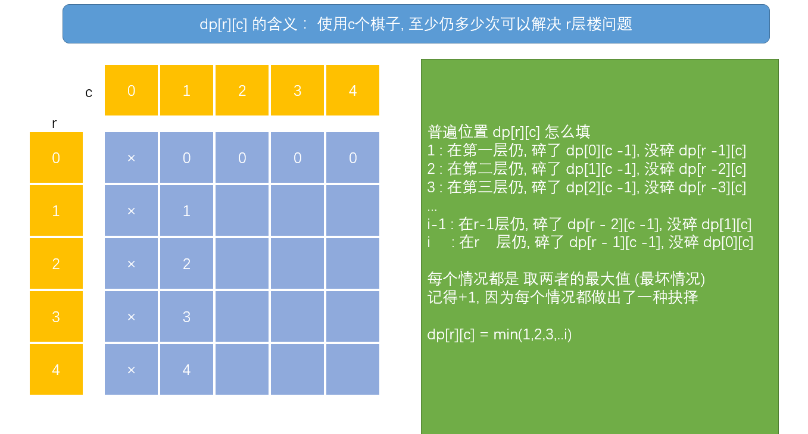
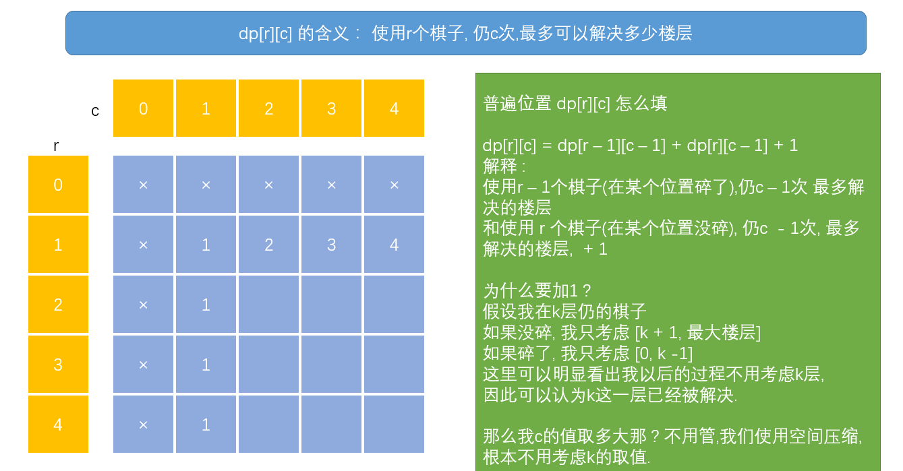
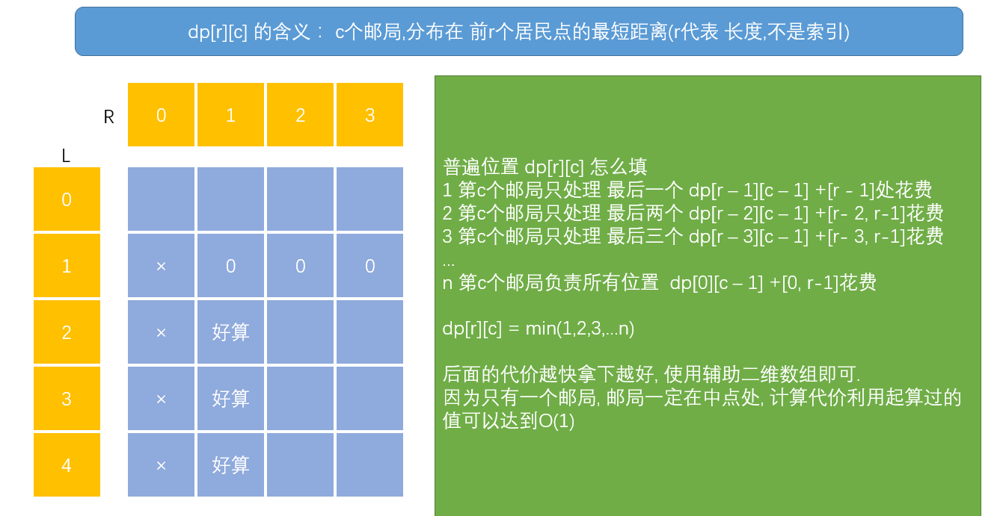
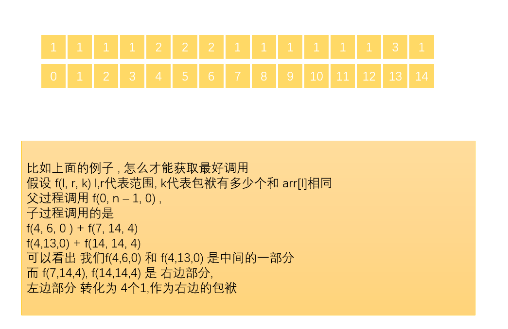
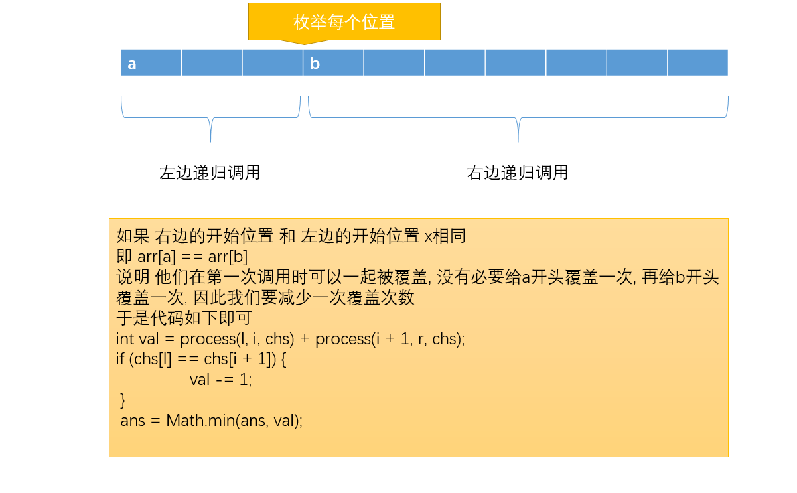
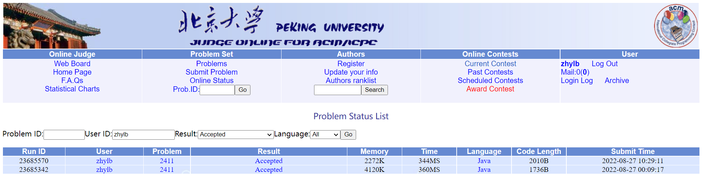

## 图片


## 课时一

```tex
1 什么时候不能使用 行列对应模型
	当我们发现我们守不住开头时, 即结果不一定必须以0开头
	
	
```

```tex

```

#### 题目一 扰乱字符串

---

>使用下面描述的算法可以扰乱字符串 s 得到字符串 t ：
>如果字符串的长度为 1 ，算法停止
>如果字符串的长度 > 1 ，执行下述步骤：
>在一个随机下标处将字符串分割成两个非空的子字符串。即，如果已知字符串 s ，则可以将其分成两个子字符串 x 和 y ，且满足 s = x + y 。
>随机 决定是要「交换两个子字符串」还是要「保持这两个子字符串的顺序不变」。即，在执行这一步骤之后，s 可能是 s = x + y 或者 s = y + x 。
>在 x 和 y 这两个子字符串上继续从步骤 1 开始递归执行此算法。
>给你两个 长度相等 的字符串 s1 和 s2，判断 s2 是否是 s1 的扰乱字符串。如果是，返回 true ；否则，返回 false 。
>
>
>
>来源：力扣（LeetCode）
>链接：https://leetcode.cn/problems/scramble-string
---


```tex
知识点 暴力递归 -> 记忆化搜索 -> 动态规划

记忆化搜索代码和暴力递归差别不大, 只写了暴力递归, 又写了一个三维动态规划

尝试模型 : 范围上的尝试 ! 
虽然一开始可能想的是范围上的尝试,但是会发现我们 扰乱字符串 可能改变开头, 因此,使用不了
```



```java
package com.lihd.part01;

/**
 * Runtime: 9 ms, faster than 93.29% of Java online submissions for Scramble String.
 * Memory Usage: 43.9 MB, less than 82.54% of Java online submissions for Scramble String.
 * @author : 葬花吟留别1851053336@qq.com
 * &#064;description : TODO
 * &#064;date : 2022/8/20 20:11
 */
public class Code01ScrambleString {

    /**
     * 返回两个字符是否是 扰乱字符串
     * 三维动态规划, 已经通过leetcode的测试
     * @param s1 第一个字符串
	 * @param s2 第二个字符串
     * @return boolean
     * @author lihd
     * @date 2022/8/20 21:30
     */
    public static boolean isScramble(String s1, String s2) {
        if (!isScrambleStringCheck(s1, s2)) {
            return false;
        }
        char[] chs1 = s1.toCharArray();
        char[] chs2 = s2.toCharArray();
        int n = chs1.length;
        boolean[][][] dp = new boolean[n][n][n];

        for (int i = 0; i < n; i++) {
            for (int j = 0; j < n; j++) {
                dp[i][i][j] = chs1[i] == chs2[j];
            }
        }
        for (int l1 = n - 2; l1 >= 0; l1--) {
            for (int r1 = l1 + 1; r1 < n; r1++) {
                for (int l2 = n - 2; l2 >= 0; l2--) {
                    //开始填表
                    int r2 = l2 + r1 - l1;
                    if (r2 < l2 || r2 >= n) {
                        continue;
                    }
                    for (int mid = l1; mid < r1; mid++) {
                        if (dp[l1][mid][l2] && dp[mid + 1][r1][mid + 1 + r2 - r1]
                                ||
                            dp[l1][mid][r2 + l1 - mid] && dp[mid + 1][r1][l2]
                        ) {
                            dp[l1][r1][l2] = true;
                            break;
                        }
                    }
                }
            }
        }
        return dp[0][n - 1][0];
    }

    private static boolean isScrambleForce(String s1, String s2) {
        if (!isScrambleStringCheck(s1, s2)) {
            return false;
        }
        char[] chs1 = s1.toCharArray();
        char[] chs2 = s2.toCharArray();
        return isScrambleForce(0, chs1.length - 1, 0, chs1, chs2);
    }

    /**
     * 返回 两个字符串是否是变位词
     * @param l1 第一个字符串开始位置
	 * @param r1 第一个字符串结束位置
	 * @param l2 第二个字符串开始位置
	 * @param chs1 第一个字符串
	 * @param chs2 第二个字符串
     * @return boolean
     * @author lihd
     * @date 2022/8/20 21:28
     */
    private static boolean isScrambleForce(int l1, int r1, int l2, char[] chs1, char[] chs2) {
        if (l1 == r1) {
            //说明范围上只要一个数
            return chs1[l1] == chs2[l2];
        }
        //说明范围上 还有一些数
        int r2 = l2 + r1 - l1;
        for (int mid = l1; mid < r1; mid++) {
            if(
                    isScrambleForce(l1, mid, l2, chs1, chs2)
                    &&
                    isScrambleForce(mid + 1, r1, mid + 1 + r2 - r1 , chs1, chs2)
                    ||
                    isScrambleForce(l1, mid, r2 + l1 - mid, chs1,chs2)
                    &&
                    isScrambleForce(mid + 1, r1, l2, chs1,chs2)
            ){
                return true;
            }
        }
        return false;
    }


    /**
     * 过滤条件
     * @param s1 第一个字符串
	 * @param s2 第二个字符串
     * @return boolean 返回两个是否有可能称为扰乱字符串
     * @author lihd
     * @date 2022/8/20 21:31
     */
    private static boolean isScrambleStringCheck(String s1, String s2) {
        if (s1.length() != s2.length()) {
            return false;
        }
        // 长度相等 , 每个字符个数必须完全相同
        int[] map = new int[26];
        for (int i = 0; i < s1.length(); i++) {
            // s1中的每个字符 设为正
            map[s1.charAt(i) - 'a']++;
            // s2中每个字符 设为符
            map[s2.charAt(i) - 'a']--;
        }
        for (int j : map) {
            if (j != 0) {
                return false;
            }
        }
        return true;
    }

}

```

#### 题目二 最小包含子串

---

>给定字符串str1和str2，求str1的子串中含有str2所有字符的最小子串长度
>【举例】
>str1="abcde", str2="ac"
>因为"abc"包含str2所有的字符，并且在满足这一条件的str1的所有子串中，
>"abc"是 最短的，返回3。
>str1="12345", str2="344" 最小包含子串不存在，返回0。
---


```tex
知识点 : 欠账表 滑动窗口

本题使用一个欠账表即可, 便于我们理解

我们 先找到一个合格的结尾, 然后枚举这个结尾下所有的开头.
只不过不是每次都求答案, 找到最小的那个结果才求答案.
这样我们枚举了所有可能的开头和结尾, 结果必在其中.
```

```java
package com.lihd.part01;

/**
 * @author : 葬花吟留别1851053336@qq.com
 * &#064;description : TODO
 * &#064;date : 2022/8/20 22:14
 */
public class Code02MinWindowLength {

    //返回
    public static int minLen(String s1, String s2) {
        int[] map = new int[26];
        int all = s2.length();
        for (int i = 0; i < s2.length(); i++) {
            map[s2.charAt(i) - 'a']++;
        }
        //开始创建滑动窗口
        int l = 0;
        int r = 0;
        int ans = Integer.MAX_VALUE;
        while (r < s1.length()) {
            map[s1.charAt(r) - 'a']--;
            if (map[s1.charAt(r) - 'a'] >= 0) {
                //说明是有效还款
                all--;
            }
            if (all == 0) {
                //l 可以移动了
                while (map[s1.charAt(l) - 'a'] < 0) {
                    map[s1.charAt(l++) - 'a']++;
                }
                //此时 还没有 map[?] = 1, l来到第一个不满足的位置
                all = 1;
                ans = Math.min(ans, r - l + 1);
                map[s1.charAt(l++) - 'a'] = 1;
            }
            r++;
        }
        return ans == Integer.MAX_VALUE ? -1 : ans;
    }

    public static void main(String[] args) {
        String str1 = "adabbca";
        String str2 = "acb";
        System.out.println(minLen(str1, str2));
    }
}
```


#### 题目三 LFU(难)

---

>一个缓存结构需要实现如下功能
>void set(int key, int value):加入或修改key对应的value
>int get(int key):查询key对应的value值
>但是缓存中最多放K条记录,如果新的第K+1条记录要加入，就需要根据策略删掉一条记录，然后才能把新记录加入。
>这个策略为:
>在缓存结构的K条记录中，哪一个key从进入缓存结构的时刻开始，被调用set或者get的次数最少 就删掉这个key的记录;
>如果调用次数最少的key有多个, 上次调用发生最早的key被删除。
>这就是LFU缓存替换算法。实现这个结构，K作为参数给出。
---


```tex
知识点 二维双向链表 + 堆

时隔多年, 我还是写好了这个算法 
也通过了对数器的验证 

简单来说就是双向链表, 不过里面的细节还真不少 
```

```java
package com.lihd.part01;

import java.util.HashMap;

/**
 * 经过对数器验证了, 应该是没有问题的 是真难啊
 * @author : 葬花吟留别1851053336@qq.com
 * &#064;description : TODO
 * &#064;date : 2022/8/31 17:20
 */
public class Code03LFU {
    private static class Node<K, V> {
        K key;
        V val;
        int times;
        Node<K, V> prev;
        Node<K, V> next;

        public Node(K key, V val) {
            this.key = key;
            this.val = val;
            times = 1;
        }
    }

    private static class NodeList<K, V> {
        // 桶内部的 头 和 尾
        Node<K, V> head;
        Node<K, V> tail;
        // 桶之间的指针
        NodeList<K, V> prev;
        NodeList<K, V> next;

        public NodeList() {

        }
    }

    public static class LFUCache<K, V> {

        int capacity;
        int size;
        NodeList<K, V> head = new NodeList<>();
        HashMap<K, Node<K, V>> nodeMap = new HashMap<>();
        HashMap<Node<K, V>, NodeList<K, V>> bucketMap = new HashMap<>();

        public LFUCache(int capacity) {
            this.capacity = capacity;
        }
        
        /**
         * put方法, 公共的方法 
         * @param key 键
         * @param val 值
         * @author lihd
         * @date 2022/8/31 21:19
         */
        public void put(K key, V val) {
            if (!nodeMap.containsKey(key)) {
                // 说明是添加
                if (size == capacity) {
                    // 满了
                    removeByLFU();
                }
                // 没满
                add(key, val);
            } else {
                // 说明是修改
                update(key, val);
            }
        }
        
        /**
         * 更新操作, 最复杂的方法 
         * @param key 键
	     * @param val 值
         * @author lihd
         * @date 2022/8/31 21:19
         */
        private void update(K key, V val) {
            // 所在的位置
            Node<K, V> node = nodeMap.get(key);
            // 所处的桶
            NodeList<K, V> nodeList = bucketMap.get(node);


            // 提前准备好后面的环境
            NodeList<K, V> nextList = nodeList.next;
            if (nodeList.next == null || nodeList.next.head.times != node.times + 1) {
                // 说明我们需要先把下一个桶 建立出来 并且连接好
                nextList = new NodeList<>();
                nextList.next = nodeList.next;
                if (nodeList.next != null) {
                    nodeList.next.prev = nextList;
                }
                nodeList.next = nextList;
                nextList.prev = nodeList;
            }

            // 对这个桶进行调整
            removeNodeFromBucket(node, nodeList);
            node.val = val;
            node.times++;

            // 连接后面的环境
            // 在nextList 中把node加上就行了
            if (nextList.head == null) {
                // 说明是空桶
                nextList.head = node;
                nextList.tail = node;
            } else {
                // 说明有元素
                node.next = nextList.head;
                nextList.head.prev = node;
                nextList.head = node;
            }
            nodeMap.put(key, node);
            bucketMap.put(node, nextList);
        }
        
        /**
         * 从桶中删除指定的节点, 如果节点只有一个, 就删除桶并且把桶连接好 
         * @param node
	     * @param nodeList
         * @author lihd
         * @date 2022/8/31 21:18
         */
        private void removeNodeFromBucket(Node<K, V> node, NodeList<K, V> nodeList) {
            nodeMap.remove(node.key);
            // 先把 这个元素 从桶中移除
            if (nodeList.head == nodeList.tail) {
                // 说明桶里面只有一个元素, 这个元素,就是我们要删除的元素
                // 因此要把这个桶删除
                nodeList.prev.next = nodeList.next;
                if (nodeList.next != null) {
                    nodeList.next.prev = nodeList.prev;
                }
                bucketMap.remove(node);
            } else {
                // 如果桶中有元素 说明最少两个元素
                // 这个元素 可能是头, 也可能是尾巴, 也可能在中间
                if (node == nodeList.head) {
                    // 说明是头
                    nodeList.head = node.next;
                    nodeList.head.prev = null;
                } else if (node == nodeList.tail) {
                    // 说明是尾
                    nodeList.tail = node.prev;
                    nodeList.tail.next = null;
                } else {
                    // 说明在中间
                    node.next.prev = node.prev;
                    node.prev.next = node.next;
                }

            }
        }

        /**
         * 添加元素的方法 , 只有在这里是添加元素
         * @param key 键
	     * @param val 值
         * @author lihd
         * @date 2022/8/31 21:17
         */
        private void add(K key, V val) {
            size++;
            Node<K, V> node = new Node<>(key, val);
            nodeMap.put(key, node);

            // 看看head桶下面是不是 head.
            if (head.next != null && head.next.head.times == node.times) {
                // 说明有这个桶 先找到这个桶，有桶就有元素
                NodeList<K, V> nodeList = head.next;
                // 把新来的元素添加到一个桶的头部
                node.next = nodeList.head;
                nodeList.head.prev = node;
                nodeList.head = node;

                bucketMap.put(node, nodeList);
            } else {
                // 说明没有 这个桶 由于是新增, 因此一定是第一个桶
                NodeList<K, V> newNodeList = new NodeList<>();
                if (head.next == null) {
                    head.next = newNodeList;
                    newNodeList.prev = head;
                } else {
                    head.next.prev = newNodeList;
                    newNodeList.next = head.next;
                    head.next = newNodeList;
                    newNodeList.prev = head;
                }
                newNodeList.head = node;
                newNodeList.tail = node;

                bucketMap.put(node, newNodeList);

            }
        }
        
        /**
         * 虽然是获取, 但是内部是update, 这是由于LFU置换算法导致的
         * @param key 键
         * @return V 
         * @author lihd
         * @date 2022/8/31 21:16
         */
        public V get(K key) {
            if (!nodeMap.containsKey(key)) {
                return null;
            }
            // 说明真的有
            Node<K, V> node = nodeMap.get(key);
            // 这里调用更新, 只使用更新的副作用 : times ++;
            update(key, node.val);
            return node.val;
        }

        /**
         * 移除使用次数最少的, 使用次数一样少的, 移除最久没有使用的<br/>
         * 简单来说,就是删除第一个桶中的 tail
         *
         * @author lihd
         * @date 2022/8/31 17:26
         */
        private void removeByLFU() {
            // 既然满了, 那么下一个一定存在
            size--;
            NodeList<K, V> needToRemove = head.next;
            Node<K, V> tail = head.next.tail;
            removeNodeFromBucket(tail, head.next);
        }

    }
}
```


#### 题目四 加油站的良好出发点

---

>N个加油站组成一个环给定两个长度都是N的非负数组 Oil和dis(N>1).
>oil[i]代表 第i个加油站存的油可以跑多少千米，dis[i]代表第i个加油站到环中下
>一个加油站相隔 多少千米。假设你有一辆油箱足够大的车，初始时车里没有油。
>如果车从第i个加油站出发，最终可以回到这个加油站，那么第i个加油站就算良好出发点，否则就不算。请返回长度为N的boolean型数组res, res[]代
>表第i个加油站是不是良好出发点。
---


```tex

简单解 简单的就写出来了, 复杂写估计很难!!!

```

```java

```


## 课时二

```tex
1 二叉树递归满足条件
	不能越级, 我只考虑我直接子节点 和 直接父节点
	即, 我只考虑我两个子节点, 并且把信息封装好给父节点, 如何我们做不到这样的处理, 就无法使用树形dp

```

```tex

```

#### 题目一 城市距离问题

---

>合定一个路佺数组paths. 表示一张冬。paths [i ]== j 代表城市i连向城市 j. 如果paths [i] = =i, 则
>表示i城市是首都， 一张图里只会有一个首都且图中除首都指向自己之外不会有坏。
>例如, paths=[9,1,4,9,0,4,8,9,0,1]
>由数组表示可以知城市1是首都 所以距离为0. 离首都距离为1的城市只有城市9
>离首都距离为２的城市有城市0、3 和 7  离首都距离为3的城市有城市4和8, 离首都 距离为 4
>的城市有城市2、5 和 6。所以距离为0的城市有1座，距离为1的城市有 1座，距离 为 2 的城
>市有3座，距离为3的城市有2座，距离为4的城市有
>3 座。那么统计数组为nums=[1,1,3,2.3,0,0.0,0,0], nums[i]==j 代表距离为：距离为i 的城市有j座。要求实
>现一个void 类型的承 输入一个路径数组 Daths. 吉接在原数组上调整 nums数组
>即paths=[9,1,4,9,0,4,8,9,0,1]经过这个函数处理后变成[1,1,3,2,3,0,0,0,0,0]。
>【要求】
>如果paths长度为N，请达到时间复杂度为 O(N)，额外空间复杂度为 O(1)。
---


```tex

```

```java

```

#### 题目二 给小孩分糖果

---

>一群孩子做游戏，现在请你根据游戏得分来发糖果，要求如下:
>1.每个孩子不管得分多少，起码分到1个糖果。
>2.任意两个相邻的孩子之间，得分较多的孩子必须拿多一些的糖果。
>给定一个数组 arr代表得分数组，请返回最少需要多少糖果。例如:arr=[1,2,2]，糖果分配为[1,2,1]，
>即可满足要求且数量最少，所以返回 4。
>【进阶】
>原题目中的两个规则不变，再加一条规则: 3.任意两个相邻的孩子之间如果得分一样，糖果数必须相同。
>给定一个数组 arr 代表得分数组, 返回最少需要多少糖果。例如:arr=[1,2,2]，糖果分配为
>[1,2,2]，即可满足要求且数量最少，所以返回 5。
>【要求】
>arr长度为N，原题与进阶题都要求时间复杂度为 O(N), 额外空间复杂度为 O(1)。
---


```tex
知识点 贪心算法

使用辅助数组 , 从左到右遍历一边, 在从右到左遍历一边即可, 比较简单

然后取两者的最大值即可

关键在于 怎么使用有限个遍历得到, 即怎么使用O(1) 的空间 


用O(1) 空间的关键是上下坡 

进阶问题还没有写, 不过应该差不多 
```

```java
package com.lihd.part02;

/**
 * @author : 葬花吟留别1851053336@qq.com
 * &#064;description : TODO
 * &#064;date : 2022/8/24 16:01
 */
public class Code02Candy {

    /**
     * 5 ms, faster than 51.78%
     * 51.8 MB, less than 51.02%
     * 怎么使用有限空间做到 ?
     * @param ratings 小孩数组
     * @return int
     * @author lihd
     * @date 2022/8/24 16:08
     */
    public static int candy1(int[] ratings) {
        int n = ratings.length;
        int[] prev = new int[n];
        int[] last = new int[n];

        prev[0] = 1;
        for (int i = 1; i < n; i++) {
            prev[i] = ratings[i] > ratings[i - 1] ? prev[i - 1] + 1 : 1;
        }

        last[n - 1] = 1;
        for (int i = n - 2; i >= 0; i--) {
            last[i] = ratings[i] > ratings[i + 1] ? last[i + 1] + 1 : 1;
        }

        int ans = 0;
        for (int i = 0; i < n; i++) {
            ans += Math.max(prev[i], last[i]);
        }
        return ans;
    }

    /**
     * 3 ms, faster than 89.25%
     * 51.3 MB, less than 77.27%
     * @param ratings 小孩数组
     * @return int
     * @author lihd
     * @date 2022/8/31 21:22
     */

    public static int candy(int[] ratings) {
        int index = 0;
        int lbase = 1;
        int candy = 0;
        // 先处理第一个下坡
        index = findNextMin(index, ratings);
        // 获取第一个下坡的糖果数量, 并且index 向后移动了一位
        candy += getCandies(0, index ++);
        while (index < ratings.length) {
            if (ratings[index] > ratings[index - 1]) {
                // 说明是上坡
                candy += ++lbase;
                index ++;
            } else if (ratings[index] < ratings[index - 1]) {
                // 说明迎来了一个下坡
                int before = index - 1;
                // index 来到 最低点的位置
                index = findNextMin(index, ratings);
                candy += getCandies(before, index);
                int rightAdd = (index - before + 1);
                int leftAdd = lbase;
                candy -= Math.min(rightAdd, leftAdd);
                lbase = 1;
                index ++;
            } else {
                // 说明两者相等
                lbase = 0;
                candy += ++lbase;
                index ++;
            }

        }
        return candy;
    }

    private static int findNextMin(int index, int[] ratings) {
        for (int i = index; i < ratings.length - 1; i++) {
            if (ratings[i] <= ratings[i + 1]) {
                return i;
            }
        }
        return ratings.length - 1;
    }


    private static int getCandies(int begin, int end) {
        int n = end - begin + 1;
        return (n + 1) * n / 2;
    }

    public static void main(String[] args) {
        int[] arr = {1, 2, 1, 8, 6, 3, 5, 8,6,7,8,2,3,4};
        System.out.println(candy(arr));
        System.out.println(candy1(arr));

        System.out.println(findNextMin(3, arr));
    }
}

```


#### 题目三 二叉树的相机

---

>给定一个二叉树，我们在树的节点上安装摄像头。
>
>节点上的每个摄影头都可以监视**其父对象、自身及其直接子对象。**
>
>计算监控树的所有节点所需的最小摄像头数量。
>
>https://leetcode.cn/problems/binary-tree-cameras/
---


```tex
知识点 树形dp, 贪心

说真的, 这个题目使用贪心或许更容易理解
二叉树的递归套路就不写了


说明三种状态, 1 放相机, 2 被照亮, 3未被照亮

如果 node == null 说明是被照亮 返回被照亮

如果 node.left == 未被照亮 || node.right == 未被照亮
	说明两个孩子中至少有一个没有被照亮, 为了保证上层调用我的时候正确, 我必须放相机 返回 放相机

如果 node.left == 放相机 || node.right == 放相机
	能来到这一步说明两个孩子都被照亮了, 现在看看有没有放相机, 如果有孩子放了相机, 我就不用放 返回 被照亮
	

来到这里说明两个孩子都被照亮, 且都没放相机, 我返回未被照亮, 让我的父亲决定去放相机


下面第一个代码是 树形dp, 第二个代码是 贪心

```

```java
package com.lihd.part02;

/**
 * @author : 葬花吟留别1851053336@qq.com
 * &#064;description : TODO
 * &#064;date : 2022/8/24 12:36
 */
public class Code03BinaryTreeCameras {


    public static int minCameraCover(TreeNode root) {
        Info info = getInfo(root);
        return (int) Math.min(1 + info.uncovered, Math.min(info.covered, info.withCamera));
    }


    private static Info getInfo(TreeNode node) {
        if (node == null) {
            return new Info(Integer.MAX_VALUE, 0, Integer.MAX_VALUE);
        }
        Info leftInfo = getInfo(node.left);
        Info rightInfo = getInfo(node.right);
        // 按照道理不可能越界
        long uncovered = leftInfo.covered + rightInfo.covered;
        // 就算溢出 最大Integer.maxValue
        long covered = Math.min(leftInfo.withCamera + rightInfo.withCamera, Math.min(
                leftInfo.withCamera + rightInfo.covered,
                leftInfo.covered + rightInfo.withCamera
        ));
        long withCamera =1 + Math.min(leftInfo.uncovered, Math.min(leftInfo.covered, leftInfo.withCamera)) +
                Math.min(rightInfo.uncovered, Math.min(rightInfo.covered, rightInfo.withCamera));
        return new Info( uncovered,  covered,  withCamera);
    }

    private static class Info{
        // 没有被覆盖
        long uncovered;
        // 被覆盖 但是没有相机
        long covered;
        // 放置了相机
        long withCamera;

        public Info(long uncovered, long covered, long withCamera) {
            this.uncovered = uncovered;
            this.covered = covered;
            this.withCamera = withCamera;
        }
    }


    // 下面的类不用粘过去, 只是为了本地编写不报错
    private static class TreeNode {
        int val;
        TreeNode left;
        TreeNode right;
        TreeNode() {
        }
        TreeNode(int val) {
            this.val = val;
        }
        TreeNode(int val, TreeNode left, TreeNode right) {
            this.val = val;
            this.left = left;
            this.right = right;
        }
    }

}

```

```java
package com.lihd.part02;

/**
 * 这个类 只是为了和 code03 那个分开, 写到一个里面难受
 *
 * @author : 葬花吟留别1851053336@qq.com
 * &#064;description : TODO
 * &#064;date : 2022/8/24 13:13
 */
public class Leetcode968BinaryTreeCameras {
    /**
     * 1 ms, faster than 81.96%
     * 44.8 MB, less than 5.04%
     * @param root 二叉树的根节点
     * @return int
     * @author lihd
     * @date 2022/8/24 13:25
     */
    public static int minCameraCover(TreeNode root) {
        Info info = getInfo(root);
        if (info.status == Status.UNCOVERED) {
            return info.num + 1;
        }
        return info.num;
    }


    public static Info getInfo(TreeNode node){
        if (node == null) {
            return new Info(Status.COVERED, 0);
        }
        Info leftInfo = getInfo(node.left);
        Info rightInfo = getInfo(node.right);
        // 任何一个孩子没有被覆盖
        // 我们必须在这个地方放相机, 否则不能保证其孩子都是被覆盖的状态
        if (leftInfo.status == Status.UNCOVERED || rightInfo.status == Status.UNCOVERED) {
            return new Info(Status.WITH_CAMERA, leftInfo.num + rightInfo.num + 1);
        }
        // 在每个孩子被覆盖的情况下, 讨论是否有相机
        // 如果有任何一个孩子上放了相机, 当前节点就会被覆盖, 没有必要放相机
        if (leftInfo.status == Status.WITH_CAMERA || rightInfo.status == Status.WITH_CAMERA) {
            return new Info(Status.COVERED, leftInfo.num + rightInfo.num);
        }
        // 最后是每个孩子都被覆盖, 但是都 没有相机
        // 这仍不用放相机, 交给父节点抉择才能获取最优解, 只不过当前节点是未覆盖的状态.
        return new Info(Status.UNCOVERED, leftInfo.num + rightInfo.num);
    }

    private static class Info {
        Status status;
        int num;
        public Info(Status status, int num) {
            this.status = status;
            this.num = num;
        }
    }

    private static enum Status{
        UNCOVERED, COVERED, WITH_CAMERA;
    }

    // 下面的类不用粘过去, 只是为了本地编写不报错
    private static class TreeNode {
        int val;
        TreeNode left;
        TreeNode right;

        TreeNode() {
        }

        TreeNode(int val) {
            this.val = val;
        }

        TreeNode(int val, TreeNode left, TreeNode right) {
            this.val = val;
            this.left = left;
            this.right = right;
        }
    }
}

```


#### 题目四 三个子数组的最大和

---

>给定一个数组arr，给定一个正数k。选出3个不重叠的子数组，每个子数组长度都是k, 返回最大的三个子数组的最大和。
---


```tex
知识点 dp, 枚举中间位置


前面用dp加速, 后面用另一个 dp加速, 枚举中间位置即可

和下面的牛牛分田地有异曲同工之妙

```

```java
package com.lihd.part02;

import java.time.Period;
import java.util.Arrays;

/**
 * @author : 葬花吟留别1851053336@qq.com
 * &#064;description : TODO
 * &#064;date : 2022/8/24 13:30
 */
public class Code04MaximumSumOf3NonOverlappingSubArrays {
    /**
     * 7 ms, faster than 41.09%
     * 54.6 MB, less than 70.79%
     * @param nums 原数组
	 * @param k 3 子数组的长度
     * @return int[] 三个子数组的开始位置 因此长度固定是3
     * @author lihd
     * @date 2022/8/24 15:54
     */
    public static int[] maxSumOfThreeSubarrays(int[] nums, int k) {
        int n = nums.length;
        int[] leftIndex = new int[n];
        int[] rightIndex = new int[n];
        int[] preSum = new int[n + 1];
        for (int i = 1; i < n + 1; i++) {
            // preSum 计算方式比较奇怪 如果要求 [l,R]上的累加和 -> preSum[R + 1] - preSum[L]
            // 这样的好处是不用判断越界 因此要多申请一个空间
            preSum[i] += preSum[i - 1] + nums[i - 1];
        }

        leftIndex[k - 1] = 0;
        for (int i = k; i < n; i++) {
            leftIndex[i] = i - k + 1;
            if (startKLenSum(leftIndex[i], k, preSum) <= startKLenSum(leftIndex[i - 1], k, preSum)) {
                leftIndex[i] = leftIndex[i - 1];
            }
        }

        rightIndex[n - k] = n - k;
        for (int i = n - k - 1; i >= 0; i--) {
            rightIndex[i] = i;
            if (startKLenSum(rightIndex[i], k, preSum) < startKLenSum(rightIndex[i + 1], k, preSum)) {
                rightIndex[i] = rightIndex[i + 1];
            }
        }

        int max = 0;
        int[] ans = new int[3];
        for (int i = k; i <= n - 2 * k; i++) {
            int val = startKLenSum(leftIndex[i - 1], k, preSum) + startKLenSum(rightIndex[i + k], k, preSum) + startKLenSum(i, k, preSum);
            if (val > max) {
                max = val;
                ans[0] = leftIndex[i - 1];
                ans[1] = i;
                ans[2] = rightIndex[i + k];
            }
        }
        return ans;
    }

    private static int startKLenSum(int startIndex, int k, int[] preSum) {
        return preSum[startIndex + k] - preSum[startIndex];
    }


    public static int maxSumOf3Array(int[] arr, int k) {
        // 假设参数合理
        int n = arr.length;
        int[] preSum = new int[n + 1];
        for (int i = 1; i < n + 1; i++) {
            // preSum 计算方式比较奇怪 如果要求 [l,R]上的累加和 -> preSum[R + 1] - preSum[L]
            // 这样的好处是不用判断越界 因此要多申请一个空间
            preSum[i] += preSum[i - 1] + arr[i - 1];
        }
        int[] leftDp = new int[n];
        int[] rightDp = new int[n];
        // leftDp[k - 1] 代表0...k - 1的累加和 刚好k个值
        leftDp[k - 1] = preSum[k] - preSum[0];
        for (int i = k; i < n; i++) {
            // 长度是 k, 结束位置是 i, 因此累加和的最后索引是 i + 1
            // 于是开始位置索引是 i + 1 - k , preSum[i + 1] - preSum[i + 1 - k]
            leftDp[i] = Math.max(leftDp[i - 1], preSum[i + 1] - preSum[i + 1 - k]);
        }
        rightDp[n - k] = preSum[n] - preSum[n - k];
        for (int i = n - k - 1; i >= 0; i--) {
            // 开始位置是i ,求 i开始向右k个值的累加和 preSum[i + k] - preSum[i]
            rightDp[i] = Math.max(rightDp[i + 1], preSum[i + k] - preSum[i]);
        }
        int ans = 0;
        for (int i = k; i <= n - 2 * k; i++) {
            //枚举所有的合理位置
            int val = preSum[i + k] - preSum[i];
            ans = Math.max(ans, val + leftDp[i - 1] + rightDp[i + k]);
        }
        return ans;

    }

    public static void main(String[] args) {
        int[] nums = {1, 2, 1, 2, 1, 2, 1, 2, 1};
        int k = 2;
        int maxSumOf3Array = maxSumOf3Array(nums, k);
        System.out.println("maxSumOf3Array = " + maxSumOf3Array);
        System.out.println(Arrays.toString(maxSumOfThreeSubarrays(nums, k)));
    }

}

```


## 课时三

```tex
今天似乎是 动态规划优化技巧 四边形不等式的开始


这玩意

问题一 : 在一个正数数组中,枚举每个切分的位置, 可以将数组切为两份, 要求每份至少一个. 
每次切分后 左边有一个累加和 , 右边也有一个累加和. 他们的最大值称为 该切分下的一个切分值, 问最小切分值是多大?
进阶问题 返回和原数组等长的数组ans, ans[i] 代表在 0..i这个范围下 的最小切分值, 请返回这个数组,要求时间复杂度O(N)

```

```tex


四边形不等式的四个条件
1 存在枚举行为(不存在也没什么优化空间了)
2 dp[i][j] 中固定一个值, 另一个值变化和结果变化是单调的, i对结果的单调性和j对结果的单调性 往往相反
3 区间划分问题(或者类似于区间划分)
4 dp[i][j] 的值不同时依赖本行和本列的值


四边形不等式
如果存在一个可以用四边形不等式优化的题目, 那么这个被四边形优化后的解 七成情况下 不是最优解!
为什么: 
	首先四边形不等式 第二个要求就是 存在模糊的单调性, 我们对于不同的问题, 采用基本相同的做法.使得复杂度降低了一阶
	这证明了四边形不等式可以优化的题 一定是存在单调性的, 并且我们可以使用类似的方式处理这个单调性
	但是 通用解很有可能不是最优解, 如果我们能找到 更完美利用单调性的解, 这个解一定更优.
	也就是说, 如果我们发现一个题目可以用四边形不等式优化, 那么我们可以寻求一下其他可能性,
	或许可以找到最优解, 或许最优解就是四边形不等式. 总之 ,值得一试.
	一般情况下, 可以用四边形不等式优化的, 70%拥有属于自己(属于某一类) 的最优解 30%就是最优解
	


```

#### 题目一 分田地

---

>链接：https://www.nowcoder.com/questionTerminal/fe30a13b5fb84b339cb6cb3f70dca699
>来源：牛客网
>
>
>
>牛牛和 15 个朋友来玩打土豪分田地的游戏，牛牛决定让你来分田地，地主的田地可以看成是一个矩形，每个位置有一个价值。分割田地的方法是横竖各切三刀，分成 16 份，作为领导干部，牛牛总是会选择其中总价值最小的一份田地，  作为牛牛最好的朋友，你希望牛牛取得的田地的价值和尽可能大，你知道这个值最大可以是多少吗？                                        
>
>
>
>##### **输入描述:**
>
>```
>每个输入包含 1 个测试用例。每个测试用例的第一行包含两个整数 n 和 m（1 <= n, m <= 75），表示田地的大小，接下来的 n 行，每行包含 m 个 0-9 之间的数字，表示每块位置的价值。
>```
>
>##### **输出描述:**
>
>```
>输出一行表示牛牛所能取得的最大的价值。
>```
>
>示例1
>
>## 输入
>
>```
>4 4
>3332
>3233
>3332
>2323
>```
>
>## 输出
>
>```
>2
>```
---


```tex
大题思路

竖着的三刀暴力枚举 

横着的第一刀正着 生成dps,
横着的第三刀倒着 生成dpn,

然后枚举中间一刀, 期间所有 的 前缀和 使用矩阵的前缀和矩阵实现 

```




```java
package com.lihd.part03;


import java.util.Scanner;

/**
 * <a href="https://www.nowcoder.com/questionTerminal/fe30a13b5fb84b339cb6cb3f70dca699?answerType=1&f=discussion">牛客链接</a>
 * 通过全部用例 运行时间 1819ms 占用内存 105840KB
 * @author : 葬花吟留别1851053336@qq.com
 * &#064;description : TODO
 * &#064;date : 2022/8/24 18:58
 */
public class Code01NiuNiuSplitField {


    public static int maxMinSumIn16(int[][] m) {
        int R = m.length;
        int C = m[0].length;
        int[][] preSumArr = getPreSumArr(m);
        int ans = 0;
        for (int i = 0; i < C - 3; i++) {
            for (int j = i + 1; j < C - 2; j++) {
                for (int k = j + 1; k < C - 1; k++) {
                    int val = getMaxMinInOneCase(preSumArr, i, j, k);
                    ans = Math.max(val, ans);
                }
            }
        }
        return ans;
    }

    private static int getMaxMinInOneCase(int[][] preSum, int c1, int c2, int c3) {
        int[] up = generateUpDp(preSum, c1, c2, c3);
        int[] down = generateDownDp(preSum, c1, c2, c3);
        int n = preSum.length;
        int ans = 0;
        for (int i = 1; i <= n - 3; i++) {
            // i 是中间一刀
            int val = Math.min(up[i], down[i + 1]);
            ans = Math.max(val, ans);
        }
        return ans;
    }

    private static int[] generateDownDp(int[][] preSum, int c1, int c2, int c3) {
        int n = preSum.length;
        int[] dp = new int[preSum.length];
        int best = n - 2;
        dp[n - 2] = getTwoRowSumMin(n - 2, best, n - 1, c1, c2, c3, preSum);
        for (int i = n - 3; i >= 0; i--) {
            dp[i] = getTwoRowSumMin(i, best, n - 1, c1, c2, c3, preSum);
            int val;
            while (best - 1 > i && dp[i] <= (val = getTwoRowSumMin(i, best - 1, n - 1, c1, c2, c3, preSum))) {
                best --;
                dp[i] = val;
            }
        }
        return dp;
    }

    private static int[] generateUpDp(int[][] preSum, int c1, int c2, int c3) {
        int[] dp = new int[preSum.length];
        int best = 0;
        dp[1] = getTwoRowSumMin(0, best, 1, c1, c2, c3, preSum);
        for (int i = 2; i < preSum.length; i++) {
            dp[i] = getTwoRowSumMin(0, best, i, c1, c2, c3, preSum);
            int val;
            while (best + 1 < i && dp[i] <= (val = getTwoRowSumMin(0, best + 1, i, c1, c2, c3, preSum))) {
                best ++;
                dp[i] = val;
            }
        }
        return dp;
    }

    private static int getTwoRowSumMin(int rb, int rm, int re, int c1, int c2, int c3, int[][] preSum) {
        return Math.min(getRowFourSumMin(rb, rm, c1, c2, c3, preSum), getRowFourSumMin(rm + 1, re, c1, c2, c3, preSum));
    }

    private static int getRowFourSumMin(int rb, int re, int c1, int c2, int c3, int[][] preSum) {
        int a = getRangeSum(rb, 0, re, c1, preSum);
        int b = getRangeSum(rb, c1 + 1, re, c2, preSum);
        int c = getRangeSum(rb, c2 + 1, re, c3, preSum);
        int d = getRangeSum(rb, c3 + 1, re, preSum[0].length - 1, preSum);
        return Math.min(Math.min(a, b), Math.min(c, d));
    }


    private static int getRangeSum(int r1, int c1, int r2, int c2, int[][] preSum) {
        if (r1 == 0 && c1 == 0) {
            return preSum[r2][c2];
        }
        if (r1 == 0) {
            return preSum[r2][c2] - preSum[r2][c1 - 1];
        }
        if (c1 == 0) {
            return preSum[r2][c2] - preSum[r1 - 1][c2];
        }
        return preSum[r2][c2] + preSum[r1 - 1][c1 - 1] - preSum[r2][c1 - 1] - preSum[r1 - 1][c2];
    }

    private static int[][] getPreSumArr(int[][] m) {
        int R = m.length;
        int C = m[0].length;
        int[][] ans = new int[R][C];
        ans[0][0] = m[0][0];
        for (int i = 1; i < C; i++) {
            ans[0][i] = m[0][i] + ans[0][i - 1];
        }
        for (int i = 1; i < R; i++) {
            ans[i][0] = m[i][0] + ans[i - 1][0];
        }
        //初始化完成
        for (int i = 1; i < R; i++) {
            for (int j = 1; j < C; j++) {
                ans[i][j] = m[i][j] + ans[i][j - 1] + ans[i - 1][j] - ans[i - 1][j - 1];
            }
        }
        return ans;
    }
    //        int[][] m = {{3, 3, 3, 2},
    //                {3, 2, 3, 3},
    //                {3, 3, 3, 2},
    //                {2, 3, 2, 3},};
    //        int maxMinSumIn16 = maxMinSumIn16(m);
    //        System.out.println("maxMinSumIn16 = " + maxMinSumIn16);


    public static void main(String[] args) {

        Scanner sc = new Scanner(System.in);
        int n = sc.nextInt();
        int m = sc.nextInt();
        int[][] map = new int[n][m];
        for (int i = 0; i < n; i++) {
            char[] chs = sc.next().toCharArray();
            for (int j = 0; j < m; j++) {
                map[i][j] = chs[j] - '0';
            }
        }
        int minSumIn16 = maxMinSumIn16(map);
        System.out.println(minSumIn16);
    }


}

```

#### 题目二 打砖块

---

>有一个 m x n 的二元网格 grid ，其中 1 表示砖块，0 表示空白。砖块 稳定（不会掉落）的前提是：
>
>一块砖直接连接到网格的顶部，或者
>至少有一块相邻（4 个方向之一）砖块 稳定 不会掉落时
>给你一个数组 hits ，这是需要依次消除砖块的位置。每当消除 hits[i] = (rowi, coli) 位置上的砖块时，对应位置的砖块（若存在）会消失，然后其他的砖块可能因为这一消除操作而 掉落 。一旦砖块掉落，它会 立即 从网格 grid 中消失（即，它不会落在其他稳定的砖块上）。
>
>返回一个数组 result ，其中 result[i] 表示第 i 次消除操作对应掉落的砖块数目。
>
>注意，消除可能指向是没有砖块的空白位置，如果发生这种情况，则没有砖块掉落。
>
>
>
>示例 1：
>
>输入：grid = [[1,0,0,0],[1,1,1,0]], hits = [[1,0]]
>输出：[2]
>解释：网格开始为：
>[[1,0,0,0]，
> [1,1,1,0]]
>消除 (1,0) 处加粗的砖块，得到网格：
>[[1,0,0,0]
> [0,1,1,0]]
>两个加粗的砖不再稳定，因为它们不再与顶部相连，也不再与另一个稳定的砖相邻，因此它们将掉落。得到网格：
>[[1,0,0,0],
> [0,0,0,0]]
>因此，结果为 [2] 。
>
>来源：力扣（LeetCode）
>链接：https://leetcode.cn/problems/bricks-falling-when-hit
>著作权归领扣网络所有。商业转载请联系官方授权，非商业转载请注明出处。
---


```tex


并查集

先把 子弹打中的位置变成2, 然后使用并查集, 逆序恢复被子弹打中的二 , 如果发现, 恢复前和恢复后相差的结果超过1, 把差值 - 1加上(被打中的位置不算)

然后把每个位置恢复完成之后即可, 
算法要使用有特殊方法的并查集 


```

```java
package com.lihd.part03;

import java.util.Arrays;
import java.util.HashMap;
import java.util.HashSet;
import java.util.Stack;

/**
 * <a href="https://leetcode.com/problems/bricks-falling-when-hit/submissions/">leetcode链接</a>
 * @author : 葬花吟留别1851053336@qq.com
 * &#064;description : TODO
 * &#064;date : 2022/8/24 21:25
 */
public class Code02BricksFallingWhenHit {

    /**
     *
     * <a href="https://leetcode.com/problems/bricks-falling-when-hit/submissions/">leetcode链接</a>
     * 175 ms, faster than 7.41%
     * 53.1 MB, less than 99.66%
     * @param grid
     * @param hits
     * @return int[]
     * @author lihd
     * @date 2022/8/24 22:39
     */
    public static int[] hitBricks(int[][] grid, int[][] hits) {
        // 首先 被炮击的位置改成 2
        for (int[] hit : hits) {
            if (grid[hit[0]][hit[1]] == 1) {
                grid[hit[0]][hit[1]] = 2;
            }
        }
        UnionFind unionFind = new UnionFind(grid);
        int[] ans = new int[hits.length];
        for (int i = hits.length - 1;  i >= 0; i--) {
            if (grid[hits[i][0]][hits[i][1]] == 2) {
                ans[i] = unionFind.calc(hits[i][0], hits[i][1]);
            }
        }
        return ans;
    }


    private static class UnionFind{


        private int[][] grid;
        private Dot[][] dots;
        int ceilingOne;
        int R;
        int C;
        HashSet<Dot> ceilingSet = new HashSet<>();
        HashMap<Dot, Dot> fatherMap = new HashMap<>();
        HashMap<Dot, Integer> sizeMap = new HashMap<>();

        public UnionFind(int[][] grid) {
            init(grid);
            connect();
        }

        private void init(int[][] grid) {
            this.grid = grid;
            R = grid.length;
            C = grid[0].length;
            dots = new Dot[R][C];
            ceilingOne = 0;
            for (int i = 0; i < R; i++) {
                for (int j = 0; j < C; j++) {
                    if (grid[i][j] == 1) {
                        dots[i][j] = new Dot();
                        fatherMap.put(dots[i][j], dots[i][j]);
                        sizeMap.put(dots[i][j], 1);
                        if (i == 0) {
                            ceilingSet.add(dots[i][j]);
                            ceilingOne++;
                        }
                    }
                }
            }
        }

        private void connect() {
            for (int i = 0; i < R; i++) {
                for (int j = 0; j < C; j++) {
                    union(i,j, i + 1, j);
                    union(i,j, i - 1, j);
                    union(i,j, i, j + 1);
                    union(i,j, i, j - 1);
                }
            }
        }

        private Dot findFather(int r1, int c1) {
            Dot dot = dots[r1][c1];

            Stack<Dot> stack = new Stack<>();
            while (dot != fatherMap.get(dot)) {
                stack.push(dot);
                dot = fatherMap.get(dot);
            }
            // 现在dot就是父节点
            while (!stack.isEmpty()) {
                fatherMap.put(stack.pop(), dot);
            }
            return dot;
        }

        public int calc(int r, int c) {
            int beforeCeilingOne = ceilingOne;
            grid[r][c] = 1;
            dots[r][c] = new Dot();
            sizeMap.put(dots[r][c], 1);
            fatherMap.put(dots[r][c], dots[r][c]);
            if (r == 0) {
                ceilingSet.add(dots[r][c]);
                ceilingOne++;
            }
            union(r,c, r + 1, c);
            union(r,c, r - 1, c);
            union(r,c, r, c + 1);
            union(r,c, r, c - 1);

            int afterCeilingOne = ceilingOne;
            return afterCeilingOne == beforeCeilingOne ? 0 : afterCeilingOne - beforeCeilingOne - 1;
        }

        public void union(int r1, int c1, int r2, int c2) {
            if (!isValid(r1, c1) || !isValid(r2, c2)) {
                return;
            }
            // 全部有效
            Dot father1 = findFather(r1, c1);
            Dot father2 = findFather(r2, c2);
            if (father1 == father2) {
                return;
            }
            int size1 = sizeMap.get(father1);
            int size2 = sizeMap.get(father2);
            Dot large = size1 >= size2 ? father1 : father2;
            Dot small = father1 == large ? father2 : father1;
            boolean status1 = ceilingSet.contains(father1);
            boolean status2 = ceilingSet.contains(father2);
            fatherMap.put(small, large);
            sizeMap.put(large, size1 + size2);
            sizeMap.remove(small);

            if (status1 ^ status2) {
                ceilingOne += status1 ? size2 : size1;

                ceilingSet.add(large);
                ceilingSet.remove(small);
            }


        }
        private boolean isValid(int r, int c) {
            return r >= 0 && r < R && c >= 0 && c< C && grid[r][c] == 1;
        }
        private static class Dot{}
    }

    public static void main(String[] args) {
        int[][] grid = {{1, 0, 1}, {1, 1, 1}};
        int[][] hits = {{0, 0}, {0, 2}, {1, 1}};
        int[] ans = hitBricks(grid, hits);
        System.out.println(Arrays.toString(ans));
    }


}

```


#### 题目三 最高的广告牌

---

>你正在安装一个广告牌，并希望它高度最大。这块广告牌将有两个钢制支架，两边各一个。每个钢支架的高度必须相等。
>
>你有一堆可以焊接在一起的钢筋 rods。举个例子，如果钢筋的长度为 1、2 和 3，则可以将它们焊接在一起形成长度为 6 的支架。
>
>返回 广告牌的最大可能安装高度 。如果没法安装广告牌，请返回 0 。
>
> 
>
>示例 1：
>
>输入：[1,2,3,6]
>输出：6
>解释：我们有两个不相交的子集 {1,2,3} 和 {6}，它们具有相同的和 sum = 6。
>
>来源：力扣（LeetCode）
>链接：https://leetcode.cn/problems/tallest-billboard
---


```tex
使用一个map即可 

key记录 差值, val 记录差值中较小的那个, 这样key + value就能获取较大的那个,

每新来一个木棍, 就考虑让差值缩小还是增大, 这样可以获取两条记录, 然后 只有差值相同且val变大的才更新到map中, 为了方便更新, 要使用两个map

差值相同 , 只放val更大的意思是, 即使我们都存在差值, 但是我放的木棍总体来说更高, 如果以后我发现了一个高度可以让我的差值为 0 , 我的结果会更好.

保存每个差值的含义是, 每个差值经过后面的数据总有可能 差值变成0, 因此都要记录
最后放回 差值为0 ,的val即可 , 

```

```java
package com.lihd.part03;

import java.util.HashMap;
import java.util.Map;

/**
 * @author : 葬花吟留别1851053336@qq.com
 * &#064;description : TODO
 * &#064;date : 2022/8/24 22:41
 */
public class Code03TallestBillboard {
    /**
     * <a href="https://leetcode.com/problems/tallest-billboard/">链接</a>
     * 120 ms, faster than 30.59%
     * 43.5 MB, less than 91.76%
     * @param rods 木棍数组
     * @return int
     * @author lihd
     * @date 2022/8/24 23:13
     */
    public static int tallestBillboard(int[] rods) {
        // key表示高度差, value表示高度差相等的许多木棍组合中, 短木棍长度最大的 !!!
        HashMap<Integer, Integer> map = new HashMap<>();
        map.put(0, 0);
        for (int rod : rods) {
            HashMap<Integer, Integer> cur = new HashMap<>(map);
            int key;
            int val;
            for (Map.Entry<Integer, Integer> entry : cur.entrySet()) {
                // 两个木棍的高度差
                int dis = entry.getKey();
                // 短的木棍的长度
                int s = entry.getValue();
                // 长的木棍的长度
                int l = s + dis;
                // 每个新来的木棍有两种抉择

                // 放到短的上面
                // 当前木棍的高度差 abs(短的木棍 + 当前木棍 - 长的木棍)
                key = Math.abs(s + rod - l);
                // 当前木棍组和 中较小的那个 min(短的木棍 + 当前木棍 , 长的木棍)
                val = Math.min(s + rod, l);
                // 只有map中没有这个高度 或者这个高度比map中存着的高度高的时候才更新
                if (!map.containsKey(key) || val > map.get(key)) {
                    map.put(key, val);
                }

                // 放到长的上面 高度差变成 高度差 + 当前木棍
                key = dis + rod;
                // 短的木棍肯定还是短的
                val = s;
                if (!map.containsKey(key) || val > map.get(key)) {
                    map.put(key, val);
                }
            }
        }
        // 返回高度差为0的木棍组合即可
        return map.get(0);
    }

}

```


#### 题目四 字面值不同的子序列

---

>给定一个字符串s, 求s中有多少个字面值不相同的子序列。
---


```tex
注意这个题目是字面值不同的子序列

使用一个map记录每个 字符结尾 出现的次数, 和总次数(包含空串)
然后 比如  a = 5次, all = 18次, 在来一个a后, 
all = 18 + 18 - 5, a = 5 + 18 - 5
最后的时候 all - 1(排除空串, 如果不用排除就不减)

为什么要这样做 ? 
因为 all中有5个值以 a结尾, 每个位置+a后,  之前不是以a结尾的, 就会以a结尾, 但是上一步中也会出现这种情况, 于是会产生 a个重复的数据, 因此要减掉

具体来说 , 有点数学问题的感觉 , 可以自己写一写
```

```java
package com.lihd.part03;

/**
 *
 * <a href="https://leetcode.com/problems/distinct-subsequences-ii">...</a>
 * @author : 葬花吟留别1851053336@qq.com
 * &#064;description : TODO
 * &#064;date : 2022/8/24 23:27
 */
public class Code04DistinctSubsequencesII {

    /**
     * 5 ms, faster than 86.84%
     * 42 MB, less than 88.49%
     * @param s 字符串
     * @return int
     * @author lihd
     * @date 2022/8/24 23:41
     */
    public static int distinctSubseqII(String s) {
        int[] map = new int[26];
        int all = 1;
        int mod = (int) (1e9 + 7);
        for (int i = 0; i < s.length(); i++) {
            int index = s.charAt(i) - 'a';
            int dis = (all - map[index] + mod) % mod;
            all = (all % mod + dis % mod) % mod;
            map[index] = (map[index] % mod+ dis % mod) % mod;
        }
        return all - 1;
    }

    public static void main(String[] args) {
        String s = "blljuffdyfrkqtwfyfztpdiyktrhftgtabxxoibcclbjvirnqyynkyaqlxgyybkgyzvcahmytjdqqtctirnxfjpktxmjkojlvvrr";
        System.out.println(distinctSubseqII(s));
    }
}

```


## 课时四

```tex
2022年8月21日23:30:53
记录一下吧, 很折磨.
```

```tex

```


#### 题目一 画家作画问题

---

>给定一个非负整数数组 nums 和一个整数 m ，你需要将这个数组分成 m 个非空的连续子数组。
>
>设计一个算法使得这 m 个子数组各自和的最大值最小。
>
>示例 1：
>
>输入：nums = [7,2,5,10,8], m = 2
>输出：18
>解释：
>一共有四种方法将 nums 分割为 2 个子数组。 
>其中最好的方式是将其分为 [7,2,5] 和 [10,8] 。
>因为此时这两个子数组各自的和的最大值为18，在所有情况中最小。
>
>来源：力扣（LeetCode）
>链接：https://leetcode.cn/problems/split-array-largest-sum
---


```tex

下面图是动态规划版本, 写的很详细了

下面说一下最优解 - 二分

我们算出 sum 总共的花费时间, 和 sum/m 最优解(如果存在的话, 这个值就是最优的)

然后再 sum/m - sum上二分, 看那个值是最后答案!

怎么看是否满足要求 ? 比如说有一个二分值是mid
就是看 每个子数组累加和不超过 mi d的情况下, 最少需要几个子数组
如果这个值 <= mid 说明满足要求,记录答案 r = mid - 1;
如果这个值 > mid 说明我们的条件太严,扩大范围 l = mid + 1

注意 判断 每个子数组累加和都不超过 mid的时候, 如果有一个值大于 mid , 说明不可能 返回 最大值
没有这个判断结果是错的, 之前就是没写这个判断导致浪费了很多时间
```





```java
package com.lihd.part04;

/**
 * @author : 葬花吟留别1851053336@qq.com
 * &#064;description : TODO
 * &#064;date : 2022/8/22 15:23
 */
public class Code01SplitArrayLargestSum {

    /**
     * 最优解
     * 1 ms, faster than 87.73%
     * 41.4 MB, less than 76.26%
     * @param nums
	 * @param m
     * @return int
     * @author lihd
     * @date 2022/8/22 15:53
     */
    public static int splitArray(int[] nums, int m) {
        int sum = 0;
        for (int num : nums) {
            sum += num;
        }
        // 在 sum/m , sum上玩二分, 找到 符合条件的最小的值
        int l = sum / m;
        int r = sum;
        int ans = 0;
        while (l <= r) {
            int mid = l + (r - l) / 2;
            int minPainter = minPainter(nums, mid);
            if (minPainter > m) {
                //说明 要求太严格了, 画家比较多
                l = mid + 1;
            } else {
                ans = mid;
                r = mid - 1;
            }
        }
        return ans;
    }

    /**
     *
     * @param nums 原数组
	 * @param maxNum 每一份最大是多少
     * @return int 至少需要多少画家
     * @author lihd
     * @date 2022/8/22 15:58
     */
    private static int minPainter(int[] nums, int maxNum) {
        int sum = 0;
        int ans = 0;
        for (int num : nums) {

            if (num > maxNum) {
                //这个条件不能少， 否则 结果一定有问题
                return Integer.MAX_VALUE;
            }

            if (sum + num > maxNum) {
                sum = 0;
                ans++;
            }
            sum += num;
        }
        if (sum > 0) {
            ans++;
        }
        return ans;
    }


    /**
     *
     * 6 ms, faster than 19.76%
     * 42.5 MB, less than 12.40%
     * @param nums
	 * @param m
     * @return int
     * @author lihd
     * @date 2022/8/22 15:52
     */
    public static int splitArray2(int[] nums, int m) {
        int n = nums.length;
        int[] preSum = new int[n];
        preSum[0] = nums[0];
        for (int i = 1; i < n; i++) {
            preSum[i] = preSum[i - 1] + nums[i];
        }
        int[][] dp = new int[n][m + 1];
        int[][] best = new int[n][m + 1];
        for (int i = 1; i <= m; i++) {
            dp[0][i] = nums[0];
        }
        for (int i = 0; i < n; i++) {
            dp[i][1] = preSum[i];
        }
        for (int r = 1; r < n; r++) {
            for (int c = m; c >= 2; c--) {
                int low = best[r - 1][c];
                int high = c == m ? r - 1 : best[r][c + 1];
                dp[r][c] = preSum[r];
                for (int i = low; i <= high; i++) {
                    int val = Math.max(preSum[r] - preSum[i], dp[i][c - 1]);
                    if (dp[r][c] > val) {
                        dp[r][c] = val;
                        best[r][c] = i;
                    }
                }
            }
        }
        return dp[n - 1][m];
    }


    /**
     * 一遍过 还是很牛逼的 宝岛未老, 不过没优化, 数据较差
     * 118 ms, faster than 7.87%
     * 41.8 MB, less than 51.30%
     * @param nums
	 * @param m
     * @return int
     * @author lihd
     * @date 2022/8/22 15:45
     */
    public static int splitArray1(int[] nums, int m) {
        int n = nums.length;
        int[] preSum = new int[n];
        preSum[0] = nums[0];
        for (int i = 1; i < n; i++) {
            preSum[i] = preSum[i - 1] + nums[i];
        }
        int[][] dp = new int[n][m + 1];

        for (int i = 1; i <= m; i++) {
            dp[0][i] = nums[0];
        }
        for (int i = 0; i < n; i++) {
            dp[i][1] = preSum[i];
        }
        for (int r = 1; r < n; r++) {
            for (int c = 2; c <= m; c++) {
                // 最后一个画家全画了
                dp[r][c] = preSum[r];
                for (int i = 0; i <= r - 1; i++) {
                    int val = Math.max(preSum[r] - preSum[i], dp[i][c - 1]);
                    if (dp[r][c] > val) {
                        dp[r][c] = val;
                    }
                }
            }
        }
        return dp[n - 1][m];
    }

    public static void main(String[] args) {
        int[] nums = {1,4,4};
        int m = 3;
        System.out.println(minPainter(nums, 5));
        System.out.println(splitArray(nums, m));
        System.out.println(splitArray2(nums, m));
    }
}

```

#### 题目二 超级鸡蛋

---

>给你 k 枚相同的鸡蛋，并可以使用一栋从第 1 层到第 n 层共有 n 层楼的建筑。
>
>已知存在楼层 f ，满足 0 <= f <= n ，任何从 高于 f 的楼层落下的鸡蛋都会碎，从 f 楼层或比它低的楼层落下的鸡蛋都不会破。
>
>每次操作，你可以取一枚没有碎的鸡蛋并把它从任一楼层 x 扔下（满足 1 <= x <= n）。如果鸡蛋碎了，你就不能再次使用它。如果某枚鸡蛋扔下后没有摔碎，则可以在之后的操作中 重复使用 这枚鸡蛋。
>
>请你计算并返回要确定 f 确切的值 的 最小操作次数 是多少？
>
>
>示例 1：
>
>输入：k = 1, n = 2
>输出：2
>解释：
>鸡蛋从 1 楼掉落。如果它碎了，肯定能得出 f = 0 。 
>否则，鸡蛋从 2 楼掉落。如果它碎了，肯定能得出 f = 1 。 
>如果它没碎，那么肯定能得出 f = 2 。 
>因此，在最坏的情况下我们需要移动 2 次以确定 f 是多少。 
>
>来源：力扣（LeetCode）
>链接：https://leetcode.cn/problems/super-egg-drop
---


```tex
知识点 动态规划, 四边形不等式, 特殊的动态规划

第一种动态规划(第一个图) 可以使用四边形不等式 (斜率优化后 在LeetCode中都过不去)

第二种动态规划(第二个图) 就是最优解
```





---

第二种动态规划





```java
package com.lihd.part04;

import java.util.Arrays;

/**
 * @author : 葬花吟留别1851053336@qq.com
 * &#064;description : TODO
 * &#064;date : 2022/8/22 16:23
 */
public class Code02SuperEggDrop {


    /**
     * 1 ms, faster than 95.47%
     * 41.3 MB, less than 93.20%
     * @param k
	 * @param n
     * @return int
     * @author lihd
     * @date 2022/8/22 23:18
     */
    public static int superEggDrop(int k, int n) {
        //dp[i] 代表用i个棋子, 因此多分配一个空间
        int[] dp = new int[k + 1];
        int times = 0;
        while (dp[k] < n) {
            int before = 0;
            for (int i = 1; i <= k; i++) {
                int val = dp[i] + before + 1;
                before = dp[i];
                dp[i] = val;
            }
            times ++;
        }
        return times;
    }


        public static int superEggDrop2(int k, int n) {
        // k 是鸡蛋, n是楼层
        int[][] dp = new int[n + 1][k + 1];
        int[][] best = new int[n + 1][k + 1];
        // 初始位置填好
        for (int i = 0; i <= n; i++) {
            dp[i][1] = i;
            best[i][1] = 1;
        }
        for (int r = 1; r <= n; r++) {
            for (int c = k; c >= 2; c--) {
                int low = best[r - 1][c];
                int high = c == k ? r - 1 : best[r][c + 1];
                dp[r][c] = r;
                for (int i = low; i <= high; i++) {
                    int val = 1 + Math.max(dp[i][c - 1], dp[r - i - 1][c]);
                    if (dp[r][c] >= val) {// 为啥这里要大于等于, 感觉写成大于最多变慢.为啥就错了
                        dp[r][c] = val;
                        best[r][c] = i;
                    }
                }
            }
        }
        return dp[n][k];
    }


    public static int superEggDrop1(int k, int n) {
        // k 是鸡蛋, n是楼层
        int[][] dp = new int[n + 1][k + 1];
        // 初始位置填好
        for (int i = 0; i <= n; i++) {
            dp[i][1] = i;
        }
        for (int r = 1; r <= n; r++) {
            for (int c = 2; c <= k; c++) {
                dp[r][c] = r;
                for (int i = 0; i <= r - 1; i++) {
                    int val = 1 + Math.max(dp[i][c - 1], dp[r - i - 1][c]);
                    if (dp[r][c] >= val) {
                        dp[r][c] = val;
                    }
                }
            }
        }
        return dp[n][k];
    }

    public static void main(String[] args) {
        int k = 3;
        int n = 26;
        int superEggDrop = superEggDrop(k, n);
        int superEggDrop1 = superEggDrop1(k,n);
        System.out.println("superEggDrop = " + superEggDrop);
        System.out.println("superEggDrop1 = " + superEggDrop1);
    }
}

```


#### 题目三 邮局问题

---

>一条直线上有居民点，邮局只能建在居民点上。给定一个有序正数数组arr，每个值
>表示 居民点的一维坐标，再给定一个正数 num，表示邮局数量。选择num个居民点
>建立num同，的活氏点到最近同的总已尝最好， 送回最知的总此医
>【举例】
>arr=[1,2,3,4,5,1000], num=2。
>第一个邮局建立在3位置，第二个邮局建立在 1000 位置。那么1 位置到邮局的距离
>为2.2到出局为1,3 位置到的距尝为0.4出5局要为1.
>5 位置到邮局的距 离为2, 1000 位置到邮局的距离为0。这种方案下的总距离为 6,
>其他任何方案的总距离都不会 比该方案的总距离更短以返回6
>
>lintcode 435 邮局问题 
---


```tex
知识点 动态规划 四边形不等式

这个题目使用 四边形不等式 就是最优解 
```




```java
package com.lihd.part04;

import java.util.Arrays;

/**
 * @author : 葬花吟留别1851053336@qq.com
 * &#064;description : TODO
 * &#064;date : 2022/8/22 23:35
 */
public class LintCode435PostOfficeProblem {

    public static int postOffice(int[] arr, int k) {
        Arrays.sort(arr);
        int n = arr.length;
        int[][] dp = new int[n + 1][k + 1];
        int[][] best = new int[n + 1][k + 1];
        int[][] oneCost = oneCost(arr);


        for (int i = 1; i <= n; i++) {
            dp[i][1] = oneCost[0][i - 1];
        }

        for (int r = 2; r <= n; r++) {
            for (int c = k; c >= 2; c--) {
                int low = best[r - 1][c];
                int high = c == k ? r - 1 : best[r][c + 1];
                dp[r][c] = oneCost[0][r - 1];
                for (int i = low; i <= high; i++) {
                    int val = dp[i][c - 1] + oneCost[i][r - 1];
                    if (dp[r][c] >= val) {
                        dp[r][c] = val;
                        best[r][c] = i;
                    }
                }
            }
        }
        return dp[n][k];

    }

    public static int postOffice1(int[] arr, int k) {

        Arrays.sort(arr);
        int n = arr.length;
        int[][] dp = new int[n + 1][k + 1];
        int[][] oneCost = oneCost(arr);

        for (int i = 1; i <= n; i++) {
            dp[i][1] = oneCost[0][i - 1];
        }

        for (int r = 2; r <= n; r++) {
            for (int c = 2; c <= k; c++) {
                dp[r][c] = oneCost[0][r - 1];
                for (int i = 1; i <= r - 1; i++) {
                    int val = dp[i][c - 1] + oneCost[i][r - 1];
                    if (dp[r][c] >= val) {
                        dp[r][c] = val;
                    }
                }
            }
        }
        return dp[n][k];

    }


    private static int[][] oneCost(int[] arr) {
        int n = arr.length;
        int[][] ans = new int[n][n];
        for (int l = 0; l < n; l++) {
            for (int r = l + 1; r < n; r++) {
                ans[l][r] = ans[l][r - 1] + arr[r] - arr[(l + r) / 2];
            }
        }
        return ans;
    }

    public static void main(String[] args) {
        int[] arr = {1, 2, 3, 4, 5};
        int k = 2;
        int postOffice = postOffice(arr, k);
        System.out.println("postOffice = " + postOffice);
    }

}
```


#### 题目四 调整后逆序对数量

---

>```
>* 腾讯原题
>* 
>* 给定整数power，给定一个数组arr，给定一个数组reverse。含义如下：
>* arr的长度一定是2的power次方，reverse中的每个值一定都在0~power范围。
>* 例如power = 2, arr = {3, 1, 4, 2}，reverse = {0, 1, 0, 2}
>* 任何一个在前的数字可以和任何一个在后的数组，构成一对数。可能是升序关系、相等关系或者降序关系。
>* 比如arr开始时有如下的降序对：(3,1)、(3,2)、(4,2)，一共3个。
>* 接下来根据reverse对arr进行调整：
>* reverse[0] = 0, 表示在arr中，划分每1(2的0次方)个数一组，然后每个小组内部逆序，那么arr变成
>* [3,1,4,2]，此时有3个逆序对。
>* reverse[1] = 1, 表示在arr中，划分每2(2的1次方)个数一组，然后每个小组内部逆序，那么arr变成
>* [1,3,2,4]，此时有1个逆序对
>* reverse[2] = 0, 表示在arr中，划分每1(2的0次方)个数一组，然后每个小组内部逆序，那么arr变成
>* [1,3,2,4]，此时有1个逆序对。
>* reverse[3] = 2, 表示在arr中，划分每4(2的2次方)个数一组，然后每个小组内部逆序，那么arr变成
>* [4,2,3,1]，此时有4个逆序对。
>* 所以返回[3,1,1,4]，表示每次调整之后的逆序对数量。
>* 
>* 输入数据状况：
>* power的范围[0,20]
>* arr长度范围[1,10的7次方]
>* reverse长度范围[1,10的6次方]
>```
---


```tex
真的好恶心 到现在我好像还是没写完 
```

```java

```


#### 题目五 最大的正方形

---

>在一个由 `'0'` 和 `'1'` 组成的二维矩阵内，找到只包含 `'1'` 的最大正方形，并返回其面积。
>
>输入：matrix = [["1","0","1","0","0"],["1","0","1","1","1"],["1","1","1","1","1"],["1","0","0","1","0"]]
>输出：4
>
>来源：力扣（LeetCode）
>链接：https://leetcode.cn/problems/maximal-square
>著作权归领扣网络所有。商业转载请联系官方授权，非商业转载请注明出处。
---


```tex


一个动态规划表就够啦

先填好第一行 和 第一列

然后遍历其他位置 如果 m[r][c] == '1' 才有机会填入dp[r][c] , 否则就是0 不用填

然后 dp[r][c] = 1 + min(dp[r - 1][c - 1], dp[r - 1][c] , dp[c][r - 1])
可以去自己画一画, 这个结论一定对的, 然后就把问题解决了
```

```java
package com.lihd.part04;

/**
 * <a href="https://leetcode.cn/problems/maximal-square/submissions/">...</a>
 * @author : 葬花吟留别1851053336@qq.com
 * &#064;description : TODO
 * &#064;date : 2022/8/31 21:26
 */
public class Code05MaximalSquare {
    /**
     * 9 ms, faster than 51.50%
     * 67.6 MB, less than 6.89%
     */
    public static int maximalSquare(char[][] matrix) {
        int r = matrix.length;
        int c = matrix[0].length;
        int[][] dp = new int[r][c];

        int ans = 0;
        for (int i = 0; i < r; i++) {
            dp[i][0] = matrix[i][0] == '1' ? 1 : 0;
            ans = Math.max(dp[i][0], ans);

        }

        for (int i = 0; i < c; i++) {
            dp[0][i] = matrix[0][i] == '1' ? 1 : 0;
            ans = Math.max(dp[0][i], ans);

        }
        for (int row = 1; row < r; row++) {
            for (int col = 1; col < c; col++) {
                if (matrix[row][col] == '1') {
                    dp[row][col] = 1 + Math.min(dp[row - 1][col - 1], Math.min(dp[row - 1][col], dp[row][col - 1]));
                    ans = Math.max(dp[row][col], ans);
                }
            }
        }
        return ans * ans;
    }

    public static void main(String[] args) {
        char[][] m =
                {{'1', '0', '1', '0', '0'}, {'1', '0', '1', '1', '1'},
                        {'1', '1', '1', '1', '1'}, {'1', '0', '0', '1', '0'}};
        System.out.println(maximalSquare(m));
    }
}

```


## 课时五

```tex

```

```tex

```

#### 题目一 回文对

---

>给定一组 互不相同 的单词， 找出所有 不同 的索引对 (i, j)，使得列表中的两个单词， words[i] + words[j] ，可拼接成回文串。
>
> 
>
>示例 1：
>
>输入：words = ["abcd","dcba","lls","s","sssll"]
>输出：[[0,1],[1,0],[3,2],[2,4]] 
>解释：可拼接成的回文串为 ["dcbaabcd","abcddcba","slls","llssssll"]
>示例 2：
>
>输入：words = ["bat","tab","cat"]
>输出：[[0,1],[1,0]] 
>解释：可拼接成的回文串为 ["battab","tabbat"]
>示例 3：
>
>输入：words = ["a",""]
>输出：[[0,1],[1,0]]
>
>来源：力扣（LeetCode）
>链接：https://leetcode.cn/problems/palindrome-pairs
>著作权归领扣网络所有。商业转载请联系官方授权，非商业转载请注明出处。
---


```tex
当时写了很久也没写出来

大概就是 遍历到一个string, 先从前面拆分, 再从后面拆分
从前面拆分的时候, 前面的部分 reverse, 看看map中有没有, 后面的部分看看是不是回文
从后面拆分的时候, 后面的部分 reverse, 看看map中有没有, 前面的部分看看是不是回文

先注意从前拆分和后面拆分, 我们放入list中的顺序是不一样的 (注意题目要求) 

这个过程还要注意 空串 , 和本身就是回文串的字符串

下面的代码是有优化的(没优化还真过不了)
判断 是否是回文串是 使用manacher 算法得到一个list, 这个list告诉我们那个部分开头或者结尾是字符串(判断开头和结尾要调用两次manacher, 一次正序,一次逆序即可)  , 这样可以省略许多的判断 , 不过复杂度没有降低, 虽然复杂度没有降低, 但是不这样做过不了. 复杂度 O (N * M * M)


如果我们枚举每个位置, 把两个字符拼接起来在看看是不是回文串是不行的, 这样复杂度是 O(N * N * M) N为个数, M为平均长度
因为 题目给我们的是 n比较大, 而m 比较小 

这个题目可是真的恶心, 有许多边边角角的要考虑 

```

```java
package com.lihd.part05;

import java.util.*;

/**
 * @author : 葬花吟留别1851053336@qq.com
 * &#064;description : TODO
 * &#064;date : 2022/8/25 22:55
 */
public class Code01PalindromePairs {

    /**
     * 1985 ms, faster than 21.86%
     * 55.4 MB, less than 84.79%
     * @param words
     * @return java.util.List<java.util.List<java.lang.Integer>>
     * @author lihd
     * @date 2022/8/26 9:53
     */
    public static List<List<Integer>> palindromePairs(String[] words) {
        List<List<Integer>> ans = new ArrayList<>();
        HashMap<String, Integer> map = new HashMap<>();
        for (int i = 0; i < words.length; i++) {
            map.put(words[i], i);
        }
        for (int strIndex = 0; strIndex < words.length; strIndex++) {
            char[] chs = words[strIndex].toCharArray();
            int n = chs.length;

            List<Integer> in = manacher(words[strIndex]);
            List<Integer> post = manacher(reverse(chs, 0, n - 1));
            post.replaceAll(integer -> n - 1 - integer);

            String re = reverse(chs, 0, n - 1);
            Integer em = map.get("");
            if (em != null && em != strIndex && re.equals(words[strIndex])) {
                addToAns(em, strIndex, ans);
                addToAns(strIndex, em, ans);
            }


//            if ( in.get(in.size() - 1) == n - 1 && map.containsKey("")) {
//
//                addToAns(strIndex, map.get(""), ans);
//                addToAns(map.get(""), strIndex, ans);
//            }

            for (Integer inOrder : in) {
                if (inOrder < n - 1) {
                    String reverse = reverse(chs, inOrder + 1, n - 1);
                    if (map.containsKey(reverse)) {
                        addToAns(map.get(reverse), strIndex, ans);
                    }
                }
            }

            for (Integer p : post) {
                if (p >= 1) {
                    String reverse = reverse(chs, 0, p - 1);
                    if (map.containsKey(reverse)) {
                        addToAns(strIndex,map.get(reverse),ans);
                    }
                }
            }

//            String reverse = reverse(chs, 0, n - 1);
//            if (map.containsKey(reverse)) {
//                addToAns(strIndex, map.get(reverse), ans);
//            }
        }
        return ans;
    }

    private static void addToAns(int a, int b, List<List<Integer>> ans) {
        if (a == b) {
            return;
        }
        List<Integer> list = new ArrayList<>();
        list.add(a);
        list.add(b);
        ans.add(list);
    }

    private static String value(char[] chs, int l, int r) {
        int len = r - l + 1;
        char[] ans = new char[len];
        for (int i = 0; i < len; i++) {
            ans[i] = chs[i + l];
        }
        return String.valueOf(ans);
    }

    private static String reverse(char[] chs, int l, int r) {
        int len = r - l + 1;
        char[] ans = new char[len];
        for (int i = 0; i < len; i++) {
            ans[i] = chs[r - i];
        }
        return String.valueOf(ans);
    }

    private static List<Integer> manacher(String s) {
        if (s == null || s.length() == 0) {
            ArrayList<Integer> list = new ArrayList<>();
            list.add(-1);
            return list;
        }
        //s 长度至少为 1
        //处理过的串至少为  1 * 2 + 1 = 3 因此一定会进入下面的for循环
        char[] chs = addAuxiliaryWords(s);
        int[] pArr = new int[chs.length];
        int max = Integer.MIN_VALUE;//max 一定会被更新, 因为一个字符也算回文长度为 1
        int R = 1;
        int C = 0;
        int i = 1;

        ArrayList<Integer> list = new ArrayList<>();
        int ansIndex = 0;
        while (i < chs.length) {
            pArr[i] = i < R ? Math.min(pArr[(C << 1) - i], R - i) : 1;
            while (i + pArr[i] < chs.length && i - pArr[i] >= 0 && chs[i + pArr[i]] == chs[ i - pArr[i]]) {
                pArr[i] ++;
            }
            if (i + pArr[i] > R) {
                R = i + pArr[i];
                C = i;
            }
            max = Math.max(pArr[i], max);
            if (max - 1 - i == 0) {
                list.add(i - 1);
            }
            i ++;
        }
        return list;
    }
    //辅助字符 char[]数组默认值 0
    private static char[] addAuxiliaryWords(String s) {
        if (s == null) {
            return null;
        }
        char[] chs = s.toCharArray();
        char[] ans = new char[chs.length << 1 | 1];
        for (int i = 0; i < chs.length; i++) {
            ans[i << 1 | 1] = chs[i];
        }
        return ans;
    }

    public static int[] manacherss(String word) {
        char[] mchs = addAuxiliaryWords(word);
        int[] rs = new int[mchs.length];
        int center = -1;
        int pr = -1;
        for (int i = 0; i != mchs.length; i++) {
            rs[i] = pr > i ? Math.min(rs[(center << 1) - i], pr - i) : 1;
            while (i + rs[i] < mchs.length && i - rs[i] > -1) {
                if (mchs[i + rs[i]] != mchs[i - rs[i]]) {
                    break;
                }
                rs[i]++;
            }
            if (i + rs[i] > pr) {
                pr = i + rs[i];
                center = i;
            }
        }
        return rs;
    }

    private static boolean isP(String s) {
        return false;
    }

    public static void main(String[] args) {


//        String s = "XAAABBAA";
//        System.out.println(manacher(s));
//        String reverse = reverse(s.toCharArray(), 0, s.length() - 1);
//        System.out.println(manacher(reverse));

//        String[] words = {"ab","ba","abc","cba"};


        String s = "ABA";
        System.out.println(manacher(s));
        System.out.println(Arrays.toString(manacherss(s)));

        String[] words = {"a",""};
        System.out.println(palindromePairs(words));

    }
}

```

#### 题目二 最长连续序列

---

>给定一个未排序的整数数组 nums ，找出数字连续的最长序列（不要求序列元素在原数组中连续）的长度。
>
>请你设计并实现时间复杂度为 O(n) 的算法解决此问题。
>
> 
>
>示例 1：
>
>输入：nums = [100,4,200,1,3,2]
>输出：4
>解释：最长数字连续序列是 [1, 2, 3, 4]。它的长度为 4。
>
>来源：力扣（LeetCode）
>链接：https://leetcode.cn/problems/longest-consecutive-sequence
>著作权归领扣网络所有。商业转载请联系官方授权，非商业转载请注明出处。
---


```tex


和之前的网络流算法非常像, 

两个map, 一个是开头map, 一个是结尾map
比如来了一个 3, 看前面有没有2和他合并区间, 再看后面有没有4和他合并

这个问题还可以用一个map实现, 使用一个map就按有两个map的那种情况, 就是注意不要删除冗余数据, 这些数据可以代表那些数字进来过

```

```java
package com.lihd.part05;

import java.util.HashMap;
import java.util.Map;

/**
 * 这个东西是自己写的, 不过写的过程有点费劲
 * 不过好在写出来了 真不错
 * @author : 葬花吟留别1851053336@qq.com
 * &#064;description : TODO
 * &#064;date : 2022/8/25 20:27
 */
public class Code02LongestConsecutive {

    /**
     * 懂下面的方法的话, 这个方法很容易理解
     * 千万不要删除 冗余数据, 这是重要的过滤条件
     * 46 ms, faster than 71.40%
     * 60 MB, less than 90.93%
     * @param nums
     * @return int
     * @author lihd
     * @date 2022/8/25 21:59
     */
    public static int longestConsecutive(int[] nums) {
        HashMap<Integer, Integer> map = new HashMap<>();
        int ans = 0;
        for (int num : nums) {
            if (map.containsKey(num)) {
                continue;
            }
            map.put(num, 1);
            if (map.containsKey(num - 1)) {
                int len = map.get(num - 1);
                int begin = num - 1 - len + 1;
                int myLen = 1;
                map.put(begin, len + myLen);
                map.put(num, len + myLen);
            }

            if (map.containsKey(num + 1)) {
                int len = map.get(num + 1);
                int end = num + 1 + len - 1;
                int myLen = map.get(num);
                map.put(end, myLen + len);
                map.put(num - myLen + 1, myLen + len);
            }
        }


        for (Map.Entry<Integer, Integer> entry : map.entrySet()) {
            ans = Math.max(entry.getValue(), ans);
        }

        return ans;
    }

    /**
     *  69 ms, faster than 51.98%
     *  62.3 MB, less than 86.49%
     * @param nums
     * @return int
     * @author lihd
     * @date 2022/8/25 21:45
     */
    public static int longestConsecutive1(int[] nums) {
        HashMap<Integer, Integer> headMap = new HashMap<>();
        HashMap<Integer, Integer> tailMap = new HashMap<>();

        for (int num : nums) {
            if (headMap.containsKey(num) || tailMap.containsKey(num)) {
                continue;
            }
            headMap.put(num, 1);
            tailMap.put(num, 1);
            if (tailMap.containsKey(num - 1)) {
                // 之前的总长度
                int len = tailMap.get(num - 1);
                // 之前的开始位置 (比如 3,3 可知 开始位置是 4 - 1 - 3 + 1
                int begin = (num - 1) - len + 1;
                // 我的长度
                int myLen = 1;
                // 我的长度变化
                tailMap.put(num, len + myLen);
                // 之前的开始位置 变化
                headMap.put(begin, len + myLen);

                //删除两个没用的
                tailMap.remove(num - 1);
                headMap.remove(num);

            }

            if (headMap.containsKey(num + 1)) {
                // 后面的总长度
                int len = headMap.get(num + 1);
                // 后面的结束位置
                int end = num + 1 + len - 1;
                // 我的长度
                int myLen = tailMap.get(num);
                // 后面结束位置的长度变化
                tailMap.put(end, len + myLen);
                // 我之前的长度变化
                headMap.put(num - myLen + 1, len + myLen);
                // 删除两个没用的
                headMap.remove(num + 1);
                tailMap.remove(num);
            }
        }
        int ans = 0;
        for (Map.Entry<Integer, Integer> entry : headMap.entrySet()) {
            ans = Math.max(entry.getValue(), ans);
        }
        return ans;

    }

    public static void main(String[] args) {
        int[] arr = {0, 3, 7, 2, 5, 8, 4, 6, 0, 1};
        System.out.println(longestConsecutive(arr));
    }

}

```


#### 题目三 Tarjin二叉树公共祖先

---

>批量查询公共祖先 
---


```tex


第一次遇到 删除map中的记录, 第二次会在 map中反向记录中遇到, 这个时候才填写答案, 这样不会错过正确答案

```

```java
package com.lihd.part05;

import java.util.*;

/**
 * 代码出错了
 * 找了好久才知道, 因为 使用fatherMap.get() 而没有使用 findFather()获取
 * 以后 只有再 findFather内部使用 fatherMap.get() 其他情况使用 findFather()方法获取 才能保证正确
 * @author : 葬花吟留别1851053336@qq.com
 * &#064;description : TODO
 * &#064;date : 2022/8/25 15:14
 */
public class Code03TarjanAndDisjointSetsForLCA {

    /**
     * Tarjan算法 和 并查集 批量查询公共祖先的主方法 <br/>
     * 请保证参数的有效性 复杂度可以做到 O(N + M)
     * @param root 二叉树根节点 假设节点个数为N
	 * @param queries 要查询的数组 假设长度为M
     * @return com.lihd.part05.Code03TarjanAndDisjointSetsForLCA.Node[]
     * @author lihd
     * @date 2022/8/25 16:56
     */
    public static Node[] tarJanQuery(Node root, Query[] queries) {
        // 将二叉树转换为 node
        List<Node> list = generateBinaryTreeNodesToList(root);
        UnionFind<Node> unionFind = new UnionFind<>(list);
        Node[] ans = new Node[queries.length];
        HashMap<Node, List<Node>> nodeMap = new HashMap<>();
        HashMap<Node, List<Integer>> indexMap = new HashMap<>();
        addToRegistrationMapAndAddSimpleAnswer(queries, nodeMap, indexMap, ans);
        addToAnswer(root, nodeMap, indexMap, unionFind, ans);
        return ans;
    }

    /**
     * 从根节点调用这个方法即可, 要求每个参数都初始化完成, 只剩下 部分的答案没有填入ans <br/>
     * 最终会把答案填完.
     * @param node 递归遍历所处的节点
     * @param nodeMap 填完的 每个节点 对应一群节点的 map
     * @param indexMap 填完的 每个节点 对应一群index的 map
	 * @param unionFind 自定义的并查集 功能强大
     * @param ans 主过程中最终返回的 答案数组 Node[]
     * @author lihd
     * @date 2022/8/25 16:54
     */
    private static void addToAnswer(Node node,
                                    HashMap<Node, List<Node>> nodeMap,
                                    HashMap<Node, List<Integer>> indexMap,
                                    UnionFind<Node> unionFind,
                                    Node[] ans) {

        if (node == null) {
            return;
        }
        // 只有遍历过的 节点 才会设置 tag
        // 这说明了如果一个节点没有tag ,说明还没有遍历过
        addToAnswer(node.left, nodeMap, indexMap, unionFind, ans);
        unionFind.union(node.left, node);
        unionFind.setTag(node, node);

        addToAnswer(node.right, nodeMap, indexMap, unionFind, ans);
        unionFind.union(node.right, node);
        unionFind.setTag(node, node);


        //全部设置好, 最后一次进入该节点
        List<Node> nodeList = nodeMap.get(node);
        List<Integer> indexList = indexMap.get(node);
        // 为什么要考虑为 null呢 因为 我要求查询的节点 和 node没有关系的肯定是null
        // 为什么要考虑为 空呢 不考虑是空的 这个while 一定能把所有的元素都用完,到时候一定报错
        while (nodeList != null && !nodeList.isEmpty()) {
            Node nodeRemove = nodeList.remove(nodeList.size() - 1);
            Integer indexRemove = indexList.remove(indexList.size() - 1);

            // 下面这个方法 可以获取 这个点所在集合的 tag (集合代表点的tag)
            if (unionFind.containsTag(nodeRemove)) {
                // 如果这个节点有tag 说明遍历过, 而且我们是第二次遍历,
                // 也就是node 和 nodeRemove是一对
                // nodeRemove 有tag , 是第一次遍历,
                // node 是一对中第二次到达的, 需要结算 ,
                // indexRemove 是一对中第一次到达的索引, 应该结算, 并且结算值是 第一次遍历所在集合中的tag
                ans[indexRemove] = unionFind.getTag(nodeRemove);
            }
            // 如果这个节点没有tag 说明还没有遍历到, 我可以非常放松的删去这些节点 而不用担心发生问题
        }

    }

    /**
     * 这个过程 会把传入 的 nodeMap 和 indexMap初始好 (因此初始前请保证里面没有元素且不是null)
     * 并且会 填上简单的答案 比如 两个queries中两个节点相同, 或者一个节点为null 都是非常好填的
     * 这个填简单答案是必须的, 因为主过程是没有办法填入这些元素的
     * @param queries 要查询的数组
	 * @param nodeMap 每个节点 对应一群节点的 map
	 * @param indexMap 每个节点 对应一群index的 map
	 * @param ans 主过程中最终返回的 答案数组 Node[]
     * @author lihd
     * @date 2022/8/25 16:49
     */
    private static void addToRegistrationMapAndAddSimpleAnswer(Query[] queries,
                                                               HashMap<Node, List<Node>> nodeMap,
                                                               HashMap<Node, List<Integer>> indexMap,
                                                               Node[] ans) {
        for (int i = 0; i < queries.length; i++) {
            Node o1 = queries[i].o1;
            Node o2 = queries[i].o2;
            if (o1 == o2 || o1 == null || o2 == null) {
                ans[i] = o1 == null ? o2 : o1;
            } else {
                // 有必要填
                // 正着填
                if (nodeMap.containsKey(o1)) {
                    nodeMap.get(o1).add(o2);
                    indexMap.get(o1).add(i);
                } else {
                    ArrayList<Node> list1 = new ArrayList<>();
                    list1.add(o2);
                    nodeMap.put(o1, list1);

                    ArrayList<Integer> list2 = new ArrayList<>();
                    list2.add(i);
                    indexMap.put(o1, list2);
                }
                // 倒着填
                if (nodeMap.containsKey(o2)) {
                    nodeMap.get(o2).add(o1);
                    indexMap.get(o2).add(i);
                } else {
                    ArrayList<Node> list1 = new ArrayList<>();
                    list1.add(o1);
                    nodeMap.put(o2, list1);

                    ArrayList<Integer> list2 = new ArrayList<>();
                    list2.add(i);
                    indexMap.put(o2, list2);
                }
            }
        }

    }

    /**
     * 使用先序遍历将 root节点及其所有子节点 放到list中 并且返回
     * 和 addNodeToListByRecursive 配合使用
     * @param root 根节点
     * @return java.util.List<com.lihd.part05.Code03TarjanAndDisjointSetsForLCA.Node>
     * @author lihd
     * @date 2022/8/25 16:48
     */
    private static List<Node> generateBinaryTreeNodesToList(Node root) {
        List<Node> list = new ArrayList<>();
        addNodeToListByRecursive(root, list);
        return list;
    }
    /**
     * 使用先序遍历 将 node节点及其所有子节点放到node中 和 generateBinaryTreeNodesToList 搭配使用
     * @param node 节点
	 * @param list 要把节点添加到的list
     * @author lihd
     * @date 2022/8/25 16:47
     */
    private static void addNodeToListByRecursive(Node node, List<Node> list) {
        if (node == null) {
            return;
        }
        list.add(node);
        addNodeToListByRecursive(node.left, list);
        addNodeToListByRecursive(node.right, list);
    }


    /**
     * 并查集
     * @param <T>
     */
    private static class UnionFind<T>{
        HashMap<T, Wrapper<T>> nodesMap = new HashMap<>();
        HashMap<Wrapper<T>, Wrapper<T>> fatherMap = new HashMap<>();
        HashMap<Wrapper<T>, Integer> sizeMap = new HashMap<>();

        HashMap<Wrapper<T>, Wrapper<T>> tagMap = new HashMap<>();

        public UnionFind(List<T> list) {
            for (T t : list) {
                Wrapper<T> w = new Wrapper<>(t);
                nodesMap.put(t, w);
                fatherMap.put(w, w);
                sizeMap.put(w, 1);
            }
        }

        /**
         * 判断节点t所在的集合中 的tag是否在tag集合中
         * @param t 节点
         * @return boolean
         * @author lihd
         * @date 2022/8/25 16:30
         */
        public boolean containsTag(T t) {
            return tagMap.containsKey(findFather(t));
        }

        /**
         * 返回 节点t所在集合中的 tag
         * @param t 节点
         * @return T
         * @author lihd
         * @date 2022/8/25 16:32
         */
        public T getTag(T t) {
            return tagMap.get(findFather(t)).val;
        }

        /**
         * 将节点1 所在的集合 设置一个tag, tag不会找代表点, 会直接 成为节点1的tag
         * @param t 节点1
	     * @param tag tag
         * @author lihd
         * @date 2022/8/25 16:29
         */
        public void setTag(T t, T tag) {
            if (isNotValid(t) || isNotValid(tag) ){
                return;
            }
            Wrapper<T> fT = findFather(t);
            Wrapper<T> nodeTag = nodesMap.get(tag);
            tagMap.put(fT, nodeTag);
        }

        /**
         * 将t1 和 t2 所在集合的两个集合 合并起来
         * @param t1 节点1
         * @param t2 节点2
         * @author lihd
         * @date 2022/8/25 16:28
         */
        public void union(T t1, T t2) {
            if (isNotValid(t1) || isNotValid(t2)) {
                return;
            }
            // 保证有效性
            Wrapper<T> f1 = findFather(t1);
            Wrapper<T> f2 = findFather(t2);
            if (f1 == f2) {
                return;
            }
            int size1 = sizeMap.get(f1);
            int size2 = sizeMap.get(f2);
            Wrapper<T> large = size1 > size2 ? f1 : f2;
            Wrapper<T> small = large == f1 ? f2 : f1;
            fatherMap.put(small, large);
            sizeMap.put(large, size1 + size2);
            sizeMap.remove(small);
        }

        private Wrapper<T> findFather(T t) {
            Wrapper<T> w = nodesMap.get(t);
            Stack<Wrapper<T>> stack = new Stack<>();
            while (w != fatherMap.get(w)) {
                stack.push(w);
                w = fatherMap.get(w);
            }
            while (!stack.isEmpty()) {
                fatherMap.put(stack.pop(), w);
            }
            return w;
        }

        private boolean isNotValid(T t) {
            return !nodesMap.containsKey(t);
        }


    }

    private static class Wrapper<T> {
        T val;
        public Wrapper(T val) {
            this.val = val;
        }
    }


    /**
     * Query类
     */
    private static class Query{
        Node o1;
        Node o2;
        public Query(Node o1, Node o2) {
            this.o1 = o1;
            this.o2 = o2;
        }
    }

    /**
     * 二叉树节点
     * @author lihd
     * @date 2022/8/25 15:15
     */
    private static class Node{
        int val;
        Node left;
        Node right;
        public Node(int val) {
            this.val = val;
        }
    }

    //////////////////


    // for test -- print tree
	public static void printTree(Node head) {
		System.out.println("Binary Tree:");
		printInOrder(head, 0, "H", 17);
		System.out.println();
	}

	public static void printInOrder(Node head, int height, String to, int len) {
		if (head == null) {
			return;
		}
		printInOrder(head.right, height + 1, "v", len);
		String val = to + head.val + to;
		int lenM = val.length();
		int lenL = (len - lenM) / 2;
		int lenR = len - lenM - lenL;
		val = getSpace(lenL) + val + getSpace(lenR);
		System.out.println(getSpace(height * len) + val);
		printInOrder(head.left, height + 1, "^", len);
	}

	public static String getSpace(int num) {
		String space = " ";
		StringBuffer buf = new StringBuffer("");
		for (int i = 0; i < num; i++) {
			buf.append(space);
		}
		return buf.toString();
	}

	public static void main(String[] args) {
		Node head = new Node(1);
		head.left = new Node(2);
		head.right = new Node(3);
		head.left.left = new Node(4);
		head.left.right = new Node(5);
		head.right.left = new Node(6);
		head.right.right = new Node(7);
		head.right.right.left = new Node(8);
		printTree(head);
		System.out.println("===============");

		Query[] qs = new Query[7];
		qs[0] = new Query(head.left.right, head.right.left);
		qs[1] = new Query(head.left.left, head.left);
		qs[2] = new Query(head.right.left, head.right.right.left);
		qs[3] = new Query(head.left.left, head.right.right);
		qs[4] = new Query(head.right.right, head.right.right.left);
		qs[5] = new Query(head, head);
//		qs[6] = new Query(head.left, head.right.right.left);
		qs[6] = new Query(head.right, head.right.right.left);


		Node[] ans = tarJanQuery(head, qs);
        System.out.println(Arrays.toString(ans));

		for (int i = 0; i != ans.length; i++) {
			System.out.println("o1 : " + qs[i].o1.val);
			System.out.println("o2 : " + qs[i].o2.val);
			System.out.println("ancestor : " + ans[i].val);
			System.out.println("===============");
		}

	}
}

```


#### 题目四 最大矩形(非常重要) 

---

>给定一个仅包含 `0` 和 `1` 、大小为 `rows x cols` 的二维二进制矩阵，找出只包含 `1` 的最大矩形，并返回其面积
>
>https://leetcode.cn/problems/maximal-rectangle/
---


```tex
非常常见

1 枚举 : 不是0...i的解, 而是 以 i作为底面讨论
2 二维问题 转换为 一维问题 -> 数组压缩
3 求数组最大矩形面积 -> 单调栈

还是比较容易理解的 
```

```java
package com.lihd.part05;

import java.util.ArrayList;
import java.util.List;
import java.util.Stack;

/**
 * <a href="https://leetcode.com/problems/maximal-rectangle/submissions/">leetcode</a>
 * @author : 葬花吟留别1851053336@qq.com
 * &#064;description : TODO
 * &#064;date : 2022/8/25 22:13
 */
public class Code04MaximalRectangle {
    /**
     * 42 ms, faster than 50.53%
     * 55.9 MB, less than 7.68%
     * @param matrix 矩阵
     * @return int
     * @author lihd
     * @date 2022/8/25 22:45
     */
    public static int maximalRectangle(char[][] matrix) {
        int R = matrix.length;
        int C = matrix[0].length;
        char[] arr = new char[C];
        int ans = 0;
        for (char[] rows : matrix) {
            for (int i = 0; i < C; i++) {
                arr[i] = (char) (rows[i] == '0' ? 0 : arr[i] + 1);
            }
            ans = Math.max(ans, maxArea(arr));
        }
        return ans;
    }

    /**
     * 该数组柱状图 可以组成 最大的 矩形 面积
     * @param arr 代表柱状图的数组
     * @return int
     * @author lihd
     * @date 2022/8/25 22:46
     */
    private static int maxArea(char[] arr) {
        Stack<List<Integer>> indexStack = new Stack<>();
        int ans = 0;
        for (int i = 0; i < arr.length; i++) {

            while (!indexStack.isEmpty() && arr[i] < arr[indexStack.peek().get(0)]) {

                // 结算
                List<Integer> list = indexStack.pop();
                int r = i;
                int l;
                if (indexStack.isEmpty()) {
                    l = -1;
                } else {
                    List<Integer> lastList = indexStack.peek();
                    l = lastList.get(lastList.size() - 1);
                }
                // 只用结算第一个的面积就行了, 因为他们的高相同并且连着
                int area = arr[list.get(0)] * (r - l - 1);
                ans = Math.max(ans, area);
            }

            if (!indexStack.isEmpty() && arr[i] == arr[indexStack.peek().get(0)]) {
                indexStack.peek().add(i);
            } else {
                ArrayList<Integer> list = new ArrayList<>();
                list.add(i);
                indexStack.push(list);
            }

        }
        // 最后结算 栈里面的元素
        while (!indexStack.isEmpty()) {
            // 结算
            List<Integer> list = indexStack.pop();
            int r = arr.length;
            int l;
            if (indexStack.isEmpty()) {
                l = -1;
            } else {
                List<Integer> lastList = indexStack.peek();
                l = lastList.get(lastList.size() - 1);
            }
            // 只用结算第一个的面积就行了, 因为他们的高相同并且连着
            int area = arr[list.get(0)] * (r - l - 1);
            ans = Math.max(ans, area);
        }
        return ans;
    }

    public static void main(String[] args) {
        char[][] m = {{'1', '0', '1', '0', '0'}, {'1', '0', '1', '1', '1'}, {'1', '1', '1', '1', '1'}, {'1', '0', '0', '1', '0'}};
        System.out.println(maximalRectangle(m));
    }
}

```


## 课时六

```tex


内部信息变外部信息 


如果一个 函数定义了一个很复杂的参数, 就代表着我们有一个很复杂的概念要在函数内部解决, 这个参数会带来非常多种的情况

如果设计的函数 可以避免这个情况的话, 就要求设计比较多的外部信息, 函数只处理比较少的内部信息, 函数就会简单 


有了设计原则可以排除不可能的类型
有了尝试模型可以在可能的类型中找到合理的猜法 
```

```tex

```

#### 题目一 移除盒子

---

>给出一些不同颜色的盒子 boxes ，盒子的颜色由不同的正数表示。
>
>你将经过若干轮操作去去掉盒子，直到所有的盒子都去掉为止。每一轮你可以移除具有相同颜色的连续 k 个盒子（k >= 1），这样一轮之后你将得到 k * k 个积分。
>
>返回 你能获得的最大积分和 。
>
> 
>
>示例 1：
>
>输入：boxes = [1,3,2,2,2,3,4,3,1]
>输出：23
>解释：
>[1, 3, 2, 2, 2, 3, 4, 3, 1] 
>----> [1, 3, 3, 4, 3, 1] (3*3=9 分) 
>----> [1, 3, 3, 3, 1] (1*1=1 分) 
>----> [1, 1] (3*3=9 分) 
>----> [] (2*2=4 分)
>
>来源：力扣（LeetCode）
>链接：https://leetcode.cn/problems/remove-boxes
>著作权归领扣网络所有。商业转载请联系官方授权，非商业转载请注明出处。
---


```tex

这个题目一直认为自己的 边界掌握有问题, 一直改,
其实是 理解错了递归改如何 向下调用

比如  1111222111113322
一直认为是 分开调用递归的 , 就是左部分 + 右部分

其实存在一种情况 就是 先把一群2合并, 然后 将2左边的1 作为包袱累加到  2右边的1上

, 如果不能理解上面的含义, 很难理解下面的方法
```




```java
package com.lihd.part06;

/**
 *
 * <a href="https://leetcode.com/problems/remove-boxes/submissions/">...</a>
 * @author : 葬花吟留别1851053336@qq.com
 * &#064;description : TODO
 * &#064;date : 2022/8/29 11:59
 */
public class Code01RemoveBoxes {


    /**
     *
     * 66 ms, faster than 85.64%
     * 79.4 MB, less than 65.43%
     */
    public static int removeBoxes(int[] boxes) {

        int[][][] dp = new int[boxes.length][boxes.length][boxes.length];
        return removeBoxesMemory(0, boxes.length - 1, 0, boxes, dp);
    }
    // 下面的暴力递归改 记忆化搜索
    // 由于没有枚举行为, 并且动态规划不好改, 就不用改了 
    private static int removeBoxesMemory(int l, int r, int k, int[] boxes, int[][][] dp) {
        if (l > r) {
            return 0;
        }
        if (dp[l][r][k] != 0) {
            return dp[l][r][k];
        }
        int newL = l;
        int newK = k;
        while (newL + 1 <= r && boxes[newL] == boxes[newL + 1]) {
            newL++;
            newK ++;
        }
        newL++;
        newK++;
        int ans = newK * newK + removeBoxesMemory(newL, r, 0, boxes, dp);
        for (int i = newL; i <= r; i++) {
            if (boxes[i] == boxes[l] && boxes[i - 1] != boxes[l]) {
                int val = removeBoxesMemory(newL, i - 1, 0, boxes, dp) + removeBoxesMemory(i, r, newK, boxes, dp);
                ans = Math.max(ans, val);
            }
        }
        dp[l][r][k] = ans;
        return ans;
    }
    
    
    /**
     * 这里要理解 一个很重要的概念 <br/>
     * 就是枚举的时候, 不是按一部分左边, 一部分右边枚举的.<br/>
     * 而是 将中间的作为一部分k= 0, 然后右边作为一部分并且累加上左边的包袱, 这两部分构成的.<br/>
     * @param l 开始位置
	 * @param r 结束位置 
	 * @param k 前面有 k 值 和 boxes[i] 相等, 作为这个范围的包袱
	 * @param boxes 数组
     * @return int 
     * @author lihd
     * @date 2022/8/30 12:43
     */
    private static int removeBoxesForce(int l, int r, int k, int[] boxes) {
        if (l > r) {
            return 0;
        }
        int newL = l;
        int newK = k;
        while (newL + 1 <= r && boxes[newL] == boxes[newL + 1]) {
            newL++;
            newK ++;
        }
        newL++;
        newK++;
        int ans = newK * newK + removeBoxesForce(newL, r, 0, boxes);
        for (int i = newL; i <= r; i++) {
            if (boxes[i] == boxes[l] && boxes[i - 1] != boxes[l]) {
                int val = removeBoxesForce(newL, i - 1, 0, boxes) +removeBoxesForce(i, r, newK, boxes);
                ans = Math.max(ans, val);
            }
        }
        return ans;
    }


    public static void main(String[] args) {
        int[] boxes = {1, 3, 2, 2, 2, 3, 4, 3, 1};
        System.out.println(removeBoxes(boxes));
    }


}

```

#### 题目二 奇怪的打印机

---

>有台奇怪的打印机有以下两个特殊要求：
>
>打印机每次只能打印由 同一个字符 组成的序列。
>每次可以在从起始到结束的任意位置打印新字符，并且会覆盖掉原来已有的字符。
>给你一个字符串 s ，你的任务是计算这个打印机打印它需要的最少打印次数。
>
>
>示例 1：
>
>输入：s = "aaabbb"
>输出：2
>解释：首先打印 "aaa" 然后打印 "bbb"。
>
>来源：力扣（LeetCode）
>链接：https://leetcode.cn/problems/strange-printer
>著作权归领扣网络所有。商业转载请联系官方授权，非商业转载请注明出处。
---


```tex


贪心 : 每个范围 最左边的值要先转出来, 并且以后不会改, 在这种策略下, 我们不会错过正确答案

这里的答案是指 完成任务的最小转数. 贪心不会错过这个答案, 但是可以省略到很多解 (包括部分最优解)

贪心策略 结合下面的枚举策略即可获取最大结果  
```




```java

package com.lihd.part06;

/**
 * <a href="https://leetcode.com/problems/strange-printer/submissions/">...</a>
 * @author : 葬花吟留别1851053336@qq.com
 * &#064;description : TODO
 * &#064;date : 2022/8/29 11:59
 */
public class Code02StrangePrinter {
    public static int strangePrinter(String s) {
        return process(0, s.length() - 1, s.toCharArray());
    }
    /**
     * 30 ms, faster than 72.65%
     * 44 MB, less than 52.56%
     * 记得把方法名后面的dp去掉
     * @param s
     * @return int
     * @author lihd
     * @date 2022/8/29 15:03
     */
    public static int strangePrinterDp(String s) {
        char[] chs = s.toCharArray();
        int n = chs.length;
        int[][] dp = new int[n][n];

        for (int i = 0; i < n; i++) {
            dp[i][i] = 1;
        }


        for (int l = n - 2; l >= 0; l--) {
            for (int r = l + 1; r < n; r++) {
                int ans = Integer.MAX_VALUE;
                for (int i = l; i < r; i++) {
//                    int val = process(l, i, chs) + process(i + 1, r, chs);
                    int val = dp[l][i] + dp[i + 1][r];
                    if (chs[l] == chs[i + 1]) {
                        val -= 1;
                    }
                    ans = Math.min(ans, val);
                }
                dp[l][r] = ans;
            }
        }
        return dp[0][n - 1];
    }


    private static int process(int l, int r, char[] chs) {
        if (l == r) {
            return 1;
        }
        int ans = Integer.MAX_VALUE;
        for (int i = l; i < r; i++) {
            int val = process(l, i, chs) + process(i + 1, r, chs);
            if (chs[l] == chs[i + 1]) {
                val -= 1;
            }
            ans = Math.min(ans, val);
        }
        return ans;
    }

    public static void main(String[] args) {
        String s = "aaabcbbaaa";
        System.out.println(strangePrinter(s));
        System.out.println(strangePrinterDp(s));
    }
}


```


#### 题目三 最小区间

---

>你有 k 个 非递减排列 的整数列表。找到一个 最小 区间，使得 k 个列表中的每个列表至少有一个数包含在其中。
>
>我们定义如果 b-a < d-c 或者在 b-a == d-c 时 a < c，则区间 [a,b] 比 [c,d] 小。
>
> 
>
>示例 1：
>
>输入：nums = [[4,10,15,24,26], [0,9,12,20], [5,18,22,30]]
>输出：[20,24]
>解释： 
>列表 1：[4, 10, 15, 24, 26]，24 在区间 [20,24] 中。
>列表 2：[0, 9, 12, 20]，20 在区间 [20,24] 中。
>列表 3：[5, 18, 22, 30]，22 在区间 [20,24] 中。
>
>来源：力扣（LeetCode）
>链接：https://leetcode.cn/problems/smallest-range-covering-elements-from-k-lists
>著作权归领扣网络所有。商业转载请联系官方授权，非商业转载请注明出处。
---


```tex

使用有序表 

在枚举区间以 每个数开头的答案是什么 

贪心 : 最窄区间不用尝试没有出现的数字 (可以理解为 区间的两个边缘一定来源于 出现的数字)


这个题目比较简单
先把每个数组中的最小值(第一个值) 放到hashSet中

然后取出一个范围,
然后弹出最小的值, 根据某种机制, 放入弹出位置对应的list中的下一个值
然后再取出一个范围, 再根据上面的原理放入下一个值.
知道某个位置不能再放入值即可(到达了最后位置 )

怎么根据某种机制弹出 ? 自定义类
hashSet怎么规定大小  一定要考虑二维参数, 如果值根据一个值排序, 当两个list中包含相同值时会产生问题 , 因为会去重

```

```java
package com.lihd.part06;

import java.util.ArrayList;
import java.util.Arrays;
import java.util.List;
import java.util.TreeSet;

/**
 * @author : 葬花吟留别1851053336@qq.com
 * &#064;description : TODO
 * &#064;date : 2022/8/29 12:00
 */
public class Code03SmallestRangeCoveringElementsFromKLists {


    /**
     *
     *  46 ms, faster than 67.82%
     *  54.4 MB, less than 83.41%
     * @param nums
     * @return int[]
     * @author lihd
     * @date 2022/8/29 15:42
     */
    public static int[] smallestRange(List<List<Integer>> nums) {

        class Node {
            final int val;
            final int listIndex;
            final int index;
            public Node(int val, int listIndex, int index) {
                this.val = val;
                this.listIndex = listIndex;
                this.index = index;
            }
        }
        TreeSet<Node> set = new TreeSet<>( (a,b) -> a.val == b.val ? a.listIndex - b.listIndex : a.val - b.val);
        for (int i = 0; i < nums.size(); i++) {
            set.add(new Node(nums.get(i).get(0), i, 0));
        }
        int b = set.first().val;
        int e = set.last().val;
        // 注意下面while的判断语句 和 TreeSet的比较方式
        // treeSet 需要满足 同一个 val 要取分出不同来, 否则会出现问题
        while (set.size() == nums.size()) {
            Node first = set.pollFirst();
            int listIndex = first.listIndex;
            int index = first.index;
            List<Integer> list = nums.get(listIndex);
            if (index + 1 < list.size()) {
                set.add(new Node(list.get(index + 1), listIndex, index + 1));
            } else {
                break;
            }
            int c = set.first().val;
            int d = set.last().val;
            if (d - c < e - b) {
                e = d;
                b = c;
            }
        }
        return new int[]{b, e};
    }

    public static void main(String[] args) {
        int[][] arr = {{11, 38, 83, 84, 84, 85, 88, 89, 89, 92}, {28, 61, 89}, {52, 77, 79, 80, 81},
                {21, 25, 26, 26, 26, 27}, {9, 83, 85, 90}, {84, 85, 87}, {26, 68, 70, 71}, {36, 40, 41, 42, 45},
                {-34, 21}, {-28, -28, -23, 1, 13, 21, 28, 37, 37, 38}, {-74, 1, 2, 22, 33, 35, 43, 45},
                {54, 96, 98, 98, 99}, {43, 54, 60, 65, 71, 75}, {43, 46}, {50, 50, 58, 67, 69}, {7, 14, 15},
                {78, 80, 89, 89, 90}, {35, 47, 63, 69, 77, 92, 94}};

        List<List<Integer>> nums = new ArrayList<>();
        for (int i = 0; i < arr.length; i++) {
            nums.add(new ArrayList<>());
            for (int j = 0; j < arr[i].length; j++) {
                nums.get(i).add(arr[i][j]);
            }
        }
        System.out.println(Arrays.toString(smallestRange(nums)));
    }


}

```


#### 题目四 奇怪数组的种类数 

---

>
>整型数组arr长度为n(3 <= n <= 10^4)，最初每个数字是 1<= x<=200的正数且满足如下条件： 
>1. 0位置的要求：arr[0] <=arr[1] 
>2. n-1位置的要求：arr[n-1] <= arr[n-2] 
>3. 中间i位置的要求：arr[i] <= max(arr[i-1],
>arr[i+1]  但是在arr有些数字丢失了，比如k位置的数字之前是正数，丢失之后k位置的数字为0。 请你根据上述条件，
>计算可能有多少种不同的arr可以满足以上条件。 比如 [6,0,9] 只有还原成 [6,9,9]满足全部三个条件，所以返回1种。 [6,9,9] 达标
>[ ...... 0 0]
---


```tex
很难的一道题目 


```

```java
package com.lihd.part06;

/**
 * 题目描述 :
 * 整型数组arr长度为n(3 <= n <= 10^4)，最初每个数字是<=200的正数且满足如下条件： 1. 0位置的要求：arr[0] <=
 * arr[1] 2. n-1位置的要求：arr[n-1] <= arr[n-2] 3. 中间i位置的要求：arr[i] <= max(arr[i-1],
 * arr[i+1]) 但是在arr有些数字丢失了，比如k位置的数字之前是正数，丢失之后k位置的数字为0。 请你根据上述条件，
 * 计算可能有多少种不同的arr可以满足以上条件。 比如 [6,0,9] 只有还原成 [6,9,9]满足全部三个条件，所以返回1种。 [6,9,9] 达标
 *
 * @author : 葬花吟留别1851053336@qq.com
 * &#064;description : TODO
 * &#064;date : 2022/8/27 23:16
 */
public class Code04RestoreWays {


    public static int waysForce(int[] arr) {

        if (arr[arr.length - 1] != 0) {
            return waysForce(arr.length - 1, arr[arr.length - 1], 2, arr);
        }
        int ans = 0;
        for (int val = 1; val <= 200; val++) {
            ans += waysForce(arr.length - 1, val, 2, arr);
        }
        return ans;
    }

    /**
     *
     * @param i
	 * @param v
	 * @param s 代表和后面的值的关系 0 代表比后面的数小, 1相等, 2 比后面的值大
	 * @param arr
     * @return int
     * @author lihd
     * @date 2022/8/27 23:22
     */
    private static int waysForce(int i, int v, int s, int[] arr) {
        if (arr[i] != 0 && arr[i] != v) {
            // 我不能随意变 , 也和你期待的值不一样
            return 0;
        }

        if (i == 0) {
            // 来到最后位置
            return s == 0 || s == 1 ? 1 : 0;
        }

        int ans = 0;
        if (s == 0 || s == 1) {
            // 前一个位置可以随意变
            for (int val = 1; val <= 200; val++) {
                int status = val > v ? 2 : (val == v ? 1 : 0);
                ans += waysForce(i - 1, val, status, arr);
            }
        } else {
            // 前一个位置只能大于等于当前位置 , 当前位置的值是v,而不是arr[i](因为arr[i]可能是0)
            ans += waysForce(i - 1, v, 1, arr);
            for (int val = v + 1; val <= 200; val++) {
                ans += waysForce(i - 1, val, 2, arr);
            }
        }
        return ans;
    }


    public static int waysDp(int[] arr) {


        int n = arr.length;
        int[][][] dp = new int[n][201][3];

        // 先填第0行
        for (int val = 1; val <= 200; val++) {
            if (arr[0] == 0 || arr[0] == val) {
                dp[0][val][0] = 1;
                dp[0][val][1] = 1;
            }
        }

        // 其他位置
        for (int i = 1; i < n; i++) {
            for (int v = 1; v <= 200; v++) {
                for (int s = 0; s <= 2; s++) {
                    if (arr[i] != 0 && arr[i] != v) {
                        continue;
                    }
                    int ans = 0;
                    if (s == 0 || s == 1) {
                        // 前一个位置可以随意变
                        for (int val = 1; val <= 200; val++) {
                            int status = val > v ? 2 : (val == v ? 1 : 0);
                            ans += dp[i-1][val][status];
                        }
                    } else {
                        ans += dp[i - 1][v][1];
                        for (int val = v + 1; val <= 200; val++) {
                            ans += dp[i - 1][val][2];
                        }
                    }
                    dp[i][v][s] =  ans;
                }
            }
        }
        if (arr[n - 1] != 0) {
            return dp[n - 1][arr[n - 1]][2];
        }
        int ans = 0;
        for (int val = 0; val <= 200; val++) {
            ans += dp[n - 1][val][2];
        }
        return ans;
    }

    public static int waysDpImprove(int[] arr) {


        int n = arr.length;
        int[][][] dp = new int[n][201][3];

        // 先填第0行
        for (int val = 1; val <= 200; val++) {
            if (arr[0] == 0 || arr[0] == val) {
                dp[0][val][0] = 1;
                dp[0][val][1] = 1;
            }
        }

        // 其他位置
        for (int i = 1; i < n; i++) {
            for (int v = 1; v <= 200; v++) {
                for (int s = 0; s <= 2; s++) {
                    if (arr[i] != 0 && arr[i] != v) {
                        continue;
                    }
                    int ans = 0;
                    if (s == 0 || s == 1) {
                        // 前一个位置可以随意变
                        for (int val = 1; val <= 200; val++) {
                            int status = val > v ? 2 : (val == v ? 1 : 0);
                            ans += dp[i-1][val][status];
                        }
                    } else {
                        ans += dp[i - 1][v][1];
                        for (int val = v + 1; val <= 200; val++) {
                            ans += dp[i - 1][val][2];
                        }
                    }
                    dp[i][v][s] =  ans;
                }
            }
        }
        if (arr[n - 1] != 0) {
            return dp[n - 1][arr[n - 1]][2];
        }
        int ans = 0;
        for (int val = 0; val <= 200; val++) {
            ans += dp[n - 1][val][2];
        }
        return ans;
    }

}

```


## 课时七

```tex
状态压缩的动态规划 

设计一个简单的外部信息, 对递归设计很有好处 

递归依赖的信息越少越好, 参数所包含的信息越多越好 

这种设计很难, 外部信息简单化 

涉及外部参数 尽可能包含多的信息 


```

```tex

```

#### 题目一 tsp

---

>TSP问题有N个城市，任何两个城市之间的都有距离，任何一座城市到自己的
>距离都为0。所有点到点的距 离都存在一个N*N的二维数组matrix里，也就是
>整张图由邻接矩阵表示。现要求一旅行商从k城市 出发必须经过每一个城市且
>只在一个城市逗留一次，最后回到出发的k城，返回总距离最短的路的 距离。
>参数给定一个matrix，给定k。
>
>
---


```tex

最优解是一个环, 因此从那个节点出发都可以.  不管从哪里出发, 最优解距离都是一样的 

定义一个暴力递归 


这是暴力递归
int  f(A{}, Beign)
含义是 Begin一定在 A{} 集合中, 从Begin开始 通过A{}集合中所有节点 并且返回到出发点 的最短距离 

然后定义一个出发点, 任何一个点都可以, 假设是 0

于是主函数 f(ALL{}, 0)  因此主函数这样调用即可

举个例子 
这个例子中 出发点固定是 0, 城市集合是 {0,1,2,3,4}

主函数 f({0,1,2,3,4}, 0)


调用了四个子过程
f({1,2,3,4}, 1) + 0到1的距离
f({1,2,3,4}, 2) + 0到2的距离
f({1,2,3,4}, 3) + 0到3的距离
f({1,2,3,4}, 4) + 0到4的距离
然后 取四个值中的最小值即可, 不难看出,复杂度是 O(N!) 这是相当高的复杂度, 一旦问题规模变大, 将导致计算量急速上升


1 有重复解 枚举到第三层时
可以发现 深层次调用后出现了重复解,因此可以考虑动态规划 和 记忆化搜索

f({1,2,3,4}, 1) -> f({2,3,4}, 2) -> f({3,4}, 3)
f({1,2,3,4}, 2) -> f({1,3,4}, 1) -> f({3,4}, 3)


2 但是参数是列表 怎么改动态规划 (使用bit位表示 , 因此列表可以用一个整数表示)
因此第一个列表转换成了 int, 注意的是 ,不要关注这个整数的值, 要关注这个整数的位信息

因此我们把 dp[list][int] -> dp[int][int] 这就是状态压缩

下面的代码有四种方法, 还是很有意义的
```

```java

package com.lihd.part07;

/**
 * 下面的代码通过了 左程云老师的 对数器, 每种方法都通过了
 * @author : 葬花吟留别1851053336@qq.com
 * &#064;description : TODO
 * &#064;date : 2022/8/26 18:53
 */
public class Code01TSP {

    public static int tspForce(int[][] map) {
        int n = map.length;
        boolean[] visited = new boolean[n];
        return tspForce(visited, 0, map);
    }

    private static int tspForce(boolean[] visited, int visit, int[][] map) {
        int unVisitedCount = 0;
        for (boolean b : visited) {
            unVisitedCount += b ? 0 : 1;
        }
        if (unVisitedCount == 1) {
            // 说明还有最后一座城市没有访问
            return map[visit][0];
        }
        //这个城市被访问了
        visited[visit] = true;
        int ans = Integer.MAX_VALUE;
        for (int i = 0; i < visited.length; i++) {
            if (!visited[i] ) {
                // 没有访问过
                int dis = map[visit][i] + tspForce(visited, i, map);
                ans = Math.min(ans, dis);
            }
        }
        visited[visit] = false;
        return ans;
    }

    public static int tspBit(int[][] map) {
        return tspBit(0, 0, map);
    }

    private static int tspBit(int visited, int visit, int[][] map) {
        int unVisitedCount = 0;
        int val = (visited + 1) | visited;
        if (val == ((1 << map.length) - 1)) {
            // 说明只有 1 个 0
            return map[visit][0];
        }
        // 这个城市被访问了, 二进制位改成1
        visited |= 1 << visit;
        int ans = Integer.MAX_VALUE;
        for (int i = 0; i < map.length; i++) {
            // 说明这个位置是0
            if ((visited & (1 << i)) == 0) {
                // 没有访问过 也就是二进制上的位是 0
                int dis = map[visit][i] + tspBit(visited, i, map);
                ans = Math.min(ans, dis);
            }
        }
        return ans;
    }

    public static int tspDp(int[][] map) {
        int n = map.length;
        int[][] dp = new int[1 << n][n];
        for (int visited = (1 << n) - 1; visited >= 0; visited--) {
            for (int visit = 0; visit < n; visit++) {
                // visited 的 visited 位上一定要是0
                if ((visited & (1 << visit)) == 0) {

                    int val = (visited + 1) | visited;
                    if (val == ((1 << map.length) - 1)) {
                        // 说明只有 1 个 0
                        dp[visited][visit] =  map[visit][0];
                    } else {
                        // 这个城市被访问了, 二进制位改成1
                        int v = visited;

                        v |= 1 << visit;
                        int ans = Integer.MAX_VALUE;
                        for (int i = 0; i < map.length; i++) {
                            // 说明这个位置是0
                            if ((v & (1 << i)) == 0) {
                                // 没有访问过 也就是二进制上的位是 0
                                int dis = map[visit][i] + dp[v][i];
                                ans = Math.min(ans, dis);
                            }
                        }
                        dp[visited][visit] = ans;
                    }
                }
            }
        }
        return dp[0][0];
    }

    public static int tspMemory(int[][] map) {
        int[][] memory = new int[1 << map.length][map.length];
        return tspMemory(0, 0, map, memory);
    }

    private static int tspMemory(int visited, int visit, int[][] map, int[][] memory) {
        if (memory[visited][visit] != 0) {
            return memory[visited][visit];
        }
        int unVisitedCount = 0;
        int val = (visited + 1) | visited;
        if (val == ((1 << map.length) - 1)) {
            // 说明只有 1 个 0
            memory[visited][visit] = map[visit][0];
            return map[visit][0];
        }
        // 这个城市被访问了, 二进制位改成1
        visited |= 1 << visit;
        int ans = Integer.MAX_VALUE;
        for (int i = 0; i < map.length; i++) {
            // 说明这个位置是0
            if ((visited & (1 << i)) == 0) {
                // 没有访问过 也就是二进制上的位是 0
                int dis = map[visit][i] + tspMemory(visited, i, map, memory);
                ans = Math.min(ans, dis);
            }
        }
        memory[visited][visit] = ans;
        return ans;
    }

}

```

#### 题目二 贴瓷砖

---

>贴瓷砖问题你有无限的1 x 2的砖块,
>1 要铺满2 x N的区域，不同的铺法有多少种?
>2 你有无限的1 x 2的砖块，要铺满M x N的区域，不同的铺法有多少种?
>
>
---


```tex

设计一个简单的外部信息, 对递归设计很有好处 

递归依赖的信息越少越好, 参数所包含的信息越多越好 

这种设计很难, 外部信息简单化 

涉及外部参数 尽可能包含多的信息 


这里涉及的思想是, 每个位置的瓷砖只能向上 或者向右贴, 不允许其他两个方向


当我们来到i位置的时候, 有很多其他信息
1 i - 1行的状态会以参数传进来 (外部信息)
2 i - 2行及其以前的所有行都被填完 (隐藏信息)
3 我们的任务是将 i - 1行 和 i行及其以后所有行 填完

这样设计原理的话, 就会发现问题变得简单起来


难死我了,正式递归就是写不出来,妈的 -- 昨天
我草, 写出来了 2022年8月27日10:32:10

```


时间比较早的是 8月26号写的 记忆化搜索的方法

时间比较晚的是 8月27号写的 递推式动态规划 

可以看出 动态规划 速度和性能都比较好




##### 暴力方法

```java
package com.lihd.part07;

import java.util.Arrays;

/**
 * 暴力方法
 * 时间复杂度 : O(2 ^ (R * C)) 个人猜测
 * 空间复杂度 : 不知道
 * 这个复杂度虽然没有阶乘那么大, 不过2的r*c次方还是很大的
 * @author : 葬花吟留别1851053336@qq.com
 * &#064;description : TODO
 * &#064;date : 2022/8/26 16:14
 */
public class Code02PavingTile {

    public static int pavingTile(int r, int c) {
        boolean[] l = new boolean[c];
        Arrays.fill(l, true);
        return pavingTile(0, r, l);
    }

    private static int pavingTile(int row, int rowEnd, boolean[] lastDecision) {
        if (row == rowEnd) {
            return isAllTrue(lastDecision) ? 1 : 0;
        }
        // 我们可以自由发挥的地方是 上一行已经贴过瓷砖的问题
        // 如果上一行没有贴瓷砖, 那么这里我们必须竖着贴瓷砖
        boolean[] decision = reverseBooleanArr(lastDecision);
        return dfs(0, decision, row, rowEnd);
    }

    private static int dfs( int col, boolean[] decision, int row, int rowEnd) {
        if (col == decision.length) {
            //这一行 决定决策完成  去下一行决策
            return pavingTile(row + 1, rowEnd, decision);
        }
        // row行的 col 列什么也不做, 去 col + 1位置决定
        int ans = dfs(col + 1, decision, row, rowEnd);
        // row行的 col 列打算横着贴一块瓷砖, 但是需要满足一定条件
        if (col + 1 < decision.length && !decision[col] && !decision[col + 1]) {
            decision[col] = true;
            decision[col + 1] = true;
            ans += dfs(col + 2, decision, row, rowEnd);
            // 现场恢复工作
            decision[col] = false;
            decision[col + 1] = false;
        }
        return ans;
    }


    private static boolean[] reverseBooleanArr(boolean[] l) {
        boolean[] ans = new boolean[l.length];
        for (int i = 0; i < l.length; i++) {
            ans[i] = !l[i];
        }
        return ans;
    }

    private static boolean isAllTrue(boolean[] l) {
        for (boolean b : l) {
            if (!b) {
                return false;
            }
        }
        return true;
    }

    public static void main(String[] args) {
        // 4行 11列答案应该是 51205
        System.out.println(pavingTile(4,11));
    }

}
```


##### 位运算优化


```java
package com.lihd.part07;


/**
 * 也是暴力方法, 只不过优化了常数时间
 * 时间复杂度 : O(2 ^ (R * C)) 个人猜测
 * 空间复杂度 : 不知道
 * 这个复杂度虽然没有阶乘那么大, 不过2的r*c次方还是很大的
 * @author : 葬花吟留别1851053336@qq.com
 * &#064;description : TODO
 * &#064;date : 2022/8/26 16:47
 */
public class Code02PavingTileImprove {

    public static int pavingTile(int r, int c) {
        int lastStatus = (1 << c) - 1;
        return pavingTile(0, lastStatus, r, c);
    }

    // 如果 1 代表贴过, 0 代表没贴过
    private static int pavingTile(int row, int lastStatus, int rowEnd, int colEnd) {
        if (row == rowEnd) {
            return lastStatus == (1 << colEnd) - 1 ? 1 : 0;
        }
//        int status = ~lastStatus;
        int max = (1 << colEnd) - 1;
        System.out.println("max = " + max);
        int status = (~ lastStatus) & max;

        System.out.println(Integer.toBinaryString(status));
        return dfs(0, status, row, rowEnd, colEnd);
    }

    private static int dfs(int col, int status, int row, int rowEnd, int colEnd) {
        if (col == colEnd) {
            return pavingTile(row + 1, status, rowEnd, colEnd);
        }
        int ans = dfs(col + 1, status, row, rowEnd, colEnd);
        // 怎么取出 status 的 第 i 位
        // status的第col位是0 代表没有贴
        boolean notPaving1 = (status & (1 << col)) == 0;
        boolean notPaving2 = (status & (1 << col + 1)) == 0;
        if (col + 1 < colEnd && notPaving1 && notPaving2) {
            status |= (1 << col);
            status |= (1 << col + 1);
            ans += dfs(col + 2, status, row, rowEnd, colEnd);
            // 是整数, 不用恢复现场, 因为没有必要, 也没有用
            // status &= ~(1 << col);
            // status &= ~(1 << col + 1);
        }
        return ans;
    }

    public static void main(String[] args) {
        // 4行 11列答案应该是 51205
        System.out.println(pavingTile(4,11));
    }

}

```


##### 记忆化搜索

```java
package com.lihd.part07;

import java.util.Arrays;
import java.util.Scanner;

/**
 * 记忆化搜索的方法, 可以通过北大的acm测试
 * 时间复杂度 不知道,可能和命中率有关 ?
 * 时间复杂度 可能和 数据状况有关
 * 但是最好也就是 O(R * C * 2 ^ C)
 * @author lihd
 * @date 2022/8/27 10:50
 */
public class Code02PavingTileMemory {
    public static long pavingTile(int r, int c) {
        int lastStatus = (1 << c) - 1;
        long[][] dp = new long[r][1 << c + 1];
        for (long[] longs : dp) {
            Arrays.fill(longs, -1);
        }
        return pavingTile(0, lastStatus, r, c, dp);
    }

    // 如果 1 代表贴过, 0 代表没贴过
    private static long pavingTile(int row, int lastStatus, int rowEnd, int colEnd, long[][] dp) {
        if (row == rowEnd) {
            return lastStatus == (1 << colEnd) - 1 ? 1 : 0;
        }


        int max = (1 << colEnd) - 1;
        int status = (~lastStatus) & max;


        if (dp[row][status] != -1) {
            return dp[row][status];
        }
        long ans = dfs(0, status, row, rowEnd, colEnd, dp);
        dp[row][status] = ans;
        return ans;
    }

    private static long dfs(int col, int status, int row, int rowEnd, int colEnd, long[][] dp) {
        if (col == colEnd) {
            return pavingTile(row + 1, status, rowEnd, colEnd, dp);
        }
        long ans = dfs(col + 1, status, row, rowEnd, colEnd, dp);

        boolean notPaving1 = (status & (1 << col)) == 0;
        boolean notPaving2 = (status & (1 << col + 1)) == 0;
        if (col + 1 < colEnd && notPaving1 && notPaving2) {
            status |= (1 << col);
            status |= (1 << col + 1);
            ans += dfs(col + 2, status, row, rowEnd, colEnd, dp);
        }
        return ans;
    }

    public static void main(String[] args) {
        Scanner sc = new Scanner(System.in);
        int a;
        int b;
        while ((a = sc.nextInt()) != 0 && (b = sc.nextInt()) != 0) {
            System.out.println(pavingTile(a, b));
        }
    }

}

```


##### 动态规划


```java
package com.lihd.part07;

import java.util.Arrays;
import java.util.Scanner;

/**
 *
 * 时间复杂度
 * O ( C * R * 2 ^ C) -> 可以发现C是小的那个值比较好, 因此算法做了优化
 *
 * 为什么这里用两行就够了, 而tsp要用 n行 ?
 * 因为每一行的状态只依赖 其上一行的状态, 因此行足矣
 * 而tsp问题 每一行的状态依赖上面 可能任意行的转态, 因此必须建立一个满表
 *
 * 测试链接 <a href="http://poj.org/problem?id=2411">北京大学acm</a>
 * 2272K	344MS
 * @author : 葬花吟留别1851053336@qq.com
 * &#064;description : TODO
 * &#064;date : 2022/8/27 10:02
 */
public class Code02PavingTileDp {
    public static long pavingTile(int m, int n) {
        if (m < 0 || n < 0 || ((m * n) & 1) != 0) {
            return 0;
        }
        // 合理情况
        int R = Math.max(m, n);
        int C = Math.min(m, n);

        int statusLen = (1 << C);
        int fullStatus = statusLen - 1;

        long[] last = new long[statusLen];
        long[] dp = new long[statusLen];

        // 上一行状态中, 只有全满的状态算一种情况
        last[fullStatus] = 1;

        for (int row = 0; row < R; row++) {
            for (int status = 0; status < statusLen; status++) {
                // 如果等于0 ,说明之前的这个状态是没有有效返回的
                // 其实不加这个判断也可以, 但是dfs中会将 last[status] 作为val属性传入
                // 如果lastVal = 0, dfs遍历每次都 让dp[curStatus] += 0, 是没有意义的
                // 因此可以认为这里是一个小加速
                if (last[status] != 0) {
                    // 加工出当前行的状态
                    int curStatus = (~status) & fullStatus;
                    dfs(last[status], curStatus, 0, C, dp);
                }
            }
            // 处理完成之后, 交换
            long[] temp = last;
            last = dp;
            dp = temp;

            // dp的值清0
            Arrays.fill(dp, 0);
        }
        return last[fullStatus];
    }

    private static void dfs(long lastVal, int status, int c, int colEnd, long[] dp) {
        if (c == colEnd) {
            dp[status] += lastVal;
        } else {
            dfs(lastVal, status, c + 1, colEnd, dp);
            if (c + 1 < colEnd && (status & (3 << c)) == 0) {
                dfs(lastVal, status | (3 << c), c + 2, colEnd, dp);
            }
        }
    }

    public static void main(String[] args) {
        Scanner sc = new Scanner(System.in);
        int a;
        int b;
        while ((a = sc.nextInt()) != 0 && (b = sc.nextInt()) != 0) {
            System.out.println(pavingTile(a, b));
        }
    }

}

```


## 课时八

```tex


如果一个问题的递归很难写, 情况太多, 导致会设计出复杂度超过int的可变参数
就要想到贪心, 根据贪心,降低讨论的种数. 
贪心过后, 加上将函数外部信息增加, 内部信息减少就有可能涉及出 可变参数都是int的动态规划


```

```tex


后缀数组 O(N) 的解法要求 : 每个字符的值不要特别大, 超过65535就不合适了


首先了解基数排序 

第一步
(如果可以很方便的话)
得到 s1,s2的信息

第二步 : 根据s1,s2获取s0内部信息, 两边基数排序

第三步 : merge s1,s2 和 s0 (最多比较三次)
s0 和 s2 最多比较3次
s0 和 s1 最多比较2次


证明为什么 这个东西递归求出后 就是s1,s2的信息

首先 排名虽然不精确, 块与块之间不会乱掉


```

#### 题目一 后缀数组的实现 

---

>
---


```tex

```

```java

```

#### 题目二 拼接最大数 

---

>给定长度分别为 m 和 n 的两个数组，其元素由 0-9 构成，表示两个自然数各位上的数字。现在从这两个数组中选出 k (k <= m + n) 个数字拼接成一个新的数，要求从同一个数组中取出的数字保持其在原数组中的相对顺序。
>
>求满足该条件的最大数。结果返回一个表示该最大数的长度为 k 的数组。
>
>说明: 请尽可能地优化你算法的时间和空间复杂度。
>
>示例 1:
>
>输入:
>nums1 = [3, 4, 6, 5]
>nums2 = [9, 1, 2, 5, 8, 3]
>k = 5
>输出:
>[9, 8, 6, 5, 3]
>
>来源：力扣（LeetCode）
>链接：https://leetcode.cn/problems/create-maximum-number
>著作权归领扣网络所有。商业转载请联系官方授权，非商业转载请注明出处。
---


```tex


下面的代码有很详细的注释, 就是 生成一个dp表辅助我们完成在 一个数组上选k个数, 怎么最好的选择

dp[i][j] 代表从i..n - 1, 选出 j个数, dp[i][j]的值 是 最好选择的开始索引 

有了这个dp表, 我们不断查表, 就可以 获取怎么选择最好的k个数

然后把k个数字按最好方式 合并即可 这个合并的代价是O(N * N) 这里的过程可以用后缀数组降成O(N) 的复杂度

然后枚举 每个数组选几个数, 即可完成 这里要注意有些情况是不存在的, 可以提前确定可能的范围.

```

```java
package com.lihd.part08;

import java.util.Arrays;

/**
 * @author : 葬花吟留别1851053336@qq.com
 * &#064;description : TODO
 * &#064;date : 2022/8/30 9:20
 */
public class Code01CreateMaximumNumber {
    /**
     * 10 ms, 在所有 Java 提交中击败了 51.94% 的用户
     * 43.8 MB, 在所有 Java 提交中击败了5.34% 的用户
     * @param nums1 第一个数组
     * @param nums2 第二个数组
     * @param k 要选的k个数
     * @return int[] 选出k个数字构成的数组
     */
    public static int[] maxNumber(int[] nums1, int[] nums2, int k) {
        int n1 = nums1.length;
        int n2 = nums2.length;
        int[][] dp1 = getDp(nums1);
        int[][] dp2 = getDp(nums2);
        int[] ans = new int[k];
        for (int i = Math.max(0, k - n2); i <= Math.min(k, n1); i++) {
            // i 是 n1 选的个数, j 是 n2选的个数
            int j = k - i;
            int[] best1 = getBest(i, nums1, dp1);
            int[] best2 = getBest(j, nums2, dp2);
            // 进行merge操作
            int[] merge = merge(best1, best2);
            if (arrLessEqualThan(ans, merge)) {
                ans = merge;
            }
        }
        return ans;
    }
    /**
     * 按照最好的方式合并两个数组
     * @param a 数组a
	 * @param b 数组b
     * @return int[] 最优方式合并后的数组 长度为两个数组长度之和
     * @author lihd
     * @date 2022/8/30 12:31
     */
    private static int[] merge(int[] a, int[] b) {

        int[] ans = new int[a.length + b.length];
        int ansIndex = 0;
        int i = 0;
        int j = 0;

        while (i < a.length && j < b.length) {
            int best = selectBest(a, b, i, j);
            if (best == 0) {
                ans[ansIndex++] = a[i++];
            } else {
                ans[ansIndex++] = b[j++];
            }
        }

        while (i < a.length) {
            ans[ansIndex++] = a[i++];
        }
        while (j < b.length) {
            ans[ansIndex++] = b[j++];
        }
        return ans;
    }


    /**
     * 在a 和 b中选择 最好的
     * 如果 先选 a最后结果比较大, 就返回 0
     * 如果 先选 b最后结果比较大, 就返回 1
     * @param a 数组a
	 * @param b 数组b
	 * @param i a的开始索引
	 * @param j b的开始索引
     * @return int
     * @author lihd
     * @date 2022/8/30 10:37
     */
    private static int selectBest(int[] a, int[] b, int i, int j) {
        while (i < a.length && j < b.length && a[i] == b[j]) {
            i ++;
            j ++;
        }
        if (i == a.length) {
            return 1;
        }
        if (j == b.length) {
            return 0;
        }
        return a[i] <= b[j] ? 1 : 0;
    }


    /**
     * 选出k个最好的数, 返回一个数组
     * @param k 要选的k个数
	 * @param arr 要在那个数组中选择
	 * @param dp 动态规划表
     * @return int[]
     * @author lihd
     * @date 2022/8/30 12:30
     */
    private static int[] getBest(int k, int[] arr, int[][] dp) {
        int[] ans = new int[k];
        int index = -1;
        while (k > 0) {
            index = dp[index + 1][k--];
            ans[ans.length - k - 1] = arr[index];
        }
        return ans;
    }


    /**
     * dp[i][j] 的含义是 从 i 到末尾 必须选择 j个数的最优开始索引<br/>
     * 即 dp[i][j] 存放是的是索引
     * @param arr 原数组
     * @return int[][] 二维dp表
     * @author lihd
     * @date 2022/8/30 9:21
     */
    private static int[][] getDp(int[] arr) {
        int n = arr.length;
        int[][] dp = new int[n][n + 1];

        // 先填第一个对角线
        for (int i = n - 1; i >= 0; i--) {
            dp[i][n - i] = i;
        }
        // 普遍位置
        for (int r = n - 2; r >= 0; r--) {
            for (int c = 1; c < n - r; c++) {
                // 是否选择当前位置作为开头
                if (arr[r] >= arr[dp[r + 1][c]]) {
                    dp[r][c] = r;
                } else {
                    dp[r][c] = dp[r + 1][c];
                }
            }
        }
        return dp;
    }
    /**
     * 判断数组 a 是否小于 数组 b
     * @param a 数组a
	 * @param b 和a等长的数组
     * @return boolean
     * @author lihd
     * @date 2022/8/30 12:29
     */
    private static boolean arrLessEqualThan(int[] a, int[] b) {
        return selectBest(a,b, 0, 0) == 1;
    }

    public static void main(String[] args) {
        int[] nums1 = {3, 4, 6, 5};
        int[] nums2 = {9, 1, 2, 5, 8, 3};
        int k = 5;
        System.out.println(Arrays.toString(maxNumber(nums1, nums2, k)));
    }


}

```

