## 1 算法复杂度分析 + 基础排序 + 二分 + 异或

#### 0 算法和数据结构的关系

#### 1 评价算法优劣的指标是什么
+ 时间复杂度 (流程决定)
+ 额外空间复杂度 (流程决定)
+ 常数项时间 (实现细节决定)

什么是常数时间的操作 ?
如果一个操作的执行时间不以具体样本流量为转义,每次执行时间都是固定时间,这样的操作称为常数时间的操作

#### 常见的常数时间操作
+ 算数运算(+,-,*,/)
+ 位运算(>>,>>>,<<,|,$,^)
+ 赋值,比较,自增,自减操作
+ 数组寻址 
总之 执行时间固定的操作都是常数时间的操作
反之 执行时间不固定的操作,都不是常数时间的操作 

不带符号右移,带符号右移,

时间复杂度就是来衡量这个流程中发生了多少常数操作的事情

如果保证常数阶操作, 具体复杂度计算可以不用太精细

#### 如何确定算法流程和总操作数量与样本数量之间的表达式关系
1 想象算法流程所处的数据状况,要按照最差情况来
2 把整个流程彻底拆分为一个个基本动作,保证每个动作都是常数时间的操作
3 如果数据量为N,看看基本动作的数量和N是什么关系

#### 如何确定算流程的时间复杂度
当完成了表达式的建立 ,只要把最高阶项留下即可,低阶项去掉,高阶项系数也去掉
记为 : O(无系数高阶项)
O 本身就是 最差 的意思 还有西塔和欧姆

#### 时间复杂度的意义
它是衡量算法复杂程度的指标,该指标只与数据量有关,与过程之外的优化无关

#### 小例子
1 选择排序
```java
public class SelectSort extends BaseSort{
    
    @Override
    public void sort(int[] arr) {
        for (int i = 0; i < arr.length - 1; i++) {
            int minIndex = i;
            for (int j = i + 1; j < arr.length; j++) {
                minIndex = arr[minIndex] > arr[j] ? j : minIndex;
            }
            swap(arr,minIndex,i);
        }
    }
    @Override
    @Test
    public void testSort() {
        super.testSort();
    }
}
```
2 冒泡排序
```jva
public class BubbleSort extends BaseSort{
    @Override
    public void sort(int[] arr) {
        for (int i = 1; i < arr.length; i++) {
            for (int j = 0; j < arr.length - i; j++) {
                if(arr[j] > arr[j+1]){
                    swap(arr,j,j+1);
                }
            }
        }
    }

    @Override
    @Test
    public void testSort() {
        super.testSort();
    }


    /* 
    错误的写法
    for (int i = 0; i < arr.length - 1; i++) {
        for (int j = i; j < arr.length - 1; j++) {
            if(arr[j] > arr[j+1])
                swap(arr,j,j+1);
        }
    }*/
}

```
3 插入排序(最好 和 最差有区别)
```java
public class InsertSort extends BaseSort{
    @Override
    public void sort(int[] arr) {
        for (int i = 1; i < arr.length ; i++) {
            //之前这里写错了 因为写了一个静态的arr[i] < arr[j]
            for (int j = i - 1; j >= 0 && arr[j + 1] < arr[j] ; j--) {
                swap(arr,j,j+1);
            }
        }
    }

    @Override
    @Test
    public void testSort() {
        super.testSort();
    }
}
```
算法的过程 和语言是无关的
想分析一个算法流程的时间复杂度的前提,是对该流程非常熟悉
3 一定要确保在拆分算法流程时,拆分出来的所有行为都是常数时间的操作,这意味着你写算法时
对自己用过的每一个系统api都非常的熟悉,否则会影响你对时间复杂度的估算
(能不调用系统api就不调)

#### 额外空间复杂度 
不需要开辟额外的空间 只需要有限确定的变量 和传入的数据量无关 空间复杂度就为O(1)
如果传入了一个n ,算法要开辟一个长度为n的数组 则额外空间复杂度为O(n)
如果用户要求复制 我们不得已开辟了一个数组 则额外空间复杂度为O(1)
与功能无关 是算法要求开辟的空间是额外空间

作为输入参数的空间,不算额外空间
作为输出参数的空间,不算额外空间

因为这些都是必要的

除此之外 , 为了算法的实现开辟的空间 就算是额外空间
如果只需要开辟几个有限的变量,额外空间复杂度就是O(1)

#### 常数项时间

如果时间复杂度一样 给怎么比较常数项时间
使用实验数据分析 
因为 位运算比+ -块 ,而 + - 又比* /快 实际分析起来是很难的 
直接去跑,因为分析难度提升 ,意义不大

#### 最优解
先满足时间复杂度低 再满足额外空间复杂度低 常数项时间比较无关紧要

面试时一般不会卡常数项时间 ,但是一定会要求时间复杂度

#### 常见复杂度
1 logn n n*logn n2 n3 nk 2n 3n kn n!

#### 算法和数据结构学习的大脉络

1 知道怎么算
2 知道怎么试 (递归的能力,很重要)

#### 对数器
1 有一个要测的方法a
2 实现复杂度不好但是容易实现的方法b
3 实现一个随机样本产生器
4 把方法a和b运行得到的随机样本进行 比较
5 如果有一个随机样本对比结果不一致,打印样本进行人工干预,改对方法a和b
6 当样本数量很多时对比测试依然正确,可以确定方法a的正确性

#### 二分法


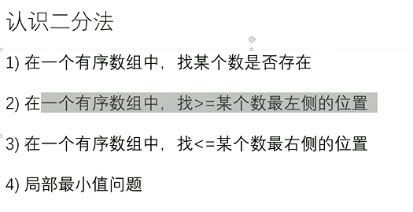


1 int mid = L + ((L - R) >> 1)
2 n * 2  + 1 = (n << 1) | 1 

二分不一定要求有序  出现排它性 可以一次排除一半即可

```java
public class Dichotomy {

    @Test
    public void test01(){
        int[] arr = {1,2,3,3,4,4,5,6,6,6,6,6,7,7,7,7,7,7,7,8,8,9};
        arr = new int[]{1, 1, 1, 1, 1, 1 ,2};
        System.out.println(getLeft(arr,1));
        System.out.println(getRight(arr,1));
        System.out.println(get(arr,1));
        System.out.println(get(arr,2));
        System.out.println(get(arr,3));
        System.out.println(get(arr,4));
        System.out.println(get(arr,5));
        System.out.println(get(arr,6));
        System.out.println(get(arr,7));
    }

    @Test
    public void testLocalMinimum(){
        int[] arr = {100, 9, 11, 7, 8, 9, 10, 5, 7, 3, 100};
//        arr = new int[]{1,1,1,1,1};
        int i = localMinimum(arr);
        System.out.println(i);
    }


    //获取局部最小的数
    public int localMinimum(int[] arr){

        if(arr == null || arr.length == 0) return -1;
        if(arr.length == 1) return arr[0];

        //此时arr 至少有两个元素 先检测边界条件
        if(arr[0] < arr[1]) return 0;
        if(arr[arr.length - 1] < arr[arr.length - 2]) return arr.length - 1;

        //此时边界条件不满足 长度至少为3(如果数都一样就算了)
        int L = 1;
        int R = arr.length - 1 - 1;

        while(L < R){
            int M = L + ((R - L)>>2);
            //更通用 感觉效果好
            if(arr[M] < arr[M + 1] && arr[M] < arr[M - 1]){
                return M;
            }else if(arr[M] < arr[M + 1] && arr[M] > arr[M - 1]){
                //在左边分
                R = M - 1;
            }else{
                //再右边分
                L = M + 1;
            }
/*            if (arr[M] > arr[M - 1]) {
                R = M - 1;
            }else if(arr[M] > arr[M + 1]){
                L = M + 1;
            }else {
                return M;
            }*/
        }
        return -1;
    }


    //获取最右边 也需要借助一个变量
    public int getRight(int[] arr, int value){
        int index = -1;
        int L = 0;
        int R = arr.length - 1;
        while(L <= R){
            int M = L + ((R - L) >> 2);
            if(value >= arr[M]){
                L = M + 1;
                index = M;
            }else {
                R = M - 1;
            }
        }
        return index;
    }


    //获取最左边 需要借助一个变量
    public int getLeft(int[] arr, int value){
        int L = 0;
        int R = arr.length - 1;
        int index = -1;
        while(L <= R){
            int M = L + ((R - L) >> 2);
            if(value > arr[M]){
                L = M + 1;
            }else {
                R = M - 1;
                index = M;
            }
        }
        return index;
    }
    //1 获取任意一个满足的索引
    public int get(int[] arr, int value){
        int L = 0;
        int R = arr.length - 1;
        while(L <= R){
            int M = L + ((R - L) >> 2);
            if(value > arr[M]){
                L = M + 1;
            }else if(value < arr[M]){
                R = M - 1;
            }else{
                return M;
            }
        }
        return -1;
    }
}
```

#### 异或运算

异或 : 无进位相加

1 0 ^ N == N N ^ N == 0
2 异或满足交换律和结合律
所有代码 
```java
/**
 * num & (num - 1) 删除二进制形式最右面的1
 * num & ((^num) + 1) 仅获取二进制形式最右边的1
 *
 * 测试异或的面试题
 * @author ：葬花吟留别1851053336@qq.com
 * @description：TODO
 * @date ：2022/5/2 23:29
 */
public class Code02_XORTest {

    @Test
    public void testGetBit1Num(){
        int a = -15;
        for (int i = 0; i < 10; i++) {
            System.out.println(getBit1Num(a));
            System.out.println(getBit1Num2(a));
            System.out.println();
            a ++;
        }

    }


    public int getBit1Num2(int num){
        int count = 0;
        while(num != 0){
            //在数为负数的情况下可能是错的 我实验了都是对的
            //这就怪了 他说是错的 他的建议是 使用异或
//            num ^= num & ((~num) + 1);//他的建议
            num -= num & ((~num) + 1);
            count ++;
        }
        return count;
    }

    //问题四 :
    public int getBit1Num(int num){
        int count = 0;
        while(num != 0){
//            num -= num & ((~num) + 1); //在数为负数的情况下可能是错的 我实验了都是对的
            num = num & (num - 1); //删除二进制最右边的1
            count ++;
        }
        return count;
    }

    @Test
    public void testOnlyTwoSingle(){
        int[] arr = {1,3,3,6,6,4,4,1,8,6,6,7,7,5,9,9};
        onlyTwoSingle(arr);
    }


    //问题三 : 一个数组中有两种数出现了 奇数次 剩下都出现了偶数次 找出打印这个两个数
    public void onlyTwoSingle(int[] arr){

        int xor = 0;
        int xorHalf = 0;
        for (int i = 0; i < arr.length; i++) {
            xor ^= arr[i];
        }
        //假设唯一的两个数 为 a,b 则 xor = a ^ b
        //找到 xor 最右侧的一
        int last1 = xor & ((~xor) + 1);

        for (int i = 0; i < arr.length; i++) {
            if((arr[i] & last1) != 0){
                xorHalf ^= arr[i];
            }
        }
        int xorOtherHalf = xor ^ xorHalf;
        System.out.println("xorHalf = " + xorHalf);
        System.out.println("xorOtherHalf = " + xorOtherHalf);
    }

    //问题二 : 在数组中有一组数 其中有且仅有一个数是单独出现 其他全部是成对出现
    @Test
    public void testOnlyOnce(){
        int[] arr = {1,3,3,6,6,4,4,1,8,6,6,7,7};
        System.out.println(onlyOnce(arr));
    }

    public int onlyOnce(int[] arr){
        int ret = 0;
        for (int i = 0; i < arr.length; i++) {
            ret ^= arr[i];
        }
        return ret;
    }


    //问题一 不用额外变量交换两个值

    @Test
    public void testSwapValue(){
        int a = 123;
        int b = 456;
        a = a ^ b;
        b = a ^ b;
        a = a ^ b;
        System.out.println("a = " + a);
        System.out.println("b = " + b);
        int[] arr = new int[]{12,34};
        swap(arr,0,1);
        System.out.println(Arrays.toString(arr));
    }

    public void swap(int[] arr,int i, int j){
        //这种交换模式 i != j 否则 会成为0
        if(i == j) return;
        arr[i] = arr[i] ^ arr[j];
        arr[j] = arr[i] ^ arr[j];
        arr[i] = arr[i] ^ arr[j];
    }

    @Test
    public void test01(){
        int a =(0 - 1)/2;
        System.out.println(a);
    }

}
```

##### 题目一 不用额外变量交换两个值
这玩意 也不是非得写 可读写也不是很好
在数组中交换 最好别这么写 但是比较帅


满足内存独立 否则结果为 0
a = a ^ b
b = a ^ b
a = a ^ b

##### 题目二 出现了奇数次的数

只有一个数出现了奇数次剩下的数出现了偶数次

全部异或就完了  O(n) 一个额外空间 O(1)

##### (*) 题目三 把一个整型数 提取出二进制最右侧的1

N & ( (~N) + 1 ) 

##### 一个数组中有两种数出现了 奇数次 剩下都出现了偶数次 找出打印这个两个数

全部异或的结果 应该是 a ^ b ( a 不等于 b)

找到最右侧的一

##### 计算整数二进制1的个数 

不能使用 减 因为符号会有问题 (待会想想)


## 2 链表 + 栈 + 队列

链表问题一般都是coding问题
排序后讲链表 

#### 单向链表结构
```java
public class LinkNode<T> {
    public T value;
    public LinkNode<T> next;

    public LinkNode(T value) {
        this.value = value;
    }
}
```
#### 双向链表结构
```java
public class DoublyNode <T> {
    public T value;
    public DoublyNode<T> next;
    public DoublyNode<T> last;

    public DoublyNode(T value) {
        this.value = value;
    }
}
```
#### 简单练习题
Java的代码会不会产生内存泄露 : 会 变量的生存周期不同
JVM会怎么释放空间 : 如果堆中的内存 没有被引用所引用 

#### 单双链表的插入
```text
    public  LinkNode<T> append(LinkNode<T> head,T value){
        //使用哨兵节点 减少一次 if判断 多使用一个空间
        LinkNode<T> dummy = new LinkNode<>(null);
        dummy.next = head;

        LinkNode<T> node = new LinkNode<>(value);
        LinkNode<T> cur = dummy;

        while(cur.next != null){
            cur = cur.next;
        }
        cur.next = node;
        return dummy.next;
    }
    
     public DoublyNode<T> append(DoublyNode<T> head, T value){

        DoublyNode<T> dummy = new DoublyNode<>(null);
        dummy.next = head;
        DoublyNode<T> node = new DoublyNode<>(value);
        DoublyNode<T> cur = dummy;
        while(cur.next != null){
            cur = cur.next;
        }
        cur.next = node;
        node.last = cur;
        return dummy.next;
    }
```

##### 单双链表反转
返回值 新的头部 

```java
public class Code01_LinkReverse {


    public static <T> LinkNode<T> reverse(LinkNode<T> head) {

        if (head == null) return null;

        LinkNode<T> pre = null;
        LinkNode<T> temp = null;

        //控制好边界条件
        while (head != null) {
            temp = head.next;
            head.next = pre;
            pre = head;
            head = temp;

        }
        return pre;
    }


    public static <T> DoublyNode<T> reverseDoubly(DoublyNode<T> head) {
        if (head == null) return null;
        DoublyNode<T> pre = null;
        DoublyNode<T> next = null;

        //控制好边界条件
        while (head != null) {

            next = head.next;

            head.next = pre;
            head.last = next;

            pre = head;
            head = next;
        }
        return pre;
    }
}
```

##### 把给定的值都删除
返回值 新的头部 因为可能删掉头部 

```java
public class Code02_LinkDelete {


    public static <T> LinkNode<T> deleteByValue(LinkNode<T> head, T value) {
        while (head != null && head.value.equals(value)) {
            head = head.next;
        }
        //处理完成后head 的值 不是value
        if (head == null) return null;
        LinkNode<T> pre = head;
        LinkNode<T> cur = head.next;
        while (cur != null) {
            if (cur.value.equals(value)) {
                //pre = cur.next; //错误的 pre任何时候都不要指向 可能是要删除的节点
                pre.next = cur.next;
            } else {
                pre = pre.next;
            }
            cur = cur.next;
        }
        return head;
    }

    //连线没有问题
    public static <T> DoublyNode<T> deleteByValue(DoublyNode<T> head, T value) {

        while (head != null && head.value.equals(value)) {
            head = head.next;
            head.last = null;
        }

        if (head == null) return null;

        DoublyNode<T> cur = head.next;
        DoublyNode<T> pre = head;

        while (cur != null) {
            cur.last = pre;
            if (cur.value.equals(value)) {
                pre.next = cur.next;

            } else {
                pre = pre.next;
            }
            cur = cur.next;
        }
        return head;
    }
}
```

#### 栈和队列

堆栈 : 先进后出
队列 : 先进先出

如果要考实现 : 应该是使用规定大小的数组实现 
双向链表来实现 : 比较简单

数组实现: 实现栈比较简单 实现队列比较复杂

实现队列的核心 要环状使用内存 很多公司都考过 
两个索引 追赶的方式 比较繁琐
增加一个size变量 解耦两个索引之间的关系
设置 获取下个坐标的方法

##### 使用链表实现
```java
class LinkedListStack<T>{
    MyLinkedList<T> stack = new MyLinkedList<>();

    public void push(T ele){
        stack.addFromHead(ele);
    }

    public T pop(){
        return stack.getFromHead();
    }

}

class MyLinkedList<T>{
    DoublyNode<T> head = null;
    DoublyNode<T> tail = null;


    public void addFromHead(T ele){
        DoublyNode<T> node = new DoublyNode<>(ele);
        if(head == null){
            head = node;
            tail = node;
        }else{
            node.next = head;
            head.last = node;
            head = node;
        }
    }

    public void addFromTail(T ele){
        DoublyNode<T> node = new DoublyNode<>(ele);
        if(head == null){
            head = node;
            tail = node;
        }else {
            node.last = tail;
            tail.next = node;
            tail = node;
        }
    }

    public T getFromHead(){
        if(head == null){
            return null;
        }
        T ret = head.value;
        DoublyNode<T> node = head.next;
        if(node == null){
            head = null;
            tail = null;
        }else {
            node.last = null;
            head.next = null;
            head = node;
        }
        return ret;
    }

    public T getFromTail(){
        if(head == null){
            return null;
        }
        T ret = tail.value;
        DoublyNode<T> node = tail.last;
        if(node == null){
            head = null;
            tail = null;
        }else {
            node.next = null;
            tail.last = null;
            tail = node;
        }
        return ret;
    }

}
```

##### 使用固定长度数组实现
实现队列 比较重要 
```java
class ArrayQueue<T>{
    private int len;
    private T[] arr;
    private int size;
    private int next;
    private int last;

    public ArrayQueue(int len){
        this.len = len;
        arr = (T[]) new Object[len];
    }

    public void put(T ele){
        if(isFull()) throw new RuntimeException("队列已满");
        size ++;
        arr[next] = ele;
        next = nextValue(next);
    }

    public T poll(){
        if(isEmpty()) throw new RuntimeException("队列为空");
        size --;
        T ele = arr[last];
        last = nextValue(last);
        return ele;
    }

    public T peek(){
        if(isEmpty()) throw new RuntimeException("队列为空");size --;
        return arr[last];
    }

    public boolean isFull(){
        return size == len;
    }

    public boolean isEmpty(){
        return size == 0;
    }

    public int nextValue(int num){
        return num == len - 1 ? 0 : num + 1;
    }

    @Override
    public String toString() {
        return "ArrayQueue{" +
                "arr=" + Arrays.toString(arr) +
                '}';
    }
}


```
实现栈
```java
class ArrayStack<T>{

    int size;
    T[] arr;
    int next;

    public ArrayStack(int size) {
        this.size = size;
        arr = (T[]) new Object[size];
    }

    public void push(T ele){
        if(next == size) throw new RuntimeException("栈满");
        arr[next ++] = ele;
    }

    public T pop(){
        if(isFull()) throw new RuntimeException("栈空");
        return arr[--next];
    }

    public T peek(){
        if(isEmpty()) throw new RuntimeException("栈空");
        return arr[next - 1];
    }

    public boolean isFull(){
        return next == size;
    }

    public boolean isEmpty(){
        return next == 0;
    }


}

```

#### 语言都有api为什么要手写
算法问题无关语言
语言提供的api的有限的,需要改写
任何软件工具底层都是最基本的算法和数据结构


#### 栈和队列常见面试题

##### 实现一个特殊的栈 在基本功能的基础上 返回栈中最小的元素的功能
时间复杂度 还是 O(1) 
准备两个栈就可以了 data min 
两个栈同时上升   同时下降 即可实现 


第二种设计 还是两个栈
并不是同时压入  小于等于的时候压入 稍微省一点空间 
稍微费一点时间

```java
class GetMinStack<T extends Comparable>{
    Stack<T> stack = new Stack<>();
    Stack<T> help = new Stack<>();

    public void push(T ele){
        if(stack.isEmpty()){
            help.push(ele);
        }else{
            T peek = help.peek();
            if(ele.compareTo(peek) < 0){ // ele < peek
                help.push(ele);
            }else {
                help.push(peek);
            }
        }
        stack.push(ele);
    }

    public T pop(){
        help.pop();
        return stack.pop();
    }

    public T peek(){
        return help.peek();
    }

    public T getMin(){
        return help.peek();
    }


}
```

##### (*)只使用栈实现队列 
不考虑多线程的问题 这是语言的问题
实现两个栈来实现
导入规则
pop为空
push 全部导完

```java
//使用栈模拟两个队列
class StackQueue<T>{
    Stack<T> stack = new Stack<>();
    Stack<T> help = new Stack<>();

    private void transform(){
        //当且仅当辅助栈中没有元素时 转换 转换时要把所有的全部放入
        if(help.isEmpty()){
            while(!stack.isEmpty()){
                help.push(stack.pop());
            }
        }
    }

    public void push(T ele){
        stack.push(ele);
    }

    public T poll(){
        transform();
        return help.pop();
    }

    public T peek(){
        transform();
        return help.peek();
    }
}
```
##### 只使用队列实现栈 简单
使用两个队列实现 


```java
//使用两个队列 模拟栈
class QueueStack<T>{
    Queue<T> queue = new LinkedList<>();
    Queue<T> help = new LinkedList<>();
    private void changeRoles(){
        Queue<T> temp = queue;
        queue = help;
        help = temp;
    }
    public void push(T ele){
        queue.add(ele);
    }
    public T pop(){
        int size = queue.size();//下面只能写成 size - 1而不是  size()
        for (int i = 0; i < size - 1; i++) {
            help.add(queue.poll());
        }
        T ret = queue.poll();
        changeRoles();
        return ret;
    }
}
```
上面两种问题形式的启发
(当面试问道 之前有个算法不使用栈而使用了队列时或者是xxx 考虑一下 上面的两个方式  )
比如图的广度优先 和 深度优先遍历
#### 递归
从思想上理解
从实际实现的角度递归

范围缩小 同等定义 把子问题结论 成大问题结论
把事情分解
不管什么递归 都画图 先分流 再合流
##### 求数组L-R上的最大值 使用递归

复杂度 O(n) 不是 O(n2) 

#### 递归算法求复杂度
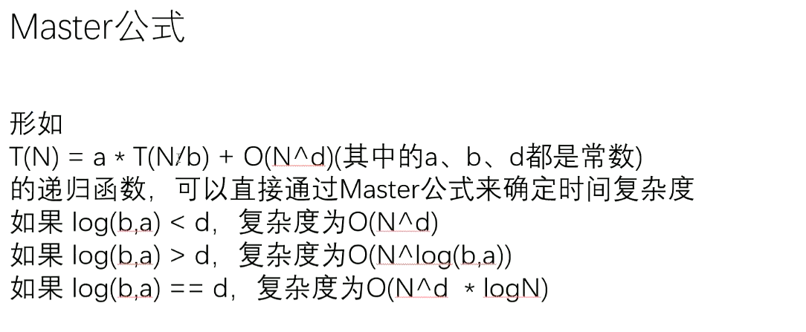


#### 哈希表
HashMap
LinkedHashMap
HashTable

增删改查 时间复杂度O(1) 空间换时间
哈希表 按引用传递 和值传递  一律按值传递  
(康师傅不是说过java只有值传递吗,这里说的都是什么,感觉讲的不是很好)

这里的哈希表 感觉讲的真的不行,幸好之前了解过这个结构
String都成了基础数据类型可还行

java引用 8 个字节 

#### 有序表 
TreeMap 
排序二叉树
所有的增删改查 O(logN)
需要指定 comparable comparator

AVL SB 红黑 具备不同平衡性的搜索二叉树
跳表 : 别的设计
只有常数基本的差别

总是维持一颗搜索二叉树 : 维持平衡性 以后一定会讲 一个讲至少 一个半小时
## 3 归并精讲 + 快排
早上 : 归并排序 和 快速排序
下午 : 堆排 
算法 : 靠练习 , 天赋差异也就那样
还是 数学老哥们牛逼
#### 归并排序
把 比较行为省下来 变成有序的部分
每一次比较都没有浪费

解释为什么这样比较快 :
归并排序复杂度O(N log N) 因为相比于昨天的三个排序 没有浪费 比较

##### 使用递归实现
实质 把比较行为变成了有序信息并传递 比 选择冒泡插入排序快
1 可以是递归 左边排好序 , 右边排好序 , 然后merge 让整体有序

```java
public class MergeSort extends BaseSort{
    public void mergeSort(int[] arr,int L,int R){
        if(L >= R) return;
        int mid = L + ((R - L)>>2);//记得 加上括号
        mergeSort(arr,L,mid);
        mergeSort(arr,mid + 1,R);
        merge(arr,L,R,mid);
    }
    //归并过程
    public void merge(int arr[],int L,int R,int M){
        int[] help = new int[R - L + 1];
        int leftI = L;
        int rightI = M + 1;
        int helpI = 0;
        while(leftI <= M && rightI <= R){
            help[helpI++] = arr[leftI] <= arr[rightI] ? arr[leftI ++] : arr[rightI ++];
        }
        //两个中有且仅有一个 越界
        //意思是下面都两个while 有且仅有一个会执行 因此两个的顺序随便写 因为只会执行一个
        while(leftI <= M){
            help[helpI++] = arr[leftI++];
        }
        while (rightI <= R){
            help[helpI++] = arr[rightI++];
        }
        //复制数组
        for (int i = 0; i < help.length; i++) {
            //记得 arr里面 + L
            arr[i + L] = help[i];
        }
    }

    @Override
    public void sort(int[] arr) {
        mergeSort(arr,0,arr.length - 1);
    }

    @Override
    @Test
    public void testSort() {
        super.testSort();
    }
}
```
##### 实现非递归实现
非递归实现 注意边界条件的控制 
多一个判读是 防止溢出  

```java
public class MergeSortIter extends BaseSort{

    //排序 一定要相信自己呀 连自己都不相信该怎么办
    public void mergeSort(int[] arr){
        int proportion = 1;
        int size = arr.length;
        while(proportion < size){
            int L = 0;
            while(L < size){
                int M = L + proportion - 1;
                if(M >= size) break;
                int R = Math.min(size - 1, M + proportion);
                merge(arr,L,R,M);
                L = R + 1;
            }
            if( size  >> 1 < proportion) break;
            proportion <<= 1;
        }


    }
    //归并过程
    public void merge(int arr[],int L,int R,int M){
        int[] help = new int[R - L + 1];
        int leftI = L;
        int rightI = M + 1;
        int helpI = 0;
        while(leftI <= M && rightI <= R){
            help[helpI++] = arr[leftI] <= arr[rightI] ? arr[leftI ++] : arr[rightI ++];
        }
        //两个中有且仅有一个 越界
        //意思是下面都两个while 有且仅有一个会执行 因此两个的顺序随便写 因为只会执行一个
        while(leftI <= M){
            help[helpI++] = arr[leftI++];
        }
        while (rightI <= R){
            help[helpI++] = arr[rightI++];
        }
        //复制数组
        for (int i = 0; i < help.length; i++) {
            //记得 arr里面 + L
            arr[i + L] = help[i];
        }
    }

    @Override
    public void sort(int[] arr) {
        mergeSort(arr);
    }

    @Override
    public void testSort() {
        super.testSort();
    }
}
```


##### 一道面试题
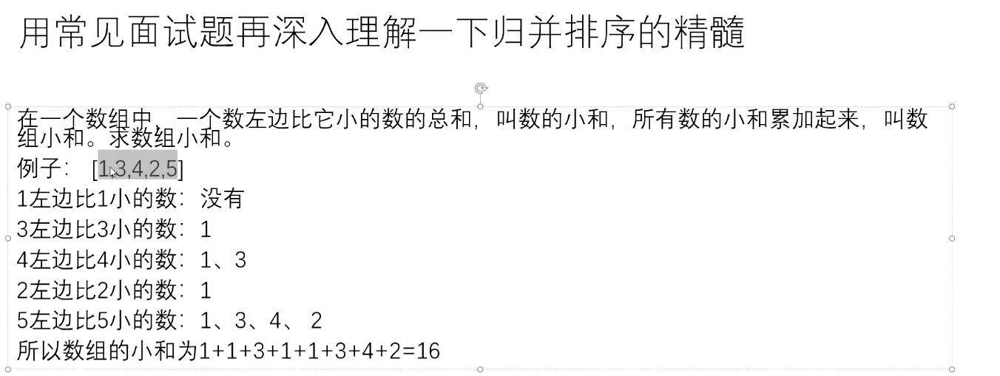

数字一样先处理右边
先记住结果 再分析流程
归并的时候产生小和

```java
public class MergeSortExtend01 extends BaseSort{


    public int process(int[] arr, int L, int R){
        if( L >= R) return 0;
        int mid = L + ((R - L) >> 2);
        return process(arr,L, mid) + process(arr,mid + 1,R) + merge(arr,L,R,mid);
    }

    @Test
    public void testMerge(){
        int[] arr = {1, 3, 4, 2, 5};
        int res = process(arr, 0, arr.length - 1);
        System.out.println(Arrays.toString(arr));
        System.out.println(res);
    }

    //归并过程
    public int merge(int[] arr, int L, int R, int M){
        int result = 0;
        int[] help = new int[R - L + 1];
        int leftI = L;
        int rightI = M + 1;
        int helpI = 0;
        while(leftI <= M && rightI <= R){
            result += arr[leftI] < arr[rightI] ? (R - rightI + 1) * arr[leftI] : 0;
            help[helpI++] = arr[leftI] < arr[rightI] ? arr[leftI ++] : arr[rightI ++];
        }
        //两个中有且仅有一个 越界
        //意思是下面都两个while 有且仅有一个会执行 因此两个的顺序随便写 因为只会执行一个
        while(leftI <= M){
            help[helpI++] = arr[leftI++];
        }
        while (rightI <= R){
            help[helpI++] = arr[rightI++];
        }
        //复制数组
        for (int i = 0; i < help.length; i++) {
            //记得 arr里面 + L
            arr[i + L] = help[i];
        }
        return result;
    }
    @Override
    public void sort(int[] arr) {
        process(arr,0, arr.length);
    }


}
```

##### 逆序对
```java
public class MergeSortExtend02 extends BaseSort{


    public int process(int[] arr,int L, int R){
        if(L >= R) return 0;
        int mid = L + ((R - L) >> 2)/2;
        return process(arr,L,mid) + process(arr,mid + 1,R) + merge(arr,L,R,mid);
    }

    //归并过程
    public int merge(int[] arr, int L, int R, int M){
        int result = 0;
        int[] help = new int[R - L + 1];
        int leftI = L;
        int rightI = M + 1;
        int helpI = 0;
        while(leftI <= M && rightI <= R){
            result += arr[leftI] > arr[rightI] ? (M - leftI + 1) : 0;
            help[helpI++] = arr[leftI] <= arr[rightI] ? arr[leftI ++] : arr[rightI ++];
        }
        //两个中有且仅有一个 越界
        //意思是下面都两个while 有且仅有一个会执行 因此两个的顺序随便写 因为只会执行一个
        while(leftI <= M){
            help[helpI++] = arr[leftI++];
        }
        while (rightI <= R){
            help[helpI++] = arr[rightI++];
        }
        //复制数组
        for (int i = 0; i < help.length; i++) {
            //记得 arr里面 + L
            arr[i + L] = help[i];
        }
        return result;
    }


    @Test
    public void testProcess(){
        int[] arr = {6,1, 3,8, 4, 2, 5};
        int res = process(arr, 0, arr.length - 1);
        System.out.println(Arrays.toString(arr));
        System.out.println(res);
    }

    @Override
    public void sort(int[] arr) {

    }
}
```


##### 适合题型
需要知道 左边多少个数比我大/小 右边多少个数比我大/小

为什么这连个例子都在纠结 谁比我大的问题 ?
这是因为 数组是从小到大排的 找到一个数后, 后面的数都满足比xxx大

#### 快速排序
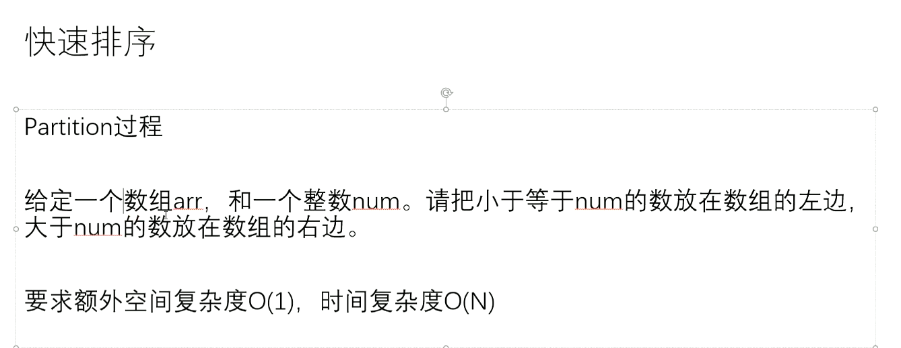

 

荷兰国旗问题

额外空间复杂度
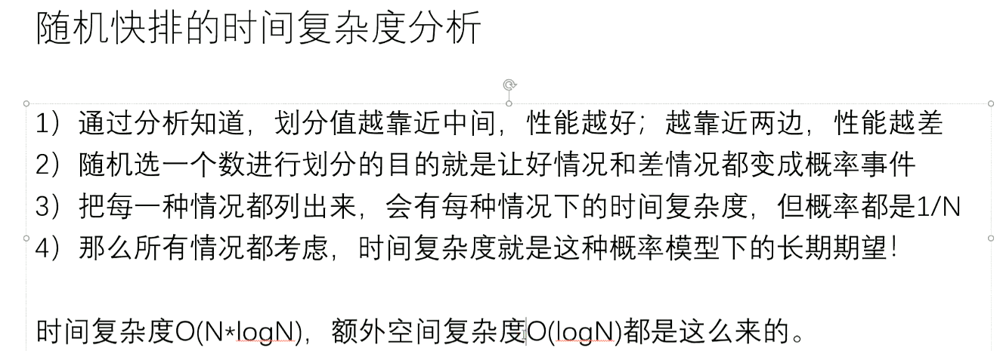

需要复习使用循环实现归并排序 

```java
public class QuickSort extends BaseSort{


    @Test
    public void testPartition(){
        int[] array = generateArray(20);
        printArray(array);
        partition(array,0,array.length - 1);
        printArray(array);
    }

    //分割为两份  一个数左边都小于等于这个数 这个数的右边都大于这个数
    public int partition(int[] arr, int L, int R){
        if(L > R) return -1;
        if(L == R) return L;
        //小于的范围
        int less = L - 1;
        int i = L;
        while(i < R){
            if(arr[i] > arr[R]){//这里是 > 代表 如果 i 大于value ,就直接后移
                i ++;
            }else{
                swap(arr,++less,i++);
            }
        }
        swap(arr,R,less + 1);
        return less + 1;
    }
    @Test
    public void testThreeColor(){
        int[] array = generateArray(20);
        printArray(array);
        int[] ints = threeColor(array, 0, array.length - 1);
        printArray(array);
        System.out.println(Arrays.toString(ints));
    }

    //分割成三份 三色问题
    public int[] threeColor(int[] arr, int L, int R){
        if(L > R) return new int[]{-1,-1};
        if(L == R) return new int[]{L,R};

        int less = L - 1;
        int more = R;
        int i = L;

        while(i < more){
            if(arr[i] == arr[R]){
               i ++;
            }else if(arr[i] < arr[R]){//less区 右移
                swap(arr,++less,i ++);
            }else{//more区 左移
                swap(arr,--more,i);//i 不要变 因为这个值是新的
            }
        }
        swap(arr,more,R);
        //less 应该 - 1 ,more不应该 + 1
        return new int[]{less + 1, more};
    }

    // 快排 version1.0
    public void process1(int[] arr,int L, int R){
        if(L >= R) return;
        int partition = partition(arr, L, R);
        process1(arr,L,partition - 1);
        process1(arr,partition + 1,R);
    }

    // 快排 version2.0
    public void process2(int[] arr,int L, int R){
        if(L >= R) return;
        int[] threeColor = threeColor(arr, L, R);
        process2(arr,L,threeColor[0] - 1);
        process2(arr,threeColor[1] + 1,R);
    }

    //快排 version3.0
    public void process3(int[] arr,int L, int R){
        if(L >= R) return;
        int random = getRandom(L, R);
        swap(arr,random,R);
        int[] threeColor = threeColor(arr, L, R);
        process3(arr,L,threeColor[0] - 1);
        process3(arr,threeColor[1] + 1,R);
    }

    public int getRandom(int L, int R){
        //这是经过我数学推导的 会生成 [L,R]左闭右闭的空间 中的一个随机数
        return (int) ((R + 1 -L) * Math.random() + L);
    }


    @Override
    public void sort(int[] arr) {
        //快排方式一 测试成功 复杂度 O(N 2)
        //process1(arr,0,arr.length - 1);
        //快排方式二 测试成功 复杂度 O(N 2)
        //process2(arr,0,arr.length - 1);
        //快排方式三 测试成功 复杂度 O(N log N)

        //为什么在方式二的基础上 添加一个随机数就能算出复杂度是 N log N
        //这是数学方式计算得出的 由于是随机 就无法一直模拟最差的情况 而上面两个兄弟可以 因此 他们复杂度高
        //而这是随机的 数学期望经过 计算 就是 N log N
        process3(arr,0,arr.length - 1);

    }

    @Override
    @Test
    public void testSort() {
        super.testSort();
    }
}
```

## 4 堆 + 比较器

堆只有大根堆 和小根堆
堆 满的二叉树 或者是将要变满的二叉树(从左往右) 

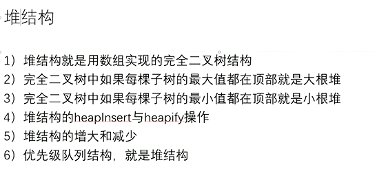

考虑到位运算比较快 很多实现中是从1开始的 而不是从0

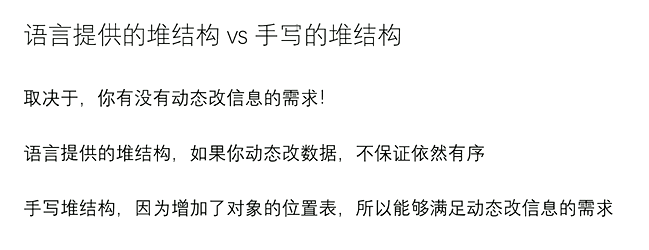

为什么快排 比较常用 

#### 自己实现的堆
```java
public class MyHeap<T extends Comparable<T>>{

    int size;
    T[] arr;
    int heapSize;

    public MyHeap(int size) {
        this.size = size;
        arr = (T[]) new Comparable[size];
        this.heapSize = 0;
    }

    public void add(T ele){
        if(isEmpty()){
            arr[heapSize++] = ele;
        } else {
            arr[heapSize] = ele;
            floatUp();
            heapSize ++;
        }
    }
    public T poll(){
        T ret = arr[0];
        swap(0,--heapSize);
        sinkDown(0);
        return ret;
    }

    public void sinkDown(int nodeIndex){

        int leftIndex = leftSonIndex(nodeIndex);
        while(leftIndex < heapSize){
            //说明有左孩子
            //找到最大孩子的索引
            int maxIndex = leftIndex + 1 < heapSize && arr[leftIndex + 1].compareTo(arr[leftIndex]) > 0 ? leftIndex + 1 : leftIndex;
            if(arr[nodeIndex].compareTo(arr[maxIndex]) >= 0){
                //如果父节点比 两个孩子都大 或者相等 就停止
                break;
            }
            //交换具体数组中的值
            swap(maxIndex,nodeIndex);

            //重新赋值
            nodeIndex = maxIndex;
            leftIndex = leftSonIndex(nodeIndex);
        }
    }

    public void floatUp(){
        int index = heapSize;
        while(arr[index].compareTo(arr[fatherIndex(index)]) > 0 ){//子节点比父节点大
            swap(index,fatherIndex(index));
            index = fatherIndex(index);
        }
    }

    public int fatherIndex(int index){
        return (index - 1)/2;
    }

    public int leftSonIndex(int index){
        return index * 2 + 1;
    }
    public boolean isFull(){
        return heapSize == size;
    }
    public boolean isEmpty(){
        return heapSize == 0;
    }
    public void swap(int i, int j){
        T temp = arr[i];
        arr[i] = arr[j];
        arr[j] = temp;
    }

}

```

#### 堆排序
```java
public class MyHeapSort{
    public static<T extends Comparable<T>> void sort(T[] arr){
        //复杂度O(N log N)
        for (int i = 0; i < arr.length; i++) {
            floatUp(arr,i);
        }
        //复杂度O(N log N)
        for (int i = arr.length - 1 ;i >= 0; i--) {
            swap(arr,0,i);
            sinkDown(arr,0,i);
        }
    }

    public static<T extends Comparable<T>> void improveSort(T[] arr){
        //复杂度 O(N) 可以通过数学证明
        for (int i = arr.length - 1 ;i >= 0; i--) {
            sinkDown(arr,i, arr.length);//我们先假设数组 全部是一个堆 倒着来 由于全部是一个堆 因此 heapSize = length 千万不要减一
        }
        //复杂度O(N log N)
        for (int i = arr.length - 1 ;i >= 0; i--) {
            swap(arr,0,i);
            sinkDown(arr,0,i);
        }
    }

    public static<T extends Comparable<T>> void improveSort(int[] arr){
        Integer[] copyArr = new Integer[arr.length];
        for (int i = 0; i < arr.length; i++) {
            copyArr[i] = arr[i];
        }
        improveSort(copyArr);
        for (int i = 0; i < arr.length; i++) {
            arr[i] = copyArr[i];
        }
    }


    public static<T extends Comparable<T>> void sinkDown(T[] arr,int nodeIndex,int heapSize){
        int leftIndex = leftSonIndex(nodeIndex);
        while(leftIndex < heapSize){
            //说明有左孩子
            //找到最大孩子的索引
            int maxIndex = leftIndex + 1 < heapSize && arr[leftIndex + 1].compareTo(arr[leftIndex]) > 0 ? leftIndex + 1 : leftIndex;
            if(arr[nodeIndex].compareTo(arr[maxIndex]) >= 0){
                //如果父节点比 两个孩子都大 或者相等 就停止
                break;
            }
            //交换具体数组中的值
            swap(arr,maxIndex,nodeIndex);
            //重新赋值
            nodeIndex = maxIndex;
            leftIndex = leftSonIndex(nodeIndex);
        }
    }
    public static<T extends Comparable<T>> void floatUp(T[] arr,int heapSize){
        int index = heapSize;
        while(arr[index].compareTo(arr[fatherIndex(index)]) > 0 ){//子节点比父节点大
            swap(arr,index,fatherIndex(index));
            index = fatherIndex(index);
        }
    }
    public static int fatherIndex(int index){
        return (index - 1)/2;
    }
    public static int leftSonIndex(int index){
        return index * 2 + 1;
    }
    public static<T extends Comparable<T>> void swap(T[] arr,int i, int j){
        T temp = arr[i];
        arr[i] = arr[j];
        arr[j] = temp;
    }

}
```


#### 系统实现的堆
优先级队列 底层就是堆
PriorityQueue<T> 默认是 小根堆 
add()  isEmpty() heap.poll() 
```java
public class TestPriorityQueue {

    //测试过了 没有问题
    @Test
    public void test01(){
        PriorityQueue<Integer> queue = new PriorityQueue<>();
        queue.add(123);
        queue.add(12);
        queue.add(71);
        queue.add(67);
        queue.add(54);
        queue.add(23);
        queue.add(3);
        queue.add(88);

        System.out.println(queue);

        while(!queue.isEmpty()){
            System.out.println(queue.poll());
        }
    }
}
```
#### 问题 一 
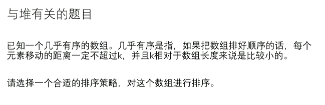 

生成小根堆 

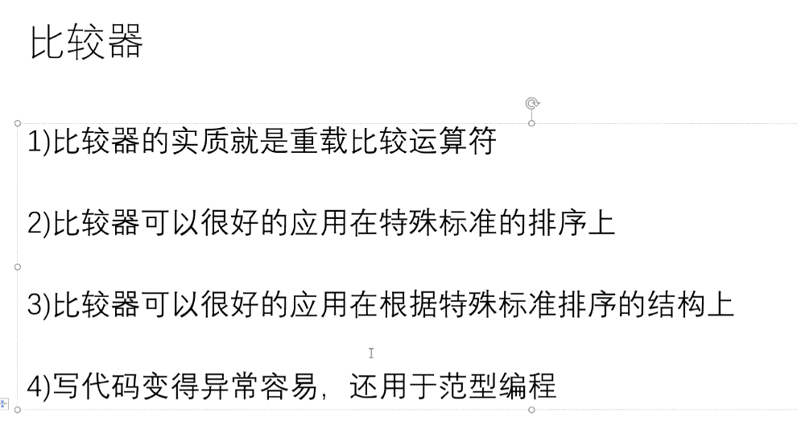

怎么又开始讲这个玩意了 这玩意要学java不是必须要学的 吗


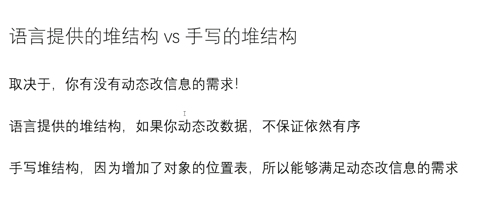

#### 可扩展的堆
```java
public class MyChangeableHeap<T extends Comparable<T>>{

    
    int size;
    int heapSize;
    T[] arr;
    HashMap<T,Integer> indexMap;

    public MyChangeableHeap(int size) {
        this.size = size;
        arr = (T[]) new Comparable[size];
        this.indexMap = new HashMap<>();
        this.heapSize = 0;
    }


    public void add(T ele){
        arr[heapSize] = ele;
        indexMap.put(ele,heapSize);
        floatUp(heapSize);
        heapSize ++;
    }

    public T poll(){
        T ret = arr[0];
        indexMap.remove(ret);
        swap(0,heapSize);
        heapSize --;
        sinkDown(0);
        return ret;
    }


    public void floatUp(int nodeIndex){
        while(arr[nodeIndex].compareTo(arr[fatherIndex(nodeIndex)]) > 0){//哪怕是条件要求这里都不能带等号
            //子节点比父节点大
            swap(nodeIndex,fatherIndex(nodeIndex));
            //子节点变成父节点
            nodeIndex = fatherIndex(nodeIndex);
        }
    }

    public void sinkDown(int nodeIndex){

        int leftIndex = leftSonIndex(nodeIndex);
        while(leftIndex < heapSize){//这个heapSize应该是交换完 改变好边界
            //满足 有右孩子 并且右孩子大于左孩子 使用右孩子
            int maxIndex = leftIndex + 1 < heapSize && arr[leftIndex + 1].compareTo(arr[leftIndex]) > 0 ? leftIndex + 1: leftIndex;
            if(arr[maxIndex].compareTo(arr[nodeIndex]) <= 0){
                //最大的比不过 父节点 break
                break;
            }
            //交换真实的节点
            swap(maxIndex,nodeIndex);
            //重新赋值
            nodeIndex = maxIndex;
            leftIndex = leftSonIndex(nodeIndex);
        }

    }
    

    //ele 发生了改变 请你更新
    public void refactor(T ele){
        //元素都改 了 indexMap还能获取到吗 ?
        Integer index = indexMap.get(ele);
        floatUp(index);
        sinkDown(index);
    }

    public void refactor(T oldVal,T newVal){
        Integer removeIndex = indexMap.remove(oldVal);
        floatUp(removeIndex);
        sinkDown(removeIndex);
        indexMap.put(newVal,removeIndex);
    }

    public int fatherIndex(int nodeIndex){
        return (nodeIndex - 1) / 2;
    }
    public int leftSonIndex(int nodeIndex){
        return nodeIndex * 2 + 1;
    }

    //这里就别整花活了
    public void swap(int i, int j){
        T temp = arr[i];
        arr[i] = arr[j];
        arr[j] = temp;
        //此时 arr[i] arr[j]已经交换
        indexMap.put(arr[i],i);
        indexMap.put(arr[j],j);
    }
}
```


## 5 前缀数 + 基数 + 计数 + 排序总结
#### 答疑
基数排序 相加节点 二叉树递归 树型dp问题

1 从下向上 和 从上向下建堆 复杂度为什么不一样 
反证法证明 
#### 前缀树
非常重要 以后会经常用到
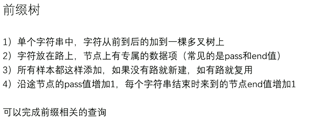
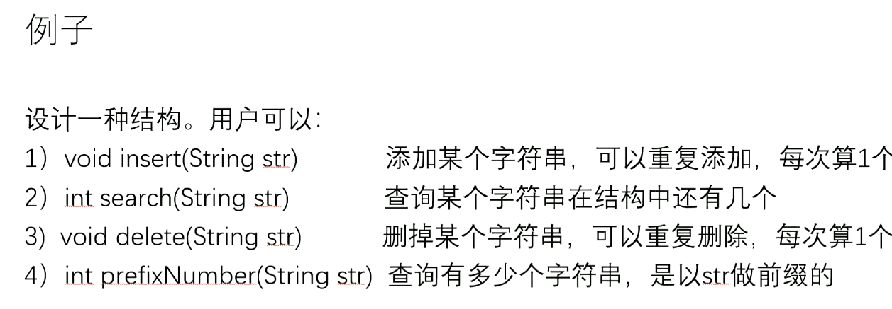
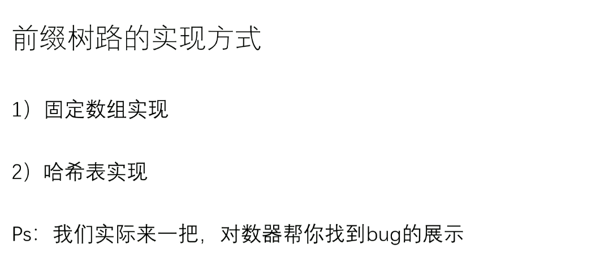
沿途往上挂,沿途p++,结尾e++
有则复用 无则新建

##### 实现方式一
只能处理小写字母 
```java
public class Tire {
    private final Node root = new Node();
    public void insert(String s){
        Node temp = root;
        temp.p ++;
        char[] chs = s.toCharArray();
        for (int i = 0; i < chs.length; i++) {
            int index = chs[i]  - 'a';
            if(temp.arr[index] == null){
                temp.arr[index] = new Node();
            }
            temp = temp.arr[index];
            temp.p ++;
        }
        temp.e ++;
    }

    public int search(String s){
        if(s == null || s.length() == 0) return 0;
        Node temp = root;
        char[] chs = s.toCharArray();
        for (int i = 0; i < chs.length; i++) {
            int index = chs[i] - 'a';
            if(temp.arr[index] == null){
                return 0;
            }
            temp = temp.arr[index];
        }
        return temp.e;
    }

    public int prefixNum(String s){
        if(s == null || s.length() == 0) return 0;
        char[] chs = s.toCharArray();
        Node temp = root;
        for (int i = 0; i < chs.length; i++) {
            int index = chs[i] - 'a';
            if(temp.arr[index] == null){
                return 0;
            }
            temp = temp.arr[index];
        }
        return temp.p;
    }

    public void delete(String s){
        if(search(s) > 0){
            char[] chs = s.toCharArray();
            Node temp = root;
            temp.p --;
            for (int i = 0; i < chs.length; i++) {
                int index = chs[i] - 'a';
                if(temp.arr[index].p == 1){
                    temp.arr[index] = null;
                    return;//应该是return而不是 break
                }
                temp = temp.arr[index];
                temp.p --;
            }
            temp.e --;
        }
    }
}
class Node{
    int p;
    int e;
    Node[] arr = new Node[26];
}
```

##### 实现方式二
```java
public class PrefixTree {
    private final PrefixNode root = new PrefixNode();
    public void insert(String str){
        if(str == null || str.length() == 0) return;
        PrefixNode temp = root;
        temp.p ++;
        char[] chs = str.toCharArray();
        for (char ch : chs) {
            PrefixNode node = temp.map.get(ch);
            if(node == null){
                node = new PrefixNode();
                temp.map.put(ch,node);
            }
            temp = node;
            temp.p ++;
        }
        temp.e ++;
    }
    public int search(String str){
        if(str == null || str.length() == 0) return 0;
        PrefixNode temp = root;
        for (char ch : str.toCharArray()) {
            PrefixNode node = temp.map.get(ch);
            if(node == null) return 0;
            temp = node;
        }
        return temp.e;
    }

    public int prefixNumber(String str){
        if(str == null || str.length() == 0) return 0;
        PrefixNode temp = root;
        for (char ch : str.toCharArray()) {
            PrefixNode node = temp.map.get(ch);
            if(node == null) return 0;
            temp = node;
        }
        return temp.p;
    }

    public void delete(String str){
        if(search(str) > 0){
            PrefixNode temp = root;
            temp.p --;
            for (char ch : str.toCharArray()) {
                PrefixNode node = temp.map.get(ch);
                if(node.p == 1){//Force
                    //node为temp的孩子节点 如果node的值为 1  temp指向空并且返回即可
                    temp.map.put(ch,null);
                    return;
                }
                temp = node;
                temp.p --;
            }
            temp.e --;
        }
    }
}

class PrefixNode{
    int p;
    int e;
    HashMap<Character,PrefixNode> map = new HashMap<>();
}
```

可以在节点中封装更丰富的信息 来完成指定的题目 
要求 这个题目的用到的原理就是前缀树
这种题目还是比较复杂的 

#### 不基于比较的排序
桶排序是一种思想 基于容器排序 : 计数 基数排序
需要严格考虑数据的情况 如果数据发生变化就需要重构 
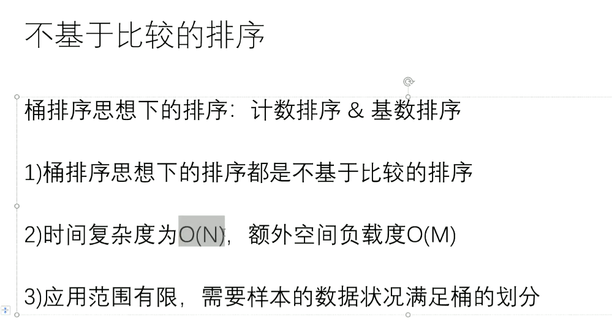
和比较有关的排序 极限复杂度就是 O(N logN)
数据状况窄 复杂度可以是 O(N)
面试中有排序时 一般按基于比较的排序


计数排序 要求比较高 范围有限 对数据状况本身有要求

基数排序 权重大最后排

##### 计数排序
```java
public class CountSort extends BaseSort{


    //重写父类的方法 严格产生数字的范围
    @Override
    public int[] generateArray(int range) {
        int[] arr = new int[getRandomValue(range)];
        for (int i = 0; i < arr.length; i++) {
            //生成的数字是 0-200的
            arr[i] = getRandomValue(200);
        }
        return arr;
    }
    // 基数排序 对数值范围要求严格[本例是 0 - 200 ] 空间复杂度O(1) 时间复杂度 O(N)
    public void countSort(int[] arr){

        //可以理解为 help 数组的索引是 真实的数值 help存入的元素是 这个值出现了几次
        int[] help = new int[201];
        Arrays.fill(help,0);
        for (int i = 0; i < arr.length; i++) {
            help[arr[i]] = help[arr[i]] + 1;
        }
        int index = 0;
        //填充数组
        for (int i = 0; i < help.length; i++) {//help是一个定值 因此复杂度不是 O(N * N)
            for (int j = 0; j < help[i]; j++) {
                arr[index++] = i;
            }
        }
    }

    @Override
    public void sort(int[] arr) {
        countSort(arr);
    }

    @Override
    public void testSort() {
        super.testSort();
    }
}
```
##### 基数排序
```java
public class RadixSort extends BaseSort{

    //重写父类的方法 严格产生数字的范围
    @Override
    public int[] generateArray(int range) {
        int[] arr = new int[getRandomValue(range)];
        for (int i = 0; i < arr.length; i++) {
            //生成的数字是 0-200的
            arr[i] = getRandomValue(200);
        }
        return arr;
    }


    public void radixSort(int[] arr){
        int maxValue = getMaxValue(arr);
        int bitNum = getBitNum(maxValue);
        radixSort(arr,0,arr.length - 1,bitNum);
    }
    public void radixSort(int[] arr,int L, int R,int bit){
        int[] help = new int[10];//记录个位
        int[] copyArr = new int[R - L + 1];
        //进行五次循环 就可以
        for (int i = 1; i <= bit; i++) {
            Arrays.fill(help,0);
            for (int j = L; j <= R; j++) {
                int bitNum = getBit(arr[j], i);
                help[bitNum] = help[bitNum] + 1;
            }
            //重构这个数组
            for (int j = 1; j < help.length; j++) {
                help[j] = help[j] + help[j - 1];
            }
            for (int j = R; j >= L; j--) {
                int bitNum = getBit(arr[j], i);
                copyArr[help[bitNum] - 1] = arr[j];
                help[bitNum] = help[bitNum] - 1;
            }
            for (int j = 0 , k = L ; k <= R; j++, k++) {
                arr[k] = copyArr[j];
            }
        }


    }


    public int getMaxValue(int[] arr){
        if(arr == null || arr.length == 0) return Integer.MIN_VALUE;
        int max = arr[0];
        for (int i = 1; i < arr.length; i++) {
            max = Math.max(max, arr[i]);
        }
        return max;
    }

    public int getBitNum(int num){
        int result = 0;
        while(num != 0){
            num = num/10;
            result ++;
        }
        return result;
    }
    //获取第 n 位的数字是 几
    public int getBit(int num,int place){
        for (int i = 1; i < place; i++) {
            num = num/10;
        }
        return num % 10;
    }


    @Test
    public void testGetBit(){
        System.out.println(getBit(843296,4));
        System.out.println(getBit(1000,4));
        System.out.println(getBit(23,4));
    }

    @Override
    public void sort(int[] arr) {
        radixSort(arr);
    }

    @Override
    @Test
    public void testSort() {
        super.testSort();
    }
}

```

#### 排序的稳定性
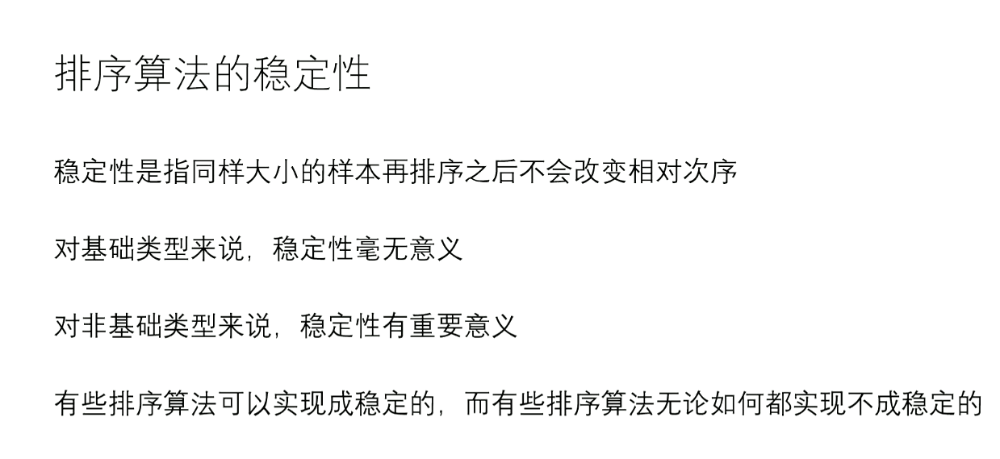

主要看处理相等值的态度

对于 归并排序 如果相等先拷贝左边 就有稳定性 
由于有时要处理小和问题 逆序对问题 对代码在数值相等时先拷贝那边做了修改  这个稳定性就不能保证


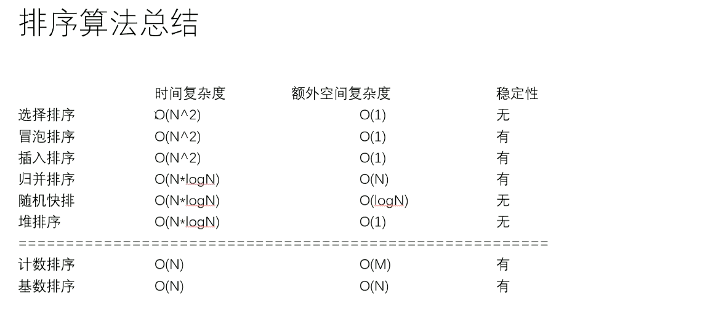

#### 排序的总结
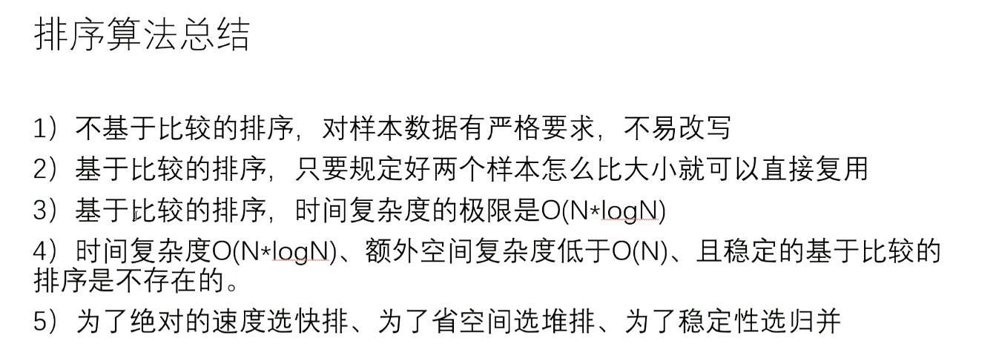
常见的坑
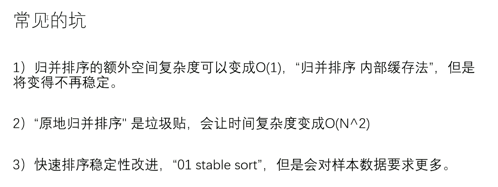

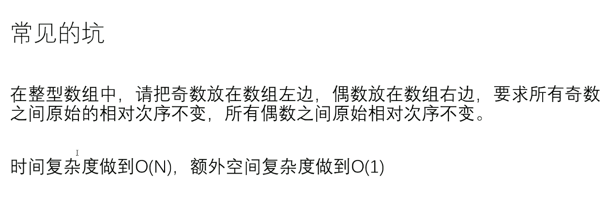

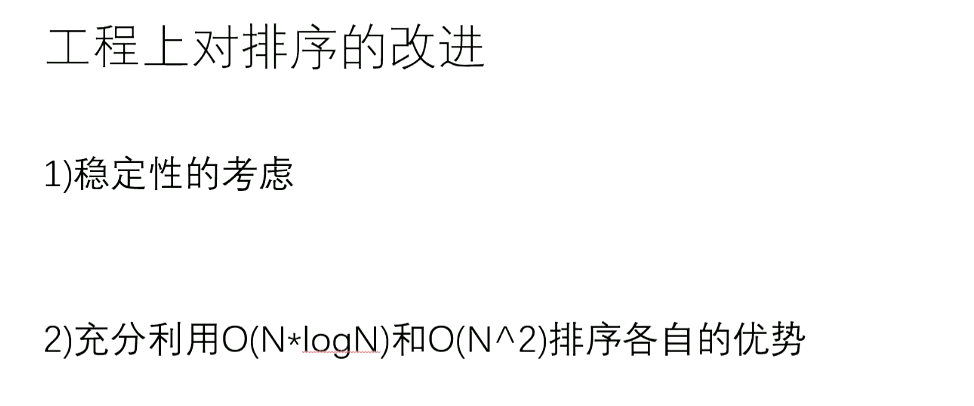

## 6 链表(笔试方法 + 面试方法)
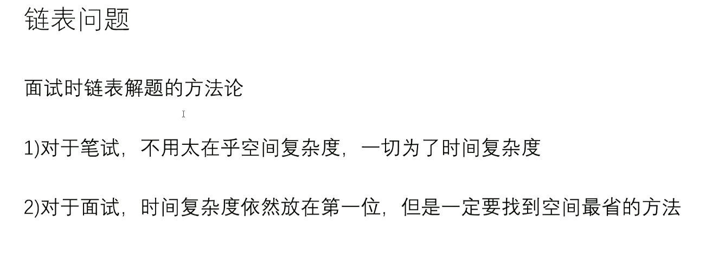

#### 面试中常用的数据结构和技巧
笔试中 要快速做出来 因此可以采用 哈希表 数组等
而面试要考虑空间复杂度

1 使用容器 (哈希表 数组) --> 省时间
2 快慢指针 --> 省空间


#### 获取链表四种格式的中点
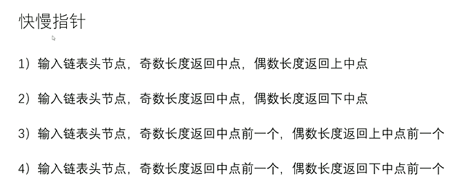

```java
public class ListGetCenter {

    ListPartitionTest test = new ListPartitionTest();


    //必须是无环节点
    //奇数中 偶数上中
    public Node getCenter1(Node head){
        if(head == null || head.next == null || head.next.next == null){
            return head;
        }
        //至少三个节点
        Node slow = head.next;
        Node fast = head.next.next;//肯定不为空
        //可以移动两下
        while(fast.next != null && fast.next.next != null){
            fast = fast.next.next;
            slow = slow.next;
        }
        return slow;
    }
    //奇数中 偶数下中
    public Node getCenter2(Node head){
        if(head == null || head.next == null){
            return head;
        }
        //至少两个节点
        Node slow = head.next;
        Node fast = head.next;
        while(fast.next != null && fast.next.next != null){
            fast = fast.next.next;
            slow = slow.next;
        }
        return slow;
    }

    public Node getCenter3(Node head){
        if(head == null || head.next == null || head.next.next == null){
            return null;
        }
        //至少三个节点
        Node slow = head;
        Node fast = head.next.next;
        while(fast.next != null && fast.next.next != null){
            fast = fast.next.next;
            slow = slow.next;
        }
        return slow;
    }

    public Node getCenter4(Node head){
        if(head == null || head.next == null){
            return null;
        }
        //至少两个节点
        Node slow = head;
        Node fast = head.next;
        while(fast.next != null && fast.next.next != null){
            fast = fast.next.next;
            slow = slow.next;
        }
        return slow;
    }

    @Test
    public void test01(){
        for (int i = 0; i < 100; i++) {
            Node head = test.createRandomNodeList(10, 10);
            int length = length(head);
            Node center1 = getCenter1(head);
            Node center2 = getCenter2(head);
            Node center3 = getCenter3(head);
            Node center4 = getCenter4(head);
            boolean flag = false;
            if(length % 2 != 0){
                //奇数
                if(center1 == center2 && center3 == center4){
                    if(center3 != null && center3.next == center1){
                        //测试成功
                        flag = true;
                    }if(center3 == null){
                        flag = true;
                    }
                }
            }else{
                if(center1 == center4){
                    if(center3 != null && center1 != null && center3.next == center1 && center1.next == center2){
                        flag = true;
                    }else if(center3 == null && center1 != null && center1.next == center2){
                        flag = true;
                    }
                }
            }
            if(!flag){
                System.out.println("失败");
                System.out.println("length = " + length);
                test.printNode(head);
                test.printNode(center1);
                test.printNode(center2);
                test.printNode(center3);
                test.printNode(center4);
                break;

            }

        }

    }

    public int length(Node head){
        int len = 0;
        while(head != null){
            head = head.next;
            len ++;
        }
        return len;
    }
}
```


#### 判断链表是否是回文
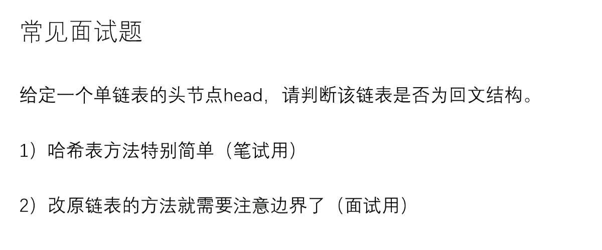

```java
public class ListPalindrome {

    ListPartitionTest listPartitionTest = new ListPartitionTest();

    //链表的反转
    public Node reverse(Node head){
        if(head == null || head.next == null){
            return head;
        }
        Node next = null;
        Node pre = null;
        Node cur = head;
        while(cur != null){
            next = cur.next;
            cur.next = pre;
            pre = cur;
            cur = next;
        }
        return pre;
    }


    public Node findCenter(Node head){
        if(head == null || head.next == null || head.next.next == null){
            return head;
        }
        Node slow = head.next;
        Node fast = head.next.next;
        while(fast.next != null && fast.next.next != null){
            fast = fast.next.next;
            slow = slow.next;
        }
        return slow;
    }
    public boolean isPalindrome1(Node head){

        if(head == null || head.next == null){
            return true;//空节点 也设置为true
        }
        //至少两个节点
        //使用一个栈
        Stack<Node> stack = new Stack<>();
        Node cur = head;
        while(cur != null){
            stack.push(cur);
            cur = cur.next;
        }
        cur = head;
        while(!stack.isEmpty()){
            if(stack.pop().value != cur.value){
                return false;
            }
            cur = cur.next;
        }
        return true;
    }

    public boolean isPalindrome2(Node head){
        //小优化 多遍历一次 栈的大小减半
        if(head == null || head.next == null){
            return true;//空节点 也设置为true
        }
        //至少两个节点
        //使用一个栈
        Stack<Node> stack = new Stack<>();
        Node cur = head;

        Node center = findCenter(head);
        while(center.next != null){
            center = center.next;
            stack.push(center);
        }

        while(!stack.isEmpty()){
            if(stack.pop().value != cur.value){
                return false;
            }
            cur = cur.next;
        }
        return true;
    }

    public boolean isPalindrome3(Node head){
        //不使用任何额外节点
        if(head == null || head.next == null){
            return true;//空节点 也设置为true
        }
        Node center = findCenter(head);
        Node reverseHead = reverse(center);

        Node curLeft = head;
        Node curRight = reverseHead;

        while(curLeft != null && curRight != null && curLeft.value == curRight.value){
            curLeft = curLeft.next;
            curRight = curRight.next;
        }
        //重新反转 不要有多余的操作
        Node reverse = reverse(reverseHead);
//        center.next = reverse;
        return curLeft == null;
    }

    //
    public Node createPalindrome(){
        Node node = listPartitionTest.createRandomNodeList(10, 10);
        Node copyNode = listPartitionTest.copyNodeList(node);
        Node cur = node;
        while(cur.next != null){
            cur = cur.next;
        }
        cur.next = reverse(copyNode);
        return node;
    }


    @Test
    public void test01(){
        Random random = new Random();
        for (int i = 0; i < 100; i++) {
            Node palindrome;
            if (random.nextBoolean()) {
                palindrome = createPalindrome();
            }else {
                palindrome = listPartitionTest.createRandomNodeList(10,10);
            }


            boolean b1 = isPalindrome1(palindrome);
            boolean b2 = isPalindrome2(palindrome);
            boolean b3 = isPalindrome3(palindrome);

            if(b1 != b2 || b2 != b3){
                System.out.println("失败");
                listPartitionTest.printNode(palindrome);
                System.out.println(b1);
                System.out.println(b2);
                System.out.println(b3);
                break;
            }

        }
    }
}
```

#### 链表的partition
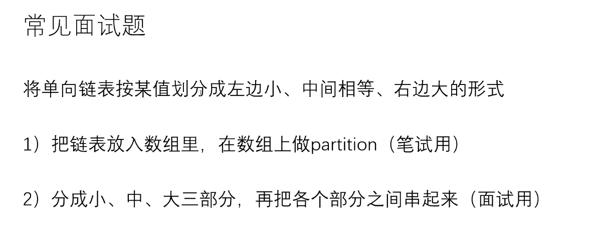
partition

```java
public class ListPartition {


    //方式一 使用容器
    public Node listPartition(Node head, int pivot){
        if(head == null || head.next == null) return head;
        int arrSize = 0;
        Node temp = head;
        while(temp != null){
            arrSize ++;
            temp = temp.next;
        }
        Node[] arr = new Node[arrSize];
        // 全部放到数组中
        temp = head;
        for (int i = 0; i < arrSize; i++) {
            arr[i] = temp;
            temp = temp.next;
        }
        partition(arr,pivot);
        //把数组连接起来
        for (int i = 0; i < arrSize - 1; i++) {
            arr[i].next = arr[i + 1];
        }
        //本来就是空 赋值不赋值都一样
        arr[arrSize - 1].next = null;
        return arr[0];
    }

    public void partition(Node[] arr,int pivot){
//        int less = -1;
//        int more = arr.length - 1;//这个more是
//        int i = 0;
//        while(i <= more){
//            if(arr[i].value == pivot){
//                i ++;
//            }else if(arr[i].value > pivot){
//                swap(arr,i,more--);
//            }else{
//                swap(arr,++less,i++);
//            }
//        }

        int less = -1;
        int more = arr.length;//这个more是
        int i = 0;
        while(i < more){
            if(arr[i].value == pivot){
                i ++;
            }else if(arr[i].value > pivot){
                swap(arr,i,--more);
            }else{
                swap(arr,++less,i++);
            }
        }

//        swap(arr,arr.length - 1,more);
    }

    public void swap(Node[] arr,int i, int j){
        Node temp = arr[i];
        arr[i] = arr[j];
        arr[j] = temp;
    }

    public Node listPartitionPro(Node head, int pivot){
        if(head == null || head.next == null) return head;
        Node smallHead = null;
        Node smallTail = null;
        Node equalHead = null;
        Node equalTail = null;
        Node greatHead = null;
        Node greatTail = null;
        Node temp = null;
        while(head != null){
            temp = head.next;//记录下个节点
            head.next = null;//断开连接 感觉不是必要的

            if(head.value < pivot){
                if(smallHead == null){
                    smallHead = head;
                    smallTail = head;
                }else{
                    smallTail.next = head;
                    smallTail = head;
                }
            }else if(head.value == pivot){
                if(equalHead == null){
                    equalHead = head;
                    equalTail = head;
                }else {
                    equalTail.next = head;
                    equalTail = head;
                }
            }else {
                if(greatHead == null){
                    greatHead = head;
                    greatTail = head;
                }else{
                    greatTail.next = head;
                    greatTail = head;
                }
            }

            head = temp;//下一个节点
        }
        //全部串起来 比较难理解
        //肯定有一块区域是有值的
        //
        if(smallHead != null){
            smallTail.next = equalHead;
            if(equalHead == null){
                smallTail.next = greatHead;
            }
        }
        if(equalHead != null){
            equalTail.next = greatHead;
        }
        return smallHead != null ? smallHead : (equalHead != null ? equalHead : greatHead);
    }
}
```

#### 带随机指针链表的复制

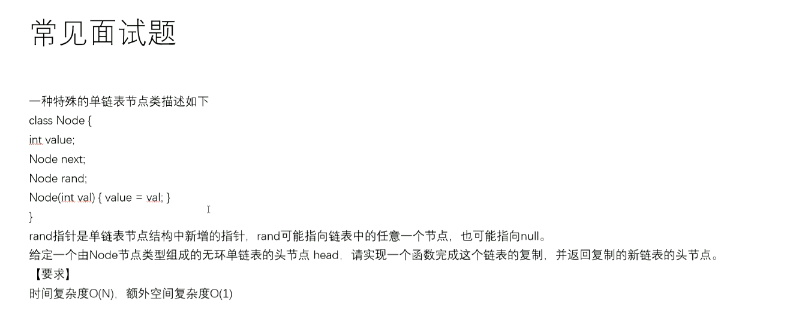

第二种方式不用哈希表的原因 : 人为构造了对应的方式 

好好写这些code都是经常考的 特别高频

还没写 
```java
public class ListRandom {
    private static final Random random = new Random();

    //随机的节点
    public static class RandNode{
        int value;
        RandNode next;
        RandNode rand;
        public RandNode(int value) {
            this.value = value;
        }
    }


    public static RandNode copyRandNodeList(RandNode head){
        HashMap<RandNode, RandNode> map = new HashMap<>();
        RandNode cur = head;
        while(cur != null){
            map.put(cur,new RandNode(cur.value));
            cur = cur.next;
        }
        cur = head;
        while(cur != null){
            map.get(cur).next = map.get(cur.next);
            map.get(cur).rand = map.get(cur.rand);
            cur = cur.next;
        }
        return map.get(head);
    }

    public static RandNode copyRandNodeListImp(RandNode head){

        if(head == null){
            return null;
        }
        RandNode cur = head;
        RandNode next = null;
        while(cur != null){
            next = cur.next;
            RandNode node = new RandNode(cur.value);
            cur.next = node;
            node.next = next;
            cur = next;
        }

        cur = head;
        while(cur != null){
            cur.next.rand = cur.rand == null ? null : cur.rand.next;
            cur = cur.next.next;
        }
        cur = head;
        RandNode retHead = cur.next;

        while(cur != null){
            next = cur.next.next;
            cur.next = next == null ? null : next.next;
            cur = next;
        }
        return retHead;
    }

    public static RandNode createRandomList(int maxLen){
        int len = random.nextInt(maxLen) + 1;
        RandNode[] randNodes = new RandNode[len];
        for (int i = 0; i < len; i++) {
            randNodes[i] = new RandNode(random.nextInt(10));
        }
        for (int i = 0; i < len; i++) {
            int rad = random.nextInt(len + 1);
            if(rad == len){
                randNodes[i].rand = null;
            }else{
                //可能指向自己
                randNodes[i].rand = randNodes[rad];
            }
            if(i != len - 1){
                randNodes[i].next = randNodes[i + 1];
            }
        }
        return randNodes[0];
    }

    public static boolean listEqual(RandNode headA,RandNode headB){
        RandNode curA = headA;
        RandNode curB = headB;

        while(curA != null){
            RandNode radA = curA.rand;
            RandNode radB = curB.rand;
            boolean valueEqual = curA.value == curB.value;
            boolean randEqual = (radA != null && radB != null && curA.rand.value == curB.rand.value)||
                    (radA == null && radB == null);
            if(!(valueEqual && randEqual)){
                return false;
            }
            curA = curA.next;
            curB = curB.next;
        }
        return true;
    }


    @Test
    public void test01(){
        for (int i = 0; i < 100; i++) {
            RandNode head = createRandomList(10);
            RandNode node1 = copyRandNodeList(head);
            RandNode node2 = copyRandNodeListImp(head);
            boolean b1 = listEqual(head, node1);
            boolean b2 = listEqual(head, node2);
            if (!b1 || !b2) {
                System.out.println("失败");
                System.out.println("b1 = " + b1);
                System.out.println("b2 = " + b2);
                System.exit(0);
            }
        }

    }
    
}
```

#### (*)两个链表第一个相交节点
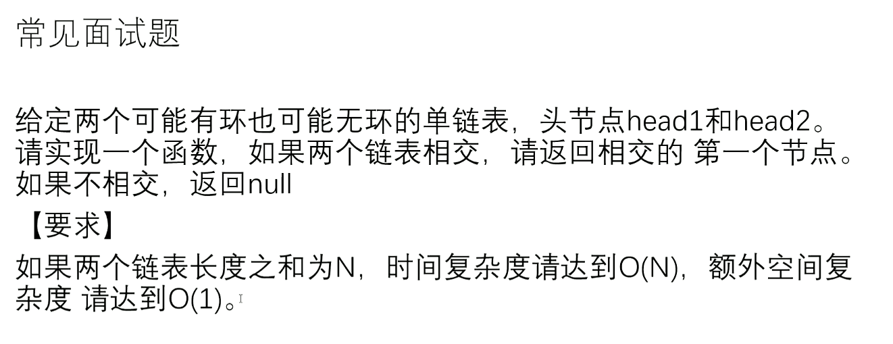
和约瑟夫环认为是链表的噩梦 

这问题最难的地方是自己会脑补出 很多不可能的出现的情况 因此不要自己吓自己 
一定要分析出可能出现的情况 而不是瞎想 因为链表只有一个next指针

可以分解为三个题
1 查找有环链表的第一个入环节点
2 查找两个无环链表的第一相交节点
3 查找两个有环链表的第一相交节点

```java
public class ListCross {


    public Node getAnyIntersectNode(Node headA, Node headB){
        if(headA == null || headB == null) return null;
        if(headA == headB) return headA;
        Node circularityNodeA = getCircularityNode(headA);
        Node circularityNodeB = getCircularityNode(headB);
        if(circularityNodeA == null && circularityNodeB == null){
            return getParallelNode(headA, headB);
        }else if(circularityNodeA != null && circularityNodeB != null){
            //对数器还是有用的 本来这里写错了 写成了 : circularityNodeA == circularityNodeB
            //通过对数器找到了原因
            return getCrossNode(headA,circularityNodeA,headB,circularityNodeB);
        }
        return null;
    }


    //获取第一个环状节点
    public Node getCircularityNode(Node head){
        if(head == null || head.next == null ||head.next.next == null) return null;
        Node fast = head.next.next;
        Node slow = head.next;
        while(slow != fast){

            //快指针走到头 说明没有环
            if(fast.next == null || fast.next.next == null){
                return null;
            }
            slow = slow.next;
            fast = fast.next.next;
        }
        //此时两种在环状某一个位置
        //下面 fast从头开始 找到第一环状节点
        fast = head;
        while(fast != slow){
            fast = fast.next;
            slow = slow.next;
        }
        //再次相遇 这就是返回值
        return fast;
    }
    //两个无环链表 两个节点不能是null
    public Node getParallelNode(Node headA, Node headB){

        Node curA = headA;
        Node curB = headB;
        int n = 0;
        while(curA.next != null){
            curA = curA.next;
            n ++;
        }
        while(curB.next != null){
            curB = curB.next;
            n --;
        }
        if(curA != curB) return null;//两者没有关系
        //下面的情况下 两者一定有交点
        //n 代表两个链表的差值
        if(n >= 0){
            curA = headA;
            curB = headB;
        }else{
            n = -n;
            curA = headB;
            curB = headA;
        }

        //n >= 0 curA 为长的 curB为短的
        while(n > 0){
            curA = curA.next;
            n --;
        }
        //两者长度一样
        while(curA != curB){
            curA = curA.next;
            curB = curB.next;
        }
        return curA;
    }

    public Node getCrossNode(Node headA,Node circleA, Node headB,Node circleB){

        if(circleA == circleB){
            //说明两者是一致的
            Node curA = headA;
            Node curB = headB;
            int n = 0;
            while(curA != circleA){
                curA = curA.next;
                n ++;
            }
            while(curB != circleB){
                curB = curB.next;
                n --;
            }
            if(n >= 0){
                curA = headA;
                curB = headB;
            }else{
                n = -n;
                curA = headB;
                curB = headA;
            }
            //n >= 0 curA 为长的 curB为短的
            while(n > 0){
                curA = curA.next;
                n --;
            }
            //两者长度一样
            while(curA != curB){
                curA = curA.next;
                curB = curB.next;
            }
            return curA;
        }else{

            Node curA = circleA.next;
            while(curA != circleA){
                if(curA == circleB){
                    return circleB;
                }
                curA = curA.next;
            }
            return null;
        }
    }


}
```

#### 神奇的问题
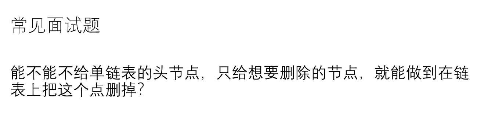

这个问题就是无解的,没有头部删除一个节点太扯了
可以使用下面比较奇怪的方法 , 但是会产生更多的问题 ,  如果面试问到 下面这种方式 回答不行然后说出三个问题
1 借尸还魂 (这种做法要求值 可以复制 并且值的复制是可行的 不会产生问题 ,更重要的是无法删除最后一个节点)
交叉
## 7 二叉树
第八节都是干货 什么树形dp (动态规划)
子树从一个节点出发包含所有子节点的树

#### 二叉树定义
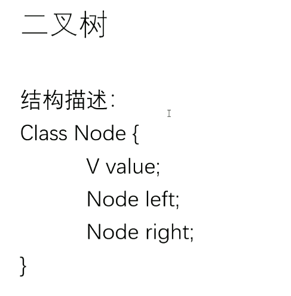
#### 二叉树的遍历
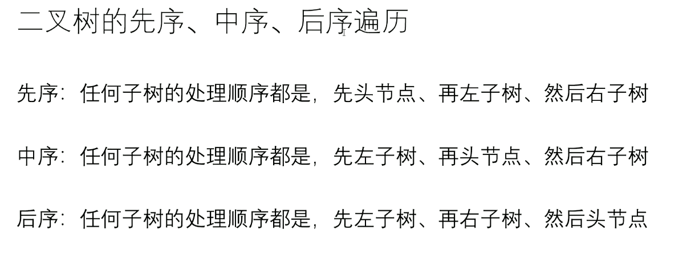

高深的总结
三种遍历本质上都是 递归序加工的结果 

```text
public void work(Tree head){
    收集信息前的准备工作
    work(head.left) //收集左树的信息
    收集完左树信息的工作
    wrok(head.right)//处理右树的信息
    收集完左树信息的工作
    整合所有信息
}
```
可以看到代码被两个递归调用分割成了三部分的信息,
每个树节点有三次处理的机会 , 把握好这三次机会 处理事情

#### 递归的方式实现二叉树的遍历


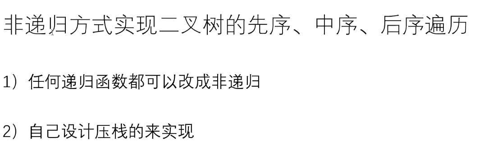

#### 按层遍历
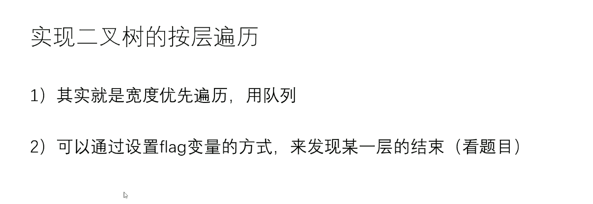

计算一层有多宽 计算一个树一层的最大宽度
求树的最大宽度
#### 序列化和反序列化 
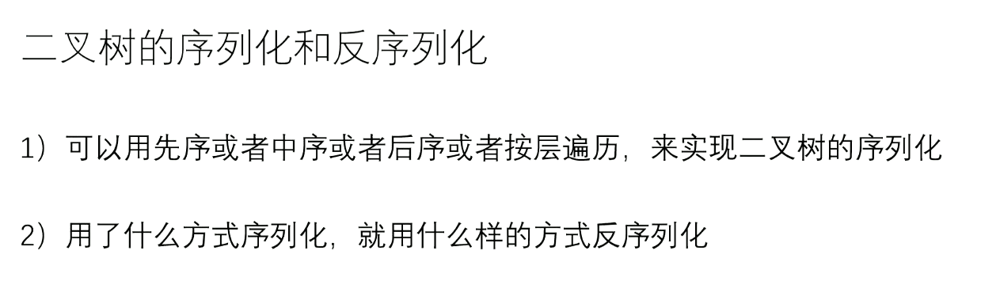

## 8 二叉树递归套路
#### 打印一颗树
1 填满成完全二叉树
2 换方向打印 比较容易实现 (右头左顺序)


这里实现的方式是第二种 

```java
public static void printTree(Node root){
        printNode(root,0,"\uD83C\uDF32",15);
    }

    public static void printNode(Node node, int level, String info, int width){
        if(node == null){
            //待会看看用不用打印空格
            return;
        }
        //先打印右孩子
        printNode(node.right,level + 1,"⬇︎",width);
        int numLen = getNumLen(node.value);
        int leftPaddingLen = (width - numLen - 2)/2;
        int rightPaddingLen = width - leftPaddingLen - numLen - 1;
        String leftPadding = getBlank(leftPaddingLen);
        String rightPadding = getBlank(rightPaddingLen);
        String blankPadding = getBlank(level * width);
        System.out.println(blankPadding + leftPadding + info +node.value + info+ rightPadding);
        printNode(node.left,level + 1,"⬆️",width);
    }

    public static int getNumLen(int num){
        int result = 0;
        while(num > 0){
            num /= 10;
            result ++;
        }
        return result;
    }

    public static String getBlank(int len){
        StringBuilder sb = new StringBuilder(len);
        for (int i = 0; i < len; i++) {
            sb.append(" ");
        }
        return sb.toString();
    }
```

打印效果如下(这里显示有问题 向下的箭头也是比较好看的)

```text
                     ⬇︎3⬇︎       
                                                   ⬇︎8⬇︎       
                                    ⬆️2⬆️       
                                                   ⬆️7⬆️       
      🌲0🌲        
                                    ⬇︎4⬇︎       
                     ⬆️4⬆️       
                                    ⬆️8⬆️       
                                                                  ⬇︎5⬇︎       
                                                   ⬆️7⬆️       
                                                                  ⬆️8⬆️   
```


#### 查找前驱和后继节点
一般刷题时 是没有向上指的parent,一般这是默认的

下面这道题 找后继和前驱


怎么找一个节点的前驱和后继 


未完成 : 待补充 


#### 题目三 纸张折叠打印折痕

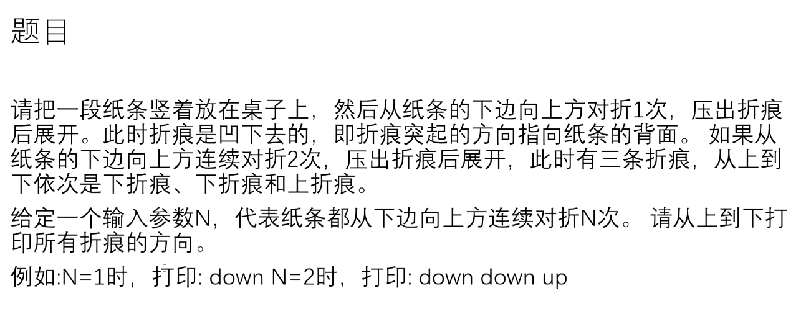


这道题先总结规律 : 中间的折痕 上面是 凹 下面是凸 

然后递归调用 

```java
public class TreePageFold {
    @Test
    public void test01(){
        printPageFold(10);
    }
    public static void printPageFold(int N){
        printPageFold(1,N,true);
    }
    public static void printPageFold(int cur,int N,boolean isConcave){
        if(cur > N) return;
        printPageFold(cur + 1,N,true);
        String str = isConcave ? "凹":"凸";
        System.out.print(str);
        printPageFold(cur + 1,N,false);
    }
}
```


#### (*) 重要

暴力递归改动态规划的套路  (代码未验证)
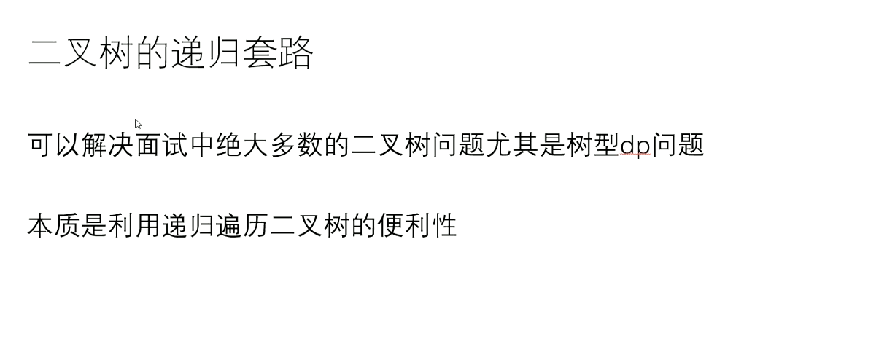
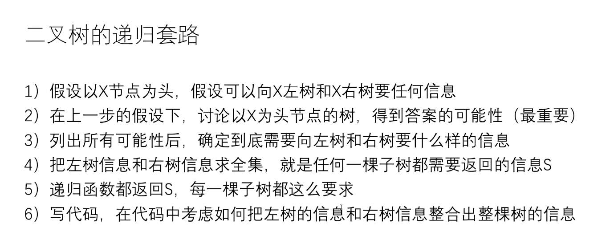

##### 题目一  判断是否是平衡树
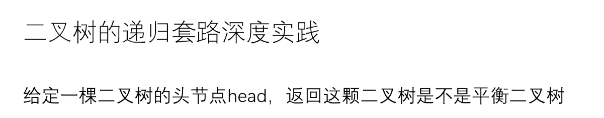

```
public class TreeAVL {

    //需要整合的信息
    public static class Info{
        int height;
        boolean isAVLTree;

        public Info(int height, boolean isAVLTree) {
            this.height = height;
            this.isAVLTree = isAVLTree;
        }
    }


    //
    public static boolean isAVLTree(Node root){
        return getTreeInfo(root).isAVLTree;
    }

    public static Info getTreeInfo(Node node){
        if(node == null){
            return new Info(0,true);
        }

        Info leftInfo = getTreeInfo(node.left);
        Info rightInfo = getTreeInfo(node.right);

        int height = Math.max(leftInfo.height, rightInfo.height) + 1;
        //左树是平衡二叉树 右树是平衡二叉树 左树高度 和 右树高度相差不超过 1
        boolean isAVLTree = leftInfo.isAVLTree && rightInfo.isAVLTree && Math.abs(leftInfo.height - rightInfo.height) < 2;
        return new Info(height,isAVLTree);
    }

```


##### 题目二 返回二叉树最大距离
常见分类 : 与X节点无关 / 与X节点有关
根据左子树的信息 + 右子树的信息 和自己的信息 加工出自己的信息 返回给父节点
这个节点的子节点的信息不再重要 (因为已经被封装给自己), 这就是动态规划的一种
我不想自己去执行 利用递归的强大的返回自己的机制去执行

1) 无关 : Max(左距离, 右距离)
2) 有关 : 我的最大值 = 左高度 + 1 + 右高度

我的高度 : max(左高度,右高度) + 1;
我的距离 : max(左距离, 右距离,左高度 + 1 + 右高度)
我的左右孩子也需要给我提供这两个信息
基本情况 :
我是null 高度为 0,距离为0
本质 拆了用 用了拆 往上给
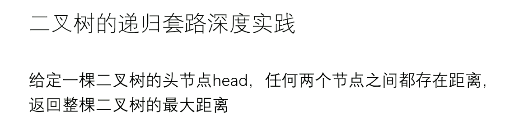


```java
public class TreeMaxLen {

    public static class Info{
        int maxLen;
        int height;

        public Info(int maxLen, int height) {
            this.maxLen = maxLen;
            this.height = height;
        }
    }

    public static int getTreeMaxLen(Node root){
        return getTreeInfo(root).maxLen;
    }

    public static Info getTreeInfo(Node node){
        if(node == null){
            return new Info(0,0);
        }
        Info leftInfo = getTreeInfo(node.left);
        Info rightInfo = getTreeInfo(node.right);
        int height = Math.max(leftInfo.height, rightInfo.height) + 1;
        int maxSubTreeLen = Math.max(leftInfo.maxLen, rightInfo.maxLen);
        int maxTreeLen = Math.max(maxSubTreeLen, leftInfo.height + rightInfo.height + 1);
        return new Info(maxTreeLen, height);
    }

}
```


##### 题目三 返回最大搜索子树头节点 
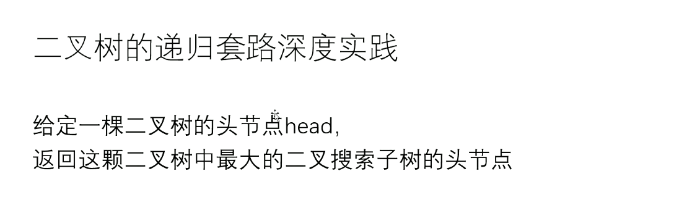


```java
public static class Info{
        Node avl;
        Integer max;
        Integer min;
        int maxBSTLen;
        boolean isAllBST;
        public Info(Node avl, Integer max, Integer min, int maxBSTLen, boolean isAllBST) {
            this.avl = avl;
            this.max = max;
            this.min = min;
            this.maxBSTLen = maxBSTLen;
            this.isAllBST = isAllBST;
        }
        public Info(int maxBSTLen, boolean isAllBST) {
            this.maxBSTLen = maxBSTLen;
            this.isAllBST = isAllBST;
        }
    }

    public static Node getMaxBSTTree(Node root){
        return getTreeInfo(root).avl;
    }

    public static Info getTreeInfo(Node node){
        if(node == null){
            return new Info(0,true);
        }

        Info leftInfo = getTreeInfo(node.left);
        Info rightInfo = getTreeInfo(node.right);

        //更新好 最大值 和最小值
        int max = node.value;
        int min = node.value;
        if(leftInfo.max != null){
            max = Math.max(max, leftInfo.max);
            min = Math.min(min, leftInfo.min);
        }
        if(rightInfo.max != null){
            max = Math.max(max, rightInfo.max);
            min = Math.min(min, rightInfo.min);
        }
        // 假设不通过 X
        Node curNode = node;//这个node可能被更新两次
        int maxBSTLen = 0;
        boolean isAllBST = false;
        if(leftInfo.maxBSTLen >= rightInfo.maxBSTLen){
            curNode = leftInfo.avl;
            maxBSTLen = leftInfo.maxBSTLen;
        }else{
            curNode = rightInfo.avl;
            maxBSTLen = rightInfo.maxBSTLen;
        }
        //如果通过
        if(leftInfo.isAllBST && rightInfo.isAllBST &&
                (leftInfo.max== null || leftInfo.max < node.value)&&
                (rightInfo.min == null|| rightInfo.min > node.value)
        ){
            curNode = node;
            maxBSTLen = leftInfo.maxBSTLen + rightInfo.maxBSTLen + 1;
            isAllBST = true;
        }
        return new Info(curNode, max, min, maxBSTLen, isAllBST);
    }
```


##### 题目四 派对最大快乐值问题
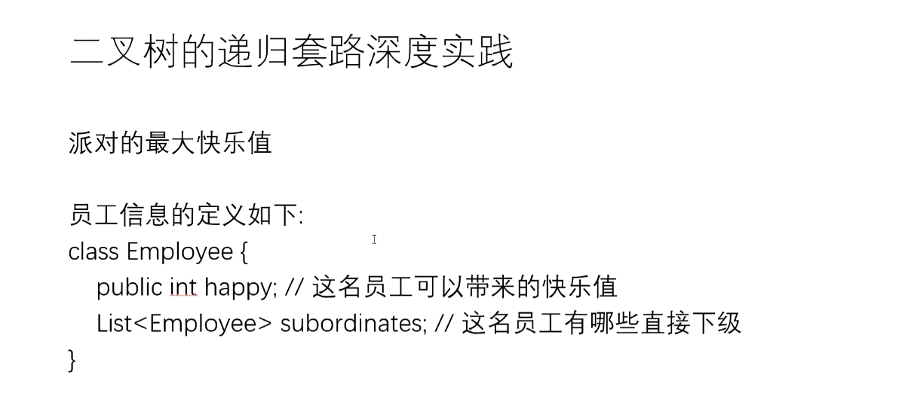
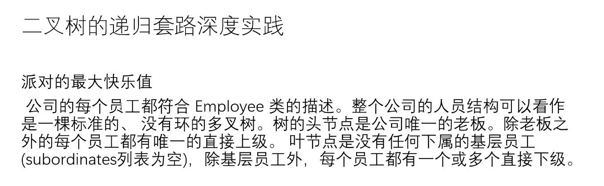

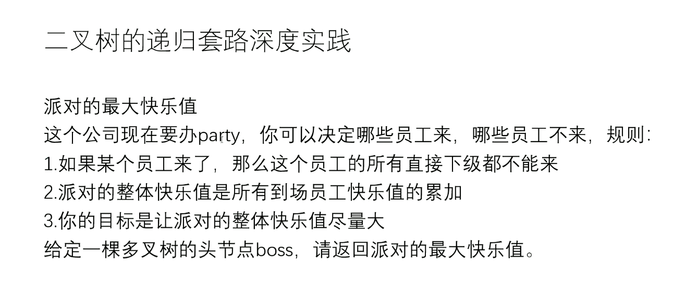

思路分析 :

一个员工来时 题目要求 其所有直接下属都 不能来 

一个员工不来时 考虑器员工来还是不来快乐值最大 

把一个员工来和不来时的最大快乐值封装 : 

调用时返回 来和不来的最大值即可

```java
public class TreeEmpHappy {

    public static class Info{
        int exist;
        int notExist;
        public Info(int exist, int notExist) {
            this.exist = exist;
            this.notExist = notExist;
        }
    }
    public static Info getTreeInfo(Emp emp){
        if(emp.nexts.isEmpty()){
            return new Info(emp.happy, 0);
        }
        int exist = emp.happy;
        int notExist = 0;

        for (Emp next : emp.nexts) {
            Info curInfo = getTreeInfo(next);
            exist += curInfo.notExist;
            notExist += Math.max(curInfo.exist, curInfo.notExist);
        }
        return new Info(exist, notExist);
    }

}

class Emp{
    public int happy;
    List<Emp> nexts;
    public Emp(int happy) {
        this.happy = happy;
        nexts = new ArrayList<>();
    }
}
```
## 9 二叉树递归套路 

```text
二叉树递归的最后 : 分类讨论 查找可能性
```


#### 题目五 判断一颗树是否是满二叉树
满二叉树满足 节点 = 2的高度次方 -1
或者是左树是满二叉树 右树是满二叉树 然后 高度相等


#### 题目六 判断一颗树是否是完全二叉树
两种方法 : 1 层序遍历
2 这个树是满二叉树
左树是完全二叉树 右树是满二叉树 左边高度比右边高一
左树是满二叉树 右树是满二叉树 左边高度比右边高一
左树是满二叉树 右树是完全二叉树 左边高度和右边相等

#### 题目七  二叉树的最低公共祖先

---

> 给定一棵二叉树的头节点head,和另外两个节点a和b。
> 返回a和b的最低公共祖先

---

```text
1 没有一个节点 不考虑
2 仅有一个节点 不考虑
3 有两个节点 
3.1 在左树上有 : 返回左树上的值
3.2 在右树上有 : 返回右树上的值
3.3 在一边和另一边有 返回头节点的值
3.4 头节点就是 返回头结点的值
```


#### 题目八 最大二叉搜索子树的头节点


## 10 贪心算法 + 并查集


#### 贪心算法方法论 

```text
贪心概念
1)最自然智慧的算法
2)用一种局部最功利的标准，总是做出在当前看来是最好的选择
3)难点在于证明局部最功利的标准可以得到全局最优解
4)对于贪心算法的学习主要以增加阅历和经验为主

贪心算法求解的标准过程
1,分析业务
2,根据业务逻辑找到不同的贪心策略
3,对于能举出反例的策略直接跳过，不能举出反例的策略要证明有效性
这往往是特别困难的，要求数学能力很高且不具有统一的技巧性

贪心算法的解题套路
1,实现一个不依靠贪心策略的解法X,可以用最暴力的尝试
2,脑补出贪心策略A、贪心策略B、贪心策略C…
3,用解法X和对数器，用实验的方式得知哪个贪心策略正确
4,不要去纠结贪心策略的证明

```


#### 贪心 - 字符串最小字典序

这一小结是上一节课的内容, 不过就放一个是在太丑 , 就重新排版

要从头到位证明

---

> 给定一个由字符串组成的数组strs,
> 必须把所有的字符串拼接起来，
> 返回所有可能的拼接结果中，字典序最小的结果

---


```text
排序一定具有传递性吗 ? (有意义的排序一定具有传递性)
因此一定要先证明我们的方法具有传递性

(对数器 生成全排列一定要注意 不要脏数据)
```


#### 贪心 - 会议宣讲安排时间

---

> 一些项目要占用一个会议室宣讲，会议室不能同时容纳两个项目的宣讲。
> 给你每一个项目开始的时间和结束的时间
> 你来安排宣讲的日程，要求会议室进行的宣讲的场次最多。
> 返回最多的宣讲场次。

---


#### 贪心 - 照亮街道

---

> 给定一个字符串str,只由X和两种字符构成。
> X表示墙，不能放灯，也不需要点亮
> '.' 表示居民点，可以放灯，需要点亮
> 如果灯放在位置，可以让i-1,和i+1三个位置被点亮
> 返回如果点亮str中所有需要点亮的位置，至少需要几盏灯

---

#### 贪心 - 分金条(霍夫曼编码)

---

> 一块金条切成两半，是需要花费和长度数值一样的铜板的。
> 比如长度为20的金条，不管怎么切，都要花费20个铜板。一群人想整分整块金条，怎么分最省铜板？
> 例如，给定数组{10,20,30，代表一共三个人，整块金条长度为60，金条要分成10,20,30三个部分。
> 如果先把长度60的金条分成10和50，花费60：再把长度50的金条分成20和30，花费50：一共花费110铜板。
> 但如果先把长度60的金条分成30和30，花费60：再把长度30金条分成10和20，花费30：一共花费90铜板。
> 输入一个数组，返回分割的最小代价。

---


#### 贪心 - 做项目 (leetcode 原题)

---

> 输入：正数数组costs、正数数组profits、正数K、正数M
> costs[i] 表示i号项目的花费
> profits[i] 表示i号项目在扣除花费之后还能挣到的钱（利润）
> K表示你只能串行的最多做k个项目
> M表示你初始的资金
> 说明：每做完一个项目，马上获得的收益，可以支持你去做下一个项目。不能并行的做项目。
> 输出：你最后获得的最大钱数。

---


#### 并查集


```text
1)有若干个样本a、b、c、d…类型假设是V
2)在并查集中一开始认为每个样本都在单独的集合里
3)用户可以在任何时候调用如下两个方法：
		boolean isSameSet(V x,V y):查询样本x和样本y是否属于一个集合
		void union(V x,V y):把x和y各自所在集合的所有样本合并成一个集合
4)isSameSet和union方法的代价越低越好
```


```java
public class UnionFind<T> {

    HashMap<T, Node<T>> nodesInfo = new HashMap<>();
    HashMap<Node<T>, Node<T>> pointMap = new HashMap<>();
    HashMap<Node<T>, Integer> pointNodesNumMap = new HashMap<>();

    public void add(T t) {
        Node<T> node = new Node<>(t);
        //注册node
        nodesInfo.put(t, node);
        //一个元素一个集合
        pointMap.put(node, node);
        pointNodesNumMap.put(node, 1);
    }

    public void addAll(List<T> all) {
        for (T t : all) {
            add(t);
        }
    }

    public boolean isRegister(T t) {
        return nodesInfo.containsKey(t);
    }

    public Node<T> getPoint(Node<T> node) {
        Stack<Node<T>> stack = new Stack<>();
        while (node != pointMap.get(node)) {
            stack.add(node);
            node = pointMap.get(node);
        }
        //扁平化处理
        while (!stack.isEmpty()) {
            pointMap.put(stack.pop(), node);//put : 更新
        }
        return node;
    }

    public boolean isSameSet(T x, T y) {
        if (!isRegister(x) || !isRegister(y)) {
            return false;
        }
        return getPoint(nodesInfo.get(x)) == getPoint(nodesInfo.get(y));
    }

    public int getPointNodesNumMapLen() {
        return pointNodesNumMap.size();
    }

    public void union(T x, T y) {
        if (!isRegister(x) || !isRegister(y)) {
            return;
        }
        //两个肯定不一样
        Node<T> xInfo = getPoint(nodesInfo.get(x));
        Node<T> yInfo = getPoint(nodesInfo.get(y));
        if (xInfo == yInfo) {
            return;
        }
        int xNum = pointNodesNumMap.get(xInfo);
        int yNum = pointNodesNumMap.get(yInfo);

        Node<T> large = xNum >= yNum ? xInfo : yInfo;
        Node<T> small = xInfo == large ? yInfo : xInfo;


        pointMap.put(small, large);
        pointNodesNumMap.remove(small);
        pointNodesNumMap.put(large, xNum + yNum);
    }


    //====== 静态的类 放到最下面得了 ==============

    public static class Node<T> {
        T val;

        public Node(T val) {
            this.val = val;
        }
    }


}
```


## 11 图 

```text

```


#### 图方法论

```text
图是什么
1)由点的集合和边的集合构成
2)虽然存在有向图和无向图的概念，但实际上都可以用有向图来表达
3)边上可能带有权值


图的表示 
邻接表
邻接矩阵
其他众多


面试怎么办
图的面试题如何搞定
图的算法都不算难，只不过coding的代价比较高
1)先用自己最熟练的方式，实现图结构的表达
2)在自己熟悉的结构上，实现所有常用的图算法作为模板
3)把面试题提供的图结构转化为自己熟悉的图结构，再调用模板或改写即可
```


图的定义 可以不用泛型, 更简单一点

```java
public class Node<N, E> {
    N val;
    int in;
    int out;
    ArrayList<Node<N,E>> nexts = new ArrayList<>();
    ArrayList<Edge<N,E>> edges = new ArrayList<>();
    public Node(N val) {
        this.val = val;
    }
}


public class Edge<N, E>{
    E weight;
    Node<N, E> from;
    Node<N, E> to;
    public Edge(E weight, Node<N, E> from, Node<N, E> to) {
        this.weight = weight;
        this.from = from;
        this.to = to;
    }
}


public class Graph<N, E> {
    //图 由点集和边集组成
    HashMap<N, Node<N, E>> nodes = new HashMap<>();
    HashSet<Edge<N, E>> edges = new HashSet<>();
}
```


将一个陌生的图转换成一个熟悉的图

```java
public class GraphGenerate {

    public static Graph<Integer, Integer> generateGraphByTriad(Integer[][] matrix) {
        Graph<Integer, Integer> graph = new Graph<>();
        for (Integer[] integers : matrix) {
            Integer weight = integers[0];
            Integer from = integers[1];
            Integer to = integers[2];
            if (!graph.nodes.containsKey(from)) {
                Node<Integer, Integer> node = new Node<>(from);
                graph.nodes.put(from, node);
            }
            if (!graph.nodes.containsKey(to)) {
                Node<Integer, Integer> node = new Node<>(to);
                graph.nodes.put(to, node);
            }
            // 此时 nodes中一定有from 和 to对应的节点
            Node<Integer, Integer> fromNode = graph.nodes.get(from);
            Node<Integer, Integer> toNode = graph.nodes.get(to);
            Edge<Integer, Integer> edge = new Edge<>(weight, fromNode, toNode);
            graph.edges.add(edge);
            //对 图的中的节点进行调整
            fromNode.nexts.add(toNode);
            fromNode.out++;
            fromNode.edges.add(edge);
            toNode.in++;
        }
        return graph;
    }
}
```


#### 深度优先遍历 DFS


```text
深度优先遍历就不得不用到栈 
然后使用 一个HashSet记录值 一个节点是否被遍历过
栈不为空一直遍历, 栈空退出
这个栈里面的内容其实就是访问路径

```

```java
public class Code02DFS {


    public static <N, E> void DFS(Node<N, E> node) {
        if (node == null) {
            return;
        }
        //记录那个节点被访问过
        HashSet<Node<N, E>> flag = new HashSet<>();
        //记录深度优先的路径
        Stack<Node<N, E>> stack = new Stack<>();
        flag.add(node);
        System.out.println(node.val);
        stack.add(node);
        while (!stack.isEmpty()) {
            Node<N, E> pop = stack.pop();
            for (Node<N, E> next : pop.nexts) {
                if (!flag.contains(next)) {
                    stack.add(pop);
                    stack.add(next);
                    flag.add(next);
                    System.out.println(next.val);
                    break;
                }
            }
        }
    }

}
```


#### 广度优先遍历 BFS


```text
提到宽度优先遍历就不得不提 使用一个结构 : 队列 
遍历到的所有的节点放到 队列中. 然后如果队列不为null, 就从中取

注意需要一个HashSet 记录那些记录被取过
```


```java
public class Code01BFS {
    //宽度优先遍历
    public static <N, E> void BFS(Node<N, E> node) {
        if (node == null) {
            return;
        }
        HashSet<Node<N, E>> flag = new HashSet<>();
        Queue<Node<N, E>> queue = new LinkedList<>();
        queue.add(node);
        flag.add(node);
        while (!queue.isEmpty()) {
            Node<N, E> poll = queue.poll();
            System.out.println(poll.val);
            for (Node<N, E> next : poll.nexts) {
                if (!flag.contains(next)) {
                    flag.add(next);
                    queue.add(next);
                }
            }
        }
    }
}
```


#### 拓扑排序

---

> 图的拓扑排序算法
> 1)在图中找到所有入度为0的点输出
> 2)把所有入度为0的点在图中删掉，继续找入度为0的点输出，周而复始
> 3)图的所有点都被删除后，依次输出的顺序就是拓扑排序
> 要求：有向图且其中没有环
> 应用：事件安排、编译顺序

---


```java
public class Code03TopologySort {


    public static <N, E> List<Node<N, E>> sortedTopology(Graph<N, E> graph) {
        ArrayList<Node<N, E>> list = new ArrayList<>();

        Queue<Node<N, E>> zeroInQueue = new LinkedList<>();
        HashMap<Node<N, E>, Integer> inMap = new HashMap<>();

        for (Node<N, E> node : graph.nodes.values()) {
            inMap.put(node, node.in);
            if (node.in == 0) {
                zeroInQueue.add(node);
            }
        }

        while (!zeroInQueue.isEmpty()) {
            Node<N, E> poll = zeroInQueue.poll();
            list.add(poll);
            for (Node<N, E> next : poll.nexts) {
//                next.in --; 不应该改变图的结构
                inMap.put(next, inMap.get(next));
                if (inMap.get(next) == 0) {
                    zeroInQueue.add(next);
                }
            }
        }
        return list;
    }

}

```


#### 最小生成树 - Kruskal

---

> 1)总是从权值最小的边开始考虑，依次考察权值依次变大的边
> 2)当前的边要么进入最小生成树的集合，要么丢弃
> 3)如果当前的边进入最小生成树的集合中不会形成环，就要当前边
> 4)如果当前的边进入最小生成树的集合中会形成环，就不要当前边
> 5)考察完所有边之后，最小生成树的集合也得到了

---


```text
Kruskal算法是一种贪心算法，我们将图中的每个edge按照权重大小进行排序，每次从边集中取出权重最小且两个顶点都不在同一个集合的边加入生成树中！注意：如果这两个顶点都在同一集合内，说明已经通过其他边相连，因此如果将这个边添加到生成树中，那么就会形成环！这样反复做，直到所有的节点都连接成功！
```


```java
public class Code04Kruskal {
    public static <N> Set<Edge<N, Integer>> kruskal(Graph<N, Integer> graph) {
        //使用并查集
        UnionFind<N, Integer> unionFind = new UnionFind<>();
        //并查集初始化
        unionFind.addAll(graph.nodes.values());
        //edge小根堆
        PriorityQueue<Edge<N, Integer>> heap = new PriorityQueue<>((a,b) -> a.weight - b.weight);
        heap.addAll(graph.edges);
        //要返回的东西
        HashSet<Edge<N,Integer>> ansSet = new HashSet<>();
        while (!heap.isEmpty()) {
            Edge<N, Integer> poll = heap.poll();
            //如果不是一个集合
            if (!unionFind.isSameSet(poll.from, poll.to)) {
                ansSet.add(poll);
                unionFind.union(poll.from, poll.to);
            }
        }
        return ansSet;
    }
}
```


并查集 

```java
public class UnionFind<N, E>{

    HashMap<Node<N, E>, Node<N, E>> pointHead = new HashMap<>();
    HashMap<Node<N, E>, Integer> pointNodeNums = new HashMap<>();

    public void addAll(Collection<Node<N,E>> nodes) {
        for (Node<N, E> node : nodes) {
            add(node);
        }
    }

    public void add(Node<N, E> node) {
        pointHead.put(node, node);
        pointNodeNums.put(node, 1);
    }

    public Node<N, E> getPoint(Node<N, E> node) {
        Stack<Node<N, E>> stack = new Stack<>();
        while (node != pointHead.get(node)) {
            stack.push(node);
            node = pointHead.get(node);
        }
        //扁平化处理
        while (!stack.isEmpty()) {
            pointHead.put(stack.pop(), node);
        }
        return node;
    }

    public boolean isSameSet(Node<N, E> x, Node<N, E> y) {
        return getPoint(x) == getPoint(y);
    }


    public void union(Node<N, E> x, Node<N, E> y) {
        if (isSameSet(x, y)) {
            return;
        }

        Node<N, E> pointX = getPoint(x);
        Node<N, E> pointY = getPoint(y);

        Integer pointXNum = pointNodeNums.get(pointX);
        Integer pointYNum = pointNodeNums.get(pointY);

        Node<N, E> large = pointXNum >= pointYNum ? pointX : pointY;
        Node<N, E> small = pointX == large ? pointY : pointX;

        pointHead.put(small, large);

        pointNodeNums.put(large, pointXNum + pointYNum);
        pointNodeNums.remove(small);
    }


}
```


#### 最小生成树 - Prim

---

> 1. 建立边set用来存放结果，建立节点set用来存放节点同时用于标记是否被访问过，建立边的最小堆
> 2. 开始遍历所有节点，如果没有访问，则添加到节点set，然后将其相连的边入堆。
> 3. 从堆中取最小的边，然后判断to节点是否被访问过，如果没有，将这个边加入生成树（我们想要的边），并标记该节点访问。
> 4. 然后将to节点所相连的边添加到最小堆中，不然这个网络就不会向外扩展了（这个步骤是必须的）。
> 5. 循环上面的操作，直到所有的节点遍历完。

---


```text
Prim算法是另一种贪心算法，和Kuskral算法的贪心策略不同，Kuskral算法主要对边进行操作，而Prim算法则是对节点进行操作，每次遍历添加一个点，这时候我们就不需要使用并查集了。
```


```java
public class Code05Prim {

    public static <N> Set<Edge<N, Integer>> prim(Graph<N, Integer> graph) {

        HashSet<Node<N, Integer>> activeNode = new HashSet<>();
        HashSet<Edge<N, Integer>> usedSet = new HashSet<>();
        PriorityQueue<Edge<N, Integer>> heap = new PriorityQueue<>((a, b) -> a.weight - b.weight);
        Set<Edge<N, Integer>> ans = new HashSet<>();
        for (Node<N, Integer> node : graph.nodes.values()) {
            if (activeNode.contains(node)) {
                continue;
            }
            activeNode.add(node);
            for (Edge<N, Integer> edge : node.edges) {
                if (!usedSet.contains(edge)) {
                    heap.add(edge);
                    usedSet.add(edge);
                }
            }
            while (!heap.isEmpty()) {
                Edge<N, Integer> poll = heap.poll();
                if (!activeNode.contains(poll.to)) {
                    //可以进行操作 因为之前没有被激活
                    ans.add(poll);//确定是没有激活的节点后再加入
                    activeNode.add(poll.to);
                    for (Edge<N, Integer> edge : poll.to.edges) {
                        if (!usedSet.contains(edge)) {
                            heap.add(edge);
                            usedSet.add(edge);
                        }
                    }
                }
            }
        }
        return ans;
    }

}
```


## 12 Dijkstra + 暴力递归


```text
笔记
1 整明白堆, 如何把堆上的一个对象修改了, 然后通知堆,令其调整
2 感受暴力递归的美 -> 最朴素的自然智慧
```


#### Dijkstra算法

---

> Diikstra算法
> l) Dijkstra:算法必须指定一个源点
> 2)生成一个源点到各个点的最小距离表，一开始只有一条记录，即原点到自
> 己的最小距离为0，源点到其他所有点的最小距离都为正无穷大
> 3)从距离表中拿出没拿过记录里的最小记录，通过这个点发出的边，更新源
> 点到各个点的最小距离表，不断重复这一步
> 4)源点到所有的点记录如果都被拿过一遍，过程停止，最小距离表得到了

---

```text
上面对这个算法的描述已经很清晰了 不再重复分析
从 getNodeWithoutUsed这个静态方法 可以看出 我们每次都要遍历一下这个map 
而我们会调用N 次这个方法  因此复杂度 是 O(N^2)
我们思考一下 如果 我们把这个hashMap换成一个堆 是不是 我们每次从堆中取数据 
在堆中的操作是O(logN)
因此复杂度O(N * logN) 这可是极大的提升 
```


```java
public class Code06Dijkstra {
    public static <N> Node<N, Integer> getNodeWithoutUsed(HashMap<Node<N, Integer>, Integer> ans, HashSet<Node<N, Integer>> used) {
        int min = Integer.MAX_VALUE;
        Node<N, Integer> minNode = null;
        for (Map.Entry<Node<N, Integer>, Integer> entry : ans.entrySet()) {
            if (!used.contains(entry.getKey()) && entry.getValue() < min) {
                min = entry.getValue();
                minNode = entry.getKey();
            }
        }
        return minNode;
    }
    public static <N> HashMap<Node<N, Integer>, Integer> dijkstra(Node<N, Integer> inNode) {
        HashMap<Node<N, Integer>, Integer> ans = new HashMap<>();
        HashSet<Node<N, Integer>> used = new HashSet<>();
        ans.put(inNode, 0);
        Node<N, Integer> node = getNodeWithoutUsed(ans, used);
        while (node != null) {
            Integer distance = ans.get(node);
            for (Edge<N, Integer> edge : node.edges) {
                if (ans.containsKey(edge.to)) {
                    //包含
                    ans.put(edge.to,Math.min(ans.get(edge.to), distance + edge.weight));
                } else {
                    //不包含
                    ans.put(edge.to, distance + edge.weight);
                }
            }
            used.add(node);//添加到黑名单
            node = getNodeWithoutUsed(ans, used);
        }
        return ans;
    }
}
```


#### 使用自己定制的堆优化Dijkstra算法

```
上面已经分析了如何实现 
这里我们分析自己定制的堆要有什么额外功能
1 update : 我们在操作过程中更新最小值 因此堆中的数据会发生改变
2 ignore : 我们使用过的数据 不应该再次使用 如果我们再次添加 应该忽略
3 

insertHeapify 从上向下调整
heapify 从小到上调整 

我草这玩意我写了三遍, 老是出错, 建议 : 一定要把堆结构整明白
这里的代码还是很不错的 建议反复写
```


如果看不懂 请你复习堆的内容

```java
public class Code07Dijkstra {


    public static HashMap<Node<Integer, Integer>, Integer> dijkstra(Node<Integer, Integer> node) {
        HashMap<Node<Integer, Integer>, Integer> ans = new HashMap<>();
        NodeHeap heap = new NodeHeap(50);
        heap.addOrUpdateOrIgnore(node,0);
        while (!heap.isEmpty()) {
            NodeRecord record = heap.pop();
            int distance = record.distance;
            Node<Integer, Integer> popNode = record.node;
            for (Edge<Integer, Integer> edge : popNode.edges) {
                Node<Integer, Integer> to = edge.to;
                heap.addOrUpdateOrIgnore(to,distance + edge.weight);
            }
            ans.put(popNode,distance);
        }
        return ans;
    }


    //最小堆中的基本单元
    public static class NodeRecord {
        Node<Integer,Integer> node;
        int distance;
        public NodeRecord(Node<Integer, Integer> node, int distance) {
            this.node = node;
            this.distance = distance;
        }
    }

    public static class NodeHeap {
        int size;
        Node<Integer,Integer>[] arr;
        HashMap<Node<Integer, Integer>, Integer> distanceMap = new HashMap<>();
        HashMap<Node<Integer,Integer>, Integer> indexMap = new HashMap<>();
        public NodeHeap(int maxSize) {
            arr = new Node[maxSize];
        }

        public boolean isEmpty() {
            return size == 0;
        }

        private void swap(int i, int j) {
            indexMap.put(arr[i], j);
            indexMap.put(arr[j], i);
            Node temp = arr[i];
            arr[i] = arr[j];
            arr[j] = temp;
        }

        public void insertHeapify(int index) {
            while (distanceMap.get(arr[index])< distanceMap.get(arr[(index - 1) / 2])) {
                swap(index, (index - 1)/2);
                index = (index - 1) / 2;
            }
        }

        public void heapify(int index, int size) {
            int left = index * 2 + 1;
            while (left < size) {
                int min = left + 1 < size && distanceMap.get(arr[left + 1]) < distanceMap.get(arr[left]) ? left + 1 : left;
                if (distanceMap.get(arr[min]) >= distanceMap.get(arr[index])) {
                    return;
                }
                swap(min, index);
                index = min;
                left = index * 2 + 1;
            }
        }

        public NodeRecord pop() {
            if (isEmpty()) {
                return null;
            }
            Node<Integer, Integer> node = arr[0];
            NodeRecord record = new NodeRecord(node, distanceMap.get(node));
            distanceMap.remove(node);
            indexMap.put(node, -1);
            size --;
            swap(0,size);
            heapify(0,size);
            return record;
//            NodeRecord nodeRecord = new NodeRecord(arr[0], distanceMap.get(arr[0]));
//            swap(0, size - 1);
//            indexMap.put(arr[size - 1], -1);
//            distanceMap.remove(arr[size - 1]);
//            // free C++同学还要把原本堆顶节点析构，对java同学不必
//            arr[size - 1] = null;
//            heapify(0, --size);
//            return nodeRecord;
        }

        public boolean isHeap(Node<Integer,Integer> node) {
            return isEntered(node) && indexMap.get(node) != -1;
        }

        public boolean isEntered(Node<Integer,Integer> node) {
            return indexMap.containsKey(node);
        }

        public void addOrUpdateOrIgnore(Node<Integer,Integer> node, int distance) {
            if (isHeap(node)) {
                //修改
                Integer i = indexMap.get(node);
                distanceMap.put(node,Math.min(distanceMap.get(node), distance));
                insertHeapify(i);
            }
            if (!isEntered(node)) {
                //添加
                arr[size] = node;
                indexMap.put(node,size);
                distanceMap.put(node,distance);
                insertHeapify(size);
                size ++;
            }
            //忽略
        }
    }
    public static void main(String[] args) {
        Integer[][] martix = {{1,1,4},{6,1,3},{8,1,2},{1,2,5},{4,3,5},{8,4,5},{2,4,3},{2,3,2},};
        Graph<Integer, Integer> graph = GraphGenerate.generateGraphByTriad(martix);
        HashMap<Node<Integer, Integer>, Integer> ans = dijkstra(graph.nodes.get(1));
        ans.entrySet().forEach(System.out::println);
    }
}
```


#### 暴力递归概念指导

> 暴力递归就是尝试
> 1,把问题转化为规模缩小了的同类问题的子问题
> 2,有明确的不需要继续进行递归的条件(base case)
> 3,有当得到了子问题的结果之后的决策过程
> 4,不记录每一个子问题的解

#### 暴力递归尝试 - 汉诺塔

> 打印n层汉诺塔从最左边移动到最右边的全部过程

---

```text
我们先把这个问题分解 如果我是一个老和尚 我可以命令小和尚做事情
1 我命令小和尚把 1-N-1 的圆盘从 左边 移动到 中间
2 我把第N个圆盘 从 左边 移动到 右边
3 我命令小和尚把 1-N-1 的圆盘从 中间 移动到 右边
那小和尚怎么做 : 如果小和尚也有下级 , 那么他重复类似的过程即可

basecase : N == 1 直接移动即可

结论 : N层汉诺塔问题 最优解为 2的N次方-1次移动

```

```java
public class Code01Hanoi {


    public static void move(String from, String to) {
        System.out.println(from + " -> " + to);
    }

    public static void hanoi(int height, String from, String to, String help) {
        if (height == 1) {
            move(from, to);
        } else {
            hanoi(height - 1, from, help, to);
            move(from, to);
            hanoi(height - 1, help, to, from);
        }
    }

    public static void hanoi(int height) {
        if (height >= 1) {
            hanoi(height, "A","C","B");
        }
    }

    public static void main(String[] args) {
        hanoi(5);
    }

}
```

#### 递归可以存放数据

---

> 仰望好的尝试？
> 给你一个栈，请你逆序这个栈，
> 不能申请额外的数据结构，
> 只能使用递归函数。如何实现？

---

```text
这里的代码很神奇 
本题如果很难理解可以使用很小的例子 画图模拟过程 如此很好理解
这里的代码给我们的启发 : 系统栈可以存放数据 在某些场合中 请利用好这个机制
```

```java
public class Code04ReverseStackUsingRecursive {

    //只使用递归完成 stack的反转
    public static<T> void reverse(Stack<T> stack) {
        if (!stack.isEmpty()) {
            T bottom = popFromBottom(stack);
            reverse(stack);
            stack.add(bottom);
        }
    }
    //只使用递归完成 stack的反转
    public static<T> T popFromBottom(Stack<T> stack) {
        T pop = stack.pop();
        if (stack.isEmpty()) {
            return pop;
        } else {
            T ans = popFromBottom(stack);
            stack.add(pop);
            return ans;
        }
    }
    public static void main(String[] args) {
        Stack<Integer> stack = new Stack<>();
        stack.push(1);
        stack.push(2);
        stack.push(3);
        System.out.println(stack);
        reverse(stack);
        System.out.println(stack);
    }
}
```


## 13 暴力递归


#### 笔记

```text
把问题分解为大小变小 问题不变

区分定义 : 子串 & 子序列
子串 : 连续的序列 
子序列 : 可以不连续 但是顺序是一致的

在暴力递归中区分两个概念 : 过滤 & 分支限界
过滤 : 在暴力递归完成后 对数据进行过滤筛选 得到结果的过程
分支限界 : 在暴力递归的过程中 对数据状况进行判断 如果可以决策出那些子规模可以不用调用 则不调用
显然 : 如果可以在分支限界中完成对数据的筛选效率更高 

下面进行了应用
不重复的子序列 用到了 过滤
不重复的全排列 用到了 分支限界

以后会补充四种递归尝试模型 本节主要是 从左到右 这四种模型可以概况绝大多数题目
1 四种尝试模型属于组织上的尝试 这种尝试是模糊的笼统的,需要更深入的思考
2 确定了尝试模型后, 进行具体的分类讨论 讨论出可能性,这里的讨论是具体的, 是要指导代码编写的
3 不同的尝试模型 + 在该模型上的不同讨论 => 同一道题的答案 ,因此同一道题可能有多种解决方案
4 如何迅速定位尝试模型并且分类讨论出答案需要大量的练习 


```


#### 递归尝试模型 从左到右


##### 题目一 子序列 

---

> 打印一个字符串的全部子序列
> 打印一个字符串的全部子序列，要求不要出现重复字面值的子序列

---

```text
首先选择尝试模型 : 从左到右
选择当前分类的基本模式 : 该字符出现 | 不出现
至此问题已经解决 : 
我们来到一个节点时  选择要还是不要这个节点继续向下执行即可

basecase : 来到末尾 把结果放到result
注意使用 StringBuilder时 记得把数据吐出来 不要脏数据 由于String是不可变对象 因此没有此顾虑

如果去重 把List换成set -> 过滤
```

```java
public class Code02PrintAllSubsequences {

    public static List<String> getAllSubsequences(String str) {
        ArrayList<String> ans = new ArrayList<>();
        if (str == null || str.length() == 0) {
            return ans;
        }
        char[] chs = str.toCharArray();
        //getAllSubsequences(chs, 0, new StringBuilder(), ans);
        getAllSubsequences(chs, 0, "", ans);
        return ans;
    }

    public static Set<String> getAllSubsequences2(String str) {
        HashSet<String> set = new HashSet<>();
        if (str == null || str.length() == 0) {
            return set;
        }
        char[] chs = str.toCharArray();
        getAllSubsequences(chs, 0, new StringBuilder(), set);
        return set;
    }

    //打印所有的子序列
    public static void getAllSubsequences(char[] chs, int index, StringBuilder prefix, List<String> ans) {
        if (index == chs.length) {
            ans.add(prefix.toString());
            return;
        }
        getAllSubsequences(chs, index + 1, prefix, ans);
        getAllSubsequences(chs, index + 1, prefix.append(chs[index]), ans);
        //由于 sb 是可变对象 因此注意 删除添加的 不要脏数据 改成String就没有这个问题
        prefix.deleteCharAt(prefix.length() - 1);
    }

    public static void getAllSubsequences(char[] chs, int index, StringBuilder prefix, HashSet<String> ans) {
        if (index == chs.length) {
            ans.add(prefix.toString());
            return;
        }
        getAllSubsequences(chs, index + 1, prefix, ans);
        getAllSubsequences(chs, index + 1, prefix.append(chs[index]), ans);
        //由于 sb 是可变对象 因此注意 删除添加的 不要脏数据 改成String就没有这个问题
        prefix.deleteCharAt(prefix.length() - 1);
    }

    public static void getAllSubsequences(char[] chs, int index, String prefix, List<String> ans) {
        if (index == chs.length) {
            ans.add(prefix);
            return;
        }
        getAllSubsequences(chs, index + 1, prefix, ans);
        getAllSubsequences(chs, index + 1, prefix + chs[index], ans);
    }

    public static void main(String[] args) {
        String str = "aabc";
        List<String> allSubsequences = getAllSubsequences(str);
        for (Object o : allSubsequences) {
            System.out.println(o);
        }

        getAllSubsequences2(str).forEach(System.out::println);

    }
```


##### 题目二 全排列

----

>打印一个字符串的全部排列
>
>打印一个字符串的全部排列，要求不要出现重复的排列

---

```text
首先选择尝试模型 : 从右到左
选择分类的基本模式 : 当前的位置和 后面的任意一个位置交换
至此问题基本解决 :
我们不断交换数组中的元素达到目的

basecase : 来到最后位置

注意 : 交换完成后记得换回来, 不要脏数据

如何去重 : 使用一个hashSet,如果当前的位置的元素已经使用过 就不再递归执行
```

```java
public class Code03PrintAllPermutations {

    public static List<String> permutations(String str) {
        ArrayList<String> ans = new ArrayList<>();
        if (str == null || str.length() == 0) {
            return ans;
        }
        char[] chs = str.toCharArray();
        permutations(chs, 0, ans);
        return ans;
    }


    public static void permutations(char[] chs, int index, ArrayList<String> ans) {
        if (index == chs.length) {
            ans.add(new String(chs));
        }
        for (int i = index; i < chs.length; i++) {
            swap(chs, i, index);
            permutations(chs, index + 1,ans);
            swap(chs, i, index);
        }
    }

    public static void swap(char[] chs, int i, int j) {
        char temp = chs[i];
        chs[i] = chs[j];
        chs[j] = temp;
    }
    public static List<String> permutations2(String str) {
        ArrayList<String> ans = new ArrayList<>();
        if (str == null || str.length() == 0) {
            return ans;
        }
        char[] chs = str.toCharArray();
        permutations2(chs, 0, ans);
        return ans;
    }

    public static void permutations2(char[] chs, int index, ArrayList<String> ans) {
        if (index == chs.length) {
            ans.add(new String(chs));
        }
        //使用hashSet实现去重 这里的去重称之为 分支限界
        HashSet<Character> used = new HashSet<>();
        for (int i = index; i < chs.length; i++) {
            if (!used.contains(chs[i])) {
                used.add(chs[i]);
                swap(chs, i, index);
                permutations2(chs, index + 1,ans);
                swap(chs, i, index);
            }

        }
    }

    public static void main(String[] args) {
        List<String> permutations = permutations("1244");
        permutations.forEach(System.out::println);
        System.out.println("==============================");
        List<String> strings = permutations2("1244");
        strings.forEach(System.out::println);
        System.out.println("=================");
        System.out.println(permutations.size());
        System.out.println(strings.size());
    }

}

```


##### 题目三   Facebook面试题

---

> 规定1和A对应、2和B对应、3和C对应.
> 那么一个数字字符串比如"111”就可以转化为：
> "AAA"、"KA"和"AK"
> 给定一个只有数字字符组成的字符串str，返回有多少种转化结果

---

```text
首先选择尝试模型 : 从左到右
选择分类的基本模式 : 当前字符可以和下一个字符合并 | 不能合并
至此问题已经解决 :
我们来到一个节点时 : 如果可以合并 返回可以合并和不合并的情况总和 : 如果不可以合并 返回不合并的情况数

basecase : 来到了末尾 返回1;
basecase : 遇到了0 发挥0
其他情况 : 不断调用子过程

需要注意的是 "10"这个串 
如果我们选择了 1 一旦遇到0 是无法处理的
而 10是可以被一起处理成 J的
因此有个basecase很特殊 : 如果遇到0不再向下处理直接返回
```

---

```java
public class Code06ConvertToLetterString {


    public static int getConditionCount(String str) {
        return getConditionCount(str.toCharArray(),0);
    }

    public static int getConditionCount(char[] chs, int i) {
        if (i == chs.length) {
            return 1;
        }
        //chs[i] = '0'-'9'
        if (chs[i] == '0') {
            //独自面对一个0 返回0 因为我无法独自面对0 这种情况被杀死
            return 0;
        }
        //chs[i] = '1'-'9'
        if (chs[i] == '1') {
            int ans = getConditionCount(chs, i + 1);
            if (i + 1 < chs.length) {
                //存在下一个 存在就肯定能组合
                ans += getConditionCount(chs, i + 2);
            }
            return ans;
        }
        if (chs[i] == '2') {
            int ans = getConditionCount(chs, i + 1);
            //20 - 26对应字母 超过26就没有了
            if (i + 1 < chs.length&& chs[i + 1] <= '6' && chs[i + 1] >= '0') {
                ans += getConditionCount(chs, i + 2);
            }
            return ans;
        }
        //chs[i] = '3'-'9' 只有一条分支 就是向下走一格
        return getConditionCount(chs, i + 1);
    }

    public static void main(String[] args) {
        String s = "11111";
        System.out.println(getConditionCount(s));
    }


}
```


##### 题目四  背包问题

---

> 给定两个长度都为N的数组weights和values,
> weights[i]和values[i]分别代表i号物品的重量和价值。
> 给定一个正数bag,表示一个载重bag的袋子，
> 你装的物品不能超过这个重量。
> 返回你能装下最多的价值是多少？

---

```text
首先选择尝试模型 : 从左到右
选择分类的基本模式 : 偷 | 不偷 
至此问题基本已经解决 : 
我们来到一个节点时 可以选择偷还是不偷 然后取两者的最大值返回

注意:下面递归返回值 是当前决策下的最优解 : 不考虑已经决策过的数据
basecase : 背包已满 返回0
basecase : 偷完了 返回0

下面有两种方式 : 一种有返回-1 作为偷取失败的标志 , 一种是在偷之前判断 -> 因此一定会偷成功
```

---

```java
public class Code07Knapsack {


    public static int getMaxValue(int[] w, int[] v, int bag, int curW, int i) {
        if (curW > bag) {
            return -1;//-1表示特殊标记
        }
        if (curW == bag || i == w.length) {
            return 0;
        }

        int notStealThis = getMaxValue(w, v, bag, curW, i + 1);
        int stealThis = getMaxValue(w, v, bag, curW + w[i], i + 1);

        if (stealThis == -1) {//返回值无效 上一步打算偷东西失败了
            return notStealThis;
        }
        //stealThis != -1代表返回值有效
        return Math.max(notStealThis, stealThis + v[i]);
    }


    public static int getMaxValue(int[] w, int[] v, int i, int rest) {
        //如果背包没有容量 或者东西已经偷完 这两种情况都偷不了任何东西 返回0
        if (rest <= 0 || w.length == i) {
            return 0;
        }
        //还可以继续偷东西 还有东西可以偷 我的背包也有容量
        //我不偷这一件
        int notStealThis = getMaxValue(w, v, i + 1, rest);
        //我偷这一件 : 偷之前保证能装下
        int stealThis = 0;
        if (rest >= w[i]) {
            // 偷完背包变小
            stealThis = v[i]+ getMaxValue(w, v, i + 1, rest - w[i]);
        }
        return Math.max(notStealThis,stealThis);
    }

}
```


#### 递归尝试模型 范围

##### 题目一 博弈问题

---

> 给定一个整型数组arr,代表数值不同的纸牌排成一条线
> 玩家A和玩家B依次拿走每张纸牌
> 规定玩家A先拿，玩家B后拿，
> 但是每个玩家每次只能拿走最左或最右的纸牌
> 玩家A和玩家B都绝顶聪明。请返回最后获胜者的分数。

---


```text
分析 :
这里可以从两边拿 因此不属于从左到右的模型 由于只能从两边拿 很显然 这是 范围上的尝试模型
由于只能从左或者右拿 因此只有两种方案
1 从左拿 
2 从右拿
我们可以设计两个个函数 这是因为 
int f(arr,L,R) 这个函数可以在L,R范围中先手获取最优解
int s(arr,L,R) 这个函数可以在L,R范围上后手获取最优解
由于游戏角色在不断交换 因此 f中会调用s s中会调用f
具体的代码如下 

basecase : L == R : 先手返回card[L] 后手返回 0;(因为先手已经取了 , 后手什么也得不到就是0)
```

 

```java
public class Code08CardsInLine {
    public static int f(int[] cards, int L, int R) {
        if (L == R) {
            return cards[L];
        }
        return Math.max(cards[L] + s(cards, L + 1, R), cards[R] + s(cards, L, R - 1));
    }

    public static int s(int[] cards, int L, int R) {
        if (L == R) {
            return 0;
        }
        return Math.min(f(cards, L + 1, R), f(cards, L, R - 1));
    }

    public static int getMaxNum(int[] cards) {
        if (cards == null || cards.length == 0) {
            return 0;
        }
        return Math.max(f(cards, 0, cards.length - 1), s(cards, 0, cards.length - 1));
    }

    public static void printMaxNum(int[] cards) {
        if (cards == null || cards.length == 0) {
            System.out.println("没有纸牌 无法游戏");
        }
        int f = f(cards, 0, cards.length - 1);
        int s = s(cards, 0, cards.length - 1);
        int max = Math.max(f, s);
        System.out.println("f = " + f);
        System.out.println("s = " + s);
        System.out.println("max = " + max);
    }
    public static void main(String[] args) {
        int[] cards = {2, 1, 10, 3};
        printMaxNum(cards);
    }
}
```

## 14 暴力递归到动态规划


```text
怎么尝试一件事？
1)有经验但是没有方法论？
2)怎么判断一个尝试就是最优尝试？
3)难道尝试这件事真的只能拼天赋？那我咋搞定我的面试？
4)动态规划是啥？好高端的样子哦…和尝试有什么关系？
后面的课，给你带来最强的私货！->暴力递归到动态规划的套路！解决任何面试中的动态规划问题！

什么暴力递归可以继续优化？
有重复调用同一个子问题的解，这种递归可以优化
如果每一个子问题都是不同的解，无法优化也不用优化

任何动态规划 -> 可以由暴力递归推出
暴力递归 -> 不一定会得出动态规划 
而暴力递归最贴近自然 , 因此 遇到问题 -> 自然想法 -> 暴力递归 -> 动态规划

满足 可变参数有限 -> 有确定可变参数的暴力递归 -> 动态刮花
动态规划的本质 : 结构化的缓存 

什么暴力递归推不出动态规划 : 一种情况是没有重复计算的暴力递归
```


#### 三道小推大智力题

##### 1 🐟吃人

```
要蹚水过河 , 河中有大食人鱼
你可以看到水中所有的大鱼, 
鱼喜欢吃人,由于其天性残暴,会吃虚弱的同类. 
吃过人的鱼 和吃过吃过人的鱼 和吃过吃过吃过人的鱼...会变的虚弱.
假设鱼会一口吞, 并且鱼非常聪明, 会保证自己的性命情况下尽可能吃东西

问什么时候可以过河 , 什么时候不能过河 ?
```

```
答案 : 从小向大推理
1 如果只有一个鱼 : 不能过河 -> 鱼一定会吃你
2 如果有两个鱼 : 可以过河 -> 其中任意一头鱼先吃了我, 他的性命就不保了,因为另一头鱼再吃了他,就只剩他了,他没有顾虑
3 如果有三个鱼 : 不能过河 -> 任何一头鱼先吃了我, 就还剩三个鱼 , 假设那个吃了人的鱼是人,就变成了情况二 剩下的两个鱼没有鱼敢先吃
4 如果有四个鱼 : 可以过河 -> 如果鱼A吃了我, 假设这个吃了人的鱼是人, 就变成了情况二 ,任何一个鱼吃了他 都没事
5 如果有五个鱼 : 不能过河 -> 假设吃了我的鱼是人,变成情况四 鱼之间不敢相互吃 ,因此可以白吃你,于是不要过河
6 如果有六个鱼 : 可以过河 -> 假设吃了我的鱼是人, 他的性命也不保, 因此他不敢.
...
奇数不要过河
偶数过河
```

##### 海盗分硬币

```text
有5个海盗抢得100枚金币，他们按抽签的顺序依次提方案：

首先由1号提出分配方案，然后5人表决，投票要超过半数同意方案才被通过，否则他将被扔入大海喂鲨鱼，由下一位再次提出方案，依此类推。请问：1号最多能给自己分配并得到多少金币？

这个问题是博弈问题，有一个重要假设：海盗是完全理性的且完全理性是公共知识, 海盗是极其残暴的, 如果在不会损失自己利益的情况下杀死一个人,其会选择杀死人的选项.
```

```
答案 : 从小向大推理
1 如果只剩5号 : 5号 100金币
2 如果只剩4,5号 : 5号一定会投票反对, 4号一定死亡 , 5号100金币
3 如果只剩3,4,5号 : 3号 100金币, 4号 0金币 , 5号 0金币 , 4号一定会同意 , 因为至少能保命
4 如果只剩2,3,4,5号 : 2号 98金币 , 3号 0,4 号1,5 号1金币 注意这里一定要给4号分一个硬币 , 因为不分 反正3号分金币也不会给他,  他会选择死亡人数最多的方式. 5号多分了一个金币一定会同意
5 1,2,3,4,5: 可以是 97, 0, 1, 2 , 0 | 97, 0, 1, 0, 2 
因为 无论给4 还是5分两个硬币其一定会同意 , 给三号一个硬币就够了 ,因为如果二号分 他一个也拿不到 .
```


##### 伯努利-欧拉装错信封问题

```text
伯努利装错信封问题的一般表述为：
某人写了ｎ封信，写了这ｎ封信对应的有ｎ个信封，把所有的信都装错信封的情况共有多少种？
```


``` 
答案 : 从小到大推理 
1 封信 : 0中情况
2 封信 : 1种情况
3 封信 : 2种情况
4 封信 : 假设是ABCD,如果A和B互相装错 : 退化为 2封信的情况
		如果A装到了B,而B没有装到A, 此时B需要一个信来装, 而A已经装了一个信 : 可以把A和B看成一个整体 此时退化为 3封信的情况
		这是A和B讨论的情况 还有 A和C, A和D情况 因此
		f(4) = 3 * (f(2) + f(3)); 其实 f(3) = 2 (f(2) + f(1)) = 2;只是因为二样本太少还没讨论
5 封信 : f(5) = 4 * (f(4) + f(3)) ;

n 封信 : f(n) = (n - 1) * (f(n - 1) + f(n - 2)) (n >= 3 , f(1) = 0, f(2) = 1)
```


#### 暴力递归

##### N皇后问题

---

> N皇后问题是指在N*N的棋盘上要摆N个皇后，
> 要求任何两个皇后不同行、不同列，也不在同一条斜线上
> 给定一个整数n,返回n皇后的摆法有多少种。
> n=1,返回1
> =2或3,2皇后和3皇后问题无论怎么摆都不行，返回0
> n=8,返回92

---


```text
首先选择尝试模型 : 从左到右
选择分类的基本模式 : 摆还不摆 
把棋盘看成N 行 N 列 : 每一行放一个皇后, 每一行从左到右尝试, 如果发生了冲突返回0, 如果到最后都没冲突 返回 1

定义函数 f(i) 返回在0 - i- 1摆好的情况下 返回 这个皇后摆好后 有多少种可能
basecase : i == N 返回 1

如何判断冲突 由于我们每一行只放一个皇后, 因此行上面不可能冲突. 
如果有(A, B) 和 (C, D)
如果行上发生冲突 : B == D;
如果斜线上发生冲突 : |B - D|/|A - c| = 1 即斜率绝对值是1 , 一定在斜线上冲突

```

```java
//代码在下面
```

##### N皇后暴力递归常数优化

```
由于上面的常数时间太多了 , 考虑使用位运算来优化

一个位代表棋盘上的一个位置 
00..00 0000 1111 1111 这个整数就可以代表8皇后问题

行限制 : 0000 0000 
左斜限制 : 0000 0000 
右斜限制 : 0000 0000

如果我们第一次在 4位置(1-8描述角标)
行 : 0001 0000
左 : 0010 0000 (左 | 选择) << 1  
右 : 0000 1000 (右 | 选择) >> 1  

如果第二次选择在 1位置
行 : 1001 0000
左 : 1 0100 0000 (左 | 选择) << 1  
列 : 0100 0100 (右 | 选择) >> 1 

即 使用三个整数 行限制 , 左斜限制, 右斜限制 来描述那些位置能放那些位置不能放

具体实现看下面代码

```


```java
public class Code08NQueens {


    public static int NQueens(int N) {
        if (N <= 1) {
            return 0;
        }
        int[] pre = new int[N];
        return NQueens(N, 0, pre);
    }

    public static int NQueens(int N, int index, int[] pre) {
        if (index == N) {
            return 1;
        }
        //还没有到末尾 遍历一遍
        int ans = 0;
        for (int i = 0; i < N; i++) {
            if (isRight(pre, index, i)) {
                pre[index] = i;
                ans += NQueens(N, index + 1, pre);
            }
        }
        return ans;
    }

    public static boolean isRight(int[] pre, int x, int y) {
        
        //(i, pre[i])
        //(x, y)
        for (int i = 0; i < x; i++) {
            if (pre[i] == y || Math.abs(i - x) == Math.abs(pre[i] - y)) {
                return false;
            }
        }
        return true;
    }


    public static int NQueens2(int N) {

        int scale = N == 32 ? -1 : (1 << N) -1;
        return NQueens2(scale, 0, 0, 0);
    }

    public static int NQueens2(int scale, int colLim, int leftLineLim, int rightLineLim) {
        if (scale == colLim) {
            return 1;
        }
        int pos = scale & ~(colLim | leftLineLim | rightLineLim);
        int ans = 0;
        while (pos != 0) {
            int mostRightOne = pos & (~pos + 1);
            pos = pos ^ mostRightOne; //pos - mostRightOne;
            ans += NQueens2(scale, colLim | mostRightOne, (leftLineLim | mostRightOne) << 1, (rightLineLim | mostRightOne) >> 1);
        }
        return ans;
    }

    public static void main(String[] args) {
        int scale = 15;
        long start = System.currentTimeMillis();
        int nQueens2 = NQueens2(scale);
        long end = System.currentTimeMillis();
        System.out.println("nQueens2 = " + nQueens2);
        System.out.println("使用位运算 " + (end - start));
        start = System.currentTimeMillis();
        int nQueens = NQueens(scale);
        end = System.currentTimeMillis();
        System.out.println("nQueens = " + nQueens);
        System.out.println("使用数组运算 " + (end - start));
        /*
        当规模是 15 时
        nQueens2 = 2279184
        使用位运算 1464
        nQueens = 2279184
        使用数组运算 40552
         */
    }
}
```


#### 暴力 -> 动态


##### 暴力解个题 

---

> 假设有排成一行的N个位置，记为1~N,N一定大于或等于2
> 开始时机器人在其中的M位置上(M一定是1~N中的一个)
> 如果机器人来到1位置，那么下一步只能往右来到2位置；
> 如果机器人来到N位置，那么下一步只能往左来到N-1位置；
> 如果机器人来到中间位置，那么下一步可以往左走或者往右走；
> 规定机器人必须走K步，最终能来到P位置(P也是1~N中的一个)的方法有多少种
> 给定四个参数N、M、K、P,返回方法数。

---

```text
首先选择尝试模型 : 从左到右(或许是)
选择分类的基本模式 : 向左移动一格 或向右移动一格

basecase : 走完了步数 如果在目的地 返回1 否则返回0
定义函数 f(i, rest) //i 当前位置 , rest剩余步数
如果没走完并且在最左面 : 返回f(i + 1,rest - 1)
如果在最右面 : 返回f(i - 1, rest - 1)
否则 返回 f(i + 1,rest - 1) + f(i - 1, rest - 1)

```

```java
public class Code01RobotWalk {
    public static int robotWalk(int N, int M, int K, int P) {
        return walk(N, M, K, P);
    }
    public static int walk(int N, int cur, int rest, int P) {
        if (rest == 0) {
            return cur == P ? 1 : 0;
        }
        //还有步数
        if (cur == 1) {
            return walk(N, cur + 1, rest - 1, P);
        }
        if (cur == N) {
            return walk(N, cur - 1, rest - 1, P);
        }
        return walk(N, cur + 1, rest - 1, P) + walk(N, cur - 1, rest - 1, P);
    }

    public static void main(String[] args) {
        int robotWalk = robotWalk(7, 4, 9, 5);
        System.out.println("robotWalk = " + robotWalk);
    }

}

```


##### 初见动态规划 

```text
暴力 : 重复算
重复算 -> 加结构 用缓存 -> 从缓存中取 -> 动态规划(记忆化搜索) -> 比较低级
```


暴力之所以暴力,是因为有大量重复计算 

考虑 f(2,5)

f(2,5) -> f(1, 4) + f(3,4)

f(1,4) -> f(2, 3) 

f(3,4) -> f(2, 3) + f(4, 3)

才调用了两步就发现了有重复的f(2,3) 

我们制作一张表 dp

我们使用最基础的动态规划 , 如果在表遇到重复值 就不计算 

如果在表中没有 : 计算


大题思路 :  在返回前给dp对应的位置赋值 如果下次遇到重复计算 直接返回即可

```java
//结果已经验证 
public static int robotWalk3(int N, int M, int K, int P) {
        int[][] dp = new int[N + 1][K + 1];
        for (int i = 0; i < N + 1 ; i++) {
            for (int j = 0; j < K + 1; j++) {
                dp[i][j] = -1;
            }
        }
        return walk3(N, M, K, P, dp);
    }

    public static int walk3(int N, int i, int rest, int P, int[][] dp) {
        if (dp[i][rest] != -1) {
            return dp[i][rest];
        }
        if (rest == 0) {
            dp[i][rest] =  i == P ? 1 : 0;
            return dp[i][rest];
        }
        if (i == 1) {
            dp[i][rest] = walk3(N, i + 1, rest - 1, P, dp);
        } else if (i == N) {
            dp[i][rest] = walk3(N, i - 1, rest - 1, P, dp);
        } else {
            dp[i][rest] = walk3(N, i + 1, rest - 1, P, dp) + walk3(N, i - 1, rest - 1, P, dp);
        }
        return dp[i][rest];
    }

    public static void main(String[] args) {
        int robotWalk = robotWalk(7, 4, 9, 5);
        System.out.println("robotWalk = " + robotWalk);
        int robotWalk2 = robotWalk2(7, 4, 9, 5);
        System.out.println("robotWalk2 = " + robotWalk2);
        int robotWalk3 = robotWalk3(7, 4, 9, 5);
        System.out.println("robotWalk3 = " + robotWalk3);
    }
```


##### 真正的动态规划

```text
看暴力递归 -> 使用dp表 -> 把情况从简单到复杂列出来 -> 经典动态规划 
暴力递归分析过程抽象出来 -> 动态规划转移方程 
由于暴力递归思想非常自然 , 我们可以很容易的实现一个暴力过程 , 利用这个暴力过程抽象出一个方程, 就得到了动态规划

仔细看 : walk只有两个可变参数 M, K 
函数的返回值由这两个值决定
而 return walk(N, cur + 1, rest - 1, P) + walk(N, cur - 1, rest - 1, P);
决定了 大致的推理过程
walk(M, K ) = walk(M + 1,K - 1) + walk(M - 1, K - 1)
如果使用一个二维数组 arr[M][K]值 代表 walk(M,K)的结果 
就有
arr[M][K] = arr[M+1][K-1] + arr[M-1][K-1];
仔细分情况讨论一下 会发现 : 改成动态规划真简单 
```

```java
public class Code01RobotWalk {
    public static int robotWalk(int N, int M, int K, int P) {
        return walk(N, M, K, P);
    }
    public static int walk(int N, int cur, int rest, int P) {
        if (rest == 0) {
            return cur == P ? 1 : 0;
        }
        //还有步数
        if (cur == 1) {
            return walk(N, cur + 1, rest - 1, P);
        }
        if (cur == N) {
            return walk(N, cur - 1, rest - 1, P);
        }
        return walk(N, cur + 1, rest - 1, P) + walk(N, cur - 1, rest - 1, P);
    }
    public static int robotWalk2(int N, int M, int K, int P) {
        int[][] dp = new int[N + 1][K + 1];
        dp[P][0] = 1;
        for (int i = 1; i <= K; i++) {
            //处理 j = 1也就是边界
            dp[1][i] = dp[2][i - 1];
            for (int j = 2; j < N; j++) {
                dp[j][i] = dp[j + 1][i - 1] + dp[j - 1][i - 1];
            }
            dp[N][i] = dp[N - 1][i - 1];
        }
        return dp[M][K];
    }

    public static void main(String[] args) {
        int robotWalk = robotWalk(7, 4, 9, 5);
        System.out.println("robotWalk = " + robotWalk);
        int robotWalk2 = robotWalk2(7, 4, 9, 5);
        System.out.println("robotWalk2 = " + robotWalk2);
    }
}
```

## 15 动态规划

```text
笔记

我们只需要根据暴力递归改动态规划, 需要要关系原题意, 已经解耦

动态规划一定能根据暴力递归改出来 

遇到一个问题 根据自然智慧 推理暴力递归 然后得到傻缓存结构(子顶向下的动态规划) 之后如果可以精细化就得到动态规划 从而有机会优化

这里要注意 只有有重复计算的暴力递归才能 优化, 也只有这部分才有意义优化


1）DP1：从左往右的尝试模型，是经常遇到的，只不过看有几个变量，就填写几维dp表，每次根据暴力递归，把表格边缘初始化，然后改写转移方程，搞定所有位置，最后取咱们要的结果
2）暴力递归代码是整个动态规划中最重要的一步，一定要抠清楚边界条件，保证暴力递归能求出正确答案来，这样子的话，改写动态规划的代码就非常非常简单。
3）如果动态规划精细化填表过程中，发现有枚举行为，它大概率是可以省掉的，咱们看填表的依赖，就很容易发现，确实可以省去枚举行为
3）笔试求AC，可以不考虑空间复杂度，但是面试既要考虑时间复杂度最优，也要考虑空间复杂度最优。


```


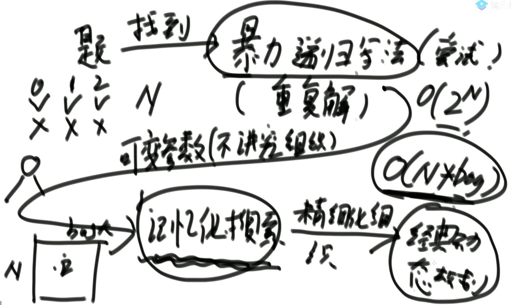


```text
这里写的更重要哦 
在提另外一个概念 : 什么是 枚举行为
一个状态只依赖于有限的状态, 比如上面的背包问题, 机器人问题, 博弈问题, 字符串合并问题
枚举行为下面的找硬币就是
通俗的说就是在二维表中多了一层循环(3层) , 就可能是枚举行为, 这种行为很有可能被优化 


暴力递归复杂度 : 指数级 
动态规划, 记忆化搜索 : 线性级(或许是)

动态规划和记忆化搜索 复杂度 :
如果没有枚举行为 , 认为是一致的, 可能是记忆化搜索用到的空间多, 也可能是动态规划用到的空间多(下面会提)
如果有枚举行为 , 建议优化成 动态规划, 因为可能会在这个基础上再次优化
```


#### 把之前的问题改成动态规划


##### 博弈问题改动态规划


```text
范围上的尝试模型 会导致 有近一半的内容是无效的

下面的图画了好久 
大意就是 两个表互相依赖, s的粉色方块 依赖f的粉色方块, f的蓝色方块依赖于s的蓝色方块

并且可以看出 是一个斜线一个斜线填满的 目标在右上角, 画x的是不能使用的
```


```java
public static int getMaxNumDp(int[] cards) {
    int[][] f = new int[cards.length][cards.length + 1];
    int[][] s = new int[cards.length][cards.length + 1] ;
    //对 f 和 s进行初始化
    for (int i = 0; i < cards.length; i++) {
        f[i][i] = cards[i];
    }
    //初始化完成开始模拟递归
    for (int i = 1; i < cards.length; i++) {
        int L = 0;
        int R = i;
        while (L < cards.length && R < cards.length) {
            s[L][R] = Math.min(f[L + 1][R], f[L][R - 1]);
            f[L][R] = Math.max(s[L + 1][R] + cards[L], s[L][R - 1] + cards[R]);
            L ++;
            R ++;
        }
    }
    return Math.max(f[0][cards.length - 1], s[0][cards.length - 1]);
}
```


#### 深度剖析 : 找硬币问题 

##### 问题 分析

---

> 数组arr里面是面币值，每种面币可以任选无数张（0–无穷张），组成target的办法有多少种？

---

```text
从左到右的分析模型
分类情况 : 来到一个节点 使用这个位置面币0张或者不能再多张 
意思是 比如当前面额是 10 目标是 100 我们在这个目标上的尝试 : 0 - 10 都尝试

设计 函数 f(面额index, 需要完成的目标rest)

basecase : index == arr.length 如果rest == 0 返回1 否则返回0
```


##### 暴力递归

```java
 public static boolean checkWrongData(int[] money, int aim) {
        return money == null || money.length == 0 || aim < 0;
    }

    public static int ways1(int[] money, int aim) {
        if (checkWrongData(money, aim)) {
            return 0;
        }
        return waysRec1(money, 0, aim);
    }
```

##### 分析是否有重复计算

有

假设[..., 10, 20, ...]

我选择了 10 2张 20 0张执行后面的过程 f(n + 2, rest - 20)

我选择了 10 0张 20 2张执行后面的过程 f(n + 2, rest - 20)

是一样的, 既然如此可以使用 最简单的方法优化

##### 使用记忆化搜索优化暴力递归

使用了一个map 这里面的代码还是不错的

```java
 //========== 没想到使用 傻缓存还挺难改 ==========
    public static int ways2(int[] money, int aim) {
        if (money == null || money.length == 0 || aim < 0) {
            return 0;
        }
        HashMap<String, Integer> cache = new HashMap<>();
        return waysRec2(money, 0, aim, cache);
    }

    public static void mapSave(HashMap<String, Integer> cache,int result,  int ... args) {
        StringBuilder sb = new StringBuilder();
        for (int arg : args) {
            sb.append(arg);
            sb.append(".");
        }
        cache.put(sb.toString(), result);
    }

    public static boolean mapContains(HashMap<String, Integer> cache, int ... args) {
        StringBuilder sb = new StringBuilder();
        for (int arg : args) {
            sb.append(arg);
            sb.append(".");
        }
        return cache.containsKey(sb.toString());
    }

    public static int mapGet(HashMap<String, Integer> cache, int ... args) {
        StringBuilder sb = new StringBuilder();
        for (int arg : args) {
            sb.append(arg);
            sb.append(".");
        }
        return cache.get(sb.toString());
    }

    public static int waysRec2(int[] money, int index, int rest, HashMap<String, Integer> cache) {
        if (mapContains(cache, index, rest)) {
            return mapGet(cache, index, rest);
        }
        if (index == money.length) {
            mapSave(cache,rest == 0 ? 1 : 0,index, rest);
            return rest == 0 ? 1 : 0;
        }
        int ans = 0;
        for (int i = 0; rest >= money[index] * i ; i++) {
            ans += waysRec1(money, index + 1, rest - money[index] * i);
        }
        mapSave(cache,ans, index, rest);
        return ans;
    }
```


##### 改为经典的动态规划

```java
// ============= 下面改成经典的动态规划 =============
    public static int ways3(int[] money, int aim) {
        if (checkWrongData(money, aim)) {
            return 0;
        }
        int[][] dp = new int[money.length + 1][aim + 1];
        dp[money.length][0] = 1;

        for (int index = money.length - 1; index >= 0; index--) {
            for (int rest = 0; rest <= aim; rest++) {
                int ans = 0;
                for (int i = 0; rest >= money[index] * i ; i++) {
                    ans += dp[index + 1][rest - money[index] * i];
                }
                dp[index][rest] =  ans;
            }
        }
        return dp[0][aim];
    }
```

##### 动态规划转义方程优化

```text
使用最简单的观察法

观察到 每一个枚举行为 都是 其下面的值 和 右边有金额间隔的值在累加

这个工作是重复的

这个值等于 其右边第一个间隔 (只有边界时没有 , 没有就不加呗)+ 其下面的值(一定有)

什么 空间压缩,状态化简,四边形不等式 等到学习到一定基础后再学习
```


```java
//==== 下面的优化是重点 ===
    //================= 下面进行 优化 怎么优化的还是很神奇的 ========
    public static int ways4(int[] money, int aim) {
        if (checkWrongData(money, aim)) {
            return 0;
        }
        int[][] dp = new int[money.length + 1][aim + 1];
        dp[money.length][0] = 1;
        for (int index = money.length - 1; index >= 0; index--) {
            for (int rest = 0; rest <= aim; rest++) {
                dp[index][rest] = dp[index + 1][rest];
                if (rest >= money[index]) {
                    dp[index][rest] += dp[index][rest - money[index]];
                }
            }
        }
        return dp[0][aim];
    }
```


##### 小总结

```text
使用精细的动态规划一定会更好吗 ? 

不一定 ! 因为粒度有时候还是大一点比较好 , 粒度比较粗使用记忆化搜索 更好

比如我的数组是 [10000,500000,2000000] 我的目标金额是 十个亿

很明显使用 记忆化搜索更好 , 因为记忆化搜索和数据情况关系不大 他就是个map 你是十亿我就用一个变量存十亿呗

但是 如果是动态规划我就要new[4] [十亿+1]很大的一个数组 并且命中率极低, 空间也大量浪费


那我选哪一种呢 ?
看数据状况 如果没有要求
一般认为 记忆化搜索和动态规划是复杂度等效的 , 没有谁更好, 但是经典动态规划可以让我们更好的发现可优化的部分
如果告诉你数据向上面那样极端就使用记忆化搜索

可以看看上面的笔记哦 

下面的贴纸问题甚至只能采用记忆化搜索 下节会看到
```


## 16 动态规划方法论 

```text
对于 多样本位置全对应模型 
直接画表 : 比如有有两个参数, 就做一张二维表, 先做表, 然后思考表的意义.
指导思想 : 如果有两个数去做一件事情, 直接一个做行, 一个做列


最核心的三个方法论
1 暴力递归怎么优化
2 设计暴力递归的原则
3 几个尝试模型


对于业务限制模型如何 找到范围
这就需要根据 暴力递归 + 含义 才能推导出来
还原题意 + 最极限的值  就是范围
```


#### 方法论 

面试中计算不会超过 10^9次方 因此太离谱的暴力递归不要想

```text
什么暴力递归可以继续优化？
有重复调用同一个子问题的解，这种递归可以优化
如果每一个子问题都是不同的解，无法优化也不用优化

暴力递归和动态规划的关系
某一个暴力递归，有解的重复调用，就可以把这个暴力递归优化成动态规划
任何动态规划问题，都一定对应着某一个有解的重复调用的暴力递归
但不是所有的暴力递归，都一定对应着动态规划

面试题和动态规划的关系
解决一个问题，可能有很多尝试方法
可能在很多尝试方法中，又有若干个尝试方法有动态规划的方式
一个问题可能有
若干种动态规划的解法

如何找到某个问题的动态规划方式？
1)设计暴力递归：重要原则+4种常见尝试模型！重点！
2)分析有没有重复解：套路解决
3)用记忆化搜索->用严格表结构实现动态规划：套路解决
4)看看能否继续优化：套路解决

面试中设计暴力递归过程的原则
1)每一个可变参数的类型，一定不要比it类型更加复杂
2)原则1)可以违反，让类型突破到一维线性结构，那必须是唯一可变参数
3)如果发现原则1) 被违反，但不违反原则2)，只需要做到记忆化搜索即可
4)可变参数的个数，能少则少, 可以提高缓存的命中率

知道了面试中设计暴力递归过程的原则，然后呢？
一定要逼自己找到不违反原则情况下的暴力尝试！
如果你找到的暴力尝试，不符合原则，马上舍弃！找新的！
如果某个题目突破了设计原则，一定极难极难，面试中出现慨率低于5%！

常见的4种尝试模型
1)从左往右的尝试模型
2)范围上的尝试模型
3)多样本位置全对应的尝试模型
4)寻找业务限制的尝试模型

如何分析有没有重复解
列出调用过程，可以只列出前几层
有没有重复解，一看便知

暴力递归到动态规划的套路
1)你已经有了一个不违反原则的暴力递归，而且的确存在解的重复调用
2)找到哪些参数的变化会影响返回值，对每一个列出变化范围
3)参数间的所有的组合数量，意味着表大小
4)记忆化搜索的方法就是傻缓存，非常容易得到
5)规定好严格表的大小，分析位置的依赖顺序，然后从基础填写到最终解
6)对于有枚举行为的决策过程，进一步优化

动态规划的进一步优化
1)空间压缩
2)状态化简
3)四边形不等式
其他优化技巧略
```


```text
用到的截图 不要在意 


```


#### 贴纸问题

---

> 给定一个字符串str,给定一个字符串类型的数组arr。
> arr里的每一个字符串，代表一张贴纸，你可以把单个字符剪开使用，目的是
> 拼出str来。
> 返回需要至少多少张贴纸可以完成这个任务。
> 例子：str="babac",arr={"ba","c","abcd"}
> 至少需要两张贴纸"ba"和"abcd",因为使用这两张贴纸，把每一个字符单独剪
> 开，含有2个a、2个b、1个c。是可以拼出str的。所以返回2。
>
> leetcode 691 困难题 测试暴力递归超时 , 傻存储通过

---


```text
从左到右的尝试模型
我们来到任意位置时 ,直接从左到右遍历一遍贴纸数组, 如果可以消除掉某个字符 , 继续递归调用, 然后得到调用的所有返回值, 取最小返回 .反之不调用
直到把所有的字符全部消除 递归结束

因此basecase : "".equals(target) return 0;


我们可以发现target的顺序无关紧要 因此可以优化为 int[26] arr[2] = 3 代表 c出现了三次

具体实现看代码

注意优化动态递归时 不要把让int[] 做为map的键


```


##### 暴力尝试 

```java
public class Code02StickerToSpellWord {


    public static int minStickers(String[] stickers, String target) {

        int[][] st = new int[stickers.length][26];
        for (int i = 0; i < stickers.length; i++) {
            st[i] = strToIndexArr(stickers[i]);
        }
        int[] t = strToIndexArr(target);
        HashMap<int[], Integer> map = new HashMap<>();
        return minStickers(st, t, map);
    }


    public static boolean isEmpty(int[] arr) {
        for (int j : arr) {
            if (j != 0) {
                return false;
            }
        }
        return true;
    }


    public static boolean check(int[] a, int[] b) {
        for (int i = 0; i < 26; i++) {
            if (a[i] > 0 && b[i] > 0) {
                return true;
            }
        }
        return false;
    }

    public static int[] copy(int[] arr) {
        int[] ans = new int[26];

        for (int i = 0; i < 26; i++) {
            ans[i] = arr[i];
        }
        return ans;
    }


    public static int minStickers(int[][] stickers, int[] target, HashMap<int[],Integer> map) {
        if (map.containsKey(target)) {
            return map.get(target);
        }
        if (isEmpty(target)) {
            map.put(target, 0);
            return 0;
        }

        int min = Integer.MAX_VALUE;
        for (int[] sticker : stickers) {
            if (!check(target, sticker)) {
                continue;
            }
            int[] copy = copy(target);
            arrSub(target,sticker);
            int minStickersDp = minStickers(stickers, target, map);
            target = copy;
            if (minStickersDp != -1) {
                min = Math.min(minStickersDp, min);
            }
        }
        map.put(target, min == Integer.MAX_VALUE ? -1 : min + 1);
        return map.get(target);
    }


    public static int minStickers(int[][] stickers, int[] target) {
        //判断是否成功
        if (isEmpty(target)) {
            return 0;
        }
        //如果没成功
        int min = Integer.MAX_VALUE;
        for (int[] sticker : stickers) {
            if (!check(target,sticker)) {
                continue;
            }
            int[] copy = copy(target);
            arrSub(target,sticker);
            int minRec = minStickers(stickers, target);
            target = copy;
            if (minRec != -1) {
                min = Math.min(min, minRec);
            }
        }
        return min == Integer.MAX_VALUE ? -1 : min + 1;
    }

    public static void arrSub(int[] a, int[] b) {
        for (int i = 0; i < 26; i++) {
            if (a[i] <= b[i]) {
                a[i] = 0;
            } else {
                a[i] -= b[i];
            }
        }
    }

    public static int[] strToIndexArr(String s) {
        char[] chs = s.toCharArray();
        int[] arr = new int[26];
        for (char ch : chs) {
            arr[ch - 'a']++;
        }
        return arr;
    }

    public static void main(String[] args) {
        String[] arr = {"aaaa","bbaa","ccddd"};
        String str = "abcccccdddddbbbaaaaa";
        int i = minStickers(arr, str);
        System.out.println(i);
    }

}
```


##### 动态规划

```java
//解答成功: 执行耗时:503 ms,击败了14.25% 的Java用户 内存消耗:118.1 MB,击败了13.30% 的Java用户
public class Code03StickerToSpellWord {

    public static int minStickers(String[] stickers, String target) {

        int[][] s = new int[stickers.length][26];
        for (int i = 0; i < stickers.length; i++) {
            s[i] = strToArr(stickers[i]);
        }
        HashMap<String, Integer> map = new HashMap<>();
        map.put("", 0);
        return minStickers(s, target, map);
    }

    public static int[] strToArr(String s) {
        char[] chs = s.toCharArray();
        int[] ans = new int[26];
        for (char c : chs) {
            ans[c - 'a'] ++;
        }
        return ans;
    }

    public static void arrSub(int[] a, int[] b) {
        for (int i = 0; i < 26; i++) {
            if (a[i] <= b[i]) {
                a[i] = 0;
            } else {
                a[i] -= b[i];
            }
        }
    }

    public static boolean haveSameElements(int[] a, int[] b) {
        for (int i = 0; i < 26; i++) {
            if (a[i] > 0 && b[i] > 0) {
                return true;
            }
        }
        return false;
    }

    public static String arrToStr(int[] arr) {
        StringBuilder sb = new StringBuilder();
        for (int i = 0; i < arr.length; i++) {
            for (int j = 0; j < arr[i]; j++) {
                sb.append((char)('a' + i));
            }
        }
        return sb.toString();
    }

    public static int minStickers(int[][] stickers, String target, HashMap<String, Integer> map) {
        if (map.containsKey(target)) {
            return map.get(target);
        }
//        if (target.equals("")) {
//            return 0;
//        }
        //还能继续
        int[] targetArr = strToArr(target);
        int min = Integer.MAX_VALUE;
        for (int[] sticker : stickers) {
            //先判断能不能消除一个
            if (!haveSameElements(sticker, targetArr)) {
                continue;
            }
            //可以继续递归
            targetArr = strToArr(target);
            arrSub(targetArr,sticker);
            String nextTarget = arrToStr(targetArr);

            int minStickers = minStickers(stickers, nextTarget, map);
            if (minStickers != -1) {
                min = Math.min(minStickers, min);
            }
        }
        map.put(target, min == Integer.MAX_VALUE ? -1 : min + 1);
        return min == Integer.MAX_VALUE ? -1 : min + 1;
    }

    public static void main(String[] args) {
        String[] arr = {"aaaa","bbaa","ccddd"};
        String str = "abcccccdddddbbbaaaaa";
        int i = minStickers(arr, str);
        System.out.println(i);
    }


}

```


#####  改成经典的动态规划

由于我们发现可变参数是 String target ,或者可以理解为 int[] target

无论那种形式, 都超过了 int类型, 这个dp表很难建立, 即使建立效果不一定比傻缓存效率高, 因此不再赘述

#### 两个字符串最长公共子序列问题
两个字符串的最长公共子序列问题

```text
多样本位置对应模型
直接字符串a做行, 字符串b做列

然后做出一张表 dp[a.len][b.len]
我们定义含义为 dp[i][j] 为 a字符串 0-i 和 b字符串0-j位置上最长的公共子序列大小 

先填好basecase : dp[0][i], dp[i][0]

然后分析每个位置如何根据之前的位置确定, 这就需要分情况讨论
情况 1 : 和a的最后一个位置无关, 和b的最后一个位置无关 此时 dp[i][j] = dp[i - 1][j - 1]
情况 2 : 和a的最后一个位置有关, 和b的最后一个位置无关 此时 dp[i][j] = dp[i][j - 1]
情况 3 : 和a的最后一个位置无关, 和b的最后一个位置有关 此时 dp[i][j] = dp[i - 1][j]
情况 4 : 和a的最后一个位置有关, 和b的最后一个位置有关 此时 dp[i][j] = dp[i - 1][j - 1] + 1
请注意 最后一种情况的值需要 满足 s[i] == s[j] 才有意义, 这个位置的值都不相等就没有讨论的必要了


```


```java
public class Code05MaxLenSubsequence {


    public static int getMaxLenSubsequence(String a, String b) {
        if (a == null || b == null || "".equals(a) || "b".equals(b)) {
            return 0;
        }

        char[] chs1 = a.toCharArray();
        char[] chs2 = b.toCharArray();

        int[][] dp = new int[chs1.length][chs2.length];
        dp[0][0] = chs1[0] == chs2[0] ? 1 : 0;

        for (int i = 1; i < chs1.length; i++) {
            dp[i][0] = Math.max(dp[i - 1][0], chs1[i] == chs2[0] ? 1 : 0);
        }

        for (int i = 1; i < chs2.length; i++) {
            dp[0][i] = Math.max(dp[0][i - 1], chs1[0] == chs2[i] ? 1 : 0);
        }

        for (int i = 1; i < chs1.length; i++) {
            for (int j = 1; j < chs2.length; j++) {
                int max = Math.max(dp[i - 1][j], dp[i][j - 1]);
                if (chs1[i] == chs2[j]) {
                    max = Math.max(max, dp[i - 1][j - 1] + 1);
                }
                //左上角的情况不用判断
                dp[i][j] = max;
            }
        }
        return dp[chs1.length - 1][chs2.length - 1];
    }

    public static void main(String[] args) {
        String a = "ab12lcio34ijoi5";
        String b = "ciadf123dasg45l;kj6";
        int maxLenSubsequence = getMaxLenSubsequence(a, b);
        System.out.println("maxLenSubsequence = " + maxLenSubsequence);
    }


}
```


#### 洗咖啡机

---

> 给定一个数组，代表每个人喝完咖啡准备刷杯子的时间
> 只有一台咖啡机，一次只能洗一个杯子，时间耗费a,洗完才能洗下一杯
> 每个咖啡杯也可以自己挥发干净，时间耗费，咖啡杯可以并行挥发
> 返回让所有咖啡杯变干净的最早完成时间
> 三个参数：int[] arr、int a、int b:

---

```text
从左到右 + 业务限制的模型

根据从左到右写出递归, 并且根据业务限制作为递归的参数

假设我们定义了一个函数 f(index) 代表我们来到index位置,前面的决策已经完成, 我返回index到最后 所有变干净的时间
这会产生一个问题 我这个位置能不能用咖啡机 ? 这就是业务限制, 我们添加参数 timeLine作为咖啡机喜好后的时间
因此 函数修改为 f(index, timeLine)

basecase : index == arr.length return 0;
其他位置 : 选择当前位置洗 和 不洗的最小值返回, 整个过程中注意更新 timeLine的值

改动态规划就根据之前的节奏来, 确定好这个表是从哪里填到哪里 , 比如从下到上, 从左到右
然后设计循环 循环的变量名就用之前的, 然后把之前的代码赋值过来就很容易改出来

```


```java
public class Code06Coffee {
    //目前只考虑洗咖啡问题


    public static int wash(int[] drinks, int a, int b, int index, int washFinish) {
        if (drinks.length == index ) {
            return 0;
        }
        //什么时候能洗 + 洗的时间 就是新的洗完时间
        int newWashFinish = Math.max(drinks[index], washFinish) + a;
        int washOther = wash(drinks, a, b, index + 1, newWashFinish);
        int ansWash = Math.max(newWashFinish, washOther);
        //选择不洗
        int dryFinish = drinks[index] + b;
        int washOther2 = wash(drinks, a, b, index + 1, washFinish);
        int ansDry = Math.max(dryFinish, washOther2);
        return Math.min(ansDry, ansWash);
    }

    public static int washDp(int[] drinks, int a, int b) {
        int washAll = 0;
        for (int drink : drinks) {
            washAll = Math.max(washAll, drink) + a;
        }
        //washAll的值就是全洗的时间
        int[][] dp = new int[drinks.length + 1][washAll + 1];
        for (int index = drinks.length - 1; index >= 0; index--) {
            for (int washFinish = 0; washFinish <= washAll; washFinish++) {
                //什么时候能洗 + 洗的时间 就是新的洗完时间
                int newWashFinish = Math.max(drinks[index], washFinish) + a;
                int ansWash = Integer.MAX_VALUE;
                if (newWashFinish <= washAll) {
                    ansWash = Math.max(newWashFinish, dp[index + 1][newWashFinish]);
                }
                //选择不洗
                int dryFinish = drinks[index] + b;
                int ansDry = Math.max(dryFinish, dp[index + 1][washFinish]);
                dp[index][washFinish] =  Math.min(ansDry, ansWash);
            }
        }
//        System.out.println(Arrays.deepToString(dp));
        return dp[0][0];
    }

    public static void main(String[] args) {
        int[] test = { 1, 1, 5, 5, 7, 10, 12, 12, 12, 12, 12, 12, 15 };
        int a1 = 3;
        int b1 = 10;
        int wash = wash(test, a1, b1, 0, 0);
        int washDp = washDp(test, a1, b1);
        System.out.println("wash = " + wash);
        System.out.println("washDp = " + washDp);
    }

}
```

