## 1 滑动窗口 + 单调栈

```text
什么时候能用单调栈和单调队列 和首尾指针
在一个范围上， 可以建立单调性。
比如范围变化，指标也发生变化，但是具有单调性，就可以考虑使用上面的算法


优化一个问题 有两种方式
一种是 根据数据状况， 一种是问题本身问的是什么
如果范围和问题之间可以建立单调性，就能使用上面的方法。

使用单调栈的原因一定是动态维持一段区间内的最小值，即我们需要在问题要求的区间变化的过程中实时地维持一段区间内所有可能的候选最优质的，以应对当区间变化，某些元素删除后，最优值的求解问题。
  一个使用单调栈的问题它具有这样的性质，也即我们需要维持的原始数组的区间变化情况是，只有一端增加或者减少，这个时候我们可以选择使用单调栈来维持原始数组给定区间内的最值问题

前面我们已经说过，单调栈因为左端点，不变，所以可以支持一个端点左移或者右移的操作，而之所以可以左移或者右移，是因为单调栈只插入满足条件的点，而不会对以及入栈的元素进行最优性剪枝，这样，就保证了右端点可以左移的条件；而单调队列在维持的过程中，整个要维持的区间是单向移动的，假设要维持的两个端点都是向右移动的，那么当左端点右移时，实际上最次最优值是会发生变化的，这样为了保证左端点右移时候选最优值的正确性，我们在右端点右移的过程中，必须把当前元素插入到单调队列中（单调栈则不用），这样插入时，为了维持单调性，我们就需要进行最优性剪枝，此时如果我们再将右端点左移，那么上一回合插入的元素实际上需要删除，但是上一回合中我们已经进行了最优性剪枝，这样即使我们将上一回合插入的元素删除，我们也不能将单调队列在恢复到之前的状态
   
综上，我们得到使用单调队列的问题，要维持的区间一定是左右端点同时单向移动的；而使用单点栈的问题，则一定是只有一个端点左移或者右移的。

```


### 滑动窗口

```text
滑动窗口是什么？
滑动窗口是一种想象出来的数据结构：
滑动窗口有左边界L和有边界R
在数组或者字符串或者一个序列上，记为S,窗口就是S[L.R]这一部分
L往右滑意味着一个样本出了窗口，R往右滑意味着一个样本进了窗口
L和R都只能往右滑

滑动窗口能做什么？
滑动窗口、首尾指针等技巧，说白了是一种求解问题的流程设计。

滑动内最大值和最小值的更新结构
窗口不管L还是R滑动之后，都会让窗口呈现新状况
如何能够更快的得到窗口当前状况下的最大值和最小值？
最好平均下来复杂度能做到O(1)
利用单调双端队列！
```

#### 题目一

---

> 题目一
> 假设一个固定大小为W的窗口，依次划过arr,
> 返回每一次滑出状况的最大值
> 例如，arr=[4,3,5,4,3,3,6,7],W=3
> 返回：[5,5,5,4,6,7]

---


#### 题目二

---

> 题目二
> 给定一个整型数组arr,和一个整数num
> 某个arr中的子数组sub,如果想达标，必须满足：
> sub中最大值-sub中最小值<=num,
> 返回arr中达标子数组的数量

---


### 单调栈

```text
单调栈是什么？
一种特别设计的栈结构，为了解决如下的问题:
给定一个可能含有重复值的数组arr,i位置的数一定存在如下两个信息
1)arr[i]的左侧离i最近并且小于（或者大于）arr[i]的数在哪？
2)arr[i]的右侧离i最近并且小于（或者大于）arr[i]的数在哪？
如果想得到ar中所有位置的两个信息，怎么能让得到信息的过程尽量快。
那么到底怎么设计呢？

单调栈是一种和单调队列类似的数据结构。单调队列主要用于 [公式] 解决滑动窗口问题，单调栈则主要用于 [公式] 解决NGE问题（Next Greater Element），也就是，对序列中每个元素，找到下一个比它大的元素。（当然，“下一个”可以换成“上一个”，“比它大”也可以换成“比他小”，原理不变。）
这比单调队列还简单一点。我们维护一个栈，表示“待确定NGE的元素”，然后遍历序列。当我们碰上一个新元素，我们知道，越靠近栈顶的元素离新元素位置越近。所以不断比较新元素与栈顶，如果新元素比栈顶大，则可断定新元素就是栈顶的NGE，于是弹出栈顶并继续比较。直到新元素不比栈顶大，再将新元素压入栈。显然，这样形成的栈是单调递减的。

下面的实现都是 NSE, 改成NGE非常简单， 改动while里的符号即可
左边越界填入 -1, 右边越界填入 arr.length
```

#### 无重复值 构造单调栈（有重复值时表现不同）


内部使用数组代替栈提高速度

目前的功能是 获取每个元素  左边距离自己最近的不比自己大的元素，  右距离自己最近的， 比自己小的元素，

如果没有重复值 ，就是两边距离自己最近最小的

如果有重复值， 就是函数名和上面解释的意思


```java
public static int[][] getNextRightSmallerLeftEqual(int[] arr) {
        int[] stack = new int[arr.length];
        int stackSize = 0;
        int[][] ans = new int[arr.length][2];
        for (int i = 0; i < arr.length; i++) {
            while (stackSize != 0 && arr[i] < arr[stack[stackSize - 1]]) {
                int index = stack[--stackSize];
                ans[index][0] = stackSize == 0 ? -1 : stack[stackSize - 1];
                ans[index][1] = i;
            }
            stack[stackSize++] = i;
        }
        while (stackSize != 0 ) {
            int index = stack[--stackSize];
            ans[index][0] = stackSize == 0 ? -1 : stack[stackSize - 1];
            ans[index][1] = arr.length;
        }
        return ans;
    }
```


和上面不同的是 就是把大于改成  大于等于 即可， 就变了一个符号，产生相反的结果

目前的功能是 获取每个元素  右边距离自己最近的不比自己大的元素，  左边距离自己最近的， 比自己小的元素，

如果没有重复值 ，就是两边距离自己最近最小的

如果有重复值， 就是函数名和上面解释的意思

```java
public static int[][] getNextRightEqualLeftSmaller(int[] arr) {
        int[] stack = new int[arr.length];
        int stackSize = 0;
        int[][] ans = new int[arr.length][2];
        for (int i = 0; i < arr.length; i++) {
            while (stackSize != 0 && arr[i] <= arr[stack[stackSize - 1]]) {
                int index = stack[--stackSize];
                ans[index][0] = stackSize == 0 ? -1 : stack[stackSize - 1];
                ans[index][1] = i;
            }
            stack[stackSize++] = i;
        }
        while (stackSize != 0 ) {
            int index = stack[--stackSize];
            ans[index][0] = stackSize == 0 ? -1 : stack[stackSize - 1];
            ans[index][1] = arr.length;
        }
        return ans;
    }
```


#### 有重复值构造单调栈

目前的功能是 获取每个元素距离自己最近的， 比自己小的元素

把while循环中的 < 改成 >就实现了 ， 获取每个元素最近的比自己大的元素。

```java
    public static int[][] getNextAllSmaller(int[] arr) {
        Stack<List<Integer>> stack = new Stack<>();
        int[][] ans = new int[arr.length][2];
        for (int i = 0; i < arr.length; i++) {

            while (!stack.isEmpty() &&arr[i] < arr[stack.peek().get(0)]) {
                List<Integer> pop = stack.pop();
                int lastIndex = stack.isEmpty() ? -1 : stack.peek().get(stack.peek().size() - 1);
                for (Integer integer : pop) {
                    ans[integer][0] = lastIndex;
                    ans[integer][1] = i;
                }
            }

            if (!stack.isEmpty() && arr[i] == arr[stack.peek().get(0)]) {
                stack.peek().add(i);
            } else {
                ArrayList<Integer> list = new ArrayList<>();
                list.add(i);
                stack.add(list);
            }

        }
        while (!stack.isEmpty()) {
            List<Integer> pop = stack.pop();
            int lastIndex = stack.isEmpty() ? -1 : stack.peek().get(stack.peek().size() - 1);
            for (Integer integer : pop) {
                ans[integer][0] = lastIndex;
                ans[integer][1] = arr.length;
            }

        }
        return ans;
    }
```


#### 单调栈全通用代码

```java
public class MonotonicStack {


    public static int[][] getNextLeftEqualRightGreater(int[] arr) {
        //使用数组模拟栈
        int[] stack = new int[arr.length];
        int stackSize = 0;
        int[][] ans = new int[arr.length][2];
        for (int i = 0; i < arr.length; i++) {
            while (stackSize != 0 && arr[i] > arr[stack[stackSize - 1]]) {
                //结算
                int index = stack[--stackSize];
                ans[index][0] = stackSize == 0 ? -1 : stack[stackSize - 1];
                ans[index][1] = i;
            }
            stack[stackSize++] = i;
        }
        //结算没人要的值
        while (stackSize != 0) {
            //结算
            int index = stack[--stackSize];
            ans[index][0] = stackSize == 0 ? -1 : stack[stackSize - 1];
            ans[index][1] = arr.length;
        }
        return ans;
    }

    public static int[][] getNextLeftEqualRightLesser(int[] arr) {
        //使用数组模拟栈
        int[] stack = new int[arr.length];
        int stackSize = 0;
        int[][] ans = new int[arr.length][2];
        for (int i = 0; i < arr.length; i++) {
            while (stackSize != 0 && arr[i] < arr[stack[stackSize - 1]]) {
                //结算
                int index = stack[--stackSize];
                ans[index][0] = stackSize == 0 ? -1 : stack[stackSize - 1];
                ans[index][1] = i;
            }
            stack[stackSize++] = i;
        }
        //结算没人要的值
        while (stackSize != 0) {
            //结算
            int index = stack[--stackSize];
            ans[index][0] = stackSize == 0 ? -1 : stack[stackSize - 1];
            ans[index][1] = arr.length;
        }
        return ans;
    }


    public static int[][] getNextLeftGreaterRightEqual(int[] arr) {
        //使用数组模拟栈
        int[] stack = new int[arr.length];
        int stackSize = 0;
        int[][] ans = new int[arr.length][2];
        for (int i = 0; i < arr.length; i++) {
            while (stackSize != 0 && arr[i] >= arr[stack[stackSize - 1]]) {
                //结算
                int index = stack[--stackSize];
                ans[index][0] = stackSize == 0 ? -1 : stack[stackSize - 1];
                ans[index][1] = i;
            }
            stack[stackSize++] = i;
        }
        //结算没人要的值
        while (stackSize != 0) {
            //结算
            int index = stack[--stackSize];
            ans[index][0] = stackSize == 0 ? -1 : stack[stackSize - 1];
            ans[index][1] = arr.length;
        }
        return ans;
    }

    public static int[][] getNextLeftLesserRightEqual(int[] arr) {
        //使用数组模拟栈
        int[] stack = new int[arr.length];
        int stackSize = 0;
        int[][] ans = new int[arr.length][2];
        for (int i = 0; i < arr.length; i++) {
            while (stackSize != 0 && arr[i] <= arr[stack[stackSize - 1]]) {
                //结算
                int index = stack[--stackSize];
                ans[index][0] = stackSize == 0 ? -1 : stack[stackSize - 1];
                ans[index][1] = i;
            }
            stack[stackSize++] = i;
        }
        //结算没人要的值
        while (stackSize != 0) {
            //结算
            int index = stack[--stackSize];
            ans[index][0] = stackSize == 0 ? -1 : stack[stackSize - 1];
            ans[index][1] = arr.length;
        }
        return ans;
    }


    public static int[][] getNextAllGreater(int[] arr) {


        Stack<List<Integer>> stack = new Stack<>();
        int[][] ans = new int[arr.length][2];

        for (int i = 0; i < arr.length; i++) {

            while (!stack.isEmpty() && arr[i] > arr[stack.peek().get(0)]) {
                List<Integer> pop = stack.pop();
                int index = stack.isEmpty() ? -1 : stack.peek().get(stack.peek().size() - 1);
                for (Integer anInt : pop) {
                    ans[anInt][0] = index;
                    ans[anInt][1] = i;
                }
            }
            if (!stack.isEmpty() && arr[stack.peek().get(0)] == arr[i]) {
                stack.peek().add(i);
            } else {
                ArrayList<Integer> list = new ArrayList<>();
                list.add(i);
                stack.add(list);
            }

        }
        //结算没人激活的
        while (!stack.isEmpty()) {
            List<Integer> pop = stack.pop();
            int index = stack.isEmpty() ? -1 : stack.peek().get(stack.peek().size() - 1);
            for (Integer anInt : pop) {
                ans[anInt][0] = index;
                ans[anInt][1] = arr.length;
            }
        }
        return ans;
    }

    public static int[][] getNextAllLesser(int[] arr) {


        Stack<List<Integer>> stack = new Stack<>();
        int[][] ans = new int[arr.length][2];

        for (int i = 0; i < arr.length; i++) {

            while (!stack.isEmpty() && arr[i] < arr[stack.peek().get(0)]) {
                List<Integer> pop = stack.pop();
                int index = stack.isEmpty() ? -1 : stack.peek().get(stack.peek().size() - 1);
                for (Integer anInt : pop) {
                    ans[anInt][0] = index;
                    ans[anInt][1] = i;
                }
            }
            if (!stack.isEmpty() && arr[stack.peek().get(0)] == arr[i]) {
                stack.peek().add(i);
            } else {
                ArrayList<Integer> list = new ArrayList<>();
                list.add(i);
                stack.add(list);
            }

        }
        //结算没人激活的
        while (!stack.isEmpty()) {
            List<Integer> pop = stack.pop();
            int index = stack.isEmpty() ? -1 : stack.peek().get(stack.peek().size() - 1);
            for (Integer anInt : pop) {
                ans[anInt][0] = index;
                ans[anInt][1] = arr.length;
            }
        }
        return ans;
    }

    public static void main(String[] args) {
        int[] arr = {71,55,82,55};
        int[][] leftEqualRightLesser = getNextLeftEqualRightLesser(arr);
        int[][] leftLesserRightEqual = getNextLeftLesserRightEqual(arr);
        int[][] leftEqualRightGreater = getNextLeftEqualRightGreater(arr);
        int[][] leftGreaterRightEqual = getNextLeftGreaterRightEqual(arr);
        int[][] allGreater = getNextAllGreater(arr);
        int[][] allLesser = getNextAllLesser(arr);

        System.out.println("arr = " + Arrays.toString(arr));
        System.out.println("allLesser = " + Arrays.deepToString(allLesser));
        System.out.println("allGreater = " + Arrays.deepToString(allGreater));
        System.out.println("leftEqualRightLesser = " + Arrays.deepToString(leftEqualRightLesser));
        System.out.println("leftLesserRightEqual = " + Arrays.deepToString(leftLesserRightEqual));
        System.out.println("leftEqualRightGreater = " + Arrays.deepToString(leftEqualRightGreater));
        System.out.println("leftGreaterRightEqual = " + Arrays.deepToString(leftGreaterRightEqual));
    }


}

```


#### 题目三 子数组最大值

---

> 题目三
> 给定一个只包含正数的数组arr,arr中任何一个子数组sub,
> 一定都可以算出(Sub累加和)*(Sub中的最小值)是什么，
> 那么所有子数组中，这个值最大是多少？

---


```text
思路 让每个索引值做最小值 ， 分别向两边扩散， 扩散到最大长度， 此时 sub累加 * arr[i]的结果就是最大值
```


```java
public class Code03AllTimesMinToMax {


    public static int getMax(int[] arr) {
        if (arr == null) {
            return -1;
        }
        int[] preSum = new int[arr.length];
        preSum[0] = arr[0];
        for (int i = 1; i < arr.length; i++) {
            preSum[i] = preSum[i - 1] + arr[i];
        }
        int max = Integer.MIN_VALUE;
        int[][] allLesser = MonotonicStack.getNextAllLesser(arr);
        for (int i = 0; i < arr.length; i++) {
            int leftIndex = allLesser[i][0] + 1;
            int rightIndex = allLesser[i][1] - 1;
            int sum = leftIndex == 0 ? preSum[rightIndex] : preSum[rightIndex] - preSum[leftIndex - 1];
            int curMax = sum * arr[i];
            max = Math.max(curMax, max);
        }
        return max;
    }

    public static int getMax2(int[] arr) {
        if (arr == null) {
            return -1;
        }
        int[] preSum = new int[arr.length];
        preSum[0] = arr[0];
        for (int i = 1; i < arr.length; i++) {
            preSum[i] = preSum[i - 1] + arr[i];
        }

        int max = Integer.MIN_VALUE;
        for (int i = 0; i < arr.length; i++) {

            int left = i - 1;
            int right = i + 1;
            while (left >= 0 && arr[left] >= arr[i]) {
                left --;
            }
            while (right <= arr.length - 1 && arr[right] >= arr[i]) {
                right ++;
            }
            left = left + 1;
            right = right - 1;
            int sum = left > 0 ? preSum[right] - preSum[left - 1] : preSum[right];
            max = Math.max(max, sum * arr[i]);

        }
        return max;
    }
    public static int[] gerenareRondomArray() {
        int[] arr = new int[(int) (Math.random() * 20) + 10];
        for (int i = 0; i < arr.length; i++) {
            arr[i] = (int) (Math.random() * 101);
        }
        return arr;
    }

    public static void main(String[] args) {
        int testTimes = 2000000;
        System.out.println("test begin");
        for (int i = 0; i < testTimes; i++) {
            int[] arr = gerenareRondomArray();
            if (getMax(arr) != getMax2(arr)) {
                System.out.println("FUCK!");
                System.out.println(Arrays.toString(arr));
                System.out.println(getMax(arr));
                System.out.println(getMax2(arr));
                break;
            }
        }
        System.out.println("test finish");
    }


}
```


#### 题目四 子数组最小值之和 leetcode原题

这道题他妈的做了俩小时， 这个%10^9 + 7 真恶心， 头一次见

---

> \907. Sum of Subarray Minimums
>
> Medium
>
> 3559238Add to ListShare
>
> Given an array of integers arr, find the sum of `min(b)`, where `b` ranges over every (contiguous) subarray of `arr`. Since the answer may be large, return the answer **modulo** `109 + 7`.
>
>  
>
> **Example 1:**
>
> ```
> Input: arr = [3,1,2,4]
> Output: 17
> Explanation: 
> Subarrays are [3], [1], [2], [4], [3,1], [1,2], [2,4], [3,1,2], [1,2,4], [3,1,2,4]. 
> Minimums are 3, 1, 2, 4, 1, 1, 2, 1, 1, 1.
> Sum is 17.
> ```
>
> **Example 2:**
>
> ```
> Input: arr = [11,81,94,43,3]
> Output: 444
> ```

---


```text
当时观察了好久得到一个结论 
就是每个位置向两边扩散， 找到第一个小于自己的值， 右边也是， 两边和自己的长度 相乘 再乘以自身就是当前位置结果
所有位置求和就是最终返回值

比如 [3,1,2,4]
3 ： 左边到 -1， 右边到1,3 * （0 -（- 1））*（1 - 0） = 3
1 ： 左边到 -1， 右边到4，1 * (1 - (-1)) * (4 - 1) = 6
2 :  左边到 1， 右边到4，2 * (2 - 1) * (4 - 2) = 4
4 : 左边到 2， 右边到4,4 * (3 - 2) * (4 - 3) = 4
结果就是17 ，但是这个思路处理有相同值的就会少算，因为相等值中间的那一段没人计算，感觉改变了方法又有可能重复计算，这就
于是又发现 之前的不能处理重复数值的单调栈刚好可以做到这一点
左边找到第一个小于自己的值， 右边找到小于等于自己的值，或者左边找到第一个小于等于自己的值， 右边找到第一个等于自己的值

至此问题已经差不多已经解决
问题是数据量很大时又会出错， 是因为 ： % 1000000007 老是有问题， 把int改成long就没有了问题， 这里以后在深究吧


```


```java
//Runtime: 33 ms, faster than 82.14% of Java online submissions for Sum of Subarray Minimums.
//Memory Usage: 67.2 MB, less than 56.64% of Java online submissions for Sum of Subarray Minimums.
public class Code05SumOfSubarrayMinimums {
    public static final int SPE_VAL = 10_0000_0007;
    public static int sumSubarrayMins(int[] arr) {
        if (arr == null || arr.length == 0) {
            return -1;
        }
        long ans = 0;
        int[][] nextRightSmallerLeftEqual = getNextRightSmallerLeftEqual(arr);
        for (int i = 0; i < arr.length; i++) {
            //（a * b）％c =（（a％c）*（b％c））％c
            ans +=
                    (long) arr[i] *
                            (i - nextRightSmallerLeftEqual[i][0]) *
                            ((nextRightSmallerLeftEqual[i][1] - i));
            ans %= SPE_VAL;
        }
        return (int) ans;
    }

    public static int[][] getNextRightSmallerLeftEqual(int[] arr) {
        int[] stack = new int[arr.length];
        int stackSize = 0;
        int[][] ans = new int[arr.length][2];
        for (int i = 0; i < arr.length; i++) {
            while (stackSize != 0 && arr[i] < arr[stack[stackSize - 1]]) {
                int index = stack[--stackSize];
                ans[index][0] = stackSize == 0 ? -1 : stack[stackSize - 1];
                ans[index][1] = i;
            }
            stack[stackSize++] = i;
        }
        while (stackSize != 0 ) {
            int index = stack[--stackSize];
            ans[index][0] = stackSize == 0 ? -1 : stack[stackSize - 1];
            ans[index][1] = arr.length;
        }
        return ans;
    }

}

```


#### 总结

```text
滑动窗口、单调栈怎么用？
想用滑动窗口，要想办法把具体的问题转化为滑动窗口的处理流程
想用滑动窗口最值的更新结构，就看看处理流程下，是否需要最值这个信息
想用单调栈，要想办法把具体的问题转化为单调栈所解决的原问题
滑动窗口及其最大值和最小值的更新结构、单调栈，都是重要算法原型
```


## 2  斐波那契数列对数解 + 矩阵学习 + 蓄水池算法
```text
可以实现 O(logN)的复杂度, 不过需要满足一定条件

k阶递推式 满足严格的递归关系 不随条件转移 如果有条件转移就用不了

什么是条件转移 : 比如来到当前位置 , 会根据当前位置的值进行判断然后做出不同的选择就是条件转移
比如之前的 合并字符串, 背包等都用不了, 如果除了basecase 每个状况都一样 , 那么就是没有条件转移的, 可以用

以后如果我们写出一个递归, 如果没有发现条件转移, 就直接优化成 O(log N)

 画个图
|n,n - 1,.., n - k + 1| = |1 - k| |k阶矩阵| ^ (n - k) 

系数不同决定 矩阵状况不同, 
-k , 决定是 k阶递归式 

常见问题 斐波那契, 奶牛生牛, 爬楼梯等

都会有一个 logN的解 


快速幂 快速求幂的方法 

一个数怎么快速算平方 -> 一个矩阵怎么快速算平方


扩展思考 怎么实现 根据递推式 -> 求出矩阵 初步估计不会很简单 
```


#### 方法论

```text
求斐波那契数列矩阵乘法的方法
1)
斐波那契数列的线性求解(O)的方式非常好理解
2)同时利用线性代数，也可以改写出另一种表示
IF(N),F(N-1)|=|F(2),F(1)|*某个二阶矩阵的N-2次方
3)求出这个二阶矩阵，进而最快求出这个二阶矩阵的N-2次方
```


#### 矩阵学习


##### 矩阵乘法

前行乘后列, 结果大小为  前行数 * 后列数

```java
	public static int[][] matrixMul(int[][] m1, int[][] m2) {
        int[][] ans = new int[m1.length][m2[0].length];
        for (int i = 0; i < m1.length; i++) {
            for (int j = 0; j < m2[0].length; j++) {
                for (int k = 0; k < m1[0].length; k++) {
                    ans[i][j] += m1[i][k] * m2[k][j];
                }
            }
        }
        return ans;
    }
```


##### 使用矩阵求解n元一次方程

如果是n元一次方程 , 一定是 n 行 n + 1列的矩阵, 最后一列放结果

```java
public class Matrix {

    /**
     * @param args
     * 必须为N行N+1列
     */

    public static void main(String[] args) {

        int n = 3;
//        double[][] matrix = { { 6, 0, 7, 9, 20 }, { 0, 3, 0, 10, 50 },
//                { 0, 4, 0, 11, 31 }, { 0, 8, 9, 0, 10 } };
        int[][] matrix = {{3, 2, 1, 4}, {4, 3, 2, 6}, {6, 4, 3, 9}};


//  double[][] matrix = { { 6, 0, 7, 9, 20 ,99}, { 0, 3, 0, 10, 50 ,56},
//    { 0, 4, 0, 11, 31 ,4}, { 0, 8, 9, 0, 10 ,78} ,{3,6,23,76,34,0}};

//        // 消元前
//        System.out.println("消元前");
//        printMatrix(n, matrix);
//        simple(n, matrix);
//        // 消元后
//        System.out.println("消元后");
//        printMatrix(n, matrix);
//
//        double[] result = getResult(n, matrix);
//        for (int i = 0; i < result.length; i++) {
//            System.out.println(Math.round(result[i]));
//        }
//        System.out.println(Arrays.toString(result));

        for (int i : getResultInteger(matrix)) {
            System.out.println(i);
        }


    }

    private static void simple(int n, double[][] matrix) {
        for (int k = 0; k < n; k++) {
            if (matrix[k][k] == 0) {
                changeRow(n, k, matrix);
            }

            for (int i = 0; i < n; i++) {
                // 记录对角线元素，作为除数
                double temp = matrix[i][k];
                for (int j = 0; j < n + 1; j++) {
                    // i<k时,i行已经计算完成
                    if (i < k)
                        break;
                    if (temp == 0)
                        continue;
                    if (temp != 1) {
                        matrix[i][j] /= temp;
                    }

                    if (i > k)
                        matrix[i][j] -= matrix[k][j];
                }
            }
        }

    }

    public static int[] getResultInteger(int[][] matrix) {
        double[][] m = new double[matrix.length][matrix[0].length];
        for (int i = 0; i < m.length; i++) {
            for (int j = 0; j < m[0].length; j++) {
                m[i][j] = matrix[i][j];
            }
        }
        double[] result = getResult(m);
        int[] ans = new int[result.length];
        for (int i = 0; i < result.length; i++) {
            ans[i] = (int) Math.round(result[i]);
        }
        return ans;
    }

    public static double[] getResult( double[][] matrix) {
        int n = matrix.length;
        simple(n, matrix);
        double[] result = new double[n];
        for (int i = n - 1; i >= 0; i--) {
            double temp = matrix[i][n];
            for (int j = n - 1; j >= 0; j--) {
                if (i < j && matrix[i][j] != 0) {
                    temp = temp - result[j] * matrix[i][j];
                }
            }
            temp /= matrix[i][i];
            result[i] = temp;
        }
//        for (int k = 0; k < result.length; k++) {
//            System.out.println("X" + (k + 1) + " = " + result[k]);
//        }
        return result;
    }


    private static double[] getResult(int n, double[][] matrix) {
        double[] result = new double[n];
        for (int i = n - 1; i >= 0; i--) {
            double temp = matrix[i][n];
            for (int j = n - 1; j >= 0; j--) {
                if (i < j && matrix[i][j] != 0) {
                    temp = temp - result[j] * matrix[i][j];
                }
            }
            temp /= matrix[i][i];
            result[i] = temp;
        }
//        for (int k = 0; k < result.length; k++) {
//            System.out.println("X" + (k + 1) + " = " + result[k]);
//        }
        return result;
    }

    // 对角线上元素为０时候和下行交换
    private static void changeRow(int n, int k, double[][] matrix) {
        double[] temp = new double[n + 1];
        // if()
        for (int i = k; i < n; i++) {
            // 已到最后一列,不能继续交换
            if (i + 1 == n && matrix[k][k] == 0) {
                System.out.println("无解或有不唯一解！");
                System.exit(1);
            }

            for (int j = 0; j < n + 1; j++) {
                temp[j] = matrix[k][j];
                matrix[k][j] = matrix[i + 1][j];
                matrix[i + 1][j] = temp[j];
            }
            if (matrix[k][k] != 0)
                return;
        }
    }

    private static void printMatrix(int n, double[][] matrix) {
        // 打印矩阵
        System.out.println("============================================================================");
        for (int i = 0; i < n; i++) {
            for (int j = 0; j < n + 1; j++) {
                if (j == n)
                    System.out.print(" = " + matrix[i][j]);
                else
                    System.out.print("(" + matrix[i][j] + ") * X" + (j + 1)+ " + ");
            }
            System.out.println();
        }
        System.out.println("============================================================================");
    }
}
```


##### 构造出一个能求解所有 的函数


由于我们知道了怎么解n元一次方程, 那么求出这个 我们需要的 n * n的矩阵就很简单


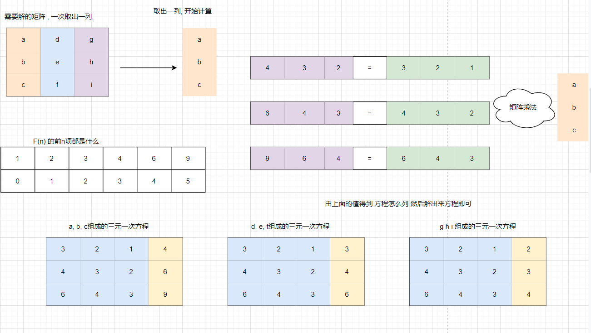


下面的函数可以一次解出 一组解 解除的解是原矩阵中的一列

```java
/**
     *
     * @param f   前n项的值 组成的数组
     * @param len 矩阵大小[len][len + 1] 每一行最后一个位置放
     * @param col 第几列 代表这是第几列行列式 算法内部会减去这个值
     * @return int[] 方程的解
     * @author lihd
     * @creed: 春春的飞舞
     * @date 2022/5/25 21:11
     */
    public static int[] solvingEquations(int[] f, int len, int col) {
        int[][] result = new int[len][len + 1];
        for (int i = 0; i < len; i++) {
            for (int j = 0; j < len; j++) {
                result[i][j] = f[len + i - j - 1];
            }
            result[i][len] = f[len + i - col];
        }
        return Matrix.getResultInteger(result);
    }
```


下面可以获取解出的矩阵, 由于我们上一步得到的结果被转置了, 因此这里需要 转置才是原结果, 不过方法名是转置后的, 因此不需要转置

```java
 public static int[][] getMatrixResultReverse(int[] f, int len) {
        int[][] matrix = new int[len][len];
        for (int i = 0; i < len; i++) {
            matrix[i] = solvingEquations(f, len, i);
        }
        return matrix;
    }
```


根据递推式获取前n项值的公式 

```java
//F(N) = 10F(N - 1) + 8F(N - 3) - 7F(N - 6)
    //init = 1
    //params = [10,0,8,0,0,-7]
    //num = you need return arr length !
    public static int[] createNums(int init, int[] params, int num) {
        int[] ans = new int[num];
        ans[0] = init;
        for (int i = 1; i < num; i++) {
            for (int j = 0; j < params.length; j++) {
                if (i > j) {
                    // 表示参数的值可用
                    // i = N + 1 i 的意义是 第 N + 1项 因为N在函数中是从1开始的, 而数组是从0开始的, 因此要 + 1
                    // j = N - j - 1  j 的意义是 第 N - j - 1 是否存在, 比如j= 0 表示 第N - 1项
                    // j = 1表示 第 N - 2项
                    //而 要进行计算 必须满足 这是第 i项时 , j所在的项存在
                    ans[i] += params[j] * ans[i - j - 1];
                }
            }
        }
        return ans;
    }

    public static int[] createNums(int[] inits, int[] params, int num) {
        int[] ans = new int[num];
        System.arraycopy(inits, 0, ans, 0, inits.length);
        for (int i = inits.length; i < num; i++) {
            for (int j = 0; j < params.length; j++) {
                ans[i] += params[j] * ans[i - j - 1];
            }
        }
        return ans;
    }
```


全部代码 包含矩阵的快速幂 可以解决所有此类问题, 非常的好用

```java
public class FindMatrixByRecursion {

    public static void main(String[] args) {
        int[] inits = {1, 2};
        int[] params = {1, 1};
        System.out.println(f(25, inits, params));
    }

    //F(N) = 10F(N - 1) + 8F(N - 3) - 7F(N - 6)
    //init = 1
    //params = [10,0,8,0,0,-7]
    //num = you need return arr length !
    public static int[] createNums(int init, int[] params, int num) {
        int[] ans = new int[num];
        ans[0] = init;
        for (int i = 1; i < num; i++) {
            for (int j = 0; j < params.length; j++) {
                if (i > j) {
                    // 表示参数的值可用
                    // i = N + 1 i 的意义是 第 N + 1项 因为N在函数中是从1开始的, 而数组是从0开始的, 因此要 + 1
                    // j = N - j - 1  j 的意义是 第 N - j - 1 是否存在, 比如j= 0 表示 第N - 1项
                    // j = 1表示 第 N - 2项
                    //而 要进行计算 必须满足 这是第 i项时 , j所在的项存在
                    ans[i] += params[j] * ans[i - j - 1];
                }
            }
        }
        return ans;
    }

    public static int[] createNums(int[] inits, int[] params, int num) {
        int[] ans = new int[num];
        System.arraycopy(inits, 0, ans, 0, inits.length);
        for (int i = inits.length; i < num; i++) {
            for (int j = 0; j < params.length; j++) {
                ans[i] += params[j] * ans[i - j - 1];
            }
        }
        return ans;
    }

    

    public static int f(int n, int[] inits, int[] params) {
        //baseCase
        if (n < 1) {
            return 0;
        }
        //baseCase
        for (int i = 0; i < inits.length; i++) {
            if (n == i + 1) {
                return inits[i];
            }
        }
        int[][] transitionMatrix = getTheTransitionMatrix(inits, params);
        int[][] power = matrixPower(transitionMatrix, n - params.length);
        int ans = 0;
        //这里是前行乘以后列, 注意 inits数组的顺序是倒序
        //一定要处处细心
        for (int i = 0; i < inits.length; i++) {
            ans += power[i][0] * inits[inits.length - i -  1];
        }
        return ans;
    }

    public static int[][] matrixPower(int[][] matrix, int n) {
        int[][] ans = new int[matrix.length][matrix[0].length];
        for (int i = 0; i < matrix.length; i++) {
            ans[i][i] = 1;
        }
        int[][] temp = matrix;
        while (n != 0) {
            if ((n & 1) != 0) {
                ans = matrixMul(temp, ans);
            }
            temp = matrixMul(temp, temp);
            n >>= 1;
        }
        return ans;
    }


    public static int[][] getTheTransitionMatrix(int[] inits, int[] params) {
        int[] f = createNums(inits, params, params.length * 2);
        int[][] matrixResultReverse = getMatrixResultReverse(f, params.length);
        squareMatrixReverse(matrixResultReverse);
        return matrixResultReverse;
    }

    public static int[][] getMatrixResultReverse(int[] f, int len) {
        int[][] matrix = new int[len][len];
        for (int i = 0; i < len; i++) {
            matrix[i] = solvingEquations(f, len, i);
        }
        return matrix;
    }

    /**
     *
     * @param f   前n项的值 组成的数组
     * @param len 矩阵大小[len][len + 1] 每一行最后一个位置放
     * @param col 第几列 代表这是第几列行列式 算法内部会减去这个值
     * @return int[] 方程的解
     * @author lihd
     * @creed: 春春的飞舞
     * @date 2022/5/25 21:11
     */
    public static int[] solvingEquations(int[] f, int len, int col) {
        int[][] result = new int[len][len + 1];
        for (int i = 0; i < len; i++) {
            for (int j = 0; j < len; j++) {
                result[i][j] = f[len + i - j - 1];
            }
            result[i][len] = f[len + i - col];
        }
        return Matrix.getResultInteger(result);
    }

    public static void squareMatrixReverse(int[][] matrix) {
        for (int i = 0; i < matrix.length; i++) {
            for (int j = 0; j < i; j++) {
                swapMatrixEle(matrix, i, j);
            }
        }
    }

    public static void swapMatrixEle(int[][] matrix, int i, int j) {
        int temp = matrix[i][j];
        matrix[i][j] = matrix[j][i];
        matrix[j][i] = temp;
    }


    public static int[][] matrixMul(int[][] m1, int[][] m2) {
        int[][] ans = new int[m1.length][m2[0].length];
        for (int i = 0; i < m1.length; i++) {
            for (int j = 0; j < m2[0].length; j++) {
                for (int k = 0; k < m1[0].length; k++) {
                    ans[i][j] += m1[i][k] * m2[k][j];
                }
            }
        }
        return ans;
    }
}
```


设计好的通用函数

```java
public static int f(int n, int[] inits, int[] params) {
        //baseCase
        if (n < 1) {
            return 0;
        }
        //baseCase
        for (int i = 0; i < inits.length; i++) {
            if (n == i + 1) {
                return inits[i];
            }
        }
        int[][] transitionMatrix = getTheTransitionMatrix(inits, params);
        int[][] power = matrixPower(transitionMatrix, n - params.length);
        int ans = 0;
        //这里是前行乘以后列, 注意 inits数组的顺序是倒序
        //一定要处处细心
        for (int i = 0; i < inits.length; i++) {
            ans += power[i][0] * inits[inits.length - i -  1];
        }
        return ans;
    }
```


主函数以及运行结果

```java
 public static void main(String[] args) {
     //下面两个数组最好一样长, 否则不能保证结果的正确性
        int[] inits = {1, 2};
        int[] params = {1, 1};
        System.out.println(f(25, inits, params));//121393
    }
```


#### 斐波那契数列

不再多说, 实现四种复杂度的代码

1 2 ^ N -> 暴力递归

2 N -> 循环

3 logN -> 矩阵 + 快速幂

4 1 -> 通用公式


#### 达标的字符串

---

> 给定一个数N,想象只由0和1两种字符，组成的所有长度为N的字符串
> 如果某个字符串，任何0字符的左边都有1紧挨着，认为这个字符串达标
> 返回有多少达标的字符串

---


假设一个 f(i) 代表在 长度为i的字符串上有多少可能, 满足这个字符串右边一定有一个1

因此我们要求长度为10的串调用 f(9) 即可


现在开始分类讨论,f(i)这个字符串的第一个位置

如果第一个位置是 1 , 那么继续调用f(i - 1)

如果第一个位置是0, 那么第二个位置一定是 1, 继续调用 f(i - 2)

于是 f(i) = f(i - 1) + f(i - 2)

f(1) = 1 ("1")

f(2) = 2 ("10","11")

 

斐波那契数列

使用我们的通用解

传入inits = {1,2} params = {1, 1} 即可

#### 贴瓷砖

> 现有2×n的空间需要用1×2的板子(无穷个，可旋转)，那么总共有多少种填充方式。(其中，0≤n≤50，注意边界值)
>
> 【输入】
>
> 输入由一系列的测试样例构成，每一个测试样例占据一行，包含一个整数n。
>
> 【输出】
>
> 对于每一次输出样例，输出可能的填充方式。每一次输出样例另起一行。


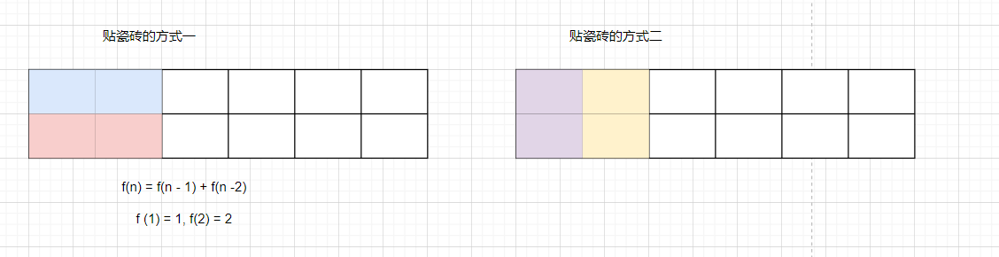


因此是斐波那契数列


使用我们的通用解

传入inits = {1,2} params = {1, 1} 即可

#### 爬楼梯问题

> 假设你正在爬楼梯。需要 n 阶你才能到达楼顶。 每次你可以爬 1 或 2 个台阶。你有多少种不同的方法可以爬到楼顶呢？ 注意：给定 n 是一个正整数。 示例 1： 输入： 2 输出： 2 解释： 有两种方法可以爬到楼顶。 1.  1 阶 + 1 阶 2.  2 阶


如果只有一个台阶 就是 f(1) = 1

如果有两个台阶 就是 f(2) = 1 +1 = 2

如果有三个台阶, 我们可以先上一个 然后再 f(2), 或者先上两个 再f(1) , f(3) = f(2) + f(1)

f(4) = f(3) +f(2)

因此是斐波那契数列问题


使用我们的通用解

传入inits = {1,2} params = {1, 1} 即可

#### 奶牛问题

> 奶牛生牛问题：
> 第1年，有一头奶牛A，总牛数为1；
> 第2年，A它生下一头奶牛B，总牛数为2；3年后，B可以成熟然后生小牛1头；
> 第3年，A它生下一头奶牛C，总牛数为3；3年后，C可以成熟然后生小牛1头；
> 第4年，A它生下一头奶牛D，总牛数为4；3年后，D可以成熟然后生小牛1头；
> 第5年，A它生下一头奶牛E，同时，B成熟了，B也生下一头奶牛F，总牛数6；
> 请问第N年一共有多少奶牛？【从不考虑公牛的事情】


今年牛的数量 =  去年的数量 + 三年前牛的数量(三年前的牛可以在这一年生出小牛)

F(N) = F(N - 1) + F(N - 3)

f(1) = 1, f(2) = 2, f(3) = 3;


使用我们的通用解

传入inits = {1,2,3} params = {1, 0,1} 即可

#### 蓄水池算法

蓄水池算法
解决的问题：
假设有一个源源吐出不同球的机器，
只有装下10个球的袋子，每一个吐出的球，要么放入袋子，要么永远扔掉
如何做到机器吐出每一个球之后，所有吐出的球都等概率被放进袋子里


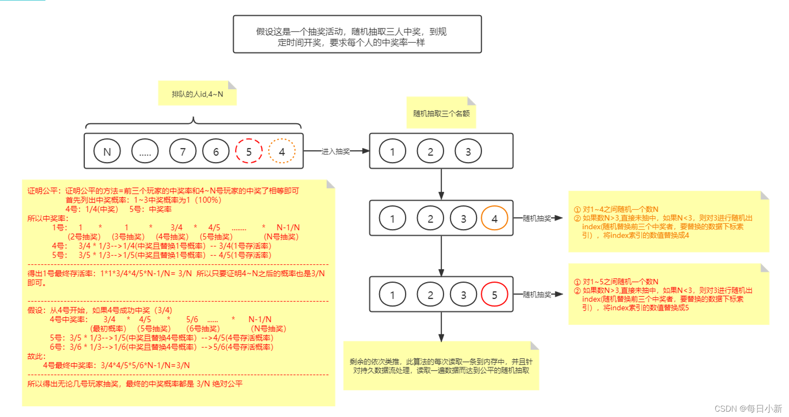
```text
```


```java
package com.lihd.part02;

/**
 * @author ：葬花吟留别1851053336@qq.com
 * @description：TODO
 * @date ：2022/5/31 10:24
 */
public class ReservoirSampling {

    int addTimes;
    int[] arr;
    public ReservoirSampling(int size) {
        arr = new int[size];
        addTimes = 0;
    }

    public void add(int val) {
        //必须得先 ++ ，不能后 ++ addTime从 1 开始多顺 
        addTimes ++;
        if (addTimes <= arr.length) {
            arr[addTimes - 1] = val;
        } else {
            if (randomVal() < arr.length) {
                int index = (int) (Math.random() * arr.length);
                arr[index] = val;
            }
        }
//        addTimes ++; //addTimes在这一行就错了 而且感觉很难改对

    }

    public int randomVal() {//[0, addTimes) 如果addTimes 那么结果刚好是 [0,arr.length]
        return (int) (Math.random() * addTimes);
    }

    public int[] getResultArr() {
        return arr;
    }


    public static void main(String[] args) {
        int addTimes = 100;
        int need = 10;
        int testTimes = 50_000;
        int[] ans = new int[addTimes];
        for (int i = 0; i < testTimes; i++) {
            ReservoirSampling sampling = new ReservoirSampling(need);
            for (int j = 0; j < addTimes; j++) {
                sampling.add(j);
            }
            for (int i1 : sampling.getResultArr()) {
                ans[i1] ++;
            }
        }

        for (int i = 0; i < ans.length; i++) {
            System.out.println(i + ":出现的次数为 :\t" + ans[i]);
        }

    }

}

```


## 3 KMP

> KMP算法是一种改进的字符串匹配算法，由D.E.Knuth，J.H.Morris和V.R.Pratt提出的，因此人们称它为克努特—莫里斯—普拉特操作（简称KMP算法）。KMP算法的核心是利用匹配失败后的信息，尽量减少模式串与主串的匹配次数以达到快速匹配的目的。具体实现就是通过一个next()函数实现，[函数](https://baike.baidu.com/item/函数/18686609)本身包含了模式串的局部匹配信息。KMP算法的[时间复杂度](https://baike.baidu.com/item/时间复杂度/1894057)O(m+n)


```text
思想流程 -> 了解next数组含义 -> 理解KMP算法 -> 理解next数组如何在O(m)复杂度时间生成
```


#### next 数组含义


next[i] 含义 : str从 0 -    i - 1上最大的 前缀和后缀匹配的最大长度 , 这个长度不包含全部(否则没有意义)

一方面next[i] 的值表示之前前缀和后缀最大相等的长度(不包含之前串本身)

另一方面 next[i] 的值, 比如为j, 代表着下一次匹配该去的索引, 因为之前已经匹配成功, 0 - j - 1 的长度刚好是 j, 而j 这个值刚好是下一次匹配时该去的索引


定义 next[0] = - 1, 因为前面没有字符, -1代表没有意义

定义 next[1] =  0, 因为前面只有一个字符, 由于前缀和后缀不能包含自身, 因此0代表没有相同的前缀和后缀


#### kmp两个隐藏含义

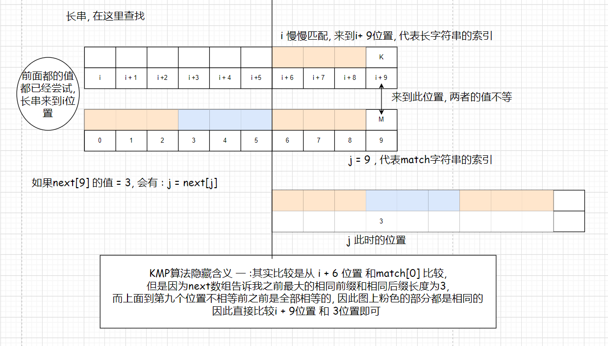


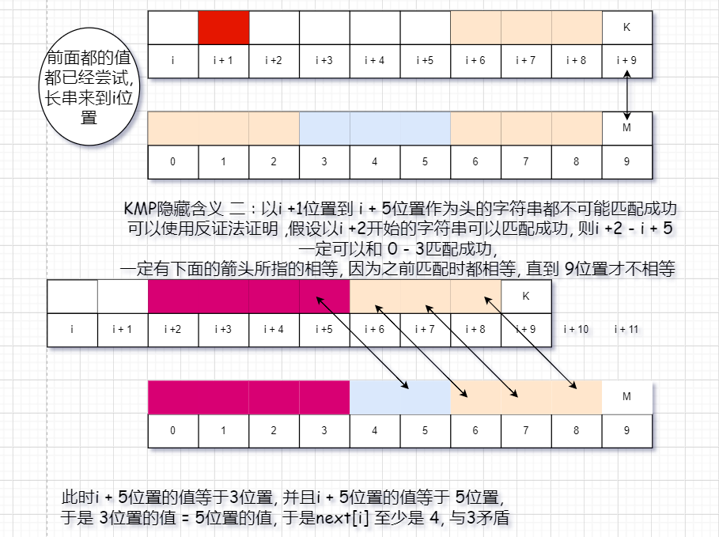


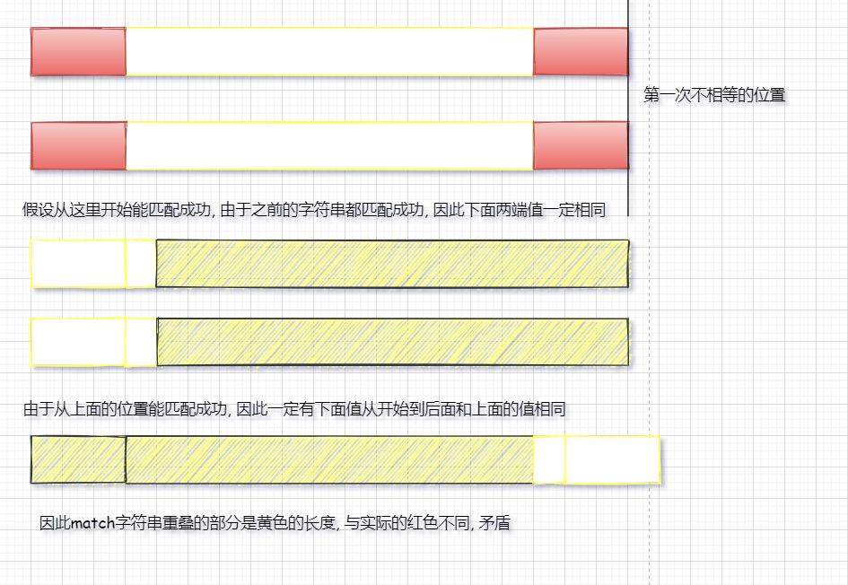


#### 求解next数组时 last的含义


#### KMP代码

```java
public static int indexOf(String str, String target) {
        if (str == null || target == null || str.length() == 0|| str.length() < target.length()) {
            return -1;
        }
        if (target.length() == 0) {
            return 0;
        }
        char[] srcChs = str.toCharArray();
        char[] tarChs = target.toCharArray();
        int[] next = getNextArr(tarChs);
        int i = 0;
        int j = 0;
        //O(N)
        while (i < srcChs.length && j < tarChs.length) {
            if (srcChs[i] == tarChs[j]) {
                i++;
                j++;
            } else if (next[j] != -1) {
                j = next[j];
            } else {//此时j = 0
                i ++;
            }
        }
        return j == tarChs.length ? i - j : -1;
    }

    //传入的值绝对不是null 长度也不是0
    public static int[] getNextArr(char[] chs) {
        if (chs.length == 1) {
            return new int[]{-1};
        }
        int[] ans = new int[chs.length];
        ans[0] = -1;
        ans[1] = 0;
        int last = 0;
        int i = 2;
        //O(M)
        while (i < ans.length) {
            if (chs[last] == chs[i - 1]) {// 千万不要写成 ans[last] == ans[i = 1]
                ans[i++] = ++last;
            } else if (last > 0) {
                last = ans[last];
            } else {
                ans[i++] = 0;
            }
        }
        return ans;
    }
```


```java
//在 src中寻找 target第一次出现的位置 使用KMP算法
    public static<T> int indexOf(T[] src, T[] target) {
        //规定,两者不为null, 并且src至少有一个长度, target长度不超过src
        if (src == null || target == null || src.length == 0 || target.length == 0 || target.length > src.length) {
            return -1;
        }
        int[] next = getNextArr(target);
        int i = 0;
        int j = 0;
        while (i < src.length && j < target.length) {
            if (src[i] == null &&  target[j] == null || Objects.equals(src[i], target[j])) {
                i ++;
                j ++;
            } else if (next[j] != -1) {// j != 0
                j = next[j];
            } else {
                //此时 j = 0
                i ++;
            }
        }
        return j == target.length ? i - j : -1;
    }

    //保证传入的数组不为null 长度不为0
    public static<T> int[] getNextArr(@NotNull T[] arr) {
        if (arr.length == 1) {
            return new int[]{-1};
        }
        //此时长度至少为2
        int[] next = new int[arr.length];
        next[0] = -1;
        next[1] = 0;
        int last = next[1];
        int index = 2;
        while (index < arr.length) {
            if ( arr[index - 1] == null && arr[last] == null ||Objects.equals(arr[index - 1], arr[last])) {
                //相等
                next[index++] = ++last;
            } else if (next[last] != -1) {
                last = next[last];
            } else {
                next[index++] = 0;
            }
        }
        return next;
    }
```


#### 复杂度O(N)证明


直观的看法, 可以认为 match数组 和 原数组都会向右移动, 每次移动的距离至少为1, 因此复杂度为O(N)


专业的证明 一个O(M) 一个O(N) 总体复杂度就是 O(N)

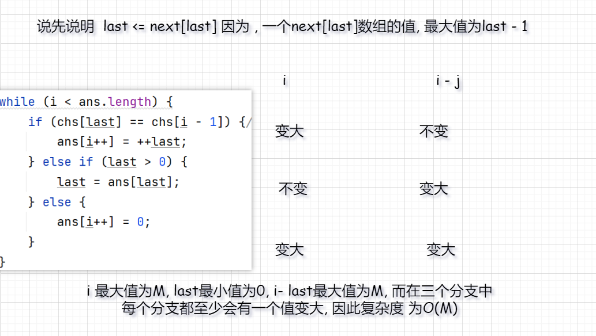

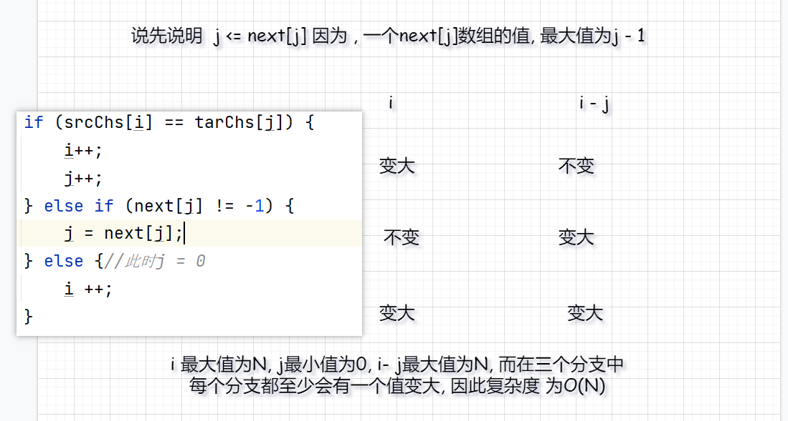


#### java的indexOf是什么复杂度


下面是jdk源码 中的indexOf 怎么看怎么像暴力方法, 难道写源码的人连kmp都不知道是什么吗

jdk自带的暴力算法在大多数情况下都要快于kmp 这也是jdk作者们的想法

如果数据量很大 那应该是kmp比较快

```text
KMP has better worst-case performance, but actually requires a little bit of up-front computation (to generate the table of offsets). It also requires an initial memory allocation, which could also impact performance.

For (presumably) common use-cases of searching in relatively short strings, this might actually end up slower than the primitive implementation.

This, bundled with the fact that for really huge data sets you will probably be using more specialized data structures than a simple String means that the increased implementation (and possibly runtime) cost is not worth investing.

Note that this might change in future Java versions, as the actual algorithm is not specified.
```


```java
static int indexOf(char[] source, int sourceOffset, int sourceCount,
            char[] target, int targetOffset, int targetCount,
            int fromIndex) {
        if (fromIndex >= sourceCount) {
            return (targetCount == 0 ? sourceCount : -1);
        }
        if (fromIndex < 0) {
            fromIndex = 0;
        }
        if (targetCount == 0) {
            return fromIndex;
        }

        char first = target[targetOffset];
        int max = sourceOffset + (sourceCount - targetCount);

        for (int i = sourceOffset + fromIndex; i <= max; i++) {
            /* Look for first character. */
            if (source[i] != first) {
                while (++i <= max && source[i] != first);
            }

            /* Found first character, now look at the rest of v2 */
            if (i <= max) {
                int j = i + 1;
                int end = j + targetCount - 1;
                for (int k = targetOffset + 1; j < end && source[j]
                        == target[k]; j++, k++);

                if (j == end) {
                    /* Found whole string. */
                    return i - sourceOffset;
                }
            }
        }
        return -1;
    }
```


测试代码 

真的差不了太多, 可能是因为我测试不了大数据吧

```java
public static String[]  createString(int len) {
        StringBuilder sb = new StringBuilder(len);
        int random = (int) (Math.random() * len);
        String ans = String.valueOf(UUID.randomUUID());
        for (int i = 0; i < len; i++) {
            String s = String.valueOf(UUID.randomUUID());
            sb.append(s);
            if (i == random) {
                ans = s;
            }
        }
        String s = sb.toString();
        return new String[]{s, ans};
//        return new String[]{s, s.substring(s.length()/2)};
    }

    /*
    int testTime = 100_000;
    int len = 100;
    jdk : String.indexOf cost : 11222 ms
    kmp : kmp.indexOf cost : 10332 ms

    修改了 match的长度, 怎么看都是对暴力解法的不利, 可是实际上还是jdk快
    jdk : String.indexOf cost : 12194 ms
    kmp : kmp.indexOf cost : 14049 ms

     */

    public static void main(String[] args) {
        int testTime = 1000;
        int len = 10000;
        long begin = System.currentTimeMillis();
        for (int i = 0; i < testTime; i++) {
            String[] string = createString(len);
            string[0].indexOf(string[1]);
        }
        long end = System.currentTimeMillis();
        System.out.println("jdk : String.indexOf cost : " + (end - begin) + " ms");
        begin = System.currentTimeMillis();
        for (int i = 0; i < testTime; i++) {
            String[] string = createString(len);
            Code01KMP.indexOf(string[0], string[1]);
        }
        end = System.currentTimeMillis();
        System.out.println("kmp : kmp.indexOf cost : " + (end - begin) + " ms");


    }
```


## 4 Bfprt


#### 场景引入

题目
在无序数组中求第K小的数
1)改写快排的方法
2)bfprt算法


```text
通常我们需要在一大堆数中求前 [公式] 大的数。比如在搜索引擎中求当天用户点击次数排名前10000的热词，在文本特征选择中求 [公式] 值按从大到小排名前 [公式] 等问题，都涉及到一个核心问题，即TOP-K问题。


求TOP-K问题最简单的方式为快速排序后取前K大的即可。但是这样做有两个问题

1. 快速排序的平均复杂度为 [公式] ，但最坏时间复杂度为 [公式] 。

2. 我们只需要前 [公式] 大的，而对其余不需要的数也进行了排序，浪费了大量排序时间。

而堆排序也是一个较好的方法，维护一个大小为 [公式] 的堆，时间复杂度为 [公式] 。


这里介绍一个比较好的算法，叫做BFPTR算法，又称为中位数的中位数算法，它的最坏时间复杂度为 [公式] ，它是由Blum、Floyd、Pratt、Rivest、Tarjan提出。该算法的思想是修改快速选择算法的主元选取方法，提高算法在最坏情况下的时间复杂度。
```


如果是笔试 ： 直接使用快排的partiton,记得随机交换一次

如果是面试 ： 可以聊一聊bfprt算法


#### 快排实现

说起这个就想起大一的暑假了 当时暑期学校就是有一道 在无序数组中找到第K小的值， 洛谷吧好像，总是有数据不能ac 那个时候会快排，不知道怎么就想到了可以使用快排做到，最终复杂度是O(N),没想到两年过去来，居然变菜了

```java
 public static int findMin(int[] arr, int index) {
        return findMin(arr, 0, arr.length - 1, index - 1);
    }


    public static int findMin(int[] arr, int L, int R, int index) {
        if (L == R) {
            return arr[L];
        }
        int randomIndex = (int) (L + Math.random() * (R - L + 1));
        int[] partition = partition(arr, L, R, arr[randomIndex]);

        if (index < partition[0]) {
            return findMin(arr, L, partition[0] - 1, index);
        } else if (index > partition[1]) {
            return findMin(arr, partition[1] + 1, R, index);
        } else {
            return arr[index];
        }
    }


    public static int[] partition(int[] arr, int L, int R, int val) {
        int less = L - 1;
        int more = R + 1;
        int i = L;
        while (i < more) {
            if (arr[i] == val) {
                i ++;
            } else if (arr[i] < val) {
                swap(arr, ++less, i++);
            } else {
                swap(arr, --more, i);
            }
        }
        return new int[]{less + 1, more - 1};
    }


    public static void swap(int[] arr, int i, int j) {
        int temp = arr[i];
        arr[i] = arr[j];
        arr[j] = temp;
    }
```


#### BFPRT算法分析


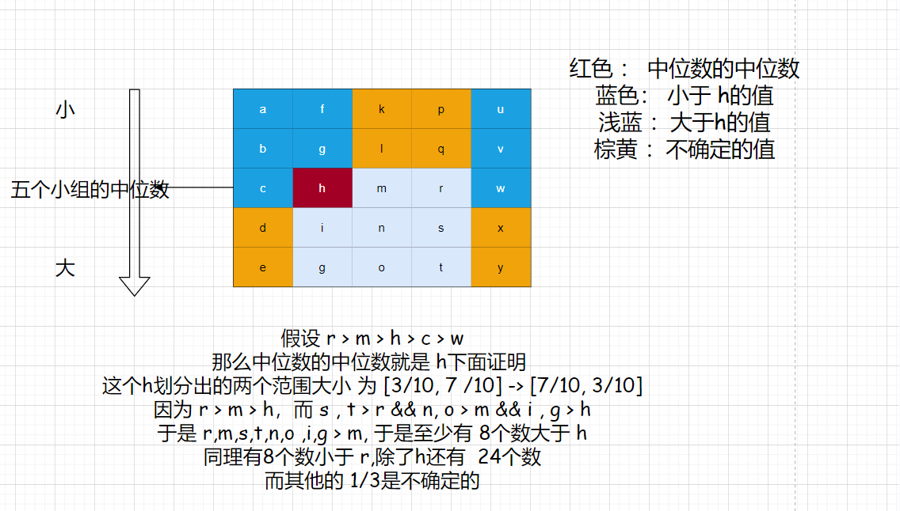

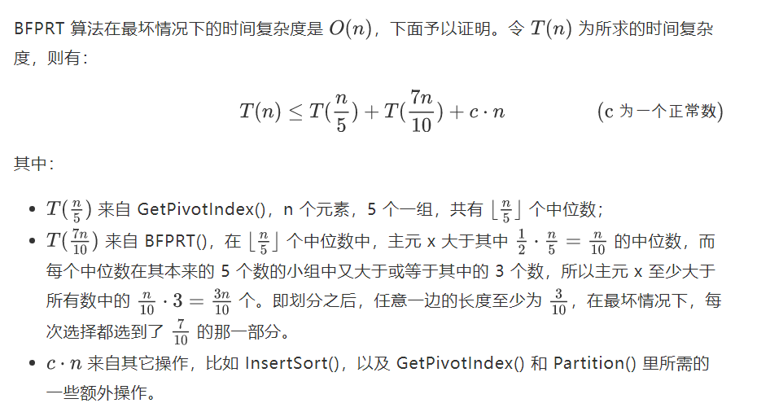


其实BFPRT和快排实现的找到最小数字差不多， 只是快排是随机选一个， BFPRT是好好选一个

如果笔试还是不要用了常数项有点高，快排一个随机多快，只不过证明很难证。


#### 别人写的分析

BFPRT是一种获得较优秀pivot的方法，方法的思路是使获得的pivot能够较为有效的对整个数据进行分割，并在其中利用寄存器的快速计算能力将问题拆分为代价极小的子问题。
方法的思路为：将元组分为n/5个5元的小数组，并对每组求中位数，在长度为n/5的序列中，求其中位数，该中位数的中位数保证了至少30%的数据在其一侧，由此保证了pivot的有效性（如图，改图来自wikipedia）
[](http://datasearch.ruc.edu.cn/~kaizhou/blog/wp-content/uploads/2011/05/9607d59b097fcd4c6b9a0fe1b0086c04.png)
关于为何利用5作为小元组大小，我的想法是与寄存器的数量和运算有关。
由于pivot的有效分割和5元组中位数易求性，从n元组中取值的代价T(n)<=T(n/5)+T(7n/10)+O(n)，T(n/5)是为中位数取中位数的时间，O(n)是遍历序列并求得中位数数列的时间.
设T(n)=cn,此处c可以不是常熟，若c与n成线性关系，则T(n)=O(n^2)，设遍历时间为an，a为常数
则有 T(n)<=c(n/5)+c(7n/10)+an=c(9/10*n)+an //此处，低次已被省略低次项
求得C<=10a 故c为常数，与n无关
且T(n)至少为O(n),
综上，该算法为一线性算法

#### BFPRT实现

```java
public class Code02Bfprt {

    public static int bfprt(int[] arr, int index) {
        return bfprt(arr, 0, arr.length - 1, index - 1);
    }

    //
    public static int bfprt(int[] arr, int L, int R, int index) {
        if (L == R) {
            return arr[L];
        }
        int val = midInMidArr(arr, L, R);
        int[] partition = partition(arr, L, R, val);
        if (index < partition[0]) {
            return bfprt(arr, L, partition[0] - 1, index);
        } else if (index > partition[1]) {
            return bfprt(arr, partition[1] + 1, R, index);
        } else {
            return arr[index];
        }
    }

    //L - R一定大于1
    public static int midInMidArr(int[] arr, int L, int R) {
        int len = R - L + 1;
        int midArrLen = len % 5 == 0 ? len / 5 : len / 5 + 1;
        int[] midArr = new int[midArrLen];
        int leftIndex;
        int rightIndex;
        for (int i = 0; i < midArrLen; i++) {
            leftIndex = L + i * 5;
            rightIndex = Math.min(leftIndex + 4, R);
            midArr[i] = sortAndReturnMid(arr, leftIndex, rightIndex);
        }
        return bfprt(midArr, 0, midArrLen - 1, midArrLen/2);
    }

    // L , R范围必须合理
    public static int[] partition(int[] arr, int L, int R, int val) {
        int less = L - 1;
        int more = R + 1;
        int i = L;
        while (i < more) {
            if (arr[i] < val) {
                swap( arr, i ++, ++less);
            } else if (arr[i] > val) {
                swap(arr, i, --more);
            } else {
                i ++;
            }
        }
        return new int[]{less + 1, more - 1};
    }

    public static int sortAndReturnMid(int[] arr, int L, int R) {
        insertSort(arr, L, R);
        return arr[L + ((R - L) >> 1)];
    }


    public static void insertSort(int[] arr, int L, int R) {
        for (int i = L + 1; i <= R; i++) {
            for (int j = i; j > 0 && arr[j] < arr[j - 1]; j--) {
                swap(arr, j, j - 1);
            }
        }
    }

    public static void swap(int[] arr, int i, int j) {
        int temp = arr[i];
        arr[i] = arr[j];
        arr[j] = temp;
    }

    public static void main(String[] args) {
        int[] arr = {8, 5, 3, 6, 9, 7, 4, 1, 2};
        int K = 3;
        System.out.println(bfprt(arr, 0, arr.length - 1, K - 1));
    }


}

```


## 5 Manacher

```text
笔记
有时候边界的值比较烦, 这个时候一定要多举例子, 找到关系, 不要在都是抽象的值的情况下,进行边界的判断

人是具象化生物, 这样做会很快的了解边界值怎么取

有时候其实举一个例子就知道边界值怎么取了, 大不了就多举几个例子, 
多用对数器分析
一旦算法错了, 多debug, 要不就多打印
不要想着自己用眼睛能看出来

少走弯路, 有时候一个小错误会浪费一晚上, 真的很亏
```


#### 回文串概念

“回文串”是一个正读和反读都一样的字符串，比如“level”或者“noon”等等就是回文串。


#### 最长回文子串

**最长回文字符串问题:给定一个字符串，求它的最长回文子串长度。**
 如果一个字符串正着读和反着读是一样的，那它就是回文串。

举个🌰 :

- `s="ababa"`, 最长回文长度为 `5`；即`ababa`
- `s="abccb"`, 最长回文长度为 `4`，即 `bccb`。


#### 最长回文子串实际用处

文字游戏 ? 为了难而难 ? 没有一定实际意义 ?


或许是这样, 也可能在DNA碱基序列上有一点用处, 或许在未来会有用处

研究者只关注问题本身, 不考虑问题本身的意义 .

那么你我存活于世是为了什么呢 ? 


#### 暴力解

从 0 - N - 1考虑每个字符做为中点位置, 向两边扩散, 相等值+ 1, 直到求出最大子回文串, 不相等就跳过本次, 继续下一次

记录每一个位置的值, 最后返回最大值


这会产生一个问题, 上面的方法返回值一定是一个奇数, 因为刚开始就一个 因此结果是1, 然后两边同时扩散, 如果相等就 + 2, 否则就下一次

因此所有结果都是奇数, 那么最长回文子串一定是奇数个吗 ? 

显然 abba 使用上面的方法返回结果值是 1, 然而应该返回4


对字符串进行预处理

abba -> #a#b#b#a#

然后按照上面的过程处理, 就会发现结果是 9 9/2 = 4, 因此结果就是4

预处理之后无论是奇数个还是偶数个都能得到正确答案


我们发现 预处理之后字符串, 每个字符 两边比较时, 填入的字符会和填入的字符比较, 有实际意义的字符会和有实际意义的字符进行比较

于是 这个填充的字符是什么根本没有关系 比如我们就填入a


abba -> aaababaaa  

结果还是 9 , 因此最终答案是 4


那暴力递归的复杂度是多少呢 ?


假设N是处理后的长度

字符串为  "#######################"

由于每个字符都会判断, 在最差的情况下, 从0 - N/2 比较次数是1 - N/2, N/2 - N比较次数是 N/2 - 1

等差数列求和 复杂度 为 O(N^2)


#### 生成辅助字符串代码

这里为了快速 首先 填充的字符是 0 注意不是'0'

因为char[]数组默认是0, 由于这个填充值是什么根本没有关系, 为了常数时间我们直接使用默认值


其中 i << 1 | 1 - > i * 2 +1这样应该比较快

 

```java
//
//辅助字符 char[]数组默认值 0
    public static char[] addAuxiliaryWords(String s) {
        if (s == null) {
            return null;
        }
        char[] chs = s.toCharArray();
        char[] ans = new char[chs.length << 1 | 1];
        for (int i = 0; i < chs.length; i++) {
            ans[i << 1 | 1] = chs[i];
        }
        return ans;
    }
```

#### 暴力解代码

这里需要证明 : 添加完 辅助字符后的最大回文半径 - 1 = 原字符串最大的回文直径(结果)

举个栗子

abba -> #a#b#b#a  最大回文半径 5

aba -> #a#b#a# 最大回文半径 4

真实的数学证明就不证了

下面的代码是非常有意义的, 因为其实 manacher算法和下面的暴力递归用很多重复的东西

```java
public static int forceMethod(String s) {
        if (s == null || s.length() == 0) {
            return -1;
        }
        char[] chs = addAuxiliaryWords(s);
        int max = 1;
        for (int i = 0; i < chs.length; i++) {
            int radius = 1;
            while (i - radius >= 0 && i + radius < chs.length && chs[i - radius] == chs[i + radius]) {
                radius++;
            }
            max = Math.max(radius - 1, max);
        }
        return max;
    }
```


#### manacher算法分析

首先学习四个概念

1 回文半径, 回文直径

2 回文半径数组 

3 回文最后边界 R

4 回文中心位置 C


关于数组的更新 : 从左到右逐个更新, 只进行一遍

关于R的更新 : 当有新的字符 chs[i]    i + 回文半径 超过R 就更新R  R = i + 回文半径

关于C的更新 : 和R同步更新 C记录当时的中心位置i


由于更新后的C 的值为 当时中心位置i, 因此后面的i 一定大于 这个中心位置i

有了这些概念, 一定有下面的拓扑关系


+ 情况一  i 在R的外面

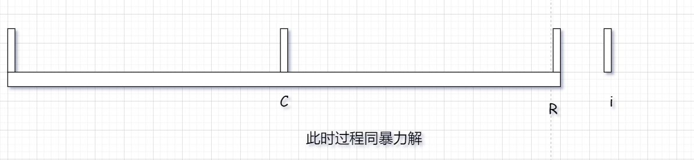


+ 情况二 i 在R内部 或上面

下面的 a == b, x == y等描述指的是 两者索引对应的值相等, 并不是指两个索引大小一致

1 :  i 的对称点 j  半径 不超过 L
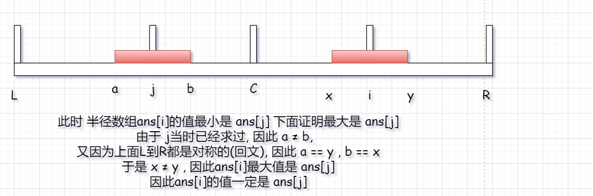
2 :  i 的对称点 j 半径 超过 L
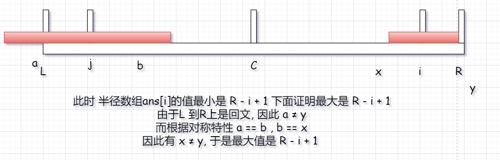


3 : i 的对称点 j 半径 等于 L
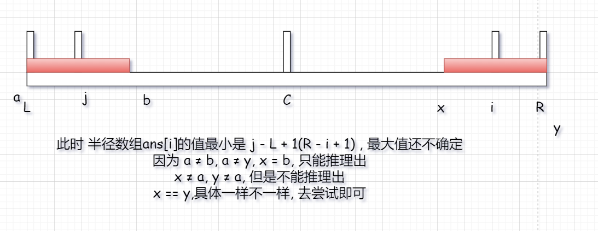

#### 算法实现


具体实现和上面的分析有差异

R的含义之前为最后一个回文位置  改为 第一个不符合回文的位置

上面分析的四种情况被合并 成为一种情况 

一定要了解 i + pArr[i] 的含义, i - pArr[i] , i  + pArr[i] 就是上面的红色的范围 


下面的代码自己分析吧


```java
public class Code01Manacher {
    public static int manacher(String s) {
        if (s == null || s.length() == 0) {
            return -1;
        }
        //s 长度至少为 1
        //处理过的串至少为  1 * 2 + 1 = 3 因此一定会进入下面的for循环
        char[] chs = addAuxiliaryWords(s);
        System.out.println(new String(chs));
        int[] pArr = new int[chs.length];
        int max = Integer.MIN_VALUE;//max 一定会被更新, 因为一个字符也算回文长度为 1
        int R = 1;
        int C = 0;
        int i = 1;
        while (i < chs.length) {
            pArr[i] = i < R ? Math.min(pArr[(C << 1) - i], R - i) : 1;
            while (i + pArr[i] < chs.length && i - pArr[i] >= 0 && chs[i + pArr[i]] == chs[ i - pArr[i]]) {
                pArr[i] ++;
            }
            if (i + pArr[i] > R) {
                R = i + pArr[i];
                C = i;
            }
            max = Math.max(pArr[i], max);
            i ++;
        }
        return max - 1;
    }


    public static int forceMethod(String s) {
        if (s == null || s.length() == 0) {
            return -1;
        }
        char[] chs = addAuxiliaryWords(s);
        int max = 1;
        for (int i = 0; i < chs.length; i++) {
            int radius = 1;
            while (i - radius >= 0 && i + radius < chs.length && chs[i - radius] == chs[i + radius]) {
                radius++;
            }
            max = Math.max(radius - 1, max);
        }
        return max;
    }

    //辅助字符 char[]数组默认值 0
    public static char[] addAuxiliaryWords(String s) {
        if (s == null) {
            return null;
        }
        char[] chs = s.toCharArray();
        char[] ans = new char[chs.length << 1 | 1];
        for (int i = 0; i < chs.length; i++) {
            ans[i << 1 | 1] = chs[i];
        }
        return ans;
    }

    public static void main(String[] args) {
        String s = "xygabaxabaayg";
        System.out.println(manacher(s));
        System.out.println(forceMethod(s));
    }

}
```


#### 算法复杂度分析

O(N)

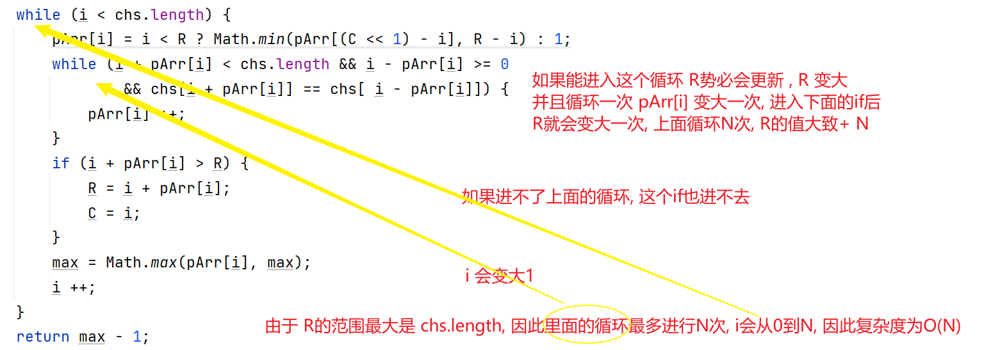


#### 算法扩展

一个字符串, 仅能在其后面添加字符, 问至少添加几个字符可以使这个字符串整体是回文串

其实这个问题问的就是 包含最后一个位置的最大回文串, 求出这个值, 使用原字符串长度 -  这个值就是答案

这就是manacher问题, 甚至是子问题, 修改manacher算法, 如果某一个时刻发现 R == chs.length, 

直接跳出循环, 省去后面的对该问题没有意义的计算


```java
public class Code02AddShortestEnd {


    public static String getShortestEnd(String s) {
        if (s == null || s.length() == 0) {
            return null;
        }
        char[] chs = addAuxiliaryWords(s);
        int[] ans = new int[chs.length];
        int len = 1;
        int R = 1;
        int C = 0;
        for (int i = 1; i < chs.length; i++) {
            ans[i] = i < R ? Math.min(ans[(C << 1) - i], R - i) : 1;
            while (i + ans[i] < chs.length && i - ans[i] >= 0 && chs[i + ans[i]] == chs[i - ans[i]]) {
                ans[i]++;
            }

            if (i + ans[i] > R) {
                R = i + ans[i];
                C = i;
            }
            if (R == chs.length) {
                len = ans[i] - 1;
                break;
            }
        }
        char[] ret = new char[s.length() - len];
        for (int i = 0; i < ret.length; i++) {
            ret[ret.length - i - 1] = chs[i << 1 | 1];
        }
        return new String(ret);
    }

    public static char[] addAuxiliaryWords(String s) {
        if (s == null) {
            return null;
        }
        char[] chs = s.toCharArray();
        char[] ans = new char[chs.length << 1 | 1];

        for (int i = 0; i < chs.length; i++) {
            ans[i << 1 | 1] = chs[i];
        }
        return ans;
    }

    public static void main(String[] args) {
        String s = "789789121787121313abba";
        String shortestEnd = getShortestEnd(s);
        System.out.println(shortestEnd);
    }

}
```


## 6 Morris 遍历

```text
笔记


什么时候用递归套路, 什么时候使用Morris遍历
笔试 : 直接使用递归套路
面试 : 
如果发现 一个节点必须同时需要左树提供一个信息 右树提供一个信息, 递归套路
如果发现一个节点的信息使用过一次后可以传递给下一个节点, 当前节点并不是需要左树和右树一起提供信息 -> morris遍历
(下面的扩展问题二就是 比如判断搜索二叉树, 如果使用判断左树和判断右树的信息, 就需要用到递归套路,
如果我采用中序方式遍历判断, 发现信息就具有了传递性, 我也没必要同时获取左树右树的信息, 因此使用morris遍历)
因此同一个问题 使用什么遍历还是取决于你的方法, 流程不同决定了最后的传递性不同, 决定了最后的方法


不要被常数项所困住, 常数项优化实在太多了, 要关注实体部分
面试笔试一般不会卡常数项时间
调用函数的常数项是比较高 , 如果总是讨论常数项将使问题变得很复杂

笔试中如果发现可以使用数组替换Map就替换, 主要Map和Set有点浪费时间 虽然复杂度是O(1) 但是常数项非常高


```


#### 流程

```text
0 : cur来到head
1 : 如果cur.left == null -> cur == cur.right
2 : 如果cur.left != null -> 找到cur的前驱节点 mostRight
	2.1 : mostRight.right == null -> mostRight.right = cur, cur = cur.left;(第一次来到)
	2.2 : mostRight.right != null -> mostRight.right = null, cur = cur.right;(第二次来到)
3 : 如果cur本身就是null, 结束

结论 : 有左孩子的节点会到达两次, 没有左孩子的节点, 只会到达一次

本质 : 模拟递归, 可以做到两次检查, 做不到三次

如何节省的空间 : 使用空间的指针
```


#### 复杂度证明

由于每个节点只会到达一次或两次, 于是最终的复杂度取决于 寻找有左树节点的前驱节点

而树可以由最左树的最右节点分解, 复杂度为O(N), 因此最终的复杂度是 O(N)


或者说每个节点寻找前驱节点都是不重复而且是一个长链, 因此复杂度是O(N)


空间复杂度 很明显是 O(1)


#### 使用Morris实现前中后序遍历

前中都比较简单, 

有的节点是达到两次, 有的节点只到达一次

前序 : 两次到达的节点 第一次到达输出, 到达一次的节点直接输出

中序 : 两次到达的节点 第二次到达输出, 到达一次的节点直接输出


后序需要 链表反转知识

找到所有的二次到达的节点, 输出左孩子到前驱节点的逆序, 

最后逆序输出头节点到其最右节点(因此没有一个节点是他们的前驱)

逆序输出时千万不要用栈, 使用链表的反转, 空间复杂度保持O(1), 


#### 代码

```java
public class Code01Morris {
    public static void morris(Node head) {
        if (head == null) {
            return;
        }
        Node cur = head;
        Node mostRight;
        while (cur != null) {
            mostRight = cur.left;
            if (mostRight != null) {
                while (mostRight.right != null && mostRight.right != cur) {
                    mostRight = mostRight.right;
                }
                //找到前驱节点
                if (mostRight.right == cur) {
                    mostRight.right = null;
                    System.out.print(cur.val + " ");
                    cur = cur.right;
                } else {
                    mostRight.right = cur;
                    System.out.print(cur.val + " ");
                    cur = cur.left;
                }
            } else {
                System.out.print(cur.val + " ");
                cur = cur.right;   
            }
        }
        System.out.println();
    }

    public static void preMorris(Node head) {
        if (head == null) {
            return;
        }
        Node cur = head;
        Node mostRight;
        while (cur != null) {
            mostRight = cur.left;
            if (mostRight == null) {
                System.out.print(cur.val + " ");
                cur = cur.right;
            } else {
                while (mostRight.right != null && mostRight.right != cur) {
                    mostRight = mostRight.right;
                }
                if (mostRight.right == null) {
                    mostRight.right = cur;
                    System.out.print(cur.val + " ");
                    cur = cur.left;
                } else {
                    mostRight.right = null;
                    cur = cur.right;
                }
            }
        }
        System.out.println();
    }

    public static void inMorris(Node head) {
        if (head == null) {
            return;
        }
        Node cur = head;
        Node mostRight;
        while (cur != null) {
            mostRight = cur.left;
            if (mostRight == null) {
                System.out.print(cur.val + " ");
                cur = cur.right;
            } else {
                while (mostRight.right != null && mostRight.right != cur) {
                    mostRight = mostRight.right;
                }
                if (mostRight.right == null) {
                    mostRight.right = cur;
                    cur = cur.left;
                } else {
                    mostRight.right = null;
                    System.out.print(cur.val + " ");
                    cur = cur.right;
                }
            }
        }
        System.out.println();
    }


    public static void postMorris(Node head) {
        if (head == null) {
            return;
        }
        Node cur = head;
        Node mostRight;
        while (cur != null) {
            mostRight = cur.left;
            if (mostRight == null) {
                cur = cur.right;
            } else {
                while (mostRight.right != null && mostRight.right != cur) {
                    mostRight = mostRight.right;
                }
                if (mostRight.right == null) {
                    mostRight.right = cur;
                    cur = cur.left;
                } else {
                    mostRight.right = null;
                    printNodeReverseRight(cur.left);
                    cur = cur.right;
                }
            }
        }
        printNodeReverseRight(head);
        System.out.println();
    }


    public static void printNodeReverseRight(Node node) {
        Node newHead = reverseNodeThrowRight(node);
        Node cur = newHead;
        while (cur != null) {
            System.out.print(cur.val + " ");
            cur = cur.right;
        }
        reverseNodeThrowRight(newHead);
    }

    public static Node reverseNodeThrowRight(Node node) {
        Node pre = null;
        Node next;
        while (node != null) {
            next = node.right;
            node.right = pre;
            pre = node;
            node = next;
        }
        return pre;
    }


    public static void main(String[] args) {
        Node head = new Node(4);
        head.left = new Node(2);
        head.right = new Node(6);
        head.left.left = new Node(1);
        head.left.right = new Node(3);
        head.right.left = new Node(5);
        head.right.right = new Node(7);
        morris(head);
        preMorris(head);
        inMorris(head);
        postMorris(head);
    }
}

```


#### 扩展问题

寻找一个树的最低高度, 只有到叶节点才能算高度

考虑使用Morris遍历 : 使用一个变量记录高度, 使用一种机制记录是不是叶节点 , 做到这两点, 问题就解决了


使用move记录寻找最后节点时 向右移动了多少次 , 如果发现是第二次到达, 使用h = h - move就知道当前是第几层

判断叶节点需要 第二次到达找到其前驱节点才能知道 其是不是叶节点 具体看代码 还是很有意思的

```java
public class Code02MinHeight {

    public static int minHeight3(Node head) {
        if (head == null) {
            return 0;
        }
        return minHeight2(head);
    }

    public static int minHeight2(Node head) {
        if (head.left == null && head.right == null) {
            return 1;
        }
        int left = Integer.MAX_VALUE;
        int right = Integer.MAX_VALUE;
        if (head.left != null) {
            left = minHeight2(head.left);
        }
        if (head.right != null) {
            right = minHeight2(head.right);
        }
        return Math.min(left, right) + 1;
    }

    public static int minHeight(Node head) {
        if (head == null) {
            return 0;
        }
        Node cur = head;
        Node mostRight;
        int level = 0;
        int move;
        int min = Integer.MAX_VALUE;
        while (cur != null) {
            mostRight = cur.left;
            if (mostRight == null) {
                level++;
                cur = cur.right;
            } else {
                move = 1;
                while (mostRight.right != null && mostRight.right != cur) {
                    move ++;
                    mostRight = mostRight.right;
                }
                if (mostRight.right == null) {
                    level ++;
                    mostRight.right = cur;
                    cur = cur.left;
                } else {
                    if (mostRight.left == null) {
                        //叶节点
                        min = Math.min(min, level);
                    }
                    level -= move;
                    cur = cur.right;
                    mostRight.right = null;

                }
            }
        }
        Node right = head;
        int l = 1;
        while (right.right != null) {
            right = right.right;
            l++;
        }
        if (right.left == null) {
            min = Math.min(l, min);
        }

        return min;
        
    }

    // for test
    public static Node generateRandomBST(int maxLevel, int maxValue) {
        return generate(1, maxLevel, maxValue);
    }

    // for test
    public static Node generate(int level, int maxLevel, int maxValue) {
        if (level > maxLevel || Math.random() < 0.5) {
            return null;
        }
        Node head = new Node((int) (Math.random() * maxValue));
        head.left = generate(level + 1, maxLevel, maxValue);
        head.right = generate(level + 1, maxLevel, maxValue);
        return head;
    }

    public static void main(String[] args) {
        int treeLevel = 7;
        int nodeMaxValue = 5;
        int testTimes = 100000;
        System.out.println("test begin");
        for (int i = 0; i < testTimes; i++) {
            Node head = generateRandomBST(treeLevel, nodeMaxValue);
            int ans2 = minHeight3(head);
            int ans1 = minHeight(head);
            if (ans1 != ans2) {
                System.out.println(ans1);
                System.out.println(ans2);
                System.out.println("Oops!");
                Code01Morris.preMorris(head);
                break;
            }
        }
        System.out.println("test finish!");
    }
}

```


#### 扩展问题二

比较简单, 注意一点, 如果一定要完成morris遍历后再返回, 

如果某个位置已经不满足, 记录状态, 等遍历完成后再返回, 否则会有环在树的结构中

就是因为这个原因调试了好久

```java
public class Code03IsBST {


    public static class Info{
        boolean isBST;
        Integer max;
        Integer min;

        public Info(boolean isBST) {
            this.isBST = isBST;
        }

        public Info(boolean isBST, int max, int min) {
            this.isBST = isBST;
            this.max = max;
            this.min = min;
        }
    }

    public static boolean isBST(Node head) {
        return getBSTInfo(head).isBST;
    }

    public static Info getBSTInfo(Node head) {
        if (head == null) {
            return new Info(true);
        }
        Info leftInfo = getBSTInfo(head.left);
        Info rightInfo = getBSTInfo(head.right);
        int max = head.val;
        int min = head.val;
        if (leftInfo.max != null) {
            max = Math.max(max, leftInfo.max);
            min = Math.min(min, leftInfo.min);
        }
        if (rightInfo.max != null) {
            max = Math.max(max, rightInfo.max);
            min = Math.min(min, rightInfo.min);
        }

        boolean isBST = leftInfo.isBST && rightInfo.isBST && (leftInfo.max == null || leftInfo.max < head.val) && (rightInfo.min == null || rightInfo.min > head.val);

        return new Info(isBST, max, min);
    }


    public static boolean isBST2(Node head) {
        if (head == null) {
            return true;
        }
        Node cur = head;
        Node mostRight;
        Integer lastVal = null;
        boolean ans = true;
        while (cur != null) {
            mostRight = cur.left;
            if (mostRight == null) {
                if (lastVal != null && lastVal >= cur.val) {
                    ans = false;
                }
                lastVal = cur.val;
                cur = cur.right;
            } else {
                while (mostRight.right != null && mostRight.right != cur) {
                    mostRight = mostRight.right;
                }
                if (mostRight.right == null) {
                    mostRight.right = cur;
                    cur = cur.left;
                } else {
                    mostRight.right = null;
                    if (lastVal != null && lastVal >= cur.val) {
                        ans = false;
                    }
                    lastVal = cur.val;
                    cur = cur.right;
                }
            }
        }
        return ans;

    }

    // for test
    public static Node generateRandomBST(int maxLevel, int maxValue) {
        return generate(1, maxLevel, maxValue);
    }

    // for test
    public static Node generate(int level, int maxLevel, int maxValue) {
        if (level > maxLevel || Math.random() < 0.5) {
            return null;
        }
        Node head = new Node((int) (Math.random() * maxValue));
        head.left = generate(level + 1, maxLevel, maxValue);
        head.right = generate(level + 1, maxLevel, maxValue);
        return head;
    }

    public static void main(String[] args) {
        int treeLevel = 7;
        int nodeMaxValue = 5;
        int testTimes = 100000;
        System.out.println("test begin");
        for (int i = 0; i < testTimes; i++) {
            Node head = generateRandomBST(treeLevel, nodeMaxValue);
            boolean ans2 = isBST2(head);
            boolean ans1 = isBST(head);
            if (ans1 != ans2) {
                System.out.println("ans1 = " + ans1);
                System.out.println("ans2 = " + ans2);
                Code01Morris.preMorris(head);
                break;
            }
        }
        System.out.println("test finish!");
    }


}

```


## 7 线段树 SegmentTree

```text
笔记
使用条件 ： 
1 区间增加 修改 查询 
2 父节点可以由子节点简单加工得到，不需要左右子树的具体状况

特点 
1 空间换时间
2 时间复杂度 O(log N)

可以使用线段树的例子
1 ：区间增加，修改，查询区间最大小值
2 ：区间增加，修改，查询区间总和

不可以使用线段树的例子
1 ：求区间那个数字出现的次数最多 由于无法从左树和右树简单加工得到，因此不能使用线段树

```


#### 常见操作

1 抛弃角标0 ， 从1 开始 这样找到左右孩子比较方便一点，可以使用位运算加速常数项时间

2 直接申请四倍原数组大小，确保可以存放所有累加和信息

3 可以去知乎阅读文章，https://zhuanlan.zhihu.com/p/106118909 写的还行 主要我写的太拉 就不写了 代码绝对是对的


#### 代码实现

已经经过对数器验证

```java
public class SegmentTree {
    private int size;
    private final int[] arr;
    private final int[] sum;
    private final int[] addLazy;
    private final int[] updateLazy;
    private final boolean[] isUpdateLazy;

    public SegmentTree(int[] a) {
        int size = a.length + 1;
        arr = new int[size];
        for (int i = 0; i < a.length; i++) {
            arr[i + 1] = a[i];
        }
        int extendSize = size << 2;
        sum = new int[extendSize];
        addLazy = new int[extendSize];
        updateLazy = new int[extendSize];
        isUpdateLazy = new boolean[extendSize];

    }

    public void build(int l, int r, int index) {
        if (l == r) {
            sum[index] = arr[l];
        } else {
            int mid = l + ((r - l) >> 1);
            build(l, mid, index << 1);
            build(mid + 1, r, index << 1 | 1);
            pushUp(index);
        }
    }

    public void pushUp(int index) {
        sum[index] = sum[index << 1] + sum[index << 1 | 1];
    }

    public void pushDown(int index, int leftNum, int rightNum) {
        if (isUpdateLazy[index]) {
            isUpdateLazy[index << 1] = true;
            isUpdateLazy[index << 1 | 1] = true;

            updateLazy[index << 1] = updateLazy[index];
            updateLazy[index << 1 | 1] = updateLazy[index];

            addLazy[index << 1] = 0;
            addLazy[index << 1 | 1] = 0;

            sum[index << 1] = leftNum * updateLazy[index];
            sum[index << 1 | 1] = rightNum * updateLazy[index];

//            updateLazy[index] = 0;
            isUpdateLazy[index] = false;
        }

        if (addLazy[index] != 0) {
            addLazy[index << 1] += addLazy[index];
            addLazy[index << 1 | 1] += addLazy[index];

            sum[index << 1] += addLazy[index] * leftNum;
            sum[index << 1 | 1] += addLazy[index] * rightNum;

            addLazy[index] = 0;
        }
    }


    public void add(int L, int R, int V, int l, int r, int index) {
        if (L <= l && r <= R) {
            sum[index] +=  V * (r - l + 1);
            addLazy[index] += V;
        } else {
            int mid = ((r - l) >> 1) + l;
            pushDown(index,mid - l + 1, r - mid);
            if (L <= mid) {
                add(L, R, V, l, mid, index << 1);
            }
            if (R > mid) {
                add(L, R, V, mid + 1, r, index << 1 | 1);
            }
            pushUp(index);
        }
    }

    public void update(int L, int R, int V, int l, int r, int index) {
        if (L <= l && r <= R) {
            sum[index] = V * (r - l + 1);
            addLazy[index] = 0;
            isUpdateLazy[index] = true;
            updateLazy[index] = V;
        } else {
            int mid = ((r - l) >> 1) + l;
            pushDown(index,mid - l + 1, r - mid);
            if (L <= mid) {
                update(L, R, V, l, mid, index << 1);
            }
            if (R > mid) {
                update(L, R, V, mid + 1, r, index << 1 | 1);
            }
            pushUp(index);
        }
    }

    public long query(int L, int R, int l, int r, int index) {
        if (L <= l && r <= R) {
            return sum[index];
        } else {
            int mid = ((r - l) >> 1) + l;
            pushDown(index,mid - l + 1, r - mid);
            long ans = 0;
            if (L <= mid) {
                ans += query(L, R, l, mid, index << 1);
            }
            if (R > mid) {
                ans += query(L, R, mid + 1, r, index << 1 | 1);
            }
            //为什么汇总不需要 pushUp
            pushUp(index);
            return ans;
        }
    }

    public long query(int L, int R) {
        if (R > size || L > R || L < 0) {
            throw new RuntimeException("范围越界");
        }
        return query(L, R, 1, size - 1, 1);
    }

    public void add(int L, int R, int V) {
        if (R > size || L > R || L < 0) {
            throw new RuntimeException("范围越界");
        }
        add(L, R, V, 1, size - 1, 1);
    }

    public void update(int L, int R, int V) {
        if (R > size || L > R || L < 0) {
            throw new RuntimeException("范围越界");
        }
        update(L, R, V, 1, size - 1, 1);
    }
}
```


## 8 线段树例题 + 线段重合


```text
模板一般可以用
如果实在用不了，就要练的非常熟练

对数器很好用，非常有意义。
```


#### 题目一 leetcode原题

https://leetcode.com/problems/falling-squares/

---

> 想象一下标准的俄罗斯方块游戏，X轴是积木最终下落到底的轴线
> 下面是这个游戏的简化版：
> 1)只会下落正方形积木
> 2)[,b]->代表一个边长为b的正方形积木，积木左边缘沿着X=a这条线从上方掉落
> 3)认为整个X轴都可能接住积木，也就是说简化版游戏是没有整体的左右边界的
> 4)没有整体的左右边界，所以简化版游戏不会消除积木，因为不会有哪一层被填满。
> 给定一个N*2的二维数组matrⅸ，可以代表N个积木依次掉落，
> 返回每一次掉落之后的最大高度
>
>  
>
> There are several squares being dropped onto the X-axis of a 2D plane.
>
> You are given a 2D integer array `positions` where `positions[i] = [lefti, sideLengthi]` represents the `ith` square with a side length of `sideLengthi` that is dropped with its left edge aligned with X-coordinate `lefti`.
>
> Each square is dropped one at a time from a height above any landed squares. It then falls downward (negative Y direction) until it either lands **on the top side of another square** or **on the X-axis**. A square brushing the left/right side of another square does not count as landing on it. Once it lands, it freezes in place and cannot be moved.
>
> After each square is dropped, you must record the **height of the current tallest stack of squares**.
>
> Return *an integer array* `ans` *where* `ans[i]` *represents the height described above after dropping the* `ith` *square*.

---


```text
1 首先一定要进行空间压缩 
因为可能会给我们一个很大的 区间，其中有大部分值都是用不到的，如果不使用空间压缩会浪费大量空间

2 使用线段树部分特性即可
本次只涉及到 update 和 query操作
并且这与上面提到的求sum的实例代码是有一点小差别的
里面也没有复制出arr[] 这是因为我们就从0开始， 由于没有累加（add）， 我们也不需要arr[] 只有update即可

3 抽象化正方形 时 比如 [2,3] 代表的是以2开始 边长为 3的正方形
那么对应成索引是 [2,5] 吗 ？
不是 因为如果包括5，再来一个[5,1]会出问题，
所以真正的范围是 [2, 5) 由于是整数 因此范围就是 [2,4]

注意上面三个细节即可
```


```java
/
 * 一次过，居然一点错也没出，看来编程能力在逐步提升
 * Runtime: 14 ms, faster than 96.35% of Java online submissions for Falling Squares.
 * Memory Usage: 42.8 MB, less than 98.96% of Java online submissions for Falling Squares./
 
public class Code02FallingSquares {


    public List<Integer> fallingSquares(int[][] positions) {
        List<Integer> list = new ArrayList<>(positions.length);
        HashMap<Integer, Integer> map = compress(positions);
        SegmentTree segmentTree = new SegmentTree(map.size());

        int max = 0;
        for (int i = 0; i < positions.length; i++) {
            int L = map.get(positions[i][0]);
            int R = map.get(positions[i][1] + positions[i][0] - 1);
            int height = segmentTree.query(L, R) + positions[i][1];
            max = Math.max(height, max);
            list.add(max);
            segmentTree.update(L, R, height);
        }

        return list;
    }


    public static HashMap<Integer, Integer> compress(int[][] positions) {
        TreeSet<Integer> treeSet = new TreeSet<>();
        for (int[] arr : positions) {
            treeSet.add(arr[0]);
            treeSet.add(arr[1] + arr[0] - 1);
        }

        int index = 1;
        HashMap<Integer, Integer> map = new HashMap<>(positions.length);
        for (Integer integer : treeSet) {
            map.put(integer, index++);
        }
        return map;
    }

    public static class SegmentTree{
        int size;
        int[] max;
        int[] updateLazy;
        boolean[] isUpdateLazy;
        public SegmentTree(int size) {
            this.size = size +  1;
            int extendSize = size << 2;
            max = new int[extendSize];
            updateLazy = new int[extendSize];
            isUpdateLazy = new boolean[extendSize];
        }


        public void pushUp(int index) {
            max[index] = Math.max(max[index << 1], max[index << 1 | 1]);
        }

        public void pushDown(int index) {
            if (isUpdateLazy[index]) {
                int left = index << 1;
                int right = index << 1 | 1;
                isUpdateLazy[left] = true;
                isUpdateLazy[right] = true;
                updateLazy[left] = updateLazy[index];
                updateLazy[right] = updateLazy[index];
                max[left] = updateLazy[index];
                max[right] = updateLazy[index];
                isUpdateLazy[index] = false;
            }
        }


        public void update(int L, int R, int V, int l, int r, int index) {
            if (L <= l && r <= R) {
                isUpdateLazy[index] = true;
                updateLazy[index] = V;
                max[index] = V;
            } else {
                pushDown(index);
                int mid = ((r - l) >> 1) + l;
                if (L <= mid) {
                    update(L, R, V, l, mid, index << 1);
                }
                if (R > mid) {
                    update(L, R, V, mid + 1, r, index << 1 | 1);
                }
                pushUp(index);
            }
        }

        public int query(int L, int R, int l, int r, int index) {
            if (L <= l && r <= R) {
                return max[index];
            } else {
                pushDown(index);
                int mid = ((r - l) >> 1) + l;
                int max = 0;
                if (L <= mid) {
                    max = Math.max(query(L, R, l, mid, index << 1),max);
                }
                if (R > mid) {
                    max = Math.max(query(L, R, mid + 1, r, index << 1 | 1),max);
                }
                pushUp(index);
                return max;
            }
        }

        public int query(int L, int R) {
            return query(L, R, 1, size - 1, 1);
        }

        public void update(int L, int R, int V) {
            update(L, R, V, 1,size - 1, 1);
        }
    }


}

```


#### 题目二 油漆房子问题

没搜到这个题

大概的意思是 有一堆房子 1- N

有两个操作  

1 把 L - R上的房子全部染成一种颜色

2 统计L -R上房子的所有颜色数

假设一共有17种颜色，请实现这个结构


很明显这在提示我们用 线段树

但是能用吗 ？

```text
线段树要求父节点的值可以由两个子节点简单加工得到，不需要知道具体的情况

然后17种颜色，容易加工吗 ？

容易 ，甚至一个整数 64bit就够了 ， 用低18位代表17种颜色和没染颜色

父类的信息 可以这样得到 father = left | right -> 01010 | 11100 -> 11110 很简单就能加工出信息

并且只需要update操作即可， 因此这个结构应该不难实现，点到为止，如果有时间，一定好好写写。
```


#### 题目三 线段重合问题

---

> 给定很多线段，每个线段都有两个数[start, end]，表示线段开始位置和结束位置，左右都是闭区间。
> 规定:
> 1)线段的开始和结束位置一定都是整数值
> 2)线段重合区域的长度必须>=1
> 返回线段最多重合区域中，包含了几条线段

---


```text
这道题用线段树肯定能做 注意细节就是和上面矩阵那道题差不多，注意范围应该是左闭右开的 [L,R)

但是我们不用线段树 用另一个解法 : 我们使用堆结构完成 ，千万不要用排序树，因为他不允许等值，而题目可没说不能相等。堆结构就比较好用

先用 开始位置排序，复杂度 O(N * log N)
然后构造一个根据 结束位置排序的小根堆 
然后依次遍历 遍历到的元素为cur
如果 cur.left >= 堆.peek.right 说明这个元素对我已经没有任何影响，弹出
由于每个元素都会进入 弹出堆一次，因此复杂度是 O (N * log N)

堆中的元素个数就是 最多的重合区域

里面也附上了暴力解，这个解更容易理解，符合人类智慧
```


```java
public class Code01CoverMax {

    public static class Line{
        int begin;
        int end;

        public Line(int begin, int end) {
            this.begin = begin;
            this.end = end;
        }
    }


    public static int maxCover(int[][] lines) {
        Line[] lineArr = new Line[lines.length];
        for (int i = 0; i < lines.length; i++) {
            lineArr[i] = new Line(lines[i][0], lines[i][1]);
        }
        Arrays.sort(lineArr, (a, b) -> a.begin - b.begin);
        PriorityQueue<Line> heap = new PriorityQueue<>((a, b) -> a.end - b.end);
        int max = 0;
        for (Line line : lineArr) {
            while (!heap.isEmpty() && line.begin >= heap.peek().end) {
                heap.poll();
            }
            heap.add(line);
            max = Math.max(max, heap.size());
        }
        return max;
    }


    public static int maxCover2(int[][] lines) {
        int max = Integer.MIN_VALUE;
        int min = Integer.MAX_VALUE;
        for (int[] line : lines) {
            min = Math.min(min, line[0]);
            max = Math.max(max, line[1]);
        }
        int len = max - min + 1;
        int[] ans = new int[len];
        for (int[] line : lines) {
            for (int j = line[0]; j < line[1]; j++) {
                ans[j - min]++;
            }
        }
        int maxVal = Integer.MIN_VALUE;
        for (int i = 0; i < len; i++) {
            maxVal = Math.max(maxVal, ans[i]);
        }
        return maxVal;
    }


    // for test
	public static int[][] generateLines(int N, int L, int R) {
		int size = (int) (Math.random() * N) + 1;
		int[][] ans = new int[size][2];
		for (int i = 0; i < size; i++) {
			int a = L + (int) (Math.random() * (R - L + 1));
			int b = L + (int) (Math.random() * (R - L + 1));
			if (a == b) {
				b = a + 1;
			}
			ans[i][0] = Math.min(a, b);
			ans[i][1] = Math.max(a, b);
		}
		return ans;
	}

	public static void main(String[] args) {
		System.out.println("test begin");
		int N = 100;
		int L = 0;
		int R = 200;
		int testTimes = 200000;
		for (int i = 0; i < testTimes; i++) {
			int[][] lines = generateLines(N, L, R);
			int ans1 = maxCover(lines);
			int ans2 = maxCover2(lines);
			if (ans1 != ans2) {
				System.out.println("Oops!");
			}
		}
		System.out.println("test end");
	}

}
```


#### 题目四 矩阵重合问题

据说是 京东面试题 -> 原来是网易

---

> 矩形重叠【网易2019实习生招聘笔试】
> 平面内有n个矩形, 第i个矩形的左下角坐标为(x1[i], y1[i]), 右上角坐标为(x2[i], y2[i])。
>
> 如果两个或者多个矩形有公共区域则认为它们是相互重叠的(不考虑边界和角落)。
>
> 请你计算出平面内重叠矩形数量最多的地方,有多少个矩形相互重叠。
>
> 输入描述:
> 输入包括五行。
> 第一行包括一个整数n(2 <= n <= 50), 表示矩形的个数。
> 第二行包括n个整数x1[i](-10^9 <= x1[i] <= 10^9),表示左下角的横坐标。
> 第三行包括n个整数y1[i](-10^9 <= y1[i] <= 10^9),表示左下角的纵坐标。
> 第四行包括n个整数x2[i](-10^9 <= x2[i] <= 10^9),表示右上角的横坐标。
> 第五行包括n个整数y2[i](-10^9 <= y2[i] <= 10^9),表示右上角的纵坐标。
>
> 输出描述:
> 输出一个正整数, 表示最多的地方有多少个矩形相互重叠,如果矩形都不互相重叠,输出1。

---


```text
思路和线段重合问题 差不多
我们的意图是 转换成 线段重合问题 
大题思路， 如果有重叠的面积，重叠部分的底边一定是某个矩形的的底边（顶边也是同理）
先根据底边排序 ： 然后遍历
来到任意一个节点 cur
找到所有之前的节点 ：可以理解为可见节点 把之前的节点中顶部大于cur.down的节点放到一个list中
把当前节点和当前的节点之后的和cur.down相等的放进list 加速for循环

然后对list按照left排序， 此时 问题已经转换为list的 线段重合问题

复杂度 外层 N * 内层 N * log N -> N * N * log N

这个方法是自己想到， 老师用的是TreeSet而不是List导致结果变少，因为Set不放重复值，同时这个方法没有太多的遍历，
比老师的方法也快，不过思路是人家的，我什么时候能像他一样强啊。

通过对数器发现，自己写的代码常数项比较好 复杂度都是 N * N * logN 
```


```java
public class Code03CoverMax {

    public static class Rectangle{
        int up;
        int down;
        int left;
        int right;

        public Rectangle(int up, int down, int left, int right) {
            this.up = up;
            this.down = down;
            this.left = left;
            this.right = right;
        }

        @Override
        public String toString() {
            return "Rectangle{" +
                    "up=" + up +
                    ", down=" + down +
                    ", left=" + left +
                    ", right=" + right +
                    '}';
        }
    }

    public static int maxCover(Rectangle[] rectangles) {
        //先根据底边排序 再根据左边界排序
        Arrays.sort(rectangles, (a, b) -> a.down - b.down == 0 ? a.left - b.left : a.down - b.down);
        int max = Integer.MIN_VALUE;
        for (int i = 0; i < rectangles.length;) {
            List<Rectangle> list = new ArrayList<>();
            Rectangle temp = rectangles[i];
            //把之前的都放进来 且要满足 之前的顶的高度 > 目前底的高度
            for (int j = 0; j < i; j++) {
                if (rectangles[j].up > temp.down) {
                    list.add(rectangles[j]);
                }
            }
            //必定会进去一次
            while (i < rectangles.length && rectangles[i].down == temp.down) {
                list.add(rectangles[i]);
                i ++;
            }
            // list 放着所有合理的位置，不一定能保持按从左到右排序
            list.sort((a, b) -> a.left - b.left);
            // 现在已经有序 并且合理
            PriorityQueue<Rectangle> heap = new PriorityQueue<>((a, b) -> a.right - b.right);
            for (Rectangle rectangle : list) {
                while (!heap.isEmpty() && rectangle.left >= heap.peek().right) {
                    heap.poll();
                }
                heap.add(rectangle);
                max = Math.max(max, heap.size());
            }
        }
        return max;
    }

    public static Rectangle createRectangle() {
        int left = (int) (Math.random() * 10 - Math.random() * 10);
        int down = (int) (Math.random() * 10 - Math.random() * 10);
        int up = (int) (down + 1 + Math.random() * 5);
        int right = (int) (left + 1 + Math.random() * 5);
        return new Rectangle(up, down, left, right);
    }

    public static Rectangle[] createRectangleArr(int maxLen) {
        int len = (int) (1 + Math.random() * maxLen);
        Rectangle[] ans = new Rectangle[len];
        for (int i = 0; i < len; i++) {
            ans[i] = createRectangle();
        }
        return ans;
    }
    //10万次测试 -> 100万次测试
    //我的 ：878 -> 6588
    //实例 ：2127 -> 20375
    public static void main(String[] args) {
        int testTimes = 1_0_0000;
        int maxLen = 5;
        long start = System.currentTimeMillis();
        for (int i = 0; i < testTimes; i++) {
            Rectangle[] rectangleArr = createRectangleArr(maxLen);
            int maxCover = maxCover(rectangleArr);
            int maxCover2 = maxCover2(rectangleArr);
            if (maxCover != maxCover2) {
                System.out.println(Arrays.toString(rectangleArr));
                System.out.println("maxCover = " + maxCover);
                System.out.println("maxCover2 = " + maxCover2);

            }
        }
        long end = System.currentTimeMillis();
        System.out.println("cost : " + (end - start));
    }

    //老师写的 在下面 我感觉是错的 用因为set会自动去重， 我感觉是把满足一定条件的左边相同的给去重了
    //下面的代码就不复制了 
}
```
## 9 打表找规律 + 矩阵轨迹


```text
笔记
一 打表法
1 区分打表和预处理结构
预处理结构 常见的有前缀和数组，数组不同 预处理结果不同
打表 不随数组情况变化，和问题本身有关，问题不变 表的结果就不变，和数组情况无关，省常数空间

2 应用范围
1 数学规律题，输入输出都很简单不会超过一个int的复杂程度
2 问题告知范围比较小， 比如告诉你范围就是 [1,1000] 可以考虑打表
3 大问题中需要小问题解决，小问题的规模有限 比如[1,100] 可以考虑打表，避免重复计算

3 打表找规律
先暴力解 这个解法只关注问题本身，不考虑任何一点点优化，比如求质数时是偶数肯定不是质数，但是不要考虑任何一点点优化，
只关注问题本身写出一个非常暴力的解，然后观察一定范围的结果 比如[1,200] 然后得出数学结论。
很有可能把O(N * N)的暴力解通过数学规律 找到一个复杂度 为O(1)的方法，
注意不要过分关注数学原来的证明，提交代码测试验证即可。

这个暴力解无论如何也不会浪费，首先提供思路，看看是不是数学规律题，就算不能观察出结果，也可以考虑是否改出动态规划
因此暴力解非常重要，即使动态规划的重要一步，也是打表找规律的重要一步，甚至可以说是核心一步。

如果面试中遇到（应该不会），直接说出用暴力解得到前N项找到规律，然后验证，至于数学证明以后再说

二 矩阵特殊轨迹问题
1 不要考虑每个位置的 细节问题
2 从宏观调度，分解问题，会使代码更加简洁，容易理解，也容易修改
下面看看几个例题就明白道理了 

zigzag问题 ： 宏观调度移动时，关键点移动时，先动的放到最后判断，否则会出现连续动的问题。
```


#### 打表法

1)问题如果返回值不太多，可以用nardcode的方式列出，作为程序的一部分
2)一个大问题解决时底层频繁使用规模不大的小问题的解，如果小问题的返
回值满足条件1)，可以把小问题的解列成一张表，作为程序的一部分
3)打表找规律（本节课重点），有关1)和2)内容欢迎关注后序课程


#### 打表找规律

1)某个面试题，输入参数类型简单，
并且只有一个实际参数
2)要求的返回值类型也简单，并且只有一个
3)用暴力方法，把输入参数对应的返回值，打印出来看看，进而优化code

#### 题目一

小虎去买苹果，商店只提供两种类型的塑料袋，每种类型都有任意数量。
1)能装下6个苹果的袋子
2)能装下8个苹果的袋子
小虎可以自由使用两种袋子来装苹果，但是小虎有强迫症，他要求自己使用
的袋子数量必须最少，且使用的每个袋子必须装满。
给定一个正整数N,返回至少使用多少袋子。如果N无法让使用的每个袋子必
须装满，返回-1


```java
//有一说一 暴力递归也不是太好写，还是需要有脑子的。
public class Code01AppleMinBags {

    //获取 还剩num个袋子时，最少用几个袋子。
    public static int getMinBags(int num) {
        if (num < 0) {
            return -1;
        }
        if (num == 0) {
            return 0;
        }
        int use8 = getMinBags(num - 8);
        int use6 = getMinBags(num - 6);
        use8 = use8 < 0 ? Integer.MAX_VALUE : use8;
        use6 = use6 < 0 ? Integer.MAX_VALUE : use6;
        int min = Math.min(use8,use6);
        return min == Integer.MAX_VALUE ? -1 : min + 1;
    }

    public static int getMinBags2(int num) {
        if (num % 2 != 0) {
            return -1;
        }
        if (num < 18) {
            if(num == 0) return 0;
            if(num == 6 || num == 8) return 1;
            if(num == 12 || num == 14 || num == 16) return 2;
            return -1;
        } else {
           return  (num - 18) / 8 + 3;
        }
    }

    public static void main(String[] args) {
        for (int i = 0; i < 100; i++) {
            System.out.println(i + " : " + getMinBags(i) + " : " + getMinBags2(i));
        }
    }

}
```


#### 题目二

给定一个正整数N,表示有N份青草统一堆放在仓库里
有一只牛和一只羊，牛先吃，羊后吃，它俩轮流吃草
不管是牛还是羊，每一轮能吃的草量必须是：
1,4,16,64…(4的某次方)
谁最先把草吃完，谁获胜
假设牛和羊都绝顶聪明，都想赢，都会做出理性的决定
根据唯一的参数N,返回谁会赢


```java

public class Code02EatGrass {


    public static boolean firstMoverVictory(int N) {

        if (N == 1 || N == 3 ) {
            return true;
        }
        if (N == 2 || N == 0) {
            return false;
        }

        //如果现在草的数量大于等于 5
        for (int i = 1; i <= N; i <<= 2) {

            //我先吃这么多草。还剩curN个草
            int curN = N - i;
            //curN个草会给另一个动物吃，如果他先吃返回了 false ,证明他怎么也赢不了我，我就能返回true;
            if (!firstMoverVictory(N - i)) {
                return true;
            }
        }
        //我试过了所有可能性都赢不了，我输了
        return false;
    }

    public static boolean firstMoverVictory2(int N) {
        return N%5 != 0 && N%5 != 2;
    }

    public static void main(String[] args) {
        for (int i = 0; i < 60; i++) {
            System.out.println(i + " : "  + firstMoverVictory(i) + " : " + firstMoverVictory2(i));
        }
    }
}
```


#### 题目三

定义一种数：可以表示成若干（数量>1)连续正数和的数
比如：
5=2+3,5就是这样的数
12=3+4+5,12就是这样的数
1不是这样的数，因为要求数量大于1个、连续正数和
2=1+1,2也不是，因为等号右边不是连续正数
给定一个参数N,返回是不是可以表示成若干连续正数和的数


```java
public class Code03MSumToN {


    public static boolean isNiceNum(int num) {

        for (int i = 1; i <= num; i++) {
            int sum = 0;
            for (int j = i; j <= num; j++) {
                sum += j;
                if (sum == num && j > i) {
                    return true;
                }
                if (sum > num) {
                    break;
                }
            }

        }
        return false;
    }

    public static boolean isNiceNum2(int num) {

        if (num >= 4) {
            //num & (num - 1) == 0 证明是2的某次方
            return (num & (num - 1)) != 0;
        } else {
            return num == 3;
        }
    }


    public static void main(String[] args) {
        for (int i = 0; i < 100; i++) {
            System.out.println(i + " : "  + isNiceNum(i) + " : " + isNiceNum2(i));
        }
    }


}
```


#### 矩阵处理技巧

核心技巧：找到coding上的宏观调度

##### 1)zigzag打印矩阵


```java
public class Code04ZigZagPrintMatrix {


    public static void zigZagPrint(int[][] matrix) {

        int row = matrix.length - 1;
        int col = matrix[0].length - 1;
        int aRow = 0;
        int aCol = 0;
        int bRow = 0;
        int bCol = 0;
        boolean isDown = false;
        while (aRow <= row && bCol <= col) {
            linePrint(matrix, aRow, aCol, bRow, bCol, isDown);
            aRow = aCol == col ? aRow + 1 : aRow;
            aCol = aCol == col ? aCol : aCol + 1;
            bCol = bRow == row ? bCol + 1 : bCol;
            bRow = bRow == row ? bRow : bRow + 1;
            isDown = !isDown;
        }
        System.out.println();
    }
    /**
     *
     * @param matrix 传入的数组
	 * @param aRow 左上角的所在行
	 * @param aCol 左上角的所在列
	 * @param bRow 右下角的所在行
	 * @param bCol 右下角的所在列
     * @param isDown 打印的方向
     * @author lihd
     * @creed: 春春的飞舞
     * @date 2022/6/2 14:49
     */
    public static void linePrint(int[][] matrix, int aRow, int aCol, int bRow, int bCol, boolean isDown) {
        if (isDown) {
            while (aRow <= bRow) {
                System.out.print(matrix[aRow++][aCol--] + " ");
            }
        } else {
            while (bCol <= aCol) {//aCol <= bCol
                System.out.print(matrix[bRow--][bCol++] + " ");
            }
        }
    }

    public static void main(String[] args) {
        int[][] matrix = {{1, 2, 3, 4}, {5, 6, 7, 8}, {9, 10, 11, 12}};
        zigZagPrint(matrix);
    }

}
```


##### 2)转圈打印矩阵

```java
public class Code05PrintMatrixSpiralOrder {


    public static void printMatrixSpiralOrder(int[][] matrix) {
        int aRow = 0;
        int aCol = 0;
        int bRow = matrix.length - 1;
        int bCol = matrix[0].length - 1;

        while (aRow <= bRow && aCol <= bCol) {
            printOuterLayer(matrix, aRow, aCol, bRow, bCol);
            aRow ++;
            aCol ++;
            bRow --;
            bCol --;
        }


    }


    public static void printOuterLayer(int[][] matrix, int aRow, int aCol, int bRow, int bCol) {
        if (aRow == bRow) {
            for (int i = aCol; i <= bCol; i++) {
                System.out.print(matrix[aRow][i] + " ");
            }
        } else if (aCol == bCol) {
            for (int i = aRow; i <= bRow; i++) {
                System.out.print(matrix[i][aCol] + " ");
            }
        } else {
            //确认是以一个环状
            for (int i = aCol; i < bCol; i++) {
                System.out.print(matrix[aRow][i] + " ");
            }

            for (int i = aRow; i < bRow; i++) {
                System.out.print(matrix[i][bCol] + " ");
            }

            for (int i = bCol; i > aCol ; i--) {
                System.out.print(matrix[bRow][i] + " ");
            }

            for (int i = bRow; i > aRow; i--) {
                System.out.print(matrix[i][aCol] + " ");
            }
        }
        System.out.println();
    }

    public static void main(String[] args) {
        int[][] matrix = {{1, 2, 3, 4}, {5, 6, 7, 8}, {9, 10, 11, 12}};
        printMatrixSpiralOrder(matrix);
    }

}

```


##### 3)原地旋转正方形矩阵

```java
public class Code06RotateMatrix {

    public static void leftRotateMatrix(int[][] matrix) {
        int aRow = 0;
        int aCol = 0;
        int bRow = matrix.length - 1;
        int bCol = matrix[0].length - 1;
        while (aRow < bRow) {
            leftSwapOuterLayer(matrix, aRow, aCol, bRow, bCol);
            aRow ++;
            aCol ++;
            bRow --;
            bCol --;
        }
    }

    public static void rightRotateMatrix(int[][] matrix) {
        int aRow = 0;
        int aCol = 0;
        int bRow = matrix.length - 1;
        int bCol = matrix[0].length - 1;
        while (aRow < bRow) {
            rightSwapOutLayer(matrix, aRow, aCol, bRow, bCol);
            aRow ++;
            aCol ++;
            bRow --;
            bCol --;
        }
    }


    public static void leftSwapOuterLayer(int[][] matrix, int aRow, int aCol, int bRow, int bCol) {
        // i 只控制次数
        for (int i = 0; i < bRow - aRow; i++) {
            int temp = matrix[aRow][aCol + i];
            matrix[aRow][aCol + i] = matrix[aRow + i][bCol];
            matrix[aRow + i][bCol] = matrix[bRow][bCol - i];
            matrix[bRow][bCol - i] = matrix[bRow - i][aCol];
            matrix[bRow - i][aCol] = temp;
        }

    }

    public static void rightSwapOutLayer(int[][] matrix, int aRow, int aCol, int bRow, int bCol) {
        for (int i = 0; i < bRow - aRow; i++) {

            int temp = matrix[aRow][aCol + i];
            matrix[aRow][aCol + i] = matrix[bRow - i][aCol];
            matrix[bRow - i][aCol] = matrix[bRow][bCol - i];
            matrix[bRow][bCol - i] = matrix[aRow + i][bCol];
            matrix[aRow + i][bCol] = temp;
        }
    }

    public static void printMatrix(int[][] matrix) {
        for (int i = 0; i != matrix.length; i++) {
            for (int j = 0; j != matrix[0].length; j++) {
                System.out.print(matrix[i][j] + " ");
            }
            System.out.println();
        }
    }

    public static void main(String[] args) {
        int[][] matrix = { { 1, 2, 3, 4 }, { 5, 6, 7, 8 }, { 9, 10, 11, 12 }, { 13, 14, 15, 16 } };
        printMatrix(matrix);


        System.out.println("=========");
        rightRotateMatrix(matrix);
        printMatrix(matrix);

        System.out.println("=========");
        leftRotateMatrix(matrix);
        printMatrix(matrix);
    }


}
```


## 10 数组累加和三连

```text
笔记
1
如果在数组上有单调性 就会有优雅解法
即指标和数组范围 具有单调性 就可以有美妙的优化。 -> 左右指针， 滑动窗口
（存疑笔记 ：划分子数组后， 每个子数组范围 存在单调性）
2 
解数组子数组问题 两种主要分类讨论
一 ： 必须以某个位置做开头
二 ： 必须以某个位置做结尾

3
如何提升代码性能，降低复杂度
一种很特殊的方法是舍弃可能性， 这需要对问题有深刻的理解，一旦涉及到舍弃可能性的代码优化，就会使代码变的很难
不过这正是我们应该不断追求的 -> 找到代码的最优解

```


#### 问题零 架构问题 如何生成UUID

我的思路 ： 根据timeStamp 可惜被否定了 ，具体的实现代码很优秀

因为并发极高，可能一纳秒会会生成 100亿个uid，


大意是 有一个皇帝机，每个国家都有一个国家机，每个地区又有自己的机器。

总之呈现树形结构。每个机器一次向其父机器申请很大一批范围(100亿亿) 。


皇帝 ： from xxx  range  然后更新from 

其他机器 ： from xxx range 

真正申请 ：根据from - range 实际生成出这个值

这需要维护好皇帝机的from即可， 这个数字是个大整数。这个机器要求的性能也不会太高，因为一次分配很大，可能好几天才一次请求。

其他机器如果uuid不够了就向父类要即可。维护起来也方便。


#### 问题一 在正数数组中 找到 子数组总和等于 K 的最大子数组长度 


```text
思路 使用一个滑动窗口，L,R控制 设窗口内的总和为 sum
sum > K : L ++
sum < K : R ++
sum = K : 结果 ++，然后L++,R++都可以，因为会进入上面的判断。

这个过程之所以可以求出结果是因为 单调性，
这个数组都是正数，因此具有严格单调性
L 不变 R 变大 sum一定变大
R 不变 L 变小 sum一定变小

有单调性的问题一定有一个优雅解法
```


```java
public class Code01LongestSumSubArrayLengthInPositiveArray {

    public static int getMaxLength(int[] arr, int K) {
        if (arr == null || arr.length == 0) {
            return 0;
        }
        //滑动窗口 ： [L, R) -> [L, R -1]
        int L = 0;//开始位置
        int R = 0;//第一个越界位置
        int preSum = 0;
        int ans = 0;
        while (R <= arr.length) {
            if (preSum == K) {
                ans = Math.max(ans, R - L);
                preSum -= arr[L++];
            } else if (preSum > K) {
                preSum -= arr[L++];
            } else {
                if (R == arr.length) {
                    break;
                }
                preSum += arr[R++];
            }
        }
        return ans;
    }
}
```


#### 问题二 在任意数组中 找到 子数组总和等于 K 的最大子数组长度 

```text

由于有了负数，我们没有了单调性，需要考虑新的办法


处理之前 map.put(0, -1)


```


```java
public class Code02LongestSumSubArrayLength {


    public static int maxLength(int[] arr, int K) {
        if (arr == null || arr.length == 0) {
            return 0;
        }
        int preSum = 0;
        HashMap<Integer, Integer> map = new HashMap<>();
        map.put(0, -1);
        int ans = 0;
        for (int i = 0; i < arr.length; i++) {
            preSum += arr[i];

            if (!map.containsKey(preSum)) {
                map.put(preSum, i);
            }

            if (map.containsKey(preSum - K)) {
                ans = Math.max(ans, i - map.get(preSum - K));
            }

        }
        return ans;


    }
}
```


#### 问题三 在任意数组中 找到 子数组总和小于等于 K 的最大子数组长度 


```text

这个方法真的很牛，可以仔细欣赏。

预处理两个数组 minSum, minSumEnd 可以加速代码的执行 这就是动态规划
所谓动态规划就是添加缓存结构提高速度，不要想的太复杂。
```


```java
public class Code03LongestLessSumSubArrayLength {

    public static int maxLengthAwesome(int[] arr, int K) {
        if (arr == null || arr.length == 0) {
            return 0;
        }
        int[] minSum = new int[arr.length];
        int[] minSumEnd = new int[arr.length];

        minSum[arr.length - 1] = arr[arr.length - 1];
        minSumEnd[arr.length - 1] = arr.length - 1;
        //从倒数第二个位置开始填表
        for (int i = arr.length - 2; i >= 0; i--) {
            if (minSum[i + 1] <= 0) {//为什么用 < 也可以
                minSum[i] = minSum[i + 1] + arr[i];
                minSumEnd[i] = minSumEnd[i + 1];
            } else {
                minSum[i] = arr[i];
                minSumEnd[i] = i;
            }
        }
        //预处理完成
        int R = 0;
        int preSum = 0;
        int ans = 0;
        int index = 0;
        while (index < arr.length) {
            while (R < arr.length && minSum[R] + preSum <= K) {
                preSum += minSum[R];
                R = minSumEnd[R] + 1;
            }

            ans = Math.max(ans, R - index);
            if (index < R) {
                preSum -= arr[index];
            } else {
                R ++;
            }
            index ++;
        }

//        for (int i = 0; i < arr.length; i++) {
//            while (R < arr.length && preSum + minSum[R] <= K) {
//                preSum += minSum[R];
//                R = minSumEnd[R] + 1;
//            }
//            //扩到不能再扩 比较一次答案， 在i + 1之前准备 相减
//            ans = Math.max(ans, R - i);
//            if (i < R) {
//                preSum -= arr[i];
//            } else {
//                R ++;
//            }
//        }
        return ans;
    }
}
```


## 11 哈希函数


```text
笔记
本节掌握哈希函数 和 布隆过滤器
似乎没有一行代码， 如果有就自己写的位图bitMap吧
```


#### 认识哈希函数

```rext
认识哈希函数 -> out f(in data)
1) 输入参数data,假设是in类型，特征：可能性无穷大，比如str类型的参数
2) 输出参数类型out,特征：可能性可以很大，但一定是有穷尽的
3) 哈希函数没有任何随机的机制，固定的输入一定是固定的输出
4) 输入无穷多但输出值有限，所以不同输入也可能输出相同（哈希碰撞）
5) 再相似的不同输入，得到的输出值，会几乎均匀的分布在out域上

重点：第5条！

哈希函数作用：可以把数据根据不同值，几乎均匀的分开
举个例子 : 哈希表的设计
```


#### 哈希值在资源限制中的应用

假设有40亿个整数的文件 使用1GB的内存 统计出那个整数出现的次数最多

如果使用HashMap表示 最好情况下所有数字都一样，使用一个key-value即可，使用4 + 4 = 8字节

最坏情况下，所有记录都不同，使用40亿个key-value 使用 320亿个字节 32GB 最坏情况下不能满足需求。

那么看一下1GB最多存多少个key-value   => 1*10/8  = 1.25 亿个key - value 

我们使用对每个读取到的整数使用 hash函数计算出一个索引 % 40就可以得到  0-39的值，根据hash函数的性质，

40亿个整数会比较均匀的分布在0-39上，我们一个一个的处理索引，由于1GB最多可以存 1.25亿个key-value

因此一定能处理下每一个索引下的所有数据，然后得到该索引上的出现次数做多的值，然后清空map，继续处理下一个索引。

处理过四十组数据后可以得到最多的结果。

#### 哈希函数的复杂度

如果不断的添加 实际上的复杂度是 O * (log N)

证明 如果我增加了N个数字，就扩容了logN次。每次扩容代价是 O(N)

总扩容代价是 O （NlogN) 分配到每一次 就是 O(logN)

由于有很多方式可以优化，比如哈希冲突后用链表改为用红黑树（java实际做法），比如虚拟机离线扩容，每次扩大的范围很大，或者是没有频繁的扩容，总体容量保持差不多。。。

上面的行为都会优化哈希函数的复杂度，导致最后所有操作的结果是 O(1) 

不过这个O(1)常数项非常大，


修正 复杂度就是 O(1)

因为我每次扩容的的时机是 1,2,4,8,16,32；

第一次扩容的代价只有 1，第二次是2，第三次是4，第四次是8

可以看出 扩容次数是 logN ,总扩容代价是 1 + 2 + 4 + 。。。 + N/2 最终复杂度就是 O(1)


可以看出哈希函数是非常优秀的结构！只不过是常数项大了一点。


#### 哈希函数与加密


常见的哈希函数 ： MD5 SHA1

MD5 MD5即Message-Digest Algorithm 5（信息-摘要算法5），用于确保信息传输完整一致。是计算机广泛使用的杂凑算法之一，主流编程语言普遍已有MD5实现。将数据（如汉字）运算为另一固定长度值，是杂凑算法的基础原理，MD5的前身有MD2、MD3和MD4。 MD5是输入不定长度信息，输出固定长度128-bits的算法。经过程序流程，生成四个32位数据，最后联合起来成为一个128-bits散列。基本方式为，求余、取余、调整长度、与链接变量进行循环运算。得出结果。

MD5一度被广泛应用于安全领域。但是在2004年王小云教授公布了MD5、MD4、HAVAL-128、RIPEMD-128几个 Hash函数的碰撞。这是近年来密码学领域最具实质性的研究进展。使用他们的技术，在数个小时内就可以找到MD5碰撞。使本算法不再适合当前的安全环境。目前，MD5计算广泛应用于错误检查。例如在一些BitTorrent下载中，软件通过计算MD5和检验下载到的碎片的完整性。


常用的构造散列函数的方法

　　散列函数能使对一个数据序列的访问过程更加迅速有效，通过散列函数，数据元素将被更快地定位：

　　1. 直接寻址法：取关键字或关键字的某个线性函数值为散列地址。即H（key）=key或H（key） = a？key + b，其中a和b为常数（这种散列函数叫做自身函数）

　　2. 数字分析法：分析一组数据，比如一组员工的出生年月日，这时我们发现出生年月日的前几位数字大体相同，这样的话，出现冲突的几率就会很大，但是我们发现年月日的后几位表示月份和具体日期的数字差别很大，如果用后面的数字来构成散列地址，则冲突的几率会明显降低。因此数字分析法就是找出数字的规律，尽可能利用这些数据来构造冲突几率较低的散列地址。

　　3. 平方取中法：取关键字平方后的中间几位作为散列地址。

　　4. 折叠法：将关键字分割成位数相同的几部分，最后一部分位数可以不同，然后取这几部分的叠加和（去除进位）作为散列地址。

　　5. 随机数法：选择一随机函数，取关键字的随机值作为散列地址，通常用于关键字长度不同的场合。

　　6. 除留余数法：取关键字被某个不大于散列表表长m的数p除后所得的余数为散列地址。即 H（key） = key MOD p， p<=m。不仅可以对关键字直接取模，也可在折叠、平方取中等运算之后取模。对p的选择很重要，一般取素数或m，若p选的不好，容易产生同义词。


处理冲突的方法
　　1. 开放寻址法；Hi=(H(key) + di) MOD m, i=1,2,…, k(k<=m-1)，其中H(key)为散列函数，m为散列表长，di为增量序列，可有下列三种取法：

　　（1） di=1,2,3,…, m-1，称线性探测再散列；

　　（2）di=1^2, (-1)^2, 2^2,(-2)^2, (3)^2, …, ±(k)^2,(k<=m/2)称二次探测再散列;

　　（3）di=伪随机数序列，称伪随机探测再散列。 ==

　　2. 再散列法：Hi=RHi(key), i=1,2,…,k RHi均是不同的散列函数，即在同义词产生地址冲突时计算另一个散列函数地址，直到冲突不再发生，这种方法不易产生“聚集”，但增加了计算时间。

　　3. 链地址法(拉链法)

　　4. 建立一个公共溢出区


#### 布隆过滤器

```text
布隆过滤器
1)利用哈希函数的性质
2)每一条数据提取特征
3)加入描黑库
原理视频重点讲解
```


```text
我的笔记

1 布隆过滤器使用 BITMAP 大体实现思路，构建一个长度为m的位图，每次添加，对一个样本使用k个不同的哈希算法得到k个哈希值，再%m得到在位图中的[1,K]个位置(因为这个K个值%m后可能哈希冲突)，然后涂黑这几个位置。每次查询，也是得到[1,k]个位置，如果全都是黑就认为存在，如果有一个不是黑的就认为不存在，注意由于可能真的不存在但是其对应位置全部被涂黑，于是会产生误判。如果你不能容忍一点点误判就无法使用布隆过滤器 

2 会产生的错误类型 ：白名单误认为黑名单， 黑名单一定会被识别，不可能识别不出来（宁错杀，勿放过）
3 一定要确定样本量 n, 和预计出错率 p。这个n之和样本量有关，和单个样本数据大小没有关系。

4 如何找到k个不相关哈希函数，使用两个不相关哈希函数 f 和 g
	1 : f + g
	2 : f + 2g
	3 : f + 3g
	...
	通过这种方式可以找到无穷个哈希函数，证明 f + g，f + 2g是哈希函数略。
5 如何实现带删除功能的布隆过滤器
	假设使用2个bit代表之前的一个bit , 00代表0,01代表1,10代表2,11代表3 
	一开始比如有一位是 00，描黑过两次 变成 10，如果要删除就变成01
	由于每一次添加一次会描黑 0-K个位置，如果一个位置描黑超过三次就可以 看出这个方法的苍白，如果使用10位就可以解决1023次描黑问题，不过会导致样本量n扩大10倍。有利就有弊
6 布隆过滤器的经典应用 ：HDFS
	分文件系统中保存着很多的（100亿）文件，如果我要查询一个长字符在那个文件中保存着 ？
	对每个文件构建一个布隆过滤器，如果查出某几个（78个）布隆过滤器中包含着这个长字符（哈希值，类似查询这个字符 串在不在整个文件构成的黑名单中）
	对这个几个文件进行遍历，判断那个文件中包含这个字符串
	可以看出使用布隆过滤器极大加速了查找时间
7 布隆过滤器节省空间的例子
	100亿个黑名单样本，无论单个样本有多大，在30G内存中就可以实现黑名单功能，失误率不超过 十万分之六。

```


由于前面两个公式计算出的m和k可能是小数，于是需要向上取整，于是我们的真实的m和k和理论值存在差距，就不能保证最后的失误率不变。

下面的第三个公式要带入真实的 m 和 k计算 可以计算出最终的 真实失误率

老师的意思好像是如果你增大的m比较多，k就向上多取一个1，得到的真实失误率一定小于理论值失误率。


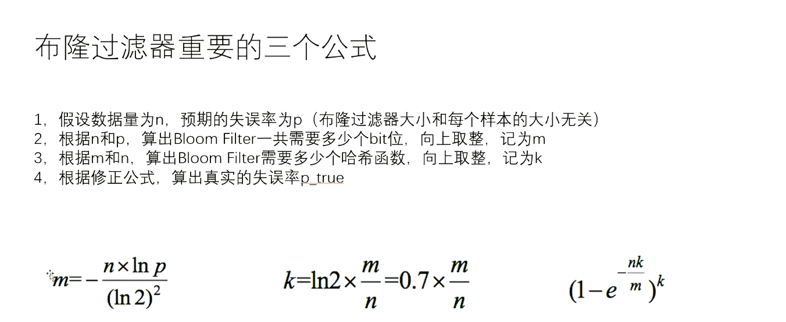 


## 12 哈希函数 + 资源限制题目

```text
笔记
利用外排序，堆，多维堆完成资源限制题目。
小根堆 ： top100 问题 门槛设在堆顶
大根堆 ； less100问题 门槛设在堆顶
```


开胃菜 一个人来到了一个位置 ，请推荐方圆一公里所有的餐馆。

思路 ： 分块。 根据这个人的位置找到块，然后取出上下左右八个方块，在这八个方块查询所有餐馆，然后筛选满足范围的。

#### 一致性哈希

见书上 p 339

```text
一致性哈希
分布式存储结构最常见的结构
1）哈希域变成环的设计
2) 虚拟节点技术

我的笔记
分布式存储 根据哈希值存到不同的数据库
hashKey一定要设计好，高频key,中频key,低频key 也要负载均衡
分布式机器的添加和减少就会非常麻烦 

调整 虚拟节点可以实现 从负载均衡到负载管理
```


#### 岛问题

并行算法的经典问题

这个问题本身并不难，理解如何实现并行算法更为重要（使用了并查集）

```text
岛问题
一个只有0和1两种数字的二维矩阵中，
上下左右能连成一片的1，算一个岛
返回矩阵中，一共有几个岛
```


```text
串行算法分析
来到一个节点 开始感染 把感染过的改成2 每个相连的1都会被感染，是一个递归过程。
然后遍历所有位置即可，找到一个1，结果++，然后感染这个位置。
由于感染递归会导致一个节点最多访问四次，主函数会遍历所有位置，假设是 M * N的矩阵
复杂度就是 O(M * N) 这个复杂度是最低的，不可能没看完所有节点就能得到答案。
```

```java
/**
 * <a href="https://leetcode.com/problems/number-of-islands/submissions/">https://leetcode.com/problems/number-of-islands/submissions/</a>
 * Runtime: 4 ms, faster than 68.49% of Java online submissions for Number of Islands.
 * Memory Usage: 57.7 MB, less than 28.48% of Java online submissions for Number of Islands.
 * @author ：葬花吟留别1851053336@qq.com
 * @description：TODO
 * @date ：2022/6/4 20:58
 */
public class Code01Islands {
    public static int numIslands(char[][] grid) {
        int nums = 0;
        for (int i = 0; i < grid.length; i++) {
            for (int j = 0; j < grid[0].length; j++) {
                if (grid[i][j] == '1') {
                    nums ++;
                    infect(grid, i, j);
                }
            }
        }
        return nums;
    }


    public static void infect(char[][] grid, int row, int col) {
        if (row < 0 || row >= grid.length || col < 0 || col >= grid[0].length) {
            return ;
        }
        if (grid[row][col] == '1') {
            grid[row][col] = '2';
            infect(grid, row, col + 1);
            infect(grid, row, col - 1);
            infect(grid, row + 1, col);
            infect(grid, row - 1, col);
        }
    }

    public static void main(String[] args) {
        char[][] grid = {{'1', '1', '1', '1', '0'}, {'1', '1', '0', '1', '0'}, {'1', '1', '0', '0', '0'}, {'0', '0', '0', '0', '0'}};
        int i = numIslands(grid);
        System.out.println(i);
    }

}
```


```text
并行算法分析
使用 并查集，是一个集合 就不减去一，如果不是一个集合就减一 ，然后union
可以看书。
```


#### 资源限制技巧汇总

```text
资源限制技巧汇总
1)布隆过滤器用于集合的建立与查询，并可以节省大量空间（已讲）
2)一致性哈希解决数据服务器的负载管理问题（已讲）
3)利用并查集结构做岛问题的并行计算（已讲）
4)哈希函数可以把数据按照种类均匀分流
5)位图解决某一范围上数字的出现情况，并可以节省大量空间
6)利用分段统计思想、并进一步节省大量空间
7)利用堆、外排序来做多个处理单元的结果合并
```


#### 限制类 题目一

---

> 32位无符号整数的范围是0~4,294,967,295，
> 现在有一个正好包含40亿个无符号整数的文件
> 可以使用最多1GB的内存，怎么找到出现次数最多的数？

---

那么看一下1GB最多存多少个key-value   => 1*10/8  = 1.25 亿个key - value 

我们使用对每个读取到的整数使用 hash函数计算出一个索引 % 40就可以得到  0-39的值，根据hash函数的性质，

40亿个整数会比较均匀的分布在0-39上，我们一个一个的处理索引，由于1GB最多可以存 1.25亿个key-value

因此一定能处理下每一个索引下的所有数据，然后得到该索引上的出现次数做多的值，然后清空map，继续处理下一个索引。

处理过四十组数据后可以得到最多的结果。

#### 限制类 题目二 

---

> 32位无符号整数的范围是0~4,294,967,295
> 现在有一个正好包含40亿个无符号整数的文件
> 所以在整个范围中必然存在没出现过的数。
> 可以使用最多1GB的内存，怎么找到所有未出现过的数？
> 【进阶】
> 内存限制为10MB,但是只用找到一个没出现过的数即可
> 内存限制为3KB,但是只用找到一个没出现过的数即可
> 内存限制为三个变量，但是只用找到一个没出现过的数即可

---


```text
对于问题一 
使用位图表示
40亿个整数 需要40 * 4 亿个字节存储 = 16 g内存
如果使用位图bitMap 可以使用 1个bit代表一个整数4Byte 于是 只需要 16g/4*8 = 0.5g即可


三个进阶问题思路都是一样的
如果内存很小，考虑可以组成长度为多少的数组 比如为 N, 然后找到不大于N的最大的M, M是2的某次方
比如 3KB = 3000 B = 750 个int  于是N = 750， M = 512
然后使用 2 ^ 32 / M = K ,比如本例的K = 8,388,608
把N想象成一个数组
我们把2 ^ 32这个范围分割成了 512份，每份大小是 K。
然后遍历所有数字 i -> i/K找到其所在的数组位置 该位置 ++
最后如果某个位置的值 》= K,不一定证明这个位置 没有出现过一次的数， 但是如果某个位置的值 < k一定证明这个位置 存在没有出现的数字

然后找到某个位置后，继续进行上面的过程，当可以用3KB的位图表示后 就停止，使用位图遍历那个位置即可

使用三个遍历 就使用二分。每次都二分
一个存储 L, 一个存储R, 一个存储前半段的统计数量。
然后就一直二分，大致32次二分后就得到结果。

这也证明了 二分不一定要求有序。

```


#### 限制类 题目三

---

> 题目三
> 有一个包含100亿个URL的大文件，假设每个URL占用64B,
> 请找出其中所有重复的URL
> 【补充)
> 某搜索公司一天的用户搜索词汇是海量的（百亿数据量），
> 请设计一种求出每天热门Top100词汇的可行办法

---


```text
对于基础问题分析如下

使用hash函数 分割成N个机器进行处理
每个机器 再根据另一个hash函数进行分文件处理，如果内存还不够就再把大文件分割成小文件，直到内存可以装下文件内所有数据。
每个机器 如果内存限制，就不断处理小文件，得到每个文件的重复URL，（这里的道理是因为重复的url，根据hash函数的性质一定会被分到一个文件中，而且每个文件的大小是差不多的，内存不会说在某个文件上不够用了）
然后输出到一个res文件中。把所有文件处理一边，得到这个机器上所有的
重复url.
机器内是串行，机器之间是并行。
把每个机器的res文件汇总输出到一个文件中即可。

进阶问题差不多

使用hash函数 分割成N个机器进行处理。
每个机器 再根据另一个hash函数进行分文件处理，如果内存还不够就再把大文件分割成小文件，直到内存可以装下文件内所有数据。

每个机器串行处理，得到每个文件的Top100（使用小根堆）,然后对所有的文件进行外排序，得到所有的每个机器的top100,
最后并行处理的机器，等待所有机器处理完之后，在从每个机器上的top100获取最终的top100


存疑问题 ？？？
老师好像说组成二维的大根堆比较好，但是内存不是有限吗，我怎么对每个文件进行heapfiy 和 heapinsert感觉 又得全部读到内存，似乎不如遍历。怎么在一个文件里进行堆的调整？ 但是同学好像都懂了。
反正以后还会遇到n维堆

我好像懂了 每个top100的堆占用内存很小，可能是内存够用了。

一个学生写的。
处理每一个小文件的时候，通过哈希表统计每种词及其词频，哈希表记录建立之后，再遍历哈希表，遍历过程中使用小根堆来选择topk。
大根堆用于升序排序（所以求最小的前k个数用大根堆），小根堆用于降序排序（所以求最大的前k个数（常见的topk问题，基本都是求最大的前k个数）用小根堆）

```


#### 限制类 题目四

---

> 题目四
> 32位无符号整数的范围是0~4294967295，
> 现在有40亿个无符号整数，
> 可以使用最多1GB的内存，
> 找出所有出现了两次的数。

---


```text
使用位图表示
40亿个整数 需要40 * 4 亿个字节存储 = 16 g内存
如果使用位图bitMap 可以使用 1个bit代表一个整数4Byte 于是 只需要 16g/4*8 = 0.5g即可

由于我们需要找到的是出现两次的数，因此使用两个bit代替一个整数，只需要 16g/2 * 8 = 1g
这两位数 00 代表0 01代表1 10代表2 11代表大于 2
为什么 11代表大于2呢，因为我们不关心。
我们只用找出现了两次的数，当为10再来一个数就改成 11，如果再来就不变了，也不会出问题
```


#### 限制类 题目五

---

> 题目五
> 32位无符号整数的范围是0~4294967295，现在有40亿个无符号整数
> 可以使用最多10MB的内存，怎么找到这40亿个整数的中位数？

---


```text
和第二题扩展问题差不多

如果内存很小，考虑可以组成长度为多少的数组 比如为 N, 然后找到不大于N的最大的M, M是2的某次方
比如 3KB = 3000 B = 750 个int  于是N = 750， M = 512
然后使用 2 ^ 32 / M = K ,比如本例的K = 8,388,608
把N想象成一个数组
我们把2 ^ 32这个范围分割成了 512份，每份大小是 K。
然后遍历所有数字 i -> i/K找到其所在的数组位置 该位置 ++

然后就是找第20亿小的数
如果在 第 K分 前面的总和是 19亿，如果加上第k份，总和就是 22亿，
那么这个中位数一定在 第k个范围中。

然后在这个范围上 比如是 8,388,608 * K - 8,388,608 * (K + 1)
然后继续分割
于是进行，如果遍历的数字大小不是这个范围，就忽略。是这个范围上的就让对应的位置 ++

如此总能找到答案。


```


#### 限制类 题目六

---

> 题目六
> 32位无符号整数的范围是0~4294967295，
> 有一个10G大小的文件，每一行都装着这种类型的数字，
> 整个文件是无序的，给你5G的内存空间，
> 请你输出一个10G大小的文件，就是原文件所有数字排序的结果

---


```text


我们把这5G内存一部分做 hashMap,一部分做小，他们的大小始终相等，同步更新。

小根堆存储node,node定义为 数字本身 ， 词频两个内容
map key - 数字本身， val - 所在大根堆的位置索引。加速寻找。

小根堆更新策略 ：比堆顶部小的不加入。比堆顶大的加入。并且注意更新索引，和map中的数据

遍历一遍后大根堆 会维持所有最多的K个数，其中K是小根堆的规模，可以事先确定。然后输出到一个文件中。

然后再进行一遍，这次加入一个遍历 ceiling ，大于这个值就直接忽略。于是我又能得到一个范围，然后输出到一个文件中。

。。。
全部进行完毕后
会按照大小范围 得到所有的 文件，然后按照顺序输出即可，比如node 为 3 ，5
那就输出5个三，注意是按照顺序输出即可。


可以通过java 类 RandomAccessFile 进行seek(),可以实现并行输出所有结果，如果感觉还慢，就把文件分割，然后并行输出即可


-- 修正好像无法并行处理，因为我们不知道每个文件的范围，但是强行并行应该也可以实现

```


## 13 搜索二叉树


#### 概念

搜索二叉树
搜索二叉树一定要说明以什么标准来排序
经典的搜索二叉树，树上没有重复的用来排序的ky值
如果有重复节点的需求，可以在一个节点内部增加数据项


#### 搜索二叉树查询key（查询某个key存在还是不存在)

l)如果当前节点的value==key,返回true
2)如果当前节点的value<key,当前节点向左移动
3)如果当前节点的value:>key,当前节点向右移动
4)如果当前节点变成null,返回false


#### 搜索二叉树特别不讲究

1)基础的搜索二叉树，添加、删除时候不照顾平衡性
2)数据状况很差时，性能就很差
给搜索二叉树引入两个动作：左旋、右旋


#### AVL, SBTree, 红黑树概念分析

##### 有序表

有序表的有所操作效率为O(logN)，实现有序表的结构包括红黑树，AVL树，SizeBalance树简称SB树，跳表skiplist。
在时间复杂度层面，上面四种结构是一样的。
其中，红黑树、AVL树、SB树属于 同一个系列，那就是平衡搜索二叉树系列。

##### 平衡搜索二叉树

搜索二叉树
搜索二叉树的定义就是，每个节点小于他的都在其左孩子上，大于他的都在右孩子上。
搜索二叉树的插入操作：
就是依次从头节点开始比较，大于就往右走，小于就往左走，直到找到其位置。
搜索二叉树的删除操作：
没有孩子节点：直接删除
有一个孩子节点：由孩子节点填补删除位置
有左右节点：左树的最右节点或者右树的最右节点填补
搜索二叉树的缺点：如果数据状况不好，就会生成单链表结构，因此，平衡搜索二叉树可以解决这个问题。
平衡搜索二叉树
平衡搜索二叉树就是把不平衡的搜索二叉树，通过左旋和右旋操作，变平衡。平衡操作的基本操作就是左旋和右旋。
右旋
把左孩子上位，然后，把之前的根节点连在左孩子的右边，然后，之前左孩子的右树，连在A左边
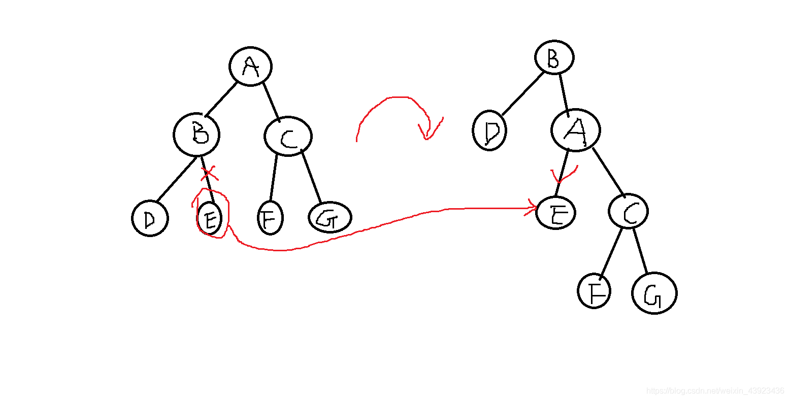
左旋同理

##### AVL树

AVL树的平衡定义：
任意一个节点的左右子树的高度差不能超过1
因此，AVL树的不平衡状态，就包括四种情况：
LL型
左孩子的左树过长，导致不平衡
右旋即可恢复平衡
RR型
右孩子的右树过长，导致不平衡
左旋即可恢复平衡
LR型
左孩子的右树过长，导致不平衡
就让左孩子的右孩子转到头节点，也就是要经过一次左旋后，再右旋一次
RL型
右孩子的左树过长，导致不平衡
就让右孩子的左孩子转到头节点，也就是要经过一次右旋后，再左旋一次

##### 红黑树

红黑树底层也是平衡搜索二叉树，其删除节点、修改节点、查找节点、增加节点、检查时机的操作和AVL树一样。唯一的区别就是，平衡标准不一样，也就是，对于平衡的定义不同，本质上都是平衡搜索二叉树
红黑树定义：
1.每个节点，不是红就是黑
2.头节点和叶子节点（红黑树中，叶节点指底层的空指针节点）必须为黑
3.红节点不能相邻
4.从任意一个节点开始，走到结束的路径中，要求黑节点的数量一样。
分析
因此，分析上述条件，任何一条路径，最长的就是红黑红黑交替嘛，对吧？因为要求红节点不能相邻，只能红黑交替，同时，又要求黑节点一样多，因此，最短路径就是全黑节点。那么，交替情况下的长度，顶多也就是全黑路径长度多一倍。这就是红黑树的平衡定义

##### SB树

每棵子树的大小，不小于其兄弟的子树的大小，也就是每棵叔叔树的大小，不小于任何侄子树的大小。
怎么理解？
假如，一个叔叔节点大小为10，那么，他的两个侄子最大不能超过叔叔，也就是最大为10，加上他们父节点，最大为21，也就是说，爷爷的两个孩子直接，最大差距也就是一倍多一个，这就是SB树的平衡定义。

##### 总结

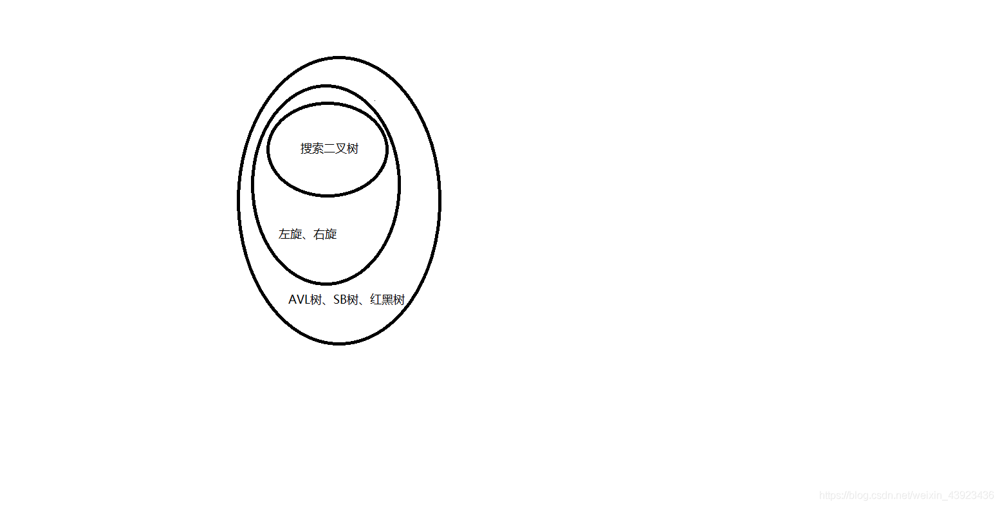
总结来说，AVL树、SB树、红黑树，本质都是二叉搜索树，只不过，在搜索树的前提下，提供了左旋和右旋调整平衡的操作，注意，这三种结构调整平衡的步骤都是左旋右旋。因此，由于这三种结构对平衡的定义不同，因此，出现不平衡的判断条件不同，导致他们调用左旋右旋的策略不同，他们的区别，仅此而已。

## 14 AVL


## 15 Size Balance Tree + Skip List

```text
size : 不同key的个数
谁孩子发生变化谁递归。

为什么Size Balance Tree更快

因为扰动小， 平衡性模糊。删除不需要要再次做平衡调整，因为有递归。

AVL比较慢，因为AVL树， 的平衡性非常严格。

期望 ： 明天记得 写一份数组实现的Size Balance Tree
```


#### Size balance Tree

因为平衡性不严格，因此速度很快，并且删除是可以不调整平衡性。

算法比赛如果要改写 平衡搜索二叉树，最优的就是改写 size balance tree 

```java
public class SBTNode<K extends Comparable<K>, V> {
    K key;
    V val;
    int size;

    SBTNode<K, V> l;
    SBTNode<K, V> r;

    public SBTNode(K key, V val) {
        this.key = key;
        this.val = val;
        this.size = 1;
    }
}
```


```java
public class SBTMap<K extends Comparable<K>, V> {
    private SBTNode<K, V> root;

    private SBTNode<K, V> rightRotate(SBTNode<K, V> node) {
        SBTNode<K, V> left = node.l;
        node.l = left.r;
        left.r = node;
        //调整节点个数
        left.size = node.size;
        node.size = 1 + (node.l == null ? 0 : node.l.size) + (node.r == null ? 0 : node.r.size);
        return left;
    }

    private SBTNode<K, V> leftRotate(SBTNode<K, V> node) {
        SBTNode<K, V> right = node.r;

        node.r = right.l;
        right.l = node;

        //调整节点个数
        right.size = node.size;
        node.size = 1 + (node.l == null ? 0 : node.l.size) + (node.r == null ? 0 : node.r.size);
        return right;
    }

    private SBTNode<K, V> maintain(SBTNode<K, V> node) {

        int l = 0;
        int r = 0;
        int ll = 0;
        int rr = 0;
        int lr = 0;
        int rl = 0;
        if (node.l != null) {
            l = node.l.size;
            if (node.l.l != null) {
                ll = node.l.l.size;
            }
            if (node.l.r != null) {
                lr = node.l.r.size;
            }
        }
        if (node.r != null) {
            r = node.r.size;
            if (node.r.l != null) {
                rl = node.r.l.size;
            }
            if (node.r.r != null) {
                rr = node.r.r.size;
            }
        }

        if (ll > r) {
            node = rightRotate(node);
            node.r = maintain(node.r);
            node = maintain(node);
        } else if (lr > r) {
            node.l = leftRotate(node.l);
            node = rightRotate(node);
            node.l = maintain(node.l);
            node.r = maintain(node.r);
            node = maintain(node);
        } else if (rr > l) {
            node = leftRotate(node);
            node.l = maintain(node.l);
            node = maintain(node);
        } else if (rl > l) {
            node.r = rightRotate(node.r);
            node = leftRotate(node);
            node.l = maintain(node.l);
            node.r = maintain(node.r);
            node = maintain(node);
        }
        return node;
    }

    private SBTNode<K, V> add(SBTNode<K, V> node, K key, V val) {
        if (node == null) {
            return new SBTNode<>(key, val);
        } else {
            node.size++;
            if (key.compareTo(node.key) < 0) {
                //当前key比较小
                node.l = add(node.l, key, val);
            } else {
                node.r = add(node.r, key, val);
            }
            return maintain(node);
        }
    }


    private SBTNode<K, V> delete(SBTNode<K, V> node, K key) {
        node.size --;
        //删除时 节点是一定存在的 否则不会调用此方法
        if (key.compareTo(node.key) < 0) {
            node.l = delete(node.l, key);
        } else if (key.compareTo(node.key) > 0) {
            node.r = delete(node.r, key);
        } else {
            //要删除的节点就是当前节点。
            if (node.r == null) {
                node = node.l;
            } else if (node.l == null) {
                node = node.r;
            } else {
                //有两个孩子
                SBTNode<K, V> successorNodePre = null;
                SBTNode<K, V> successorNode = node.r;
                successorNode.size --;
                while (successorNode.l != null) {
                    successorNodePre = successorNode;
                    successorNode = successorNode.l;
                    successorNode.size --;
                }
                if (successorNodePre != null) {
                    successorNodePre.l = successorNode.r;
                    successorNode.r = node.r;
                }
                successorNode.l = node.l;
                node = successorNode;
                node.size = 1 + (node.l.size) + (node.r == null ? 0 : node.r.size);
            }
        }
//        node = maintain(node);
        return node;
    }

    /**
     * 错误日志 ： 把下面的向左向有的判断写反了，导致全局错误。
     * @param key
     * @return com.lihd.exer.SBTNode<K,V>
     * @author lihd
     * @creed: 春春的飞舞
     * @date 2022/6/6 23:55
     */
    private SBTNode<K, V> getTheCorrectLocation(K key) {
        SBTNode<K, V> pre = root;
        SBTNode<K, V> cur = root;
        while (cur != null) {
            pre = cur;
            if (key.compareTo(cur.key) < 0) {
                cur = cur.l;
            } else if (key.compareTo(cur.key) > 0) {
                cur = cur.r;
            } else {
                return cur;
            }
        }
        return pre;

    }

    public boolean containsKey(K key) {
        SBTNode<K, V> node = getTheCorrectLocation(key);
        return node != null && node.key.compareTo(key) == 0;
    }

    public void put(K key, V val) {
        SBTNode<K, V> node = getTheCorrectLocation(key);
        if (node != null && node.key.compareTo(key) == 0) {
            node.val = val;
        } else {
            root = add(root, key, val);
        }
    }

    public void remove(K key) {
        if (containsKey(key)) {
            root = delete(root, key);
        }
    }

    public V get(K key) {
        SBTNode<K, V> node = getTheCorrectLocation(key);
        return node != null && node.key.compareTo(key) == 0 ? node.val : null;
    }


    public int size() {
        return root != null ? root.size : 0;
    }


}

```


#### Skip List

基础功能的跳表，请书写熟练 因为面试可能真的考。

```java
public class SkipListNode<K extends Comparable<K>, V> {

    K key;
    V val;

    ArrayList<SkipListNode<K, V>> next;

    public SkipListNode(K key, V val) {
        this.key = key;
        this.val = val;
        next = new ArrayList<>();
    }


    public boolean isLess(K key) {
        if (this.key == null || key == null) {
            return true;
        }
        return this.key.compareTo(key) < 0;
    }

    public boolean isEqual(K key) {
        if (this.key == null && key == null) {
            return true;
        }
        if (this.key == null ^ key == null) {
            return false;
        }
        return this.key.compareTo(key) == 0;
    }

}
```


```java
public class SkipListMap<K extends Comparable<K> , V> {

    private static final double POSSIBILITY = 0.5;
    private final SkipListNode<K, V> head;
    private int size;
    private int maxLevel;

    public SkipListMap() {
        this.head = new SkipListNode<>(null, null);
        //添加这个null 必不可少
        head.next.add(null);
    }


    public V remove(K key) {
        V ans = null;
        if (containsKey(key)) {
            size --;
            int level = maxLevel;
            SkipListNode<K,V> cur = head;
            while (level >= 0) {
                cur = getTheRightNodeOfTheCurrentLevel(cur, key, level);
                if (cur.next.get(level) != null && cur.next.get(level).isEqual(key)) {
                    //不能是 cur是空的时候删除，因为那样就没办法删除了
                    ans = cur.next.get(level).val;
                    cur.next.set(level, cur.next.get(level).next.get(level));
                }

                if (level != 0 && cur == head && cur.isEqual(null)) {
                    head.next.remove(level);
                    maxLevel --;
                }
                level --;
            }
        }
        return ans;
    }


    public void put(K key, V val) {
        if (containsKey(key)) {
            SkipListNode<K, V> node = getTheRightNodeOfTheZeroLevel(key);
            node.next.get(0).val = val;
        } else {
            //新增节点
            size ++;
            int addLevel = 0;
            while (Math.random() < POSSIBILITY) {
                addLevel ++;
            }

            while (addLevel > maxLevel) {
                head.next.add(null);
                maxLevel ++;
            }

            SkipListNode<K, V> addNode = new SkipListNode<>(key, val);
            for (int i = 0; i <= addLevel; i++) {
                addNode.next.add(null);
            }

            int level = maxLevel;
            SkipListNode<K, V> cur = head;
            while (level >= 0) {
                cur = getTheRightNodeOfTheCurrentLevel(cur, key, level);
                if (addLevel >= level) {
                    addNode.next.set(level, cur.next.get(level));
                    cur.next.set(level, addNode);
                }
                level --;
            }
        }
    }

    public V get(K key) {
        SkipListNode<K, V> node = getTheRightNodeOfTheZeroLevel(key);
        return node.next.get(0) != null && node.next.get(0).isEqual(key) ? node.next.get(0).val : null;
    }


    public boolean containsKey(K key) {
        SkipListNode<K, V> node = getTheRightNodeOfTheZeroLevel(key);
        return node.next.get(0) != null && node.next.get(0).isEqual(key);
    }

    public SkipListNode<K, V> getTheRightNodeOfTheZeroLevel(K key) {
        SkipListNode<K, V> cur = head;
        int level = maxLevel;
        while (level >= 0) {
            cur = getTheRightNodeOfTheCurrentLevel(cur, key, level);
            level --;
        }
        return cur;
    }

    public SkipListNode<K, V> getTheRightNodeOfTheCurrentLevel(SkipListNode<K, V> cur, K key, int level) {
        SkipListNode<K, V> next = cur.next.get(level);
        while (next != null && next.isLess(key)) {
            cur = next;
            next = next.next.get(level);
        }
        return cur;
    }

    public K firstKey() {
        return head.next.get(0) != null ? head.next.get(0).key : null;
    }

    public K lastKey() {
        return getTheRightNodeOfTheZeroLevel(null).key;
    }

    public K ceilingKey(K key) {
        SkipListNode<K, V> node = getTheRightNodeOfTheZeroLevel(key);
        SkipListNode<K, V> next = node.next.get(0);
        if (next == null ) {
            return null;
        }
        return next.key;
    }

    public K floorKey(K key) {
        SkipListNode<K, V> node = getTheRightNodeOfTheZeroLevel(key);
        SkipListNode<K, V> next = node.next.get(0);
        if (next == null ) {
            return node.key;
        }
        if (node.isEqual(next.key)) {
            return next.key;
        }
        return node.key;
    }

    public int size() {
        return size;
    }


}

```


#### 测试代码

```java
/**
 * 感觉测试这么多次，应该是对的。只不过测的方法比较少。
 * @author ：葬花吟留别1851053336@qq.com
 * @description：TODO
 * @date ：2022/6/6 22:58
 */
public class OrderedListTest {

    public static SBTMap<Integer, Integer> sbtMap = new SBTMap<>();
    public static SkipListMap<Integer, Integer> slMap = new SkipListMap<>();
//    public static com.lihd.part05.SkipListMap<Integer, Integer> slMap = new com.lihd.part05.SkipListMap<>();
    public static TreeMap<Integer, Integer> treeMap = new TreeMap<>();

    public static final int maxVal = 50;

    public static int getRandomVal() {
        return (int) (Math.random() * maxVal) + 1;
    }

    public static void add() {
        int key = getRandomVal();
        int val = getRandomVal();
//        System.out.println("增加了 " + key + "  " + val);
        sbtMap.put(key,val);
        slMap.put(key,val);
        treeMap.put(key, val);
    }

    public static void remove() {
        int key = getRandomVal();
//        System.out.println("删除了 " + key + "  ");
        sbtMap.remove(key);
        slMap.remove(key);
        treeMap.remove(key);
    }

    public static void get() {
        int key = getRandomVal();
        Integer a = sbtMap.get(key);
        Integer b = slMap.get(key);
        Integer c = treeMap.get(key);
//        System.out.println("获取了 " + key + "   "+ a + "  " + b + "  " + c);
        if (!Objects.equals(a, b) || !Objects.equals(a, c)) {
            System.out.println(key + "  get 出错 ： " + a + "  " + b + "  " + c);
        }
    }

    public static void size() {
        int size1 = sbtMap.size();
        int size2 = slMap.size();
        int size3 = treeMap.size();
//        System.out.println("长度 "  + size1 + "  " + size2 + "  " + size3);
        if (size1 != size2 || size1 != size3) {
            System.out.println("size 出错 ： " + size1 + "  " + size2 + "  " + size3);
        }
    }


    public static void main(String[] args) {
        int testTimes = 500_0000;
        for (int i = 0; i < testTimes; i++) {
            add();
            get();
            remove();
            size();
        }
        System.out.println("测试结束");
    }


}

```

## 16 有序表总结 + 题目 + AC自动机


#### 有序表总结

搜索二叉树 + 左旋右旋 + 各自独特的调整方式 = 平衡搜索二叉树

平衡搜索二叉树 ： AVL + Size Balance Tree + Red Balck Tree 他们的调整方式各不相同

AVL ： 平衡定义最严格

SBTree : 算法比赛改写的常用结构

RBTree ：刁难人的结构，IO次数较少，

另一结构也可以实现logN复杂度的增删改查 ： SkipList 跳表 redis底层使用了跳表。可能会考查手写。结构比较先进。


什么时候使用 红黑树 ： 有时候我们不考虑磁盘IO就使用AVL, SB,但是磁盘IO非常慢，可以考虑使用 B B+树

那么红黑树就是介于两者关系直接的，需要在调和平衡的情况下使用。插入违规情况5种，删除违规情况8种，学习成本比较高。


#### 改写题目

增加字段能在搜索二叉树中可以玩明白的事情， 一定能该出来


#### AC自动机

发明的人确实很强，仰望着几十年前大佬发明的东西，学习起来理解困难，我感觉到很无力，似乎永远也看不见光。

何时，我也能成为计算机的一道光呢？

fail的含义 必须以e结尾，哪一个另外的前缀串，和我以e结尾的后缀串彻底相等，并且长度最大。

可以理解为 ：


#### 题目一

在一堆数组中找到一个范围，数组上的每个值都至少存在一个在这个范围上的数，并且这个范围是最小的，如果同时存在多个最小的，找到开始值最小的范围最小的范围。

#### 题目二 leetcode

---

> 需要改写有序表的题目一
> 给定一个数组arr,和两个整数a和b(a<=b)
> 求arr中有多少个子数组，累加和在[a.b]这个范围上
> 返回达标的子数组数量

---

#### 题目三 leetcode

----

> 需要改写有序表的题目二
> 有一个滑动窗口（讲过的）：
> 1)L是滑动窗口最左位置、R是滑动窗口最右位置，一开始LR都在数组左侧
> 2)任何一步都可能R往右动，表示某个数进了窗口
> 3)任何一步都可能往右动，表示某个数出了窗口
> 想知道每一个窗口状态的中位数

---

